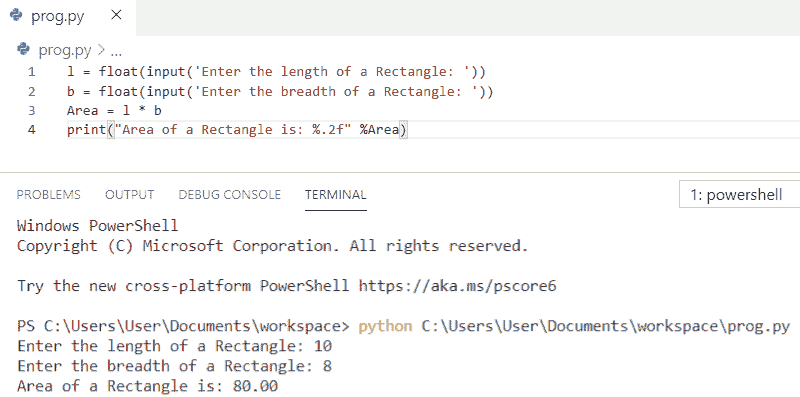
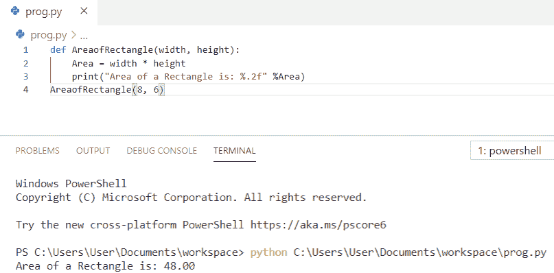
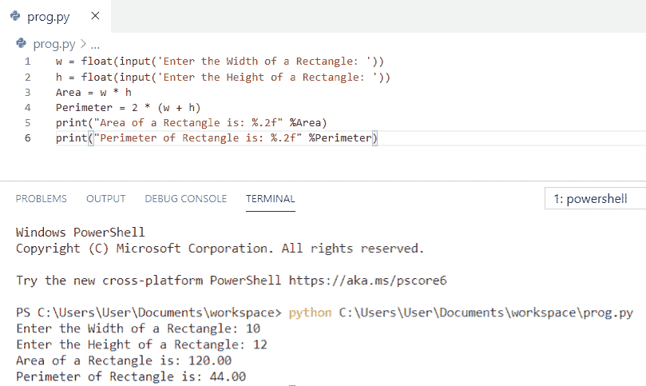
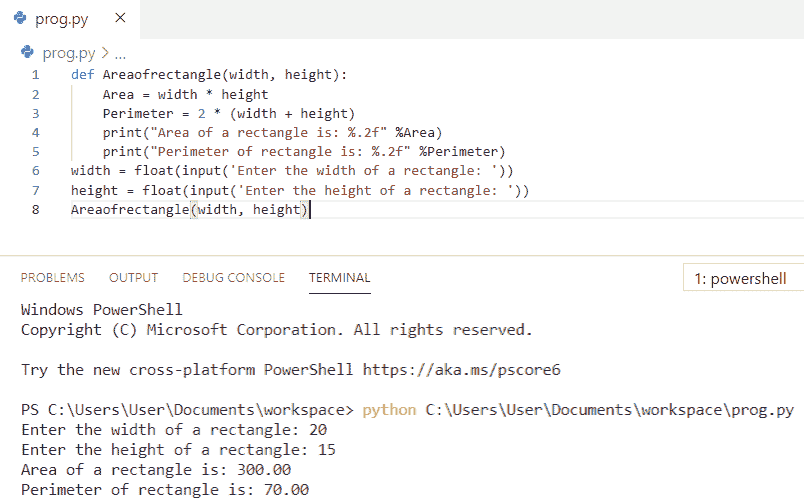
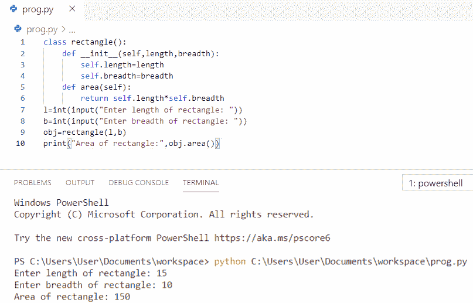

# Python 程序求矩形的面积

> 原文：<https://pythonguides.com/python-program-to-find-an-area-of-a-rectangle/>

[](https://sharepointsky.teachable.com/p/python-and-machine-learning-training-course)

在这个 [python 教程中，](https://pythonguides.com/python-hello-world-program/)你将学习到 **Python 程序来寻找一个矩形的面积**，并且我们还将检查 **:**

*   如何在 Python 中求矩形的面积
*   使用函数计算矩形面积的 Python 程序
*   如何在 Python 中求矩形的面积和周长
*   Python 程序使用函数求矩形的面积和周长
*   如何使用 Python 中的类求矩形的面积

目录

[](#)

*   [Python 程序求矩形的面积](#Python_program_to_find_an_area_of_a_rectangle "Python program to find an area of a rectangle")
*   [使用函数](#Python_program_to_calculate_area_of_a_rectangle_using_function "Python program to calculate area of a rectangle using function")计算矩形面积的 Python 程序
*   [Python 程序求矩形的面积和周长](#Python_program_to_find_area_and_perimeter_of_a_rectangle "Python program to find area and perimeter of a rectangle")
*   [Python 程序使用函数](#Python_program_to_find_the_area_and_perimeter_of_a_rectangle_using_function "Python program to find the area and perimeter of a rectangle using function")求矩形的面积和周长
*   [Python 程序使用类寻找矩形的面积](#Python_program_to_find_area_of_a_rectangle_using_classes "Python program to find area of a rectangle using classes")

## Python 程序求矩形的面积

让我们看看 **python 程序求矩形**的面积。

*   首先，我们将使用 `input()` 函数接受用户对**长度**和**宽度**的输入。
*   现在，我们将使用公式 `Area = l * b` 来计算矩形的面积。
*   最后，**打印**一个矩形的面积看输出。

**举例:**

```py
l = float(input('Enter the length of a Rectangle: '))
b = float(input('Enter the breadth of a Rectangle: '))
Area = l * b
print("Area of a Rectangle is: %.2f" %Area)
```

你可以参考下面的截图，看看 python 程序求矩形面积的输出。



Python program to find an area of a rectangle

我们可以用 Python 中的代码**找到一个矩形的面积。**

还有，查一下，[如何在 Python 中计算单利](https://pythonguides.com/calculate-simple-interest-in-python/)和[如何在 Python 中求三角形的面积](https://pythonguides.com/find-area-of-a-triangle-in-python/)？

## 使用函数计算矩形面积的 Python 程序

在这里，我们将看到使用函数计算矩形面积的 **python 程序。**

*   首先，我们将**使用 def 关键字定义一个带有两个参数的函数**。
*   现在，我们将使用公式`Area = width *``height`计算函数内部矩形的面积。
*   用户将输入矩形的**宽度**和**高度**，我们将把这些值传递给函数参数。
*   最后，**打印**一个矩形的面积看输出。

**举例:**

```py
def AreaofRectangle(width, height):
    Area = width * height
    print("Area of a Rectangle is: %.2f" %Area)
AreaofRectangle(8, 6)
```

你可以参考下面的截图来查看 python 程序使用函数计算矩形面积的输出。



Python program to calculate the area of a rectangle using function

上面的代码，我们可以用 Python 中的函数来**计算矩形的面积。**

检查完毕， [Python 程序打印图案](https://pythonguides.com/print-pattern-in-python/)。

## Python 程序求矩形的面积和周长

现在，我们将看到 **python 程序寻找矩形**的面积和周长。

*   首先，我们将使用 `input()` 函数接受用户对**长度**和**宽度**的输入。
*   现在，我们将使用公式**面积= w * h** 来计算矩形的**面积**。
*   接下来，我们正在计算一个矩形的**周长****周长= 2 * (w + h)**
*   最后，**打印**一个矩形的面积和周长，看输出。

**举例:**

```py
w = float(input('Enter the Width of a Rectangle: '))
h = float(input('Enter the Height of a Rectangle: '))
Area = w * h
Perimeter = 2 * (w + h)
print("Area of a Rectangle is: %.2f" %Area)
print("Perimeter of Rectangle is: %.2f" %Perimeter)
```

你可以参考下面的截图来查看 **python 程序的输出，以找到矩形的面积和周长。**



Python program to find area and perimeter of a rectangle

上面的代码，我们可以用 Python 中的**求矩形的面积和周长**。

你可能也喜欢， [Python 程序求平方](https://pythonguides.com/python-program-to-find-the-area-of-square/)的面积。

## Python 程序使用函数求矩形的面积和周长

让我们看一下 **python 程序，用函数**求矩形的面积和周长。

*   首先，我们将**使用 def 关键字定义一个带有两个参数的函数**。
*   现在，我们将使用公式`Area = width *``height`计算函数内部矩形的面积。
*   接下来，我们使用公式**周长= 2 *(宽度+高度)**计算函数内部矩形的**周长**。
*   允许用户通过使用**输入**函数输入矩形的**宽度**和**高度**，我们将把这些值传递给函数参数。
*   最后，**打印**一个矩形的面积和周长，看输出。

**举例:**

```py
def Areaofrectangle(width, height):
    Area = width * height
    Perimeter = 2 * (width + height)
    print("Area of a rectangle is: %.2f" %Area)
    print("Perimeter of rectangle is: %.2f" %Perimeter)
width = float(input('Enter the width of a rectangle: '))
height = float(input('Enter the height of a rectangle: '))
Areaofrectangle(width, height)
```

你可以参考下面的截图来查看 python 程序的输出，使用函数来查找矩形的面积和周长。



Python program to find the area and perimeter of a rectangle using function

上面的 Python 代码我们可以用函数来求矩形的面积和周长。

阅读，[如何在 Python 中打印一个数的阶乘](https://pythonguides.com/factorial-of-a-number-in-python/)。

## Python 程序使用类寻找矩形的面积

让我们看一下 **python 程序，用类**求矩形的面积。

*   首先，我们将创建一个名为 `rectangle` 的类，并使用 `__init__()` 方法来初始化该类的值。
*   一个叫做 `area(self)` 的方法返回`self . length * self . width`也就是类的面积。
*   **用户通过**输入**功能将**长度**和**宽度**的值输入**。
*   该类的一个**对象**被创建为 **obj=rectangle(l，b)**
*   通过使用该对象，方法 `area()` 被调用，周长作为长度和宽度取自用户。
*   最后，**打印**一个矩形的面积看输出。

**举例:**

```py
class rectangle():
    def __init__(self,length,breadth):
        self.length=length
        self.breadth=breadth
    def area(self):
        return self.length*self.breadth
l=int(input("Enter length of rectangle: "))
b=int(input("Enter breadth of rectangle: "))
obj=rectangle(l,b)
print("Area of rectangle:",obj.area())
```

你可以参考下面的截图，看看 **python 程序使用类**求矩形面积的输出。



Python program to find the area of a rectangle using classes

这是使用类查找矩形面积的 **Python 程序。**

您可能会喜欢以下 Python 教程:

*   [如何在 Python 中计算圆的面积](https://pythonguides.com/calculate-area-of-a-circle-in-python/)
*   [如何打印 Python 斐波那契数列](https://pythonguides.com/python-fibonacci-series/)
*   [如何在 Python 中交换两个数](https://pythonguides.com/swap-two-numbers-in-python/)
*   [如何在 Python 中减去两个数](https://pythonguides.com/subtract-two-numbers-in-python/)
*   [Python 中两个数如何除法](https://pythonguides.com/divide-two-numbers-in-python/)
*   [PdfFileReader Python 示例](https://pythonguides.com/pdffilereader-python-example/)

在本 Python 教程中，我们学习了用于计算矩形面积的 **Python 程序。此外，我们还讨论了以下主题:**

*   Python 程序求矩形的面积
*   使用函数计算矩形面积的 Python 程序
*   Python 程序求矩形的面积和周长
*   Python 程序使用函数求矩形的面积和周长
*   Python 程序使用类来计算矩形的面积

[Bijay Kumar](https://pythonguides.com/author/fewlines4biju/)

Python 是美国最流行的语言之一。我从事 Python 工作已经有很长时间了，我在与 Tkinter、Pandas、NumPy、Turtle、Django、Matplotlib、Tensorflow、Scipy、Scikit-Learn 等各种库合作方面拥有专业知识。我有与美国、加拿大、英国、澳大利亚、新西兰等国家的各种客户合作的经验。查看我的个人资料。

[enjoysharepoint.com/](https://enjoysharepoint.com/)[](https://www.facebook.com/fewlines4biju "Facebook")[](https://www.linkedin.com/in/fewlines4biju/ "Linkedin")[](https://twitter.com/fewlines4biju "Twitter")