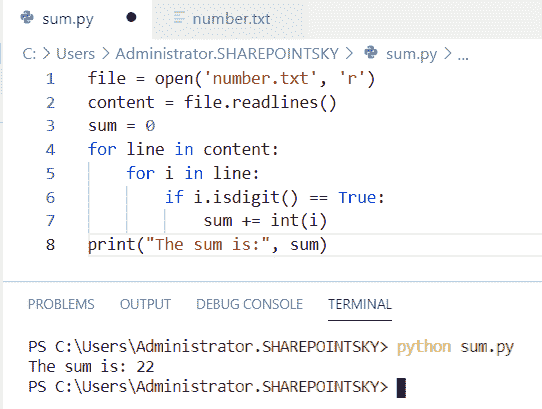

# Python 程序寻找 n 个数的和，并附有例子

> 原文：<https://pythonguides.com/python-program-to-find-sum-of-n-numbers/>

[](https://sharepointsky.teachable.com/p/python-and-machine-learning-training-course)

在这个 [python 教程中，](https://pythonguides.com/python-hello-world-program/)你将学习到 **Python 程序来寻找 n 个数的和**，我们还将检查 **:**

*   Python 程序求 3 个数之和
*   使用 for 循环查找 n 个数之和的 Python 程序
*   使用函数计算 n 个数之和的 Python 程序
*   使用 while 循环查找 n 个数之和的 Python 程序
*   使用递归查找 n 个数和的 python 程序
*   Python 程序求 n 个偶数的和
*   Python 程序求 n 个奇数的和
*   Python 程序求 n 个质数之和
*   Python 程序查找前 n 个数的和
*   Python 程序求前 n 个偶数的和
*   Python 程序查找列表中数字的总和
*   Python 程序，用于查找字符串中数字的总和
*   Python 程序查找文件中数字的总和

目录

[](#)

*   [Python 程序求 3 个数之和](#Python_program_to_find_sum_of_3_numbers "Python program to find sum of 3 numbers")
*   [Python 程序使用 for 循环求 n 个数之和](#Python_program_to_find_sum_of_n_numbers_using_for_loop "Python program to find sum of n numbers using for loop")
*   [使用函数](#Python_program_to_find_sum_of_n_numbers_using_a_function "Python program to find sum of n numbers using a function")计算 n 个数之和的 Python 程序
*   [Python 程序使用 while 循环寻找 n 个数的和](#Python_program_to_find_sum_of_n_numbers_using_while_loop "Python program to find sum of n numbers using while loop")
*   [Python 程序使用递归计算 n 个数的和](#Python_program_to_find_sum_of_n_numbers_using_recursion "Python program to find sum of n numbers using recursion")
*   [Python 程序求 n 个偶数之和](#Python_program_to_find_sum_of_n_even_numbers "Python program to find sum of n even numbers")
*   [Python 程序求 n 个奇数之和](#Python_program_to_find_sum_of_n_odd_numbers "Python program to find sum of n odd numbers")
*   [Python 程序求 n 个素数之和](#Python_program_to_find_sum_of_n_prime_numbers "Python program to find sum of n prime numbers")
*   [Python 程序求前 n 个数之和](#Python_program_to_find_sum_of_first_n_numbers "Python program to find sum of first n numbers")
*   [Python 程序求前 n 个偶数的和](#Python_program_to_find_sum_of_first_n_even_numbers "Python program to find sum of first n even numbers")
*   [Python 程序求列表中数字的和](#Python_program_to_find_sum_of_numbers_in_a_list "Python program to find sum of numbers in a list")
*   [Python 程序求字符串中数字的和](#Python_program_to_find_sum_of_numbers_in_a_string "Python program to find sum of numbers in a string")
*   [Python 程序寻找文件中数字的和](#Python_program_to_find_sum_of_numbers_in_a_file "Python program to find sum of numbers in a file")

## Python 程序求 3 个数之和

现在，我们可以看到**如何在 python 中求 3 个数**的和。

在这个例子中，我有三个输入。使用了 `int` 数据类型，并使用了 `"+"` 运算符来计算三个数的和。

示例:

```py
number1 = input('Enter first number: ')
number2 = input('Enter second number: ')
number3 = input('Enter third number')
sum = int(number1) + int(number2) + int(number3)
print(sum)
```

我们可以看到三个输入的和是 `16` 作为输出。您可以参考下面的输出截图。


Python program to find the sum of 3 numbers

这是如何在 Python 中求 3 个数之和。

你可能喜欢读，[如何在 Python 中打印一个数的阶乘](https://pythonguides.com/factorial-of-a-number-in-python/)和[如何在 Python 中计算单利](https://pythonguides.com/calculate-simple-interest-in-python/)。

## Python 程序使用 for 循环求 n 个数之和

这里我们可以**如何用 python 中的 for 循环**求 n 个数之和。

*   在这个例子中，我接受了一个输入。int 数据类型仅用于对整数求和。
*   这里我们可以取一个初始值 `sum = 0` 。for 循环用于迭代次数+ 1 用于将次数增加到给定的输入。
*   `sum = sum + value` 用于求和。
*   为了得到输出，我使用了 `print(sum)` 。

示例:

```py
number = int(input("Enter the Number: "))
sum = 0
for value in range(1, number + 1):
    sum = sum + value
print(sum) 
```

我们可以看到 10 之前的数字之和是 55 作为输出。您可以参考下面的输出截图。


Python program to find the sum of n numbers using for loop

这就是如何在 Python 中使用 for 循环来**求 n 个数的和。**

你可能会喜欢 [Python For 循环的例子](https://pythonguides.com/python-for-loop/)

## 使用函数计算 n 个数之和的 Python 程序

这里我们可以**如何用 python 中的函数**求 n 个数的和。

*   在这个例子中，我接受了一个输入。该函数定义为 `def sum(n)` 。
*   如果输入小于 1，则使用 if 条件返回 n，如果输入大于 1，则执行 else 条件，然后将 n 加到 **sum(n-1)中。**
*   **print(" sum is:"，sum(num))** 用于获取输出。

示例:

```py
num = int(input("Enter a number: "))
def sum(n):
    if n <= 1:
        return n
    else:
        return n + sum(n-1)
print("The sum is: ", sum(num))
```

因为输入是 6。我们可以看到输出的数字之和是 21。下面的截图显示了输出。


Python program to find the sum of n numbers using a function

这就是如何使用 Python 中的函数**求出 n 个数的和。**

你可能会喜欢，Python 中的[函数。](https://pythonguides.com/function-in-python/)

## Python 程序使用 while 循环寻找 n 个数的和

现在，我们可以看到**如何使用 python 中的 while 循环**求 n 个数的和。

*   在这个例子中，我接受了一个输入。如果输入小于 0，则使用 if 条件，然后显示**打印("输入一个正数")**。
*   如果数字大于 0，则执行 else 条件，如果 `sum =0` ，则当数字大于 0 时执行 while 条件。
*   `sum += input` 用于增加一个值，而 `input -= 1` 用于减少一个值。

示例:

```py
input = int(input("Enter a number: "))  
if input < 0:  
   print("Enter a positive number")  
else:  
   sum = 0  
   while(input > 0):  
       sum += input  
       input -= 1  
   print("The result is",sum) 
```

下面的屏幕截图显示了数字的总和作为输出。


python program to find sum of n numbers using while loop

上面的代码，我们可以用 Python 中的 while 循环来求 n 个数的和。

在 Python 中检查 [While 循环。](https://pythonguides.com/python-while-loop/)

## Python 程序使用递归计算 n 个数的和

在这里，我们可以看到**如何使用 python 中的递归**来求 n 个数的和。

*   [Python 递归](https://pythonguides.com/python-recursion/)的意思是调用函数本身。
*   在这个例子中，我定义了一个函数为 `def recursion(n)` 。
*   使用 if 条件，如果数字小于 9，它应该返回数字本身。
*   如果该数字大于或等于 9，则返回**n+recursion(n–1)**。
*   `print(recursion(n))` 用于获取输出。

示例:

```py
def  recursion(n): 
	if n <= 1: 
		return n 
	return n +  recursion(n - 1) 
n = 9
print(recursion(n)) 
```

下面的屏幕截图显示了输出的数字之和，最大为 9。


Python program to find sum of n numbers using recursion

上面的代码我们可以用 Python 中的递归来**求 n 个数的和。**

## Python 程序求 n 个偶数之和

现在，我们可以看到**如何在 python 中求 n 个偶数的和**

*   在这个例子中，我接受了一个输入。初始值设定为**总计= 0**
*   for 循环用于迭代。我用过 **range 函数()**。
*   if 条件用作**数% 2 ==0** 得到偶数。
*   `print(number)` 用于获取偶数
*   `total = total + number` 用于求偶数之和。

示例:

```py
Even = int(input("Enter the input"))
total = 0
for number in range(1, Even+1):
    if(number % 2 == 0):
        print(number)
        total = total + number
print("The sum of even numbers", total)
```

偶数之和就是输出。您可以参考下面的输出截图。


python program to find sum of n even numbers

这就是如何在 Python 中**求 n 个偶数的和。**

## Python 程序求 n 个奇数之和

这里可以看到**如何用 python 求 n 个奇数的和**

*   在这个例子中，我接受了一个输入。初始值设定为 **total = 0。**
*   for 循环用于迭代。我用过测距功能。
*   if 条件被用作**号% 2！=0** 得到奇数。
*   `print(number)` 用于获取奇数。
*   `total = total + number` 用于求奇数之和。

示例:

```py
Odd = int(input("Enter the input"))
total = 0
for number in range(1, Odd+1):
    if(number % 2!=0):
        print(number)
        total = total + number
print("The sum of odd numbers", total)
```

我们可以将奇数之和视为输出。您可以参考下面的输出截图。


Python program to find the sum of n odd numbers

这段代码，我们可以用 Python 来**求 n 个奇数之和。**

## Python 程序求 n 个素数之和

这里可以看到**如何用 python 求 n 个质数的和**。

*   在这个例子中，我接受了一个输入。初始值设定为 `sum = 0` 。
*   for 循环用于迭代。range 函数用于指定数字之间的范围限制为 **(2，输入+ 1)** 。
*   break 循环用于终止当前循环，并在下一条语句处继续执行。
*   如果条件用于检查数字是否是质数。**如果 I 不是 num** 则使用递增运算符。
*   为了得到输出，我使用了**print(" sum of prime numbers up to "，input，":"，sum)** 。

示例:

```py
input = int(input("Enter a prime number"))
sum = 0
for num in range(2, input + 1):
    i = 2
    for i in range(2, num):
        if (int(num % i) == 0):
            i = num
            break;
    if i is not num:
        sum += num
print("The sum of prime numbers upto", input, ":", sum)
```

我们可以看到给定范围内的素数之和作为输出。您可以参考下面的输出截图。


Python program to find the sum of n prime numbers

这就是如何在 Python 中**求 n 个质数之和。**

你可能喜欢读，[检查一个数是否是素数 Python](https://pythonguides.com/check-if-a-number-is-a-prime-python/) 。

## Python 程序求前 n 个数之和

这里可以看到**如何在 python 中求前 n 个数**的和。

*   在这个例子中，我取了 input，初始值设为 0，因为 `sum = 0` 。
*   for 循环用于迭代，range 函数用于查找给定输入范围之间的和。
*   **输入+ 1** 用于增量，将我用过的数字**相加= sum + num** 。
*   我已经使用了 **print("前 n 个数的结果"，sum)** 来获得输出。

示例:

```py
input = int(input("Enter number"))
sum = 0
for num in range(input + 1):
    sum = sum + num
print("Result of first n numbers ",sum)
```

下面的屏幕截图显示了前 n 个数字的总和作为输出。


Python program to find the sum of first n numbers

我们可以用上面的代码**在 Python** 中找到前 n 个数的和。

## Python 程序求前 n 个偶数的和

现在，我们可以看到**如何在 python 中求前 n 个偶数的和**。

*   在这个例子中，我将一个输入的初始值设为 0，因为 `sum = 0` 。
*   range 函数用于查找用户输入的数字范围之和。
*   **if((i % 2) == 0)** 用于检查给定的数是否为偶数。
*   如果数字是偶数，则使用 `sum = sum + i` 将数字相加。

示例:

```py
input = int(input("Enter the input "))
sum = 0
for i in range(1, input + 1):
    if((i % 2) == 0):
        sum = sum + i
print("Sum of even numbers from 1 to", input, "is :", sum)
```

下面的屏幕截图显示了偶数的总和作为输出。


Python program to find the sum of first n even numbers

上面的代码我们可以用来**在 Python** 中求前 n 个偶数的和。

## Python 程序求列表中数字的和

现在，我们可以看到**如何在 python 中找到列表**中数字的和

*   在这个例子中，我将初始值设为 0。
*   该列表被赋值为**list =【1，4，2，3，7】**。for 循环用于迭代
*   **sum = sum + list[ele]** 用于从列表中找出数字的和。
*   我已经使用了 **print("列表中元素的总和: "，sum)** 来获得输出。

示例:

```py
sum = 0
list = [1, 4, 2, 3, 7] 
for ele in range(0, len(list)):
	sum = sum + list[ele]
print("Sum of elements in list: ", sum)
```

我们可以将列表中数字的总和 17 作为输出。您可以参考下面的输出截图。


Python program to find the sum of numbers in a list

这是一个 Python 程序，用来计算列表中数字的和。

## Python 程序求字符串中数字的和

现在，我们可以看到如何在 python 中找到字符串中数字的和

*   在这个例子中，我把输入的初始值设为 0，因为 `sum = 0` 。
*   for 循环用于迭代 if 条件和**。isnumeric()** 方法用于将输入作为字母数字。
*   **sum+int(i)，**这里 int 仅用于将字母数字串中的数字相加。
*   我已经用 `print(sum)` 得到了输出。

示例:

```py
string = input("Enter the String: ")
sum = 0
for i in string:
    if( i.isnumeric() ):
        sum = sum+int(i)
print(sum)
```

在下面的截图中，我们可以看到输入为 `1a2b34` ，输出为数字总和 10。


Python program to find the sum of numbers in a string

这是在 Python 中**查找字符串中数字总和的代码。**

## Python 程序寻找文件中数字的和

现在，我们可以看到**如何在 python 中找到文件**中数字的和

*   在这个例子中，我打开了一个包含数字的文件。 `number.txt` 是文件的名称。
*   `file.readlines()` 用于从文件中读取数字。
*   for 循环用于迭代，**。isdidgits()** 用于检查文件中的字符是一个数字。
*   `int(i)` 仅在文件中存在该数字时用于加法。
*   我已经用**print(" sum is:"，sum)** 得到了输出。

示例:

```py
file = open('number.txt', 'r') 
content = file.readlines() 
sum = 0
for line in content: 
	for i in line: 
		if i.isdigit() == True: 
			sum += int(i) 
print("The sum is:", sum) 
```

下面的截图显示了文件的内容。


find sum of numbers in a file in python

文件中的数字相加，输出为 22。您可以参考下面的输出截图。



Python program to find the sum of numbers in a file

上面的代码，我们可以用 Python 在一个文件中找到数字的和。

您可能会喜欢以下 python 教程:

*   [Python 程序打印质数](https://pythonguides.com/python-program-to-print-prime-numbers/)
*   [Python 格式数字加逗号](https://pythonguides.com/python-format-number-with-commas/)
*   [Python 生成随机数和字符串](https://pythonguides.com/python-generate-random-number/)
*   [Python 方块一号](https://pythonguides.com/python-square-a-number/)
*   [Python 程序打印数组中的元素](https://pythonguides.com/python-program-to-print-element-in-an-array/)

在本 Python 教程中，我们学习了用于计算数字总和的 **Python 程序。此外，我们还讨论了以下主题:**

*   Python 程序求 3 个数之和
*   使用 for 循环查找 n 个数之和的 Python 程序
*   使用函数计算 n 个数之和的 Python 程序
*   使用 while 循环查找 n 个数之和的 Python 程序
*   python 程序使用递归计算 n 个数的和
*   Python 程序求 n 个偶数的和
*   Python 程序求 n 个奇数的和
*   Python 程序求 n 个质数之和
*   计算前 n 个数总和的 Python 程序
*   Python 程序，用于查找前 n 个偶数的和
*   Python 程序，用于计算列表中数字的总和
*   Python 程序，用于计算字符串中数字的总和
*   Python 程序，用于查找文件中数字的总和

[Bijay Kumar](https://pythonguides.com/author/fewlines4biju/)

Python 是美国最流行的语言之一。我从事 Python 工作已经有很长时间了，我在与 Tkinter、Pandas、NumPy、Turtle、Django、Matplotlib、Tensorflow、Scipy、Scikit-Learn 等各种库合作方面拥有专业知识。我有与美国、加拿大、英国、澳大利亚、新西兰等国家的各种客户合作的经验。查看我的个人资料。

[enjoysharepoint.com/](https://enjoysharepoint.com/)[](https://www.facebook.com/fewlines4biju "Facebook")[](https://www.linkedin.com/in/fewlines4biju/ "Linkedin")[](https://twitter.com/fewlines4biju "Twitter")