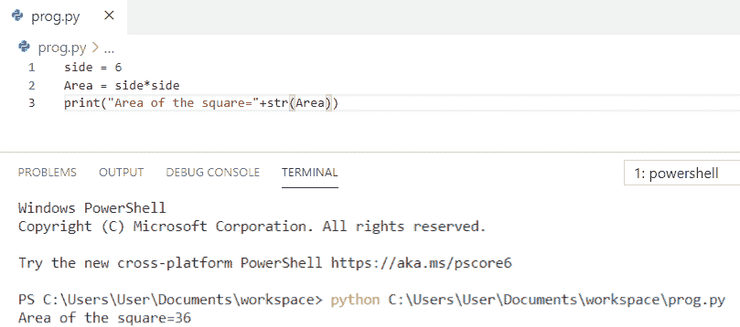
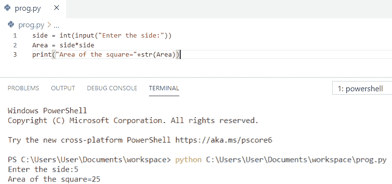
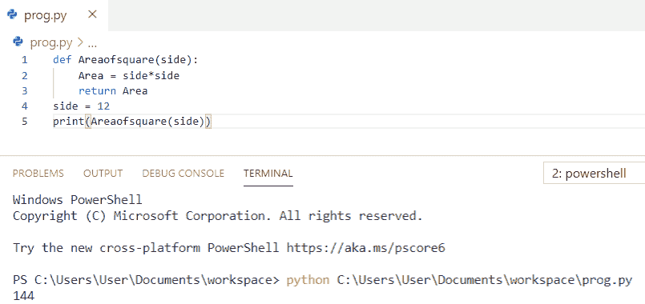
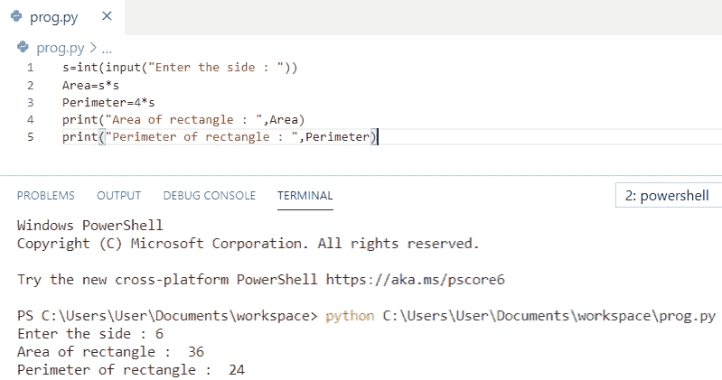

# Python 程序求正方形的面积

> 原文：<https://pythonguides.com/python-program-to-find-the-area-of-square/>

[](https://sharepointsky.teachable.com/p/python-and-machine-learning-training-course)

在这个 [python 教程中，](https://pythonguides.com/python-hello-world-program/)你将学习到 **Python 程序来求正方形**的面积，我们还将检查 **:**

*   如何用 Python 求正方形的面积
*   Python 程序通过获取用户输入来计算正方形的面积
*   Python 程序使用函数求正方形的面积
*   如何在 Python 中求正方形的面积和周长

目录

[](#)

*   [Python 程序求正方形的面积](#Python_program_to_find_the_area_of_square "Python program to find the area of square")
*   [Python 程序通过获取用户输入来计算正方形的面积](#Python_program_to_find_area_of_a_square_by_getting_input_from_a_user "Python program to find area of a square by getting input from a user")
*   [Python 程序使用函数](#Python_program_to_find_area_of_a_square_using_function "Python program to find area of a square using function")求正方形的面积
*   [Python 程序求正方形的面积和周长](#Python_program_to_find_area_and_perimeter_of_a_square "Python program to find area and perimeter of a square")

## Python 程序求正方形的面积

让我们看看 **python 程序求正方形的面积**

*   在这个例子中，我们将正方形任意一边的高度定义为**“边”**。
*   现在，使用公式 `Area = side*side` 计算正方形的面积
*   最后，**打印**正方形的面积得到输出。

**举例:**

```py
side = 6
Area = side*side
print("Area of the square="+str(Area))
```

你可以参考下面的截图，看看 python 程序求正方形面积的输出。



Python program to find the area of square

上面的代码我们可以用 Python 来求正方形的面积。

你可能喜欢， [Python 程序求矩形的面积](https://pythonguides.com/python-program-to-find-an-area-of-a-rectangle/)和[如何在 Python 中求三角形的面积](https://pythonguides.com/find-area-of-a-triangle-in-python/)？

## Python 程序通过获取用户输入来计算正方形的面积

在这里，我们将看到 **python 程序通过从用户**获得输入来计算正方形的面积

*   首先，我们将使用 `input()` 方法从用户那里获取正方形的边值。
*   现在，使用公式 `Area = side*side` 计算正方形的面积
*   最后，**打印**正方形的面积得到输出。

**举例:**

```py
side = int(input("Enter the side:"))
Area = side*side
print("Area of the square="+str(Area))
```

您可以参考下面的屏幕截图，查看 python 程序的输出，通过用户输入来计算正方形的面积。



Python program to find the area of the square by getting input from a user

这是一个 Python 程序，通过获取用户输入来计算正方形的面积。

还看，[Python 中如何计算圆的面积](https://pythonguides.com/calculate-area-of-a-circle-in-python/)？

## Python 程序使用函数求正方形的面积

现在，我们将看到 **python 程序使用函数**求正方形的面积

*   首先，我们将**使用 def 关键字定义一个带有参数的函数**。
*   现在，我们将使用公式 `Area = side*side` 计算函数内部正方形的面积。
*   这里定义了 `side=12` ，并将值传递给函数参数。
*   最后，**打印**一个正方形的面积得到输出。

**举例:**

```py
def Areaofsquare(side):
    Area = side*side 
    return Area
side = 12
print(Areaofsquare(side))
```

你可以参考下面的截图，看看 python 程序使用函数求正方形面积的输出。



Python program to find the area of a square using function

上面的代码是用 Python 中的函数**求一个正方形的面积。**

查看一下，[Python 中如何计算单利](https://pythonguides.com/calculate-simple-interest-in-python/)？

## Python 程序求正方形的面积和周长

让我们看一下 **python 程序，求正方形**的面积和周长。

*   首先，我们将使用 `input()` 方法从用户那里获取正方形的边值。
*   现在，用公式**面积= s*s** 计算正方形的**面积。**
*   接下来，我们将使用公式**周长=4*s** 计算正方形的周长
*   **最后，**打印**正方形的面积和周长，得到输出。**

 ****举例:**

```py
s=int(input("Enter the side : "))
Area=s*s
Perimeter=4*s
print("Area of rectangle : ",Area)
print("Perimeter of rectangle : ",Perimeter)
```

你可以参考下面的截图来查看 python 程序的输出，以找到一个正方形的面积和周长。



Python program to find area and perimeter of a square

上面的代码是用 Python 来**求一个正方形的面积和周长。**

您可能会喜欢以下 Python 教程:

*   [Python 程序打印图案](https://pythonguides.com/print-pattern-in-python/)
*   [如何在 Python 中打印一个数的阶乘](https://pythonguides.com/factorial-of-a-number-in-python/)
*   [如何在 Python 中交换两个数](https://pythonguides.com/swap-two-numbers-in-python/)
*   [如何打印 Python 斐波那契数列](https://pythonguides.com/python-fibonacci-series/)
*   [如何在 Python 中减去两个数](https://pythonguides.com/subtract-two-numbers-in-python/)
*   [PdfFileReader Python 示例](https://pythonguides.com/pdffilereader-python-example/)

在本 Python 教程中，我们学习了用于求平方面积的 **Python 程序。此外，我们还讨论了以下主题:**

*   Python 程序求正方形的面积
*   Python 程序通过获取用户输入来计算正方形的面积
*   Python 程序使用函数求正方形的面积
*   Python 程序求正方形的面积和周长

[Bijay Kumar](https://pythonguides.com/author/fewlines4biju/)

Python 是美国最流行的语言之一。我从事 Python 工作已经有很长时间了，我在与 Tkinter、Pandas、NumPy、Turtle、Django、Matplotlib、Tensorflow、Scipy、Scikit-Learn 等各种库合作方面拥有专业知识。我有与美国、加拿大、英国、澳大利亚、新西兰等国家的各种客户合作的经验。查看我的个人资料。

[enjoysharepoint.com/](https://enjoysharepoint.com/)[](https://www.facebook.com/fewlines4biju "Facebook")[](https://www.linkedin.com/in/fewlines4biju/ "Linkedin")[](https://twitter.com/fewlines4biju "Twitter")**