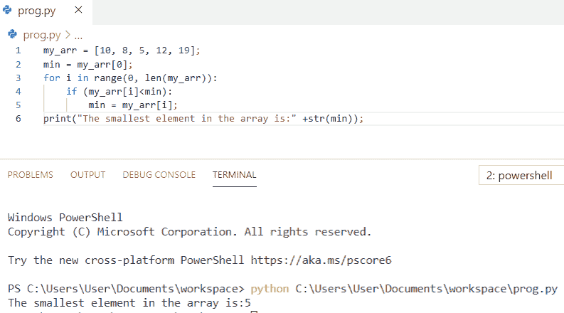
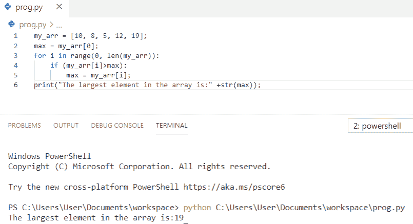
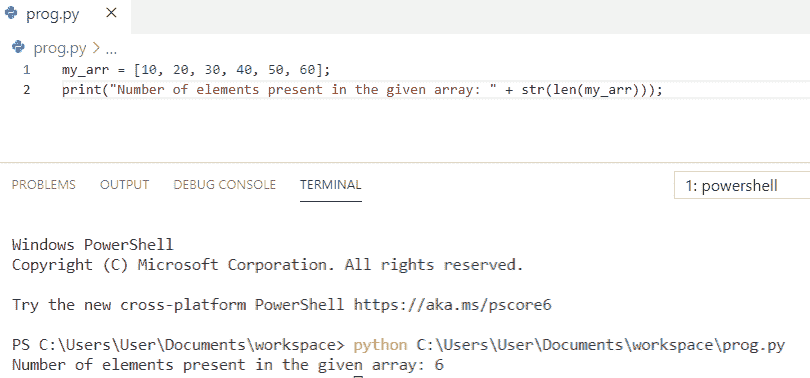
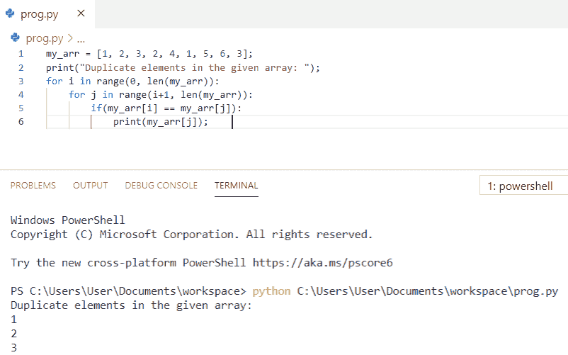
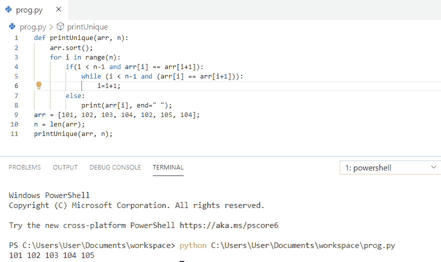
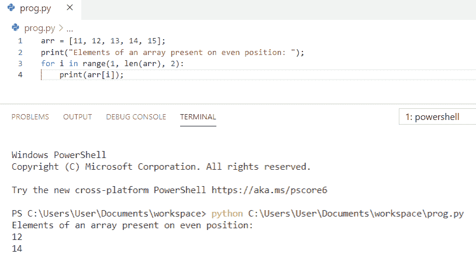
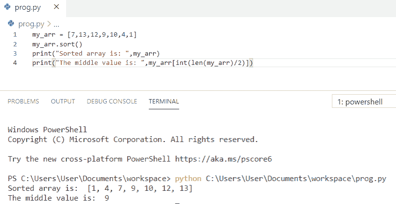

# Python 程序打印数组中的元素

> 原文：<https://pythonguides.com/python-program-to-print-element-in-an-array/>

[](https://sharepointsky.teachable.com/p/python-and-machine-learning-training-course)

在这个 [python 教程中，](https://pythonguides.com/python-hello-world-program/)你将学习到 **Python 程序来打印数组中的元素**我们还将检查 **:**

*   Python 程序打印数组中的最小元素
*   如何在 Python 中打印数组中最大的元素？
*   Python 程序打印数组中元素的数量
*   Python 程序以逆序打印数组元素
*   Python 程序打印数组的重复元素
*   Python 程序打印数组中的唯一元素
*   Python 程序打印偶数位置的数组元素
*   Python 程序打印数组的中间元素

目录

[](#)

*   [Python 程序打印数组中最小的元素](#Python_program_to_print_smallest_element_in_an_array "Python program to print smallest element in an array")
*   [Python 程序打印数组中最大的元素](#Python_program_to_print_largest_element_in_an_array "Python program to print largest element in an array")
*   [Python 程序打印数组中元素的数量](#Python_program_to_print_number_of_elements_present_in_an_array "Python program to print number of elements present in an array")
*   [Python 程序以逆序打印数组元素](#Python_program_to_print_elements_of_an_array_in_reverse_order "Python program to print elements of an array in reverse order")
*   [Python 程序打印数组的重复元素](#Python_program_to_print_duplicate_elements_of_an_array "Python program to print duplicate elements of an array")
*   [Python 程序打印数组中的唯一元素](#Python_program_to_print_unique_elements_in_an_array "Python program to print unique elements in an array")
*   [Python 程序打印出现在偶数位置的数组元素](#Python_program_to_print_elements_of_an_array_present_on_an_even_position "Python program to print elements of an array present on an even position")
*   [Python 程序打印数组中间元素](#Python_program_to_print_middle_element_from_an_array "Python program to print middle element from an array")

## Python 程序打印数组中最小的元素

让我们看一下 **python 程序打印一个数组中的最小元素**。

*   首先，我们需要初始化一个数组
*   现在，我们将把数组的第一个元素存储在变量 min 中。
*   从 0 到数组长度循环数组。
*   **if (my_arr[i] < min)** 条件用于比较 min 的值与数组的元素。
*   如果任何元素小于 min 的值，那么 min 将保存该元素的值。
*   最后，min 将是数组中最小的元素，它将被打印出来。

**举例:**

```py
my_arr = [10, 8, 5, 12, 19];
min = my_arr[0];
for i in range(0, len(my_arr)):
    if (my_arr[i]<min):
        min = my_arr[i];
print("The smallest element in the array is:" +str(min));
```

为了得到输出，我使用了 **print("数组中最小的元素是:"+str(min))** 。您可以参考下面的输出截图。



Python program to print the smallest element in an array

这是用 Python 打印数组中最小元素的**程序。**

你可能会喜欢 Python 熊猫中的和 [Groupby 等例子](https://pythonguides.com/groupby-in-python-pandas/) [Python 数组。](https://pythonguides.com/python-array/)

## Python 程序打印数组中最大的元素

现在，我们将看到 **python 程序打印数组**中最大的元素。

*   首先，我们需要初始化一个数组
*   现在，我们将把数组的第一个元素存储在变量 max 中。
*   从 0 到数组长度循环数组。
*   **if (my_arr[i] > max)** 条件用于比较 max 的值与数组的元素。
*   如果任何元素大于 `max` ，那么 `max` 将保存该元素的值。
*   最后，最大值将是数组中最大的元素，它将被打印出来。

```py
my_arr = [10, 8, 5, 12, 19];
max = my_arr[0];
for i in range(0, len(my_arr)):
    if (my_arr[i]>max):
        max = my_arr[i];
print("The largest element in the array is:" +str(max));
```

为了得到输出，我使用了 **print("数组中最大的元素是:"+str(max))** 。您可以参考下面的输出截图。



Python program to print the largest element in an array

这是用 Python 打印数组中最大元素的**程序。**

你可能喜欢，[在 Python 中创建一个空数组](https://pythonguides.com/create-an-empty-array-in-python/)和[如何在 Python 中添加两个变量](https://pythonguides.com/add-two-variables-in-python/)。

## Python 程序打印数组中元素的数量

这里，我们将看到 **python 程序打印数组**中的元素数量

*   首先，我已经初始化了一个数组
*   现在，我们将使用内置函数 `length` 来计算数组的长度
*   最后，我们使用了 `str(len(my_arr))` 来打印数组的长度。

**举例:**

```py
my_arr = [10, 20, 30, 40, 50, 60];   
print("Number of elements present in the given array: " + str(len(my_arr)));
```

为了获得输出，我使用了 **print("给定数组中存在的元素数:"+ str(len(my_arr)))** 。您可以参考下面的输出截图。



Python program to print the number of elements present in an array

这就是如何在 Python 中**打印数组中元素的数量。**

另外，阅读 [Python 串联数组](https://pythonguides.com/python-concatenate-arrays/)和[如何用 Python 减去两个数](https://pythonguides.com/subtract-two-numbers-in-python/)。

## Python 程序以逆序打印数组元素

让我们看一下 **python 程序以逆序打印数组的元素**。

*   首先，我已经初始化了一个数组
*   现在，我们将以相反的顺序遍历数组，循环将从**(数组长度–1)**开始，并通过将 I 的值减 1 而在 0 处结束。
*   在每次迭代中使用 **(my_arr[i])** 打印元素。

**举例:**

```py
my_arr = [11, 12, 13, 14, 15];     
print("Original array: ");    
for i in range(0, len(my_arr)):    
    print(my_arr[i])  
print("Array in reverse order: ");      
for i in range(len(my_arr)-1, -1, -1):     
    print(my_arr[i]) 
```

为了得到输出，我使用了 **print(my_arr[i])** 。您可以参考下面的输出截图。


Python program to print the elements of an array in reverse order

这是如何在 Python 中以逆序打印数组元素的**。**

查看一下， [Python 程序打印图案](https://pythonguides.com/print-pattern-in-python/)和[如何计算 Python 中的单利](https://pythonguides.com/calculate-simple-interest-in-python/)。

## Python 程序打印数组的重复元素

现在，我们将看到 **python 程序打印数组**的重复元素。

*   首先，我已经初始化了一个数组
*   **两个 for 循环**用于查找重复元素。
*   外部循环将遍历数组，从 0 到数组的长度。
*   内部循环将用于比较所选元素和其余元素
*   如果找到重复的元素，则显示该元素。

**举例:**

```py
my_arr = [1, 2, 3, 2, 4, 1, 5, 6, 3];     
print("Duplicate elements in the given array: ");    
for i in range(0, len(my_arr)):    
    for j in range(i+1, len(my_arr)):    
        if(my_arr[i] == my_arr[j]):    
            print(my_arr[j]); 
```

为了得到输出，我使用了 **print(my_arr[j])** 。您可以参考下面的输出截图。



Python program to print the duplicate elements of an array

这就是如何在 Python 中**打印数组的重复元素。**

## Python 程序打印数组中的唯一元素

让我们看看 **python 程序打印数组**中的唯一元素。

*   首先，我定义了一个函数 **def printUnique(arr，n)**
*   然后使用 `arr.sort()` 对数组进行排序，这样所有的出现都是连续的
*   现在，我们将使用 for 循环来遍历排序后的数组
*   如果有重复项，则将索引前移；否则，打印当前元素。

**举例:**

```py
def printUnique(arr, n): 
    arr.sort(); 
    for i in range(n): 
        if(i < n-1 and arr[i] == arr[i+1]): 
            while (i < n-1 and (arr[i] == arr[i+1])): 
                i=i+1; 
        else: 
            print(arr[i], end=" "); 
arr = [101, 102, 103, 104, 102, 105, 104]; 
n = len(arr); 
printUnique(arr, n); 
```

为了得到输出，我使用了 **print(arr[i]，end = " "**。您可以参考下面的输出截图。



Python program to print unique elements in an array

这就是如何在 Python 中**打印数组中的唯一元素。**

## Python 程序打印出现在偶数位置的数组元素

现在我们将看到 **python 程序打印偶数位置**的数组元素。

*   首先，我们将初始化一个数组
*   现在，我们将计算声明数组的长度
*   Loop 用于将变量**“I”**的值初始化为**“1”**，因为第一个偶数位置是 `1` ，然后其值将**递增**达**“2”**直到最后的长度。
*   最后，出现在偶数位置的元素将被打印。

**举例:**

```py
arr = [11, 12, 13, 14, 15];   
print("Elements of an array present on even position: ");  
for i in range(1, len(arr), 2):  
    print(arr[i]); 
```

为了得到输出，我使用了 **print(arr[i])** 。您可以参考下面的输出截图。



Program to print the elements of an array present on an even position

这就是如何在 Python 中**打印出现在偶数位置的数组元素。**

你可能会喜欢，[如何在 Python 中交换两个数](https://pythonguides.com/swap-two-numbers-in-python/)。

## Python 程序打印数组中间元素

在这里，我们将看到 **python 程序打印来自数组**的中间元素

*   首先，我们将初始化一个数组
*   内置方法 `sort()` 用于对元素进行排序，它将打印排序后的数组
*   为了打印排序数组的中间元素，我们将使用**" my _ arr[int(len(my _ arr)/2)]"**
*   将该值除以 2 将得到中间元素。

**举例:**

```py
my_arr = [7,13,12,9,10,4,1]
my_arr.sort()
print("Sorted array is: ",my_arr)
print("The middle value is: ",my_arr[int(len(my_arr)/2)])
```

为了得到输出，我使用了**print(my _ arr[int(len(my _ arr)/2)])**。您可以参考下面的输出截图。



Python program to print the middle element from the array

这就是如何在 Python 中**打印数组的中间元素。**

您可能会喜欢以下 Python 教程:

*   [如何将 Python 数组写入 CSV](https://pythonguides.com/python-write-array-to-csv/)
*   [Python 形状的一个数组](https://pythonguides.com/python-shape-of-an-array/)
*   [如何将 Python 字符串转换成字节数组并举例](https://pythonguides.com/python-string-to-byte-array/)
*   [Python 熊猫中的交叉表](https://pythonguides.com/crosstab-in-python-pandas/)
*   [Python 二叉树实现](https://pythonguides.com/python-binary-tree/)
*   [Python 连接列表与示例](https://pythonguides.com/python-concatenate-list/)
*   [Python 字符串格式化示例](https://pythonguides.com/python-string-formatting/)

在这个 Python 教程中，我们学习了 ****Python 程序打印数组**** 中的元素。此外，我们还讨论了以下主题:

*   Python 程序打印数组中的最小元素
*   Python 程序打印数组中最大的元素
*   Python 程序打印数组中元素的数量
*   Python 程序以逆序打印数组元素
*   Python 程序打印数组的重复元素
*   Python 程序打印数组中的唯一元素
*   Python 程序打印偶数位置的数组元素
*   Python 程序打印数组的中间元素

[Bijay Kumar](https://pythonguides.com/author/fewlines4biju/)

Python 是美国最流行的语言之一。我从事 Python 工作已经有很长时间了，我在与 Tkinter、Pandas、NumPy、Turtle、Django、Matplotlib、Tensorflow、Scipy、Scikit-Learn 等各种库合作方面拥有专业知识。我有与美国、加拿大、英国、澳大利亚、新西兰等国家的各种客户合作的经验。查看我的个人资料。

[enjoysharepoint.com/](https://enjoysharepoint.com/)[](https://www.facebook.com/fewlines4biju "Facebook")[](https://www.linkedin.com/in/fewlines4biju/ "Linkedin")[](https://twitter.com/fewlines4biju "Twitter")