# Python 程序打印质数

> 原文：<https://pythonguides.com/python-program-to-print-prime-numbers/>

[](https://sharepointsky.teachable.com/p/python-and-machine-learning-training-course)

在这个 [python 教程中，](https://pythonguides.com/python-hello-world-program/)你将了解到打印质数的 **python 程序**我们还将检查 **:**

*   Python 程序打印质数
*   Python 程序打印质数与否
*   python 中的简单素数程序
*   Python 程序打印素数直到 n
*   Python 程序打印从 1 到 100 的质数
*   Python 在一个范围内寻找质数
*   使用 while 循环打印素数的 Python 程序
*   使用 for 循环打印素数的 Python 程序
*   使用 while 循环打印 1 到 100 的质数的 Python 程序
*   Python 程序打印从 1 到 20 的质数
*   使用 if-else 的素数 Python 程序
*   使用列表理解的素数 Python 程序
*   区间素数的 Python 程序
*   Python 计算一个范围内素数的和
*   前 n 个素数 Python

目录

[](#)

*   [Python 程序打印质数](#Python_program_to_print_prime_numbers "Python program to print prime numbers")
*   [Python 程序打印质数与否](#Python_program_to_print_prime_or_not "Python program to print prime or not")
*   [python 中的简单素数程序](#Simple_prime_number_program_in_python "Simple prime number program in python")
*   [Python 程序打印截止到](#Python_program_to_print_prime_numbers_upto_n "Python program to print prime numbers upto n")的质数
*   [Python 程序打印 1 到 100 的质数](#Python_program_to_print_prime_numbers_from_1_to_100 "Python program to print prime numbers from 1 to 100")
*   [Python 在一个范围内寻找质数](#Python_find_prime_numbers_in_a_range "Python find prime numbers in a range")
*   [Python 程序使用 while 循环打印质数](#Python_program_to_print_prime_numbers_using_while_loop "Python program to print prime numbers using while loop")
*   [Python 程序使用 for 循环打印质数](#Python_program_to_print_prime_numbers_using_for_loop "Python program to print prime numbers using for loop")
*   [Python 程序使用 while 循环打印 1 到 100 的质数](#Python_program_to_print_prime_numbers_from_1_to_100_using_while_loop "Python program to print prime numbers from 1 to 100 using while loop")
*   [Python 程序打印 1 到 20 的质数](#Python_program_to_print_prime_numbers_from_1_to_20 "Python program to print prime numbers from 1 to 20")
*   [使用 if-else 的素数 Python 程序](#Python_program_for_prime_number_using_if-else "Python program for prime number using if-else")
*   [使用列表理解的素数 Python 程序](#Python_program_for_prime_number_using_list_comprehension "Python program for prime number using list comprehension")
*   [Python 程序求素数的区间](#Python_program_for_prime_number_in_interval "Python program for prime number in interval")
*   [Python 在一个范围内寻找素数之和](#Python_find_sum_of_prime_numbers_in_a_range "Python find sum of prime numbers in a range")
*   [前 n 个素数 Python](#First_n_prime_numbers_Python "First n prime numbers Python")

## Python 程序打印质数

让我们看看 **python 程序打印质数**。

*   首先，我们将从用户那里获取两个输入。
*   **for 循环**用于从**下限**迭代到**上限**值
*   另一个**用于循环**，我们将输入的数字除以 2 到数字范围内的所有数字。它检查除了 1 和数字本身之外，是否还有其他的正约数。
*   break 语句用于在我们得到任何正除数时退出循环，而不需要进一步检查。
*   最后，**打印出**是质数的数字。

你可能也喜欢用 Python 和[检查一个数是否是质数，以及如何用 Python](https://pythonguides.com/factorial-of-a-number-in-python/) 打印一个数的阶乘。

**举例:**

```py
lower = int(input("Enter the lower value:"))
upper = int(input("Enter the upper value:"))
for number in range(lower,upper+1):
    if number>1:
        for i in range(2,number):
            if (number%i)==0:
                break
        else:
            print(number)
```

为了得到输出，我使用了 `print(number)` 。您可以参考下面的输出截图。

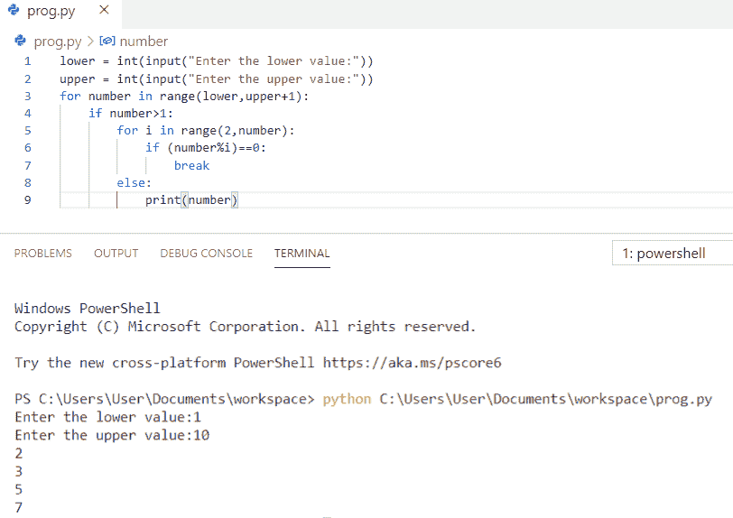

Python program to print prime numbers

上面的代码，我们可以用 Python 中的来**打印素数。**

阅读， [Python 程序打印图案](https://pythonguides.com/print-pattern-in-python/)和[如何计算 Python 中的单利](https://pythonguides.com/calculate-simple-interest-in-python/)？

## Python 程序打印质数与否

现在我们就来看 **python 程序打印素数与否**。

*   首先，我们将从用户那里获取一个输入。
*   一个**质数**总是**正**所以，我们会在程序开始时检查
*   另一个**用于循环**，我们将输入的数字除以 2 到数字范围内的所有数字。它检查除了 1 和数字本身之外，是否还有其他的正约数。
*   如果找到任何除数，那么我们显示**“数”不是质数**，否则我们显示**“数”是质数**。
*   break 语句用于在我们得到任何正除数时退出循环，而不需要进一步检查。
*   最后，**打印出**是质数的数字。

**举例:**

```py
number = int(input("Enter any number:"))
if number>1:
    for i in range(2,number):
        if (number%i)==0:
            print(number, "is not prime number")
            break
    else:
            print(number, "is prime number")
```

为了得到输出，我使用了 **print(number，“是质数”)。**你可以参考下面的输出截图。

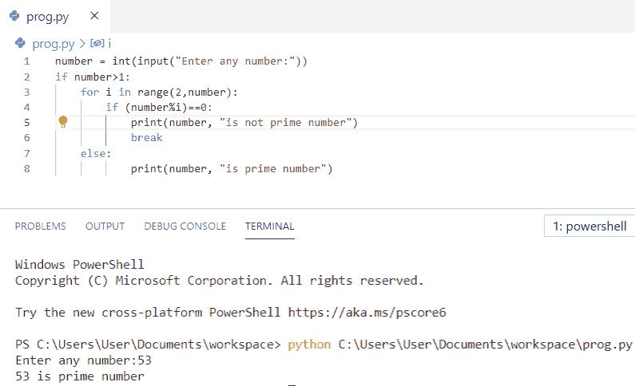

Python program to print prime or not

上面的代码我们可以用 Python 中的**打印素数与否。**

## python 中的简单素数程序

在这里，我们将看到 python 中的**简单素数程序。**

*   首先，我们将从用户那里获取两个输入**(低和高)**
*   这里，我们将使用循环的**来遍历给定的范围**
*   现在，我们将检查给定范围内的值是否能被 1 及其本身整除。
*   **break 语句**用于在我们得到任何正除数时立即退出循环，无需进一步检查。
*   **否则**，打印号码

**举例:**

```py
low = int(input("Enter the lower value:"))
high = int(input("Enter the higher value:"))
for num in range(low, high+1):
    if(num>1):
        for i in range(2,num):
            if(num%i)==0:
                break
        else:
            print(num)
```

为了得到输出，我使用了 **print(num)。**你可以参考下面的输出截图。

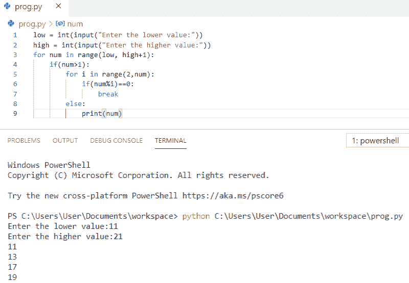

Simple prime number program in python

希望你喜欢 Python 中的**简单素数程序。**

## Python 程序打印截止到的质数

让我们来看一下 **python 程序打印到**的质数

*   首先，我们将初始值设为 1
*   现在，我们将从用户那里获取存储在变量 n 中的输入。
*   **for 循环**用于将输入的数除以 2 到 number 范围内的所有数。它检查除了 1 和数字本身之外，是否还有其他的正约数。
*   如果找到任何除数，那么我们显示**“数”不是质数**，否则我们显示**“数”是质数**。
*   break 语句用于在我们得到任何正除数时退出循环，而不需要进一步检查。
*   最后，**打印出质数**

**举例:**

```py
start_val = 1
n = int(input("Enter the n number:"))
for num in range(start_val, n+1):
    if(num>1):
        for i in range(2,num):
            if(num%i)==0:
                break
        else:
            print(num)
```

为了得到输出，我使用了 **print(num)。**你可以参考下面的输出截图。

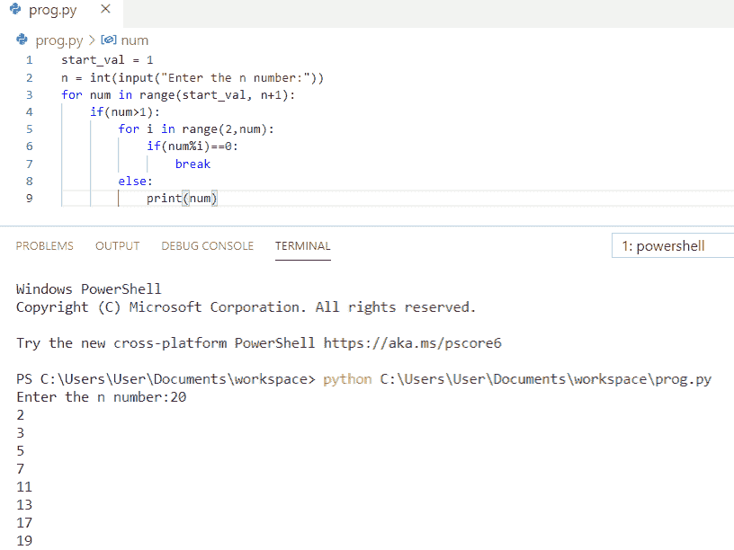

Python program to print prime numbers upto n

这段 Python 代码，我们可以用来在 Python 中**打印出 n 以内的质数。**

## Python 程序打印 1 到 100 的质数

现在，我们将看到一个 **python 程序打印从 1 到 100** 的质数。

*   我使用 for loop 从 1 到 100 迭代一个循环。
*   另一个 **for 循环**用于检查数字是否可整除。
*   break 语句用于在我们得到任何正除数时退出循环，而不需要进一步检查。
*   最后，**打印出**给定范围内的数字。

**举例:**

```py
for num in range(1, 101):
    if(num>1):
        for i in range(2,num):
            if(num%i)==0:
                break
        else:
            print(num, end = '  ')
```

为了得到输出，我使用了 **print(num，end = ' ')。**你可以参考下面的输出截图。

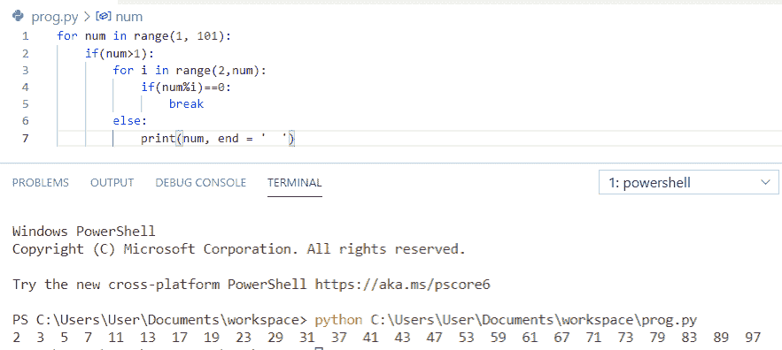

Python program to print prime numbers from 1 to 100

这段 Python 代码，我们可以用 Python 来**打印 1 到 100 的质数。**

## Python 在一个范围内寻找质数

现在我们将看到 **python 在范围**中寻找质数。

*   我已经将值存储在**低位**和**高位**中，我们将在该范围内找到质数。
*   **for 循环**用于从**下限**迭代到**上限**值
*   另一个**用于循环**，我们将输入的数字除以 2 到数字范围内的所有数字。它检查除了 1 和数字本身之外，是否还有其他的正约数。
*   break 语句用于在我们得到任何正除数时退出循环，而不需要进一步检查。
*   最后，**打印出**给定范围内的数字

**举例:**

```py
lower = 100
upper = 200
print("Prime numbers between", lower, "and", upper, "are:")
for num in range(lower, upper + 1):
   if num > 1:
       for i in range(2, num):
           if (num % i) == 0:
               break
       else:
           print(num, end = " ")
```

为了得到输出，我使用了 **print(num，end = " ")。**你可以参考下面的输出截图。

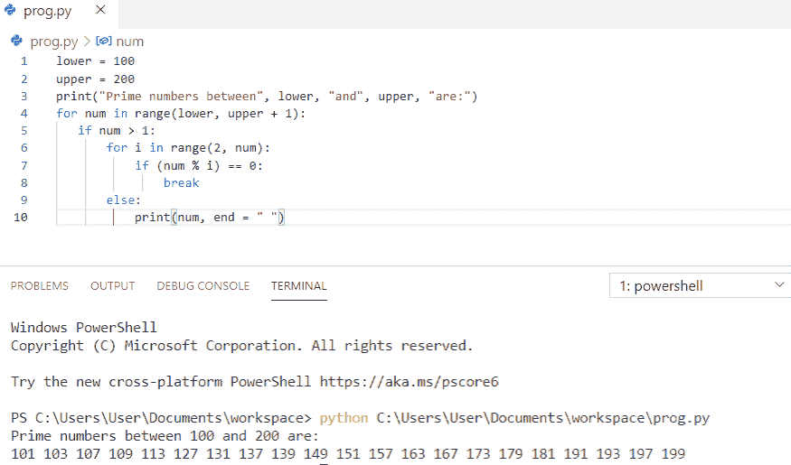

Python find prime numbers in a range

这段代码我们可以用来在 Python 中**寻找一个范围内的质数。**

## Python 程序使用 while 循环打印质数

让我们看看使用 while 循环打印质数的 **python 程序。**

*   首先，我们将初始化**号**为 `1`
*   这里，我们将使用一个 **while 循环**计算素数
*   `i = 2` 用于检查数字的因子
*   我们使用 **f(num % i == 0)** 将这个数除以所有的数。
*   break 语句用于在我们得到任何正除数时退出循环，而不需要进一步检查。
*   最后 **print(" %d" %num，end = ' ')** 用于打印素数。

**举例:**

```py
num = 1
while(num <= 30):
    count = 0
    i = 2
    while(i <= num//2):
        if(num % i == 0):
            count = count + 1
            break
        i = i + 1
    if (count == 0 and num!= 1):
        print(" %d" %num, end = '  ')
    num = num + 1
```

为了获得输出，我使用了 **print(" %d" %num，end = ' ')。**你可以参考下面的输出截图。

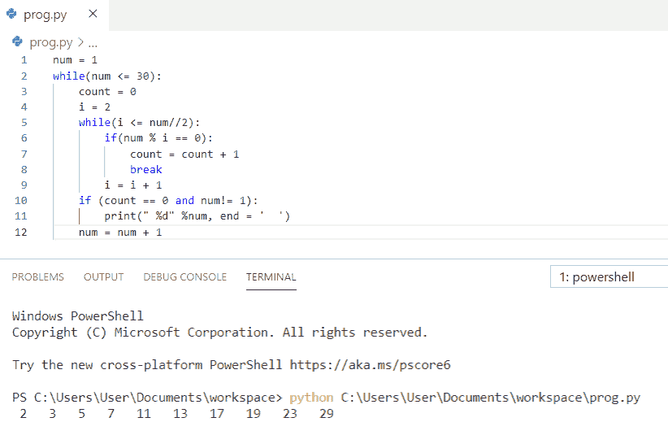

Python program to print prime numbers using while loop

这就是如何在 Python 中使用 while 循环**打印质数。**

## Python 程序使用 for 循环打印质数

现在，我们将看到 **python 程序使用 for 循环**打印质数。

*   首先，我取了两个变量，并初始化了值
*   我使用 for 循环在给定的范围内迭代
*   另一个 **for 循环**用于检查数字是否可整除。
*   break 语句用于在我们得到任何正除数时退出循环，而不需要进一步检查。
*   最后，**打印出质数**

**举例:**

```py
l = 20
h = 50
for num in range(l, h+1):
    if(num>1):
        for i in range(2,num):
            if(num%i)==0:
                break
        else:
            print(num, end = '  ')
```

为了得到输出，我使用了 **print(num，end = " ")。**你可以参考下面的输出截图。

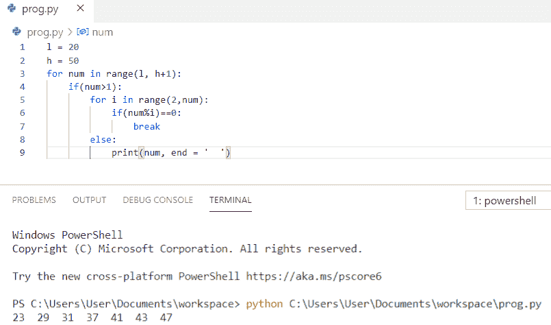

Python program to print prime numbers using for loop

这就是如何在 Python 中使用 for 循环**打印质数。**

## Python 程序使用 while 循环打印 1 到 100 的质数

现在，我们将看到 **python 程序使用 while 循环**打印从 1 到 100 的质数

*   首先，我们将初始化**号**为 `1`
*   这里，我们将使用一个 **while 循环**来计算从 1 到 100 的质数
*   `**i = 2` 用于检查数字的因子**
*   **我们使用 **f(num % i == 0)** 将这个数除以所有的数。**
*   **break 语句用于在我们得到任何正除数时退出循环，而不需要进一步检查。**
*   **最后 **print(" %d" %num，end = ' ')** 用于打印素数。**

 ****举例:**

```py
num = 1
while(num <= 100):
    count = 0
    i = 2
    while(i <= num//2):
        if(num % i == 0):
            count = count + 1
            break
        i = i + 1
    if (count == 0 and num!= 1):
        print(" %d" %num, end = '  ')
    num = num + 1
```

为了获得输出，我使用了 **print(" %d" %num，end = ' ')。**你可以参考下面的输出截图。

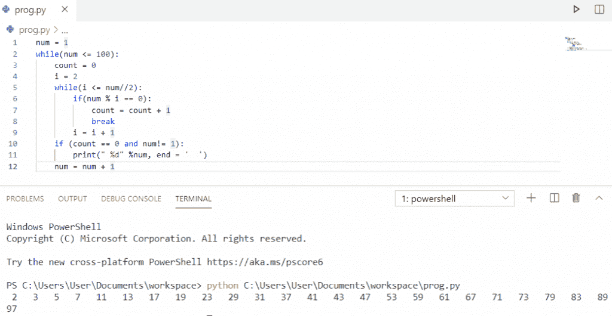

Python program to print prime numbers from 1 to 100 using while loop

这段代码，我们可以用 Python 中的 while 循环来**打印 1 到 100 的质数。**

## Python 程序打印 1 到 20 的质数

在这里，我们将看到 **python 程序打印 1 到 20 的质数**。

*   首先，我将两个变量 `start` 和 `end` 的值初始化。
*   **for 循环**用于从头到尾迭代数值
*   另一个 **for 循环**用于检查数字是否可整除。
*   break 语句用于在我们得到任何正除数时退出循环，而不需要进一步检查。
*   最后，**打印**从 1 到 20 的质数

**举例:**

```py
start = 1
end = 20
for num in range(start, end+1): 
  if num>1: 
    for j in range(2,num): 
        if(num % j==0): 
            break
    else: 
        print(num, end=" ") 
```

为了得到输出，我使用了 **print(num，end = " ")。**你可以参考下面的输出截图。


Python program to print prime numbers from 1 to 20

这段 Python 代码，我们可以用 Python 来**打印 1 到 20 的质数。**

## 使用 if-else 的素数 Python 程序

让我们看看使用 if-else 的质数的 **python 程序**

*   首先，我已经初始化了两个变量
*   我使用 for 循环在给定的范围内迭代
*   另一个 **for 循环**用于检查数字是否可整除。
*   **如果条件**检查数字是否等于零
*   break 语句用于在我们得到任何正除数时退出循环，而不需要进一步检查。
*   **否则**打印质数

**举例:**

```py
S = 50
E = 80
for num in range(S, E+1): 
  if num>1: 
    for i in range(2,num): 
        if(num % i==0): 
            break
    else: 
        print(num, end=" ") 
```

为了得到输出，我使用了 **print(num，end = " ")。**你可以参考下面的输出截图。

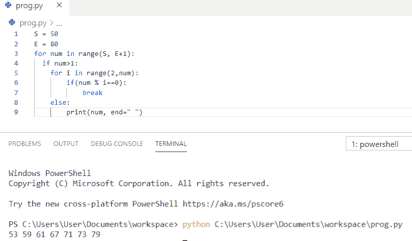

Python program for prime number using if-else

这就是如何在 Python 的 if-else 中检查一个质数。

## 使用列表理解的素数 Python 程序

让我们看看使用列表理解的素数的 python 程序。

在这个例子中，**列表理解**被用来寻找范围 2 到 n+1 中的素数，其中 `n=50` 在开始时被初始化。

**举例:**

```py
n = 50
prime = [i for i in range(2, n + 1) if all(i%j != 0 for j in range(2, int(i ** 0.5) + 1))]
print(prime)
```

为了得到输出，我使用了 **print(prime)。**你可以参考下面的输出截图。

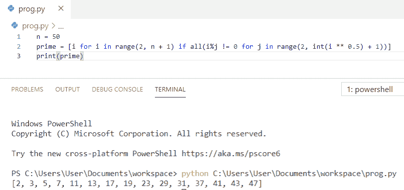

Python program for prime number using list comprehension

## Python 程序求素数的区间

现在，我们将看到区间中质数的 **python 程序**

*   我已经将值存储在**起点**和**终点**中，我们将在该范围内找到质数。
*   **for 循环**用于迭代从**开始**到**结束**的值
*   另一个**用于循环**，我们将输入数除以 **2 到数**范围内的所有数。它检查除了 1 和数字本身之外，是否还有其他的正约数。
*   break 语句用于在我们得到任何正除数时退出循环，而不需要进一步检查。
*   最后，**打印出**给定范围内的数字

**举例:**

```py
start = 500
end = 600
print("Prime numbers in interval", start, "and", end, "are:")
for num in range(start, end + 1):
   if num > 1:
       for i in range(2, num):
           if (num % i) == 0:
               break
       else:
           print(num, end=" ")
```

为了得到输出，我使用了 **print(num，end = " ")。**你可以参考下面的输出截图。

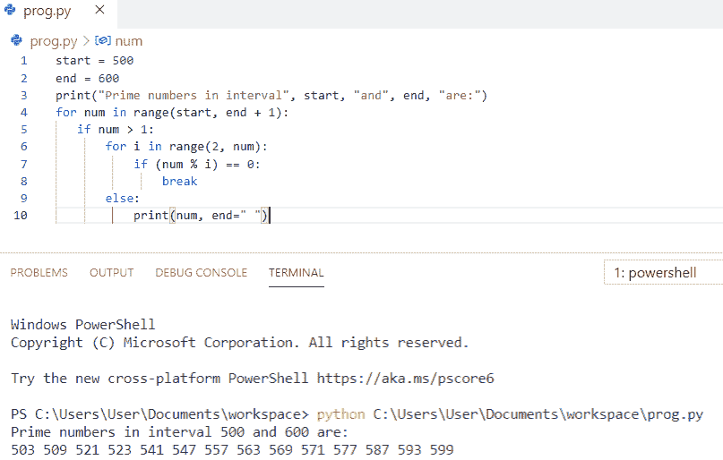

Python program for prime number in interval

这是如何在 Python 中得到区间内的**素数。**

## Python 在一个范围内寻找素数之和

让我们看看**如何找到一个范围**内的素数之和。

*   首先，我们将从用户那里获取一个输入。
*   然后我们将定义一个函数，循环用于从给定的范围进行迭代。
*   另一个**用于循环**，我们将输入数除以 2 到 maxint 范围内的所有数。它检查除了 1 和数字本身之外，是否还有其他的正约数。
*   `break` 语句用于在我们获得任何正除数时退出循环，而无需进一步检查。
*   生成函数 `yield a` 用于 iterable 调用 sum 的循环中。
*   最后，**打印**将返回该范围内的素数之和。

**举例:**

```py
num = int(input("Enter a number: "))
def sum_range(num):
    for a in range(2, num + 1):
        maxint = int(a **.5) + 1 
        for i in range(2, maxint):
            if a % i == 0:
                break
        else:
            yield a
print(sum(sum_range(num)))
```

为了得到输出，我使用了 **print(sum(sum_range(num)))。**你可以参考下面的输出截图。

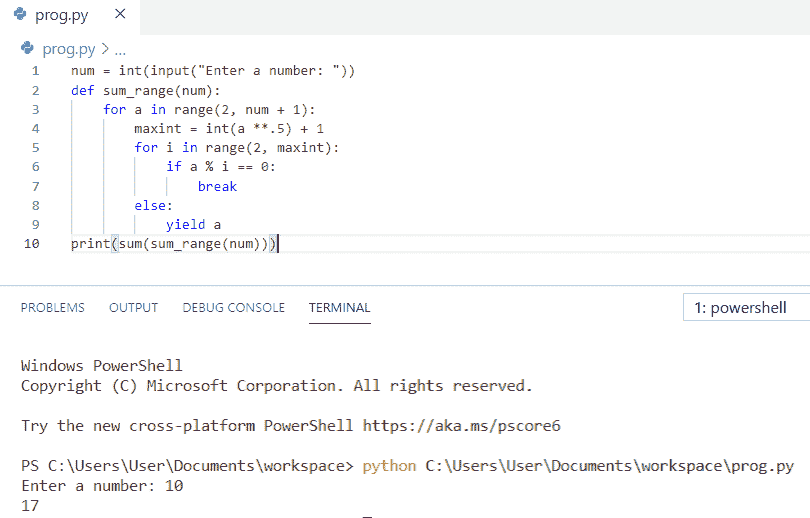

Python find the sum of prime numbers in a range

这就是如何在 Python 中求一个范围内的质数之和**。**

## 前 n 个素数 Python

在这里，我们将看到**前 n 个素数 Python** 。

*   首先，我们将从用户那里获取一个输入。
*   **for n in range(2，num)** 用于在给定范围内迭代。
*   使用另一个循环的**,我们将输入数除以 2 到 n 范围内的所有数。它检查除了 1 和数本身之外是否还有任何正约数。**
*   break 语句用于在我们得到任何正除数时退出循环，而不需要进一步检查。
*   最后，**打印出**是质数的数字。

**举例:**

```py
num=int(input("Enter range:"))
print("Prime numbers:", end=' ')
for n in range(2,num):
    for i in range(2,n):
        if(n%i==0):
            break
    else:
        print(n,end=' ') 
```

为了得到输出，我使用了 **print(n，end = ' ')。**你可以参考下面的输出截图。

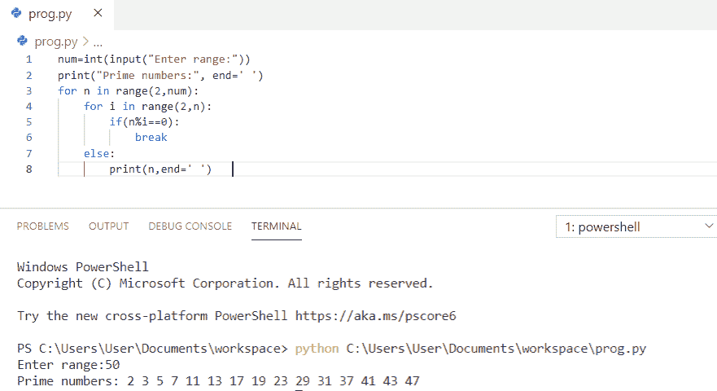

First n prime numbers Python

这就是如何在 Python 中求**前 n 个素数。**

您可能会喜欢以下 Python 教程:

*   [Python 格式数字加逗号](https://pythonguides.com/python-format-number-with-commas/)
*   [Python 生成随机数和字符串](https://pythonguides.com/python-generate-random-number/)
*   [Python 方块一号](https://pythonguides.com/python-square-a-number/)
*   [Python 程序打印数组中的元素](https://pythonguides.com/python-program-to-print-element-in-an-array/)
*   [Python 字符串格式化示例](https://pythonguides.com/python-string-formatting/)

在本 Python 教程中，我们学习了 ****Python 程序打印质数**** 。此外，我们还讨论了以下主题:

*   Python 程序打印质数
*   Python 程序打印质数与否
*   python 中的简单素数程序
*   Python 程序打印素数直到 n
*   Python 程序打印从 1 到 100 的质数
*   Python 在一个范围内寻找质数
*   使用 while 循环打印素数的 Python 程序
*   使用 for 循环打印素数的 Python 程序
*   使用 while 循环打印 1 到 100 的质数的 Python 程序
*   Python 程序打印从 1 到 20 的质数
*   使用 if-else 的素数 Python 程序
*   使用列表理解的素数 Python 程序
*   区间素数的 Python 程序
*   Python 计算一个范围内素数的和
*   前 n 个素数 Python

[Bijay Kumar](https://pythonguides.com/author/fewlines4biju/)

Python 是美国最流行的语言之一。我从事 Python 工作已经有很长时间了，我在与 Tkinter、Pandas、NumPy、Turtle、Django、Matplotlib、Tensorflow、Scipy、Scikit-Learn 等各种库合作方面拥有专业知识。我有与美国、加拿大、英国、澳大利亚、新西兰等国家的各种客户合作的经验。查看我的个人资料。

[enjoysharepoint.com/](https://enjoysharepoint.com/)[](https://www.facebook.com/fewlines4biju "Facebook")[](https://www.linkedin.com/in/fewlines4biju/ "Linkedin")[](https://twitter.com/fewlines4biju "Twitter")**