# Python 程序反转字符串的例子

> 原文：<https://pythonguides.com/python-program-to-reverse-a-string/>

[](https://sharepointsky.teachable.com/p/python-and-machine-learning-training-course)

在这个 [python 教程中，](https://pythonguides.com/python-hello-world-program/)你将了解到 **python 程序来反转一个字符串**我们也将检查 **:**

*   Python 程序反转一个字符串
*   从用户输入中反转字符串的 Python 程序
*   使用递归反转字符串的 Python 程序
*   使用 for 循环反转字符串的 Python 程序
*   使用切片反转字符串的 Python 程序
*   Python 程序来一个字一个字地反转一个字符串
*   使用函数反转字符串的 Python 程序
*   使用 while 循环反转字符串的 Python 程序
*   Python 程序在不使用递归的情况下反转字符串
*   不使用 Python 中的函数来反转字符串的 python 程序
*   使用堆栈反转字符串的 Python 程序
*   Python 程序反转除特殊字符以外的字符串
*   Python 程序反转字符串中的每个单词
*   Python 代码来反转字符串中的单词
*   在 python 中反转句子中的每个单词
*   不使用反转函数反转字符串的 Python 程序
*   Python 程序使用类一个字一个字地反转字符串

目录

[](#)

*   [Python 程序反转一个字符串](#Python_program_to_reverse_a_string "Python program to reverse a string")
*   [Python 程序从用户输入中反转一个字符串](#Python_program_to_reverse_a_string_from_user_input "Python program to reverse a string from user input")
*   [Python 程序使用递归来反转字符串](#Python_program_to_reverse_a_string_using_recursion "Python program to reverse a string using recursion")
*   [Python 程序使用 for 循环反转字符串](#Python_program_to_reverse_a_string_using_for_loop "Python program to reverse a string using for loop")
*   [Python 程序使用切片反转字符串](#Python_program_to_reverse_a_string_using_slicing "Python program to reverse a string using slicing")
*   [Python 程序对一个字符串进行逐字倒序](#Python_program_to_reverse_a_string_word_by_word "Python program to reverse a string word by word")
*   [Python 程序使用函数](#Python_program_to_reverse_a_string_using_function "Python program to reverse a string using function")反转字符串
*   [Python 程序使用 while 循环反转字符串](#Python_program_to_reverse_a_string_using_while_loop "Python program to reverse a string using while loop")
*   [Python 程序在不使用递归的情况下反转字符串](#Python_program_to_reverse_a_string_without_using_recursion "Python program to reverse a string without using recursion")
*   [Python 程序在不使用 Python 函数的情况下反转字符串](#Python_program_to_reverse_a_string_without_using_function_in_python "Python program to reverse a string without using function in python")
*   [Python 程序使用堆栈反转字符串](#Python_program_to_reverse_a_string_using_stack "Python program to reverse a string using stack")
*   [Python 程序反转除特殊字符以外的字符串](#Python_program_to_reverse_a_string_except_special_characters "Python program to reverse a string except special characters")
*   [Python 程序反转字符串中的每个单词](#Python_program_to_reverse_each_word_in_a_string "Python program to reverse each word in a string")
*   [Python 代码反转字符串中的单词](#Python_code_to_reverse_words_in_a_string "Python code to reverse words in a string")
*   [在 python 中反转句子中的每个单词](#Reverse_each_word_in_a_sentence_in_python "Reverse each word in a sentence in python")
*   [Python 程序在不使用反转函数的情况下反转字符串](#Python_program_to_reverse_a_string_without_using_reverse_function "Python program to reverse a string without using reverse function")
*   [Python 程序使用类](#Python_program_to_reverse_a_string_word_by_word_using_class "Python program to reverse a string word by word using class")一个字一个字地反转一个字符串

## Python 程序反转一个字符串

让我们看看 **python 程序反转一个字符串**。

*   首先，我们已经声明了 `reverse()` 函数，并传递了 `str` 作为参数。
*   在函数内部声明一个空的字符串变量作为**字符串**，它将保存反转的字符串。
*   for 循环迭代给定字符串的每个元素，并存储在字符串变量中
*   **返回字符串**将返回反向字符串给调用者函数
*   最后，它将返回相反的顺序，并将结果打印出来。

**举例:**

```py
def reverse(str):
    string = " "
    for i in str:
        string = i + string
    return string
str = "PythonGuides"
print("The original string is:",str)
print("The reverse string is:", reverse(str)) 
```

为了得到输出，我使用了 **print("反向字符串是:"，reverse(str))** 。您可以参考下面的输出截图。

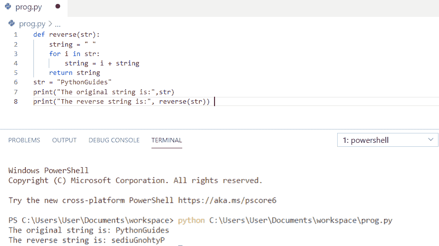

Python program to reverse a string

上面的代码我们可以用来**反转 Python 中的一个字符串**。

你可能会喜欢，[如何用 Python](https://pythonguides.com/factorial-of-a-number-in-python/) 打印一个数的阶乘。

## Python 程序从用户输入中反转一个字符串

在这里，我们将看到 **python 程序从用户输入**中反转一个字符串。

*   首先，用户将输入一个字符串。
*   创建空字符串 **str = ' '** ，它将保存反转的字符串。
*   循环的**迭代给定字符串的每个元素**
*   最后，它将返回**反向字符串**并打印结果。

**举例:**

```py
my_str = input("Please enter your own String : ")
str = ''
for i in my_str:
    str = i + str
print("\nThe Original String is: ", my_str)
print("The Reversed String is: ", str)
```

为了得到输出，我使用了 **print("反向字符串是: "，(str))** 。您可以参考下面的输出截图。

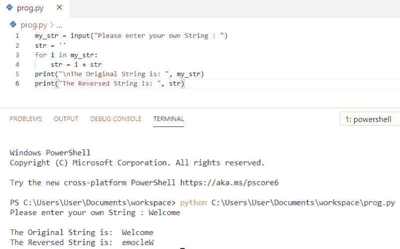

Python program to reverse a string from user input

上面的代码，我们可以用来从 Python 中的用户输入中**反转一个字符串。**

*   [Python 字符串格式化示例](https://pythonguides.com/python-string-formatting/)

## Python 程序使用递归来反转字符串

在这里，我们将看到 **python 程序使用递归**来反转字符串。

*   我们也可以用递归来反转一个字符串。 [Python 递归](https://pythonguides.com/python-recursion/)是函数调用自身的过程。
*   首先，我们声明了 `reverse()` 函数，并将 `str1` 作为参数传递
*   `if len(str1) == 1` 用于检查字符串的长度，这是递归的基本条件。如果字符串的长度为 1，则返回字符串，否则递归调用函数。
*   **切片操作符**将对字符串进行切片，除了第一个字符，并将其连接到切片字符串的末尾
*   最后返回**反序**并打印结果。

**举例:**

```py
def reverse(str1):
    if len(str1) == 1:
        return str1
    else:
        return reverse(str1[1:])+str1[0]
str1 = "PythonGuides.Com"
print("The given string is:", str1)
print("Reversed string is:", reverse(str1))
```

为了得到输出，我使用了 **print("Reverse string is:"，reverse(str1))** 。您可以参考下面的输出截图。

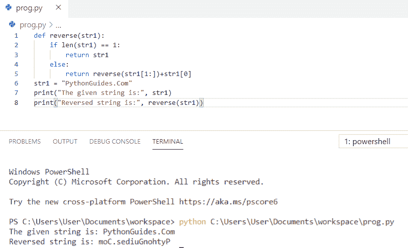

`Python program to reverse a string using recursion`

这就是如何在 Python 中使用递归来**反转字符串。**

## Python 程序使用 for 循环反转字符串

现在，我们将看到 **python 程序使用 for 循环**来反转字符串。

*   首先，我们已经声明了 `reverse()` 函数，并传递了 `str` 作为参数。
*   在函数内部声明一个空的字符串变量作为**字符串**，它将保存反转的字符串。
*   循环的**迭代给定字符串的每个元素，并存储在字符串变量中**
*   **返回字符串**将返回反向字符串给调用者函数
*   最后，它将返回相反的顺序，并将结果打印出来。

**举例:**

```py
def reverse(string):
    s = " "
    for i in string:
        s = i + s
    return s
string = "HappyLearning"
print("The original string is:",string)
print("The reverse string is:", reverse(string)) 
```

为了得到输出，我使用了 **print("反向字符串是:"，reverse(string))** 。您可以参考下面的输出截图。

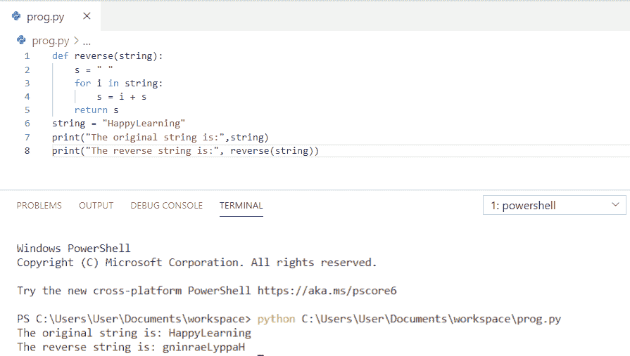

Python program to reverse a string using for loop

上面的 python 代码，我们可以用 Python 中的 for 循环来**反转一个字符串。**

你可能还喜欢， [Python For Loop 带例子](https://pythonguides.com/python-for-loop/)。

## Python 程序使用切片反转字符串

让我们看看使用切片反转字符串的 **python 程序。**

*   首先，我们声明了 `reverse()` 函数，并将**字符串**作为参数传递。
*   slice 提供将一个**【step】**字段作为**【开始、停止、步进】，**，不提供字段作为开始和停止分别表示默认为 0 和字符串长度。
*   这里， `-1` 表示从末端开始，在起点停止，然后我们得到反向字符串。
*   最后，它将返回相反的顺序，并将结果打印出来

**举例:**

```py
def reverse(string): 
    string = string[::-1] 
    return string 
str= "Guides"
print ("The original string is : ",end="") 
print (str) 
print ("The reversed string is : ",end="") 
print (reverse(str)) 
```

为了得到输出，我使用了 `print(reverse(str))` 。您可以参考下面的输出截图。

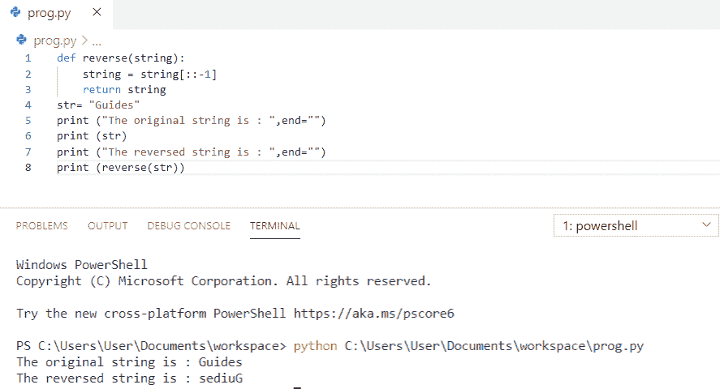

Python program to reverse a string using slicing

上面的 Python 程序使用切片来反转字符串。

## Python 程序对一个字符串进行逐字倒序

现在，我们将看到 **python 程序对一个字符串进行逐字倒序**。

*   首先，我将字符串声明为**“Python guides 是最好的”**
*   `string.split()` 用于将句子拆分成单词列表
*   空列表 `reverse_str` 用于将列表中的字符串的每个单词单独反转。
*   **res = " "。**join(reverse _ str)用于连接新的单词列表以形成新的字符串。
*   最后，它将逐字返回反向字符串并打印结果。

**举例:**

```py
string = "Python guides is best"
word = string.split()
reverse_str = []
for i in word:
    reverse_str.append(i[::-1])
res = " ".join(reverse_str)
print("The reversed string word by word is:",res)
```

为了得到输出，我使用了 **print("逐字反转的字符串是:"，res)** 。您可以参考下面的输出截图。

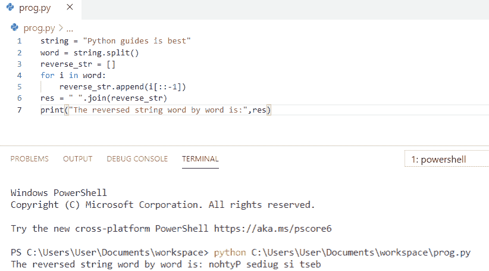

Python program to reverse a string word by word

上面的代码，我们可以用 Python 中的**来逐字倒排一个字符串。**

你可能会喜欢，[如何在 python](https://pythonguides.com/concatenate-strings-in-python/) 中串联字符串。

## Python 程序使用函数反转字符串

在这里，我们将看到 **python 程序使用函数**来反转字符串。

*   首先，我们已经用**定义了**`reverse()`函数，并传递了 `str` 作为参数。
*   在函数内部声明一个空的字符串变量作为**字符串**，它将保存反转的字符串。
*   for 循环迭代给定字符串的每个元素，并存储在字符串变量中
*   **返回字符串**将返回反向字符串给调用者函数
*   最后返回**逆指令**，通过调用**函数**打印结果。

**举例:**

```py
def reverse(str1):
    string = " "
    for i in str1:
        string = i + string
    return string
str1 = "LearningPython"
print("The original string is:",str1)
print("The reverse string is:", reverse(str1)) 
```

为了得到输出，我使用了 **print("反转的字符串是:"，reverse(str1))** 。您可以参考下面的输出截图。

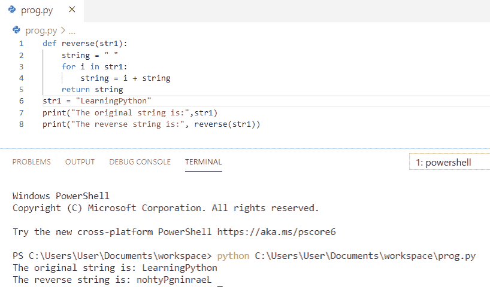

Python program to reverse a string using function

这是使用函数反转字符串的 Python 程序**。**

你可能喜欢， [Python 匿名函数(Lambda Function)](https://pythonguides.com/python-anonymous-function/)

## Python 程序使用 while 循环反转字符串

现在，我们将看到 **python 程序使用 while 循环**来反转字符串。

*   首先，我将字符串变量声明为**“happy learning”**。
*   创建一个空字符串 `reverse_Str = ""`
*   `count = len(string)` 用于求出字符串的长度，并保存在 count 变量中。
*   我们用字符串的值初始化了一个 while 循环
*   在每次迭代中，**字符串【count-1】**的值连接到**反向字符串**并递减计数值。
*   while 完成了它的迭代并返回了逆序字符串。

**举例:**

```py
string = "HappyLearning"
print ("The original string  is : ",string)   
reverse_Str = "" 
count = len(string)
while count > 0:   
    reverse_Str = reverse_Str + string[ count - 1 ]
    count = count - 1   
print ("The reversed string using a while loop is : ",reverse_Str)
```

为了得到输出，我使用了 **print("使用 while 循环的反向字符串是: "，reverse_Str)** 。您可以参考下面的输出截图。

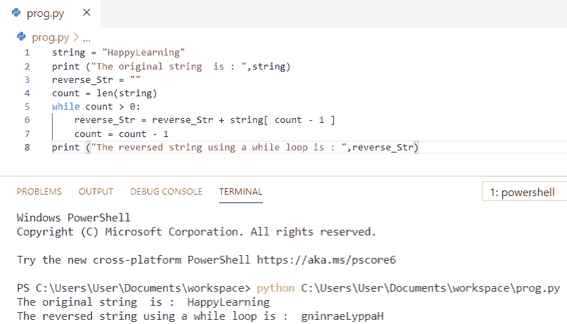

Python program to reverse a string using while loop

这就是如何在 Python 中使用 while 循环来**反转一个字符串。**

也可阅读， [Python While 循环示例](https://pythonguides.com/python-while-loop/)。

## Python 程序在不使用递归的情况下反转字符串

让我们看看 **python 程序在不使用递归**的情况下反转一个字符串。

*   首先，我们将从**用户**处获取一个字符串。
*   然后我们会用**串切片**来反转串。
*   最后，**打印**反转后的字符串得到输出。

**举例:**

```py
my_string = str(input("Enter a string: "))
print("Reverse of a string without using recursion is: ")
print(my_string[::-1])
```

为了得到输出，我使用了 **print(my_string[::-1])** 。您可以参考下面的输出截图。

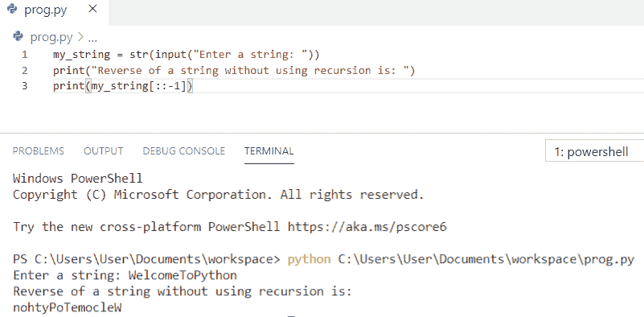

Python program to reverse a string without using recursion

上面的代码，我们可以用来**反转一个字符串而不使用 Python** 中的递归。

## Python 程序在不使用 Python 函数的情况下反转字符串

在这里，我们将看到 **python 程序在不使用 python** 中的函数的情况下反转一个字符串。

*   首先，我们获取一个字符串，并将其存储在变量 `my_string` 中
*   我们没有使用任何函数，所以我们将使用一个空字符串**“str”**通过一个循环将其与字符串中的每个字母连接起来。
*   **for 循环**用于迭代变量
*   现在，我们将把空字符串 `str` 与一个迭代变量的值连接起来，这个变量将反转字符串。

**举例:**

```py
my_string=("Reverseofstring")
str1=""
for i in my_string:
    str1=i+str1
print("The Reversed string is:",str1)
```

为了得到输出，我使用了 **print("反转的字符串是:"，str1)** 。您可以参考下面的输出截图。

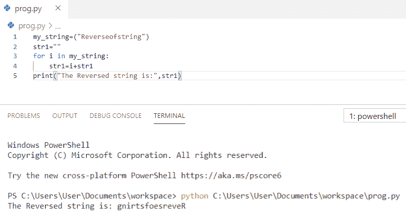

Python program to reverse a string without using function in python

上面的代码，我们可以用来**反转一个字符串而不使用 python** 中的函数。

## Python 程序使用堆栈反转字符串

现在，我们将看到 **python 程序使用栈**反转一个字符串。

*   首先，我们将定义一个函数为 `def revStack()` ，我们还将创建一个空堆栈。
*   之后，我们将定义另一个函数来确定堆栈的大小。
*   如果大小为 0，堆栈将为空
*   `def push` 功能用于将一个项目添加到堆栈中，它将大小增加 1。
*   `def pop` 函数用于从堆栈中移除一个项目，它将大小减少 1
*   `def reverse(str)` 用于反转一个字符串。
*   现在，我们将创建一个空堆栈，如 `stack = revStack()`
*   我们现在将把一个字符串的所有字符压入堆栈
*   当所有字符都保存在堆栈中时，使字符串为空
*   `str+=pop(stack)` 用于弹出字符串的所有字符，并放回字符串中。
*   最后，使用 `print` 得到反转后的字符串。

**举例:**

```py
def revStack(): 
    stack=[] 
    return stack 
def size(stack): 
    return len(stack) 
def isEmpty(stack): 
    if size(stack) == 0: 
        return true 
def push(stack,item): 
    stack.append(item) 
def pop(stack): 
    if isEmpty(stack): return
    return stack.pop() 
def reverse(str): 
    n = len(str) 
    stack = revStack() 
    for i in range(0,n,1): 
        push(stack,str[i]) 
    str="" 
    for i in range(0,n,1): 
        str+=pop(stack) 
    return str
str ="CodingisFun"
str = reverse(str) 
print("Reversed string is: " + str) 
```

为了得到输出，我使用了 **print("反转的字符串是:"+ str)** 。您可以参考下面的输出截图。

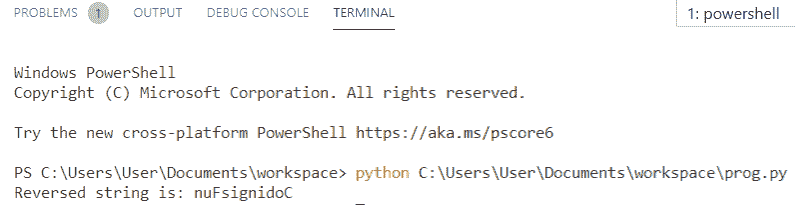

Python program to reverse a string using stack

这是**如何在 Python** 中使用 stack 反转一个字符串。

## Python 程序反转除特殊字符以外的字符串

让我们看看 **python 程序反转一个字符串除了特殊字符**。

*   首先，我们将定义一个函数为 `def reverseStr(msg)`
*   我们将从最后一个索引开始循环，直到索引的一半
*   **如果味精【我】。isalpha()** 用于匹配字符是否为字母表。
*   我们创建了名为 **temp[]** 的临时字符数组
*   将给定数组中的字母字符复制到 **temp[]**
*   然后我们将使用字符串反转来反转 **temp[]**
*   现在，我们在一个循环中遍历输入字符串和临时变量
*   最后， `print` 用于反转除特殊字符以外的字符串，特殊字符不移动。

**举例:**

```py
def reverseStr(msg): 
    index = -1   
    for i in range(len(msg)-1, int(len(msg)/2), -1):      
        if msg[i].isalpha(): 
            temp = msg[i] 
            while True: 
                index = index + 1
                if msg[index].isalpha(): 
                    msg[i] = msg[index] 
                    msg[index] = temp 
                    break
    return msg 
my_string = "P,y!!t.h,o'n,guide"
print ("My string is: ", my_string) 
my_string = reverseStr(list(my_string)) 
print("The reversed string except special characters:","".join(my_string)) 
```

为了得到输出，我使用了 **print("除特殊字符之外的反向字符串:"，"。加入(my_string))** 。您可以参考下面的输出截图。

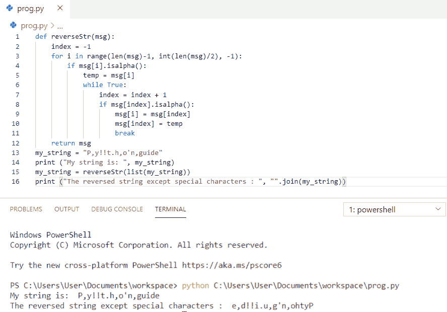

Python program to reverse a string except special characters

上面的代码，我们可以用来**反转一个字符串除了 Python 中的特殊字符**。

## Python 程序反转字符串中的每个单词

现在，我们将看到 **python 程序反转字符串**中的每个单词。

*   首先，我们已经将**函数**定义为 `def reverseword(str)` 。
*   现在，我们将把这个句子分成一系列单词
*   通过使用列表理解来反转每个单词并创建新的单词列表
*   为了组成新句子，join()用于连接列表中的单词。
*   `print(reverseword(str))` 用于调用和函数来获取新的字符串。

**举例:**

```py
def reverseword(str): 
    word = str.split(" ")  
    newWord = [words[::-1] for words in word] 
    new = " ".join(newWord) 
    return new
str = "Python Guides is good for beginners"
print(reverseword(str))
```

为了得到输出，我使用了 `print(reverseword(str))` 。您可以参考下面的输出截图。

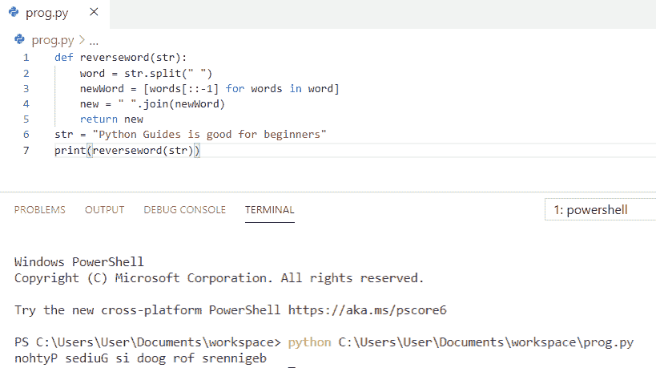

Python program to reverse each word in a string

这就是如何在 Python 中**反转一个字符串中的每个单词。**

## Python 代码反转字符串中的单词

让我们来看一下 **python 代码对一个字符串**中的单词进行倒序。

*   首先，我们将**定义为**函数为 **def reverse(句子)**。
*   我们将把这个句子分成一系列单词
*   然后，我们将反转拆分后的字符串列表，并使用空格进行连接。
*   `return rev_sentence` 用于返回连接的字符串
*   最后，**打印出**字符串中的逆序单词

**举例:**

```py
def reverse(sentence):  
    words = sentence.split(' ')    
    rev_sentence = ' '.join(reversed(words))   
    return rev_sentence  
if __name__ == "__main__":  
    input = 'Python is Interesting'
    print (reverse(input))
```

为了得到输出，我使用了 `print(reverse(input))` 。您可以参考下面的输出截图。

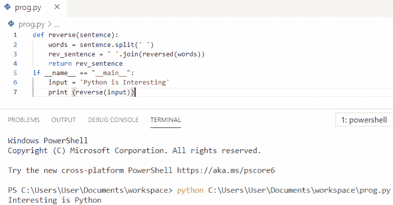

Python code to reverse words in a string

这就是如何在 Python 中**反转一个字符串中的单词。**

## 在 python 中反转句子中的每个单词

在这里，我们将看到如何在 python 中**反转一个句子中的每个单词。**

*   首先，**将**函数定义为 **def revwordSentence(句子)**。
*   现在，我们将把这个句子分成一系列单词
*   为了组成新句子，join()用于连接列表中的单词。
*   最后，**打印出**句子中颠倒的单词

**举例:**

```py
def revwordSentence(Sentence): 
    return ' '.join(word[::-1] 
    for word in Sentence.split(" ")) 
Sentence = "Learn with Understanding"
print(revwordSentence(Sentence)) 
```

为了得到输出，我使用了`print(revwordSentence(Sentence))`。您可以参考下面的输出截图。

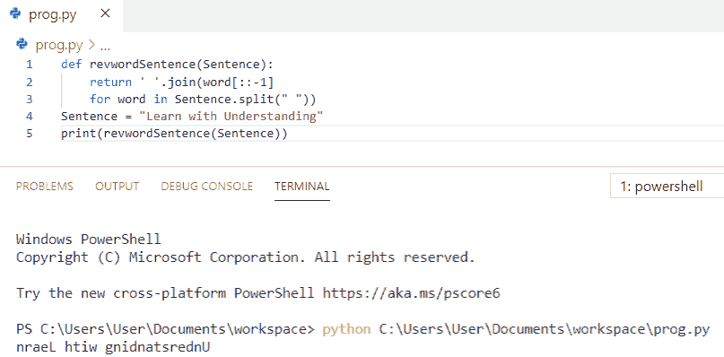

Reverse each word in a sentence in python

这是代码，我们可以用它来反转 python 中一个句子中的每个单词。

## Python 程序在不使用反转函数的情况下反转字符串

现在，我们将看到 **python 程序在不使用反转函数**的情况下反转一个字符串。

*   首先，我们获取一个字符串，并将其存储在变量 `string` 中
*   我们没有使用任何函数，所以我们将使用一个空字符串**“str”**通过一个循环将其与字符串中的每个字母连接起来。
*   **for 循环**用于迭代每个元素。
*   现在，我们将把空字符串 `str` 与一个迭代变量的值连接起来，这个变量将反转字符串。

**举例:**

```py
string=("PythonTest")
str=""
for i in string:
    str = i+str
print("The Reversed string is:",str)
```

为了得到输出，我使用了 **print("反转的字符串是:"，str)** 。您可以参考下面的输出截图。

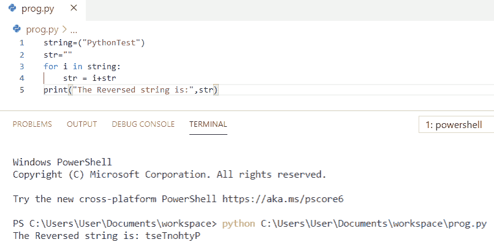

Python program to reverse a string without using reverse function

这是一个不使用反转函数来反转字符串的 Python 程序。

## Python 程序使用类一个字一个字地反转一个字符串

在这里，我们将看到 **python 程序使用类**一个字一个字地反转一个字符串。

*   首先，我创建了一个名为 `Reverse` 的类
*   之后，我们在类内部定义了函数
*   现在，我们将把句子拆分成一个单词列表，并形成新的句子 join()用于连接列表中的单词。
*   最后，打印**反转()。reverse_word('欢迎使用 Python')** 得到输出。

**举例:**

```py
class Reverse:
    def reverse_word(self, str):
        return ' '.join(reversed(str.split()))
print(Reverse().reverse_word('Welcome to Python'))
```

为了得到输出，我使用了 **print(Reverse()。reverse_word('欢迎使用 Python ')**。您可以参考下面的输出截图。

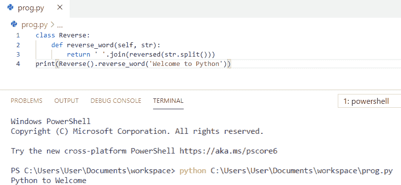

Python program to reverse a string word by word using class

这就是如何使用 Python 中的类**一个字一个字地反转一个字符串。**

您可能会喜欢以下 Python 教程:

*   [Python 程序求 n 个数之和并举例](https://pythonguides.com/python-program-to-find-sum-of-n-numbers/)
*   [Python 程序打印质数](https://pythonguides.com/python-program-to-print-prime-numbers/)
*   [用 Python Tkinter 上传文件](https://pythonguides.com/upload-a-file-in-python-tkinter/)
*   [文件不存在 Python](https://pythonguides.com/file-does-not-exist-python/)
*   [如何在 Python 中读取视频帧](https://pythonguides.com/read-video-frames-in-python/)

在本 Python 教程中，我们学习了用 ****Python 程序来反转一个字符串**** 。此外，我们还讨论了以下主题:

*   Python 程序反转一个字符串
*   从用户输入中反转字符串的 Python 程序
*   使用递归反转字符串的 Python 程序
*   使用 for 循环反转字符串的 Python 程序
*   使用切片反转字符串的 Python 程序
*   Python 程序来一个字一个字地反转一个字符串
*   使用函数反转字符串的 Python 程序
*   使用 while 循环反转字符串的 Python 程序
*   Python 程序在不使用递归的情况下反转字符串
*   不使用 Python 中的函数来反转字符串的 python 程序
*   使用堆栈反转字符串的 Python 程序
*   Python 程序反转除特殊字符以外的字符串
*   Python 程序反转字符串中的每个单词
*   Python 代码来反转字符串中的单词
*   在 python 中反转句子中的每个单词
*   不使用反转函数反转字符串的 Python 程序
*   Python 程序使用类一个字一个字地反转字符串

[Bijay Kumar](https://pythonguides.com/author/fewlines4biju/)

Python 是美国最流行的语言之一。我从事 Python 工作已经有很长时间了，我在与 Tkinter、Pandas、NumPy、Turtle、Django、Matplotlib、Tensorflow、Scipy、Scikit-Learn 等各种库合作方面拥有专业知识。我有与美国、加拿大、英国、澳大利亚、新西兰等国家的各种客户合作的经验。查看我的个人资料。

[enjoysharepoint.com/](https://enjoysharepoint.com/)[](https://www.facebook.com/fewlines4biju "Facebook")[](https://www.linkedin.com/in/fewlines4biju/ "Linkedin")[](https://twitter.com/fewlines4biju "Twitter")