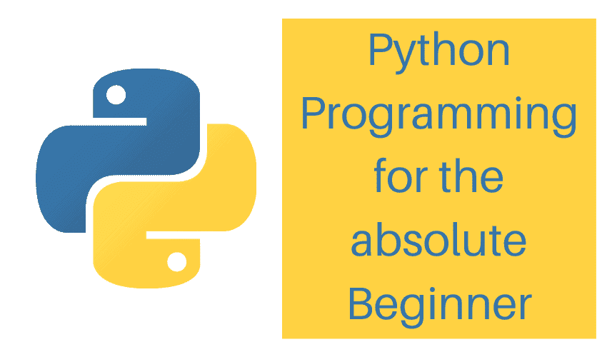
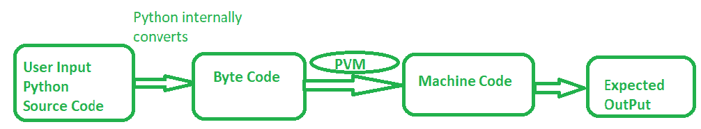
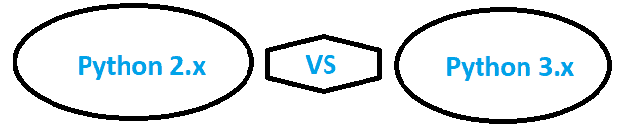

# 面向绝对初学者的 Python 编程

> 原文：<https://pythonguides.com/python-programming-for-the-absolute-beginner/>

如果你想开始学习 python，那么这篇针对绝对初学者的 **python 编程**文章将对你获得 Python 的基础知识有很大帮助。

我在这里假设，你没有或者很少掌握 python 知识，基本上是 Python 的初学者。

目录

*   [Python 编程的绝对初学者](#Python_programming_for_the_absolute_beginner "Python programming for the absolute beginner")
*   [Python 简介](#Introduction_to_Python "Introduction to Python")
*   [Python 的主要用途](#The_main_use_of_Python "The main use of Python")
*   [使用 Python 的优势](#Advantages_of_using_Python "Advantages of using Python")
*   [下载并安装 Python](#Download_and_Install_Python "Download and Install Python")
*   [python 是如何工作的？](#How_does_python_work "How does python work?")
*   [Python 是解释的，还是编译的，或者两者都是？](#Is_Python_interpreted_or_compiled_or_both "Is Python interpreted, or compiled, or both?")
    *   [Python 虚拟机(PVM)](#Python_Virtual_Machine_PVM "Python Virtual Machine (PVM)")
*   [python 为什么如此流行和蓬勃发展？](#Why_python_is_so_popular_and_booming "Why python is so popular and booming?")
*   [Python 版本使用](#Python_version_to_use "Python version to use")
*   [Python 2 . x 和 Python 3.x 版本的区别](#Difference_between_Python_2x_and_Python_3x_versions "Difference between Python 2.x and Python 3.x versions ")
*   [Python 上的常见问题解答](#FAQs_on_Python "FAQs on Python")
    *   [Python 比 Java 简单吗](#Is_Python_easier_than_Java "Is Python easier than Java")
    *   [python 难学吗](#Is_python_hard_to_learn "Is python hard to learn")
    *   [如何处理 python？](#What_to_do_with_python "What to do with python?")
    *   [记事本对 python 好吗](#Is_notepad_good_for_python "Is notepad good for python")
    *   [最流行的 python 包](#Most_popular_python_packages "Most popular python packages")
    *   [python 是编程语言还是脚本语言](#Is_python_a_programming_language_or_scripting "Is python a programming language or scripting")
    *   [Python vs Java 性能](#Python_vs_Java_performance "Python vs Java performance")
    *   [Node.js vs Python](#Nodejs_vs_Python "Node.js vs Python")
    *   [Anaconda vs Python 编程](#Anaconda_vs_Python_programming "Anaconda vs Python programming")
    *   [python 可以用来做 app 吗？](#Can_python_be_used_to_make_apps "Can python be used to make apps?")
    *   python 是未来吗？
    *   [Python 可以用来黑](#Can_Python_be_used_to_hack "Can Python be used to hack")
    *   [如何快速学习编程](#How_to_learn_programming_fast "How to learn programming fast")
    *   [如何让 python 更快](#How_to_make_python_faster "How to make python faster")
    *   [Python 如何结束一个程序](#Python_how_to_end_a_program "Python how to end a program")
    *   [如何更新 python](#How_do_you_update_python "How do you update python")
*   [其他 Python 初学者教程](#Other_Python_beginner_tutorials "Other Python beginner tutorials")
*   [结论](#Conclusion "Conclusion")

## Python 编程的绝对初学者

作为 Python 的**绝对初学者，让我们从什么是 Python 开始？Python 的主要用途是什么？Python 编程语言的特点。为什么 Python 是最流行的编程语言之一？**

还有，我给你解释一下，Python 是怎么工作的？Python 是如何被解释的，还有很多其他的东西？

所以让我们来看看。

python programming for the absolute beginner

## Python 简介

**Python 是什么？** Python 是一种类似 C#的开源[面向对象编程](https://pythonguides.com/object-oriented-programming-python/)语言。Net，Java，C++。等等。

根据[Simplilearn.com 的文章](https://www.simplilearn.com/best-programming-languages-start-learning-today-article)，Python 是 2020 年最好的编程语言之一。

Python 是免费使用的。与其他编程语言相比，**更容易学习**并且它有简单的语法，这使得程序员更容易读、写和理解代码。

它还支持不同类型的标准库，并与第三方库兼容。Python 还支持常见的数据类型，如数字、字符串、[列表、](https://pythonguides.com/create-list-in-python/)、[字典、](https://pythonguides.com/create-a-dictionary-in-python/)等。

例如，在 Python 中，您**在使用之前不需要初始化**任何东西。它将动态初始化，动态语义，它将更新单个对象的多个值。

Python 被各种大型企业广泛使用，如谷歌、脸书、网飞、优步、Instagram、Spotify、Quora、Dropbox、Reddit、YouTube、亚马逊等。

这不是一种新的编程语言，它是由“吉多·范·罗苏姆”在 1991 年发明的。

## Python 的主要用途

让我们来看看 Python 的**主要用途。**

作为一种面向对象的编程语言，我们可以使用 python 开发不同的应用程序，如下所示。

**#1 桌面应用程序(基于 GUI)**

你可以使用 Python 开发不同的基于 GUI 的桌面应用程序。有许多预定义的库，您可以广泛地使用它们来开发基于 GUI 的 Python 桌面应用程序。

库有 `tkinter` 、 `wxWidgets` 、 `Kivy` 等。

**2#网络应用**

Python 用于开发许多 web 应用程序。你可以使用不同的框架，如 `Django` 、 `Flask` 、 `Pyramid` 来开发许多 web 应用程序。

这也支持不同的协议，如 `HTTPS` 、 `IMAP` 、 `FTP` 、 `SSL` 等，有助于 web 应用的开发。

**3#游戏应用**

在目前的市场上，Python 编程语言在很多游戏的开发中起着至关重要的作用。Python 是开发 3D 游戏的最佳选择之一。

有用的库有很多，比如， `PyGame` ， `PySoy` ， `Panda3D` ， `Blender` 等等。我们可以使用这些 Python 库来开发各种 Python 游戏应用程序。

**4#软件开发` `用途**

由于 Python 是一种开源语言，许多初创公司、中型公司和超大型公司都使用 Python 语言来开发许多商业、电子商务和科学软件应用程序。

**5#机器学习(ML)** 连同**人工智能(AI)**

Python 被广泛用于**机器学习(ML)** 的程序，这意味着用这种语言编写的程序可以被机器用来学习和操作**人工智能(AI)** 。

有不同的库，如 `Keras` 、 `TensorFlow` 、 **PyTorch、**等，你可以使用它们来实现这个目的。Python 最适合机器学习(ML)和人工智能(AI)。

**6#数据分析和数据可视化**

当你有大量数据时，Python 被广泛用于数据分析和数据可视化。

数据科学家使用 Python 语言调查大量数据，并在这些数据上可视化正确的数据。

有很多标准库，比如 `Numpy` 、 **SciPy、**等等，你可以和 python 一起使用来实现这个目的。

## 使用 Python 的优势

使用 Python 作为编程语言有很多**优势。详见下文。**

**1-开源**

Python 现在变得如此流行的一个主要原因是因为它是开源的，可以免费使用。初创公司、中型公司或大型公司更喜欢将 Python 作为组织中使用的编程语言。

**2-易学**

Python 非常容易学习，许多初学者在开始他们的载体或者因为他们没有任何编码知识，更喜欢学习 Python。

python 的语法非常容易理解，所以把它作为一门语言是一个巨大的优势。

3-兼容许多第三方库。

Python 与许多第三方库非常兼容，这有助于开发人员或程序员以最小的努力实现许多业务关键功能。

**4-涉及较少编码**

与其他语言相比，当您试图使用这种语言实现任何关键功能时，您不需要编写更多的代码行。

更少编码的主要原因是因为它有广泛的支持库，如用于数值计算的 `NumPy` ，用于大数据分析的 `Pandas` 等等，这确实也帮助了开发者。

**面向所有人的 5-Python**

这是非常容易学习，阅读和写作，所以它适合每个人，包括那些非常新的编程语言。

它有非常简单的语法，简单的数据结构，一组简单的基本数据类型，支持许多标准库，所以它是初学者和有经验的程序员的更好选择

**6-提高生产率**

这有助于开发人员提高他们的生产力，因为它有广泛的支持库。使用这些库可以轻松实现许多功能。

因此，如果你想与其他语言如 C、C++、C#等进行比较，用它来实现这些功能只需要很少的时间。

**7-友好的数据结构**

这提供了非常易于使用的内置数据结构，如列表和字典。

列表和字典的语法非常简单易懂，只需简单地做相关操作。

**8-易于与其他语言集成**

借助于一些像 `Cython` 和 `Jython` 这样的库，这可以很容易地与其他语言如 C++、C、Java 集成，从而使跨平台开发变得容易。

所以你可以**写一次代码，然后在任何地方运行它**。

**9-可以轻松嵌入其他语言。**

您可以轻松地将 Python 代码嵌入到其他语言代码中，例如，如果您使用 C++编写了源代码。您可以轻松地将 python 代码添加到同一个解决方案中。

**10-便携性**

最后，这是非常便携的。你可以**写一次代码，然后在任何地方运行**。它不像其他语言，你需要对代码做很多修改才能在其他平台上运行。

现在，让我们看看 Python 是如何工作的？

## 下载并安装 Python

在继续下一步之前，您可以尝试下载并安装 Python。你还应该知道，你可以在 Python 中使用哪些 ide 和代码编辑器。我已经就此写了一篇单独的文章:

*   [Python 下载安装步骤(Windows 10/Unix/Mac/Ubuntu/CentOS)](https://pythonguides.com/python-download-and-installation/)

## python 是如何工作的？

很多人搜索**python 是如何工作的**？你会在这里得到一个想法。

Python 是一种像 C++、C#等面向对象的语言。在幕后，当你用 C++或 C#、java 编写任何程序时，到底发生了什么？

当你编译源代码时，编译器在内部将源代码转换成机器能理解的机器级代码或机器码，并给出输出。

所以编译器作为你的源代码(人类可理解的语言)转换成机器代码(机器能理解的语言)的中间媒介。

现在在 Python 的例子中，编译也在内部进行，但是这里源代码被转换成“字节码”,而不是像其他语言那样直接转换成机器码。

**Python 虚拟机(PVM)** 将此“字节码”作为输入，并将其处理为机器代码或机器可理解的代码，用于在处理的代码中没有错误的情况下给出输出，否则，如果出现任何错误，它将提示错误消息。

## Python 是解释的，还是编译的，或者两者都是？

现在，让我们明白:

*   python 是如何解读的？
*   python 可以编译吗？
*   Python 是解释的，还是编译的，还是两者都有？

实际上，当 python 代码运行时，它首先**被 python** 编译并生成字节码。所以 python 代码首先被编译，然后被**解释**。

然后，字节码作为输入被处理到 **Python 虚拟机(PVM)** ，PVM 将字节码处理成机器码并得到输出，前提是处理后的代码没有错误。如果在处理的代码中有任何错误，PVM 将提示错误信息。

python 代码的编译发生在内部，对现实世界是不可见的。

**。py 源代码**先编译成字节码为**。pyc** 以及后来用于解释的字节码。

Python 曾经用**创建一个文件。当你试图在内部执行任何。py 文件。所以。pyc 只不过是一个 Python 编译器。**

这就是 Python 也被称为**解释(字节码编译)**语言的原因。

所以，基本上下面是整个故事的步骤

*   步骤 1:用户以 python 代码或程序的形式提供输入
*   第二步:python 将 Python 代码编译成“字节码”。这发生在内部，对现实世界是不可见的。
*   `Step-3` :现在下一个主要角色是 **Python 虚拟机(PVM)** ，它在内部将“字节码”处理成**“机器码”**或**“机器码”**(机器能够理解)，并给我们输出。

这里需要注意一些重要的事情，如果 **Python 虚拟机(PVM)** 在处理字节码时发现任何错误，那么它将提示错误消息，并停止执行。但是，如果它找不到任何错误，或者如果字节码是无错误的，那么 PVM 将为您提供所需的输出。

### Python 虚拟机(PVM)

**Python 虚拟机(PVM)** 又被称为“ **Python 虚拟内存**”，它只不过是在执行 Python 原始代码时起着至关重要作用的软件。

当用户给出 python 原始代码作为输入，或者用户试图执行 python 代码时，Python 会在内部将原始代码编译成“字节码”。

现在，PVM 的实际工作开始了，因此它会将“字节码”处理成机器可以理解的“机器码”，如果代码没有错误，它就会得到实际的输出。

## python 为什么如此流行和蓬勃发展？

让我们试着去理解为什么 Python 在 IT 市场如此流行和蓬勃发展？

以下是 python 如此受欢迎的原因**。**

 ****开源**

python 之所以如此受欢迎，是因为 python 是一种开源语言，这意味着它完全可以免费使用。

**效率更高，代码更少**

Python 是一种高生产力的语言，这意味着与任何其他语言相比，它将花费更少的时间、最少的努力、更少的编码、更少的资源来实现任何复杂的功能，因为它非常简单。

**简单易学**

python 的语法非常简单，看起来就像普通的英语，易于阅读、书写和理解。

**对许多标准库的广泛支持**

Python 对许多标准库和框架有广泛的支持。这有助于程序员用最少的编码工作轻松实现这些功能。

**社区支持**

Python 有非常好的**社区支持**。python 开发者社区非常活跃。这意味着如果任何时候你需要帮助或支持，他们会立即帮助你。

因为 Python 已经存在很长时间了，所以有很多可用的文档和在线教程。不需要任何外部培训就可以轻松学习 python。

**Python 适合所有人**

*   Python 是面向所有人的，这意味着如果有人对编程一无所知，他/她也可以很容易地学习 python，因为它很简单。
*   **Python 是初学者**和有经验程序员的选择。软件工程师可以使用 python 开发网络应用、网站、桌面应用、3D 游戏等。
*   软件测试人员使用带有 python 脚本的 selenium 自动化工具，该脚本易于自动化手动过程。
*   管理人员(因为他们对技术不感兴趣)可以学习 python，使用名为 Panda 的数据分析库来分析大量数据。
*   数据科学家使用 python 语言调查大量数据，并在这些数据上可视化正确的数据。

**广泛用于 ML 和 AI**

Python 也是研究人员的最佳选择。他们将 python 用于许多科学应用。

现在很多人在**机器学习**和**人工智能**领域广泛使用 python，这将是未来。

## **Python 版本使用**

现在，让我们看看使用哪个 Python 版本？

**不同版本**

Python 有 `2.x` 和 `3.x` 这样的版本。它从 2.x 系列开始，后来升级到 3.x 系列。初学者总是有一个困惑，他们应该从 2.x 版还是 3.x 版开始？

**展望未来**

*   这里建议最好从最新版本或升级版本开始，即 `3.x` ，而不是从旧版本开始。因为 3.x 版本才是未来。
*   两个版本各有利弊。就 2.x 版本而言，由于它已经启动了很长时间，所以人们可以从许多基于 2.x 版本构建的标准库中获得更多的文档、免费教程和支持。
*   与 2.x 相比，python 已经开始在 3.x 版本上工作，所以你将在 3.x 版本中获得所有更新的特性。
*   一些基于 2.x 版本开发的标准库已经开始升级以支持 3.x 版本。
*   很少有库已经被更新以支持 3.x 版本。所以没什么好担心的。
*   现在，新的框架或库无论是什么都将由 python 开发，这对于 3.x 版本来说是显而易见的。

**支持前瞻**

*   还有一件事，我们不知道 Python 是否会在某个时间点停止支持旧版本，并会要求每个使用 2.x 版本的人升级到 3.x 版本。因此，如果你不升级到 3.x 版本，那会给你带来麻烦
*   如果你想学习遗留代码，或者你的项目已经在用 2.x 版本开发了，那就另当别论了，或者如果你是初学者，最好从 3.x 版本开始。

**编码方式**

在 3.x 版本中，您将学习一种简洁的代码编写方式。与 2.x 版本相比，有许多新的功能、新的代码编写风格等，这些将对您的运营商有所帮助。

**面向人工智能、人工智能和数据科学**

此外， **Python 3.x 版本面向机器学习(ML)、人工智能(AI)、数据科学**等，这些都是市场上的热潮。所以我觉得还是用 **3.x 版**比较好。

## Python 2 . x 和 Python 3.x 版本的区别

Difference between Python 2.x and Python 3.x versions

python 2.x 和 python 3.x 版本之间存在一些差异。详情请看下文。

| `Python 2.x` | `Python 3.x` |
| 与 python 3.x 相比，语法更加复杂 | 与 python 2.x 相比，语法非常简单 |
| Print 被认为是一个通用语句
示例 print "Hello python guides " | Print 是 python 3.x
示例 print 中的一个函数(“Hello python guides”) |
| 用于检验的 xrange()函数 | 用于检验的 Range()函数 |
| 在异常处理的情况下不需要“as”关键字 | 异常处理时需要“as”关键字 |
| ASCII 是隐式 str 类型 | Unicode 是隐式字符串类型 |
| 异常应该用符号括起来 | 异常应该用括号括起来 |

## Python 上的常见问题解答

让我们来看看 Python 编程语言的一些常见问题。

### Python 比 Java 简单吗

*   许多用户发现 python 比 java 更容易阅读和理解。
*   `Python` 比 java 更人性化。
*   如果你正在开始你的编程生涯，那么你可能想从学习 Python 开始，因为它不太复杂。
*   与 java 相比，Python 的语法更简单。
*   如果有人学习这个新东西，你还没有概念基础来理解对象是什么以及它如何适应程序结构。

### python 难学吗

*   不， **Python 是最容易学的编程语言之一，据已经在研究它的人说。**
*   说到学习编程，那么 python 应该是你的第一语言，因为它比任何其他编程语言都更加用户友好。
*   其直观的编码风格和许多其他优势使得 python 更容易学习。
*   同样，python 是进入编程世界的人的第一语言也有很多原因。
*   Python 是一种简单明了的语言，因为它没有任何复杂的语言语法。

### 如何处理 python？

嗯，这是一个很难回答的问题，因为 python 是开发人员中非常流行的语言，而且有很多 Python 的应用程序。

以下是 python 一些流行的应用程序:

*   **Web 开发**–Python，以其 Django、Flask 等框架为 Web 开发提供了良好的支持。开发人员在前端使用 javascript，在服务器端使用 python。
*   **数据科学和机器学习**——数据科学和机器学习是当今的潮流。这些技术是计算机科学的未来。Python 非常适合分析、实现算法和操纵数据。
*   **自动化和脚本**——我们可以用几行代码实现很多事情的自动化。我们可以设置提醒来下载我们喜欢的视频等。
*   **构建游戏**——Python 支持游戏的开发。Pygame 库对于有音乐、声音等等的游戏非常有用。

### 记事本对 python 好吗

*   记事本功能强大，非常适合 python。
*   这是一个免费的开源编辑器，可以识别几种编程语言。
*   它提供了缩进指南，这对 python 很有用，因为 python 不依赖大括号来定义功能代码块，而是依赖缩进层次。
*   除了语法高亮，它还有一些对编码人员有用的特性。
*   另一个非常方便的功能是，我们可以将代码段分组，并使它们可折叠，这样我们就可以隐藏代码块，使页面更具可读性。

### 最流行的 python 包

有超过 200，000 个 python 包，有这么多包，每个 python 程序员需要知道的最流行和最重要的包如下

*   `NumPy`–NumPy 提供了构建多维数组并对其中存储的数据进行计算的工具。我们也可以做数学运算。
*   Tkinter–它提供了一个带有图形用户界面(GUI 包)的 python 应用程序。
*   熊猫有助于处理和分析大量的数据，而不需要学习像 r。
*   `Pytest`–py test 包提供了多种模块，无论是简单的单元测试还是更复杂的功能测试，py test 都能帮到你。
*   `movie py`–它为与导入、修改和导出视频文件等相关的常见任务提供了一系列功能。

### python 是编程语言还是脚本语言

*   Python 是一种编程语言，但它也可以用于编写脚本。
*   Python 广泛用于编程，是一种在运行时出现的解释型语言。
*   因为它翻译代码，所以它变得比许多其他语言更加灵活和通用。

### Python vs Java 性能

让我们来看看 **Python 与 Java 性能的对比**。

| `Python` | `Java` |
| Python 并没有更快。 | Java 一般更快。 |
| Python 是一种解释型语言，所以效率较低。 | Java 是编译语言，所以效率更高。 |
| Python 有更简单、更简洁的语法。 | Java 没有 python 简单。 |
| Python 被解释为在运行时变慢。 | Java 程序直接编译。 |
| Python 需要两行代码，所以它是一种更可取的语言。 | 用 java 读取一个文件需要 10 行代码。 |

### Node.js vs Python

让我们来看看 `Node.js vs Python` 。

| `Node.js` | `Python` |
| Node.js 最适合异步编程。 | Python 并不是异步编程的最佳选择。 |
| 最适合内存密集型活动。 | 对于内存密集型活动是不可取的。 |
| 它最适合小型项目。 | Python 适合开发更大的项目。 |
| Node.js 利用了 javascript 解释器。 | Python 使用 PyPy 作为解释器。 |
| Node.js 是目前处理实时 web 应用程序的理想平台。 | 不是处理实时 web 应用程序的理想平台。 |

### Anaconda vs Python 编程

| 蟒蛇 | **Python 编程** |
| Anaconda 是 Python 和 R 编程语言的免费开源发行版，用于数据科学和机器学习。 | Python 编程是一种用于通用编程的开源解释型高级编程语言。 |
| Anaconda 属于数据科学工具。 | Python 属于计算机语言。 |
| Anaconda 提供了 conda 作为软件包。 | Python 提供了 pip 作为包 |
| 它拥有比 python 更小的社区。 | 有一个很大的社区。 |
| 包管理器 conda 允许 python 以及非 python 库。 | Python pip 允许安装 Python 依赖项。 |

### python 可以用来做 app 吗？

是的，你可以使用 python 开发不同的应用程序。开发者正在使用许多 python 框架来开发不同的应用。

*   Kivy 是 python 中最流行的框架之一，你可以用它来开发许多移动应用。
*   Kivy 是一个用于开发移动应用的开源 Python 库。它绝对免费使用。
*   Kivy 可以在 Android、iOS、Linux、OS X 和 Windows 上运行。
*   Kivy 平台易于使用，非常用户友好。
*   除了 kivy，许多人都在使用其他框架开发不同的应用程序。
*   也可以一些很酷的框架像 Django，Flask，Py4A，Web2py，Bottle，CherryPy 来开发不同的 app。

### python 是未来吗？

*   是的，python 被认为是一个未来，因为许多顶级公司都在使用 python，并通过使用它开发了成功的应用程序。
*   已经看到 python 在 21 世纪有了显著的、持续的趋势性增长。
*   Python 已经设法达到了比其他语言更高的水平，使其成为发展最快的语言。
*   随着其他技术的加入，Python 也有着光明的未来。
*   Python 已经成功地吸引了程序员的注意力，因为它充满了将它带到一个新水平的特性。
*   Python 是专业开发人员最喜爱的五种编程语言之一。
*   python 的成长清楚地描绘了 python 的稳步提升，并且它在 ML 和 AI 等技术中也有光明的前景。

### Python 可以用来黑

*   是的，python 可以用于黑客攻击，因为它有很棒的库。
*   当你开始学习黑客的核心时，python 是非常棒的。
*   Python 非常好学，所以用 python 学黑客会很好玩。
*   黑客通常开发小脚本，python 作为一种脚本语言提供了惊人的性能。
*   Python 在道德黑客和网络安全行业中发挥着重要作用，这些行业主要用于开发各种渗透测试和黑客工具。

### 如何快速学习编程

下面是一些如何快速学习编程的小技巧。

1.  **学习编码时，试着玩代码**–如果你正在学习编码，那就开始玩代码，越早开始玩代码，你就能越快地学会概念。
2.  **明确你的基础概念**–编程基础非常重要，你理解得越好，概念就越容易学。学生或初学者在学习编程时犯的错误是跳过基础概念。所以，当你开始编程的时候，选择一种编程语言，坚持下去，在进入下一种之前，先弄清楚编程的所有基础知识。
3.  开始练习，而不仅仅是阅读——你真的需要亲自动手编写代码，并坚持定期练习。初学者在学习编程时犯的一个大错误就是只看书，只看示例代码而不实践。当你写代码的时候，玩代码，在修改代码的时候得到一个错误，看到不同的结果，然后你试着去解决它。这样，你的逻辑能力会日益提高，你的编程理念也会越来越好。
4.  手工编写代码对于学生和大一新生来说非常重要，这是学习编程最有效的方法之一。所以，开始在白板或笔记本上手写代码吧。这也是一个很好的面试，当你要申请一份编程方面的工作时，大部分时间技术评估过程将包括手工代码。手工编码让你对语法和逻辑有一个清晰的理解。
5.  **寻求帮助，讨论和分享**–一般来说，初学者在需要寻求帮助时会感到害羞，他们在学习编程时会犹豫是否寻求帮助。问傻问题没关系，长远来看对你有帮助。所以接受帮助或找一个导师来轻松理解概念是很好的。总是与朋友或合作程序员讨论你的代码。最好的方法之一是分享你的知识和进行讨论，这将使你成为一名更好的程序员。
6.  **使用更多在线资源**——有非常好的教程和大量免费和付费的在线资源。因此，您可以从这些在线资源中获得帮助，并快速学习编程。您可以访问在线资源，只需点击一下鼠标就可以开始编程之旅。
7.  **调试时休息**——学习编程时休息是非常重要的。在电脑前坐几个小时是不好的，因为这样做会使你筋疲力尽。稍微休息一下总是好的。在调试代码的时候，请记住，你不应该花太多时间去找 bug，所以休息一下，刷新一下你的思维，做点别的事情。这会恢复你的注意力，你可能会想出解决办法。这样做会远离挫败感和头痛。

### 如何让 python 更快

有一些方法可以让 python 更快。

1.  **保持 python 代码小而轻**–保持 python 代码最简单对于快速工作非常重要。因此，为了让 python 更快，尽可能保持 python 代码的紧凑性，以减少延迟并提高速度。
2.  避免不必要的循环–在任何编程语言中过多的循环都不是一件好事。
3.  **使用内置函数和库**–像 max、min、sum 和 map 这样的内置函数非常高效。
4.  考虑编写自己的生成器——在处理列表时，考虑编写自己的生成器。当读取大量文件时，生成器特别有用。
5.  使用最新版本的 python——新版本的语言在技术上比以前更快、更优化。

### Python 如何结束一个程序

要在 python 中结束程序，您必须意识到代码有一个无限循环的事实。当我们运行代码时，它会进入一个无限循环。在这种情况下，我们必须停止代码执行。在 python 中有一些结束程序的方法:

*   使用“os.exit()”
*   使用“sys.exit()”
*   使用“退出”

### 如何更新 python

*   更新 python 非常容易和简单。首先访问网站，然后下载最新版本的解释器。你可以从这个链接下载[https://www.python.org/downloads/](https://www.python.org/downloads/)
*   上面的链接会带你到下载页面，然后你就可以安装最新版本了。
*   如果您的机器上已经安装了旧版本的 python，那么在这种情况下，您将得到一个更新提示，就这样。
*   现在，您可以享受最新的 python 版本了。

## 其他 Python 初学者教程

您也可以查看以下有用的 Python 初学者教程:

*   [Python hello world 程序](https://pythonguides.com/python-hello-world-program/):按照本文创建你的第一个 **Python hello world 程序**。
*   [python 变量](https://pythonguides.com/create-python-variable/):这篇文章将帮助你学习如何**创建一个 Python 变量**，给变量赋值，Python 中变量的类型等等。
*   [Python 字符串变量](https://pythonguides.com/create-a-string-in-python/):在本教程中，你将学习 **Python 字符串变量**，如何在 Python 中创建变量，各种 Python 字符串函数等。
*   [Python 命名约定](https://pythonguides.com/python-naming-conventions/):这是一个关于 **Python 命名约定**的完整教程。Python 变量、类、函数、对象、模块、包等的命名约定。
*   [Python 字典](https://pythonguides.com/create-a-dictionary-in-python/):在本教程中，你将了解到 **Python 字典**，什么是 Python 中的字典？如何创建 Python 字典？
*   [Python 列表](https://pythonguides.com/create-list-in-python/):在本教程中，你将了解到 **Python 列表**，如何用 Python 创建列表？如何从字符串、字典等创建列表。
*   [Python 内置函数](https://pythonguides.com/python-built-in-functions/):本文举例说明 **Python 内置函数**。
*   [Python For Loop](https://pythonguides.com/python-for-loop/) :在本教程中，学习 `Python For Loop` ，各种循环如嵌套循环、else in loop、for loop backward 等。
*   [Python While 循环](https://pythonguides.com/python-while-loop/):了解 Python While 循环，Python 中的无限 While 循环，Python While 循环多个条件等。
*   [Python if else](https://pythonguides.com/python-if-else/) :本文用几个例子解释 `Python if-else` 。Python elif 语句，Python 嵌套 if 语句。
*   [Python 中的哈希表](https://pythonguides.com/hash-table-in-python/):了解 **Python 哈希表**，它还解释了如何访问值、更新值以及从哈希表中删除项目。
*   [Python 数组](https://pythonguides.com/python-array/):本教程讲解 **Python 数组**，什么是 Python 数组，如何获取数组长度，添加数组元素，在 Python 数组中添加、删除项目。
*   [python 中的函数](https://pythonguides.com/function-in-python/):学习什么是 Python 中的**函数**，如何在 Python 中创建函数，调用函数 Python，在 Python 中返回值。
*   [Python 关键词](https://pythonguides.com/python-keywords/):在本教程中，通过各种例子了解 **Python 关键词**。获取更多关于 Python 关键字的信息，如 class、del、def、true、false、break、continue、if、else、return、import、lambda、none、try、pass、in 关键字等。
*   [python 中的 tuple](https://pythonguides.com/create-a-tuple-in-python/):在本教程中，您可以了解到 python 中的`tuple`，在 Python 中创建一个空 Tuple，在 Python 中访问 Tuple 项，如何在 Python 中连接两个 Tuple 等。

## 结论

下面是几个 **Python 初学者教程**，会对你**学习 Python** 有所帮助。

我希望这篇 **Python 编程绝对初学者教程**能够帮助初学者学习 Python，它涵盖了以下主题。

*   Python 简介
*   Python 的主要用途
*   使用 Python 的优势
*   python 是如何工作的？
*   Python 是解释的，还是编译的，还是两者都有？
*   Python 虚拟机(PVM)
*   python 为什么如此流行和蓬勃发展？
*   要使用的 Python 版本
*   Python 2.x 和 Python 3.x 版本之间的区别
*   Python 上的常见问题
*   Python 比 Java 简单吗
*   python 难学吗
*   Python 与 Java 性能的对比
*   Node.js vs Python
*   python 可以用来做 app 吗？
*   python 是未来吗？
*   Python 可以用来黑客吗
*   其他 Python 初学者教程

[Bijay Kumar](https://pythonguides.com/author/fewlines4biju/)

Python 是美国最流行的语言之一。我从事 Python 工作已经有很长时间了，我在与 Tkinter、Pandas、NumPy、Turtle、Django、Matplotlib、Tensorflow、Scipy、Scikit-Learn 等各种库合作方面拥有专业知识。我有与美国、加拿大、英国、澳大利亚、新西兰等国家的各种客户合作的经验。查看我的个人资料。

[enjoysharepoint.com/](https://enjoysharepoint.com/)**