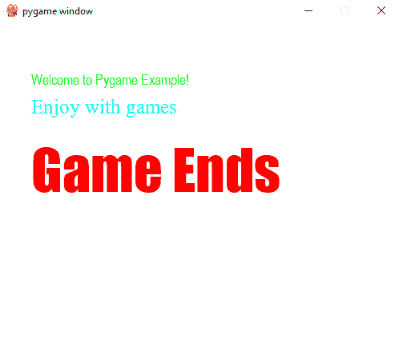
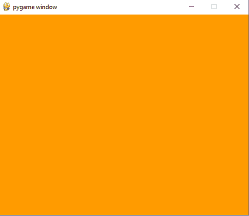

# Python Pygame 教程+ 36 个例子

> 原文：<https://pythonguides.com/python-pygame-tutorial/>

[](https://sharepointsky.teachable.com/p/python-and-machine-learning-training-course)

想了解 Python pygame？继续阅读这个 **Python pygame 教程**，我已经用 Python 解释了各种 pygame 例子，我希望这个 **Python pygame 初学者教程**能帮助你**学习 Python pygame** 。

我们将讨论这些主题:

*   python 中的 Pygame 是什么？
*   如何在 python 中安装 Pygame
*   python 中的 Pygame 模块
*   Python Pygame 示例
*   如何在 python pygame 中将屏幕放在特定的位置
*   如何获取 python pygame 窗口的大小
*   如何在 python pygame 中调整窗口大小
*   如何用 python pygame 画圆
*   如何使用 python pygame 绘制矩形
*   如何使用 python pygame 画线
*   如何使用 python pygame 绘制椭圆
*   如何使用 python pygame 绘制多边形
*   如何使用 python pygame 绘制三角形
*   如何使用 python pygame 绘制圆弧
*   如何使用 pygame 获得 python 中的字体
*   如何在 python pygame 中显示文本
*   Python 如何在 pygame 中制作一个文本矩形
*   如何在 python pygame 中移动对象
*   使用 python pygame 中的箭头键绘制设计
*   如何在 python pygame 中缩放图像
*   如何在 python pygame 中显示图像
*   Python pygame 错误:显示图像时没有这样的文件或目录
*   在 python pygame 中调整图像大小
*   如何在 python pygame 中添加背景图片
*   如何在 python pygame 中将图像添加到背景图像中
*   如何在 python pygame 中改变屏幕背景颜色
*   如何在 python pygame 中终止游戏
*   如何在 python pygame 中添加颜色飘动效果
*   如何在 python pygame 中跟踪鼠标移动
*   如何在 python pygame 中创建按钮
*   如何用 pygame 播放 python 中的音频
*   如何在屏幕上显示两行 python pygame 消息
*   Python pygame 动画
*   Python pygame 雪地动画
*   带圆圈的 Python pygame 动画
*   Python 如何在 pygame 窗口中获得用户输入
*   Python pygame 制作了一个以正弦模式运动的球的动画

目录

[](#)

*   [python 中的 Pygame 是什么？](#What_is_Pygame_in_python "What is Pygame in python?")
*   [如何在 python 中安装 Pygame](#How_to_install_Pygame_in_python "How to install Pygame in python")
*   [python 中的 Pygame 模块](#Pygame_module_in_python "Pygame module in python")
*   [Python Pygame 示例](#Python_Pygame_example "Python Pygame example")
*   [如何在 python pygame 中把屏幕放在特定的位置](#How_to_put_the_screen_in_a_specific_spot_in_python_pygame "How to put the screen in a specific spot in python pygame")
*   [如何获取 Python pygame 窗口的大小](#How_to_get_the_size_of_Python_pygame_window "How to get the size of Python pygame window")
*   [如何在 python pygame 中调整窗口大小](#How_to_resize_a_window_in_python_pygame "How to resize a window in python pygame")
*   [如何用 python pygame 画圆](#How_to_draw_a_circle_using_python_pygame "How to draw a circle using python pygame")
*   [如何使用 python pygame 绘制矩形](#How_to_draw_a_rectangle_using_python_pygame "How to draw a rectangle using python pygame")
*   [如何用 python pygame 画线](#How_to_draw_a_line_using_python_pygame "How to draw a line using python pygame")
*   [如何使用 python pygame 绘制椭圆](#How_to_draw_an_ellipse_using_python_pygame "How to draw an ellipse using python pygame")
*   [如何使用 python pygame 绘制多边形](#How_to_draw_a_polygon_using_python_pygame "How to draw a polygon using python pygame")
*   [如何使用 python pygame 绘制三角形](#How_to_draw_a_triangle_using_python_pygame "How to draw a triangle using python pygame")
*   [如何用 python pygame 画圆弧](#How_to_draw_an_arc_using_python_pygame "How to draw an arc using python pygame")
*   [如何使用 pygame 获取 python 中的字体](#How_to_get_the_font_in_python_using_pygame "How to get the font in python using pygame")
*   [如何在 python pygame 中显示文本](#How_to_display_text_in_python_pygame "How to display text in python pygame")
*   [Python 如何在 pygame 中制作文字矩形](#Python_how_to_make_a_text_rectangle_in_pygame "Python how to make a text rectangle in pygame")
*   [如何在 python pygame 中移动对象](#How_to_move_an_object_in_python_pygame "How to move an object in python pygame")
*   [使用 python pygame 中的箭头键绘制设计](#Draw_design_using_the_arrow_keys_in_python_pygame "Draw design using the arrow keys in python pygame")
*   [如何在 python pygame 中缩放图像](#How_to_scale_an_image_in_python_pygame "How to scale an image in python pygame")
*   [如何在 python pygame 中显示图像](#How_to_display_an_image_in_python_pygame "How to display an image in python pygame")
*   [Python pygame 错误:显示图像时“没有这样的文件或目录”](#Python_pygame_error_No_such_file_or_directory_while_displaying_an_image "Python pygame error: ‘No such file or directory’ while displaying an image")
*   [在 python pygame 中调整图像大小](#Resize_the_image_in_python_pygame "Resize the image in python pygame")
*   [如何在 python pygame 中添加背景图片](#How_to_add_background_image_in_python_pygame "How to add background image in python pygame")
*   [如何在 python pygame 中给背景图片添加图片](#How_to_add_an_image_to_a_background_image_in_python_pygame "How to add an image to a background image in python pygame")
*   [如何在 python pygame 中改变屏幕背景颜色](#How_to_change_the_screen_background_color_in_python_pygame "How to change the screen background color in python pygame")
*   [如何在 python pygame 中终止游戏](#How_to_terminate_game_in_python_pygame "How to terminate game in python pygame")
*   [如何在 python pygame 中添加色彩飘动效果](#How_to_add_color_breezing_effect_in_python_pygame "How to add color breezing effect in python pygame")
*   [如何在 python pygame 中追踪鼠标移动](#How_to_track_mouse_movement_in_python_pygame "How to track mouse movement in python pygame")
*   [如何在 python pygame 中创建按钮](#How_to_create_buttons_in_python_pygame "How to create buttons in python pygame")
*   [如何用 pygame 播放 python 中的音频](#How_to_play_audio_in_python_with_pygame "How to play audio in python with pygame")
*   [如何在屏幕上显示两行 python pygame 消息](#How_to_display_message_on_screen_on_two_lines_python_pygame "How to display message on screen on two lines python pygame")
*   [Python pygame 动画](#Python_pygame_animation "Python pygame animation")
*   [Python pygame 雪地动画](#Python_pygame_snow_animation "Python pygame snow animation")
*   [带圆圈的 Python pygame 动画](#Python_pygame_animation_with_a_circle "Python pygame animation with a circle")
*   [Python 如何在 pygame 窗口中获取用户输入](#Python_how_to_get_user_input_in_a_pygame_window "Python how to get user input in a pygame window")
*   [Python pygame 动画制作一个球以正弦模式运动](#Python_pygame_animate_a_ball_to_move_in_a_sine_pattern "Python pygame animate a ball to move in a sine pattern")

## python 中的 Pygame 是什么？

*   Python Pygame 是一组跨平台的 Python 模块，用于创建视频游戏。
*   它还包括用于 Python 编程语言的图形和声音库。
*   Pygame 适合创建任何类型的游戏。

你可能会喜欢绝对初学者的 [Python 编程](https://pythonguides.com/python-programming-for-the-absolute-beginner/)和使用 Python 的机器学习[。](https://pythonguides.com/machine-learning-using-python/)


python pygame tutorial

## 如何在 python 中安装 Pygame

*   要在 python 中安装 pygame，第一步是确保你有一个受支持的 python 版本。
*   现在，打开命令行，在 cmd 上写下以下命令。

**安装 pygame 的命令:**

```py
pip install pygame
```

## python 中的 Pygame 模块

`Pygame` 有一些模块， `pygame.draw` 用于在表面绘制形状。

*   `py game . draw . circle`–该功能用于围绕一个点画一个圆。
*   `py game . draw . rect`–该函数用于绘制矩形。
*   `py game . draw . polygon`–该函数用于绘制任意边数的形状。
*   `py game . draw . ellipse`–该功能用于在矩形内绘制圆形。
*   `py game . draw . line`–该功能用于绘制直线。
*   `py game . draw . arc`–该函数绘制椭圆的部分截面。
*   `py game . draw . lines`–该函数绘制多个连续的线段。

## Python Pygame 示例

现在，在这个 **Python pygame 教程**中，让我们看看 python pygame 上的**例子。**

*   首先**导入 pygame** ，它提供对 pygame 框架的访问并导入所有函数。
*   `pygame.init()` 用于初始化 pygame 所有需要的**模块**。
*   **SCR = py game . display . set _ mode((600，500))** 用于显示所需大小的窗口。这里，宽度是 600，高度是 500。
*   **py game . display . set _ caption(' py game Window ')**用来定义我们的显示**“caption”**。所以，我们给它起了个名字**【Pygame Window】**。
*   这里， `done = False` 只是我们初始设置的一个变量。
*   现在，我们将运行**循环**，它将运行单元**完成**。所以，我们将使用**【done = True】**来退出窗口。
*   `pygame.event.get()` 用于清空事件队列。呼叫是很重要的，如果我们不呼叫，那么窗口消息将开始堆积，它将变得没有响应。
*   pygame。QUIT 用于在我们点击窗口的关闭按钮时终止事件。
*   `pygame.display.flip()` 移动缓冲区。调用这个函数是很重要的，这样我们就可以在游戏屏幕上进行任何更新。

**举例:**

```py
import pygame  
pygame.init()  
scr = pygame.display.set_mode((600,500))  
pygame.display.set_caption('Pygame Window')
done = False  
while not done:  
    for event in pygame.event.get():  
        if event.type == pygame.QUIT:  
            done = True  
pygame.display.flip() 
```

在这个输出中，我们可以看到新窗口显示为带有标题的输出。


Python Pygame example

你可能喜欢 [Python GUI 编程](https://pythonguides.com/python-gui-programming/)

## 如何在 python pygame 中把屏幕放在特定的位置

让我们看看**如何在 python pygame** 中把屏幕放在特定的位置。

*   为了把屏幕放在特定的位置，我们将首先导入操作系统，然后我们可以导入 pygame 和时间模块。
*   我们将使用 **SDL 环境**变量，这样就可以用 python 中的 `os.environ` 来设置环境变量。
*   并且 `X` 和 `Y` 是为特定的点设置的。
*   **win _ screen = py game . display . set _ mode((500，500))** 用于设置大小， `time.sleep(2)` 等待一段时间显示窗口。

**举例:**

```py
import os
import pygame
import time
X = 100
Y = 100
os.environ['SDL_VIDEO_WINDOW_POS'] = "%d,%d" % (X,Y)
pygame.init()
win_screen = pygame.display.set_mode((500,500))
time.sleep(2)
```

在这个输出中，我们可以看到新窗口出现在 python pygame 的特定位置。


How to put the screen in a specific spot in python pygame

## 如何获取 Python pygame 窗口的大小

我们来看看**如何获取 python pygame 窗口**的大小。

*   首先**导入 pygame** ，它提供对 pygame 框架的访问并导入所有函数。
*   `pygame.init()` 用于初始化 pygame 所有需要的**模块**。
*   `SCR = py game . display . set _ mode()`使用此方法形成屏幕。
*   为了获得屏幕的大小，我们将使用 `"scr.get_size()"` 方法。
*   这里， `pygame.display.quit()` 用于退出 pygame， **print(x，y)** 用于打印值。

**举例:**

```py
import pygame
pygame.init() 
scr = pygame.display.set_mode()
x, y = scr.get_size() 
pygame.display.quit() 
print(x, y) 
```

在下面的输出中，你可以看到 python pygame 窗口的大小。

**输出:**

```py
1366 768
```

## 如何在 python pygame 中调整窗口大小

让我们看看**如何在 python pygame** 中调整窗口大小。

*   首先**导入 pygame** ，它提供对 pygame 框架的访问并导入所有函数。
*   为了形成一个屏幕，我们将使用`py game . display . set _ mode()`方法，使用 **pygame 调整大小。可调整大小**。
*   **py game . display . set _ caption(' Resizable Window ')**用于根据用户选择设置标题。
*   然后**使用 while 运行 pygame** ，要在关闭窗口后退出 pygame，我们使用了 `pygame.quit()` 。

**举例:**

```py
import pygame 
scr = pygame.display.set_mode((500, 400),pygame.RESIZABLE) 
pygame.display.set_caption('Resizable Window') 
running = True
while running: 
    for event in pygame.event.get(): 
        if event.type == pygame.QUIT: 
            running = False
pygame.quit() 
```

在这个输出中，我们可以看到新窗口出现，我们可以相应地调整窗口的大小。


How to resize a window in python pygame

在下面的输出中，我们可以看到调整大小是在同一个窗口上进行的。


How to resize a window in python pygame

## 如何用 python pygame 画圆

我们来看看**如何用 python pygame** 画圆。

*   首先我们将**导入 pygame** 。 `pygame.init()` 用于初始化 pygame 所有需要的**模块**。
*   **SCR = py game . display . set _ mode((600，500))** 用于显示所需大小的窗口。这里，宽度是 600，高度是 500。
*   这里，while 用于运行，直到用户要求退出。
*   现在， **scr.fill((255，255，255))** 用于用白色填充背景。
*   为了绘制红色的圆，我们使用了**(200，0，0)**、**(250，250)**参数来指定圆的中心坐标，**、【80】**是以像素为单位绘制的圆的半径。
*   `pygame.display.flip()` 用于将显示的内容更新到屏幕上。

**举例:**

```py
import pygame
pygame.init()
scr = pygame.display.set_mode((600, 500))
running = True
while running:
    for event in pygame.event.get():
        if event.type == pygame.QUIT:
            running = False
    scr.fill((255, 255, 255))
    pygame.draw.circle(scr, (200, 0, 0), (250, 250), 80)
    pygame.display.flip()
pygame.quit()
```

在这个输出中，我们可以看到新窗口出现了，红色的圆圈出现在 pygame 窗口上。


How to draw a circle using python pygame

## 如何使用 python pygame 绘制矩形

*   首先我们将**导入 pygame** 。 `pygame.init()` 用于初始化 pygame 所有需要的**模块**。
*   **SCR = py game . display . set _ mode((500，500))** 用于显示所需大小的窗口。这里，宽度是 500，高度是 500。
*   这里，浅蓝色采用 **color = (0，0，255)** 。
*   为了绘制矩形，我们将使用 **"pygame.draw.rect(scr，color，pygame。Rect(60，60，100，100))"** 。
*   `pygame.display.flip()` 用于将显示的内容更新到屏幕上。为了控制屏幕，我们使用了**“虽然真实:通过”**。

**举例:**

```py
import pygame 
pygame.init() 
scr = pygame.display.set_mode((500,500)) 
color = (0,0,255) 
pygame.draw.rect(scr, color, pygame.Rect(60, 60, 100, 100)) 
pygame.display.flip() 
while True:
  pass
```

在这个输出中，我们可以看到新窗口出现了，并且在 pygame 窗口上绘制了矩形。


How to draw a rectangle using python pygame

## 如何用 python pygame 画线

现在，我们将看到**如何使用 python pygame** 绘制一条线

*   首先我们将**导入 pygame** 。 `pygame.init()` 用于初始化 pygame 所有需要的**模块**。
*   **SCR = py game . display . set _ mode((500，500))** 用于显示所需大小的窗口。这里，宽度是 500，高度是 500。
*   这里， **color = (0，255，0)** 用于绿色。
*   **pygame.draw.line(scr，color，(40，300)，(140，300)，6)** 用于绘制线条。这里，参数**(40，300)**用于起点，**(140，300)**用于终点， `"6"` 用于线条的粗细。
*   `pygame.display.flip()` 用于将显示的内容更新到屏幕上。为了控制屏幕，我们使用了**“虽然真实:通过”**。

**举例:**

```py
import pygame 
pygame.init() 
scr = pygame.display.set_mode((500,500)) 
color = (0,255,0) 
pygame.draw.line(scr, color, (40, 300), (140, 300), 6)
pygame.display.flip() 
while True:
  pass
```

在这个输出中，我们可以看到新窗口出现了，并且在 pygame 窗口上画了一条线。


How to draw a line using python pygame

## 如何使用 python pygame 绘制椭圆

让我们**用 python pygame** 画一个椭圆

 ***   首先，我们将**导入 pygame** 。 `pygame.init()` 用于初始化 pygame 所有需要的**模块**。
*   **SCR = py game . display . set _ mode((500，500))** 用于显示所需大小的窗口。这里，宽度是 500，高度是 500。
*   这里，**白色= (255，255，255)** 用于白色。
*   **pygame.draw.ellipse(scr，white，(350，250，60，90)，4)** 用于绘制椭圆。这里， **(350，250，60，90)** 用于包围椭圆，**“4”**用于厚度。
*   `pygame.display.flip()` 用于将显示的内容更新到屏幕上。为了控制屏幕，我们使用了**“虽然真实:通过”**。

**举例:**

```py
import pygame 
pygame.init() 
scr = pygame.display.set_mode((500,500)) 
white = (255,255,255) 
pygame.draw.ellipse(scr, white , (350, 250, 60, 90), 4)
pygame.display.flip() 
while True:
  pass
```

在这个输出中，我们可以看到出现了新窗口，并且在 pygame 窗口上绘制了椭圆。


How to draw an ellipse using python pygame

## 如何使用 python pygame 绘制多边形

*   首先，我们将**导入 pygame** 。 `pygame.init()` 用于初始化 pygame 所有需要的**模块**。
*   **SCR = py game . display . set _ mode((600，500))** 用于显示所需大小的窗口。这里，宽度是 600，高度是 500。
*   这里，**紫色= (102，0，102)** 用于紫色。
*   **pygame.draw.polygon(scr，purple，((146，0)，(291，106)，(236，277)，(56，277)，(0，106)))** 用于绘制多边形。
*   `pygame.display.flip()` 用于将显示的内容更新到屏幕上。为了控制屏幕，我们使用了**“虽然真实:通过”**。

**举例:**

```py
import pygame 
pygame.init() 
scr = pygame.display.set_mode((600,500)) 
purple = (102, 0, 102) 
pygame.draw.polygon(scr, purple, 
                    ((146, 0), (291, 106),(236, 277), (56, 277), (0, 106))) 
pygame.display.flip() 
while True:
  pass
```

在这个输出中，我们可以看到新窗口出现了，并且在 pygame 窗口上绘制了多边形。


How to draw a polygon using python pygame

## 如何使用 python pygame 绘制三角形

在这里，我们将看到**如何使用 python pygame** 绘制三角形

*   首先，我们将**导入 pygame** 。 `pygame.init()` 用于初始化 pygame 所有需要的**模块**。
*   **SCR = py game . display . set _ mode((500，500))** 用于显示所需大小的窗口。这里，宽度是 500，高度是 500。
*   这里，**浅绿色= (0，255，0)** 用于浅绿色。
*   **pygame.draw.polygon(scr，lightgreen，((100，100)，(0，200)，(200，200))，3)** 用于使用 polygon 函数绘制三角形，**“3”**是用于三角形粗细的参数。
*   `pygame.display.flip()` 用于将显示的内容更新到屏幕上。为了控制屏幕，我们使用了**“虽然真实:通过”**。

**举例:**

```py
import pygame 
pygame.init() 
scr = pygame.display.set_mode((500,500)) 
lightgreen = (0, 255, 0) 
pygame.draw.polygon(scr, lightgreen, ((100, 100), (0, 200),(200, 200)), 3) 
pygame.display.flip() 
while True:
  pass
```

在这个输出中，我们可以看到新窗口出现了，并且在 pygame 窗口上绘制了三角形。


How to draw a triangle using python pygame

## 如何用 python pygame 画圆弧

在这里，我们将看到**如何使用 python pygame** 绘制圆弧

*   首先，我们将**导入 pygame** 。 `pygame.init()` 用于初始化 pygame 所有需要的**模块**。
*   **SCR = py game . display . set _ mode((500，500))** 用于显示所需大小的窗口。这里，宽度是 500，高度是 500。
*   还有，我们已经给出了 `pi = 3.14` 。为了画出一条弧线，我们使用了 **pygame.draw.arc(scr，white，[210，100，250，200]，0，pi / 2，2)** 。
*   `pygame.display.flip()` 用于将显示的内容更新到屏幕上。为了控制屏幕，我们使用了**“虽然真实:通过”**。

**举例:**

```py
import pygame 
pygame.init() 
scr = pygame.display.set_mode((500,500))
pi = 3.14 
white = (255, 255, 255) 
pygame.draw.arc(scr, white, [210, 100, 250, 200], 0, pi / 2, 2)  
pygame.display.flip() 
while True:
  pass
```

在这个输出中，我们可以看到新窗口出现了，并且在 pygame 窗口上画出了弧线。


How to draw an arc using python pygame

## 如何使用 pygame 获取 python 中的字体

*   首先我们会**导入 pygame** 和 `sys` 。 `pygame.init()` 用于初始化 pygame 所有需要的**模块**。
*   **screen = py game . display . set _ mode((500，400))** 用于显示所需大小的窗口。这里，宽度是 500，高度是 400。
*   对于字体，我们使用了 `SysFont()` 函数，其中给出了字体的**名称**和**字体大小**。正如你所看到的，我们已经创建了几种类型的字体。
*   例如，我们为文本创建了一种小字体。我们有另一种字体类型为**乐趣**与小大字体和一个大得多的字体，我们有**游戏结束**。
*   现在我们必须渲染选择的字体并创建一个表面对象。在渲染的时候，我们也必须决定颜色。**真参数**用于使边缘更平滑。
*   因此，最后一步是在屏幕上显示对象。 `surface.blit()` 函数用于显示。它有两个参数，第一个是表面对象，第二个是绘制表面对象的一对坐标。

**举例:**

```py
import pygame, sys
pygame.init()
screen = pygame.display.set_mode((500, 400))
font = pygame.font.SysFont('arial', 18)
new_font = pygame.font.SysFont('Timesnewroman', 25)
new_font2 = pygame.font.SysFont('impact', 70)
text = font.render("Welcome to Pygame Example!",True, (0,255,0))
fun = new_font.render("Enjoy with games", True, (0,255,255))
game_end = new_font2.render("Game Ends", True, (255,0,0))
while True:
    for event in pygame.event.get():
        if event.type == pygame.QUIT:
            pygame.quit()
            sys.exit() 
    screen.fill((255, 255, 255)) 
    screen.blit(text, (40,60))
    screen.blit(fun, (40,90))
    screen.blit(game_end, (40,140))
    pygame.display.flip()
```

在这个输出中，我们可以看到新窗口出现了，使用 pygame 的 python 中的文本字体



How to get the font in python using pygame

## 如何在 python pygame 中显示文本

现在，我们将看到**如何在 python pygame** 中 **显示文本**

*   首先，我们将**导入 pygame** 。 `pygame.init()` 用于初始化 pygame 所有需要的**模块**。
*   **SCR = py game . display . set _ mode((700，600))** 用于显示所需大小的窗口。这里，宽度是 700，高度是 600。
*   对于字体，我们使用了 **"pygame.font.SysFont("Arial "，80)"** 。
*   用来渲染文本的语法是 **render(text，antialias，color，background=None)** 。该函数用于在新表面上绘制文本。
*   **scr.fill((0，0，0))** 用于背景的黑色。
*   pygame 显示表面对象的 `scr.blit()` 方法。使用 blit()方法将文本表面对象复制到显示表面对象。

**举例:**

```py
import pygame  
pygame.init()  
scr = pygame.display.set_mode((700, 600))  
done = False  
font = pygame.font.SysFont("Arial", 80)  
text = font.render("Welcome to Pygame", True, (255, 100, 100))
while not done:  
    for event in pygame.event.get():  
        if event.type == pygame.QUIT:  
            done = True  
        if event.type == pygame.KEYDOWN and event.key == pygame.K_ESCAPE:  
            done = True  
    scr.fill((0, 0, 0))  
    scr.blit(text,(320 - text.get_width()//2, 240 - text.get_height() // 2))  
    pygame.display.flip() 
```

在这个输出中，我们可以看到新窗口出现了，并且文本被写在 python pygame 窗口上。


How to display text in python pygame

## Python 如何在 pygame 中制作文字矩形

*   首先，我们将**导入 pygame** 。 `pygame.init()` 用于初始化 pygame 所有需要的**模块**。
*   现在，我们将定义**白色**、**红色**、**黑色**颜色的值。此外，将值分配给 `X` 和 `Y` 变量。
*   创建特定维度的显示面对象，如**display _ surface = py game . display . set _ mode((X，Y))** 。
*   设置 pygame 窗口的名称**" py game . display . set _ caption(' Text Rectangle ')"**。
*   为了创建一个字体对象，我们将使用带有两个参数的 font.font()方法:
    *   第一个参数是 pygame 中的字体文件。
    *   第二个参数是字体的大小。
*   现在使用 pygame 字体对象的 `render()` 方法创建一个绘制文本的文本表面对象。同样，使用`" textRect = text . get _ rect()"`为文本表面创建一个矩形对象。
*   使用 **"textRect.center = (X // 2，Y // 2)"** 设置矩形对象的中心。
*   使用 `blit()` 方法将文本表面对象复制到显示表面对象。
*   使用 `display.update()` 方法在 pygame 窗口上显示显示表面对象。

**举例:**

```py
import pygame
pygame.init()
white = (255, 255, 255)
red = (255, 0, 0)
black = (0, 0, 0)
X = 500
Y = 400
display_surface = pygame.display.set_mode((X, Y))
pygame.display.set_caption('Text Rectangle')
font = pygame.font.Font('freesansbold.ttf', 32)
text = font.render('Python Pygame Tutorial', True, red, black)
textRect = text.get_rect()
textRect.center = (X // 2, Y // 2)
while True:
    display_surface.fill(white)
    display_surface.blit(text, textRect)
    for event in pygame.event.get():
        if event.type == pygame.QUIT:
            pygame.quit()
            quit()
        pygame.display.update()
```

在这个输出中，我们可以看到新窗口出现了，文本在 pygame 的一个矩形中


Python how to make a text rectangle in pygame

## 如何在 python pygame 中移动对象

让我们看看**如何在 python pygame** 中移动对象。

*   在这里，我们将学习如何移动一个对象，当按下键盘上的左或右箭头键时，它会水平移动，当按下上或下箭头键时，它会垂直移动。
*   首先，我们将**导入 pygame** 。 `pygame.init()` 用于初始化 pygame 所有需要的**模块**。
*   **window = py game . display . set _ mode((600，600))** 用于显示所需大小的窗口。这里，宽度是 600，高度是 600。
*   现在，我们将使用 **pygame.display.set_caption("移动对象")**来设置 pygame 窗口名称。
*   `x = 200` 和 `y = 200` 是目标当前**坐标**。
*   **宽度= 20** 和**高度= 20** 为**物体的尺寸**。而 `vel = 10` 是物体移动的速度。
*   `run = True` 表示 pygame 正在运行，并且使用了 while 循环。
*   **对于 pygame.event.get()中的事件，使用**遍历事件对象列表，如果 event.type == pygame，则使用**。退出**是退出 pygame 和程序的对象事件。
*   `keys = py game . key . get _ pressed()`存储按下的键。
*   左箭头键在 x 坐标中递减，右箭头键在 x 坐标中递增。
*   y 坐标中的向上箭头键减少，y 坐标中的向下箭头键增加。
*   **window.fill((0，0，0))** 用于用黑色填充物体表面。
*   `pygame.draw.rect()` 用于绘制矩形。并且 `pygame.display.update()` 刷新窗口。

**举例:**

```py
import pygame   
pygame.init()  
window = pygame.display.set_mode((600, 600)) 
pygame.display.set_caption("Moving Object") 
x = 200
y = 200
width = 20
height = 20
vel = 10
run = True
while run: 
    pygame.time.delay(10) 
    for event in pygame.event.get(): 
        if event.type == pygame.QUIT: 
            run = False
    keys = pygame.key.get_pressed() 
    if keys[pygame.K_LEFT] and x>0: 
        x -= vel 
    if keys[pygame.K_RIGHT] and x<600-width: 
        x += vel 
    if keys[pygame.K_UP] and y>0: 
        y -= vel 
    if keys[pygame.K_DOWN] and y<600-height: 
        y += vel 
    window.fill((0, 0, 0)) 
    pygame.draw.rect(window, (255, 0, 0), (x, y, width, height)) 
    pygame.display.update()  
pygame.quit() 
```

在这个输出中，我们可以看到新窗口出现了，并且对象位于 python pygame 窗口的初始位置。


How to move an object in python pygame

在下面的输出中，我们可以看到新窗口出现了，并且使用箭头键将对象从初始位置移开。


How to move an object in python pygame

## 使用 python pygame 中的箭头键绘制设计

在这里，我们将看到如何使用 python pygame 中的箭头键来绘制设计。

*   在这里，我们将看到如何借助箭头键在 pygame 中进行设计。当按下键盘上的向左或向右箭头键时，标记将水平移动，当按下向上或向下箭头键时，标记将垂直移动。
*   首先，我们将**导入 pygame** 。 `pygame.init()` 用于初始化 pygame 所有需要的**模块**。
*   **window = py game . display . set _ mode((600，600))** 用于显示所需大小的窗口。这里，宽度是 600，高度是 600。
*   现在，我们将设置 pygame 窗口名称 **pygame.display.set_caption("绘图设计")**。
*   `x = 300` 和 `y = 300` 是目标当前**坐标**。
*   **宽度= 20** 和**高度= 20** 为**物体的尺寸**。而 `vel = 10` 是物体移动的速度。
*   `run = True` 表示 pygame 正在运行，并且使用了 while 循环。
*   `for event in py game . event . get()`用于迭代事件对象列表，如果 event.type == pygame 则使用**。退出**是一个对象退出 pygame 和程序的事件。
*   `keys = py game . key . get _ pressed()`存储按下的键。
*   **左箭头键**减少 x 坐标，**右箭头键**增加 x 坐标。
*   **向上箭头键**减少 y 坐标，**向下箭头键**增加 y 坐标。
*   `pygame.draw.rect()` 用于绘制矩形。并且 `pygame.display.update()` 刷新窗口。

**举例:**

```py
import pygame 
pygame.init()   
window = pygame.display.set_mode((600, 600)) 
pygame.display.set_caption("Drawing Design") 
x = 300
y = 300
width = 20
height = 20
vel = 10
run = True
while run:  
    pygame.time.delay(10)  
    for event in pygame.event.get(): 
        if event.type == pygame.QUIT: 
            run = False
    keys = pygame.key.get_pressed() 
    if keys[pygame.K_LEFT] and x > 0: 
        x -= vel 
    if keys[pygame.K_RIGHT] and x < 600 - width: 
        x += vel 
    if keys[pygame.K_UP] and y > 0: 
        y -= vel 
    if keys[pygame.K_DOWN] and y < 600 - height: 
        y += vel 
    pygame.draw.rect(window, (255, 255, 255), (x, y, width, height)) 
    pygame.display.update() 
pygame.quit() 
```

在这个输出中，我们可以看到新窗口出现了，并且我们已经使用 pygame 窗口中的箭头键绘制了一个形状。


Draw design using the arrow keys in python pygame

## 如何在 python pygame 中缩放图像

现在，我们将看到**如何在 python pygame** 中缩放图像

*   为了**缩放 python pygame 中的图像**，我们将使用`" pygame . transform . scale()"`。
*   `pygame.transform.scale()` 将通过相应地传递宽度和高度参数来调整图像的大小。
*   这里我们用了**img = py game . transform . scale(img，(400，400))** 来缩放一张图片。

**举例:**

```py
import pygame 
pygame.init()  
pygame.display.set_caption('Image Scale')  
img = pygame.image.load("img.jpg") 
img = pygame.transform.scale(img,(400,400))
display = pygame.display.set_mode((500,500))
display.blit(img,[0,0])
pygame.display.update() 
while True:
  pass
```

在这个输出中，我们可以看到新的窗口出现了，并且在 python pygame 中使用了图像的缩放


How to scale an image in python pygame

## 如何在 python pygame 中显示图像

让我们看看**如何在 python pygame** 中显示图像。

*   首先，我们将**导入 pygame** 。 `pygame.init()` 用于初始化 pygame 所有需要的**模块**。
*   现在，使用 pygame 的`py game . display . set _ caption()`方法创建一个显示表面对象。
*   使用 pygame 的 `pygame.image.load()` 方法创建一个绘制图像的图像表面对象。
*   使用 `display.blit()` 方法将图像表面对象复制到显示表面对象。
*   为了在 pygame 窗口上显示表面物体，我们使用了 pygame 的 `display.update()` 方法。
*   为了保持屏幕，我们使用了 **"while True: pass"** 。

**举例:**

```py
import pygame 
pygame.init()  
pygame.display.set_caption('Image')  
img = pygame.image.load("robotic.jpg") 
display = pygame.display.set_mode((600,600))
display.blit(img,[0,0])
pygame.display.update() 
while True:
  pass
```

在这个输出中，我们可以看到新窗口出现了，并且图像显示在 python pygame 窗口中。


How to display an image in python pygame

## Python pygame 错误:显示图像时“没有这样的文件或目录”

当我们运行下面的代码来获取屏幕上的图像时，我们可能会得到错误**“没有这样的文件或目录”**。

**举例:**

```py
import pygame 
pygame.init()  
pygame.display.set_caption('Image')  
img = pygame.image.load("robotic.jpg") 
display = pygame.display.set_mode((600,600))
display.blit(img,[0,0])
pygame.display.update() 
while True:
  pass
```

在下面的输出中，我们可以看到错误“**没有这样的文件或目录**”。

**输出:**


Python pygame error: ‘No such file or directory’ while displaying an image

**解决方案:**

为了解决这个错误，我们必须在你的程序将工作的同一个目录中，假设这是当前的工作目录。我们得到这个错误是因为我们不在同一个目录中。因此，请更改目录，然后尝试运行它。然后你就能在窗口屏幕上看到图像了。

## 在 python pygame 中调整图像大小

现在，我们将看到如何在 python pygame 中调整图像的大小。

*   首先，我们将**导入 pygame** 。 `pygame.init()` 用于初始化 pygame 所有需要的**模块**。
*   现在，使用 pygame 的`py game . display . set _ caption()`方法创建一个显示表面对象。
*   使用 pygame 的 `pygame.image.load()` 方法创建一个绘制图像的图像表面对象。
*   `pygame.transform.scale()` 将通过相应地传递宽度和高度参数来调整图像的大小。
*   使用 `display.blit()` 方法将图像表面对象复制到显示表面对象。
*   为了在 pygame 窗口上显示表面物体，我们使用了 pygame 的 `display.update()` 方法。
*   为了保持屏幕，我们使用了 **"while True: pass"** 。

**举例:**

```py
import pygame 
pygame.init()  
pygame.display.set_caption('Image')  
img = pygame.image.load("robotic.jpg") 
img = pygame.transform.scale(img,(500,500))
display = pygame.display.set_mode((600,600))
display.blit(img,[0,0])
pygame.display.update() 
while True:
  pass
```

在这个输出中，我们可以看到新窗口出现了，并且图像的大小调整是在 python pygame 窗口中完成的。


Resize the image in python pygame

## 如何在 python pygame 中添加背景图片

我们来看看**如何在 python pygame 中添加背景图片。**

*   首先，我们将**导入 pygame** 。 `pygame.init()` 用于初始化 pygame 所有需要的**模块**。
*   现在，使用 pygame 的`py game . display . set _ caption()`方法创建一个显示表面对象。
*   为了加载背景图片，我们将在 pygame 中使用`background = py game . image . load(" background . JPEG ")`方法。 `load(filename)` filename 是要加载的文件名的完整路径。
*   `pygame.transform.scale()` 将通过相应地传递宽度和高度参数来调整图像的大小。
*   **display.blit(background，[0，0])** 方法调用 blit 方法在屏幕上绘制图像。
*   为了在 pygame 窗口上显示表面物体，我们使用了 pygame 的 `display.update()` 方法。
*   为了保持屏幕，我们使用了 **"while True: pass"** 。

**举例:**

```py
pygame.init()  
pygame.display.set_caption('Pygame Window')  
background = pygame.image.load("background.jpeg") 
background = pygame.transform.scale(background,(500,500))
display = pygame.display.set_mode((500,500))
display.blit(background,[0,0])
pygame.display.update() 
while True:
  pass
```

在这个输出中，我们可以看到新窗口出现了，背景图像被添加到 python pygame 窗口中。


How to add background image in python pygame

## 如何在 python pygame 中给背景图片添加图片

*   首先，我们将**导入 pygame** 。 `pygame.init()` 用于初始化 pygame 所有需要的**模块**。
*   现在，使用 pygame 的`py game . display . set _ caption()`方法创建一个显示表面对象。
*   为了加载背景图片，我们将在 pygame 中使用`background = py game . image . load(" background . JPEG ")`方法。 `load(filename)` filename 是要加载的文件名的完整路径。
*   为了给背景添加一个新的图像，我们将在 pygame 中使用`img = py game . image . load(" image . png ")`方法。
*   `pygame.transform.scale()` 将通过相应地传递宽度和高度参数来调整图像的大小。
*   **display.blit(background，[0，0])** 方法调用 blit 方法在屏幕上绘制背景图像。
*   另外， **display.blit(img，[150，150])** 方法调用 blit 方法在背景图像上绘制新的图像。
*   为了在 pygame 窗口上显示表面物体，我们使用了 pygame 的 `display.update()` 方法。
*   为了保持屏幕，我们使用了 **"while True: pass"** 。

**举例:**

```py
import pygame 
pygame.init()  
pygame.display.set_caption('Pygame Window')  
background = pygame.image.load("background.jpeg") 
img = pygame.image.load("Image.png") 
background = pygame.transform.scale(background,(500,500))
img = pygame.transform.scale(img,(200,200))
display = pygame.display.set_mode((500,500))
display.blit(background,[0,0])
display.blit(img,[150,150])
pygame.display.update() 
while True:
  pass
```

在这个输出中，我们可以看到新窗口出现了，并且新图像被添加到 python pygame 的背景图像中。


How to add an image to a background image in python pygame

## 如何在 python pygame 中改变屏幕背景颜色

现在，我们将看到**如何在 python pygame** 中改变屏幕背景颜色。

*   首先，我们将**导入 pygame** 。 `pygame.init()` 用于初始化 pygame 所有需要的**模块**。
*   **py game . display . set _ mode((500，400))** 用于初始化一个屏幕进行显示。
*   最初，**屏幕背景色**设置为**颜色= (255，155，0)** 。
*   `fill(color)` 方法用于用指定的颜色填充显示屏。
*   `pygame.display.flip()` 用于将显示的内容更新到屏幕上。
*   为了保持屏幕，我们使用了 **"while True: pass"** 。

**举例:**

```py
import pygame
pygame.init() 
bg = pygame.display.set_mode((500,400)) 
color = (255,155, 0)
bg.fill(color) 
pygame.display.flip()
while True:
  pass
```

在这个输出中，我们可以看到新窗口的出现，以及 pygame 窗口的屏幕背景色。



How to change the screen background color in python pygame

要将屏幕的背景颜色更改为其他颜色，只需更改 0 到 255 之间的值。我们必须使用 **color = (255，255，0)** 来改变颜色。这样，我的屏幕颜色就变了。你可以参考下面的截图。


How to change the screen background color in python pygame

## 如何在 python pygame 中终止游戏

让我们看看**如何在 python pygame** 中终止游戏

*   调用 `pygame.quit()` 和 `sys.exit()` 函数。在调用 `sys.exit()` 来终止 python pygame 中的程序之前，程序应该总是调用 `pygame.quit()` 。
*   通常，这并不重要，因为 python 会在程序退出时关闭它。但是 IDLE 中有一个 bug，如果一个 pygame 程序在 `pygame.quit()` 被调用之前终止，会导致 IDLE 挂起。

**举例:**

```py
import pygame, sys
from pygame.locals import *
pygame.init()
win = pygame.display.set_mode((500, 400))
pygame.display.set_caption('Pygame')
while True: 
    for event in pygame.event.get():
        if event.type == QUIT:
            pygame.quit()
            sys.exit()
    pygame.display.update()
```

在这个输出中，我们可以看到新窗口出现了，并且在 python pygame 窗口中完成了终止。


How to terminate game in python pygame

## 如何在 python pygame 中添加色彩飘动效果

*   我们知道 pygame 包含颜色编码，即红、蓝、绿三种颜色。可以改变单个颜色的值，以形成独特的颜色。
*   首先，我们将**导入 pygame、random 和 sys 模块**。 `pygame.init()` 用于初始化 pygame 所有需要的**模块**。
*   我们取了颜色的三个变量，分别是 **a1，a2** 和 `a3` 。
*   现在，我们将变量 clock()设置为**“clock = py game . time . clock()”**。
*   为了增加当前颜色的阴影，我们给了条件的**。如果 a1 的值超过 255，则它被重置为 0，如果 a1 的值在 0 之前，则它递增 3。**
*   我们把游戏 fps 设为 60。
*   **scr.fill((a1，a2，a3))** 设置背景色元组。

**举例:**

```py
import pygame
import random
import sys
pygame.init()
scr = pygame.display.set_mode((700,650))
a1 = random.randint(0,255)
a2 = random.randint(0,255)
a3 = random.randint(0,255)
clock = pygame.time.Clock()
while True:
    for e in pygame.event.get():
        if e.type == pygame.QUIT:
            pygame.quit()
    if 0 < a1 < 255:
        a1 += 1
    elif a1 >= 255:
        a1 -= 255
    elif a1 <= 0:
        a1 += 3
    clock.tick(60)
    scr.fill((a1,a2,a3))
    pygame.display.update()
```

在这个输出中，我们可以看到新窗口出现了，并且在 python pygame 中添加了颜色飘动效果


How to add color breezing effect in python pygame


How to add color breezing effect in python pygame

## 如何在 python pygame 中追踪鼠标移动

现在，我们看看**如何在 python** 中跟踪鼠标移动

*   在下面的代码中，我们有图像的坐标 `x` 和 `y` 。设置鼠标点击的 `x` 和 `y` 位置。
*   **"image.get_rect()。collidepoint(x，y):"** 用于查看鼠标点击事件是否被触发，然后我们得到鼠标光标的当前可见性状态。
*   因此，我们可以看到，当我们单击图像时，显示器正在接收鼠标输入。

**举例:**

```py
import pygame
pygame.init()
w=550;
h=400
scr = pygame.display.set_mode( (w, h) )
pygame.display.set_caption('click on image')
image = pygame.image.load("img.jpg").convert()
x = 20;
y = 30; 
scr.blit(image, (x,y))
pygame.display.flip()
running = True
while (running):
    for e in pygame.event.get():
        if e.type == pygame.QUIT:
            running = False
        if e.type == pygame.MOUSEBUTTONDOWN:
            x, y = e.pos
            if image.get_rect().collidepoint(x, y):
                print('clicked on image')
pygame.quit()
```

在这个输出中，我们可以看到新窗口出现了，并且我们已经在 python pygame 中跟踪了鼠标移动。你可以参考下面的截图。


How to track mouse movement in python pygame

## 如何在 python pygame 中创建按钮

让我们看看如何在 python pygame 中创建按钮。

*   要先创建一个按钮，我们必须**导入 pygame** 和 sys 模块。 `pygame.init()` 用于初始化 pygame 所有需要的**模块**。
*   我们为颜色创建了三个变量，即**颜色 _ 白色**、**颜色 _ 亮、**和**颜色 _ 暗**。
*   现在，我们将屏幕的**宽度**和**高度**存储到一个变量中。
*   **pygame.font.SysFont('Arial '，30)** 用于定义字体类型及其大小。
*   现在，为了呈现用这种字体书写的文本，我们将使用 **smallfont.render('Quit '，True，color_white)。**
*   他在玩游戏。检查鼠标是否被点击。
*   **如果 width/2<= mouse[0]<= width/2+140 和 height/2<= mouse[1]<= height/2+40**这一行检查鼠标是否点击了按钮，然后它将被终止。
*   **screen.fill((0，0，0))** 用黑色填充屏幕。
*   **如果 width/2<= mouse[0]<= width/2+140 和 height/2<= mouse[1]<= height/2+40**这用于检查鼠标是否悬停在按钮上，它会变为较浅的颜色，否则条件用于较深的颜色。
*   screen.blit(text，(width/2+50，height/2)) 将文本叠加到我们的按钮上。

**举例:**

```py
import pygame 
import sys  
pygame.init() 
s = (600, 500)
screen = pygame.display.set_mode(s)
color_white = (255,255,255) 
color_light = (180,180,180) 
color_dark = (110,110,110) 
width = screen.get_width()
height = screen.get_height()  
smallfont = pygame.font.SysFont('Arial',30) 
text = smallfont.render('Quit' , True , color_white) 
while True:     
    for e in pygame.event.get():      
        if e.type == pygame.QUIT: 
            pygame.quit()      
        if e.type == pygame.MOUSEBUTTONDOWN: 
            if width/2 <= mouse[0] <= width/2+140 and height/2 <= mouse[1] <= height/2+40: 
                pygame.quit() 
    screen.fill((0,0,0)) 
    mouse = pygame.mouse.get_pos() 
    if width/2 <= mouse[0] <= width/2+140 and height/2 <= mouse[1] <= height/2+40: 
        pygame.draw.rect(screen,color_light,[width/2,height/2,140,40]) 
    else: 
        pygame.draw.rect(screen,color_dark,[width/2,height/2,140,40]) 
    screen.blit(text , (width/2+50,height/2)) 
    pygame.display.update() 
```

在这个输出中，我们可以看到新窗口出现了，按钮是在 python pygame 中创建的。你可以参考下面的截图。


How to create buttons in python pygame

## 如何用 pygame 播放 python 中的音频

*   要在 pygame 中播放音频/音乐文件，我们将使用 **pygame。混合器**。该模块包含加载音频对象和控制回放的类。
*   首先，我们将启动混音器，然后我们必须加载你想要使用的歌曲。
*   然后我们会用`mixer . music . set _ volume(0.5)`来设置音量。 `mixer.music.play()` 将开始播放歌曲。
*   使用无限循环。如果你想暂停音乐，你可以输入“p”。如果您输入“r ”,音频将继续播放，如果您输入“e ”,音频将停止播放。

**举例:**

```py
from pygame import mixer  
mixer.init() 
mixer.music.load("Curt Cool - Toi-Tei.ogg") 
mixer.music.set_volume(0.5) 
mixer.music.play() 
while True: 
    print("Press 'p' to pause, 'r' to resume") 
    print("Press 'e' to end the program") 
    enter = input("  ") 
    if enter == 'p': 
        mixer.music.pause()      
    elif enter == 'r': 
        mixer.music.unpause() 
    elif enter == 'e': 
        mixer.music.stop() 
        break
```

在这个输出中，播放了音频，下面是在 python pygame 中输入的停止、恢复和暂停音频的选项。你可以参考下面的截图。


How to play audio in python with pygame

## 如何在屏幕上显示两行 python pygame 消息

*   首先，我们必须**导入 pygame** 。 `pygame.init()` 用于初始化 pygame 所有需要的**模块**。
*   要在屏幕上显示两行信息，我们必须计算它。
*   **space = font . size(')【0】**是一个空格的宽度。
*   现在，渲染每个单词，并使用 `surface.get_width()` 检查有多少单词可以适合屏幕。
*   同样，将其余的块放到另一行，这将是 `surface.get_height()` 。
*   **x = pos[0]** 用于复位 x。`y+= word _ height`用于开始新的一行。
*   **text = "欢迎来到 python 教程。\ n 在这里您将了解到 pygame"** 这将用两行文字写在屏幕上。

**举例:**

```py
import pygame
pygame.init()
Size = WIDTH, HEIGHT = (900, 700)
FPS = 30
scr = pygame.display.set_mode(Size, pygame.RESIZABLE)
clock = pygame.time.Clock()
def blit_text(surface, text, pos, font, color=pygame.Color('blue')):
    words = [word.split(' ') for word in text.splitlines()]
    space = font.size(' ')[0]
    max_width, max_height = surface.get_size()
    x, y = pos
    for line in words:
        for word in line:
            word_surface = font.render(word, 0, color)
            word_width, word_height = word_surface.get_size()
            if x + word_width >= max_width:
                x = pos[0] 
                y += word_height
            surface.blit(word_surface, (x, y))
            x += word_width + space
        x = pos[0]
        y += word_height
text ="Welcome to python tutorial.\nHere you will learn about pygame"
font = pygame.font.SysFont('Arial', 70)
while True:
    dt = clock.tick(FPS) / 1000
    for event in pygame.event.get():
        if event.type == pygame.QUIT:
            quit()
    scr.fill(pygame.Color('black'))
    blit_text(scr, text, (20, 20), font)
    pygame.display.update() 
```

在这个输出中，我们可以看到新窗口出现了，消息显示在屏幕 pygame 窗口的两行上。


How to display message on screen on two lines python pygame

## Python pygame 动画

*   首先，我们必须**导入 pygame** 和 **sys 模块**。 `pygame.init()` 用于初始化 pygame 所有需要的**模块**。
*   `FPS = 20` 用于每秒帧数设置。
*   为了设置窗口，我们将使用**display SRF = py game . display . set _ mode((700，600)，0，20)** 和**py game . display . set _ caption(' Animation ')**来设置屏幕的名称。
*   为了加载图像，我们将使用**" dImg = py game . image . load(' walk 1 . png ')"**。
*   **为真时**主循环开始，方向设置为图像行走。
*   `fpsClock.tick(FPS)` 设置游戏运行的速度。

**举例:**

```py
import pygame, sys
from pygame.locals import *
pygame.init()
FPS = 20
fpsClock = pygame.time.Clock()
Displaysrf = pygame.display.set_mode((700, 600), 0, 20)
pygame.display.set_caption('Animation')
white = (255, 255, 255)
dImg = pygame.image.load('walk1.png')
dx = 10
dy = 10
direction = 'right'
while True:
    Displaysrf.fill(white)
    if direction == 'right':
        dx += 5
        if dx == 280:
            direction = 'down'
    elif direction == 'down':
        dy += 5
        if dy == 220:
            direction = 'left'
    elif direction == 'left':
        dx -= 5
        if dx == 10:
            direction = 'up'
    elif direction == 'up':
        dy -= 5
        if dy == 10:
            direction = 'right'
    Displaysrf.blit(dImg, (dx, dy))
    for event in pygame.event.get():
        if event.type == QUIT:
            pygame.quit()
            sys.exit()
    pygame.display.update()
    fpsClock.tick(FPS)
```

在这个输出中，我们可以看到新窗口出现了，动画显示在 pygame 窗口的屏幕上。


Python pygame animation


Python pygame animation

## Python pygame 雪地动画

让我们看看 python pygame 中的**雪动画是如何工作的**

*   首先，我们必须**导入 pygame** 和**随机模块**。 `pygame.init()` 用于初始化 pygame 所有需要的**模块**。
*   现在，使用**size =【600，400】**设置屏幕的高度和宽度。
*   创建了一个名为 **snow_list = []** 的空数组
*   这里，循环使用了 50 次，并在随机的 x，y 位置添加雪。
*   循环，直到用户单击关闭按钮。
*   使用 **scr.fill(黑色)**设置屏幕背景色。
*   用 **pygame.draw.circle(scr，white，snow_list[i]，2)处理列表中的每一片雪花。**
*   要将雪花下移一个像素，请使用 **snow_list[i][1] += 1** 。
*   如果雪花已经离开了屏幕的底部，那么就把它重新设置在顶部。
*   给它一个新的 x 位置 **x = random.randrange(0，400)** 然后继续用我们绘制的内容更新屏幕。

**举例:**

```py
import pygame
import random
pygame.init()
black = [0, 0, 0]
white = [255, 255, 255]
size = [600, 400]
scr = pygame.display.set_mode(size)
pygame.display.set_caption("Snow Animation")
snow_list = []
for i in range(50):
    x = random.randrange(0, 700)
    y = random.randrange(0, 600)
    snow_list.append([x, y])
clock = pygame.time.Clock()
done = False
while not done:
    for event in pygame.event.get(): 
        if event.type == pygame.QUIT:  
            done = True  
    scr.fill(black)
    for i in range(len(snow_list)):
        pygame.draw.circle(scr, white, snow_list[i], 2)
        snow_list[i][1] += 1
        if snow_list[i][1] > 400:
            y = random.randrange(-50, -10)
            snow_list[i][1] = y
            x = random.randrange(0, 400)
            snow_list[i][0] = x
    pygame.display.flip()
    clock.tick(20)
pygame.quit()
```

在这个输出中，我们可以看到新窗口出现了，屏幕上显示了雪的动画。


Python pygame snow animation

## 带圆圈的 Python pygame 动画

*   首先，我们要**导入 pygame** 和 `sys` **模块**。 `pygame.init()` 用于初始化 pygame 所有需要的**模块**。
*   之后颜色被定义为**黑色**和**绿色**。并且 `FPS = 50` 用于每秒帧数设置。
*   现在，我们将设定一块木板的位置，速度也设定好了，
*   现在，为了画一个圆，我们将使用 **pygame.draw.circle(Display，Green，(x_Pos，y_Pos)，10，0)**
*   `fpsClock.tick(FPS)` 设置游戏运行的速度。

**举例:**

```py
import pygame
import sys
from pygame.locals import *
Green = (0, 255, 0)
Black = (0, 0, 0)
FPS = 50
fpsClock = pygame.time.Clock()
x_Pos = 300
y_Pos = 250
x_Vel = -5
y_Vel = 5
pygame.init()
Display= pygame.display.set_mode((500, 400))
pygame.display.set_caption('Animation')
while True:
    Display.fill(Black)
    pygame.draw.circle(Display,Green, (x_Pos, y_Pos), 10, 0)
    for event in pygame.event.get():
        if event.type == QUIT:
            pygame.quit()
            sys.exit()
    x_Pos += x_Vel
    y_Pos += y_Vel
    if x_Pos > 490 or x_Pos <10:
        x_Vel *= -1
    if y_Pos >390 or y_Pos <10:
        y_Vel *= -1
    pygame.display.update()
    fpsClock.tick(FPS)
```

在这个输出中，我们可以看到新窗口出现了，屏幕上显示了带圆圈的动画。


Python pygame animation with a circle


Python pygame animation with a circle

## Python 如何在 pygame 窗口中获取用户输入

让我们看看**如何在 pygame 窗口**中获得用户输入。

*   首先，我们要**导入 pygame** 和 `sys` **模块**。 `pygame.init()` 用于初始化 pygame 所有需要的**模块**。
*   **py game . display . set _ mode([500，500])** 用于初始化一个屏幕进行显示。
*   **pygame.font.Font(None，32)** 用于默认的文本字体，文本大小为 32。
*   `user_text` 现在为空，我们将使用它向其中添加信息。
*   **if event.type == pygame。KEYDOWN** 检查是否有按钮被按下。
*   `event.unicode` 检查哪个特定的按钮被按下。
*   **if event.key == pygame。K_BACKSPACE** 用于检查退格键是否被按下。
*   **user_text[:-1]** 用于将第一个字符变为倒数第二个字符。
*   **pygame.draw.rect(scr，color，input_rect，2)** 用于在屏幕上绘制矩形。
*   现在，我们创建一个变量`text _ surface**`= base _ font . render(user _ text，True，(255，255，255))** 文本将被渲染到表面上。

**举例:**

```py
import pygame,sys
pygame.init()
clock = pygame.time.Clock()
scr = pygame.display.set_mode([500,500])
base_font = pygame.font.Font(None,32)
user_text = ""
input_rect = pygame.Rect(200,200,140,32)
color_active = pygame.Color("Green")
color_passive = pygame.Color("yellow")
color = color_passive
active = False
while True:
    for event in pygame.event.get():
        if event.type == pygame.QUIT:
            pygame.quit()
            sys.exit()
        if event.type == pygame.MOUSEBUTTONDOWN:
            if input_rect.collidepoint(event.pos):
                active = True
            else:
                active = False
        if event.type == pygame.KEYDOWN:
            if active == True:
                if event.key == pygame.K_BACKSPACE:
                    user_text = user_text[:-1]
                else:
                    user_text += event.unicode
    scr.fill((0,0,0))
    if active:
        color = color_active
    else:
        color = color_passive
    pygame.draw.rect(scr,color,input_rect,2)
    text_surface = base_font.render(user_text,True,(255,255,255))
    scr.blit(text_surface,(input_rect.x + 5,input_rect.y + 5))
    input_rect.w = max(100,text_surface.get_width() + 10)
    pygame.display.flip()
    clock.tick(50) 
```

在这个输出中，我们可以看到新窗口出现了，用户输入是在 pygame 窗口上输入的。


Python how to get user input in a pygame window

## Python pygame 动画制作一个球以正弦模式运动

*   首先，我们必须**导入 pygame** 。 `pygame.init()` 用于初始化 pygame 所有需要的**模块**。
*   **py game . display . set _ mode((500，500))** 用于初始化一个屏幕进行显示。
*   **py game . time . get _ ticks()/2% 400**这将返回自从调用 pygame.init()以来多少毫秒。然后用除以 2 来减速， **% 400** 会让它在 0-400 之间循环。
*   为了画一个圆，我们使用了 **pygame.draw.circle(scr，(255，255，255)，(x，y)，30)** 。

**举例:**

```py
import math
import pygame
pygame.init()
scr = pygame.display.set_mode((500,500))
while True:
    t = pygame.time.get_ticks() / 2  % 400
    x = t
    y = math.sin(t/50.0) * 100 + 200       
    y = int(y)                            
    scr.fill((0,0,0))
    pygame.draw.circle(scr, (255,255,255), (x, y), 30)
    pygame.display.flip()
```

在这个输出中，我们可以看到新的窗口出现了，当球在 pygame 窗口中移动时，正弦图案形成了。


Python pygame animate a ball to move in a sin pattern

您可能会喜欢以下 Python 教程:

*   [如何进入 Python Tkinter 程序的下一页](https://pythonguides.com/go-to-next-page-in-python-tkinter/)
*   [Python 下载和安装步骤](https://pythonguides.com/python-download-and-installation/)
*   [Python Hello World 程序](https://pythonguides.com/python-hello-world-program/)
*   [如何在 Python 中创建字符串](https://pythonguides.com/create-a-string-in-python/)
*   [Python 字符串函数](https://pythonguides.com/string-methods-in-python/)

在本 **Python pygame 教程**中，我们学习了 `Python Pygame` ，并且我们还涵盖了以下主题:

*   python 中的 Pygame 是什么？
*   如何在 python 中安装 Pygame
*   python 中的 Pygame 模块
*   Python Pygame 示例
*   如何在 python pygame 中将屏幕放在特定的位置
*   如何获取 python pygame 窗口的大小
*   如何在 python pygame 中调整窗口大小
*   如何用 python pygame 画圆
*   如何使用 python pygame 绘制矩形
*   如何使用 python pygame 画线
*   如何使用 python pygame 绘制椭圆
*   如何使用 python pygame 绘制多边形
*   如何使用 python pygame 绘制三角形
*   如何使用 python pygame 绘制圆弧
*   如何使用 pygame 获得 python 中的字体
*   如何在 python pygame 中显示文本
*   Python 如何在 pygame 中制作一个文本矩形
*   如何在 python pygame 中移动对象
*   使用 python pygame 中的箭头键绘制设计
*   如何在 python pygame 中缩放图像
*   如何在 python pygame 中显示图像
*   Python pygame 错误:显示图像时没有这样的文件或目录
*   在 python pygame 中调整图像大小
*   如何在 python pygame 中添加背景图片
*   如何在 python pygame 中将图像添加到背景图像中
*   如何在 python pygame 中改变屏幕背景颜色
*   如何在 python pygame 中终止游戏
*   如何在 python pygame 中添加颜色飘动效果
*   如何在 python pygame 中跟踪鼠标移动
*   如何在 python pygame 中创建按钮
*   如何用 pygame 播放 python 中的音频
*   如何在屏幕上显示两行 python pygame 消息
*   Python pygame 动画
*   Python pygame 雪地动画
*   带圆圈的 Python pygame 动画
*   Python 如何在 pygame 窗口中获得用户输入
*   Python pygame 制作了一个以正弦模式运动的球的动画

[Bijay Kumar](https://pythonguides.com/author/fewlines4biju/)

Python 是美国最流行的语言之一。我从事 Python 工作已经有很长时间了，我在与 Tkinter、Pandas、NumPy、Turtle、Django、Matplotlib、Tensorflow、Scipy、Scikit-Learn 等各种库合作方面拥有专业知识。我有与美国、加拿大、英国、澳大利亚、新西兰等国家的各种客户合作的经验。查看我的个人资料。

[enjoysharepoint.com/](https://enjoysharepoint.com/)[](https://www.facebook.com/fewlines4biju "Facebook")[](https://www.linkedin.com/in/fewlines4biju/ "Linkedin")[](https://twitter.com/fewlines4biju "Twitter")**