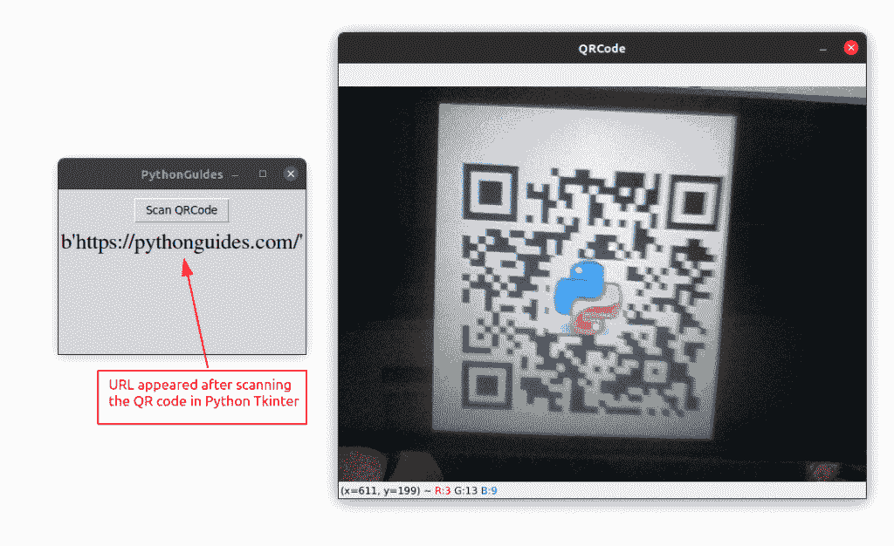

# 在 Tkinter 中使用 pyqrcode 的 Python QR 码生成器

> 原文：<https://pythonguides.com/python-qr-code-generator/>

[](https://sharepointsky.teachable.com/p/python-and-machine-learning-training-course)

在本 Python 教程中，我们将学习 **Python 二维码生成器**，如何使用 [Python Tkinter](https://pythonguides.com/python-gui-programming/) 创建二维码。此外，我们将创建一个应用程序来表示相同的内容。

*   带徽标的 Python 二维码生成器
*   Python 二维码阅读器
*   Python 二维码保存图片

目录

[](#)

*   [二维码概述](#Overview_of_the_QR_code "Overview of the QR code")
*   [Python 中的二维码库(pyqrcode)](#QR_code_Library_in_Python_pyqrcode "QR code Library in Python (pyqrcode)")
*   [python tkinter qrd 保存图像](#Python_Tkinter_QRcode_save_image "Python Tkinter QRcode save image")
*   [带徽标的 Python 二维码生成器](#Python_QR_code_Generator_with_Logo "Python QR code Generator with Logo")
*   [Python 二维码阅读器](#Python_QR_Code_Reader "Python QR Code Reader")

## 二维码概述

*   QR 码是指快速响应码，由日本一家汽车公司于 1994 年发明。
*   QR 码是一种矩阵条形码，是一种机器可读的光学标签，包含有关其所附着的物品的信息。
*   QR 码(快速响应码)由白色背景上的正方形网格中排列的黑色正方形组成，可以通过相机等成像设备读取。

## Python 中的二维码库(pyqrcode)

Python 提供了库 `pyqrcode` ，它允许在 Python Tkinter 中实现 QR 码。

*   [pyqrcode](https://pypi.org/project/PyQRCode/) 可以使用 pip 或 pip3 在系统中安装。使用以下代码:

```py
pip install pyqrcode

or

pip3 install pyqrcode
```

*   成功安装 pyqrcode 库后，使用下面的代码进行测试。

```py
import pyqrcode
url = pyqrcode.create('[https://pythonguides.com/](https://pythonguides.com/)')
print(url.terminal(quiet_zone=1))
```

*   如果您看到终端中生成的条形码，那么您就可以开始工作了。

**二维码生成器的源代码**

在下面的源代码中，第 12、13 行的代码负责生成 QR 代码。

```py
from tkinter import *
from tkinter import messagebox
import pyqrcode

ws = Tk()
ws.title("PythonGuides")
ws.config(bg='#F25252')

def generate_QR():
    if len(user_input.get())!=0 :
        global qr,img
        qr = pyqrcode.create(user_input.get())
        img = BitmapImage(data = qr.xbm(scale=8))
    else:
        messagebox.showwarning('warning', 'All Fields are Required!')
    try:
        display_code()
    except:
        pass

def display_code():
    img_lbl.config(image = img)
    output.config(text="QR code of " + user_input.get())

lbl = Label(
    ws,
    text="Enter message or URL",
    bg='#F25252'
    )
lbl.pack()

user_input = StringVar()
entry = Entry(
    ws,
    textvariable = user_input
    )
entry.pack(padx=10)

button = Button(
    ws,
    text = "generate_QR",
    width=15,
    command = generate_QR
    )
button.pack(pady=10)

img_lbl = Label(
    ws,
    bg='#F25252')
img_lbl.pack()
output = Label(
    ws,
    text="",
    bg='#F25252'
    )
output.pack()

ws.mainloop()
```

以上是二维码生成器的 **python 程序。**

**二维码发生器的输出**:

在这个输出中，我们提供了一个 URL，并为该 URL 生成了一个 QR 码。这可以使用像照相机这样的成像设备来扫描。


Python qr code generator

阅读:[如何用 Python Tkinter 创建贪吃蛇游戏](https://pythonguides.com/create-a-snake-game-in-python/)

## python tkinter qrd 保存图像

在本节中，我们将学习如何**将生成的二维码图像文件**保存在我们的计算机中以备后用。

*   在上面的章节中，我们已经学习了如何使用 Python Tkinter 来**生成二维码。在这一节中，我们将介绍如何在 Python Tkinter 中保存生成的 QR 码。**
*   我们这里用的库是 **`qrcode`** 。使用以下代码在您的机器上安装**二维码**。

```py
pip install qrcode[pil]
```

*   使用**二维码**库中的 **`qrcode.make`** 方法可以生成二维码。
*   并且，使用二维码库中的 **`qrcode.save`** 方法，我们可以将生成的二维码保存到提供的位置。

**python 的甜码 tkinter qrd 保存图像**

在这段代码中，我们创建了一个界面，用户可以在其中键入消息或 url。在下一个输入字段中，用户需要提供文件名。一旦点击生成按钮，二维码的图像将保存在同一目录中。

```py
import qrcode
from tkinter import *
from tkinter import messagebox

ws = Tk()
ws.title('PythonGuides')
ws.geometry('400x200')
ws.config(bg='#4a7a8c')

def generate():
    img = qrcode.make(msg.get())
    type(img) 
    img.save(f'{save_name.get()}.png')
    Label(ws, text='File Saved!', fg='green').pack()

frame = Frame(ws, bg='#4a7a8c')
frame.pack(expand=True)

Label(
    frame,
    text='URL',
    font = ('Times', 18),
    bg='#4a7a8c'
    ).grid(row=0, column=0, sticky='w')

msg = Entry(frame)
msg.grid(row=0, column=1)

Label(
    frame,
    text='Save as',
    font = ('Times', 18),
    bg='#4a7a8c',
).grid(row=1, column=0, sticky='w')

save_name = Entry(frame)
save_name.grid(row=1, column=1)

btn = Button(
    ws, 
    text='Generate QR code',
    command=generate
    )
btn.pack()

ws.mainloop()
```

**输出**

在这个输出中，QR 图像保存在主文件所在的目录中。


Python Tkinter QR code save image

读取 [Python Tkinter 图像](https://pythonguides.com/python-tkinter-image/)

## 带徽标的 Python 二维码生成器

在本节中，我们将学习如何生成中心带有徽标的二维码。

*   为了**在 Python Tkinter** 中生成一个带有 Logo 的二维码，我们必须执行两个任务，然后将它们合并成一个。
*   首先，我们必须使用 Pillow library 准备徽标，然后我们必须将该徽标添加到用于生成 QR 码的代码中。
*   我们正在使用**二维码**和**枕头**模块来执行任务。这些模块可以使用 pip 安装。以下命令将一次性安装这两个程序。

```py
pip install qrcode[pil]
```

**源代码**

下面是用 Python Tkinter 创建带 logo 的二维码的源代码。

```py
import qrcode
import PIL.Image
from tkinter import *

ws = Tk()
ws.title('PythonGuides')
ws.geometry('400x300')
ws.config(bg='#f25252')

logo = PIL.Image.open('logo.png')

def generate_qr():
    global logo
    basic = 100
    width_percentage = (basic/float(logo.size[0]))
    height_size = int((float(logo.size[1])*float(width_percentage)))
    logo = logo.resize((basic, height_size), PIL.Image.ANTIALIAS)
    qrc = qrcode.QRCode(error_correction=qrcode.constants.ERROR_CORRECT_H)

    qrc.add_data(msg.get())
    qrc.make()
    gen_img = qrc.make_image(
        fill_color='#4a7a8c', 
        bg_color="#fff"
        ).convert('RGBA')

    position = ((gen_img.size[0] - logo.size[0]) // 2, (gen_img.size[1] - logo.size[1]) // 2)

    gen_img.paste(logo, position)
    gen_img.save(save_name.get()+'.png')

    lbl.config(text='File saved with logo')

frame = Frame(ws, bg='#f25252')
frame.pack(expand=True)

Label(frame, text='Enter URL ', bg='#f25252').grid(row=0, column=0)
msg = Entry(frame)
msg.grid(row=0, column=1)

Label(frame, text='File Name', bg='#f25252').grid(row=1, column=0)
save_name = Entry(frame)
save_name.grid(row=1, column=1)

btn = Button(
    frame,
    text='Generate',
    command=generate_qr
)
btn.grid(row=2, columnspan=3, pady=10)

lbl = Label(ws, fg='green', bg='#f25252')
lbl.pack()

ws.mainloop()
```

**输出**

在此输出中，应用程序接受 URL 和文件名，当单击按钮时，它会生成一个带有徽标的 QR 码。


Python Tkinter QR code with logo

阅读[如何使用 Pyinstaller 将 Python 文件转换为 exe 文件](https://pythonguides.com/convert-python-file-to-exe-using-pyinstaller/)

## Python 二维码阅读器

在本节中，我们将学习如何用 Python Tkinter 创建 QR 码阅读器。

*   使用 python 中的 OpenCV 库，我们将使用笔记本电脑的摄像头扫描二维码，结果将打印在 Python Tkinter 窗口上。
*   除了 OpenCV，我们还需要 pyzbar 来处理 QR 码识别。这两个库都可以使用 pip 安装。

```py
# pip install pyzbar
# pip install opencv_contrib_python
```

*   如果你是 Ubuntu 用户，那么你也需要在系统上安装这个软件包

```py
sudo apt-get install zbar-tools
```

**源代码**

*   此代码用于启动笔记本电脑上的摄像头。
*   **`while i<2:`** 二维码的信息会被连续捕捉 2 次
*   **`decoded = pyzbar.decode(f)`** 此码是识别并记录的二维码。
*   解码后的变量将以列表格式保存多个信息。像数据、类型、图像的矩形属性、宽度、高度等信息。
*   运行循环以获取数据，数据将显示在标签上。

```py
from tkinter import *
import cv2
import pyzbar.pyzbar as pyzbar

def scanQR():
   i = 0
   vid = cv2.VideoCapture(0)
   while i<2:
       _,f = vid.read()
       decoded = pyzbar.decode(f)
       for obj in decoded:
           lbl.config(text=f'{obj.data}')
           i += 1
       cv2.imshow('QRCode',f)
       cv2.waitKey(5)
       cv2.destroyAllWindows

ws = Tk()
ws.title('PythonGuides')
ws.geometry('300x200')

Button(
    ws,
    text='Scan QRCode',
    command=scanQR
).pack(pady=10)

lbl = Label(ws, font=('times', 20))
lbl.pack()

ws.mainloop()
```

**输出**

在此输出中，Python Tkinter 窗口有一个扫描二维码按钮。点击此按钮时，相机屏幕打开。当摄像头上显示 QR 码时，QR 码的信息会显示在 Tkinter 窗口上。



Python Tkinter QR Code Reader

您可能会喜欢以下 Python Tkinter 文章:

*   [Python Tkinter Colors](https://pythonguides.com/python-tkinter-colors/)
*   [python tkinter auto complete](https://pythonguides.com/python-tkinter-autocomplete/)
*   [Python Tkinter 主循环示例](https://pythonguides.com/python-tkinter-mainloop/)
*   [Python Tkinter 滚动条–如何使用](https://pythonguides.com/python-tkinter-scrollbar/)
*   [Python Tkinter 文本框小工具](https://pythonguides.com/python-tkinter-text-box/)
*   [Python Tkinter 表教程](https://pythonguides.com/python-tkinter-table-tutorial/)
*   [Python Tkinter 编辑器](https://pythonguides.com/python-tkinter-editor/)
*   [Python Tkinter 多窗口教程](https://pythonguides.com/python-tkinter-multiple-windows-tutorial/)

在本教程中，我们学习了 **Python 二维码**。此外，我们在 Tkinter 中使用 pyqrcode 创建了一个 **Python QR 码生成器**。

*   带徽标的 Python 二维码生成器
*   Python 二维码阅读器
*   Python 二维码保存图片

[Bijay Kumar](https://pythonguides.com/author/fewlines4biju/)

Python 是美国最流行的语言之一。我从事 Python 工作已经有很长时间了，我在与 Tkinter、Pandas、NumPy、Turtle、Django、Matplotlib、Tensorflow、Scipy、Scikit-Learn 等各种库合作方面拥有专业知识。我有与美国、加拿大、英国、澳大利亚、新西兰等国家的各种客户合作的经验。查看我的个人资料。

[enjoysharepoint.com/](https://enjoysharepoint.com/)[](https://www.facebook.com/fewlines4biju "Facebook")[](https://www.linkedin.com/in/fewlines4biju/ "Linkedin")[](https://twitter.com/fewlines4biju "Twitter")