# Python 逐行读取文件的例子

> 原文：<https://pythonguides.com/python-read-a-file-line-by-line/>

[](https://sharepointsky.teachable.com/p/python-and-machine-learning-training-course)

在这个 [Python 教程](https://pythonguides.com/learn-python/)中，**将通过几个例子学习如何用 Python** 逐行读取一个文件。除了 **Python 逐行读取文件**之外，我们还将讨论以下主题:

*   Python 逐行读取文件
*   Python 将文件逐行读入数组
*   Python 将文件逐行读入字典
*   Python 逐行读取文件并搜索字符串
*   Python 逐行读取文件，不需要换行符
*   Python 将文件逐行读入一个列表
*   Python 将文件逐行读入一个集合
*   Python 逐行读取文件并写入另一个文件
*   为循环 python 逐行读取文件

目录

[](#)

*   [Python 逐行读取文件](#Python_read_file_line_by_line "Python read file line by line")
*   [Python 将文件逐行读入数组](#Python_read_file_line_by_line_into_array "Python read file line by line into array")
*   [Python 将文件逐行读入字典](#Python_read_file_line_by_line_into_dictionary "Python read file line by line into dictionary")
*   [Python 逐行读取文件并搜索字符串](#Python_read_file_line_by_line_and_search_string "Python read file line by line and search string")
*   [Python 逐行读取文件，没有换行](#Python_read_file_line_by_line_without_a_newline "Python read file line by line without a newline")
*   [Python 将文件逐行读入一个列表](#Python_read_file_line_by_line_into_a_list "Python read file line by line into a list")
*   [Python 将文件逐行读入一个集合](#Python_read_file_line_by_line_into_a_set "Python read file line by line into a set ")
*   [Python 逐行读取文件并写入另一个文件](#Python_read_file_line_by_line_and_write_to_another_file "Python read file line by line and write to another file")
*   [循环 python 的逐行读取文件](#Read_file_line_by_line_for_loop_python "Read file line by line for loop python")

## Python 逐行读取文件

现在，我们可以看到**如何在 python 中逐行读取文件**。

*   在这个例子中，我将一行代码设为 **["Welcome\n "，" to\n "，" Pythonguides\n"]** ，为了打开文件，我使用了 **file = open('line.txt '，' w')** 和 **'w'** 模式来编写这些代码行。这里 `line.txt` 是文件的名称。
*   为了读取这些行，我使用了 `Lines = file.readlines()` ，对于循环，则使用。

示例:

```py
Line = ["Welcome\n","to\n","Pythonguides\n"]
file = open('line.txt', 'w')
file.writelines(Line)
file.close()
file = open('line.txt', 'r')
Lines = file.readlines()
for line in Lines:
	print(line) 
```

为了获得输出，我使用了 print(line)。在下面的截图中，我们可以看到文件中的行作为输出。

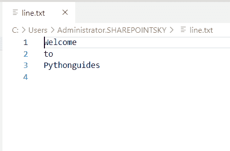

Python read file line by line

这就是我们如何在 Python 中**逐行读取文件。**

查看 [Python 二叉树实现](https://pythonguides.com/python-binary-tree/)和[如何在 Python 中读取视频帧](https://pythonguides.com/read-video-frames-in-python/)。

## Python 将文件逐行读入数组

现在，我们可以看到**如何在 python 中将文件逐行读入数组**。

*   在这个例子中，我定义了一个函数为 `fruits` ，并且传递了一个参数 `fruitsname` 。
*   定义了一个空数组，参数以 f 和的形式打开以读取该行。使用 f 中的行的**并将该行追加到数组中，使用 `array.append` 。**
*   水果文件作为函数中的参数传递。

示例:

```py
def fruits(fruitsname):
        array = []
        with open(fruitsname) as f:   
                for line in f:
                        array.append(line)
                print(array)
fruits('fruits.txt')
```

下面的截图显示了文件的内容

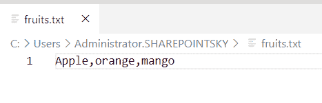

How to read file line by line into array in Python

文件中的行作为输出被附加到数组中。您可以参考下面的输出截图。

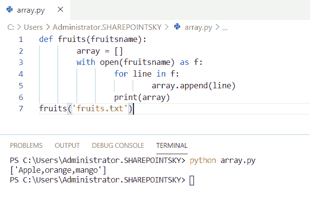

Python read file line by line into array

这段代码，我们可以用 Python 中的将文件逐行读入数组**。**

## Python 将文件逐行读入字典

现在，我们可以看到**如何将文件逐行读入字典**进入 python。

*   在本例中，声明了一个空字典，并打开了文件 `dictionary.txt` 。
*   文件中第行的**用于逐行逐键读取文件，赋值给 `line.split()` 用于拆分列表。**
*   为了分配键和值，我使用了**字典【key】= value**。
*   为了打印字典，我使用了 `print(dictionary)` 。

示例:

```py
dictionary = {}
file = open("dictionary.txt")
for line in file:
    key, value = line.split()
    dictionary[key] = value
print(dictionary)
```

下面的截图显示了文件的内容。

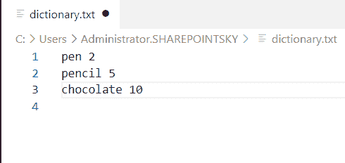

Python read file line by line into dictionary

在这里，我们可以看到通过读取文件打印字典时的输出。您可以参考下面的输出截图。

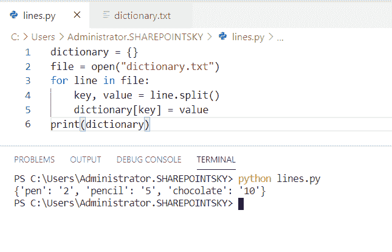

Python read file line by line into dictionary

这是如何在 Python 中将文件逐行读入字典。

你可能喜欢读， [Python 程序求 n 个数之和](https://pythonguides.com/python-program-to-find-sum-of-n-numbers/)和[如何用 Python 把两个数相加](https://pythonguides.com/add-two-numbers-in-python/)。

## Python 逐行读取文件并搜索字符串

这里可以看到**如何在 python 中逐行读取文件和搜索字符串**。

*   在这个例子中，我已经将一个函数定义为一个**文件**，并传递了参数 filename 和 search。
*   为了搜索字符串，我已经打开了文件 `string.txt` 并且为了读取该文件，我已经使用**作为 read** 中的行来搜索字符串。
*   如果字符串在第**行中，则返回 True** 并且**返回 False** 如果单词“Hello”出现在文件中，则打印文件中存在的字符串，否则打印文件中不存在的字符串。

示例:

```py
def file(file_name, search):
     with open("string.txt", 'r') as read:
        for line in read:
            if search in line:
                return True

     return False
if file('string.txt', 'Hello'):
    print('string present in the file')
else:
    print('String not present in the file')
```

下面的截图显示了文件的内容。

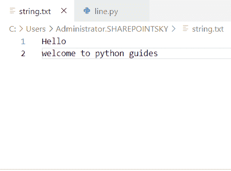

Python read file line by line and search string

由于文件中存在字符串**“Hello”**，我们可以看到文件中存在字符串形式的输出。您可以参考下面的输出截图。

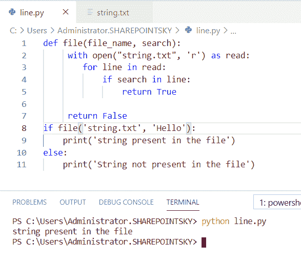

Python read file line by line and search string

这就是如何在 Python 中逐行读取文件和搜索字符串。

## Python 逐行读取文件，没有换行

现在，我们可以看到**如何在 python 中不用换行符**逐行读取文件。

*   在本例中，我已经打开了文件 `string.txt` ，并使用**“r”**模式读取该文件。
*   为了不换行地逐行读取文件，我使用了**。替换(' \n ')。**
*   为了得到输出**，使用了 print(string)** 。

示例:

```py
file=open("string.txt","r")  
string=file.read().replace('\n','')  
print(string) 
```

下面的截图显示了文件的内容。


Python read file line by line without a newline

下面的屏幕截图显示了文件在没有换行输出的情况下被读取。下面的截图显示了输出。

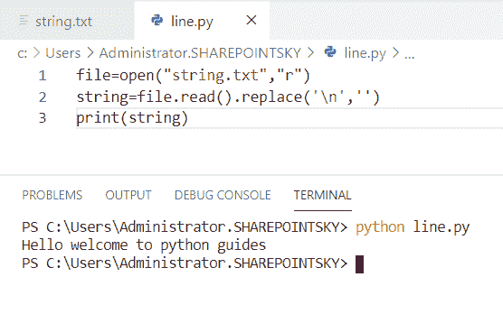

Python read file line by line without a newline

上面的代码，我们可以用 Python 一行一行的读文件，不用换行符。

## Python 将文件逐行读入一个列表

我们来看看**如何用 python 把文件一行一行读入一个列表**。

*   在这个例子中，我打开了一个文件 `number.txt` 和**‘r’**模式，将文件读取为 f，并定义一个空列表为 **list = [ ]** ，使用 f 中的行进行逐行读取。
*   为了将文件中的行追加到列表中，我使用了`lines . append(line . strip())`使用了 `line.strip` 。
*   `line.strip()` 用于复制字符串和删除字符。为了获得输出，使用 print(lines)。

示例:

```py
with open ("number.txt",'r' ) as f:
    list = []
    for line in f:
        lines.append(line.strip())
        print(lines)
```

下面的截图显示了文件 `number.txt` 的内容。

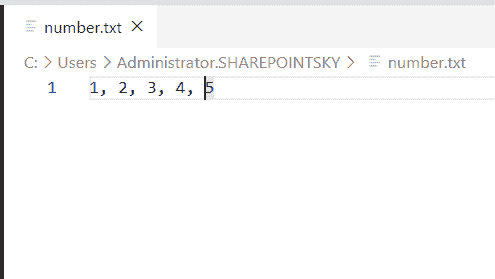

Python read file line by line into a list

在下面的截图中，我们可以看到文件 `number.txt` 中的内容作为输出附加在列表中。

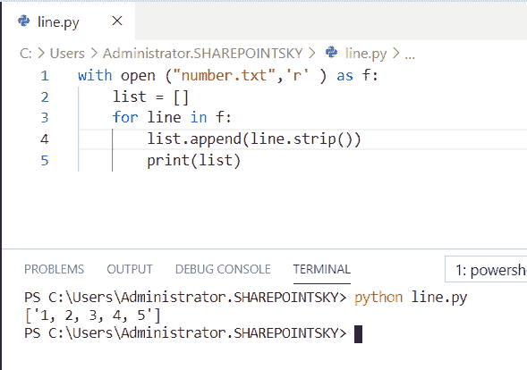

Python read file line by line into a list

上面的代码，我们可以用 Python 中的**将文件逐行读入一个列表。**

## Python 将文件逐行读入一个集合

现在，我们可以看到**如何在 python 中将文件逐行读入一个集合**。

*   在本例中，使用一个**集合**将文件读入一个集合，通过使用**从文件 chocolate.txt 中读取内容。**和**。split()** 用于拆分字符串。
*   为了得到输出，我使用了 `print(chocolate)` 。

示例:

```py
chocolate =  set(open('chocolate.txt').read().split())
print(chocolate) 
```

下面的截图显示了文件的内容。

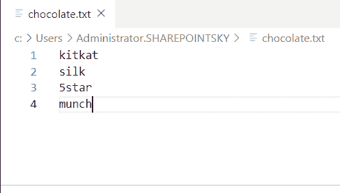

Python read file line by line into a set

来自文件 `chocolate.txt` 的内容作为输出被附加到集合中。您可以参考下面的输出截图。

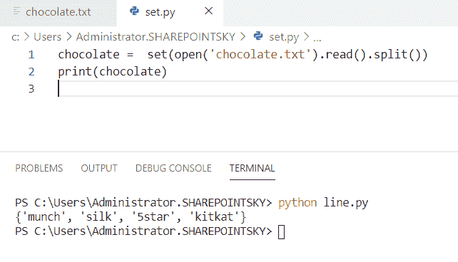

Python read file line by line into a set

这就是如何在 Python 中**将文件逐行读入一个集合。**

## Python 逐行读取文件并写入另一个文件

在这里，我们可以看到**如何在 python 中逐行读取文件并写入另一个文件**。

*   在这个例子中，我将文件 `chocolate.txt` 作为 f1 打开。
*   为了将内容写入另一个文件，我打开了另一个文件，名为 `newfile.txt` 和 `f.write` 用于写入文件，而 `f.read` 用于读取文件。
*   **。strip()** 用于从参数的左边和右边删除字符。

示例:

```py
with open("chocolate.txt") as f1,\
        open("newfile.txt", "w") as f:
    f.write(f1.read().strip())
```

下面的截图显示了文件 `chocolate.txt` 的内容。


在下面的截图中，我们可以看到内容从文件 chocolate.txt 进入 newfile.txt。

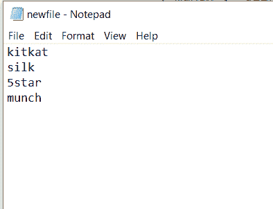

Python read file line by line and write to another file

这就是如何在 Python 中**逐行读取文件并写入另一个文件。**

## 循环 python 的逐行读取文件

现在，我们可以看到**如何在 python 中为循环**逐行读取文件。

在这个例子中，我打开了一个文件 `python.txt` 作为 f 并且 for 循环被用作 f 中的行的**来读取文件的行。**

示例:

```py
with open('python.txt') as f:
     for line in f:
       print(line)
```

下面的截图显示了文件的内容

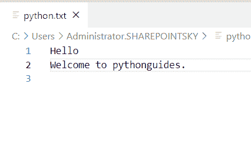

Read file line by line for loop python

文件 `python.txt` 中的所有行都作为输出被读取。您可以参考下面的输出截图。

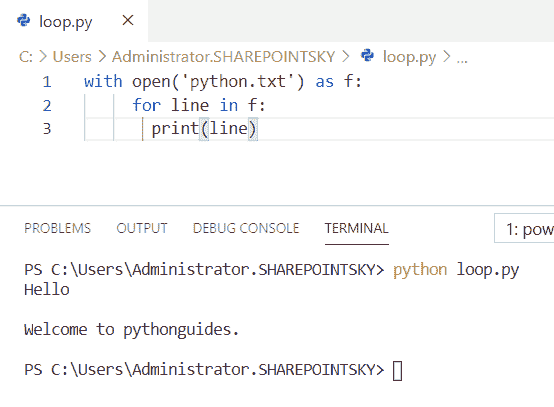

Read file line by line python for loop

上面的代码，我们可以用 Python 中的循环来逐行读取文件。

您可能会喜欢以下 Python 教程:

*   [用 Python 创建和修改 PDF 文件](https://pythonguides.com/create-and-modify-pdf-file-in-python/)
*   [Python 获取目录中的所有文件](https://pythonguides.com/python-get-all-files-in-directory/)
*   [如何使用 Python Tkinter 读取文本文件](https://pythonguides.com/python-tkinter-read-text-file/)
*   [Python 读取二进制文件](https://pythonguides.com/python-read-a-binary-file/)
*   [Python 复制文件](https://pythonguides.com/python-copy-file/)
*   [Python 文件方法](https://pythonguides.com/python-file-methods/)
*   [Python 将列表写入文件，并附有示例](https://pythonguides.com/python-write-list-to-file/)
*   [Python 集合的交集](https://pythonguides.com/python-intersection-of-sets/)

在本教程中，我们已经了解了 **Python 逐行读取文件的示例**，并且我们还涵盖了以下主题:

*   Python 逐行读取文件
*   Python 将文件逐行读入数组
*   Python 将文件逐行读入字典
*   Python 逐行读取文件并搜索字符串
*   Python 逐行读取文件，不需要换行符
*   Python 将文件逐行读入一个列表
*   Python 将文件逐行读入一个集合
*   Python 逐行读取文件并写入另一个文件
*   为循环 python 逐行读取文件

[Bijay Kumar](https://pythonguides.com/author/fewlines4biju/)

Python 是美国最流行的语言之一。我从事 Python 工作已经有很长时间了，我在与 Tkinter、Pandas、NumPy、Turtle、Django、Matplotlib、Tensorflow、Scipy、Scikit-Learn 等各种库合作方面拥有专业知识。我有与美国、加拿大、英国、澳大利亚、新西兰等国家的各种客户合作的经验。查看我的个人资料。

[enjoysharepoint.com/](https://enjoysharepoint.com/)[](https://www.facebook.com/fewlines4biju "Facebook")[](https://www.linkedin.com/in/fewlines4biju/ "Linkedin")[](https://twitter.com/fewlines4biju "Twitter")