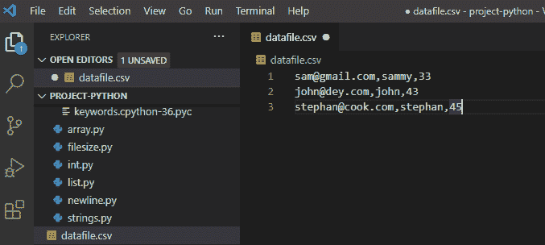
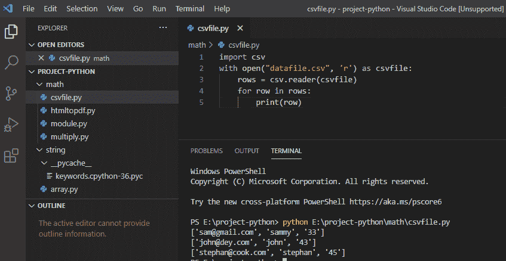
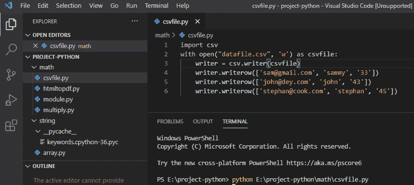
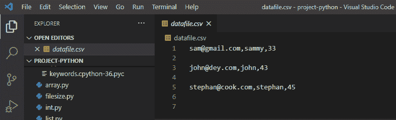

# Python 读取 CSV 文件并写入 CSV 文件

> 原文：<https://pythonguides.com/python-read-csv-file/>

[](https://sharepointsky.teachable.com/p/python-and-machine-learning-training-course)

在本 [Python 教程](https://pythonguides.com/python-download-and-installation/)中，我们将讨论**如何用 Python** 读取 csv 文件，**如何用 Python** 写入 csv 文件。

目录

[](#)

*   [python 中的 CSV 文件是什么？](#What_is_a_CSV_file_in_python "What is a CSV file in python?")
*   [Python CSV 模块](#Python_CSV_module "Python CSV module")
*   [Python 读取 CSV 文件](#Python_Read_CSV_File "Python Read CSV File")
*   [Python 写 CSV 文件](#Python_Write_CSV_File "Python Write CSV File")

## python 中的 CSV 文件是什么？

在 python 中 **CSV 是逗号分隔值**，它是一个用于排列表格数据的纯文本文件。CSV 执行数据交换，必须用**保存。CSV** 文件。

## Python CSV 模块

在 python 中，我们将使用一个 CSV 包，它是标准库的一部分，所以我们必须首先安装这个 CSV 模块。以下是如何用 python 导入 CSV 的方法。

```py
import csv
```

## Python 读取 CSV 文件

*   在 visual studio 代码中，单击文件并使用。csv 文件扩展名，以便表示 CSV 文件，然后保存该文件。
*   在文件中存储以下条目的数据。CSV 文件的元素由逗号分隔。在下面的例子中，您可以看到存储在文件中的数据。

**举例:**

```py
sam@gmail.com,sammy,33
john@dey.com,john,43
stephan@cook.com,stephan,45
```

你可以参考下面的截图来存储数据



*   在 python 中，为了从 **CSV 文件**中读取数据，我们将使用 `CSV.reader()` 函数。python 内置的 `open()` 将 CSV 文件作为文本文件打开，它返回一个文件对象，然后使用 for 循环迭代打印。这里我们以读取模式打开了 `datafile.csv` 。

```py
import csv
with open("datafile.csv", 'r') as csvfile:
rows = csv.reader(csvfile)
for row in rows:
print(row)
```

写完上面的代码(python Read CSV 文件)，你将打印出 `" row "` ，然后输出将显示为 **" ['sam@gmail.com '，' sammy '，' 33'] ['john@dey.com '，' john '，' 43'] ['stephan@cook.com '，' stephan '，' 45'] "** 。这里，读取器返回的每一行都是字符串元素的列表。

你可以参考下面的 python 读取 CSV 文件的截图。



Python Read CSV File

## Python 写 CSV 文件

在 python 中，为了编写 CSV 文件，我们可以使用 `csv.writer()` 函数，它将在一行中迭代数据。 `csv.writer()` 函数返回一个 `writer` 对象，它将数据转换成一个分隔符字符串，我们以写模式打开文件。在这里，当我们运行程序时，就会创建一个 `datafile.csv` 文件。

```py
import csv
with open("datafile.csv", 'w') as csvfile:
writer = csv.write(csvfile)
writer.writerow(['sam@gmail.com', 'sammy', '33'])
writer.writerow(['john@dey.com', 'john', '43'])
writer.writerow(['stephan@cook.com', 'stephan', '45'])
```

写完上面的代码后(python 写 CSV 文件)，你会**“写”**然后输出会出现一个【sam@gmail.com，萨米，33 john@dey.com，约翰，43 stephan@cook.com，斯蒂芬，45】。在这里，datafile.csv 是用内容创建的，列表被转换为带分隔符的字符串，并被写入 csv 文件。

你可以参考下面 python 写 CSV 文件的截图。



Python Write CSV File

你可以参考下面的截图运行上面的程序后，用内容创建了一个 datafile.csv 文件。



Python Write CSV File

您可能会喜欢以下 Python 教程:

*   Python 中的[函数](https://pythonguides.com/function-in-python/)
*   [Python 数组与示例](https://pythonguides.com/python-array/)
*   [python 中的哈希表](https://pythonguides.com/hash-table-in-python/)
*   [Python 从路径中获取文件名](https://pythonguides.com/python-get-filename-from-the-path/)
*   [Python For 循环示例](https://pythonguides.com/python-for-loop/)
*   [Python if else with examples](https://pythonguides.com/python-if-else/)
*   [Python 读取 excel 文件并在 Python 中写入 Excel](https://pythonguides.com/python-read-excel-file/)
*   [在 Python 中创建一个元组](https://pythonguides.com/create-a-tuple-in-python/)
*   [Python Tkinter 条目](https://pythonguides.com/python-tkinter-entry/)
*   [Python 格式数字加逗号](https://pythonguides.com/python-format-number-with-commas/)
*   [Python 逐行读取文件示例](https://pythonguides.com/python-read-a-file-line-by-line/)

在本教程中，我们学习了**如何用 Python、**读取 CSV 文件，我们也看到了**如何用 Python、**编写 CSV 文件。

[Bijay Kumar](https://pythonguides.com/author/fewlines4biju/)

Python 是美国最流行的语言之一。我从事 Python 工作已经有很长时间了，我在与 Tkinter、Pandas、NumPy、Turtle、Django、Matplotlib、Tensorflow、Scipy、Scikit-Learn 等各种库合作方面拥有专业知识。我有与美国、加拿大、英国、澳大利亚、新西兰等国家的各种客户合作的经验。查看我的个人资料。

[enjoysharepoint.com/](https://enjoysharepoint.com/)[](https://www.facebook.com/fewlines4biju "Facebook")[](https://www.linkedin.com/in/fewlines4biju/ "Linkedin")[](https://twitter.com/fewlines4biju "Twitter")