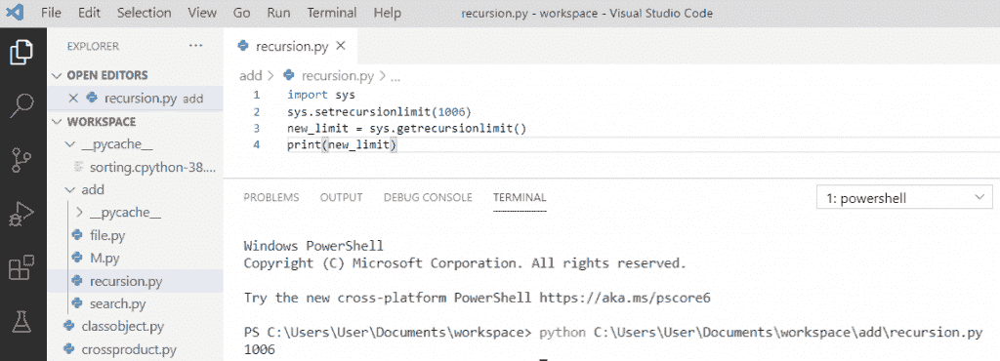

# Python 递归(你应该知道的一切)

> 原文：<https://pythonguides.com/python-recursion/>

[](https://sharepointsky.teachable.com/p/python-and-machine-learning-training-course)

在本 [Python 教程](https://pythonguides.com/python-programming-for-the-absolute-beginner/)中，我们将讨论 python 中的**递归。此外，我们将看到以下主题:**

*   python 中什么是递归？
*   python 中的递归函数
*   Python 递归示例
*   Python 递归 Fibonacci
*   Python 获取递归限制的当前值
*   Python 改变了最大递归深度
*   Python 递归列表
*   递归错误:在比较 python 中超过了最大递归深度
*   Python 递归的优势
*   Python 递归的缺点

目录

[](#)

*   [python 中什么是递归？](#What_is_recursion_in_python "What is recursion in python?")
*   [python 中的递归函数](#Recursive_function_in_python "Recursive function in python")
*   [Python 递归优势](#Python_recursion_advantages "Python recursion advantages")
*   [Python 递归缺点](#Python_recursion_disadvantage "Python recursion disadvantage")
*   [Python 递归示例](#Python_recursion_examples "Python recursion examples")
*   [Python 递归斐波那契](#Python_recursion_Fibonacci "Python recursion Fibonacci")
*   [Python 获取递归限制的当前值](#Python_get_current_value_of_the_recursion_limit "Python get current value of the recursion limit")
*   [Python 改变最大递归深度](#Python_change_the_maximum_recursion_depth "Python change the maximum recursion depth")
*   [Python 递归列表](#Python_recursion_list "Python recursion list")
*   [递归错误:在比较 python 中超过了最大递归深度](#Recursion_Error_maximum_recursion_depth_exceeded_in_comparison_python "Recursion Error: maximum recursion depth exceeded in comparison python")

## python 中什么是递归？

python 中什么是递归？**调用自身的函数在 Python 中是递归函数。当某个问题是根据它本身来定义时，就要用到递归。这样做的好处是，您可以循环遍历数据以得出结果。此外，如果调用中不满足基本情况，递归会导致无限循环。递归方法为复杂问题提供了一个非常简洁的解决方案。**

## python 中的递归函数

在 python 中，我们知道一个函数可以调用其他函数。函数也有可能调用自己。这些类型被称为**递归函数**。

我们可以以**递归函数**的**阶乘**为例来更好地理解它。

**举例:**

```py
def factorial(number):
    if number == 1:
        return 1
    else:
        return(number * factorial(number - 1))
number = 4
print("Factorial of", number, "is: ", factorial(number))
```

写完上面的代码(python 中的递归函数)，你将打印出 `" number "` ，然后输出将显示为**" 4 的阶乘是:24 "** 。在这个例子中，我们定义了一个用户定义的函数 `factorial()` 。这个函数通过反复调用自身来寻找一个数的阶乘，直到它到达 `" 1 "` 为止，这是基本情况。

python 中的**递归函数可以参考下面的截图**


Recursive function in python

## Python 递归优势

1.  Python 中递归方法的主要好处是，它允许程序员利用问题中存在的重复结构。
2.  递归使我们的程序更容易编写。
3.  可以避免复杂的案例分析和嵌套循环。
4.  递归使得代码更加可读和高效。

## Python 递归缺点

1.  并不是所有的问题都可以用递归来解决。
2.  它降低了执行时间，并且调用递归函数不节省内存。
3.  如果不定义基本情况，那么代码将无限期运行
4.  递归函数调试困难，因为函数在循环中调用自身。

## Python 递归示例

我们将在 Python 中做**递归的例子，计算 n 个自然数的和。通过定义函数**【def sum(number)】**。**

**举例:**

```py
def sum(number):
    if number == 1:
        return 1
    else:
        return(number + sum(number - 1))
number = 6
print("Sum of", number, "is: ", sum(number))
```

写完上面的代码(python 递归示例)，你将打印出 `" number "` ，然后输出将显示为**" 6 的和是** : `21 "` 。在这个例子中，我们定义了一个用户定义的函数 `sum()` 。该函数通过反复调用自身来寻找一个数的和，直到它到达**“1”**为止，这是基本情况。

关于 **python 递归示例**，可以参考下面的截图


Python recursion examples

阅读: [Python NumPy concatenate](https://pythonguides.com/python-numpy-concatenate/)

## Python 递归斐波那契

一个**斐波那契**序列是一个整数序列，其中前两项是 0 和 1，序列的所有其他项是通过将它们前面的两项相加得到的。

一个 `recursion_fib()` 函数用于计算序列的 n 项。

**举例:**

```py
def recursion_fib(num):
   if num <= 1:
       return num
   else:
       return(recursion_fib(num-1) + recursion_fib(num-2))
n_term = 5
if n_term <= 0:
   print("Please enter a positive integer")
else:
   print("Fibonacci sequence:")
   for i in range(n_term):
       print(recursion_fib(i))
```

写完上面的代码(python recursion fibonacci)，你将打印出 `"recursion_fib(i)"` 然后输出将显示为 `" 0 1 1 2 3 "` 。在这个例子中，我们递归地调用函数，循环用于递归地迭代和计算每一项。

关于 **python 递归斐波那契**可以参考下面的截图


Python recursion Fibonacci

## Python 获取递归限制的当前值

为了获得 Python 中递归限制的当前值，我们将**导入 sys** 模块**、**，然后我们将使用`" sys . getrecursionlimit()"`来获得当前递归限制。

**举例:**

```py
import sys
print("The current value of the recursion limit:")
print(sys.getrecursionlimit())
```

写完上面的代码(python 获取递归限制的当前值)，你将打印出`" sys . getrecursionlimit()"`，然后输出将显示为 `" 1000 "` ，这是默认值。在这个例子中，我们通过使用 **sys.getrecursionlimit()获得递归限制的当前值。**

你可以参考下面的截图得到递归极限的当前值


Python get current value of the recursion limit

## Python 改变最大递归深度

为了**改变 Python 中的最大递归深度**，我们将使用`" sys . setrecursionlimit()"`，这将增加递归限制，我们可以递归地执行连续的操作。

**举例:**

```py
import sys
sys.setrecursionlimit(1006)
new_limit = sys.getrecursionlimit()
print(new_limit)
```

写完上面的代码(python 改变了最大递归深度)，你将打印出 `"new_limit"` ，然后输出将显示为 `" 1006 "` 。在这个例子中，我们通过使用 **sys.setrecursionlimit(1006)来获得递归限制的变化值。**

你可以参考下面的截图 python 改变最大递归深度



Python change the maximum recursion depth

## Python 递归列表

我们将使用 Python 中的递归来执行列表的求和，要计算给定列表的求和，首先定义函数 `" def sum(list) "` 。当满足基本条件时，递归将结束，它将返回一个列表的总和。

**举例:**

```py
def sum(list):
    if len(list)==0:
       return 0
    else:
       return list[0]+sum(list[1:])
list = [1,2,3,4,5]
print(sum(list))
```

写完上面的代码(python 递归列表)，你将打印出 `"sum(list)"` ，然后输出将显示为 `" 15 "` 。在这个例子中，我们通过调用 sum 函数来获得列表的总和，其中它递归地添加所有元素，直到它满足基本条件“0”。

可以参考下面截图 **python 递归列表**


Python recursion list

## 递归错误:在比较 python 中超过了最大递归深度

递归函数包含一些限制，以确保它们不会无限执行。当给定一个大输入时，程序崩溃并给出错误**“超过最大递归深度”**。这意味着函数应该一直运行，直到满足特定条件。

**举例:**

```py
def fact(num):
    if num == 0:
        return 1
    else:
        return num * fact(num-1)
print(fact(2000))
```

写完上面的代码后，一旦你打印出`(fact(2000))"`，那么错误将显示为 **"RecursionError:在比较中超过了最大递归深度"。**这里，如果你写了一个递归函数，它执行的迭代次数超过了特定的次数(通常是 998 次)，就会出现这个错误。

您可以在下面的截图中看到，对比 python 中超过了最大递归深度


Recursion Error: maximum recursion depth exceeded in comparison python

Python 引发了一个递归错误来防止堆栈溢出。为了**解决**这个**错误**我们可以通过使用`" setrecursionlimit(4000)"`方法来增加我们程序中的递归限制，现在程序被执行而没有错误。

**举例:**

```py
import sys
sys.setrecursionlimit(4000)
def fact(num):
    if num == 0:
        return 1
    else:
        return num * fact(num-1)
print(fact(2000))
```

写完上面的代码后，一旦你打印出`(fact(2000))"`，那么输出将会没有任何错误**。**在这里，通过使用**导入系统**模块并使用 `setrecursionlimit()` 改变递归限制来解决错误。现在我们可以看到递归极限增加了。

您可以参考下面的输出截图


maximum recursion depth exceeded in comparison python

您可能会喜欢以下 Python 教程:

*   [如何在 Python 中把字符串转换成日期时间](https://pythonguides.com/convert-a-string-to-datetime-in-python/)
*   [Python 中的转义序列](https://pythonguides.com/escape-sequence-in-python/)
*   [Python 列表理解λ](https://pythonguides.com/python-list-comprehension/)
*   [Python 线程和多线程](https://pythonguides.com/python-threading-and-multithreading/)

在本教程中，我们学习了 python 中的递归。我们也讨论了这些主题。

*   python 中什么是递归？
*   python 中的递归函数
*   Python 递归示例
*   Python 递归 Fibonacci
*   Python 获取递归限制的当前值
*   Python 改变了最大递归深度
*   Python 递归列表
*   递归错误:在比较 python 中超过了最大递归深度
*   Python 递归的优势
*   Python 递归的缺点

[Bijay Kumar](https://pythonguides.com/author/fewlines4biju/)

Python 是美国最流行的语言之一。我从事 Python 工作已经有很长时间了，我在与 Tkinter、Pandas、NumPy、Turtle、Django、Matplotlib、Tensorflow、Scipy、Scikit-Learn 等各种库合作方面拥有专业知识。我有与美国、加拿大、英国、澳大利亚、新西兰等国家的各种客户合作的经验。查看我的个人资料。

[enjoysharepoint.com/](https://enjoysharepoint.com/)[](https://www.facebook.com/fewlines4biju "Facebook")[](https://www.linkedin.com/in/fewlines4biju/ "Linkedin")[](https://twitter.com/fewlines4biju "Twitter")