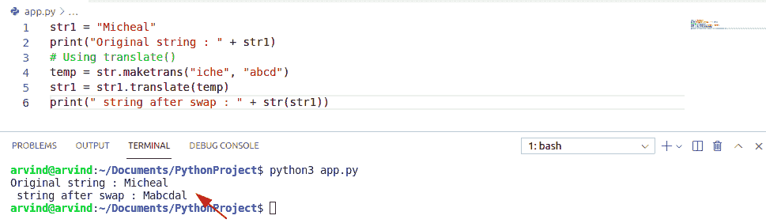

# Python 从字符串中移除子串+例子

> 原文：<https://pythonguides.com/python-remove-substring-from-a-string/>

[](https://sharepointsky.teachable.com/p/python-and-machine-learning-training-course)

在本 python 教程中，我们将讨论 **Python 从字符串**中移除子串，并涵盖以下几点:

*   从字符串 python 正则表达式中移除子字符串
*   从字符串 python 数据帧中移除子字符串
*   Python 通过索引从字符串中移除子串
*   从字符串 python 中移除重复的子字符串
*   从字符串 python 中移除最后一个子字符串
*   从字符串 python 中移除多个子字符串
*   从字符串 python 中移除第一个子字符串
*   从字符串 python 的开头移除子字符串
*   Python 从字符串中移除子串(如果存在的话)
*   从 python 熊猫字符串中移除子字符串
*   如何在 python 中删除一个字符串中出现的所有子字符串
*   Python 从字符串中间移除子串

目录

[](#)

*   [Python 从字符串中移除子串](#Python_remove_substring_from_a_String "Python remove substring from a String")
*   [从字符串 python regex 中移除子字符串](#Remove_substring_from_string_python_regex " Remove substring from string python regex")
*   [从字符串 python 数据帧中移除子字符串](#Remove_substring_from_string_python_DataFrame "Remove substring from string python DataFrame")
*   [Python 通过索引从字符串中移除子串](#Python_remove_substring_from_string_by_index "Python remove substring from string by index")
*   [从字符串 Python 中删除重复的子字符串](#Remove_duplicate_substring_from_string_Python "Remove duplicate substring from string Python")
*   [从字符串 python 中删除最后一个子串](#Remove_last_substring_from_string_python "Remove last substring from string python")
*   [从字符串 python 中删除第一个子串](#Remove_first_substring_from_string_python "Remove first substring from string python")
*   [从字符串 python 的开头删除子串](#Remove_substring_from_beginning_of_string_python "Remove substring from beginning of string python")
*   [Python 从存在的字符串中移除子串](#Python_remove_substring_from_a_string_if_exists "Python remove substring from a string if exists")
*   [从字符串中删除一个子串 python 熊猫](#Remove_a_substring_from_a_string_python_pandas "Remove a substring from a string python pandas")
*   [如何在 python 中从一个字符串中删除一个子串的所有出现](#How_to_remove_all_occurrences_of_a_substring_from_a_string_in_python "How to remove all occurrences of a substring from a string in python")
*   [Python 从字符串中间移除子串](#Python_remove_substring_from_the_middle_of_a_string "Python remove substring from the middle of a string")

## Python 从字符串中移除子串

**子串**是一个连续的字符序列。我们使用 substring 方法提取这些子字符串。

*   当您给 substring 方法一个数字时，从该位置到字符串末尾的部分中的结果。
*   如果有两个数字，则从起始索引处开始，一直到结束位置，但不包括结束位置。
*   例如，abcdef 是一个字符串，其中 cd 是该字符串的子字符串。

语法:

下面是**子串**的语法

```py
Str.substring(start)

Str.substring(start,end) 
```

**Python 从字符串中移除子串**

*   在这一节中，我们将学习如何从字符串中移除子串。
*   Python 从字符串中移除字符提供了多种方法，通过这些方法我们可以很容易地从字符串中移除子串。
    *   字符串替换()

`String replace()` 方法用另一个指定的字符替换一个指定的字符。

语法:

下面是字符串 replace()的语法

```py
replace[
         old_Str1,
         new_Str2,
         instance
        ]
```

让我们举个例子来检查一下**如何在 Python** 中从一个字符串中移除 substring。

```py
str2="calfornia"
str3= str2.replace("a","")
print(str3)
```

下面是以下代码的截图。


Python remove substring from a string

这就是如何在 Python 中**从一个字符串中移除 substring。**

阅读: [Python 3 string replace()方法示例](https://pythonguides.com/python-3-string-replace/)

## 从字符串 python regex 中移除子字符串

*   在本节中，我们将学习如何从字符串 python regex 中移除 substring。
*   **正则表达式**主要用于描述搜索模式，因此您可以使用正则表达式在大量数据中搜索特定字符串。
*   你可以验证字符串是否有正确的格式，你可以找到一个字符串并用另一个字符串替换它，你甚至可以将数据格式化成正确的格式以便导入，所以这些都是正则表达式的用法。
*   在这里，我给你们看了一个例子。
*   现在有一个字符串，其中写着乔治 22 岁，迈克尔 34 岁。所以正如你所看到的，我能在这里找到的有用数据只有名字和年龄。
*   所以我能做的是，借助正则表达式来识别一个模式。
*   我可以把它转换成字典。

让我们举一个例子来检查如何从字符串 python regex 中移除 substring。

```py
import re
from typing import Pattern
new_str1 = "George"
pattern = r'[oe]'
mod1_str2 = re.sub(pattern, '', new_str1)
print(mod1_str2)
```

下面是以下代码的截图。


Remove substring from string python regex

这就是如何**在 Python** 中使用正则表达式从字符串中移除子串(Python 从字符串正则表达式中移除子串)。

阅读: [Python 比较 strin](https://pythonguides.com/python-compare-strings/) [g](https://pythonguides.com/python-compare-strings/) [s](https://pythonguides.com/python-compare-strings/)

## 从字符串 python 数据帧中移除子字符串

**数据帧**是二维的，并且数据帧的大小是可变的潜在异构数据。我们可以称之为异构表格数据，因此作为数据帧的数据结构也包含一个标记轴，该轴是行和列，算术运算在行和列表上对齐。它可以被认为是一个类似字典的容器。

*   在本节中，我们将学习如何从字符串 Python DataFrame 中移除 substring。
*   首先，我们必须创建一个 DataFrame，其中一列包含一个字符串。
*   然后我们必须使用一个 string replace()方法从 Python DataFrame 中的一个字符串中删除 substring。

让我们举一个例子来检查如何从字符串 python DataFrame 中删除 substring。

```py
import pandas as pd

dt = {'ALPHABET':  ['a','z','f','h']

         }
df = pd.DataFrame(dt, columns= ['ALPHABET'])
df['ALPHABET'] = df['ALPHABET'].str.replace('a','')
print (df)
```

下面是以下代码的截图。


Remove substring from string python dataframe

这就是如何在 Python 数据帧中**从字符串中移除子串。**

阅读:[Python 熊猫中的交叉表](https://pythonguides.com/crosstab-in-python-pandas/)

## Python 通过索引从字符串中移除子串

`Index String` 方法类似于 fine string 方法，但是唯一的区别是没有得到一个负的，而是没有找到你的参数。

*   在本节中，我们将学习**如何通过索引**从字符串 **中移除子串。b-1。**
*   通过索引从字符串中移除子串我们可以很容易地通过切片方法使用字符串。
*   **字符串分割**返回介于索引 a 和 b 之间的字符。从 a，a+1，a+2 开始..直到 b-1。

语法:

下面是字符串切片的语法。

```py
String
      [start:end:step_value]
```

让我们举一个例子来检查如何通过索引从字符串中删除子串。

```py
str1 = 'George'
str3 = str1[:2] + str1[3:]
print(str3) 
```

下面是以下代码的截图。


Remove substring from string python by index

这就是如何在 Python 中**通过索引从字符串中移除子串。**

阅读: [Python 3 字符串方法及示例](https://pythonguides.com/string-methods-in-python/)

## 从字符串 Python 中删除重复的子字符串

让我们举一个例子，这是一个给定的字符串' abacd '。现在你可以看到‘a’重复了两次，没有其他字符重复。所以去掉所有的重复项后。结果将是 b c d '。条件是，你需要删除所有的重复提供秩序应该保持。

*   在本节中，我们将学习**如何从字符串 python** 中删除重复的子字符串。
*   使用 set() +split()方法删除重复的子串。

语法:

下面是 set() +split()的语法

```py
set[
    (sub.split(''))
    ]
```

让我们举一个例子来检查**如何从字符串 python** 中去除重复的子串。

```py
str1 = ['u-u-k','mm-cc','bb-cc']
print("original string :" + str(str1))
result = [set(sub.split('-')) for sub in str1]
print(" string after duplicate removal :" + str(result))
```

下面是以下代码的截图。


Remove dupicate substring from string python

上面的 Python 代码**从 Python** 中的字符串中删除重复的子字符串。

阅读: [Python NumPy arange](https://pythonguides.com/python-numpy-arange/)

## 从字符串 python 中删除最后一个子串

*   在这一节中，我们将学习如何从字符串 Python 中移除最后一个子串。
*   使用 Naive 方法，在提供的子串的第一个字母匹配的可能性很小的情况下，我们启动一个内部循环来检查子串中的所有组件是否都与主串中的后续组件匹配。也就是说，我们只是检查整个子串是否可用。

我们举个例子来检查一下**如何从 string Python** 中去掉最后一个子串。

```py
str1 = 'Micheal'
str2 = 'eal'
print ("First_strings : ", str1, "\nsubstring : ", str2) 
if str1.endswith(str2):
    result = str1[:-(len(str2))]
print ("Resultant string", result)
```

下面是以下代码的截图。


python remove substring from string end

这就是如何在 Python 中**从字符串中移除最后一个子串。**

阅读:[无法将字符串转换为浮点 Python](https://pythonguides.com/could-not-convert-string-to-float-python/)

## 从字符串 python 中删除第一个子串

*   在本节中，我们将学习**如何从字符串 python** 中移除第一个子串。
*   从字符串中去掉第一个子串我们可以很容易地用切片的方法得到字符串。
*   **字符串分割**返回介于索引 a 和 b 之间的字符。从 a，a+1，a+2 开始..直到 b-1。

语法:

下面是字符串切片的语法。

```py
String
      [start:end:step_value]
```

让我们举一个例子来检查**如何从字符串 python** 中删除第一个子串

```py
str1 = "smith"
str2 = str1[2:]
print(str2)
```

下面是以下代码的截图。


python remove substring from string start

上面的 Python 代码我们可以用来在 Python 中**从字符串中移除第一个子串。**

阅读: [Python NumPy 追加](https://pythonguides.com/python-numpy-append/)

## 从字符串 python 的开头删除子串

*   在本节中，我们将学习**如何从字符串 python** 的开头移除 substring。
*   使用 loop + remove() + startswith()从字符串开头移除子字符串。

语法:

下面是 loop + remove () +startswith()的语法

```py
for str in str1 [:]:
 if str.startswith[pref]:
```

让我们举一个例子来检查**如何从字符串 python** 的开头删除 substring。

```py
str2="calfornia"
str3= str2.replace("c","")
print(str3)
```

下面是以下代码的截图。


Remove substring from beginning of string python

阅读: [Python 在 string + Examples 中查找子串](https://pythonguides.com/python-find-substring-in-string/)

## Python 从存在的字符串中移除子串

*   在这一节中，我们将学习如何从一个存在的字符串中移除一个子串。
*   方法从一个存在的字符串中删除子串。

语法:

以下是字符串替换的语法

```py
replace[
         old_Str1,
         new_Str2,
         instance
        ]
```

让我们举一个例子来检查**如何从一个字符串中移除子串(如果存在的话)**

```py
str2="calfornia"
str3= str2.replace("a","")
print(str3)
```

下面是以下代码的截图。


Python remove substring from a string if exists

这就是如何**从 Python** 中存在的字符串中移除子串。

## 从字符串中删除一个子串 python 熊猫

`Pandas` 是一个 python 库，用于数据操作分析和清理。 [Python 熊猫](https://pythonguides.com/pandas-in-python/)非常适合不同种类的数据，比如我们可以处理表格数据。

*   在这一节中，我们将学习如何从 Python pandas 字符串中删除子串。
*   首先，我们必须创建一个数据框，其中一列包含一个字符串。
*   然后我们必须使用一个 string replace()方法，用另一个指定的字符替换指定的字符。

`String replace()` 方法从 python 熊猫字符串中删除一个子串。

语法:

下面是字符串 replace()的语法

```py
Column name
           [
            replace[

        old_Str1,
        new_Str2,
        instance
       ]
]
```

让我们举一个例子来检查**如何从一个字符串中删除一个子串**

```py
import pandas as pd

dt = {'ALPHABET':  ['a','z','f','h']

         }
df = pd.DataFrame(dt, columns= ['ALPHABET'])
df['ALPHABET'] = df['ALPHABET'].str.replace('a','l')
print (df) 
```

下面是以下代码的截图。


Remove a substring from a string python pandas

上面的 Python 代码，我们可以用来**在 python pandas** 中从一个字符串中删除一个子串。

阅读:[无法将字符串转换为浮点 Python](https://pythonguides.com/could-not-convert-string-to-float-python/)

## 如何在 python 中从一个字符串中删除一个子串的所有出现

*   在这一节中，我们将学习如何在 python 中从一个字符串中删除所有出现的子字符串。
*   `String translate()` 通过替换字符或删除字符来改变字符串。我们必须提到字符的 Unicode，而 None 作为替换来从字符串中删除它。
*   在 python 中，使用 String translate()方法从字符串中移除子字符串的所有匹配项。

让我们举一个例子来检查**如何在 python 中从一个字符串中删除一个子串的所有出现。**

```py
str1 = "Micheal"
print("Original string : " + str1)
# Using translate()
temp = str.maketrans("iche", "abcd")
str1 = str1.translate(temp)
print(" string after swap : " + str(str1)) 
```

下面是以下代码的截图。



Remove all occurences of a substring from a string in python

上面的 python 代码，我们可以用来从 Python 中的一个字符串中删除所有出现的子字符串。

## Python 从字符串中间移除子串

*   在这一节中，我们将学习如何从字符串中间移除子串。
*   `string replace()`方法从字符串中间删除子串。

语法:

以下是字符串替换的语法

```py
replace[
         old_Str1,
         new_Str2,
         instance
        ]
```

让我们举一个例子来检查**如何从一个字符串的中间去掉 substring。**

```py
str1 = input("Enter the string").replace("the","")
print(str1)
```

以下是给定代码的截图


Remove substring from the middle of a string

上面的 Python 代码，我们可以用 Python 中的**从一个字符串中间移除子串。**

您可能会喜欢以下 Python 教程:

*   [在 Python 中切片字符串+示例](https://pythonguides.com/slicing-string-in-python/)
*   [在 Python 中把字符串转换成浮点数](https://pythonguides.com/convert-string-to-float-in-python/)
*   [追加到字符串 Python +示例](https://pythonguides.com/append-to-a-string-python/)

在本 python 教程中，我们通过下面的例子了解了如何在 Python 中从字符串中移除子串:

*   如何在 Python 中移除字符串中的子串
*   从字符串 python 正则表达式中移除子字符串
*   如何从字符串 python 数据帧中移除子串
*   Python 通过索引从字符串中移除子串
*   如何从字符串 Python 中移除重复的子串
*   从字符串 python/中移除最后一个子字符串
*   如何从字符串 python 中移除第一个子字符串
*   从字符串 python 的开头移除子字符串
*   Python 从字符串中移除子串(如果存在的话)
*   从 python 熊猫字符串中移除子字符串
*   如何在 python 中删除一个字符串中出现的所有子字符串
*   Python 从字符串中间移除子串

[Bijay Kumar](https://pythonguides.com/author/fewlines4biju/)

Python 是美国最流行的语言之一。我从事 Python 工作已经有很长时间了，我在与 Tkinter、Pandas、NumPy、Turtle、Django、Matplotlib、Tensorflow、Scipy、Scikit-Learn 等各种库合作方面拥有专业知识。我有与美国、加拿大、英国、澳大利亚、新西兰等国家的各种客户合作的经验。查看我的个人资料。

[enjoysharepoint.com/](https://enjoysharepoint.com/)[](https://www.facebook.com/fewlines4biju "Facebook")[](https://www.linkedin.com/in/fewlines4biju/ "Linkedin")[](https://twitter.com/fewlines4biju "Twitter")