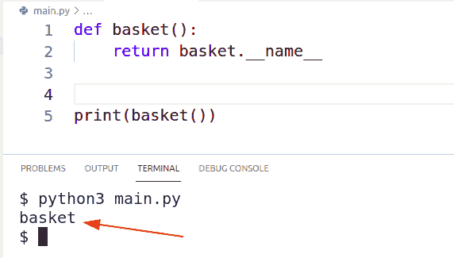

# Python 返回函数

> 原文：<https://pythonguides.com/python-return-function/>

[](https://sharepointsky.teachable.com/p/python-and-machine-learning-training-course)

在本 [Python 教程](https://pythonguides.com/python-hello-world-program/)中，我们将学习 **Python 返回函数**。此外，我们将涵盖这些主题。

*   Python 返回函数解释
*   Python 返回函数名
*   Python 返回函数示例
*   带参数的 Python 返回函数
*   Python 从函数返回函数
*   Python 返回函数对象
*   Python 返回函数值
*   Python 返回函数不起作用

目录

[](#)

*   [Python 返回函数讲解](#Python_Return_Function_Explained "Python Return Function Explained")
*   [Python 返回函数名](#Python_Return_Function_name "Python Return Function name")
*   [Python 返回函数示例](#Python_Return_Function_Example "Python Return Function Example")
*   [带参数的 Python 返回函数](#Python_Return_Function_with_Arguments "Python Return Function with Arguments")
*   [Python 从函数](#Python_Return_Function_From_Function "Python Return Function From Function")返回函数
*   [Python 返回函数对象](#Python_Return_Function_Object "Python Return Function Object")
*   [Python 返回函数值](#Python_Return_Function_Value "Python Return Function Value")
*   [Python 返回函数不工作](#Python_Return_Function_Not_Working "Python Return Function Not Working")

## Python 返回函数讲解

在这一节中，我们将学习 python 中的**返回函数。我们将理解它的含义、目的和语法。**

*   创建函数是为了执行某项任务，整个过程分为三个部分。
    *   接受论点
    *   处理论点
    *   生产结果
*   返回函数用于产生或返回结果的第三步。这个结果也被称为“价值”或回报。
*   默认情况下，函数不返回任何值，换句话说，如果程序员没有指定返回值，那么就不会返回任何值。

**语法:**

```py
def somefunction():
   -- some operations here --

   return value
```

## Python 返回函数名

在本节中，我们将了解到 **python 返回函数名**。

*   使用`__name__`方法，我们可以返回 python 程序中的函数名。
*   在我们的例子中，我们创建了一个名为‘basket’的函数，然后我们返回了`basket.__name__`。
*   每次调用该功能时，功能名称都会显示在显示屏上。
*   下面是上述示例的实现。

```py
def basket():
    return basket.__name__

print(basket())
```

**输出:**

在这个输出中，您可以看到函数名是一个篮子，当调用该函数时，它将输出作为函数名的篮子返回。



Python Return Name

*   [python 语法错误:函数外的“return”](https://pythonguides.com/syntaxerror-return-outside-function-python/)

## Python 返回函数示例

在本节中，我们将看到 **python 返回函数示例**。

*   在我们的示例中，我们创建了一个函数，它接受两个数字并检查这两个数字是否相等，然后将它们相加，否则将它们相乘。

```py
def addEven(n, m):
    if n%2 == 0 and m%2 == 0:
        return n+m
    else:
        return n*m

print(addEven(2,2))
print(addEven(2,3))
```

**输出:**


Python Return Example

阅读 [Python 内置函数示例](https://pythonguides.com/python-built-in-functions/)

## 带参数的 Python 返回函数

在本节中，我们将学习带有参数的 **python 返回函数。**

*   自变量是指用户提供的参数。有时，功能需要用户输入来满足流程要求。
*   此时，参数被创建，用户必须在调用函数时提供请求的值。
*   在我们的示例中，我们创建了一个函数，它接受两个数字作为参数，并检查这两个数字是否相等，然后将它们相加，否则将它们相乘。

**源代码:**

在这段代码中，创建了一个名为 `addEven()` 的函数。该函数接受两个参数。

如果两个参数都是偶数，则函数返回这些数字的加法，否则函数返回数字的乘法。

```py
def addEven(n, m):
    if n%2 == 0 and m%2 == 0:
        return n+m
    else:
        return n*m

print(addEven(2,2))
print(addEven(2,3))
```

**输出:**

在这个输出中，addEven()函数接受两个数字。如果这些数字是偶数，那么这两个数字将被相加，否则这两个数字将被相乘。

在第 8 行，我们提供了偶数个参数，所以它们的结果是 4 (2+2)。在第 9 行，我们提供了奇数个参数，所以它们的结果是 6 (2*3)。


Python Return Function with Argument

读取 Python 中的[函数](https://pythonguides.com/function-in-python/)

## Python 从函数返回函数

在这一节中，我们将学习如何从函数中调用 python 返回函数。

*   这个方法不同于函数调用函数，因为在那个函数中调用的是同一个函数。
*   在这里我们有两个或更多的函数，我们将用第一个函数调用其他函数。
*   这种技术广泛应用于面向对象编程中，其中主函数按顺序调用其他函数。
*   在我们的示例中，我们将创建 3 个函数:
    *   主要功能
    *   添加功能
    *   减法函数
*   main 函数将接受参数，并根据参数调用两个函数中的任何一个。
*   该计划的名称是'金钱跟踪'，用户将提供两个输入作为一个参数。
    1.  **金额**是他要贷记或借记的钱。
    2.  `+` '或“**–**”符号，“+”将加上输入的金额，而“-”将减去该金额。

**源代码:**

在这段代码中，我们声明总余额为$565。创建了三个函数 `addMoney()` ， `subMoney()` ， `main()`

*   addMoney()函数将接受来自用户的金额，将其添加到当前余额中，并返回显示更新后的当前余额的消息。
*   subMonet()函数将接受来自用户的金额，从当前余额中减去该金额，并返回显示更新的当前余额的消息。
*   main()函数接受两个参数，数量和符号。符号可以是**正(+)** 或**负(-)** 。如果符号为正数(+)，那么将在 main()函数中调用 addMoney()函数，金额将记入当前余额。否则，如果符号为负(-)将调用 subMoney()函数，金额将从当前余额中扣除。

```py
bal = 565
print(f'''
+-------------------------+
Total Balance: ${bal}
+-------------------------+
''')

def addMoney(m):
    global bal
    bal += m
    return f'Current Balance: ${bal}'

def subMoney(m):
    global bal
    bal -= m
    return f'Current Balance: ${bal}'

def main(m, s):
    global bal
    if s == '-':
        return subMoney(m)
    elif s == '+':
        return addMoney(m)
    else:
        return print('incorrect input!')

amt = int(input('Enter Amount: '))
sign = input('Debit(-) or Credit(+): ')
print(main(amt, sign))
```

**输出:**

在此输出中，200 美元已从总余额中借记。标记将用户输入和输出显示为当前余额。


Python Return Function From Function

*   [Python 匿名函数](https://pythonguides.com/python-anonymous-function/)

## Python 返回函数对象

在本节中，我们将了解 **python 返回函数对象**。

*   对象是在面向对象编程(Oops)过程中创建的。对象是类的实例。
*   使用 return 关键字后跟'`self.value`'我们可以在 Python 中返回对象。
*   在我们的例子中，我们创建了一个动物类。在这个类中，我们已经创建了动物属性的方法和其他函数。
*   动物的共同特征是它们有名字，它们是食肉动物、杂食动物或食草动物，它们以不同的方式攻击&它们都发出声音。
*   对象是用给那种动物起的名字创建的，在我们的例子中就是 cooper。
*   最后，当程序运行时，它会显示一个完整的信息。这是源代码。

```py
class Animal:
    def __init__(self, name, type, attack, sound):
        self.name = name
        self.type = type
        self.attack = attack
        self.sound = sound

    def sound(self):
        return self.sound

    def type(self):
        return self.type

    def attack(self):
        return self.attack

    def name(self):
        return self.name

cooper = Animal('dog', 'carnvior', 'sharp teeth', 'bark' )

print(f'{cooper.name} is a {cooper.type} animal, who {cooper.sound} & tear down enemies with {cooper.attack}' )
```

**输出:**

在这个输出中，使用所有对象创建了一个有意义的消息。


检查出， [Python 输入和 raw_input 函数](https://pythonguides.com/python-input-and-raw_input-function/)

## Python 返回函数值

在本节中，我们将了解到 **python 返回函数值**。

*   值是调用函数时要显示的最终输出。
*   值可以是任何数据类型(字符串、整数、布尔值)
*   函数处理信息并生成一个输出，这个输出称为 value。Return 关键字用在值之前
*   在我们的例子中，我们已经执行了数字求和。

**源代码:**

```py
def sum_of_digits(n):
    t = 0
    while n != 0:
        r = n%10
        t = t + r
        n = n//10
    return t

print(sum_of_digits(1123)) 
```

**输出:**

在这个输出中，函数返回数字的和。如果数字是 1123，那么输出将是 1+1+2+3= `7` 。返回 r，n，t 等其他值的可能性不止一种，但是我们已经返回了 `t` 的值。


Python Return Function Value

读取 [Python Tkinter Map()函数](https://pythonguides.com/python-tkinter-map-function/)

## Python 返回函数不工作

在这一节中，我们将讨论 python 返回函数不起作用的解决方案。函数没有返回期望的结果可能有多种原因。但是我们假设逻辑的源代码是正确的。

1.  **缩进错位:**缩进在 python 中起着重要的作用。缩进告诉解释者这部分代码属于这个语句。在编写函数时，我们有时会将返回值放在错误的缩进位置，这样会出现意想不到的结果。


Python Return Function With Misplaced Indentation

*   在上面的例子中，return 放在循环内部，输出为 0。这是因为 return 只运行一次，所以在循环的第一次迭代中出现的任何输出都将作为结果返回。
*   结果是 0，因为 res = 10 * 0，这里 i=0。虽然循环运行了 5 次，但结果只在第一次迭代时产生。
*   这样，您可能期望结果为 40 (10*0，10*1，10*2，10*3，10*4)。但是程序给了你 0。将 return 放在循环之外可以解决这个问题。下面是一个矫正缩进后的 python 返回函数的例子。


Python Return Function With correct Indentation.

2.**语法错误:函数**外部的‘return’:如果你看到这个错误，这意味着你已经将 return 语句与函数并行放置。

```py
res = 0
def multiply_five_times(n):
    global res
    for i in range(5):
        res = n * i

return res
```

*   在上面的代码中，return 与函数并行放置。换句话说，它在函数之外。
*   要解决此问题，请向内移动返回函数。以下是你可以修复它的方法。

```py
res = 0
def multiply_five_times(n):
    global res
    for i in range(5):
        res = n * i

    return res
```

3.**函数已创建但未被调用**:这是我们在编程生涯中至少犯过一次的最常见的错误。一旦你创建了一个函数，你就必须在程序中任何需要的地方调用它。这不是一个错误，但你不会看到任何运行程序后的结果。

您可能还会喜欢以下 Python 教程:

*   [Python 龟写函数](https://pythonguides.com/python-turtle-write-function/)
*   [如果不是 python 中的条件](https://pythonguides.com/if-not-condition-in-python/)
*   [Python 字典重复键](https://pythonguides.com/python-dictionary-duplicate-keys/)
*   [Python Tkinter 过滤函数()](https://pythonguides.com/python-tkinter-filter/)
*   [如何使用 Python 中的过滤函数](https://pythonguides.com/filter-function-in-python/)
*   [Python Tkinter add 函数示例](https://pythonguides.com/python-tkinter-add-function/)
*   [Python zip()函数示例](https://pythonguides.com/python-zip/)
*   [使用 python 从 URL 下载 zip 文件](https://pythonguides.com/download-zip-file-from-url-using-python/)
*   [如何在 Python Pandas 中使用 drop_duplicates()函数删除重复项](https://pythonguides.com/python-pandas-drop-duplicates/)

在本教程中，我们学习了 **Python 返回函数**。此外，我们已经讨论了这些主题。

*   Python 返回函数解释
*   Python 返回函数名
*   Python 返回函数示例
*   带参数的 Python 返回函数
*   Python 从函数返回函数
*   Python 返回函数对象
*   Python 返回函数值
*   Python 返回函数不起作用

[Bijay Kumar](https://pythonguides.com/author/fewlines4biju/)

Python 是美国最流行的语言之一。我从事 Python 工作已经有很长时间了，我在与 Tkinter、Pandas、NumPy、Turtle、Django、Matplotlib、Tensorflow、Scipy、Scikit-Learn 等各种库合作方面拥有专业知识。我有与美国、加拿大、英国、澳大利亚、新西兰等国家的各种客户合作的经验。查看我的个人资料。

[enjoysharepoint.com/](https://enjoysharepoint.com/)[](https://www.facebook.com/fewlines4biju "Facebook")[](https://www.linkedin.com/in/fewlines4biju/ "Linkedin")[](https://twitter.com/fewlines4biju "Twitter")