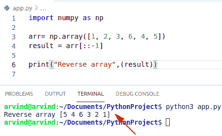

# Python 反向 NumPy 数组

> 原文：<https://pythonguides.com/python-reverse-numpy-array/>

[](https://sharepointsky.teachable.com/p/python-and-machine-learning-training-course)

在本 Python 教程中，我们将讨论 **Python 反向 NumPy 数组**，并给出如下几个例子:

*   Python 反向数组排序反向
*   Python numpy 逆数组
*   Python numpy 反转数组
*   Python numpy 翻转数组

目录

[](#)

*   [Python 反向 numpy 数组](#Python_reverse_numpy_array "Python reverse numpy array")
*   [使用列表切片](#Using_List_slicing "Using List slicing")
*   [使用翻转()功能](#Using_flip_function "Using flip() function")
*   [使用反向()功能](#Using_reverse_function "Using reverse() function")
*   [使用 flipud()方法](#Using_flipud_method "Using flipud() method")
*   [使用 fliplr()函数](#Using_fliplr_function "Using fliplr() function")
*   [使用 length()函数](#Using_length_function "Using length() function")
*   [Python 反向数组排序反向](#Python_reverse_array_sort_reverse "Python reverse array sort reverse")
*   [Python numpy 逆数组](#Python_numpy_inverse_array "Python numpy inverse array")
*   [检查 Python numpy 逆数组的另一种方法](#Another_method_to_check_Python_numpy_inverse_array "Another method to check Python numpy inverse array")
*   [Python numpy 反转数组](#Python_numpy_invert_array "Python numpy invert array")
*   [Python numpy 翻转数组](#Python_numpy_flip_array "Python numpy flip array")

## Python 反向 numpy 数组

*   在本节中，我们将讨论 **Python 反向 numpy 数组**。我们可以很容易地使用 list slicing()方法在 Python 中**反转一个数组。**
*   我们按照与原始列表相反的顺序创建一个列表。
*   让我们举一个例子来检查如何实现一个反向 numpy 数组
*   基本上有许多方法来检查反向 numpy 数组。
    *   使用列表切片方法
    *   使用 flip()函数
    *   使用 reverse()函数
    *   使用 flipud()方法
    *   使用 fliplr()函数
    *   使用 length()函数

阅读 [Python 数字过滤器](https://pythonguides.com/python-numpy-filter/)

## 使用列表切片

在这个方法中，我们将首先[创建一个 NumPy 数组](https://pythonguides.com/python-numpy-array/)，然后使用**切片方法**。

**举例:**

```py
import numpy as np

arr= np.array([1, 2, 3, 6, 4, 5])
result = arr[::-1]

print("Reverse array",(result))
```

下面是以下代码的截图



Python reverse numpy array

## 使用翻转()功能

*   在这个方法中，我们可以很容易地使用 **Python 函数 flip()** 来反转一个原始数组。
*   flip()方法用于沿给定轴反转数组中值的顺序。
*   flip()方法是在 numpy 库下定义的，可以作为 import numpy 作为 np 导入，我们可以借助 Python numpy 模块创建多维数组，创建其他数学统计。
*   numpy 数组的形状是首选的，但是元素被重新排序。

**语法:**

下面是 flip()函数的语法

```py
numpy.flip
          (
           arr,
           axis=None
          )
```

*   它由几个参数组成
    *   **数组:**输入数组
    *   **轴:**默认情况下，axis=None，将翻转输入数组的所有轴。如果轴值为负，它将从最后一个轴到第一个轴计数。

**举例:**

让我们举一个例子来检查如何使用 flip()函数实现一个**反向 NumPy 数组**。

```py
import numpy as np

arr= np.array([9, 8, 3, 6, 2, 1])
result = np.flip(arr)

print("Reverse array",(result))
```

在上面的代码中，我们将导入一个 numpy 库，并使用函数 NumPy 创建一个 NumPy 数组。数组。现在创建一个变量，并为函数 np 赋值。flip()，其中将参数作为数组传递并打印结果。结果将以逆序的形式显示。

下面是以下代码的截图


Python reverse numpy array by the flip method

## 使用反向()功能

*   在这个方法中，我们可以很容易地使用 reverse()函数来反转一个原始数组。
*   reversed()方法总是返回给定序列的反向迭代器。
*   它在原始位置反转一个数组，因此它不需要任何额外的空间来包含结果。
*   它是 Python 编程语言中的一个内置函数，可以就地反转列表中的元素。

**举例:**

让我们举一个例子来检查如何使用 reverse()函数实现一个**反向 NumPy 数组**。

```py
import array

arr=array.array('i',[4,5,9,1,9,3])
print(arr)

#reversing using reverse()
arr.reverse()
print("Reversed Array:",arr)
```

在上面的代码中，我们将导入一个 numpy 数组库，然后创建一个原始数组并将数组作为参数传递

下面是以下代码的截图


Python reverse numpy array reverse method

## 使用 flipud()方法

*   在这个例子中，我们可以很容易地使用 flipud()方法来反转一个原始数组。
*   方法的作用是:向上/向下翻转一个给定的数组。
*   向上/向下翻转每列和每行中的条目。
*   flipud()方法用于将函数从向上移动到向下。
*   flipud()表示向上/向下。numpy.flipud()返回一个视图。因为视图与给定的数组共享内存位置，所以从一个值更改另一个值。

**语法:**

下面是 flipud()方法的语法

```py
numpy.flipud
            (
             array
            )
```

*   它由几个参数组成
    *   **数组:**输入数组
    *   **返回:**上下方向翻转数组

**举例:**

让我们举一个例子来检查如何使用 flipud()方法实现反向 numpy 数组。

```py
import numpy as np

arr= np.array([9, 8, 3, 6, 2, 1])
result = np.flipud(arr)

print("Reverse array",(result))
```

在上面的代码中，我们将导入一个 numpy 库，然后使用函数 NumPy 创建一个 NumPy 数组。数组。现在创建一个变量，并为方法 np.flipud 赋值，该方法将一个参数作为数组传递并打印结果。结果将以逆序的形式显示。

下面是以下代码的截图


Python reverse numpy array by flipud method

## 使用 fliplr()函数

*   在这个例子中，我们可以很容易地使用 `fliplr()` 函数来反转一个原始数组。
*   np.fliplr()方法在左右方向翻转数组。numpy。flipr()函数总是接受一个给定的数组作为参数，并返回相同的数组和左右方向的翻转。
*   它将给定轴上的元素顺序反转为 1(左/右)。

**语法:**

下面是 `fliplr()` 函数的语法

```py
numpy.fliplr
           (
            arr
           )
```

*   它由几个参数组成
    *   **数组:**输入数组
    *   **Returns:** 返回一个列反转的输出 numpy 数组。因为函数返回了操作。

**举例:**

让我们举一个例子来检查如何使用 `fliplr()` 函数实现一个**反向 NumPy 数组**。

```py
import numpy as np

arr= np.array([[3, 5, 6, 7, 2, 1],
               [2,5,6,7,8,9]])
result = np.fliplr(arr)

print("Reverse array",(result))
```

下面是以下代码的截图


Python reverse numpy array fliplr method

## 使用 length()函数

*   在这个方法中，我们可以很容易地使用 **length()函数**。
*   我们将从指向列表中的第一个元素开始。从等于零的索引变量开始。现在，我们要去链表的最后一个元素 end_index，它将计算链表的长度。
*   所以 len()函数本身将返回一个整数

**举例:**

让我们举一个例子来检查如何使用 `length()` 函数实现反向 NumPy 数组。

```py
def reverse(nums):

    start_index = 0
    end_index = len(nums)-1

    while end_index > start_index:
        nums[start_index],nums[end_index] = nums[end_index],nums[start_index]
        start_index = start_index + 1
        end_index = end_index -1

if __name__ == '__main__':
    n = [1,2,3,4,5]
    reverse(n)
    print(n)
```

下面是以下代码的截图


Python reverse numpy array using the length function

阅读: [Python NumPy 索引](https://pythonguides.com/python-numpy-indexing/)

## Python 反向数组排序反向

*   在本节中，我们将讨论 **Python 反向数组排序反向**。
*   在 Numpy 中，np.sort()函数不允许我们以最大的数字顺序对数组进行排序。相反，我们可以在 Python 中对一个提供列表切片的数组进行升序排序后对其进行反转。
*   具有默认开始和停止索引以及负步长-1 的切片方法符号[::1]反转给定的列表。
*   使用切片方法 s[start:stop: step]访问每一步——从索引 start(包含)开始到索引 stop 结束的元素。

**举例:**

```py
import numpy as np
arr = np.array([2, 5, 1, 6, 7, 2, 4])

sort_arr = np.sort(arr)
# Reverse the sorted array
reve_arr = sort_arr[::-1]
print(sort_arr)
print(reve_arr)
```

*   在上面的代码中，我们将导入一个 numpy 库，并使用 numpy.array 函数创建一个数组。现在创建一个变量，并使用 np.sort()函数排列元素。
*   使用切片方法反转排序后的数组并打印输出。

下面是以下代码的截图


Python reverse numpy array reverse method

读: [Python NumPy argsort](https://pythonguides.com/python-numpy-argsort/)

## Python numpy 逆数组

*   在本节中，我们将讨论 **Python numpy 逆数组**。
*   对于矩阵求逆，我们需要使用 **numpy.linalg.inv()函数**。
*   该方法将对给定矩阵中的元素求逆。矩阵的逆是，如果它乘以原始的 numpy 矩阵，输出将显示在单位矩阵中。
*   它只包含一个参数 Arr，Arr 可以是一个矩阵。
*   它为用户提供了计算矩阵逆矩阵的简单方法。函数 np.linalg.inv()在 Python numpy 库中已经可用。

**语法:**

```py
numpy.linalg.inv(a)
```

**举例:**

让我们举一个例子来检查如何在 python 中对数组求逆

```py
import numpy as np

a = np.array([[4,3],[2,7]])
inverse_matrix = (np.linalg.inv(a))
print(inverse_matrix)
```

在上面的代码中，我们将导入一个 numpy 库，并使用该 numpy 创建一个数组。数组函数。现在创建一个变量并将函数 numpy 赋值。linalg 并显示结果。

下面是以下代码的截图


Python numpy inverse array

## 检查 Python numpy 逆数组的另一种方法

*   在这个方法中，我们可以很容易地使用**函数 np.matrix 来对数组**的元素求逆。
*   它总是从一个类似数组的元素(对象)或一串数据中返回一个矩阵。
*   矩阵是一种特殊的二维数组，通过运算包含其二维值。
*   在这个例子中，我们使用 I 属性对给定矩阵的元素求逆。

**语法:**

下面是 np.matrix()的语法

```py
numpy.matrix
            (
             data,
             dtype=None,
             copy=True
            )
```

*   它由几个参数组成
    *   **数据:**计算为矩阵，用逗号或空格分隔列和行。
    *   **dtype:** 矩阵的数据类型

**举例:**

让我们举一个例子来检查如何在 python 中对数组求逆

```py
import numpy as np

m = np.matrix([[4,6],[7,8]])
print (m.I)
```

下面是以下代码的截图


Python numpy inverse array matrix method

## Python numpy 反转数组

*   在本节中，我们将讨论 **Python numpy 反转数组**。这里我们可以很容易地使用函数 numpy.invert()。
*   此方法用于计算给定数组元素的逐位求逆。
*   它源于输入数组中整数的二进制数表示的按位 NOT。

**语法:**

下面是 numpy.invert()的语法

```py
numpy.invert
            (
             x,
             out=None,
             Where=True,
             casting='same_kind',
             order='K',
             dtype=None
            )
```

*   它由几个参数组成
    *   **X:** 输入数组(只处理整数值和布尔表达式)。
    *   **Out:** 可选参数。存储结果的位置。如果提供的话，它应该有一个输入广播的形状函数。
    *   **其中:**该条件通过输入提供。在条件为布尔的位置，out numpy 数组将被设置为 ufunc 结果。

**举例:**

让我们举一个例子来检查如何实现一个 numpy 反转数组

```py
import numpy as np

arr= np.array([4, 5, 5, 6, 2, 1])
result = np.invert(arr)

print("Invert array",(result))
```

下面是以下代码的截图


Python numpy invert array

## Python numpy 翻转数组

*   在这个方法中，我们将讨论 Python numpy 翻转数组。为此，我们可以很容易地使用函数 numpy。翻转()。
*   此方法沿轴反转给定数组元素的顺序，保留数组的形状。
*   数组的形状是固定的，但元素的数量是重新排序的。

**语法:**

下面是 flip()函数的语法

```py
numpy.flip
          (
           arr,
           axis=None
          )
```

**举例:**

让我们举一个例子来检查如何使用 flip()函数实现一个**反向 NumPy 数组。**

```py
import numpy as np

arr2= np.array([4, 2, 3, 2, 1, 8])
res = np.flip(arr2)

print(res)
```


Python numpy flip array

您可能会喜欢以下 Python NumPy 教程:

*   [Python NumPy 空数组示例](https://pythonguides.com/python-numpy-empty-array/)
*   [Python NumPy round + 13 例](https://pythonguides.com/python-numpy-round/)
*   [Python NumPy nan](https://pythonguides.com/python-numpy-nan/)
*   [Python NumPy 数据类型](https://pythonguides.com/python-numpy-data-types/)
*   [Python NumPy 规格化](https://pythonguides.com/python-numpy-normalize/)
*   [值错误:用序列](https://pythonguides.com/valueerror-setting-an-array-element-with-a-sequence/)设置数组元素
*   [Python NumPy 平均值](https://pythonguides.com/python-numpy-average/)
*   [Python NumPy 绝对值举例](https://pythonguides.com/python-numpy-absolute-value/)
*   [什么是 python Django](https://pythonguides.com/what-is-python-django/)
*   [Python 字典长度](https://pythonguides.com/python-dictionary-length/)

在本 Python 教程中，我们将讨论 **Python 反向 NumPy 数组**，并给出如下几个例子:

*   Python 反向数组排序反向
*   Python numpy 逆数组
*   Python numpy 反转数组
*   Python numpy 翻转数组

[Bijay Kumar](https://pythonguides.com/author/fewlines4biju/)

Python 是美国最流行的语言之一。我从事 Python 工作已经有很长时间了，我在与 Tkinter、Pandas、NumPy、Turtle、Django、Matplotlib、Tensorflow、Scipy、Scikit-Learn 等各种库合作方面拥有专业知识。我有与美国、加拿大、英国、澳大利亚、新西兰等国家的各种客户合作的经验。查看我的个人资料。

[enjoysharepoint.com/](https://enjoysharepoint.com/)[](https://www.facebook.com/fewlines4biju "Facebook")[](https://www.linkedin.com/in/fewlines4biju/ "Linkedin")[](https://twitter.com/fewlines4biju "Twitter")