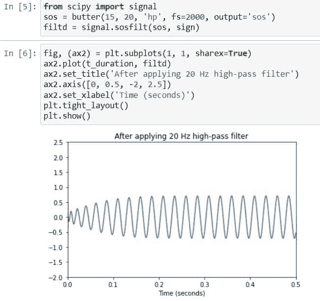

# Python Scipy Butterworth 滤镜

> 原文：<https://pythonguides.com/python-scipy-butterworth-filter/>

[](https://sharepointsky.teachable.com/p/python-and-machine-learning-training-course)

想了解 Scipy 中“`*Butterworth Filter*`的用法吗？`*Python Scipy Butterworth Filter*`将在本 [Python 教程](https://pythonguides.com/learn-python/)中介绍，同时我们还将学习如何使用 Python Scipy 方法过滤信号或图像。

*   什么是巴特沃兹滤波器
*   Python Scipy Butterworth 滤镜
*   Python Scipy Butterworth 滤波器带通
*   Python Scipy 巴特沃兹滤镜图像
*   Python Scipy Butterworth 滤波器系数
*   Python Scipy Butterworth 与高斯滤波器
*   Python Scipy Butterworth 滤波器顺序

目录

[](#)

*   [什么是巴特沃兹滤波器](#What_is_Butterworth_Filter "What is Butterworth Filter")
*   [Python Scipy Butterworth 滤镜](#Python_Scipy_Butterworth_Filter "Python Scipy Butterworth Filter")
*   [Python Scipy Butterworth 滤波器带通](#Python_Scipy_Butterworth_Filter_Bandpass "Python Scipy Butterworth Filter Bandpass")
*   [Python Scipy Butterworth 滤镜图片](#Python_Scipy_Butterworth_Filter_Image "Python Scipy Butterworth Filter Image")
*   [Python Scipy Butterworth 滤波器系数](#Python_Scipy_Butterworth_Filter_Coefficients "Python Scipy Butterworth Filter Coefficients")
*   [Python Scipy Butterworth Vs 高斯滤波器](#Python_Scipy_Butterworth_Vs_Gaussian_Filter "Python Scipy Butterworth Vs Gaussian Filter ")
*   [Python Scipy Butterworth 滤波器顺序](#Python_Scipy_Butterworth_Filter_Order "Python Scipy Butterworth Filter Order")

## 什么是巴特沃兹滤波器

在开始之前，我们需要了解本教程中使用的一些术语，如滤波器、低通滤波器或高通滤波器等。

*   单词“过滤”表示去除不需要的元素。滤水器是过滤器的最好例证。为什么利用它？用它可以将水中的杂质去除。电动过滤器的功能类似于水过滤器。
*   放大器、电感器、电容器和电阻器是电子滤波器的组成部分。电子滤波器用于衰减频率较低或较高的信号，同时允许特定频率水平的信号通过。
*   截止频率是指滤波器工作的频率。滤波器的截止频率在滤波器设计期间选择。
*   允许频率高于给定截止频率的信号通过并抑制频率低于该截止频率的信号的电子滤波器被称为高通滤波器。它们也被称为低截滤波器或低音截滤波器。
*   低通滤波器允许频率低于截止频率的信号通过，但阻止超过截止频率的任何频率，与高通滤波器相反。
*   滤波器可以通过的波长或频率范围称为通带。例如，无线电接收机有一个带通滤波器，从其天线接收的所有无线电波中选择所需的无线电信号频率。

称为巴特沃兹滤波器的信号处理滤波器的频率响应在通带内尽可能平坦。因此，巴特沃兹滤波器通常被称为“最大幅度平坦滤波器”。英国物理学家和工程师斯蒂芬·巴特沃斯于 1930 年在他的论文《论滤波放大器》中首次描述了这一现象。

巴特沃兹滤波器的频率响应在通带内是平坦的(使其成为带通滤波器)，在阻带内滚降为零。滤波器的顺序影响滚降响应的速率。滤波器的阶数由滤波器电路中采用的电抗元件的数量决定。

阅读: [Python Scipy 曲线拟合–详细指南](https://pythonguides.com/python-scipy-curve-fit/)

## Python Scipy Butterworth 滤镜

可以使用 Scipy 的 *`butter()`* 方法将巴特沃兹滤波器应用于信号。换句话说，我们可以设计一个数字或模拟 n 阶巴特沃兹滤波器来平坦化频率。

下面给出了语法。

```py
scipy.signal.butter(N, Wn, btype='low', analog=False, output='ba', fs=None)
```

其中参数为:

*   **N(int):** 用于指定滤波器的阶数。
*   **Wn(array_data):** 指定高、低通滤波器的临界频率。
*   **btype:** 用于指定使用哪种滤波器，如带阻、高通、低通和带通。
*   **analog(boolean):** 如果为真，则使用模拟滤波器，否则，在为假的情况下，使用数字滤波器。
*   **输出:**用于指定输出类型，如 zpk ( ploe-zero)、sos(二阶节)、ba(向后兼容)。

让我们以下面的步骤为例:

使用下面的 python 代码导入所需的库。

```py
from scipy.signal import butter
import numpy as np
import matplotlib.pyplot as plt
%matplotlib inline 
```

使用下面的代码创建信号的持续时间。

```py
t_duration = np.linspace(0,0.5,2000,False)
```

使用以下代码生成一个频率为 *`20`* 和 ***40 赫兹*** 的信号。

```py
sign = np.sin(2*np.pi*20*t_duration) + np.sin(2*np.pi*40*t_duration)
```

使用下面的代码绘制创建的信号。

```py
fig, (ax1) = plt.subplots(1, 1, sharex=True)
ax1.plot(t_duration, sign)
ax1.set_title('20 and 40 Hz Sinusoid')
ax1.axis([0, 0.5, -2, 2.5])
```


Python Scipy Butterworth Filter example

创建一个 25 Hz 的巴特沃兹高通滤波器，并使用下面的代码将其应用于上面创建的信号。

```py
from scipy import signal
sos = butter(15, 20, 'hp', fs=2000, output='sos')
filtd = signal.sosfilt(sos, sign)
```

使用以下代码绘制应用滤波器后的信号。

```py
fig, (ax2) = plt.subplots(1, 1, sharex=True)
ax2.plot(t_duration, filtd)
ax2.set_title('After applying 20 Hz high-pass filter')
ax2.axis([0, 0.5, -2, 2.5])
ax2.set_xlabel('Time (seconds)')
plt.tight_layout()
plt.show()
```



Python Scipy Butterworth Filter

这就是如何使用 Python Scipy 的方法`butter()`去除信号中的噪声。

阅读: [Python Scipy 衍生的数组](https://pythonguides.com/python-scipy-derivative-of-array/)

## Python Scipy Butterworth 滤波器带通

有带通滤波器，它结合了高通滤波器和低通滤波器的能力，只允许特定频率范围内的频率通过。方法`*`butter()`*`接受参数`btype`来指定以下过滤器:`highpass`、`lowpass`、`bandstop`和`bandpass`。

让我们按照以下步骤来看一个例子:

使用下面的 python 代码导入所需的库。

```py
from scipy.signal import butter
import numpy as np
import matplotlib.pyplot as plt
%matplotlib inline 
```

使用下面的代码创建信号的持续时间。

```py
t_duration = np.linspace(0,0.5,2000,False)
```

使用以下代码生成一个频率为 *`20`* 和 ***40 赫兹*** 的信号。

```py
sign = np.sin(2*np.pi*20*t_duration) + np.sin(2*np.pi*40*t_duration)
```

使用下面的代码绘制创建的信号。

```py
fig, (ax1) = plt.subplots(1, 1, sharex=True)
ax1.plot(t_duration, sign)
ax1.set_title('20 and 50 Hz Sinusoid')
ax1.axis([0, 0.5, -2, 2.5])
```


Python Scipy Butterworth Filter Bandpass

创建一个 30 Hz 的巴特沃兹高通滤波器，并使用下面的代码将其应用于上面创建的信号。

```py
from scipy import signal
sos = butter(15, [10,30], 'bp', fs=2000, output='sos')
filtd = signal.sosfilt(sos, sign)
```

使用以下代码绘制应用滤波器后的信号。

```py
fig, (ax2) = plt.subplots(1, 1, sharex=True)
ax2.plot(t_duration, filtd)
ax2.set_title('After applying 30 Hz high-pass filter')
ax2.axis([0, 0.5, -2, 2.5])
ax2.set_xlabel('Time (seconds)')
plt.tight_layout()
plt.show()
```


Python Scipy Butterworth Filter Bandpass Example

这就是如何使用带通滤波器来利用低频和高频滤波器的优势，以允许特定的频率范围。

阅读:[Python Scipy Gamma【10 个有用的例子】](https://pythonguides.com/python-scipy-gamma/)

## Python Scipy Butterworth 滤镜图片

使用巴特沃斯滤镜对照片进行模糊和锐化处理。在这一节中，我们将采用巴特沃兹过滤器的图像，看看它如何按照以下步骤过滤图像:

使用下面的 python 代码导入所需的库或方法。

```py
import numpy as np
import matplotlib.pyplot as plt
import cv2
```

使用`*`cv2`*`中的`*`imread()`*`方法打开并读取图像。

```py
img = cv2.imread('https://i0.wp.com/pythonguides.com/content/img.jpg',0)
plt.imshow(img)
```


Python Scipy Butterworth Filter Image Example

使用方法`*`np.fft.fft2()`*`和`*`np.fft.fftshift()`*`将图像变换到移位和频域。

```py
F_domain = np.fft.fft2(img)
F_shift = np.fft.fftshift(F_domain)

plt.imshow(np.log1p(np.abs(F_shift)), cmap='gray')
plt.axis('off')
plt.show()
```

使用下面的代码应用巴特沃兹低通滤波器。

```py
M_shape,N_shape = img.shape
H = np.zeros((M_shape,N_shape), dtype=np.float32)
D0 = 10 # cut-off frequency
n = 10 # It is order for butterworth
for u in range(M_shape):
    for v in range(N_shape):
        D = np.sqrt((u-M_shape/2)`2 + (v-N_shape/2)`2)
        H[u,v] = 1 / (1 + (D/D0)**n)

plt.imshow(H, cmap='gray')
plt.axis('off')
plt.show()
```


Python Scipy Butterworth Filter Image Tutorial

然后使用下面的代码再次对频域图像应用滤波器。

```py
G_shift = F_shift * H
G = np.fft.ifftshift(G_shift)
g = np.abs(np.fft.ifft2(G))

plt.imshow(g, cmap='gray')
plt.axis('off')
plt.show()
```


Python Scipy Butterworth Filter Image

这是如何使用 Python Scipy 中的巴特沃兹滤镜来模糊和锐化图像。

阅读: [Python Scipy Stats 泊松](https://pythonguides.com/python-scipy-stats-poisson/)

## Python Scipy Butterworth 滤波器系数

三阶巴特沃兹低通滤波器该滤波器中的三个未知系数是 a0、a1 和 a2。这些具有系数值 a0 = 1、a1 = 2 和 a2 = 2。因此，滤波器的第 n 阶将有 n 个系数。

IIR 代表无限脉冲响应，它是许多线性时不变系统的显著特征之一，可以通过脉冲响应 h(t)/h(n)永远不会达到零，而是无限持续来识别。

IIR 低通巴特沃兹:这是什么？它的功能基本上与具有无限脉冲响应的标准数字低通巴特沃兹滤波器相同。在本节中，我们将使用下面列出的 Python 代码来绘制滤波器的幅度和相位响应。

使用下面的代码导入所需的方法或库。

```py
import numpy as np
import matplotlib.pyplot as plt
import scipy.signal as signal 
```

使用以下代码定义滤波器的阶数、采样频率、截止频率和采样参数。

```py
N_order = 2 
Freq_samp = 7000 
freq_cut = 3300 
Td = 1/Freq_samp 
```

使用以下代码计算截止频率。

```py
w_d = 2*np.pi*freq_cut
print(w_d) 
```

使用以下代码包装模拟频率。

```py
w_c = (2/Td)*np.tan(w_d*Td/2)
print('Order of the filter=', N_order)
print('Cut-off frequency (in rad/s)=', w_c) 
```

使用 signal.butter()方法创建过滤器，使用 signal.bilinear()函数执行双线性变换。

```py
 b, a = signal.butter(N, wc, 'low', analog='True')

z, p = signal.bilinear(b, a, fs=Fs) 
```

现在使用下面的代码打印系数。

```py
print('Numerator-Coefficients:', z_)
print('Denominator-Coefficients:', p_) 
```


Python Scipy Butterworth Filter Coefficients

这就是如何使用 Python Scipy 的方法`*`bilinear()`*`根据滤波器的阶数获得巴特沃兹滤波器的系数。

阅读: [Python Scipy Kdtree](https://pythonguides.com/python-scipy-kdtree/)

## Python Scipy Butterworth Vs 高斯滤波器 

高通滤波器突出显示图像中的高频。然后，原始图像与高通图像相结合，以创建更清晰的图像。

摆弄巴特沃兹或高斯高通滤波器的宽度和频率阈值可能会很有趣。将在频域中完成的锐化与在空间域中完成的锐化进行比较将是令人着迷的。

高通滤波器突出显示图像的高频。巴特沃兹滤波器比高斯滤波器更清晰，这也是它们之间的不同之处。

## Python Scipy Butterworth 滤波器顺序

Python Scipy 在模块`*`scipy.signal`*`中有一个方法`*`buttord()`*`，它给出最低阶巴特沃兹滤波器的阶数，无论是数字还是模拟，在阻带中至少有 gstop dB 的衰减，通带损耗不超过 gpass dB。

下面给出了语法。

```py
scipy.signal.buttord(wp, ws, gpass, gstop, analog=False, fs=None)
```

其中参数为:

*   **wp，ws(float):** 阻带和通带的边缘频率。这些单位与数字滤波器的 fs 相同。样本归一化范围为 0 至 1，其中 1 为奈奎斯特频率，因为 fs 默认为 2 个半周期/样本。(因此，wp 和 ws 是每个样本的半周期。)
*   **gpass(float):** 通带最大时的最大损耗(dB)。
*   **gstop(float):** 阻带的最小衰减(dB)。
*   **analog(boolean):** 如果为真，则返回模拟滤波器；否则，返回数字滤波器。
*   **fs(float):** 数字系统中系统的采样率。

方法`buttord()`分别返回 int 和 ndarray 或 float 类型的`ord`(满足规范的最便宜的巴特沃兹滤波器)和`wn`(巴特沃兹的固有频率)。

让我们通过以下步骤了解一个示例:

使用下面的 python 代码导入所需的库或方法。

```py
from scipy.signal import buttord, butter, freqs
import numpy as np
import matplotlib.pyplot as plt
```

创建一个模拟带通滤波器，其通带在 15 至 45 rad/s 范围内为 2 dB 或更小，在 10 至 50 rad/s 范围内的抑制至少为-30 dB。

```py
N_ord, butt_freq = buttord([15, 45], [10, 50], 2, 30, True)
b_numerator, a_denominator = butter(N_ord, butt_freq, 'band', True)
angular_frq, freq_res = freqs(b_numerator, a_denominator, np.logspace(1, 2, 450))
```

绘制频率响应图，同时突出显示灰色的通带和阻带限制。

```py
plt.semilogx(angular_frq, 25 * np.log10(abs(freq_res)))
plt.title('Fitting a Butterworth bandpass filter to restrictions.')
plt.xlabel('Radians per second, frequency')
plt.ylabel('dB of amplitude')
plt.grid(which='both', axis='both')
plt.fill([1,  10,  10,   1], [-30, -30, 99, 99], '0.8', lw=0) # stop
plt.fill([15, 15,  45,  45], [-99, -2, -2, -99], '0.8', lw=0) # pass
plt.fill([50, 50, 1e9, 1e9], [99, -30, -30, 99], '0.8', lw=0) # stop
plt.axis([10, 100, -50, 2])
plt.show()
```


Python Scipy Butterworth Filter Order

这就是如何使用 Python Scipy 的方法`*`buttord()`*`来选择巴特沃兹滤波器阶数。

您可能也喜欢阅读下面的 Python Scipy 教程。

*   [PyTorch Conv1d](https://pythonguides.com/pytorch-conv1d/)
*   [Python Scipy 稀疏 Csr_matrix](https://pythonguides.com/python-scipy-sparse-csr_matrix/)
*   [Python Scipy Stats 峰度](https://pythonguides.com/python-scipy-stats-kurtosis/)
*   [Python Scipy IIR 滤波器](https://pythonguides.com/python-scipy-iir-filter/)
*   [py torch Lenet 简介](https://pythonguides.com/pytorch-lenet/)
*   [Python Scipy 统计模式](https://pythonguides.com/python-scipy-stats-mode/)
*   [Python Scipy 最小化](https://pythonguides.com/python-scipy-minimize/)
*   [Python Scipy 距离矩阵](https://pythonguides.com/scipy-distance-matrix/)

因此，在本教程中，我们已经了解了“`*Python Scipy Butterworth Filter*`”并涵盖了以下主题。

*   什么是巴特沃兹滤波器
*   Python Scipy Butterworth 滤镜
*   Python Scipy Butterworth 滤波器带通
*   Python Scipy 巴特沃兹滤镜图像
*   Python Scipy Butterworth 滤波器系数
*   Python Scipy Butterworth 与高斯滤波器
*   Python Scipy Butterworth 滤波器顺序

[Bijay Kumar](https://pythonguides.com/author/fewlines4biju/)

Python 是美国最流行的语言之一。我从事 Python 工作已经有很长时间了，我在与 Tkinter、Pandas、NumPy、Turtle、Django、Matplotlib、Tensorflow、Scipy、Scikit-Learn 等各种库合作方面拥有专业知识。我有与美国、加拿大、英国、澳大利亚、新西兰等国家的各种客户合作的经验。查看我的个人资料。

[enjoysharepoint.com/](https://enjoysharepoint.com/)[](https://www.facebook.com/fewlines4biju "Facebook")[](https://www.linkedin.com/in/fewlines4biju/ "Linkedin")[](https://twitter.com/fewlines4biju "Twitter")