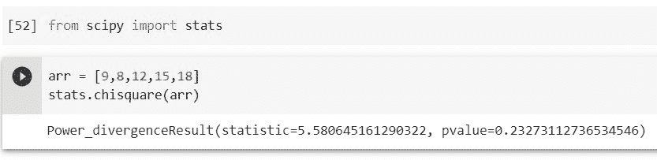
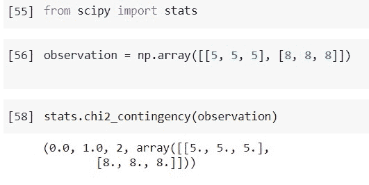
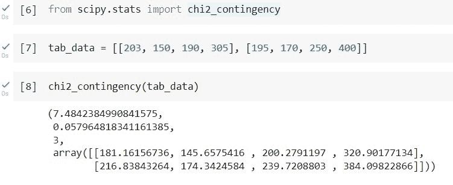
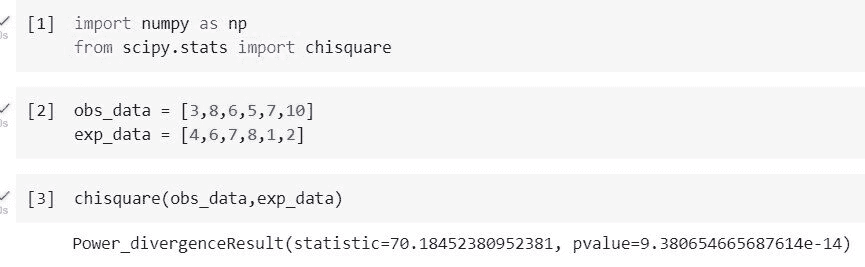
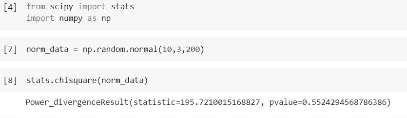
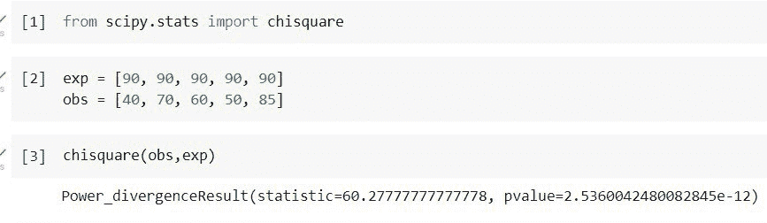

# Python Scipy 卡方测试[7 个惊人的例子]

> 原文：<https://pythonguides.com/python-scipy-chi-square-test/>

[](https://sharepointsky.teachable.com/p/python-and-machine-learning-training-course)

在本 [Python 教程](https://pythonguides.com/learn-python/)中，我们将学习“ **Python Scipy 卡方检验**”，它显示了分类变量之间的关联，并涵盖以下主题。

*   Python Scipy 卡方测试
*   Python Scipy 独立性卡方检验
*   Python Scipy 卡方测试列联表
*   Python Scipy 卡方检验分类变量
*   Python Scipy 卡方检验正态分布
*   Python Scipy 卡方测试拟合优度
*   Python Scipy 卡方检验 P 值

目录

[](#)

*   [Python Scipy 卡方检验](#Python_Scipy_Chi-Square_Test "Python Scipy Chi-Square Test")
*   [Python Scipy 独立性卡方检验](#Python_Scipy_Chi-Square_Test_of_Independence "Python Scipy Chi-Square Test of Independence")
*   [Python Scipy 卡方检验列联表](#Python_Scipy_Chi-Square_Test_Contingency_Table "Python Scipy Chi-Square Test Contingency Table")
*   [Python Scipy 卡方检验分类变量](#Python_Scipy_Chi-Square_Test_Categorical_Variables "Python Scipy Chi-Square Test Categorical Variables")
*   [Python Scipy 卡方检验正态分布](#Python_Scipy_Chi-Square_Test_Normal_Distribution "Python Scipy Chi-Square Test Normal Distribution")
*   [Python Scipy 卡方检验拟合优度](#Python_Scipy_Chi-Square_Test_Goodness_of_Fit "Python Scipy Chi-Square Test Goodness of Fit")
*   [Python Scipy 卡方检验 P 值](#Python_Scipy_Chi-Square_Test_P-Value "Python Scipy Chi-Square Test P-Value")

## Python Scipy 卡方检验

证明两个分类变量之间关系的一种技术是使用卡方统计。在模块`*`scipy.stats`*`中， [Python Scipy](https://pythonguides.com/what-is-scipy-in-python/) 有一个用于演示的方法`*`chisquare()`*`。方法`*`chisquare(`*)`测试分类数据具有指定频率的零假设。

*   如果每组中观察到的或预期的频率太低，则该测试无效。根据共同的标准，观察到的和预测到的频率都应该至少为 5。

下面给出了语法。

```py
scipy.stats.chisquare(f_obs, ddof=1, f_exp=None, axis=1)
```

其中参数为:

*   ***f _ OBS(array _ data):***每个类别的观察频率。
*   ***ddof():*** 是“δ自由度”:调整自由度的 p 度值。自由度为 k–1–ddof 的卡方分布用于计算 p 值，其中 k 是观察频率的数量。ddof 的默认值为 0。
*   ***f_exp():*** 每个类别中预期的频率。默认情况下，这些类别被假定为可能性相等。
*   ***轴(int):*** 测试要沿着 f_obs 和 f_ exp 的广播结果的轴应用。如果坐标轴为 None，则 obs 中的所有值都被视为一个数据集合。

该方法返回 ndarray 或 float 类型的 ***`chisq`(卡方检验统计量)*** 和 ***`p-value`(检验的 p 值)*** 。

让我们以下面的步骤为例:

使用下面的 python 代码导入所需的库。

```py
from scipy import stats
```

现在创建一个数组，并考虑指定了 *`f_obs`* ，预测频率假定为常数，并由观察频率的平均值提供。使用下面的代码来计算数组值的卡方。

```py
arr = [9,8,12,15,18]
stats.chisquare(arr)
```



Python Scipy Chi-Square Test

看看上面的输出，我们已经使用 Python SciPY 的方法`*`chisqure()`*`计算了数组值的卡方值或 p 值。

阅读: [Scipy 信号-有用教程](https://pythonguides.com/scipy-signal/)

## Python Scipy 独立性卡方检验

独立性卡方检验用于检验两个分类变量是否有显著关系。Python SciPy 有一个用于这种测试的方法``*chi2-contingency()*``，它存在于模块`*`scipy.stats`*`中。

下面给出了语法。

```py
scipy.stats.chi2_contingency(observed, lambda_=None correction=False)
```

其中参数为:

*   ***(array _ data):***或有事项表。表中列出了每个类别的观察频率(出现次数)。
*   ***lambda(str 或 float):*** Pearson 的卡方统计量是该测试中计算的默认统计量。相反，lambda_ 允许您使用来自 Cressie-Read power divergence 系列的统计数据。
*   ***修正(布尔):*** 如果为真且自由度为一，则应用耶茨的连续性修正。该校正具有在期望值方向上将每个观察值调整 0.5 的效果。

方法`*`chi2_contingency()`*`返回 ***`chi`(这是一个测试统计)`**``p`(这是测试的 p 值)`**``dof`(这是自由度)*** 和 ***【期望(频率期望)*** 。

让我们以下列步骤为例:

使用下面的 python 代码导入所需的库。

```py
from scipy import stats
```

使用下面的代码创建一个包含观察值的数组。

```py
observation = np.array([[5, 5, 5], [8, 8, 8]]) 
```

使用下面的代码将观察结果传递给方法`*`chi2_contengency()`*`来测试变量的独立性。

```py
stats.chi2_contingency(observation)
```



Python Scipy Chi-Square Test of Independence

这就是如何使用 Python SciPy 的方法`*`chi2_contingency()`*`来测试变量的独立性。

阅读:[Scipy Stats Zscore+Examples](https://pythonguides.com/scipy-stats-zscore/)

## Python Scipy 卡方检验列联表

我们已经从上面的“Python Scipy 卡方测试”小节中了解了`*`chisquare()`*` 。在这一小节中，我们将学习存在于模块`*`scipy.stats`*`中的另一个方法`*`chi2_contingency()`*`，但是在开始之前，我们将首先了解 ***“什么是列联表？”*T6。**

在统计学中，列联表(有时称为交叉表)概括了多个分类变量之间的联系。我们将看一张表格，显示购买各种水果的男女数量。

|  | 苹果 | 芒果 | 香蕉 | 草莓 |
| 女人 | Two hundred and three | One hundred and fifty | One hundred and ninety | Three hundred and five |
| 男人 | One hundred and ninety-five | One hundred and seventy | Two hundred and fifty | four hundred |
| 总和 | Three hundred and ninety-eight | Three hundred and twenty | Four hundred and forty | Seven hundred and five |

Fruits buying table

测试的目的是确定性别和水果偏好这两个变量是否有联系。

我们从阐述零假设(H0)开始，它声称变量没有关系。另一个假设(H1)是这两者之间有重要的联系。

如果你不了解假设，那么可以参考本教程的另一个小节***“Python Scipy 卡方检验 P 值”*** 。

现在，我们将使用方法`*`chi2_contingency()`*`通过以下步骤测试上述假设:

使用下面的 python 代码导入所需的库。

```py
from scipy.stats import chi2_contingency
```

使用我们在上面使用下面的代码创建的数组创建一个表。

```py
tab_data = [[203, 150, 190, 305], [195, 170, 250, 400]]
```

使用下面的代码，使用方法`*`chi2_contingency()`*`进行测试。

```py
chi2_contingency(tab_data)
```



Python Scipy Chi-Square Test Contingency Table

从上面的输出中，我们可以看到 p 值大于 0.5，这意味着上述变量性别和水果之间存在独立性。

阅读: [Python Scipy Matrix +示例](https://pythonguides.com/python-scipy-matrix/)

## Python Scipy 卡方检验分类变量

我们已经知道卡方检验以及两个分类变量之间的关系是否存在。为了执行这个测试，我们使用了模块`*`scipy.stats`*`的方法`*`chisquare()`*`。

让我们举一个例子，按照下面的步骤，我们的数据将被分类。

使用下面的 python 代码导入所需的库。

```py
import numpy as np
from scipy.stats import chisquare
```

创建两种数据，第一种包含访问者在网站***【python guides . com】***上花费的实际小时数的数据，另一种是访问者使用下面的代码在网站上花费的预期时间。

```py
obs_data = [3,8,6,5,7,10]
exp_data = [4,6,7,8,1,2]
```

将这两个数据传递给方法`*`chisquare()`*`,使用下面的代码测试这两个分类变量之间的关系。

```py
chisquare(obs_data,exp_data)
```



Python Scipy Chi-Square Test Categorical Variables

查看上面的输出，我们对 p 值感兴趣，它显示了分类变量之间的关系，p 值大约是 9.380。

p 值大于 0.5，意味着上述两个分类变量之间没有关系。

阅读:[Python Scipy FFT【11 个有用的例子】](https://pythonguides.com/python-scipy-fft/)

## Python Scipy 卡方检验正态分布

在本节中，我们将使用 Python SciPy 的方法`*`chisquare()`*`来测试样本是否属于正态分布。

让我们通过下面的步骤来了解一个示例:

使用下面的 python 代码导入所需的库。

```py
from scipy import stats
import numpy as np
```

使用下面的代码生成包含正态分布值的数据。

```py
norm_data = np.random.normal(10,3,200)
```

使用下面的代码进行正态性测试。

```py
stats.chisquare(norm_data)
```



Python Scipy Chi-Square Test Normal Distribution

从输出中，我们可以看到 p 值大于 0.5，这意味着样本数据属于正态分布。

阅读: [Scipy 寻找峰值–有用教程](https://pythonguides.com/scipy-find-peaks/)

## Python Scipy 卡方检验拟合优度

为了测试分类变量是否遵循预测分布，使用了卡方拟合优度测试。模块`*`scipy.stats`*`中有一个方法`*`chisquare()`*`，我们已经在本教程的第一小节中学习过。

让我们以下面的步骤为例:

使用下面的 python 代码导入所需的库。

```py
from scipy.stats import chisquare
```

假设我们期望我们的网站 pythonguides.com 在一周的每一天都有相同数量的访问者。为了验证这一预期或假设，记录了一周中每天访问网站的客户数量。

使用下面的代码创建两个数组来存储网站上预期访问者和观察访问者的数量。

```py
exp = [90, 90, 90, 90, 90]
obs = [40, 70, 60, 50, 85]
```

卡方拟合优度检验是我们可以用这些数据来验证假设的东西。使用方法`*`chisquare()`*`和上面创建的数组 exp 和 obs。

```py
chisquare(obs,exp)
```



Python Scipy Chi-Square Test Goodness of Fit

卡方检验的 p 值为 2.53，卡方检验统计值为 60.36。

请记住，卡方拟合优度检验的无效假设和替代假设如下:

*   ***H [0] :*** 一个变量的分布是基于一个假设的。
*   ***H [1] :*** 一个变量不同于预期分布。

我们可以拒绝零假设，因为 p 值(2.53)大于 0.05。如果你不知道这个假设，那么阅读下面的小节***“Python Scipy 卡方检验 P 值”*** 。

阅读: [Python Scipy 特辑](https://pythonguides.com/python-scipy-special/)

## Python Scipy 卡方检验 P 值

在进行卡方检验时，p 值用于衡量与零假设相关的结果的显著性。

为了理解 p 值的使用，我们首先需要了解假设，一个关于我们周围世界的有根据的假设就是假设。它应该是可观察的或可测试的。

有两种假设:

*   ***零假设(H [0] ):*** 一个测试的零假设总是预测变量之间不存在影响或关联。
*   ***交替假设(H [1] ):*** 交替假设是对两个可测变量具有某种统计意义的声明。

现在，我们知道了零假设，我们是否应该接受零假设或替代假设，这种决策可以使用 p 值来做出。

*   一般来说，如果假设的值小于 0.5，它提供了反对零假设的重要证据，因为零假设为真的概率小于 5%。因此，无效假设被拒绝，而替代假设被接受。
*   大于或等于 0.05 的 p 值没有统计学意义，表明对零假设的有力支持。这意味着保留原假设，拒绝替代假设。

另外，看看更多的 Python Scipy 教程。

*   [Scipy 正态分布](https://pythonguides.com/scipy-normal-distribution/)
*   [Python Scipy 统计模式](https://pythonguides.com/python-scipy-stats-mode/)
*   [Python Scipy 指数](https://pythonguides.com/python-scipy-exponential/)
*   [Scipy Misc +示例](https://pythonguides.com/scipy-misc/)
*   [Scipy Rotate Image](https://pythonguides.com/scipy-rotate-image/)
*   [科学常数+示例](https://pythonguides.com/scipy-constants/)

因此，在本教程中，我们已经了解了" **Python Scipy 卡方测试**"并涵盖了以下主题。

*   Python Scipy 卡方测试
*   Python Scipy 独立性卡方检验
*   Python Scipy 卡方测试列联表
*   Python Scipy 卡方检验分类变量
*   Python Scipy 卡方检验正态分布
*   Python Scipy 卡方测试拟合优度
*   Python Scipy 卡方检验 P 值

[Bijay Kumar](https://pythonguides.com/author/fewlines4biju/)

Python 是美国最流行的语言之一。我从事 Python 工作已经有很长时间了，我在与 Tkinter、Pandas、NumPy、Turtle、Django、Matplotlib、Tensorflow、Scipy、Scikit-Learn 等各种库合作方面拥有专业知识。我有与美国、加拿大、英国、澳大利亚、新西兰等国家的各种客户合作的经验。查看我的个人资料。

[enjoysharepoint.com/](https://enjoysharepoint.com/)[](https://www.facebook.com/fewlines4biju "Facebook")[](https://www.linkedin.com/in/fewlines4biju/ "Linkedin")[](https://twitter.com/fewlines4biju "Twitter")