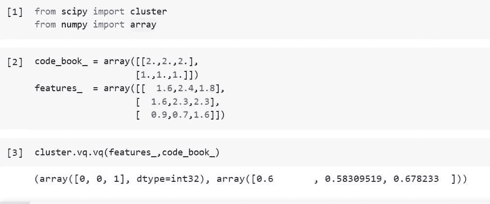
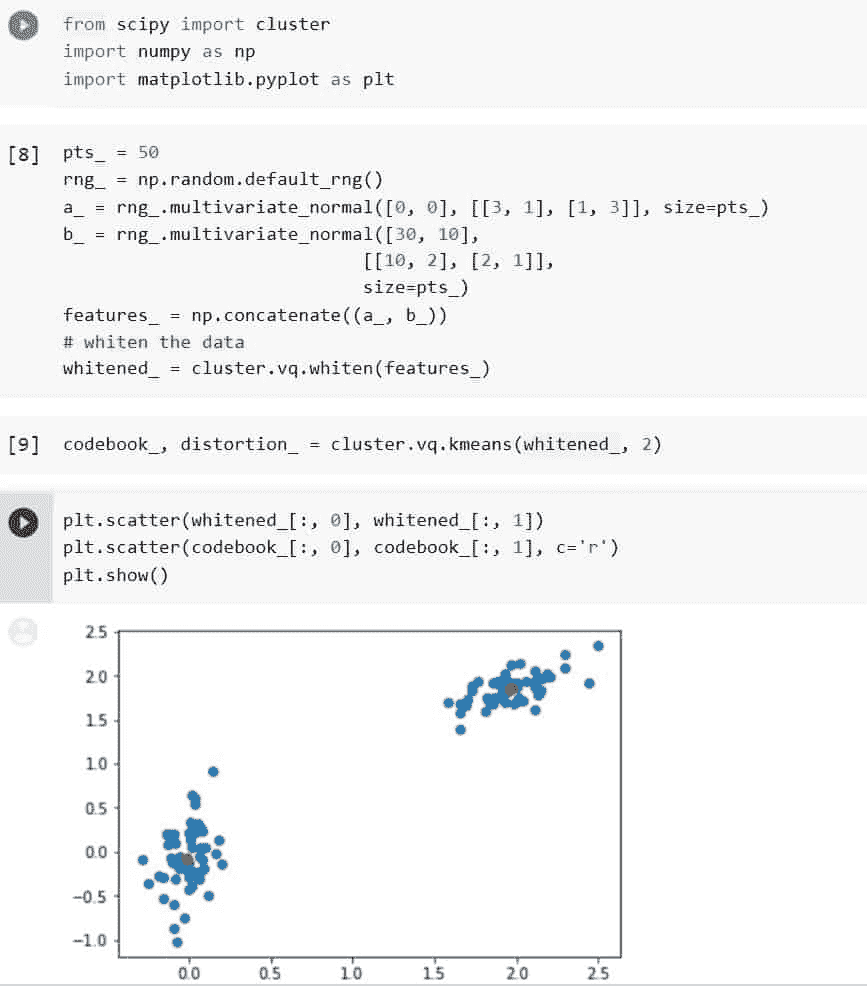
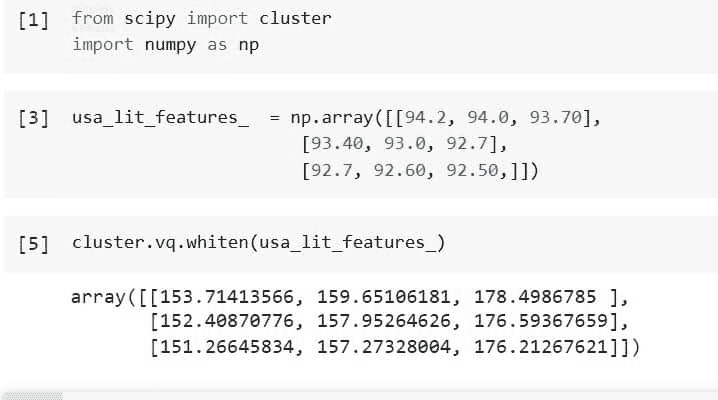

# Python Scipy 集群 Vq

> 原文：<https://pythonguides.com/python-scipy-cluster-vq/>

[](https://sharepointsky.teachable.com/p/python-and-machine-learning-training-course)

在 Python Scipy 教程“ `Python Scipy Cluster Vq` ”中，我们将根据类别对给定数据进行聚类，或者通过涵盖以下主题对样本点进行分组。

*   什么是 Scipy 中的集群 Vq？
*   如何使用 vq()方法将代码分配给码本中的观察值
*   如何使用 Kmeans 对给定的数据进行聚类
*   Python Scipy 集群 Vq 白化

目录

[](#)

*   [什么是 Scipy 中的集群 Vq？](#What_is_cluster_Vq_in_Scipy "What is cluster Vq in Scipy?")
*   [Python Scipy 缝合器 Vq](#Python_Scipy_Clsuter_Vq "Python Scipy Clsuter Vq")
*   [Python Scipy 集群 Vq Kmeans](#Python_Scipy_Cluster_Vq_Kmeans "Python Scipy Cluster Vq Kmeans")
*   [Python Scipy 集群 Vq 白化](#Python_Scipy_Cluster_Vq_Whiten "Python Scipy Cluster Vq Whiten")

## 什么是 Scipy 中的集群 Vq？

包`*`scipy.cluster`*`包含进行 k-均值聚类、从 k-均值模型创建码书以及通过将矢量与码书中的质心进行比较来量化矢量的指令。

k-means 方法需要两个输入:一组要聚类的观察向量和所需的聚类数 k。为 k 个聚类中的每个聚类返回一个离心力。最近质心的聚类数或质心索引用于对观察向量进行分类。

如果向量 v 比任何其他质心更靠近质心 I，则群集 I 将包含该向量。如果 v 是 I 的成员，那么 I 被称为 v 的主形心。通过求和每个观测向量与其主质心之间的平方距离，k-means 算法试图最小化失真(定义为失真)。

通过重复地将观察值重新排列成簇并重新计算质心，直到找到质心稳定的配置，最小化就完成了。也可以设置最大迭代次数。

信息论术语经常被应用，因为矢量量化是 k-means 的合适应用。将代码映射到质心(反之亦然)的表通常称为“代码簿”，质心索引或簇索引也称为“代码”

可以使用 k-means 产生的质心集合来量化矢量。量化的目标是确定一个矢量编码，使预期的失真最小。

每个例程都假设 obs 是一个 M 乘 N 的数组，观察向量在行中。码字 I 的质心在码本的第 I 行，这是一个大小为 k 乘 n 的数组。观测向量和质心的特征维数是相同的。

阅读 [Python Scipy IIR 滤波器](https://pythonguides.com/python-scipy-iir-filter/)

## Python Scipy 缝合器 Vq

Python Scipy 在模块`*`scipy.cluster.vq`*`中有一个方法`*`vq()`*`,该方法为每个观察提供一个来自代码簿的代码。在与代码簿中的质心进行比较之后，最近质心的代码被分配给“M”乘“N”OBS 阵列中的每个观测向量。

通过白化功能运行特征，可以为 obs 中的特征提供所需的单位方差。k-means 算法或另一种编码算法可以用来建立代码簿。

下面给出了语法。

```py
scipy.cluster.vq.vq(obs, code_book, check_finite=True)
```

其中参数为:

*   **OBS(ndarray):**“M”x“N”数组的行是观察值。在每个观察期间看到的“特征”在列中描述。在此之前，必须使用白化功能或类似工具对要素进行白化。
*   **code _ book(ndarray):**k-means 算法通常用于产生码本。阵列的列包括代码的特征，并且每一行包含唯一的代码。
*   **check_finite(boolean):** 如果需要验证输入矩阵只包含有限个数字。禁用可能会提高性能，但如果输入包含无限或 nan，可能会导致问题(崩溃、非终止)。默认值:真

方法`*`vq()`*`返回 ndarray 类型的 ***`code`(每个观察的码本索引存储在长度为 M 的数组中)*** 、 ***`dist`(观察的最近码与其失真之间的间隔(距离)】*** 。

让我们以下面的步骤为例:

使用下面的 python 代码导入所需的库或方法。

```py
from scipy import cluster
from numpy import array
```

使用 NumPy 数组创建特征和码本。

```py
code_book_ = array([[2.,2.,2.],
                   [1.,1.,1.]])
features_  = array([[  1.6,2.4,1.8],
                   [  1.6,2.3,2.3],
                   [  0.9,0.7,1.6]])
```

使用下面的代码将上面创建的数组传递给方法`*`vq()`*`。

```py
cluster.vq.vq(features_,code_book_)
```



Python Scipy Clsuter Vq

阅读 [Python Scipy Butterworth 过滤器](https://pythonguides.com/python-scipy-butterworth-filter/)

## Python Scipy 集群 Vq Kmeans

模块`*`scipy.cluster.vq`*`中 Python Scipy 的方法`*`kmeans()`*`将 k-means 应用于一组观察向量，以创建 k 个聚类。

直到聚类质心的位置在多次迭代中稳定，k-means 方法将观察值的聚类修改成组，并更新聚类质心。

该算法的实现使用阈值来比较观察值和它们对应的质心之间的平均欧几里得距离的变化的绝对值，以确定质心的稳定性。

结果，产生了将质心映射到代码的代码簿，反之亦然。

下面给出了语法。

```py
scipy.cluster.vq.kmeans(obs, k_or_guess, iter=20, thresh=1e-05, check_finite=True)
```

其中参数为:

*   **OBS(ndarray):**M 乘 N 数组的每一行代表一个观察向量。在每次观察中注意到的特征由列表示。首先必须使用白化功能来使特征变亮。
*   **k_or_guess(int):** 要产生的质心数量。每个质心被赋予一个代码，该代码也是所创建的代码簿矩阵中质心的行索引。通过从观测矩阵中随机选取观测值，确定初始的 k 个质心。初始的 k 个质心也可以通过传递一个 k 乘 N 数组来指定。
*   **iter(int):** 运行多少次 k-means 得到失真最小的码本作为结果。如果为 k 或 guess 参数的数组提供了初始质心，则忽略该参数。k-means 算法的迭代次数不由该参数表示。
*   **thresh(float):** 如果自 k-means 算法最后一次迭代以来的失真变化小于或等于阈值，则算法终止。
*   **check_finite(boolean):** 如果需要验证输入矩阵只包含有限个数字。禁用可能会提高性能，但如果输入包含无限或 nan，可能会导致问题(崩溃、非终止)。标准:正确

方法`*`kmeans()`*`返回`*`codebook`*`(k 个质心的数组，k 乘 n，代码 I 代表第 I 个质心码本[i]。尽管不一定是全局失真最小的，但所产生的质心和代码代表了所见的最低失真。

因为没有分配给任何观测值的质心在整个迭代过程中被消除，应该注意的是，质心的数量并不总是与 k 或猜测参数、`*`distortion`*`(产生的质心和经过的观测值之间的平均欧几里德距离(非平方))相同。

请记住，k-means 算法与传统的失真定义(距离的平方和)有所不同。

让我们按照以下步骤来看一个例子:

使用下面的代码导入所需的库或方法。

```py
from scipy import cluster
import numpy as np
import matplotlib.pyplot as plt
```

用特征创建 50 个数据点，并用下面的代码白化它们。

```py
pts_ = 50
rng_ = np.random.default_rng()
a_ = rng_.multivariate_normal([0, 0], [[3, 1], [1, 3]], size=pts_)
b_ = rng_.multivariate_normal([30, 10],
                            [[10, 2], [2, 1]],
                            size=pts_)
features_ = np.concatenate((a_, b_))
# whiten the data
whitened_ = cluster.vq.whiten(features_)
```

使用下面的代码在数据中查找两个集群。

```py
codebook_, distortion_ = cluster.vq.kmeans(whitened_, 2)
```

使用下面的代码，用红色中心绘制白化数据。

```py
plt.scatter(whitened_[:, 0], whitened_[:, 1])
plt.scatter(codebook_[:, 0], codebook_[:, 1], c='r')
plt.show()
```



Python Scipy Cluster Vq Kmeans

阅读 [Python Scipy Stats Fit](https://pythonguides.com/python-scipy-stats-fit/)

## Python Scipy 集群 Vq 白化

Python Scipy 在模块`*`scipy.cluster`*`中有一个方法`*`whiten()`*`,该方法通过预特征对观察集合进行归一化。

在进行 k-means(即“白化”它，就像在“白噪声”中，当每个频率具有等量的功率时)之前，通过它的标准偏差来缩放观察集合的每个特征维度是有利的。每个要素的单位方差通过除以所有观测值的平均标准差来计算。

下面给出了语法。

```py
scipy.cluster.vq.whiten(obs, check_finite=True)
```

其中参数为:

*   **obs(ndarray):** 一个观察值属于数组的每一行。在每次观察中观察到的特征显示在列中。
*   **check_finite(boolean):** 如果需要验证输入矩阵只包含有限个数字。禁用可能会提高性能，但如果输入包含无限或 nan，可能会导致问题(崩溃、非终止)。标准:正确

方法`*`whiten()`*`返回`*`result`*`(包含由每列的标准偏差缩放的 obs 值)。

让我们以下面的步骤为例:

使用下面的 python 代码导入所需的库或方法。

```py
from scipy import cluster
```

使用以下代码创建代表美国前 9 个州识字率的特征，如 ***`New Hampshire = 94.20%, Minnesota = 94.00%, North Dakota = 93.70%, Vermont = 93.40%, South Dakota = 93.00%, Nebraska = 92.70%, Wisconsin = 92.70%, Maine = 92.60%, Iowa = 92.50%`*** 。

```py
usa_lit_features_  = np.array([[94.2, 94.0, 93.70],
                      [93.40, 93.0, 92.7],
                      [92.7, 92.60, 92.50,]])
```

现在使用下面的代码白化数据。

```py
cluster.vq.whiten(usa_lit_features_)
```



Python Scipy Cluster Vq Whiten

这就是如何使用 Python Scipy 的方法`*`whiten()`*`来规范化观察值集合。

我们已经学习了如何使用`*`vq`*`、`*`kmeans`*`等方法从观察值集合中计算聚类，主题如下。

*   什么是 Scipy 中的集群 Vq？
*   如何使用 vq()方法将代码分配给码本中的观察值
*   如何使用 Kmeans 对给定的数据进行聚类
*   Python Scipy 集群 Vq 白化

您可能会喜欢以下 Python Scipy 教程:

*   [Python Scipy 曲线拟合](https://pythonguides.com/python-scipy-curve-fit/)
*   [Python Scipy Load Mat File](https://pythonguides.com/python-scipy-load-mat-file/)
*   [Python Scipy 衍生的数组](https://pythonguides.com/python-scipy-derivative-of-array/)
*   [python scipy tttest _ in】的缩写](https://pythonguides.com/python-scipy-ttest_ind/)
*   [Python Scipy Gamma](https://pythonguides.com/python-scipy-gamma/)

[Bijay Kumar](https://pythonguides.com/author/fewlines4biju/)

Python 是美国最流行的语言之一。我从事 Python 工作已经有很长时间了，我在与 Tkinter、Pandas、NumPy、Turtle、Django、Matplotlib、Tensorflow、Scipy、Scikit-Learn 等各种库合作方面拥有专业知识。我有与美国、加拿大、英国、澳大利亚、新西兰等国家的各种客户合作的经验。查看我的个人资料。

[enjoysharepoint.com/](https://enjoysharepoint.com/)[](https://www.facebook.com/fewlines4biju "Facebook")[](https://www.linkedin.com/in/fewlines4biju/ "Linkedin")[](https://twitter.com/fewlines4biju "Twitter")