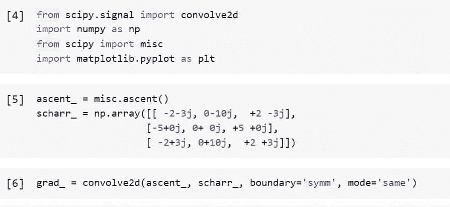
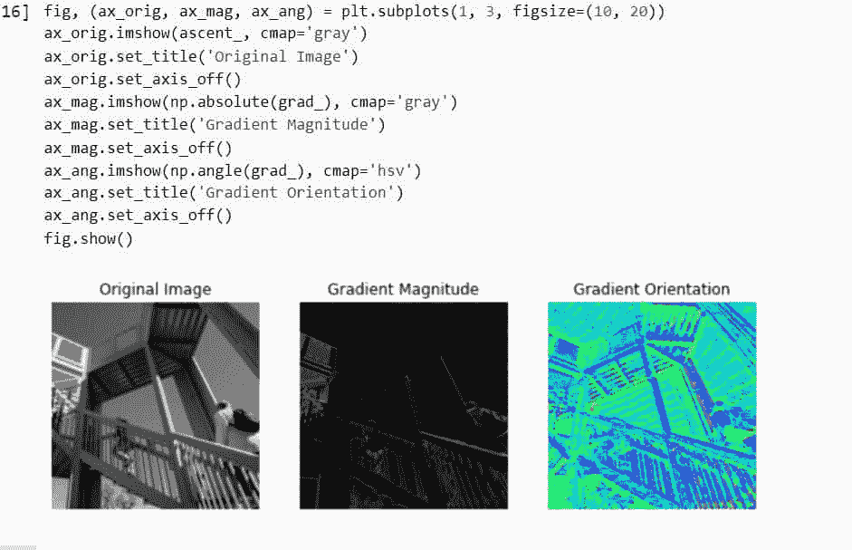
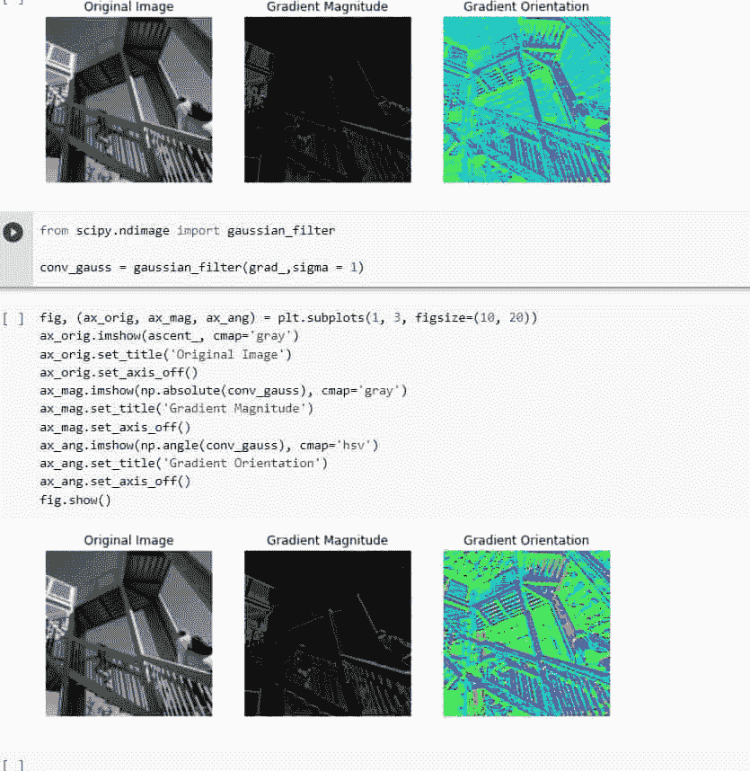
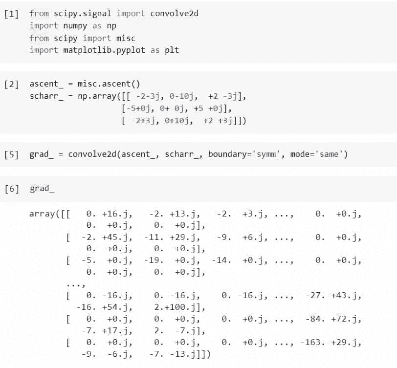
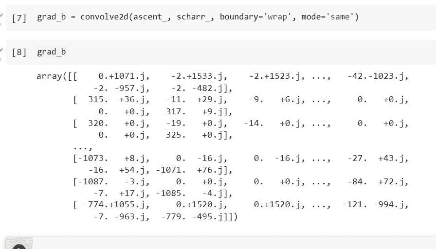
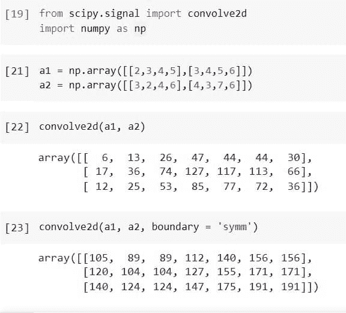
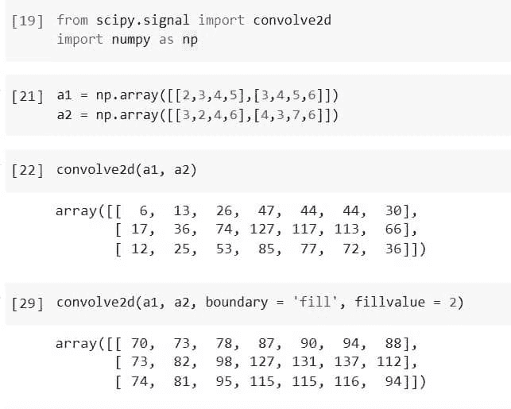
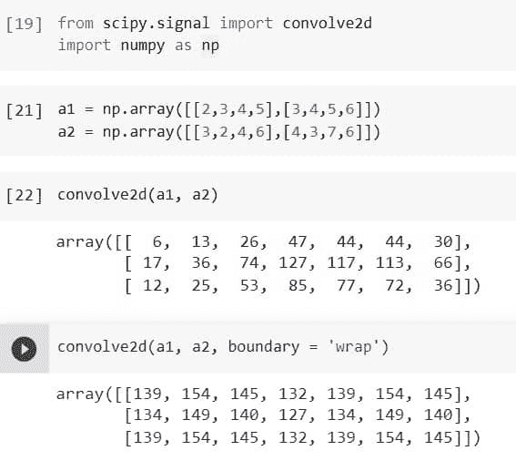

# Python Scipy 卷积 2d

> 原文：<https://pythonguides.com/python-scipy-convolve-2d/>

[](https://sharepointsky.teachable.com/p/python-and-machine-learning-training-course)

在本 [Python Scipy 教程](https://pythonguides.com/what-is-scipy-in-python/)中，我们将学习“ `Python Scipy Convolve 2d` ”将二维数组合并为一个，该过程称为卷积，我们还将通过涵盖以下主题来处理输入数组的边缘或边界。

*   什么是卷积？
*   Python Scipy 卷积 2d
*   如何对卷积数据应用高斯滤波器
*   卷积中如何处理输入数组的边界
*   Python Scipy 卷积 2d Symm
*   卷积时如何填充输入数组
*   Python Scipy 卷积 2d Wrap

目录

[](#)

*   [什么是卷积？](#What_is_convolution "What is convolution?")
*   [Python Scipy 卷积 2d](#Python_Scipy_Convolve_2d "Python Scipy Convolve 2d")
*   [Python Scipy 卷积 2d 高斯](#Python_Scipy_Convolve_2d_Gaussian "Python Scipy Convolve 2d Gaussian")
*   [Python Scipy 卷积 2d 边界](#Python_Scipy_Convolve_2d_Boundary "Python Scipy Convolve 2d Boundary")
*   [Python Scipy 卷积二维对称](#Python_Scipy_Convolve_2d_Symm "Python Scipy Convolve 2d Symm")
*   [Python Scipy 卷积 2d 填充](#Python_Scipy_Convolve_2d_Padding "Python Scipy Convolve 2d Padding")
*   [Python Scipy 卷积 2d Wrap](#Python_Scipy_Convolve_2d_Wrap "Python Scipy Convolve 2d Wrap")

## 什么是卷积？

卷积是一种简单的数学运算，是几种流行的图像处理技术的基础。通过将两个数组(通常大小不同但维数相同)相乘，卷积提供了一种创建第三个数组(维数也相同)的方法。

利用这一点，可以实现图像处理算子，其输出像素值是某些输入像素值的直接线性组合。

通常，图像处理上下文中的输入数组之一仅包含灰度图像。内核是第二个数组，通常要小得多，是二维的(但可能只有一个像素厚)。

卷积是通过移动核通过所有点来执行的，在所有点处，核完全适合图片的边界，通常从左上角开始。

单个输出像素与每个内核位置相关联，并且其值通过将内核值乘以内核中每个单元的底层图像的像素值来计算，然后将所有这些数字加在一起。

现在我们知道了图像卷积的重要性，我们也可以将两个信号卷积成一个信号。

阅读[科学卷积](https://pythonguides.com/scipy-convolve/)

## Python Scipy 卷积 2d

Python Scipy 在模块`*`scipy.signal`*`中有一个方法`*`convolve2d()`*`,它接受二维数组并将它们卷积成一个数组。

组合 in1 和 in2，同时让输出大小和边界条件由 mode、boundary 和 fillvalue 设置。

下面给出了语法。

```py
scipy.signal.convolve2d(in1, in2, mode='full', boundary='fill', fillvalue=0)
```

其中参数为:

*   **in1(array_data):** 是第一个输入。
*   **in2(array_data):** 第二个输入与 in1 具有相同的维数。
*   **mode(string):** 表示输出大小的字符串。
*   **边界(字符串):**显示处理边界的正确方式的旗帜。
*   **fillvalue(标量):**用作输入数组填充的值。默认值为 0。

方法`*`convolve2d()`*`返回 ***`out`(由 in1 和 in2 之间的一部分离散线性卷积组成的二维数组)*** 。

让我们以下面的步骤为例:

使用下面的 python 代码导入所需的库或方法。

```py
from scipy.signal import convolve2d
import numpy as np
from scipy import misc
import matplotlib.pyplot as plt
```

使用复杂的 Scharr 算子进行 2D 卷积来计算图像的梯度。如果不想在图像的边缘创建边缘，请使用对称边界条件。

```py
ascent_ = misc.ascent()
scharr_ = np.array([[ -2-3j, 0-10j,  +2 -3j],
                   [-5+0j, 0+ 0j, +5 +0j],
                   [ -2+3j, 0+10j,  +2 +3j]])

grad_ = convolve2d(ascent_, scharr_, boundary='symm', mode='same')
```



Python Scipy Convolve 2d Example

使用下面的代码绘制计算出的梯度。

```py
fig, (ax_orig, ax_mag, ax_ang) = plt.subplots(3, 1, figsize=(6, 15))
ax_orig.imshow(ascent_, cmap='gray')
ax_orig.set_title('Original Image')
ax_orig.set_axis_off()
ax_mag.imshow(np.absolute(grad_), cmap='gray')
ax_mag.set_title('Gradient Magnitude')
ax_mag.set_axis_off()
ax_ang.imshow(np.angle(grad_), cmap='hsv')
ax_ang.set_title('Gradient Orientation')
ax_ang.set_axis_off()
fig.show()
```



Python Scipy Convolve 2d

这就是如何使用 Python Scipy 的方法`*`covolve2d()`*`将 2d 数组卷积成一个数组。

读取[信号](https://pythonguides.com/scipy-signal/)

## Python Scipy 卷积 2d 高斯

我们将在卷积数组上使用高斯滤波器，因此，我们将使用 Python Scipy 的方法`*`gaussian_filter()`*`。例如，我们将采用在上面小节“Python Scipy Convolve 2d”中使用的相同示例。

使用下面的 python 代码导入所需的库或方法。

```py
from scipy.signal import convolve2d
import numpy as np
from scipy import misc
import matplotlib.pyplot as plt
```

使用复杂的 Scharr 算子进行 2D 卷积来计算图像的梯度。如果不想在图像的边缘创建边缘，请使用对称边界条件。

```py
ascent_ = misc.ascent()
scharr_ = np.array([[ -2-3j, 0-10j,  +2 -3j],
                   [-5+0j, 0+ 0j, +5 +0j],
                   [ -2+3j, 0+10j,  +2 +3j]])

grad_ = convolve2d(ascent_, scharr_, boundary='symm', mode='same')
```

现在使用下面的代码对数据`*`grad_`*`应用高斯滤波器。

```py
from scipy.ndimage import gaussian_filter

conv_gauss = gaussian_filter(grad_,sigma = 1)
```

使用下面的代码再次绘制应用了高斯滤波器的图像。

```py
fig, (ax_orig, ax_mag, ax_ang) = plt.subplots(1, 3, figsize=(10, 20))
ax_orig.imshow(ascent_, cmap='gray')
ax_orig.set_title('Original Image')
ax_orig.set_axis_off()
ax_mag.imshow(np.absolute(conv_gauss), cmap='gray')
ax_mag.set_title('Gradient Magnitude')
ax_mag.set_axis_off()
ax_ang.imshow(np.angle(conv_gauss), cmap='hsv')
ax_ang.set_title('Gradient Orientation')
ax_ang.set_axis_off()
fig.show()
```



Python Scipy Convolve 2d Gaussian

从上面的输出中，如果我们比较两幅图像，例如一幅没有对卷积数据应用高斯滤波器，而另一幅对卷积数据应用高斯滤波器，则存在差异。

读取[科学积分](https://pythonguides.com/scipy-integrate/)

## Python Scipy 卷积 2d 边界

模块`*`scipy.signal`*`中 Python Scipy 的方法`*`convolve2d()`*`,该方法接受参数`boundary`,该参数是显示在卷积 2d 数组时处理边界的正确方式的标志。

以下是参数边界接受的下列值:

*   **填充:**用填充输入数组填充值。(默认)。
*   **环绕:**用圆圈划分界限。
*   **symm:** 对称边界情况。

让我们按照以下步骤来看一个例子:

使用下面的 python 代码导入所需的库或方法。

```py
from scipy.signal import convolve2d
import numpy as np
from scipy import misc
import matplotlib.pyplot as plt
```

使用复杂的沙尔算子和 2D 卷积计算图像的梯度。如果不希望图像的边缘周围有边缘，请使用对称边界条件。

```py
ascent_ = misc.ascent()
scharr_ = np.array([[ -2-3j, 0-10j,  +2 -3j],
                   [-5+0j, 0+ 0j, +5 +0j],
                   [ -2+3j, 0+10j,  +2 +3j]])

grad_ = convolve2d(ascent_, scharr_, boundary='symm', mode='same')
grad_
```



Python Scipy Convolve 2d Boundary Example

使用下面的代码再次计算一个有环绕边界的图像的渐变。

```py
grad_b = convolve2d(ascent_, scharr_, boundary='wrap', mode='same')
grad_b
```



Python Scipy Convolve 2d Boundary

这就是如何使用 Python Scipy 的方法`*`convolve2d()`*`的参数`boundary`处理数组或图像的边界。

阅读[科学杂项](https://pythonguides.com/scipy-misc/)

## Python Scipy 卷积二维对称

我们已经学习了参数 ***`boundary`*** 来处理卷积时数组的边界。该参数接受一个值`symm`来保持边界对称。

让我们以下面的步骤为例:

使用下面的 python 代码导入所需的库或方法。

```py
from scipy.signal import convolve2d
import numpy as np
```

使用下面的代码创建一个二维数组。

```py
a1 = np.array([[2,3,4,5],[3,4,5,6]])
a2 = np.array([[3,2,4,6],[4,3,7,6]])
```

使用下面的代码应用带有默认边界值的 convolve2d 方法。

```py
convolve2d(a1, a2)
```

使用下面的代码再次应用边界等于`*`symm`*`的方法。

```py
convolve2d(a1, a2, boundary = 'symm')
```



Python Scipy Convolve 2d Symm

这就是在 Scipy 中卷积两个数组时如何使用 symmetrical 值来处理数组的边界。

阅读[科学统计数据](https://pythonguides.com/scipy-stats/)

## Python Scipy 卷积 2d 填充

我们已经知道在卷积时如何处理数组边界，因为我们已经了解了参数`*`boundary`*`。为了用 fillvalue 填充输入数组，该参数接受一个值`*`fill`*`。同样，在使用等于`*`fill`*`的边界时，使用参数`*`fillvalue`*`。

让我们以下面的步骤为例:

使用下面的 python 代码导入所需的库或方法。

```py
from scipy.signal import convolve2d
import numpy as np
```

使用下面的代码创建一个二维数组。

```py
a1 = np.array([[2,3,4,5],[3,4,5,6]])
a2 = np.array([[3,2,4,6],[4,3,7,6]])
```

使用下面的代码应用带有默认边界值的 convolve2d 方法。

```py
convolve2d(a1, a2)
```

使用下面的代码再次应用边界等于`*`fill`*`的方法。

```py
convolve2d(a1, a2, boundary = 'fill', fillvalue = 2)
```



Python Scipy Convolve 2d Padding

这就是在 Python Scipy 中卷积两个数组时如何使用值板来处理数组的边界。

读取[剪切旋转图像](https://pythonguides.com/scipy-rotate-image/)

## Python Scipy 卷积 2d Wrap

为了在卷积过程中处理数组的边界，我们已经了解了参数`*`boundary`*`。该参数接受一个值`*`wrap`*`来保持圆形边界。

让我们以下面的步骤为例:

使用下面的 python 代码导入所需的库或方法。

```py
from scipy.signal import convolve2d
import numpy as np
```

使用下面的代码创建一个二维数组。

```py
a1 = np.array([[2,3,4,5],[3,4,5,6]])
a2 = np.array([[3,2,4,6],[4,3,7,6]])
```

使用下面的代码应用带有默认边界值的 convolve2d 方法。

```py
convolve2d(a1, a2)
```

使用下面的代码再次应用边界等于`*`wrap`*`的方法。

```py
convolve2d(a1, a2, boundary = 'wrap')
```



Python Scipy Convolve 2d Wrap

这就是在 Python Scipy 中卷积两个数组时如何使用值包装来处理数组的边界。

通过学习以下主题，我们已经了解了如何卷积二维数组，以及如何使用 fill、wrap 和 symm 等值填充输入数组的边界。

*   什么是卷积？
*   Python Scipy 卷积 2d
*   如何对卷积数据应用高斯滤波器
*   卷积中如何处理输入数组的边界
*   Python Scipy 卷积 2d Symm
*   卷积时如何填充输入数组
*   Python Scipy 卷积 2d Wrap

您可能会喜欢以下 python scipy 教程:

*   [Scipy Sparse](https://pythonguides.com/scipy-sparse/)
*   [Python Scipy 两两距离](https://pythonguides.com/python-scipy-pairwise-distance/)
*   [Python Scipy Linalg Svd](https://pythonguides.com/python-scipy-linalg-svd/)
*   [Python Scipy Ndimage Imread 教程](https://pythonguides.com/python-scipy-ndimage-imread/)
*   [Python Scipy 平滑](https://pythonguides.com/python-scipy-smoothing/)

[Saurabh](https://pythonguides.com/author/saurabh/)

我叫 Kumar Saurabh，是一名 Python 开发人员，在 TSInfo Technologies 工作。此外，像 Python 编程，SciPy，机器学习，人工智能等技术的专业知识。是我喜欢做的事情。