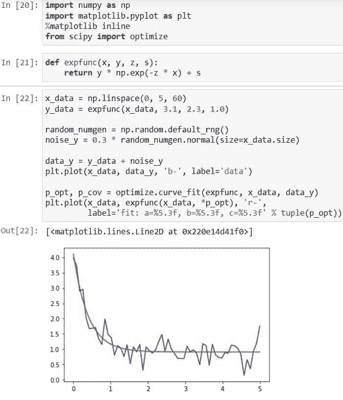

# Python Scipy 曲线拟合–详细指南

> 原文：<https://pythonguides.com/python-scipy-curve-fit/>

[](https://sharepointsky.teachable.com/p/python-and-machine-learning-training-course)

本 [Python 教程](https://pythonguides.com/learn-python/)将教你如何使用“ ***Python Scipy 曲线拟合*** ”方法将数据拟合到各种函数中，包括指数和高斯，并将贯穿以下主题。

*   什么是 Scipy 中的曲线拟合？
*   Python 曲线拟合高斯
*   Python Scipy 曲线拟合多个变量
*   Python Scipy 曲线拟合初始猜测
*   Python Scipy 曲线拟合 Maxfev
*   Python Scipy 曲线拟合指数

目录

[](#)

*   [什么是 Scipy 中的曲线拟合](#What_is_Curve_Fit_in_Scipy "What is Curve Fit in Scipy")
*   [Python Scipy 曲线拟合高斯](#Python_Scipy_Curve_Fit_Gaussian "Python Scipy Curve Fit Gaussian")
*   [Python Scipy 曲线拟合多个变量](#Python_Scipy_Curve_Fit_Multiple_Variables "Python Scipy Curve Fit Multiple Variables")
*   [Python Scipy 曲线拟合初始猜测](#Python_Scipy_Curve_Fit_Initial_Guess "Python Scipy Curve Fit Initial Guess")
*   [Python Scipy 曲线拟合 Maxfev](#Python_Scipy_Curve_Fit_Maxfev "Python Scipy Curve Fit Maxfev")
*   [Python Scipy 曲线拟合指数](#Python_Scipy_Curve_Fit_Exponential "Python Scipy Curve Fit Exponential")

## 什么是 Scipy 中的曲线拟合

模块`*`scipy.optimize`*`的`*`curve_fit()`*`方法应用非线性最小二乘法将数据拟合为函数。

下面给出了语法。

```py
scipy.optimize.curve_fit(f, xdata, ydata, p0=None, sigma=None, absolute_sigma=False, check_finite=True, bounds=(- inf, inf), method=None, jac=None, full_output=False, **kwargs)
```

其中参数为:

*   **f:** 模型的 f(x，…)函数。自变量必须是第一个自变量，后续自变量必须分别是拟合参数。
*   **xdata(array_data):** 用于测量数据的自变量。可以是任何对象，但对于具有 k 个预测值的函数，通常应该是 M 长度的序列或(k，M)形数组。
*   **ydata(array_data):** 一个长度为 M 的数组，名义上作为从属数据 f(xdata，…)。
*   **p0(array_data):** 参数的初始最佳猜测(长度 N)。如果为 None，所有起始值都将为 1。
*   **sigma:** 确定 ydata 的不确定性级别。
*   **absolute_sigma(boolean):** 如果为真，则计算的参数协方差 pcov 表示 sigma 在其应用中的绝对值。
*   **check_finite(boolean):** 如果为 True，确保输入数组没有任何 nan 或 INF，如果有，发出 ValueError。如果输入数组实际上包含 nan，将此参数设置为 False 可能会导致无意义的结果。默认情况下，为 True。
*   **界限(二元组):**参数的下限和上限。默认情况下没有边界。元组的每个元素必须是长度等于参数数量的数组，或者是单个元素。
*   **方法:**一种针对无约束问题的优化技术，默认为“lm”，如果给定了界限，则为“trf”当观测值少于变量时，方法“lm”将不起作用，在这种情况下，尝试“trf”或“dogbox”
*   jac(string，callable):签名为 jac(x，…)的函数，它生成一个类似密集数组的结构，表示关于参数的模型函数的雅可比矩阵。它将使用您提供的 sigma 进行缩放。如果没有雅可比矩阵，将对其进行数学估计(默认)。“trf”和“dogbox”方法的字符串关键字可用于选择有限差分格式。
*   **full_output(boolean):** 如果为 True，该函数以 infodict、mesg 和 ier 的形式返回附加数据。

方法`*`curve_fit()`*`返回`*`popt`*`(参数应设置为最佳值，以最小化“f(xdata，* popt)-y data”的残差平方和。)，`*`pcov`*` ( popt 的估计协方差。参数估计的方差由对角线提供。)、`infodict`(一个可选的带有按键的输出字典)和`*`mesg`*`(一个包含答案细节的字符串消息)。

现在我们将使用这种方法来拟合以下子主题中的数据。

同样，检查: [Python Scipy 派生的数组](https://pythonguides.com/python-scipy-derivative-of-array/)

## Python Scipy 曲线拟合高斯

当我们绘制数据集时，图表的形式就是我们所说的数据集分布，就像直方图一样。钟形曲线，通常称为高斯或正态分布，是连续数据最常见的形状。

让我们按照以下步骤，使用方法`*`curve_fit`*`将数据拟合为高斯分布:

使用下面的 python 代码导入所需的方法或库。

```py
from scipy.optimize import curve_fit
import numpy as np
import matplotlib.pyplot as plt
```

使用下面的代码创建 x 和 y 数据。

```py
x_data = [ -7.0, -6.0, -10.0, -9.0, -8.0, -1.0, 0.0, 1.0, 2.0, -5.0, -4.0, -3.0, -2.0, 7.0, 8.0, 3.0, 4.0, 5.0, 6.0, 9.0, 10.0]
y_data = [ 8.3, 10.6,1.2, 4.2, 6.7, 15.7, 16.1, 16.6, 11.7, 13.5, 14.5, 16.0, 12.7, 10.3, 8.6, 15.4, 14.4, 14.2, 6.1, 3.9, 2.1]
```

要利用 NumPy 数组的有用功能，请将 x_data 和 y_data 转换成它们。

```py
x_data = np.asarray(x_data)
y_data = np.asarray(y_data)
plt.plot(x_data, y_data, 'o')
```


Python Scipy Curve Fit Gaussian Example

使用下面的代码创建一个高斯函数。

```py
def Gaussian_fun(x, a, b):
    y_res = a*np.exp(-1*b*x**2)
    return y_res
```

现在将数据拟合到高斯函数，并使用下面的代码提取所需的参数值。

```py
params, cov = curve_fit(Gaussian_fun, x_data, y_data)

fitA = params[0]
fitB = params[1]

fity = Gaussian_fun(x_data, fitA, fitB)
```

使用以下代码绘制拟合数据。

```py
plt.plot(x_data, y_data, '*', label='data')
plt.plot(x_data, fity, '-', label='fit')
plt.legend()
```


Python Scipy Curve Fit Gaussian

根据输出，我们将数据近似拟合为高斯型。

阅读: [Python Scipy Gamma](https://pythonguides.com/python-scipy-gamma/)

## Python Scipy 曲线拟合多个变量

独立变量可以作为多维数组传递给“曲线拟合”，但是我们的“函数”也必须允许这样做。让我们通过下面的步骤来了解一个示例:

使用下面的 python 代码导入所需的库或方法。

```py
from scipy import optimize
import numpy as np
```

创建一个调用数组 P 的函数，并使用下面的代码将其解包到 P 和 q。

```py
def fun(P, x, y, z):
    p,q = P
    return np.log(x) + y*np.log(p) + z*np.log(q)
```

使用下面的代码创建一些噪声数据。

```py
p = np.linspace(0.1,1.2,100)
q = np.linspace(1.1,2.1, 100)
x, y, z = 8., 5., 9.
z = fun((p,q), x, y, z) * 1 + np.random.random(100) / 100
```

使用下面的代码定义初始猜测并使数据适合多个变量。

```py
p0 = 7., 3., 6.
print(optimize.curve_fit(fun, (p,q), z, p0))
```


Python Scipy Curve Fit Multiple Variables

阅读: [Python Scipy Stats 泊松](https://pythonguides.com/python-scipy-stats-poisson/)

## Python Scipy 曲线拟合初始猜测

拟合参数最初是使用值为 1.0 的“曲线拟合”程序来估计的。然而，也有拟合不收敛的情况，在这种情况下，我们必须提供一个明智的假设作为起点。让我们按照以下步骤来看一个例子:

使用下面的 python 代码导入所需的库或方法。

```py
from scipy import optimize
import numpy as np
```

在这里，我们将指定一些时间间隔和温度范围相似的数据，希望它们符合类似充电电容器的指数。除了定义温度值的误差线之外，我们还利用这个温度数组，并在其中添加一些随机噪声。

```py
def capcitor(x, y, z):
    return y*(1-np.exp(z*x))
t = np.linspace(0.5,3.0, 9)
tempretures = np.array([14.77, 18.47, 20.95, 22.62, 23.73, 24.48, 24.98, 25.32, 25.54])
tempretures = tempretures + 0.4*np.random.normal(size=len(tempretures))
dTempretures = np.array([1.3, 0.8, 1.1, 0.9, 0.8, 0.8, 0.7, 0.6, 0.6])
```

现在用下面的代码拟合数据。

```py
fit_Params, fit_Covariances = optimize.curve_fit(capcitor, t, tempretures)
print(fit_Params)
print(fit_Covariances)
```

如果我们运行上面的代码，它将不起作用。看一看产生的错误消息。


Python Scipy Curve Fit Initial Guess Example

一旦我们为 a 和 b 添加一些有根据的猜测(p0 ),我们会看到现在的拟合是完美的。

```py
fit_Params, fit_Covariances = optimize.curve_fit(capcitor, t, tempretures, p0 = [30.0, -1.0])
print(fit_Params)
print(fit_Covariances)
```


Python Scipy Curve Fit Initial Guess

这就是如何使用方法`*`curve_fit()`*`的初始猜测进行拟合。

阅读: [Python Scipy 特征值](https://pythonguides.com/python-scipy-eigenvalues/)

## Python Scipy 曲线拟合 Maxfev

Python Scipy 的方法`*`curve_fit()`*`接受参数`*`maxfev`*`，这是函数调用的最大数量。在上面的小节中，当运行拟合函数来拟合一个没有初始猜测的数据时，它显示一个错误`***Optimal parameters not found: Number of calls to function has reached maxfev = 600***`。

这意味着该函数被调用了 600 次，没有找到任何最佳参数。让我们增加参数`*`maxfev`*`的值，看看它是否找到了最佳参数。所以在这里我们将采取与我们在上面小节***【Python Scipy 曲线拟合初始猜测】*** 中采取的相同的例子。

```py
fit_Params, fit_Covariances = optimize.curve_fit(capcitor, t, tempretures, maxfev=800)
print(fit_Params)
print(fit_Covariances)
```


Python Scipy Curve Fit Maxfev

从输出中可以看到，函数调用 800 次就找到了最优参数。

阅读:[Python Scipy Stats multivarial _ Normal](https://pythonguides.com/python-scipy-stats-multivariate_normal/)

## Python Scipy 曲线拟合指数

SciPy Python 包的模块`*`scipy.optimize`*`中的`*`curve_fit()`*`方法使用非线性最小二乘法对数据进行函数拟合。因此，在本节中，我们将开发一个指数函数，并将其提供给方法 curve fit()，以便它可以拟合生成的数据。

让我们以下面的步骤为例:

使用下面的 python 代码导入所需的库。

```py
import numpy as np
import matplotlib.pyplot as plt
%matplotlib inline
from scipy import optimize
```

使用下面的代码创建一个指数函数。

```py
def expfunc(x, y, z, s):
    return y * np.exp(-z * x) + s
```

使用下面的代码来定义数据，以便它可以适应噪声，适应函数“expfunc”的参数，并且还可以将优化限制在特定的区域。

```py
x_data = np.linspace(0, 5, 60)
y_data = expfunc(x_data, 3.1, 2.3, 1.0)

random_numgen = np.random.default_rng()
noise_y = 0.3 * random_numgen.normal(size=x_data.size)

data_y = y_data + noise_y
plt.plot(x_data, data_y, 'b-', label='data')

p_opt, p_cov = optimize.curve_fit(expfunc, x_data, data_y)
plt.plot(x_data, expfunc(x_data, *p_opt), 'r-',
         label='fit: a=%5.3f, b=%5.3f, c=%5.3f' % tuple(p_opt))
```



Python Scipy Curve Fit Exponential

从上面的输出中，我们可以看到使用方法`*`curve_fit()`*`将数据拟合为指数函数，这就是如何将数据拟合为指数函数。

您可能也喜欢阅读下面的 Python SciPy 教程。

*   [Python Scipy Freqz](https://pythonguides.com/python-scipy-freqz/)
*   [Scipy Ndimage Imread](https://pythonguides.com/python-scipy-ndimage-imread/)
*   [Python Scipy Gaussian_Kde](https://pythonguides.com/python-scipy-gaussian_kde/)
*   [Scipy 距离矩阵](https://pythonguides.com/scipy-distance-matrix/)
*   [Python Scipy Stats Fit](https://pythonguides.com/python-scipy-stats-fit/)
*   [Python Scipy 指数](https://pythonguides.com/python-scipy-exponential/)
*   [Scipy 特殊模块](https://pythonguides.com/python-scipy-special/)

因此，在本教程中，我们学习了“ ***Python Scipy 曲线拟合*** ”并涵盖了以下主题。

*   什么是 Scipy 中的曲线拟合？
*   Python 曲线拟合高斯
*   Python 曲线拟合边界
*   Python Scipy 曲线拟合多个变量
*   Python Scipy 曲线拟合初始猜测
*   Python Scipy 曲线拟合 Maxfev
*   Python Scipy 曲线拟合指数

[Bijay Kumar](https://pythonguides.com/author/fewlines4biju/)

Python 是美国最流行的语言之一。我从事 Python 工作已经有很长时间了，我在与 Tkinter、Pandas、NumPy、Turtle、Django、Matplotlib、Tensorflow、Scipy、Scikit-Learn 等各种库合作方面拥有专业知识。我有与美国、加拿大、英国、澳大利亚、新西兰等国家的各种客户合作的经验。查看我的个人资料。

[enjoysharepoint.com/](https://enjoysharepoint.com/)[](https://www.facebook.com/fewlines4biju "Facebook")[](https://www.linkedin.com/in/fewlines4biju/ "Linkedin")[](https://twitter.com/fewlines4biju "Twitter")