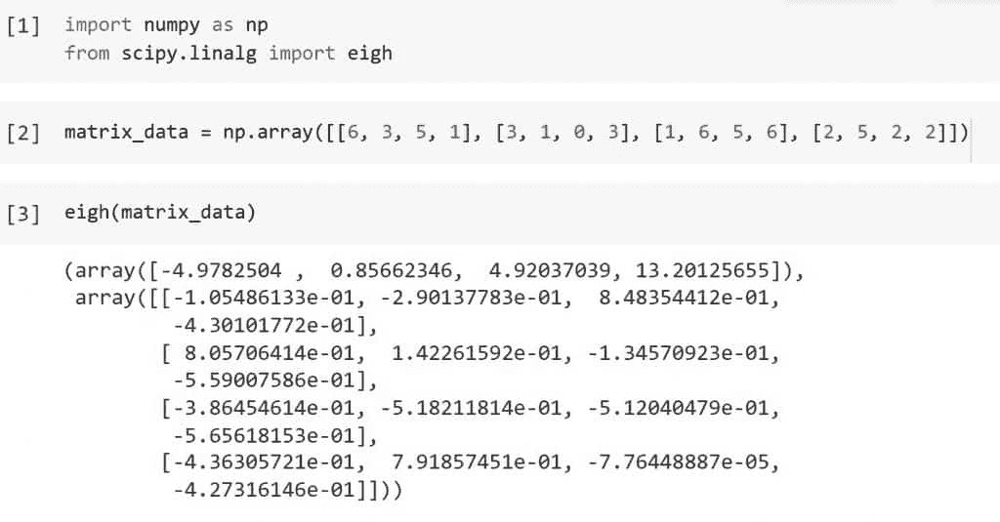

# Python Scipy 特征值[7 个有用的例子]

> 原文：<https://pythonguides.com/python-scipy-eigenvalues/>

[](https://sharepointsky.teachable.com/p/python-and-machine-learning-training-course)

在本 [Python 教程](https://pythonguides.com/learn-python/)中，我们将学习“ ***Python Scipy 特征值*** ”，在这里我们将知道如何找到给定矩阵的 ***特征值*** 和 ***特征向量*** 。我们还将讨论以下主题。

*   什么是特征值
*   Python Scipy 特征值
*   Python Scipy 特征值埃尔米特的
*   Python Scipy 特征值 Eigvals _ only
*   Python Scipy 特征值子集按值
*   Python Scipy 特征值子集索引
*   Python Scipy 特征值和特征向量

另外，查看如何在 Python 中安装 Scipy:[安装 Scipy](https://pythonguides.com/what-is-scipy-in-python/#Installation_of_Scipy)

目录

[](#)

*   [什么是特征值](#What_is_Eigenvalues "What is Eigenvalues")
*   [Python Scipy 特征值](#Python_Scipy_Eigenvalues "Python Scipy Eigenvalues")
*   [Python Scipy 特征值埃尔米特](#Python_Scipy_Eigenvalues_Hermitian "Python Scipy Eigenvalues Hermitian")
*   [Python Scipy 特征值 eighvals _ only](#Python_Scipy_Eigenvalues_Eigvals_only "Python Scipy Eigenvalues Eigvals_only")
*   [Python Scipy 特征值 Subset_by_value](#Python_Scipy_Eigenvalues_Subset_by_value "Python Scipy Eigenvalues Subset_by_value")
*   [Python Scipy 特征值子集索引](#Python_Scipy_Eigenvalues_Subset_by_index "Python Scipy Eigenvalues Subset_by_index")
*   [Python Scipy 特征值和特征向量](#Python_Scipy_Eigenvalues_and_Eigenvectors "Python Scipy Eigenvalues and Eigenvectors")

## 什么是特征值

在线性方程组的上下文中，特征值指的是一组唯一的标量。最常见的是，矩阵方程使用它。德语中的*一词暗示“适当的”或“有特点的”因此，特征值也可以称为合适的值、潜在根、特征值和特征根。*

 **   简而言之，特征值是用于改变特征向量的标量。基本公式为 ***Ax = λx*** ，A 的特征值“λ”为整数或标量值。

让我们也了解一下与特征值相关的术语“特征向量”。

数学中的特征向量相当于指向变换延伸方向的实非零特征值，而特征值被认为是一个被拉伸的因子。如果特征值为负，则变换的方向相反。

在应用任何线性变换后，称为特征向量的非零向量保持在同一方向。只有一个标量因子被改变。如果 A 是向量空间 V 的一个线性变换，X 是那里的一个非零向量，那么 V 是 A 的一个特征向量，如果 A(X)是 X 的标量倍数。

给定向量 x 的本征空间由所有本征向量组成，这些本征向量共同具有与零向量相同的本征值。然而，零向量不是特征向量。

*   假设 A 是一个**“nxn”**矩阵，并且是矩阵 `A` 的特征值。如果 `x` ，一个非零向量，匹配下面给定的表达式，就说它是一个特征向量。

***Ax =λx***

它的特征向量是 `x` 。a 与特征值(λ)相同。

在本教程中，我们将学习如何使用 Python Scipy 的方法来计算给定数组或矩阵的特征值和特征向量。

另外，请阅读: [Scipy 优化–有用指南](https://pythonguides.com/scipy-optimize/)

## Python Scipy 特征值

Python Scipy 的方法`*`eigvals()`*` 存在于模块`*`scipy.linalg()`*`中，该模块识别正则或广义特征值问题中的特征值。

下面给出了语法。

```py
scipy.linalg.eigvals(a, b=None, check_finite=False, overwrite_a=True, homogeneous_eigvals=True)
```

其中参数为:

*   **a(array_data，(M，M)):** 需要确定特征值和特征向量的实矩阵或复矩阵。
*   **b(array_data，(M，M)):** 广义特征值问题右侧的矩阵。如果单位矩阵被移除，则被认为是存在的。
*   **check_finte(boolean):** 是否确定输入矩阵只有有限个数字。如果输入实际上包含无限或 nan，禁用它们可以提高性能，但会导致问题(非终止、崩溃)。
*   **overwrite _ a(boolean):**a 中哪些数据应该被覆盖。
*   **齐次 _ 特征值(布尔):**在为真的情况下，给出齐次坐标下的特征值。

方法 ***`eigvals()`*** 返回 ***`w`(特征值，没有任何特定的顺序，而是根据它们的多重性重复。除非齐次 eigvals=True，否则形状为(M，)*** 类型复数 ndarray 或 double。

让我们以下面的步骤为例:

使用下面的 python 代码导入所需的库。

```py
import numpy as np
from scipy.linalg import eigvals
```

使用下面的代码创建一个数组或矩阵。

```py
matrix = np.array([[-1, .0], [0., 1.]])
```

现在使用下面的代码计算上面创建的矩阵的特征值。

```py
eigvals(matrix)
```


Scipy Eigenvalues

在上面的输出中，矩阵的特征值是 ***[-1。+0.j，1。*+0 . j】**。

这就是如何使用 Python Scipy 的方法`*`eigvals()`*`计算给定矩阵的特征值。

阅读: [Scipy 旋转图像+示例](https://pythonguides.com/scipy-rotate-image/)

## Python Scipy 特征值埃尔米特

首先，我们需要知道 ***“什么是埃尔米特矩阵？”*** 一个方阵，与其共轭转置矩阵相同，是埃尔米特矩阵。埃尔米特矩阵的非对角分量都是复数。建立埃尔米特矩阵的复数，使得第 I 行和第 j 列的元素是第 j 行和第 I 列的元素的复共轭。


Python Scipy Eigenvalues Hermitian

如果**A = A^T，那么矩阵 `A` 就是埃尔米特矩阵。类似于对称矩阵，埃尔米特矩阵的不同之处在于其非主对角线的分量是复数。**

Python Scipy 在模块`*`scipy.linalg`*`中有一个方法`*`eigh()`*`来处理实对称矩阵或埃尔米特矩阵的标准普通特征值问题。

下面给出了语法。

```py
scipy.linalg.eigh(a, b=None, eigvals_only=True, lower=False, overwrite_a=True, overwrite_b=True, turbo=False, eigvals=None, type=1, check_finite=False, subset_by_index=None, subset_by_value=None, driver=None)
```

其中参数为:

*   ***a(array_data):*** 复厄米矩阵或实对称矩阵的特征值和特征向量的计算。
*   ***b(array_data):*** 实对称复埃尔米特正矩阵。如果缺少单位矩阵，则认为是单位矩阵。
*   ***lower(bool):*** 无论是 a 的下三分之一还是上三分之一的三角形，如果合适的话，还有 b，都是相关数组数据的来源。默认情况下较低
*   ***egvals _ only(boolean):***如果只计算特征值而不计算特征向量。(默认情况下:两者都是计算的)
*   ***覆盖 _a(布尔):*** 覆盖`*`a`*`。
*   ***覆盖 _b(布尔):*** 覆盖`*`b`*`。
*   ***check _ finite(boolean):***如果需要验证输入矩阵只包含有限个数字。禁用可能会提高性能，但如果输入包含无限或 nan，可能会导致问题(崩溃、非终止)。
*   ***subset _ by _ index(iterable):***这个二元 iterable，如果给定，指定半开区间(a，b)，在这个区间内，如果有的话，只返回这些值之间的特征值。专用于“evr”、“evx”和“gvx”驱动程序。对于无约束端点，使用 i9 bnp.inf.]-0965\
*   ***subset _ by _ value(iterable):***用一个可迭代的二元来定义半区间只求特征值。

方法`*`eigh()`*`以 ndarray 类型的递增大小返回 ***`w`(选定的特征值)*** 。

让我们通过下面的步骤来了解一个示例:

使用下面的代码导入所需的库。

```py
import numpy as np
from scipy.linalg import eigh
```

使用下面的代码创建一个矩阵形式的数据数组。

```py
matrix_data = np.array([[5, 3, 6, 1], [5, 1, 3, 0], [2, 6, 5, 1], [1, 5, 2, 2]])
```

使用以下代码将创建的矩阵数据传递给方法`*`eigh()`*`。

```py
eigh(matrix_data)
```



Python Scipy Eigenvalues Hermitian

输出显示了给定矩阵的特征值和特征向量。如果我们只需要特征值而不需要特征向量，会发生什么。下一小节就是关于它的。

阅读:[科学统计-完整指南](https://pythonguides.com/scipy-stats/)

## Python Scipy 特征值 eighvals _ only

Python Scipy 方法`*`eigh()`*`返回特征值和特征向量，有时我们只需要一个像特征值这样的值。为了只获取特征值，方法`*`eigh()`*`有一个布尔类型的参数`*`eigvals_only`*`，或者它接受真或假值。

如果我们设置`*`eigvals_only`*`等于`*`True`*`，那么它只返回特征值，否则返回特征值和特征向量。

现在通过以下步骤理解示例:

使用下面的 python 代码导入所需的库或方法。

```py
import numpy as np
from scipy.linalg import eigh
```

使用下面的代码创建一个包含值的矩阵。

```py
matrix_data = np.array([[6, 3, 5, 1], [3, 1, 0, 3], [1, 6, 5, 6], [2, 5, 2, 2]])
```

为了只计算和获得特征值，使用下面的代码将参数`*`eigvals_only`*`设置为真。

```py
eigh(matrix_data,eigvals_only = True)
```


Python Scipy Eigenvalues Eigvals only

当我们将矩阵传递给参数`*`eigvals_only`*`等于 True 的方法`*`eigh()`*`时，正如我们在输出中看到的，该方法只返回矩阵的特征值。

这就是如何使用 Python Scipy 的方法`*`eigh()`*`计算给定矩阵的特征值。

阅读: [Python Scipy FFT](https://pythonguides.com/python-scipy-fft/)

## Python Scipy 特征值 Subset_by_value

`*`subset_by_value`*`是方法 *`eigh()`* 的另一个参数，用于查询特定范围内的特征值。例如，如果我们需要大于 5 或小于 8 的特征值，那么该方法返回所有大于 5 或小于 8 的特征值。

让我们按照以下步骤来看一个例子:

使用下面的 python 代码导入所需的库。

```py
import numpy as np
from scipy.linalg import eigh
```

使用下面代码所示的方法`*`np.array()`*`生成数据矩阵。

```py
matrix_data = np.array([[6, 3, 5, 1], [3, 1, 0, 3], [1, 6, 5, 6], [2, 5, 2, 2]])
```

现在将上面的矩阵传递给一个参数`*`subset_by_value`*`等于`***[-np.inf, 5]***`的方法`*`eigh()`*`，只得到小于 5 的特征值。

```py
eigh(matrix_data,eigvals_only = True, subset_by_value= [-np.inf, 5])
```

再次将参数`*`subset_by_value`*`的值更改为`***[10, 20]***`，使用下面的代码获得 10 到 20 之间的特征值。

```py
eigh(matrix_data,eigvals_only = True, subset_by_value= [10, 20])
```


Python Scipy Eigenvalues Subset by value

这就是如何使用 Python Scipy 的带参数`*`subset_by_value`*`的方法`*`eigh()`*`得到特征值的具体范围。

阅读:[Scipy Linalg–实用指南](https://pythonguides.com/scipy-linalg/)

## Python Scipy 特征值子集索引

我们已经知道方法`*`eigh()`*`返回 as ndarray 类型，我们还知道数组元素或值可以通过它的索引值来访问。所以方法`*`eigh()`*`有一个参数`*`subset_by_index`*`，它允许我们使用索引值访问 n 数组的特征值或特征向量。

现在我们将通过一个例子来理解如何使用参数`*`subset_by_index`*`。

使用下面的 python 代码导入所需的库。

```py
import numpy as np
from scipy.linalg import eigh
```

使用下面代码所示的方法`*`np.array()`*`生成数据矩阵。

```py
matrix_data = np.array([[6, 3, 5, 1], [3, 1, 0, 3], [1, 6, 5, 6], [2, 5, 2, 2]])
```

现在将上面的矩阵传递给一个参数`*`subset_by_index`*`等于`***[0, 2]***`的方法`*`eigh()`*`，以获得从索引 0 到 2 的特征值。

```py
eigh(matrix_data,eigvals_only = True, subset_by_value= [0, 2])
```


Python Scipy Eigenvalues Subset by index

这就是如何使用 Python Scipy 的带参数`*`subset_by_value`*`的方法`*`eigh()`*`得到特征值的具体范围。

阅读:[Scipy Stats Zscore+Examples](https://pythonguides.com/scipy-stats-zscore/)

## Python Scipy 特征值和特征向量

模块`*`scipy.linalg`*`中 Python 方法`*`eig()`*`识别并解决方阵的普通或广义特征值问题。

下面给出了语法。

```py
scipy.linalg.eig(a, b=None, left=True, right=False, overwrite_a=True, overwrite_b=True, check_finite=False, homogeneous_eigvals=True)
```

其中参数为:

*   ***a(array_data):*** 需要确定特征值和特征向量的实矩阵或复矩阵。
*   ***b(array_data):*** 输入右侧矩阵。
*   ***右(布尔):*** 一个扩展特征值问题的右侧矩阵。当缺省值为 None 时，假设单位矩阵。
*   ***左(布尔):*** 是否计算左特征向量并返回。默认值为 False。
*   ***覆盖 _a(布尔):*** 覆盖`*`a`*`。
*   ***覆盖 _b(布尔):*** 覆盖`*`b`*`。
*   ***check _ finite(boolean):***检查提供的作为输入的矩阵是否有有限个数字。
*   ***【齐次 _ 特征值(布尔):*** 获取齐次坐标中的特征值

方法`*`eig()`*`返回复数 ndarray 或 double 类型的 ***`w`(特征值)*** 、 ***`vr`(规范化的右向量)*** 和 ***`vl`(规范化的左向量)***

让我们以下面的步骤为例:

使用下面的 python 代码导入所需的库。

```py
import numpy as np
from scipy.linalg import eig
```

使用下面的代码生成矩阵数据。

```py
matrix_data = np.array([[-2.,0],[0.1,2]])
```

现在使用下面的代码计算上面创建的矩阵的特征值和特征向量。

```py
eig(matrix_data)
```


Python Scipy Eigenvalues and Eigenvectors

这就是如何使用 Python Scipy 的方法`*`eig()`*`计算给定矩阵的特征值和特征向量。

您可能也喜欢阅读下面的 Python SciPy 教程。

*   [Scipy Ndimage Rotate](https://pythonguides.com/scipy-ndimage-rotate/)
*   [Python Scipy Gamma](https://pythonguides.com/python-scipy-gamma/)
*   [Python Scipy Stats Norm](https://pythonguides.com/python-scipy-stats-norm/)
*   [Python Scipy Kdtree](https://pythonguides.com/python-scipy-kdtree/)
*   [Scipy 正态分布](https://pythonguides.com/scipy-normal-distribution/)
*   [Scipy Integrate +示例](https://pythonguides.com/scipy-integrate/)
*   [Python Scipy 统计模式](https://pythonguides.com/python-scipy-stats-mode/)

因此，在本教程中，我们学习了“ ***Python Scipy 特征值*** ”并涵盖了以下主题。

*   什么是特征值
*   Python Scipy 特征值
*   Python Scipy 特征值埃尔米特的
*   Python Scipy 特征值 Eigvals _ only
*   Python Scipy 特征值子集按值
*   Python Scipy 特征值子集索引
*   Python Scipy 特征值和特征向量

[Bijay Kumar](https://pythonguides.com/author/fewlines4biju/)

Python 是美国最流行的语言之一。我从事 Python 工作已经有很长时间了，我在与 Tkinter、Pandas、NumPy、Turtle、Django、Matplotlib、Tensorflow、Scipy、Scikit-Learn 等各种库合作方面拥有专业知识。我有与美国、加拿大、英国、澳大利亚、新西兰等国家的各种客户合作的经验。查看我的个人资料。

[enjoysharepoint.com/](https://enjoysharepoint.com/)[](https://www.facebook.com/fewlines4biju "Facebook")[](https://www.linkedin.com/in/fewlines4biju/ "Linkedin")[](https://twitter.com/fewlines4biju "Twitter")*