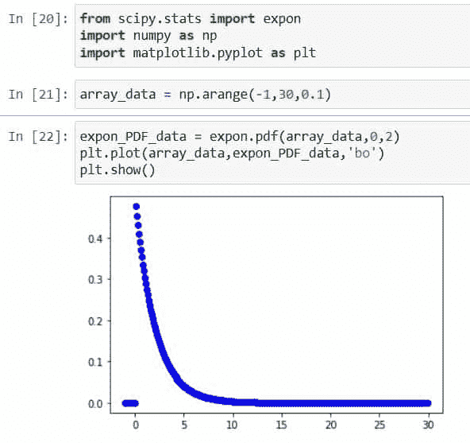
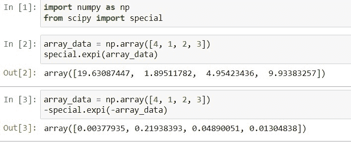
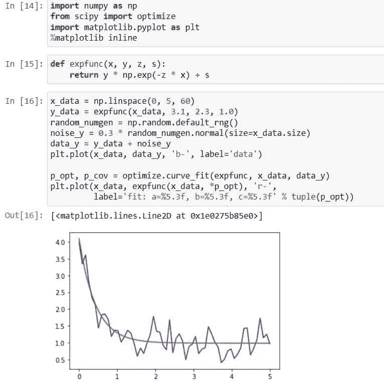
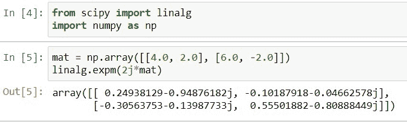
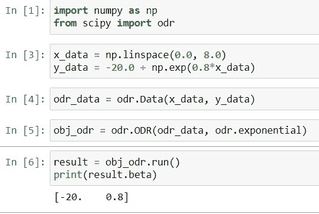
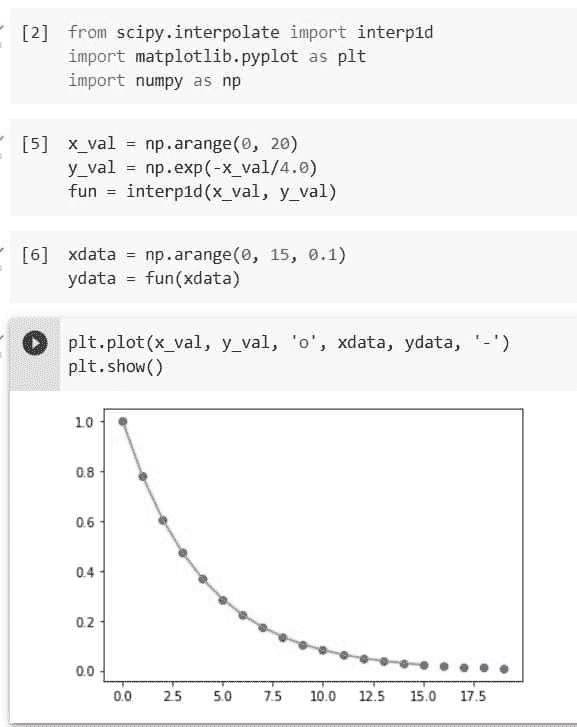

# Python Scipy 指数–有用的教程

> 原文：<https://pythonguides.com/python-scipy-exponential/>

[](https://sharepointsky.teachable.com/p/python-and-machine-learning-training-course)

在本 [Python 教程](https://pythonguides.com/learn-python/)中，我们将学习“ `Python Scipy Exponential` 的用法，并且我们将借助多个例子介绍它的用法。此外，我们将涵盖以下主题。

*   Python Scipy 指数
*   Python Scipy 指数积分
*   Python Scipy 指数曲线拟合
*   Python Scipy 指数矩阵
*   Python 科学指数回归
*   Python 科学指数插值

还有，查看最新的相关 Python 教程: [Python Scipy Kdtree](https://pythonguides.com/python-scipy-kdtree/)

目录

[](#)

*   [Python Scipy 指数](#Python_Scipy_Exponential "Python Scipy Exponential")
*   [Python Scipy 指数积分](#Python_Scipy_Exponential_Integral "Python Scipy Exponential Integral")
*   [Python Scipy 指数曲线拟合](#Python_Scipy_Exponential_Curve_Fit "Python Scipy Exponential Curve Fit")
*   [Python Scipy 指数矩阵](#Python_Scipy_Exponential_Matrix "Python Scipy Exponential Matrix")
*   [Python Scipy 指数回归](#Python_Scipy_Exponential_Regression "Python Scipy Exponential Regression")
*   [Python Scipy 指数插值](#Python_Scipy_Exponential_Interpolation "Python Scipy Exponential Interpolation")

## Python Scipy 指数

`*`scipy.stats.expon`*`代表连续的随机变量。它有不同种类的指数分布函数，如 CDF、PDF、中位数等。

它有两个重要的参数`*`loc`*`用于表示平均值和`*`scale`*`用于表示标准差，因为我们知道我们使用这些参数来控制分布的形状和位置。

下面给出了语法。

```py
scipy.stats.expon.method_name(x,q,loc,scale,size)
```

其中参数为:

*   ***x(数组 _ 数据的浮点或浮点):*** 用于指定随机变量。
*   ***q(float 或 float of array_data):*** 表示概率。
*   ***loc:*** 用于指定平均值，默认为 0。
*   ***标度*** :用于指定标准差，默认为 1。
*   ***尺寸:*** 它用来指定输出形状。

以上参数是对象`*`scipy.stats.expon()`*`中所有方法的公共参数。下面给出了方法。

*   ***scipy . stats . expon . CDF():***用于累计分布函数。
*   ***scipy . stats . expon . pdf():***它用于概率密度函数。
*   ***scipy . stats . expon . RVs():***获取随机变量。
*   ***scipy . stats . expon . stats():***用于获取标准差、均值、峰度、偏斜度。
*   ***scipy . stats . expon . log pdf():***用于获取概率密度函数相关的日志。
*   ***scipy . stats . expon . log CDF():***用于查找与累积分布函数相关的日志。
*   `***``expon`****。sf():*** 用于获取生存函数值。
*   `***``expon`****。isf():*** 用于获取逆生存函数值。
*   `***``expon`****。logsf():*** 用于查找与生存函数相关的日志。
*   `***``expon`****。mean():*** 用于求正态分布相关的均值。
*   `***``expon`****。median():*** 用于求正态分布相关的中位数。
*   `***``expon`****。var():*** 用于求与分布相关的方差。
*   `***``expon`****。std():*** 用于求与分布相关的标准差

让我们通过使用上面提到的方法之一来举一个例子，以了解如何使用带参数的方法。

使用下面的代码导入所需的库。

```py
from scipy.stats import expon
import numpy as np
import matplotlib.pyplot as plt
```

使用下面的代码创建一个包含 30 个值的数组。

```py
array_data = np.arange(-1,30,0.1)
```

现在使用下面的代码通过访问模块`*`scipy.stats`*`的对象`*`expon`*`的方法`*`PDF()`*`来绘制概率密度函数。

```py
expon_PDF_data = expon.pdf(array_data,0,2)
plt.plot(array_data,expon_PDF_data,'bo')
plt.show()
```



Scipy Exponential

这就是如何使用 Python SciPy 的方法`*`expon()`*`。

阅读:[科学发现高峰](https://pythonguides.com/scipy-find-peaks/)

## Python Scipy 指数积分

[Python Scipy](https://pythonguides.com/what-is-scipy-in-python/) 包含模块`*`scipy.special`*`中的方法`*`expi()`*`，用于指数积分。指数积分 *`Ei`* 是数学中复平面上的特定函数。它被定义为指数函数与其输入之比的一个定积分。

下面给出了语法。

```py
scipy.special.expi(x, out=None)
```

其中参数为:

*   ***x(array_data):*** 为实值或复值自变量。
*   ***out(ndarray):*** 对于函数结果，有一个可选的输出数组。

方法`*`expi()`*`返回 ndarray 或标量。

让我们以下面的步骤为例:

使用下面的 python 代码导入所需的库。

```py
import numpy as np
from scipy import special
```

创建一个数组，并将该数组传递给方法`*`expi()`*`进行指数积分，如下面的代码所示。

```py
array_data = np.array([4, 1, 2, 3])
special.expi(array_data)
```

再次使用下面的代码提供负数组。

```py
array_data = np.array([4, 1, 2, 3])
-special.expi(-array_data)
```



Python Scipy Exponential Integral

这就是如何使用 Python SciPy 的方法`*`expi()`*`进行指数积分。

阅读: [Python Scipy 特辑](https://pythonguides.com/python-scipy-special/)

## Python Scipy 指数曲线拟合

Python SciPy 在模块`scipy.optimize`中有一个方法`*`curve_fit()`*`，它使用非线性最小二乘法将函数拟合到数据。因此，在本节中，我们将创建一个指数函数，并将该函数传递给方法 *`curve_fit()`* ，以拟合生成的数据。

下面给出了语法。

```py
scipy.optimize.curve_fit(f, xdata, ydata, sigma=None, p0=None, absolute_sigma=True, bounds=(- inf, inf), check_finite=True, jac=None, method=None)
```

其中参数为:

*   ***f(可调用):*** 模型函数用 f(x，…)表示第一个输入必须是自变量，后面的自变量必须是要拟合的参数。
*   ***xdata(array _ data):***自变量用于比较数据。
*   ***ydata(array _ data):***依赖数据为 M 维数组。
*   ***p0(array_data):*** 为参数，这是第一次猜测。如果没有指定，所有的初始值都将是 1。
*   ***∑(M * M 数组):*** 这种做法决定了 ydata 中的不可预测性。当我们使用公式 r = y data–f(xdata，*popt)来计算残差时，我们得到 r = y data–f(xdata，*popt)。
*   ***absolute_sigma(布尔):*** 如果为真，则在严格意义上使用 sigma，并且生成参数协方差 pcov 来反映这些严格值。
*   ***check _ finite(boolean):***如果为真，检查输入数组中是否有 INF 的 nan，如果存在则抛出 ValueError。
*   ***边界(tuple array_data):*** 参数的上下边界默认不提供。元组的成员必须是数组或标量，其长度与参数的数量相同。
*   ***方法:*** 优化方法运用。有关更多信息，请参见最小二乘法。如果提供了边界，对于无约束问题，默认为“trf ”,对于约束问题，默认为“lm”。如果观察值的数量少于变量的数量，方法“lm”将不起作用；而是使用“dogbox”或“trf”。
*   ***jac(string，callable，none):*** 模型函数关于参数的雅可比矩阵生成为密集的类数组结构，签名为 jac(x，…)。提供的西格玛将用于衡量它。

让我们以下面的步骤为例:

使用下面的 python 代码导入所需的库。

```py
import numpy as np
from scipy import optimize
import matplotlib.pyplot as plt
%matplotlib inline
```

使用下面的代码定义一个指数函数。

```py
def expfunc(x, y, z, s):
    return y * np.exp(-z * x) + s
```

定义数据，使其能够适应噪声和函数`*`expfunc`*` 参数，并使用以下代码将优化限制在特定区域。

```py
x_data = np.linspace(0, 5, 60)
y_data = expfunc(x_data, 3.1, 2.3, 1.0)
random_numgen = np.random.default_rng()
noise_y = 0.3 * random_numgen.normal(size=x_data.size)
data_y = y_data + noise_y
plt.plot(x_data, data_y, 'b-', label='data')

p_opt, p_cov = optimize.curve_fit(expfunc, x_data, data_y)
plt.plot(x_data, expfunc(x_data, *p_opt), 'r-',
         label='fit: a=%5.3f, b=%5.3f, c=%5.3f' % tuple(p_opt))
```



Python Scipy Exponential Curve Fit

这就是如何使用 Python SciPy 的方法`*`curve_fit()`*`。

阅读: [Python Scipy Matrix +示例](https://pythonguides.com/python-scipy-matrix/)

## Python Scipy 指数矩阵

Python SciPy 模块`*`scipy.linalg`*`包含一个方法`*`expm()`*` ，该方法使用 Pade 近似来计算矩阵指数。

下面给出了语法。

```py
scipy.linalg.expm(A)
```

其中参数 *`A`* 接受数组类型的矩阵。

方法`*`expm()`*`返回 ndarray 类型的矩阵 A 的指数。

让我们以下面的步骤为例:

使用下面的 python 代码导入所需的库。

```py
from scipy import linalg
import numpy as np
```

创建一个矩阵，并使用下面的代码计算该矩阵的指数。

```py
mat = np.array([[4.0, 2.0], [6.0, -2.0]])
linalg.expm(2j*mat)
```



Python Scipy Exponential Matrix

这就是如何使用 Python，SciPy 的方法`*`expm()`*`计算矩阵指数。

阅读: [Scipy 正态分布](https://pythonguides.com/scipy-normal-distribution/)

## Python Scipy 指数回归

指数模型可用于计算正交距离回归。Python SciPy 在模块`*`scipy.odr`*`中有一个方法`*`exponential()`*`用于此目的。

下面给出了语法。

```py
scipy.odr.exponential = <scipy.odr._models._ExponentialModel object>
```

上面的方法不接受任何参数，我们可以直接用数据。

让我们以下面的步骤为例:

使用下面的 python 代码导入所需的库。

```py
import numpy as np
from scipy import odr
```

使用下面的代码生成 x 和 y 数据。

```py
x_data = np.linspace(0.0, 8.0)
y_data = -20.0 + np.exp(0.8*x_data)
```

使用 SciPy 的方法`*`odr()`*`拟合数据。

```py
odr_data = odr.Data(x_data, y_data)
```

现在将指数模型`*`odr.exponential`*`和数据传递给方法`*`ODR()`*`，使用下面的代码创建 odr 对象。

```py
obj_odr = odr.ODR(odr_data, odr.exponential)
```

使用下面的代码执行上面创建的对象的回归方法。

```py
result = obj_odr.run()
print(result.beta)
```



Python Scipy Exponential Regression

这就是如何对指数模型使用 Python SciPy 的方法`*`odr()`*`计算正交距离回归。

阅读: [Scipy Ndimage Rotate](https://pythonguides.com/scipy-ndimage-rotate/)

## Python Scipy 指数插值

Python SciPy 包含一个方法`*`interp1d()`*`,该方法采用值 x 和 y 的数组来逼近函数 f: y = f (x)。这里我们将把指数函数或值传递给方法`interp1d()`。

下面给出了语法。

```py
scipy.interpolate.interp1d(x, y, axis=- 1, kind='linear', copy=True, fill_value=nan, bounds_error=None, assume_sorted=False)
```

其中参数为:

*   ***x(array_data):*** 实数值的一维数组。
*   ***y(array_data):*** 一个实值 N-D 数组。沿着插值轴，y 的长度必须等于 x 的长度。
*   ***轴(int):*** 沿指定的 y 轴插补。y 的最后一个轴用于插值。
*   kind(int，str):以字符串或整数的形式，指定要使用的插值类型以及要应用的样条插值器的顺序。
*   copy(boolean):如果为 True，则该类在内部复制 x 和 y。如果为 False，则使用 x 和 y 参考。复制是默认设置。
*   fill_value(array_data):如果该值是一个 n array(或 float)，则该值将用于填充数据范围之外的所需点。如果没有指定值，NaN 将用作默认值。类数组必须正确传播到非插值轴的维度。
*   ***bounds _ error(boolean):***如果为 True，则每次对 x 范围之外的值进行插值时，都会引发 ValueError。如果为 False，填充值将分配给越界值。除非指定 fill value="extrapolate ",否则默认情况下会引发错误。
*   ***assume _ sorted(boolean):***如果为 False，则 x 值可以是任意顺序，且先排序。如果为 True，x 必须是单调递增的值的数组。

让我们以下面的步骤为例:

使用下面的 python 代码导入所需的库。

```py
from scipy.interpolate import interp1d
import matplotlib.pyplot as plt
import numpy as np
```

生成 x 和 y 值，并使用下面的代码将这两个值传递给方法`interp1d()`。

```py
x_val = np.arange(0, 20)
y_val = np.exp(-x_val/4.0)
fun = interp1d(x_val, y_val)
```

使用以下代码创建新的 xdata 和 ydata 值。

```py
xdata = np.arange(0, 15, 0.1)
ydata = fun(xdata)
```

使用以下代码绘制上述数据。

```py
plt.plot(x_val, y_val, 'o', xdata, ydata, '-')
plt.show()
```



Python Scipy Exponential Interpolation

这就是如何使用 Python SciPy 的方法`*`interp1d()`*`来生成指数值。

另外，看看更多的 Python SciPy 教程。

*   [Python Scipy Freqz](https://pythonguides.com/python-scipy-freqz/)
*   [Scipy Convolve–完整指南](https://pythonguides.com/scipy-convolve/)
*   [Python Scipy 置信区间](https://pythonguides.com/scipy-confidence-interval/)
*   [敏感信号——有用教程](https://pythonguides.com/scipy-signal/)
*   [Scipy Integrate +示例](https://pythonguides.com/scipy-integrate/)
*   [Python Scipy 卡方检验](https://pythonguides.com/python-scipy-chi-square-test/)

因此，在本教程中，我们已经了解了" **Python SciPy 指数**"并涵盖了以下主题。

*   Python Scipy 指数
*   Python Scipy 指数积分
*   Python Scipy 指数曲线拟合
*   Python Scipy 指数矩阵
*   Python 科学指数回归
*   Python 科学指数插值

[Bijay Kumar](https://pythonguides.com/author/fewlines4biju/)

Python 是美国最流行的语言之一。我从事 Python 工作已经有很长时间了，我在与 Tkinter、Pandas、NumPy、Turtle、Django、Matplotlib、Tensorflow、Scipy、Scikit-Learn 等各种库合作方面拥有专业知识。我有与美国、加拿大、英国、澳大利亚、新西兰等国家的各种客户合作的经验。查看我的个人资料。

[enjoysharepoint.com/](https://enjoysharepoint.com/)[](https://www.facebook.com/fewlines4biju "Facebook")[](https://www.linkedin.com/in/fewlines4biju/ "Linkedin")[](https://twitter.com/fewlines4biju "Twitter")