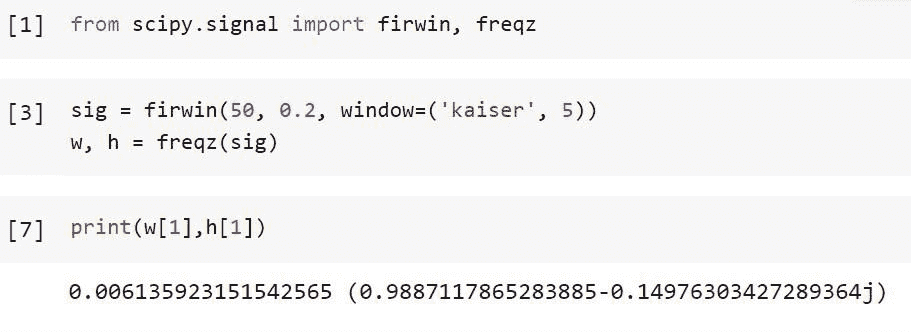
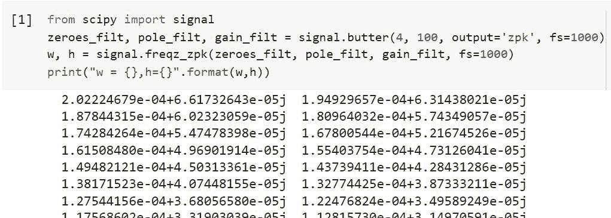
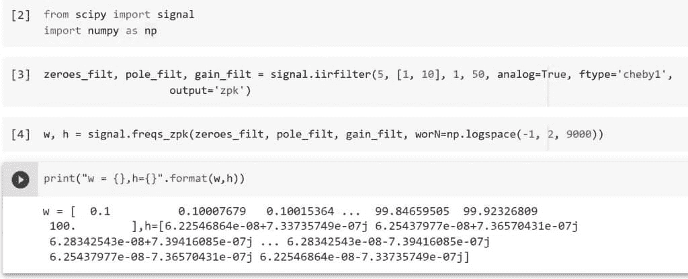
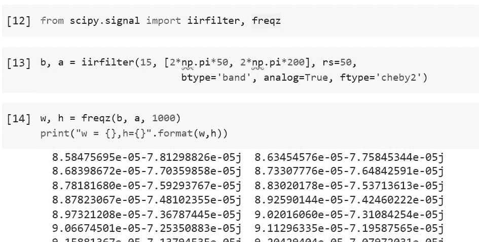
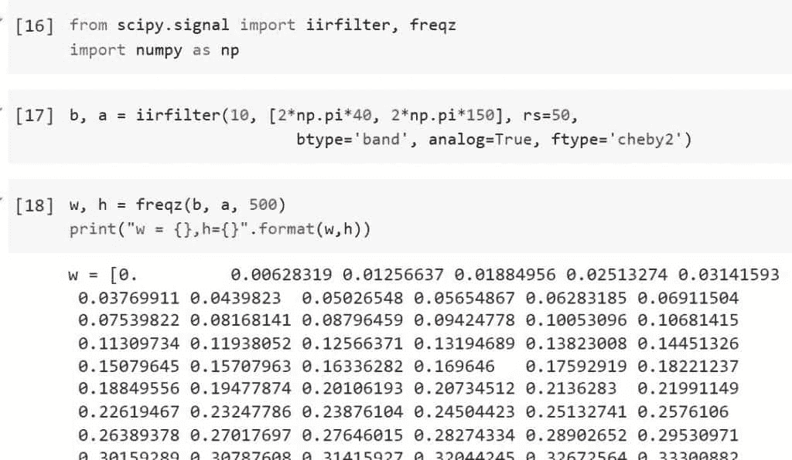

# python Scipy Freqz[有 7 个惊人的例子]

> 原文：<https://pythonguides.com/python-scipy-freqz/>

[](https://sharepointsky.teachable.com/p/python-and-machine-learning-training-course)

在本 [Python 教程](https://pythonguides.com/learn-python/)中，我们将学习“ `*Python Scipy Freqz*` ”，它通常用于处理模拟和数字频率。现在，为了理解“ `*Python Scipy Freqz*` ”的用法，我们将结合各种例子来讨论以下主题。

*   Python Scipy Freqz
*   Python Scipy Freqz Sos
*   Python Scipy Freqz Freqs
*   Python Scipy 信号 Freqz Zpk
*   Python Scipy 信号 Freqs Zpk
*   Python Scipy IIR 滤波器频率
*   Python Scipy 示例

目录

[](#)

*   [Python Scipy Freqz](#Python_Scipy_Freqz "Python Scipy Freqz")
*   [Python Scipy Freqz Sos](#Python_Scipy_Freqz_Sos "Python Scipy Freqz Sos")
*   [Python Scipy Freqz Freqs](#Python_Scipy_Freqz_Freqs "Python Scipy Freqz Freqs")
*   [Python Scipy 信号 Freqz Zpk](#Python_Scipy_Signal_Freqz_Zpk "Python Scipy Signal Freqz Zpk")
*   [Python Scipy 信号频率 Zpk](#Python_Scipy_Signal_Freqs_Zpk "Python Scipy Signal Freqs Zpk")
*   [Python Scipy IIR 滤波器频率](#Python_Scipy_IIR_Filter_Freqz "Python Scipy IIR Filter Freqz")
*   [Python Scipy Freqz 示例](#Python_Scipy_Freqz_Example "Python Scipy Freqz Example")

## Python Scipy Freqz

为了计算数字滤波器的频率响应，Python Scipy 在模块`*`scipy.signal`*`中有一个方法 *`freqz()`* 。通过计算 M 阶分子 b 和 N 阶分母 a 来确定数字滤波器的频率响应。

下面给出了语法。

```py
scipy.signal.freqz(b, a=1, whole=False, worN=512, plot=None, include_nyquist=False, fs=6.28318530717958)
```

其中参数为:

*   **b(array_data):** 如果 b 的维数大于 1，则线性滤波器的分子 B.shape[1:]、a.shap[1:]和频率阵列的形状都必须兼容于广播，这被认为是这种情况。
*   **a(array_data):** 滤波器的线性分母如果 b 的维数大于 1，则假设系数保持在第一维度，并且 b.shape[1:]、a.shape[1:]和频率数组的形状必须都与广播一致。
*   **整数(布尔):**奈奎斯特频率 fs/2 是计算频率的标准范围(单位圆的上半部分)。如果整数为真，则从 0 到 fs 进行频率计算。如果穿的是数组状就忽略。
*   **wordN(int，array，None):** 如果只有一个整数(默认 N 值为 512)，则计算那么多频率。这是对“np.linspace()，fs if whole else fs/2，N，endpoint=include_nyquist”的一个实际替代。可以通过使用快速数进行 FFT 计算来加速计算。如果数据呈阵列状，计算指定频率下的响应。这些是以 fs 兼容单位测量的。
*   **plot:** 接受两个参数的函数调用。如果返回参数 w 和 h 存在，它们将被发送到 plot。有助于显示 freqz 内的频率响应。
*   **Include _ nyquist(boolean):**Include Nyquist 如果 entire 为 False，wear 为整数，将包含最近的频率(Nyquist 频率)；否则将被省略。
*   **fs(float):** 数字形式的系统采样率。默认为 2*pi 处的弧度/样本(因此 w 是从 0 到 pi)。

方法`freqz()`返回 ***`w`(计算 h 的频率，用 fs 兼容单位表示。w 通常归一化为 0，pi 范围)*** 和 ***`h`(代表频率响应的复数)***ndarray 类型。

让我们以下面的步骤为例:

导入所需的库，并使用以下代码计算数字滤波器的频率响应。

```py
from scipy.signal import firwin, freqz
sig = firwin(50, 0.2, window=('kaiser', 5))
w, h = freqz(sig)

print(w[1],h[1])
```



Python Scipy Freqz

这就是如何使用 Python Scipy 的方法`*`freqz()`*`计算数字滤波器的频率响应。

另外，检查: [Python Scipy 距离矩阵](https://pythonguides.com/scipy-distance-matrix/)

## Python Scipy Freqz Sos

以 SOS 格式计算数字滤波器的频率响应。Python Scipy 模块`*`scipy.signal`*`有一个方法`*`sosfreqz()`*`。

下面给出了语法。

```py
scipy.signal.sosfreqz(sos, whole=False, worN=512, fs=6.283185307179586)
```

其中参数为:

*   **sos(array_data):** 需要一个形状为(n 段，6)的二阶滤波器系数数组。前三列给出分子系数，后三列给出分母系数，每行代表一个二阶部分。
*   **整数(布尔):**奈奎斯特频率 fs/2 是计算频率的标准范围(单位圆的上半部分)。如果整数为真，则从 0 到 fs 进行频率计算。如果穿的是数组状就忽略。
*   **wordN(int，array，None):** 如果只有一个整数(默认 N 值为 512)，则计算那么多频率。这是对“np.linspace(0，fs if whole else fs/2，N，endpoint=include_nyquist)”的实际替代。可以通过使用快速数进行 FFT 计算来加速计算。如果数据呈阵列状，计算指定频率下的响应。这些是以 fs 兼容单位测量的。
*   **fs(float):** 数字形式的系统采样率。默认为 2*pi 处的弧度/样本(因此 w 是从 0 到 pi)。

让我们以下面的步骤为例:

使用下面的 python 代码导入所需的库。

```py
from scipy.signal import ellip, sosfreqz
```

使用下面的代码创建一个 SOS 格式的 20 阶带通滤波器。

```py
sos_format = ellip(20, 0.4, 70, (0.3, 0.5), btype='bandpass',
                   output='sos')
```

使用以下代码计算 2000 点时 DC 和奈奎斯特频率之间的频率响应。

```py
w, h = sosfreqz(sos_format, worN=2000)
print("w = {},h={}".format(w,h)) 
```


Python Scipy Freqz Sos

这就是如何使用 Python Scipy 的方法`*`sosfreqz()`*`计算 SOS 格式的数字滤波器频率响应。

阅读: [Python Scipy 指数](https://pythonguides.com/python-scipy-exponential/)

## Python Scipy Freqz Freqs

为了计算模拟滤波器的频率响应，Python Scipy 在模块`*`scipy.signal`*`中包含了一个方法`*`freqs()`*`。

下面给出了语法。

```py
scipy.signal.freqs(b, a, worN=200, plot=None)
```

其中参数为:

*   **b(array_data):** a 线性滤波器的分子 b。
*   **a(array_data):** 滤波器的线性分母。
*   **wordN(int，array，None):** 如果没有，则在感兴趣的响应曲线区域(由零极点位置决定)周围以 200 Hz 进行计算。如果它是一个单一的整数，计算它的迭代次数。在任何其他情况下，使用磨损提供的角频率(如 rad/s)计算响应。
*   **plot:** 接受两个参数的函数调用。如果返回参数 w 和 h 存在，它们将被发送到 plot。有助于显示 freqs 内的频率响应。

阅读: [Python Scipy 卡方测试](https://pythonguides.com/python-scipy-chi-square-test/)

## Python Scipy 信号 Freqz Zpk

Python Scipy 在模块`*`scipy.signal`*`中有一个方法`*`freqz_zpk()`*`，用于计算数字滤波器频率响应的 ZPK 形式。

下面给出了语法。

```py
scipy.signal.freqz_zpk(z, p, k, worN=512, whole=False, fs=6.283185307179586)
```

其中参数为:

*   **z(array_data):** 线性过滤 0。
*   **p(array_data):** 线性滤波器的极点。
*   **k(标量):**线性滤波器的增益
*   **整数(布尔):**奈奎斯特频率 fs/2 是计算频率的标准范围(单位圆的上半部分)。如果整数为真，则从 0 到 fs 进行频率计算。如果穿的是数组状就忽略。
*   **wordN(int，array，None):** 如果只有一个整数(默认 N 值为 512)，则计算那么多频率。这是对“np.linspace(0，fs if whole else fs/2，N，endpoint=include_nyquist)”的实际替代。可以通过使用快速数进行 FFT 计算来加速计算。如果数据呈阵列状，计算指定频率下的响应。这些是以 fs 兼容单位测量的。
*   **fs(float):** 数字形式的系统采样率。默认为 2*pi 处的弧度/样本(因此 w 是从 0 到 pi)。

方法`freqz_zpk()`返回 ***`w`(计算 h 的频率，用 fs 兼容单位表示。w 通常归一化为 0，pi 范围)*** 和 ***`h`(代表频率响应的复数)***ndarray 类型。

举个例子，用下面的代码创建一个 1000 Hz 采样速率系统和一个截止频率为 100 Hz 的 4 阶数字巴特沃兹滤波器。

```py
from scipy import signal
zeroes_filt, pole_filt, gain_filt = signal.butter(4, 100, output='zpk', fs=1000)
w, h = signal.freqz_zpk(zeroes_filt, pole_filt, gain_filt, fs=1000)
print("w = {},h={}".format(w,h))
```



Python Scipy Signal Freqz Zpk

这就是如何使用 Python Scipy 的方法`*`freqz_zpk()`*`计算数字滤波器频率响应的 ZPK 形式。

阅读: [Python Scipy FFT](https://pythonguides.com/python-scipy-fft/)

## Python Scipy 信号频率 Zpk

Python Scipy 在模块``scipy.signal``中有一个方法``freqs_zpk()``，用于计算模拟滤波器的频率响应。

下面给出了语法。

```py
scipy.signal.freqz_zpk(z, p, k, worN=200)
```

其中参数为:

*   **z(array_data):** 线性过滤 0。
*   **p(array_data):** 线性滤波器的极点。
*   **k(标量):**线性滤波器的增益
*   **wordN(int，array，None):** 如果没有，则在感兴趣的响应曲线区域(由零极点位置决定)周围以 200 Hz 进行计算。如果它是一个单一的整数，计算它的迭代次数。在任何其他情况下，使用磨损提供的角频率(如 rad/s)计算响应。

方法``freqs_zpk()``返回 ***`w`(用于计算 h 的角频率)*** 和 ***`h`(对频率的响应。)【ndarray 类型的***。

让我们以下面的步骤为例:

使用下面的 python 代码导入所需的库。

```py
from scipy import signal
import numpy as np
```

创建一个 5 阶模拟滤波器，然后使用以下代码提供滤波器系数。

```py
zeroes_filt, pole_filt, gain_filt = signal.iirfilter(5, [1, 10], 1, 50, analog=True, ftype='cheby1',
                    output='zpk')
w, h = signal.freqs_zpk(zeroes_filt, pole_filt, gain_filt, worN=np.logspace(-1, 2, 9000))
```

使用下面的代码检查方法`*`freqs_zpk()`*`返回的结果。

```py
print("w = {},h={}".format(w,h))
```



Python Scipy Signal Freqs Zpk

这就是如何使用 Python Scipy 的方法`*`freqs_zpk()`*`来计算模拟滤波器的频率响应。

阅读:[Scipy Linalg–实用指南](https://pythonguides.com/scipy-linalg/)

## Python Scipy IIR 滤波器频率

我们已经在上一小节中了解了方法`*`freqz()`*`，这里我们将使用方法***【IIR filter()***设计滤波器，并将由此得到的结果转化为方法 ***`freqz()`*** 来计算数字滤波器的频率响应。

让我们以下面的步骤为例:

使用下面的 python 代码导入所需的库。

```py
import numpy as np
from scipy.signal import iirfilter, freqz
```

使用以下代码创建一个 50Hz–200Hz 的 15 阶切比雪夫 II 模拟带通滤波器。

```py
b, a = iirfilter(15, [2*np.pi*50, 2*np.pi*200], rs=50,
                        btype='band', analog=True, ftype='cheby2')
```

现在使用下面的代码计算数字滤波器的频率响应。

```py
w, h = freqz(b, a, 1000)
print("w = {},h={}".format(w,h))
```



Python Scipy IIR Filter Freqz

这就是如何通过 Python Scipy 的方法`*`freqz()`*`使用`*`iirfilter()`*`结果来计算数字滤波器的频率响应。

阅读:[Scipy Stats Zscore+Examples](https://pythonguides.com/scipy-stats-zscore/)

## Python Scipy Freqz 示例

我们已经知道了 Python Scipy 的方法`*`freqz()`*`。在本节中，我们将再举一个与数字滤波器频率响应相关的例子。

让我们以下面的步骤为例:

使用下面的 python 代码导入所需的库。

```py
from scipy.signal import iirfilter, freqz
import numpy as np
```

使用以下代码创建一个 40Hz–150Hz 10 阶切比雪夫 II 模拟带通滤波器。

```py
b, a = iirfilter(15, [2*np.pi*50, 2*np.pi*200], rs=50,
                        btype='band', analog=True, ftype='cheby2')
```

现在使用下面的代码计算数字滤波器的频率响应。

```py
w, h = freqz(b, a, 1000)
print("w = {},h={}".format(w,h))
```



Python Scipy Freqz Example

另外，看看更多的 Python Scipy 教程。

*   [敏感信号——有用教程](https://pythonguides.com/scipy-signal/)
*   [Python Scipy Mann Whitneyu](https://pythonguides.com/python-scipy-mann-whitneyu/)
*   [Scipy Integrate +示例](https://pythonguides.com/scipy-integrate/)
*   [Scipy Stats–完整指南](https://pythonguides.com/scipy-stats/)
*   [Scipy Sparse–有用的教程](https://pythonguides.com/scipy-sparse/)
*   [Scipy 优化–实用指南](https://pythonguides.com/scipy-optimize/)
*   [Python Scipy Stats multivarial _ Normal](https://pythonguides.com/python-scipy-stats-multivariate_normal/)

因此，在本教程中，我们已经了解了“ `*Python Scipy Freqz*` ”并涵盖了以下主题。

*   Python Scipy Freqz
*   Python Scipy Freqz Sos
*   Python Scipy Freqz Freqs
*   Python Scipy 信号 Freqz Zpk
*   Python Scipy 信号 Freqs Zpk
*   Python Scipy IIR 滤波器频率
*   Python Scipy 示例

[Bijay Kumar](https://pythonguides.com/author/fewlines4biju/)

Python 是美国最流行的语言之一。我从事 Python 工作已经有很长时间了，我在与 Tkinter、Pandas、NumPy、Turtle、Django、Matplotlib、Tensorflow、Scipy、Scikit-Learn 等各种库合作方面拥有专业知识。我有与美国、加拿大、英国、澳大利亚、新西兰等国家的各种客户合作的经验。查看我的个人资料。

[enjoysharepoint.com/](https://enjoysharepoint.com/)[](https://www.facebook.com/fewlines4biju "Facebook")[](https://www.linkedin.com/in/fewlines4biju/ "Linkedin")[](https://twitter.com/fewlines4biju "Twitter")