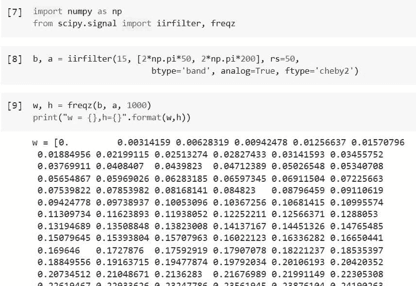
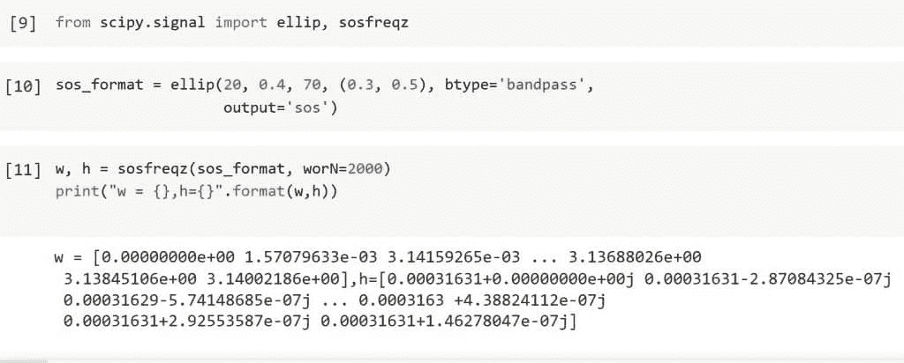
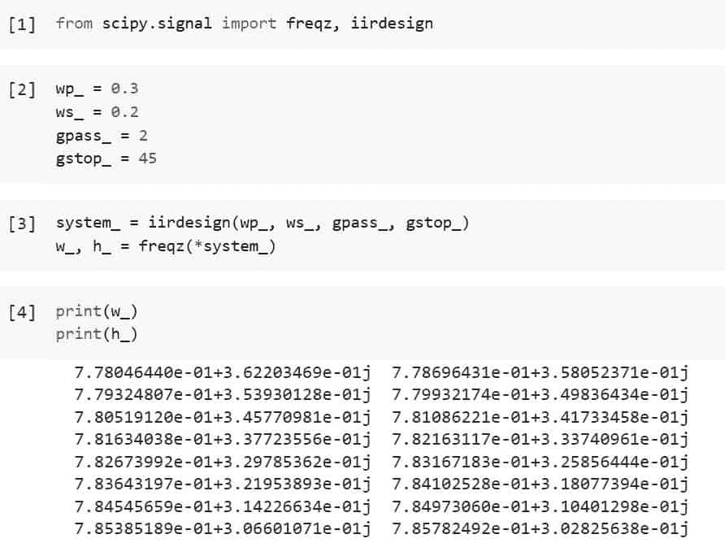
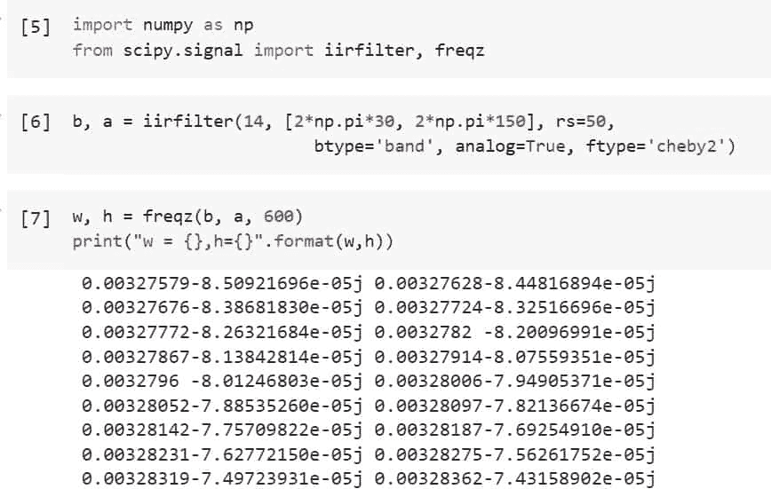
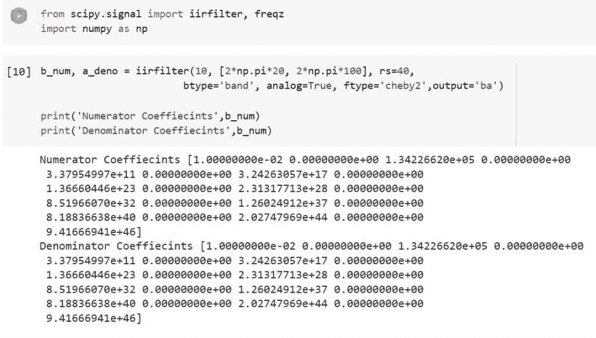
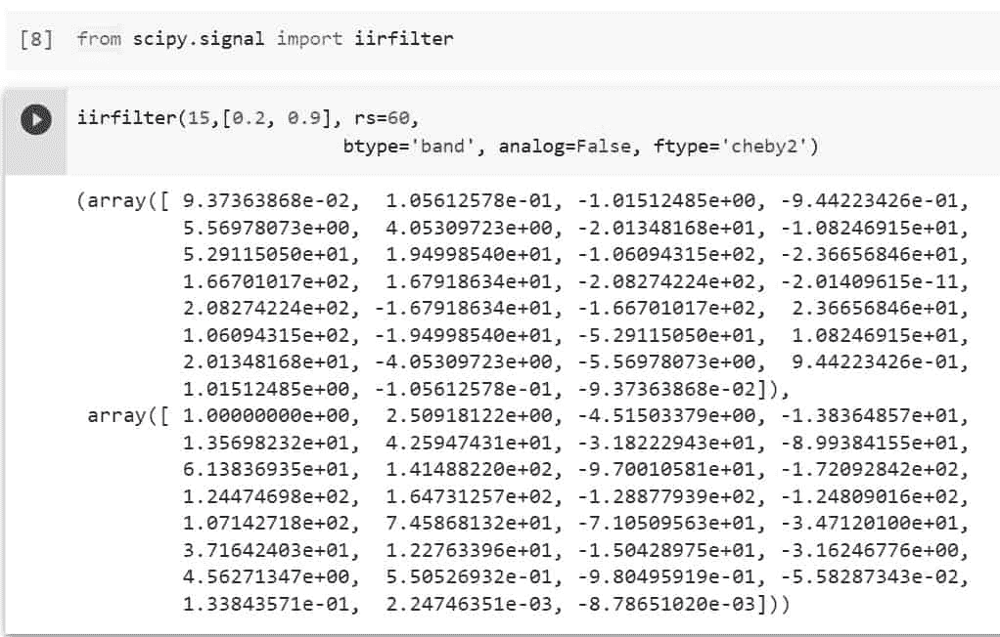

# Python Scipy IIR 滤波器+示例

> 原文：<https://pythonguides.com/python-scipy-iir-filter/>

[](https://sharepointsky.teachable.com/p/python-and-machine-learning-training-course)

在本教程中，我们将学习“***”Python Scipy IIR 滤波器*** ”，以便我们可以设计和创建各种阶数和赫兹的模拟和数字 IIR 滤波器。还包括以下主题。

*   什么是 IIR 滤波器？
*   Python Scipy IIR 滤波器设计
*   Python Scipy IIR 滤波器频率
*   Python Scipy IIR 滤波器 Sos
*   Python Scipy IIR 滤波器带通
*   Python Scipy IIR 滤波器系数
*   Python Scipy IIR 数字滤波器

另外，查看最新的 Python Scipy 教程: [Python Scipy Softmax](https://pythonguides.com/python-scipy-softmax/)

目录

[](#)

*   [什么是 IIR 滤波器？](#What_is_IIR_Filter "What is IIR Filter?")
*   [Python Scipy IIR 滤波器频率](#Python_Scipy_IIR_Filter_Freqz "Python Scipy IIR Filter Freqz")
*   [Python Scipy IIR 滤波器 Sos](#Python_Scipy_IIR_Filter_Sos "Python Scipy IIR Filter Sos")
*   [Python Scipy IIR 滤波器设计](#Python_Scipy_IIR_Filter_Design "Python Scipy IIR Filter Design")
*   [Python Scipy IIR 滤波器带通](#Python_Scipy_IIR_Filter_Bandpass "Python Scipy IIR Filter Bandpass")
*   [Python Scipy IIR 滤波器系数](#Python_Scipy_IIR_Filter_Coefficients "Python Scipy IIR Filter Coefficients")
*   [Python Scipy IIR 数字滤波器](#Python_Scipy_IIR_Filter_Digital "Python Scipy IIR Filter Digital")

## 什么是 IIR 滤波器？

数字信号处理(DSP)应用使用两种主要类型的数字滤波器之一，IIR 滤波器(另一种是 FIR)。无限脉冲响应被称为“IIR”。

由于滤波器中的反馈，脉冲响应是“无限的”，这意味着如果您应用一个脉冲(单个“1”样本后跟几个“0”样本)，您将获得无数个非零值。

与同等的 FIR 滤波器相比，IIR 滤波器使用更少的存储器和计算来实现给定的滤波特性。

## Python Scipy IIR 滤波器频率

在上部分中，我们了解了 IIR 滤波器的概念。在本节中，我们将使用该方法创建一个滤波器，然后通过`*`freqz()`*`函数使用输出来计算数字滤波器的频率响应。

让我们以下面的步骤为例:

使用下面的 python 代码导入所需的库。

```py
import numpy as np
from scipy.signal import iirfilter, freqz
```

使用以下代码创建一个 50Hz–200Hz 的 15 阶切比雪夫 II 模拟带通滤波器。

```py
b, a = iirfilter(15, [2*np.pi*50, 2*np.pi*200], rs=50,
                        btype='band', analog=True, ftype='cheby2')
```

现在使用下面的代码计算数字滤波器的频率响应。

```py
w, h = freqz(b, a, 1000)
print("w = {},h={}".format(w,h))
```



Python Scipy IIR Filter Freqz

从上面的输出中，我们可以取值并绘制出来，看看 IIR 滤波器是什么样子，这是如何使用 [Python Scipy](https://pythonguides.com/what-is-scipy-in-python/) 的方法`*`iirfilter()`*`创建 IIR 滤波器的。

阅读: [Python Scipy Stats Fit +示例](https://pythonguides.com/python-scipy-stats-fit/)

## Python Scipy IIR 滤波器 Sos

为了计算 sos 格式的数字滤波器频率响应或计算给定 SOS 下的系统功能频率响应，提供了一组形状为(n，6)的二阶数字滤波器部分。Python Scipy 模块`*`scipy.signal`*`有一个方法`*`sosfreqz()`*`。

下面给出了语法。

```py
scipy.signal.sosfreqz(sos, whole=False, worN=512, fs=6.283185307179586)
```

其中参数为:

*   **sos(array_data):** 需要一个形状为(n 段，6)的二阶滤波器系数数组。前三列给出分子系数，后三列给出分母系数，每行代表一个二阶部分。
*   **整数(布尔):**奈奎斯特频率 fs/2 是计算频率的标准范围(单位圆的上半部分)。如果整数为真，则从 0 到 fs 进行频率计算。如果穿的是数组状就忽略。
*   **wordN(int，array，None):** 如果只有一个整数(默认 N 值为 512)，则计算那么多频率。这是对“np.linspace(0，fs if whole else fs/2，N，endpoint=include_nyquist)”的实际替代。可以通过使用快速数进行 FFT 计算来加速计算。如果数据呈阵列状，计算指定频率下的响应。这些是以 fs 兼容单位测量的。
*   **fs(float):** 数字形式的系统采样率。默认为 2*pi 处的弧度/样本(因此 w 是从 0 到 pi)。

让我们以下面的步骤为例:

使用下面的 python 代码导入所需的库。

```py
from scipy.signal import ellip, sosfreqz
```

使用下面的代码创建一个 SOS 格式的 20 阶带通滤波器。

```py
sos_format = ellip(20, 0.4, 70, (0.3, 0.5), btype='bandpass',
                   output='sos')
```

使用以下代码计算 2000 点时 DC 和奈奎斯特频率之间的频率响应。

```py
w, h = sosfreqz(sos_format, worN=2000)
print("w = {},h={}".format(w,h)) 
```



Python Scipy Freqz Sos

这就是如何使用 Python Scipy 的方法`*`sosfreqz()`*`计算数字滤波器的频率响应。

阅读:[Python Scipy ttest _ ind–完整指南](https://pythonguides.com/python-scipy-ttest_ind/)

## Python Scipy IIR 滤波器设计

模块`*`scipy.signal`*`中 Python Scipy 的方法`*`iirdesign()`*`用于完成 IIR 数字和模拟滤波器的设计。

在给定通带和阻带频率和增益的情况下，它为指定的基本类型创建所需最小阶数的模拟或数字 IIR 滤波器。以分子、分母、零极点、二阶部分或零极点(' ba ')形式返回结果。

下面给出了语法。

```py
scipy.signal.iirdesign(wp, ws, gpass, gstop, analog=False, ftype='ellip', output='ba', fs=None)
```

其中参数为:

*   **wp，ws(float):** 阻带和通带的边缘频率。标量(对于低通和高通滤波器)或范围是潜在值(对于带通和带阻滤波器)。这些单位与数字滤波器的 fs 相同。样本归一化范围为 0 至 1，其中 1 为奈奎斯特频率，因为 fs 默认为每个样本 2 个半周期。
*   **gpass:** 通带最大值时的最大损耗(dB)。
*   **gstop:** 阻带的最小衰减(dB)。
*   **analog(boolean):** 如果为真，则返回模拟滤波器；否则，返回数字滤波器。
*   **ftype(str):** 要创建的 IIR 滤波器的种类:`*`cheby1`*`、`*`butter`*`、`*`cheby2`*`、`*`ellip`*`和`*`bessel`*`。
*   **输出:**输出滤波器形式:`'sos' for second-order sections`、`The default numerator and denominator is "ba"`、`Zero pole: "zpk"`。
*   **fs(float):** 数字形式的系统采样率。

让我们按照以下步骤来看一个例子:

使用下面的 python 代码导入所需的库或方法。

```py
from scipy.signal import freqz, iirdesign
```

使用下面的代码为方法`iirdesign()`的参数赋值。

```py
wp_ = 0.3
ws_ = 0.2
gpass_ = 2
gstop_ = 45
```

使用下面的代码创建 IIR 滤波器的设计。

```py
system_ = iirdesign(wp_, ws_, gpass_, gstop_)
w_, h_ = freqz(*system_)

print(w_)
print(h_)
```



Python Scipy IIR Filter Design

这就是如何使用 Python Scipy 的方法`*`iirdesign()`*`设计模拟和数字滤波器。

Read: [Python Scipy Mann Whitneyu](https://pythonguides.com/python-scipy-mann-whitneyu/)

## Python Scipy IIR 滤波器带通

带通滤波器是一种电子元件或电路，它可以区分其他频率的信号，同时允许两个指定频率之间的信号通过。

有源带通滤波器是使用需要外部电源的晶体管和集成电路等有源器件的带通滤波器。无源带通滤波器不需要外部电源，完全由电容和电感等无源器件构成。

Python Scipy 方法`iirfilter()`接受一个参数`btype`来指定过滤器的类型，如`lowpass`、`bandpass`、`bandstop`和`highpass`。

在本节中，我们将按照以下步骤创建带通信号类型的 IIR 滤波器:

使用下面的 python 代码导入所需的库。

```py
import numpy as np
from scipy.signal import iirfilter, freqz
```

使用下面的代码创建一个模拟 14 阶 30 Hz-150 Hz 带通滤波器。

```py
b, a = iirfilter(14, [2*np.pi*30, 2*np.pi*150], rs=50,
                        btype='band', analog=True, ftype='cheby2')
```

在上面的代码中，参数`btype`等于`band`，表示`bandpass`。

现在使用下面的代码来计算数字滤波器的频率响应。

```py
w, h = freqz(b, a, 600)
print("w = {},h={}".format(w,h))
```



Python Scipy IIR Filter Bandpass

这就是如何使用 Python Scipy 的方法`*`iirfilter()`*`和参数`*`btype`*`构建带通滤波器类型的 IIR 滤波器。

阅读: [Python Scipy Stats 泊松](https://pythonguides.com/python-scipy-stats-poisson/)

## Python Scipy IIR 滤波器系数

Python Scipy 方法`*`iirfilter()`*`接受一个参数`*`output`*`来返回不同类型的结果，比如对于二阶部分的`'sos'` ，默认的分子和分母是 `"ba"`和零极点: `"zpk"`。因此，在本节中，我们将通过指定`***output = 'ba'***`获得系数分子和分母的值作为输出。

差分方程的系数是滤波器系数。如果您的滤波器是 FIR 滤波器，脉冲响应值就是滤波器系数。如果使用 IIR 滤波器，滤波器系数和脉冲响应是不同的。

让我们按照以下步骤计算 IIR 滤波器的系数:

使用下面的 python 代码导入所需的库。

```py
from scipy.signal import iirfilter
import numpy as np
```

生成模拟 10 阶 20 Hz-100 Hz 带通滤波器。

```py
b_num, a_deno = iirfilter(10, [2*np.pi*20, 2*np.pi*100], rs=40,
                        btype='band', analog=True, ftype='cheby2',output='ba')

print('Numerator Coeffiecints',b_num)
print('Denominator Coeffiecints',b_num)
```

在上面的代码中，参数`output`等于`ba`，表示`numerator and denominator coeffiecints`。



Python Scipy IIR Filter Coefficients

这就是如何使用 Python Scipy 的参数`*`output`*`和方法`*`iirfilter()`*`计算 IIR 滤波器的系数。

阅读: [Python Scipy 特征值](https://pythonguides.com/python-scipy-eigenvalues/)

## Python Scipy IIR 数字滤波器

布尔类型的参数`*`analog`*`由方法`*`iirfilter()`*`接受，以指定我们想要创建哪种类型的 IIR 滤波器，如模拟或数字。该参数接受两个值真或假，真值用于模拟滤波器，否则数字滤波器为假值。

举个例子，按照以下步骤构建 IIR 模拟滤波器:

使用下面的 python 代码导入所需的库或方法。

```py
from scipy.signal import iirfilter
```

使用下面的代码创建一个数字 IIR 滤波器。

```py
iirfilter(15,[0.2, 0.9], rs=60,
                        btype='band', analog=False, ftype='cheby2')
```



Python Scipy IIR Filter Digital

在上面的代码中，我们指定`*`analog`*`等于 False，这意味着上面的输出是数字 IIR 滤波器的值。这就是如何使用 Python Scipy 的参数`*`analog`*`和方法`*`iirfilter()`*`创建一个数字 IIR 滤波器。

另外，看看更多的 Python SciPy 教程。

*   [Python Scipy Stats multivarial _ Normal](https://pythonguides.com/python-scipy-stats-multivariate_normal/)
*   [如何使用 Python Scipy Linprog](https://pythonguides.com/python-scipy-linprog/)
*   [Python Scipy Linalg Eigh](https://pythonguides.com/python-scipy-linalg-eigh/)
*   [Python Scipy 距离矩阵](https://pythonguides.com/scipy-distance-matrix/)
*   [Python Lil_Matrix Scipy](https://pythonguides.com/python-lil_matrix-scipy/)
*   [Python Scipy 特殊模块](https://pythonguides.com/python-scipy-special/)
*   [Python Scipy 置信区间](https://pythonguides.com/scipy-confidence-interval/)

因此，在本教程中，我们学习了“ ***Python Scipy IIR 滤波器*** ”并涵盖了以下主题。

*   什么是 IIR 滤波器？
*   Python Scipy IIR 滤波器设计
*   Python Scipy IIR 滤波器频率
*   Python Scipy IIR 滤波器 Sos
*   Python Scipy IIR 滤波器带通
*   Python Scipy IIR 滤波器系数
*   Python Scipy IIR 数字滤波器

[Bijay Kumar](https://pythonguides.com/author/fewlines4biju/)

Python 是美国最流行的语言之一。我从事 Python 工作已经有很长时间了，我在与 Tkinter、Pandas、NumPy、Turtle、Django、Matplotlib、Tensorflow、Scipy、Scikit-Learn 等各种库合作方面拥有专业知识。我有与美国、加拿大、英国、澳大利亚、新西兰等国家的各种客户合作的经验。查看我的个人资料。

[enjoysharepoint.com/](https://enjoysharepoint.com/)[](https://www.facebook.com/fewlines4biju "Facebook")[](https://www.linkedin.com/in/fewlines4biju/ "Linkedin")[](https://twitter.com/fewlines4biju "Twitter")