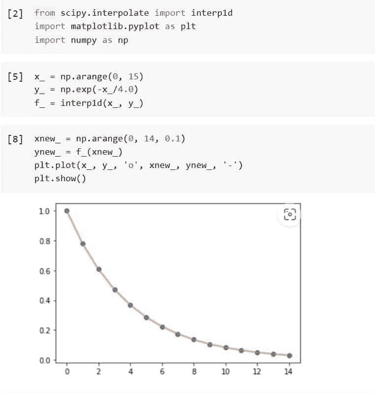
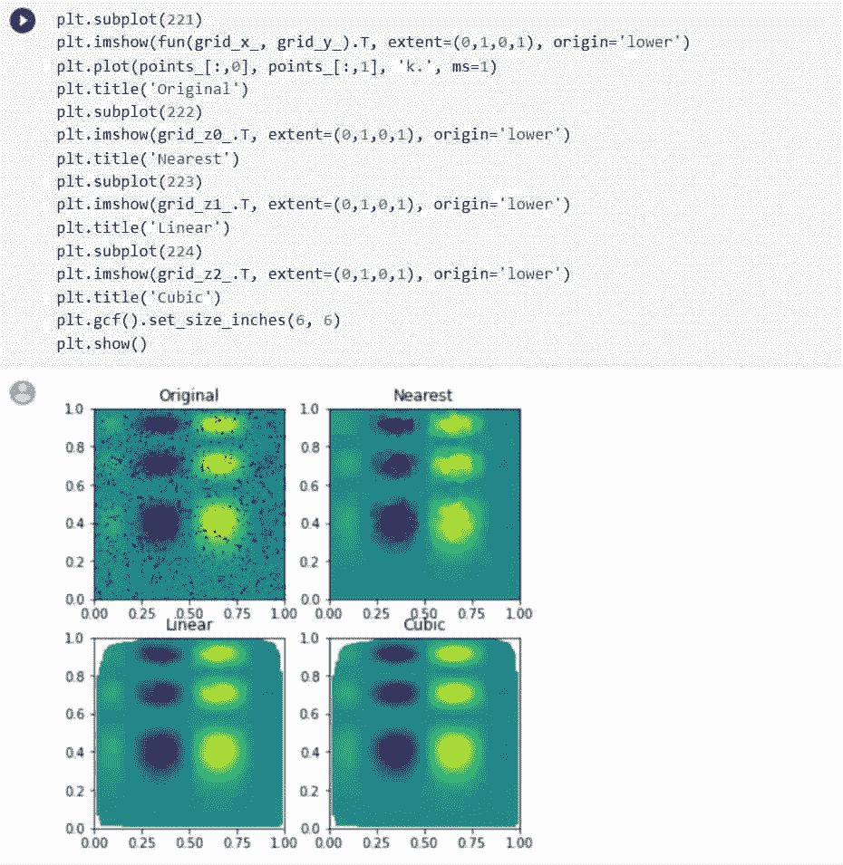
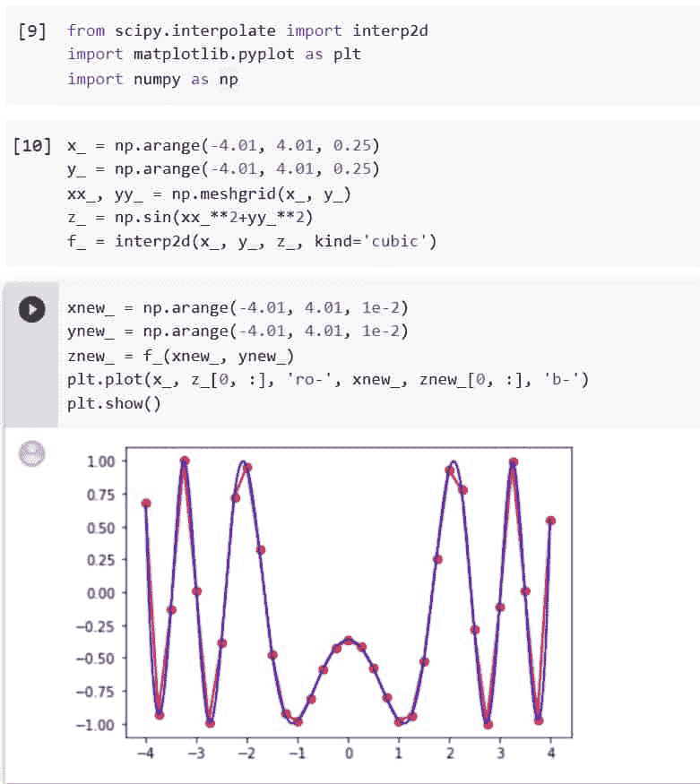
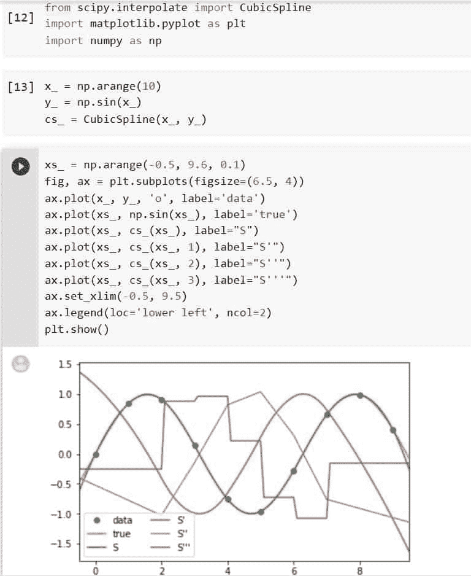
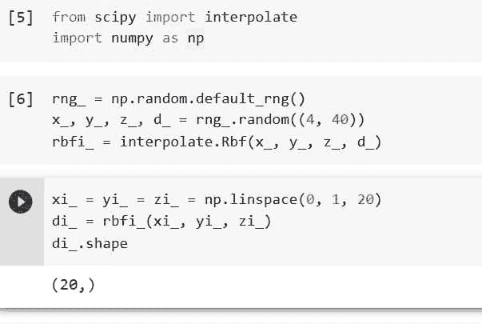
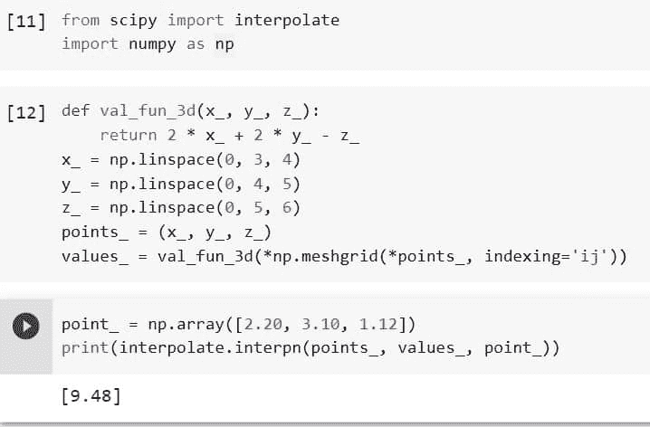
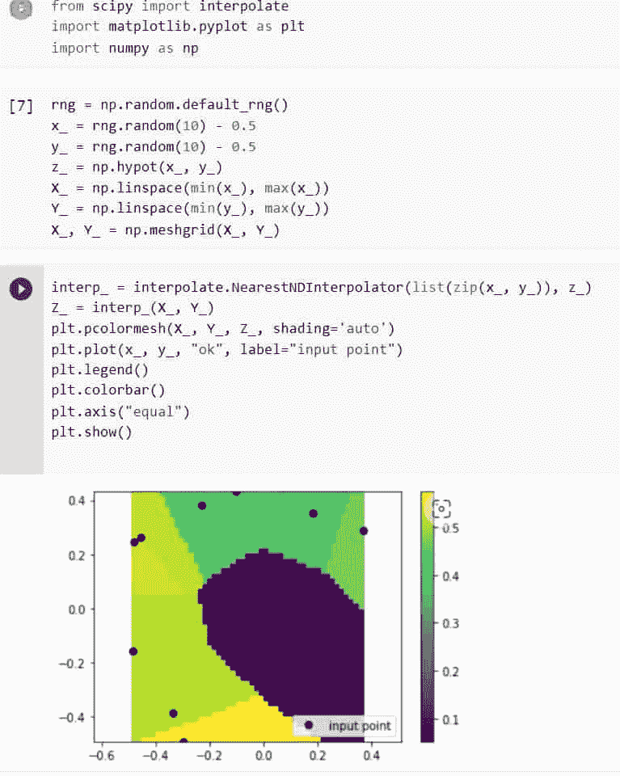

# Python Scipy 插值

> 原文：<https://pythonguides.com/python-scipy-interpolate/>

[](https://sharepointsky.teachable.com/p/python-and-machine-learning-training-course)

这篇 [Python Scipy 教程](https://pythonguides.com/what-is-scipy-in-python/)解释了， `Python Scipy Interpolate` 使用 interpn1d 等不同方法对一元、二元、三元和多维数据进行插值。我们还将涉及以下主题。

*   Python Scipy 插值 1d
*   如何在 Scipy 中内插 2d 数据
*   如何在 Python Scipy 中内插 griddata
*   Python Scipy 插值三次样条
*   如何使用径向基函数进行插值
*   python scipy 插值互操作
*   Python Scipy 插值最近

目录

[](#)

*   [Python Scipy 插值 1d](#Python_Scipy_Interpolate_1d "Python Scipy Interpolate 1d")
*   [Python Scipy 插值 Griddata](#Python_Scipy_Interpolate_Griddata "Python Scipy Interpolate Griddata")
*   [Python Scipy 插值 2d](#Python_Scipy_Interpolate_2d "Python Scipy Interpolate 2d")
*   [Python Scipy 插值三次样条](#Python_Scipy_Interpolate_Cubic_Spline "Python Scipy Interpolate Cubic Spline")
*   [Python Scipy 插值 RBF](#Python_Scipy_Interpolate_RBF "Python Scipy Interpolate RBF")
*   [Python Scipy interp n](#Python_Scipy_Interpolate_Interpn "Python Scipy Interpolate Interpn")
*   [Python Scipy 最近插值](#Python_Scipy_Interpolate_Nearest "Python Scipy Interpolate Nearest")

## Python Scipy 插值 1d

Python Scipy 在用于一维函数插值的模块`*`scipy.interpolate`*`中包含一个类`*`interp1d()`*`。

下面给出了语法。

```py
scipy.interpolate.interp1d(x, y, kind='linear', axis=- 1, copy=True, bounds_error=None, fill_value=nan, assume_sorted=False)
```

其中参数为:

*   **x(array_data):** 一个实值一维数组。
*   **y(array_data):** 一个实值 N-D 数组。沿插值轴的 y 的长度必须与 x 的长度相匹配。
*   **kind(int，string):** 指定字符串或整数形式的插值类型，以及要使用的样条插值器的顺序。字符串必须属于以下类别之一:线性、最近、最近向上、零、线性、二次、三次、上一个或下一个。术语“零”、“线性”、“二次”和“三次”表示零阶、一阶、二阶或三阶的样条插值；“上一个”、“下一个”和“最近的”只是返回该点的上一个或下一个值；插值半整数(如 0.5，1.5)时使用“最接近上”和“最接近下”，前者向上舍入，后者向下舍入。默认为线性。
*   **axis(int):** 指定将用于插值的 y 轴。y 的最终轴是插值的默认值。
*   **copy(boolean):** 如果为 True，则 x 和 y 由类内部复制。如果为假，则引用 x 和 y。复制是默认操作。
*   **bounds_error(boolean):** 如果为 true，则每次对 x 范围之外的值进行插值时，都会引发 ValueError(需要进行外推)。如果为 False，填充值将分配给越界值。除非指定 fill value="extrapolate ",否则默认情况下会引发错误。
*   **fill_value(array_data，extrapolate):** 如果为 true，则每次尝试对 x 范围之外的值进行插值时，都会引发 ValueError(在需要外推的情况下)。如果为 False，填充值将分配给越界值。除非指定 fill value="extrapolate ",否则默认情况下会引发错误。
*   **assume_sorted(boolean):** 如果为 False，则先对 x 的值进行排序，可以是任意顺序。如果为 True，x 必须是单调递增的值的数组。

让我们以下面的步骤为例:

使用下面的 python 代码导入所需的库或方法。

```py
from scipy.interpolate import interp1d
import matplotlib.pyplot as plt
import numpy as np
```

创建 x 和 y 数据，并将其传递给方法`*`interp1d()`*`以使用下面的代码返回函数。

```py
x_ = np.arange(0, 15)
y_ = np.exp(-x_/4.0)
f_ = interp1d(x_, y_)
```

使用下面的代码，用新数据绘制上面返回的函数。

```py
xnew_ = np.arange(0, 14, 0.1)
ynew_ = f_(xnew_)
plt.plot(x_, y_, 'o', xnew_, ynew_, '-')
plt.show()
```



Python Scipy Interpolate 1d

这就是如何使用 Python Scipy 的类`*`interp1d()`*`对一维数组进行插值。

阅读 [Python Scipy 正常测试](https://pythonguides.com/python-scipy-normal-test/)

## Python Scipy 插值 Griddata

Python Scipy 在模块`*`scipy.interpolate`*`中有一个方法`*`griddata()`*`，用于非结构化 D-D 数据插值。

下面给出了语法。

```py
scipy.interpolate.griddata(points, values, xi, method='linear', fill_value=nan, rescale=False)
```

其中参数为:

*   **点:**一个数据点的坐标。
*   **值:**是数据值。
*   **xi:** 可以对数据进行插值的点。
*   **方法:**插值技术，如三次、线性、最接近。
*   **fill_value(float):** 用作输入点凸包之外的请求点的替代值。如果没有给定，nan 将被用作默认值。相对于“最近”技术，该选项没有影响。
*   **rescale(boolean):** 将点重新缩放到单位立方体后，进行插值。如果任何输入尺寸包含不可公度的单位，并且相差很大数量级，这将很有帮助。

方法`*`griddata()`*`返回 ndarray 哪个插值数组。

让我们以下面的步骤为例:

使用下面的 python 代码导入所需的库或方法。

```py
from scipy import interpolate
import matplotlib.pyplot as plt
import numpy as np
```

考虑插入二维函数，如下所示。

```py
def fun(x_, y_):
    return x_*(1-x_)*np.cos(3*np.pi*x_) * np.sin(3*np.pi*y_`2)`2
```

在[0，1]x[0，1]网格上。

```py
grid_x_, grid_y_ = np.mgrid[0:1:100j, 0:1:200j]
```

然而我们只有 1000 个数据点知道它的价值。

```py
rng_ = np.random.default_rng()
points_ = rng.random((1000, 2))
values_ = fun(points_[:,0], points_[:,1])
```

Griddata 可以用来实现这一点；在下一节中，我们将测试每种插值技术。

```py
grid_z0_ = interpolate.griddata(points_, values_, (grid_x_, grid_y_), method='nearest')
grid_z1_ = interpolate.griddata(points_, values_, (grid_x_, grid_y_), method='linear')
grid_z2_ = interpolate.griddata(points_, values_, (grid_x_, grid_y_), method='cubic')
```

可以看出，所有方法都在某种程度上重现了精确的结果，但是对于这个平滑函数，分段三次插值表现得最好。

```py
plt.subplot(221)
plt.imshow(fun(grid_x_, grid_y_).T, extent=(0,1,0,1), origin='lower')
plt.plot(points_[:,0], points_[:,1], 'k.', ms=1)
plt.title('Original')
plt.subplot(222)
plt.imshow(grid_z0_.T, extent=(0,1,0,1), origin='lower')
plt.title('Nearest')
plt.subplot(223)
plt.imshow(grid_z1_.T, extent=(0,1,0,1), origin='lower')
plt.title('Linear')
plt.subplot(224)
plt.imshow(grid_z2_.T, extent=(0,1,0,1), origin='lower')
plt.title('Cubic')
plt.gcf().set_size_inches(6, 6)
plt.show()
```



Python Scipy Interpolate Griddata

这就是如何使用 Python Scipy 的方法`*`griddata()`*`来解释非结构化的 D-D 数据。

Read [Python Scipy Mann Whitneyu](https://pythonguides.com/python-scipy-mann-whitneyu/)

## Python Scipy 插值 2d

Python Scipy 在模块`*`scipy.interpolate`*`中包含一个类`*`interp2d()`*`,该模块用于二维插值网格。

```py
scipy.interpolate.interp2d(x, y, z, kind='linear', copy=True, bounds_error=False, fill_value=None)[source]
```

其中参数为:

*   **x，y(array_data):** 使用数组定义数据点的坐标。如果点在规则的网格上，x 和 y 可以分别用于定义列和行坐标。
*   **z(array_data):** 函数在数据点的插值。如果 z 是多维数组，则在使用前使用“Fortran-ordering (order='F ')”将其展平。如果 x 和 y 定义了列和行坐标，则展平的 z 数组的长度为“len(x)* len(y)”；否则为“len(z) == len(x) == len(y)”。
*   **种类(五次、线性、三次):**合适的样条插值类型。默认为线性。
*   **copy(boolean):** 如果为 True，则由类制作 x、y 和 z 的内部副本。如果为假，则可以使用引用。复制是默认操作。
*   **bounds_error(boolean):** 如果为 True，则每当内插值被请求超出输入数据(x，y)的范围时，将引发 ValueError。如果为假，则使用填充值。
*   **fill_value(number):** 用于插值域之外的点的值(如果指定)。如果缺失(无)，则使用最近邻外推法对域外的值进行外推法。

让我们以下面的步骤为例:

使用下面的代码导入所需的库或方法。

```py
from scipy.interpolate import interp2d
import matplotlib.pyplot as plt
import numpy as np
```

创建一个二维网格，并在其上进行插值。

```py
x_ = np.arange(-4.01, 4.01, 0.25)
y_ = np.arange(-4.01, 4.01, 0.25)
xx_, yy_ = np.meshgrid(x_, y_)
z_ = np.sin(xx_`2+yy_`2)
f_ = interp2d(x_, y_, z_, kind='cubic')
```

使用我们刚刚使用下面的代码获得的插值函数来绘制结果。

```py
xnew_ = np.arange(-4.01, 4.01, 1e-2)
ynew_ = np.arange(-4.01, 4.01, 1e-2)
znew_ = f_(xnew_, ynew_)
plt.plot(x_, z_[0, :], 'ro-', xnew_, znew_[0, :], 'b-')
plt.show()
```



Python Scipy Interpolate 2d

这就是如何使用 Python Scipy 的类`*`interp2d()`*`对二维数组进行插值。

阅读 [Python Scipy Stats 泊松](https://pythonguides.com/python-scipy-stats-poisson/)

## Python Scipy 插值三次样条

Python Scipy 在模块`*`scipy`*`中有一个类`*`CubicSpline()`*`，它使用三次样条插值数据。使用两次连续可微的分段三次多项式来插值数据。结果显示为一个 PPoly 实例，带有与提供的数据相匹配的断点。

下面给出了语法。

```py
scipy.interpolate.CubicSpline(x, y, axis=0, bc_type='not-a-knot', extrapolate=None)
```

其中参数为:

*   **x(array_data):** 存储自变量数值的一维数组。需要真实的、有限的、严格增长的值。
*   **y(array_data):** 保存因变量的值的数组不管它有多少维，沿轴的长度(见下文)必须等于 x 的长度，值必须有一个结尾。
*   **Axis(int):**y 被认为沿其变化的轴。换句话说，x[i]的值是 np.take(y，I 轴=axis)。
*   **bc_type(string，tuple):** 边界条件的类型。为了确定每个段的多项式系数，需要由边界条件提供的两个附加方程。
*   **extrapolate(periodic，boolean):** 如果 bool 决定是返回 NaNs 还是使用第一个和最后一个间隔外推至界外点。如果术语是“周期性的”,则采用周期性外推。如果 bc type='periodic ',则外推设置为' periodic ',如果 None(默认)则设置为' periodic ',否则设置为 True。

使用下面的代码导入所需的库或方法。

```py
from scipy.interpolate import CubicSpline
import matplotlib.pyplot as plt
import numpy as np
```

让我们看看如何采样正弦曲线插值使用三次样条使用以下代码。

```py
x_ = np.arange(10)
y_ = np.sin(x_)
cs_ = CubicSpline(x_, y_)
```

使用新数据绘制上述数据。

```py
xs_ = np.arange(-0.5, 9.6, 0.1)
fig, ax = plt.subplots(figsize=(6.5, 4))
ax.plot(x_, y_, 'o', label='data')
ax.plot(xs_, np.sin(xs_), label='true')
ax.plot(xs_, cs_(xs_), label="S")
ax.plot(xs_, cs_(xs_, 1), label="S'")
ax.plot(xs_, cs_(xs_, 2), label="S''")
ax.plot(xs_, cs_(xs_, 3), label="S'''")
ax.set_xlim(-0.5, 9.5)
ax.legend(loc='lower left', ncol=2)
plt.show()
```



Python Scipy Interpolate Cubic Spline

这就是如何使用 Python Scipy 的方法`*`CubicSpline()`*`对数据进行插值。

阅读 [Python Scipy Stats Skew](https://pythonguides.com/python-scipy-stats-skew/)

## Python Scipy 插值 RBF

Python Scipy 在模块`*`scipy.interpolate`*`中有一个类`*`Rbf()`*`，用于使用径向基函数将函数从 N-D 分散数据插值到 M-D 域。

下面给出了语法。

```py
scipy.interpolate.Rbf(*args, **kwargs)
```

其中参数为:

*   ***args(array_data):** 节点的坐标为 x，y，z，…，d，节点处的数组值为 d。
*   **函数(字符串):**径向基函数，默认为“多二次曲面”，基于范数提供的半径 r(默认为欧氏距离)。
*   **epsilon(float):** Gaussian 或 multiquadrics 函数提供了一个可调常数，默认情况下，该常数被设置为节点之间的近似平均距离(这是一个好的开始)。
*   **平滑(浮点):**大于零的值提高近似的平滑度。当插值设置为 0 时，函数总是通过节点。
*   **norm(string):** 以位置数组(x，y，z，…)为输入，以距离数组的形式返回两点之间的“距离”的函数。例如，默认设置是“欧几里得”，它产生 x1 中的每个点和 x2 中的每个点之间的距离矩阵。“scipy.spatial.distances.cdist”的文档包含其他选项。
*   **mode(string):** 插值模式可以是“1-D”(默认)或“N-D”，当其为“1-D”时，数据 D 被视为 1-D 并在内部展平。当数据 D 是“N-D”时，它被认为是形状的数组(N 个样本，m)，其中 m 是目标域的维度。

让我们按照以下步骤来看一个例子:

使用下面的 python 代码导入所需的库或方法。

```py
from scipy import integrate
import numpy as np
```

使用下面的代码创建径向基函数插值器的实例。

```py
rng_ = np.random.default_rng()
x_, y_, z_, d_ = rng_.random((4, 40))
rbfi_ = interpolate.Rbf(x_, y_, z_, d_)
```

让我们用下面的代码来看看插值。

```py
xi_ = yi_ = zi_ = np.linspace(0, 1, 20)
di_ = rbfi_(xi_, yi_, zi_) 
di_.shape
```



Python Scipy Interpolate RBF

这就是如何使用像 Python Scipy 的`*`Rbf()`*`这样的径向基函数对数据进行插值。

阅读 [Python Scipy Kdtree](https://pythonguides.com/python-scipy-kdtree/)

## Python Scipy interp n

Python Scipy 在模块`*`scipy.interpolate`*`中有一个方法`*`interpn()`*`，该方法在直线或规则网格上执行多维插值。

这个函数只支持直线网格，直线网格是间距均匀或不均匀的矩形网格，所以严格来说并不是所有的规则网格都支持。

下面给出了语法。

```py
scipy.interpolate.interpn(points, values, xi, method='linear', bounds_error=True, fill_value=nan)
```

其中参数为:

*   **点(ndarray float):**n 维规则网格由点定义。每个维度的点必须绝对上升或下降。
*   **values(array_data):** 规则网格中 n 维的数据。可以接受复杂的数据。
*   **xi(ndim):** 网格化数据的采样点位置。
*   **方法(字符串):**支持使用术语“线性”、“最近”和“splinef2d”的插值技术。“splinef2d”只接受二维数据。
*   **bounds_error(boolean):** 如果为 True，则每当内插值被请求超出输入数据(x，y)的范围时，将引发 ValueError。如果为假，则使用填充值。
*   **fill_value(number):** 用于插值域之外的点的值(如果指定)。如果缺失(无)，则使用最近邻外推法对域外的值进行外推法。

方法`*`interpn()`*`返回 ndarray 类型的 ***`values_x`(在输入位置插入的值)*** 。

让我们举一个例子，在标准三维网格的点上应用一个简单的示例函数。

使用下面的 python 代码导入所需的库或方法。

```py
from scipy import interpolate
import numpy as np
```

```py
def val_fun_3d(x_, y_, z_):
    return 2 * x_ + 2 * y_ - z_
x_ = np.linspace(0, 3, 4)
y_ = np.linspace(0, 4, 5)
z_ = np.linspace(0, 5, 6)
points_ = (x_, y_, z_)
values_ = val_fun_3d(*np.meshgrid(*points_, indexing='ij'))
```

在特定的位置，使用下面的代码计算插值函数。

```py
point_ = np.array([2.20, 3.10, 1.12])
print(interpolate.interpn(points_, values_, point_))
```



Python Scipy Interpolate Interpn

这就是如何使用 Python Scipy 的方法`*`interpn()`*`对多维数据进行插值。

阅读 [Python Scipy 特征值](https://pythonguides.com/python-scipy-eigenvalues/)

## Python Scipy 最近插值

Python Scipy 中模块`*`scipy.interpolate`*`的类`*`NearestNDInterpolator()`*`，用于在 N > 1 维中插入最近邻。

下面给出了语法。

```py
scipy.interpolate.NearestNDInterpolator(x, y, rescale=False, tree_options=None)
```

其中参数为:

*   **x(Npoints，Ndims):** 一个数据点的坐标。
*   **y(Npoints):** 是数据值。
*   **重新缩放(布尔):**在应用插值之前，将点重新缩放到单位立方体。如果某些输入尺寸具有不可公度的单位或偏离较大数量级，这是有帮助的。
*   **tree_options:** 给 cKDTree 的选项。

让我们以下面的步骤为例:

使用下面的代码导入所需的库或方法。

```py
from scipy.interpolate import interp2d
import matplotlib.pyplot as plt
import numpy as np
```

使用下面的代码生成一个网格。

```py
rng = np.random.default_rng()
x_ = rng.random(10) - 0.5
y_ = rng.random(10) - 0.5
z_ = np.hypot(x_, y_)
X_ = np.linspace(min(x_), max(x_))
Y_ = np.linspace(min(y_), max(y_))
X_, Y_ = np.meshgrid(X_, Y_) 
```

现在使用上面的 2d 网格进行插值，使用下面的代码。

```py
interp_ = interpolate.NearestNDInterpolator(list(zip(x_, y_)), z_)
Z_ = interp_(X_, Y_)
plt.pcolormesh(X_, Y_, Z_, shading='auto')
plt.plot(x_, y_, "ok", label="input point")
plt.legend()
plt.colorbar()
plt.axis("equal")
plt.show() 
```



Python Scipy Interpolate Nearest

这就是如何使用 Python Scipy 的方法`*`NearestNDInterpolator()`*`在 N > 1 维中插值最近邻。

在本 Python 教程中，我们学习了 `Python Scipy Interpolate` 和以下主题。

*   Python Scipy 插值 1d
*   如何内插 2d 数据
*   如何内插网格数据
*   Python Scipy 插值三次样条
*   如何使用径向基函数进行插值
*   python scipy 插值互操作
*   Python Scipy 插值最近

您可能会喜欢以下 Python Scipy 教程:

*   [Python Scipy Stats 峰度](https://pythonguides.com/python-scipy-stats-kurtosis/)
*   [Python Scipy Leastsq](https://pythonguides.com/python-scipy-leastsq/)
*   [Python Scipy 统计模式示例](https://pythonguides.com/python-scipy-stats-mode/)
*   [Python Scipy Stats multivarial _ Normal](https://pythonguides.com/python-scipy-stats-multivariate_normal/)
*   [Python Scipy Freqz](https://pythonguides.com/python-scipy-freqz/)
*   [Python Scipy Odeint](https://pythonguides.com/python-scipy-odeint/)
*   [Python Scipy 两两距离](https://pythonguides.com/python-scipy-pairwise-distance/)

[Saurabh](https://pythonguides.com/author/saurabh/)

我叫 Kumar Saurabh，是一名 Python 开发人员，在 TSInfo Technologies 工作。此外，像 Python 编程，SciPy，机器学习，人工智能等技术的专业知识。是我喜欢做的事情。