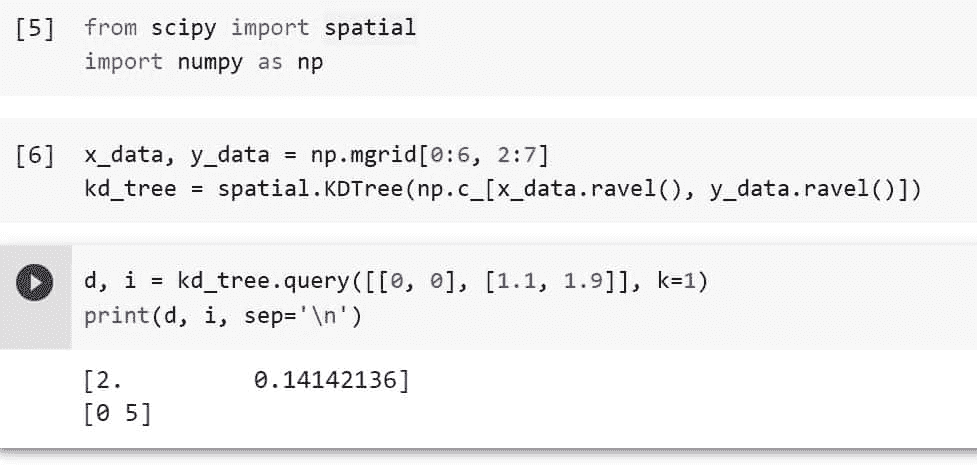
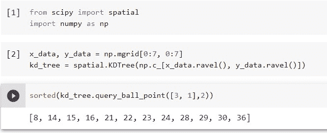
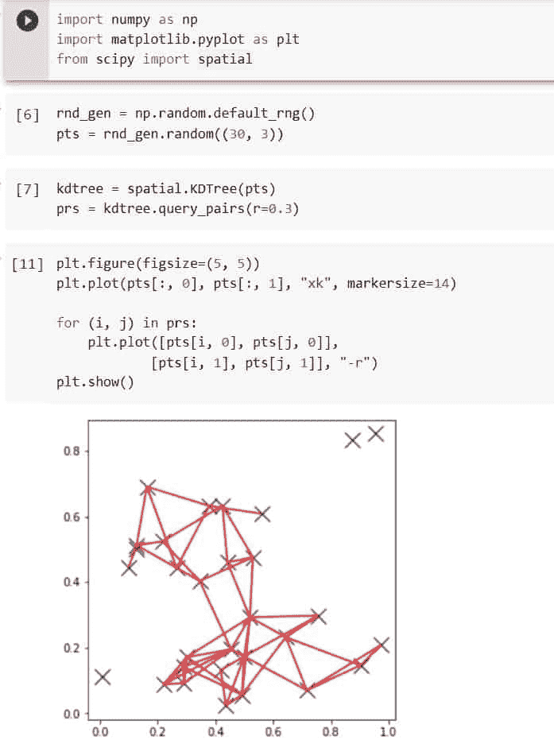
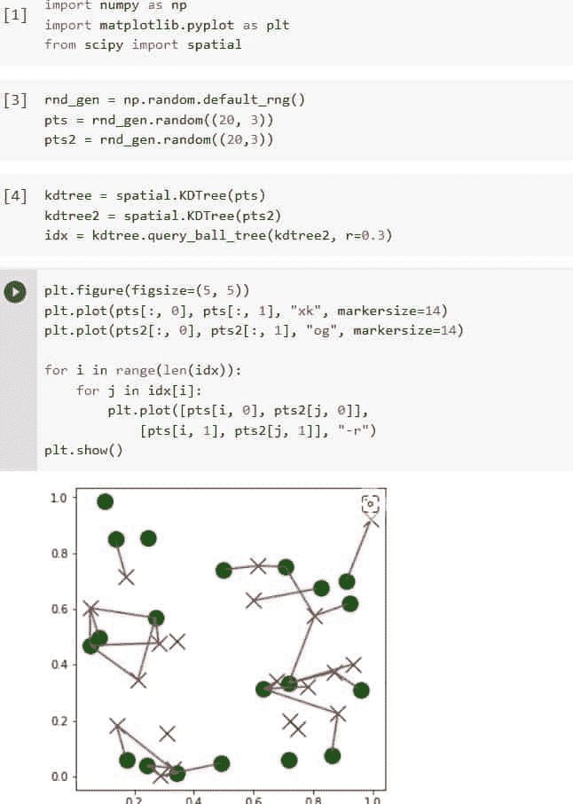
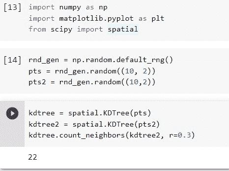
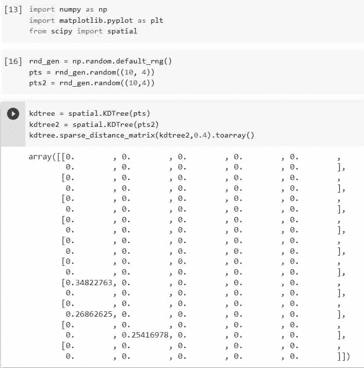
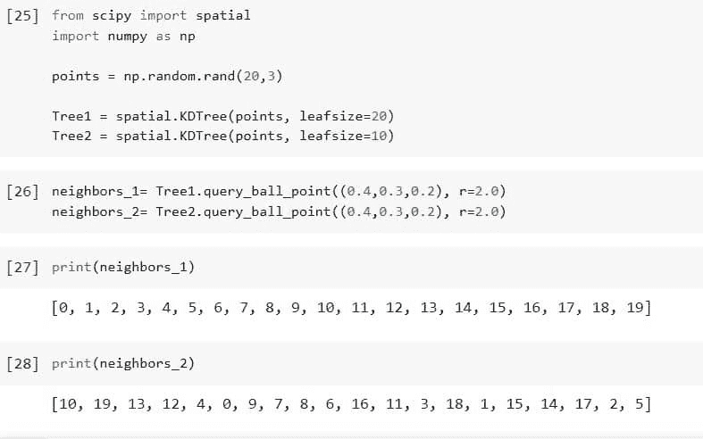
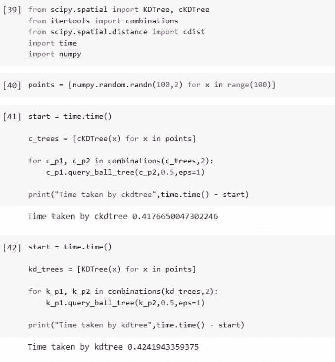

# python Scipy KD tree[有 10 个例子]

> 原文：<https://pythonguides.com/python-scipy-kdtree/>

[](https://sharepointsky.teachable.com/p/python-and-machine-learning-training-course)

在本 [Python 教程](https://pythonguides.com/learn-python/)中，我们将学习“`*Python Scipy KD tree*`”在这里将学习如何找到或搜索某个特定点的最近点。此外，我们将讨论以下主题。

*   什么是 KDtree
*   Python Scipy Kdtree Query
*   Python Scipy Kdtree 查询球点
*   Python Scipy Kdtree 查询对
*   Python Scipy Kdtree
*   Python Scipy Kdtree 查询球树
*   Python Scipy Kdtree 计数邻居
*   Python Scipy Kdtree 稀疏距离矩阵
*   Python Scipy Kdtree vs ckdtree
*   python scipy kdtree 叶大小
*   Python Scipy Kdtree Slow

在开始本教程之前，请确保 Python 和 Scipy 已经安装。这里有一个教程可以帮忙:[安装 Scipy](https://pythonguides.com/what-is-scipy-in-python/#Installation_of_Scipy) 。

目录

[](#)

*   [什么是 KDtree](#What_is_KDtree "What is KDtree")
*   [Scipy Kdtree 查询](#Scipy_Kdtree_Query "Scipy Kdtree Query")
*   [Python Scipy Kdtree 查询球点](#Python_Scipy_Kdtree_Query_Ball_Point "Python Scipy Kdtree Query Ball Point")
*   [Python Scipy Kdtree 查询对](#Python_Scipy_Kdtree_Query_Pairs "Python Scipy Kdtree Query Pairs")
*   [Python Scipy Kdtree](#Python_Scipy_Kdtree "Python Scipy Kdtree")
*   [Python Scipy Kdtree 查询球树](#Python_Scipy_Kdtree_Query_Ball_Tree "Python Scipy Kdtree Query Ball Tree")
*   [Python Scipy Kdtree 计数邻居](#Python_Scipy_Kdtree_Count_Neighbors "Python Scipy Kdtree Count Neighbors")
*   [Python Scipy Kdtree 稀疏距离矩阵](#Python_Scipy_Kdtree_Sparse_Distance_Matrix "Python Scipy Kdtree Sparse Distance Matrix")
*   [Python Scipy KD tree vs CKD tree](#Python_Scipy_Kdtree_vs_ckdtree "Python Scipy Kdtree vs ckdtree")
*   [Python Scipy Kdtree 的树叶大小](#Python_Scipy_Kdtree_leafsize "Python Scipy Kdtree leafsize")
*   [Python Scipy Kdtree Slow](#Python_Scipy_Kdtree_Slow "Python Scipy Kdtree Slow")

## 什么是 KDtree

一种称为 k-d 树(k 维树的缩写)的空间划分数据结构在计算机科学中用于组织 k 维空间中的点。K-d 树对于许多应用程序来说是一种有用的数据结构，包括制作点云以及使用多维搜索关键字执行搜索(例如范围搜索和最近邻搜索)。一种特定类型的二进制空间划分树是 k-d 树。

阅读: [Python Scipy 统计峰度](https://pythonguides.com/python-scipy-stats-kurtosis/)

## Scipy Kdtree 查询

方法`*`KDTree.query()`*`存在于寻找最近邻居的模块`*`scipy.spatial`*`中。

下面给出了语法。

```py
KDTree.query(x, eps=0, k=1, p=2, workers=1, distance_upper_bound=inf,)
```

其中参数为:

*   **x(array_data，last dimension):** 可查询点的数组。
*   **eps(非负浮点):**第 k 个报告的结果保证不超过到实际第 k 个最近邻居的距离的(1+eps)倍。返回近似最近邻。
*   **k(int，sequence int):** 要返回的第 k 个最近邻居的列表，从 1 或要返回的最近邻居的数量开始。
*   **p(浮点):**使用哪个闵可夫斯基 p-范数。绝对值和(或“曼哈顿”)距离为 1。典型的欧几里德距离是 2。坐标差最大的距离是无穷大。如果一个大的、有限的 p 可能溢出，则可能导致 ValueError。
*   **workers(int):** 用于并行处理方面的工作者。如果提供-1，则利用每个 CPU 线程。默认情况下:1。
*   **distance_upper_bound(非负 float):** 只返回附近的。如果执行一系列最近邻查询，提供到最近点的最近邻的距离可能会有所帮助，因为这用于减少树搜索。

方法`KDTree()`返回 ***`d`(最近邻居的距离)`**``i`(self . data . I 中邻居的索引在形式上类似 d。Self.n 用于分别表示 float 和 integers 类型的*和**缺失的邻居。

让我们以下面的步骤为例:

使用下面的 python 代码导入所需的库。

```py
from scipy import spatial
import numpy as np
```

使用下面的代码创建一个多维数组并将其传递给`*`KDTree`*`。

```py
x_data, y_data = np.mgrid[0:6, 2:7]
kd_tree = spatial.KDTree(np.c_[x_data.ravel(), y_data.ravel()])
```

使用以下代码执行压缩邻居搜索并获得结果:

```py
d, i = kd_tree.query([[0, 0], [1.1, 1.9]], k=1)
print(d, i, sep='\n')
```



Scipy Kdtree Example

这就是如何使用 [Python Scipy](https://pythonguides.com/what-is-scipy-in-python/) 的方法`*`KDTree.query()`*`来寻找最近的邻居。

阅读: [Scipy 优化](https://pythonguides.com/scipy-optimize/)

## Python Scipy Kdtree 查询球点

方法`*`KDTree.query_ball_point()`*`存在于模块`*`scipy.spatial`*`中，该模块寻找比 r 更接近点 x 的所有点

下面给出了语法。

```py
KDTree.query_ball_point(x, r, p=2.0, eps=0, workers=1, return_sorted=None, return_length=False)
```

其中参数为:

*   **x(array_data):** 应该使用哪个或哪些点来寻找附近的点。
*   **r(array _ data):**x 的长度必须由返回的点的半径广播。
*   **p(float):** 应该应用哪个闵可夫斯基 p 范数。必须在[1，inf]之间。如果对于一个有限大的 p 来说溢出是可能的，那么就会导致 ValueError。
*   **eps(非负 float):** 预估搜索。如果树的分支的最近点距离超过 r / (1 + eps)，则不检查它们，如果它们距离 r * (1 + eps)更近，则批量添加它们。
*   **workers(int):** 用于并行处理方面的工作者。如果提供-1，则利用每个 CPU 线程。默认情况下:1。
*   **return_sorted(boolean):** 如果为 True，则对返回的索引进行排序；如果为 False，则不对它们进行排序。If None 对多点查询而不是单点搜索进行排序，这是添加此选项之前的默认行为。
*   **return_length(boolean):** 返回半径内的总点数，而不是索引列表。

方法`*`query_ball_point()`*`返回`*`result`*`，如果 x 是单个点，则返回 x 的邻居的索引列表。如果 x 是一个点的数组，则返回一个形状元组对象数组和邻居列表。

让我们以下面的步骤为例:

使用下面的 python 代码导入所需的库。

```py
from scipy import spatial
import numpy as np
```

使用下面的代码创建一个多维数组并将其传递给`*`KDTree`*`。

```py
x_data, y_data = np.mgrid[0:7, 0:7]
kd_tree = spatial.KDTree(np.c_[x_data.ravel(), y_data.ravel()])
```

将上面的数据传递给方法 ***`query_ball_point()`*** ，使用下面的代码找出所有比 r 更接近 x 的点。

```py
sorted(kd_tree.query_ball_point([3, 1],2))
```



Python Scipy Kdtree Query Ball Point

阅读:[科学统计-完整指南](https://pythonguides.com/scipy-stats/)

## Python Scipy Kdtree 查询对

方法`*`KDTree.query_pairs()`*`存在于模块`*`scipy.spatial`*`中，用于查找自身内距离为 r 或更小的所有点对。

下面给出了语法。

```py
KDTree.query_pairs(r, p=2.0, eps=0, output_type='set')
```

其中参数为:

*   **r(正浮动):**是最大距离。
*   **p(float):** 应用什么闵可夫斯基标准。p 必须满足约束 1 = p < =无穷大
*   **eps(非负 float):** 预估搜索。如果树的分支的最近点距离超过 r / (1 + eps)，则不检查它们，如果它们距离 r * (1 + eps)更近，则批量添加它们。
*   **output_type(string):** 选择“set”或“ndarray”作为输出容器。默认情况下:“设置”

方法`*`query_pairs()`*`返回 set 或 ndarray 类型的`*`result`*`，是一组 I > j 和对应的地方靠在一起的对(I，j)。如果输出类型为“ndarray”，则返回 ndarry，而不是 set。

让我们通过下面的步骤来了解一个示例:

使用下面的 python 代码导入所需的库。

```py
import numpy as np
import matplotlib.pyplot as plt
from scipy import spatial
```

使用随机生成器生成数据点，如下面的代码所示。

```py
rnd_gen = np.random.default_rng()
pts = rnd_gen.random((30, 3))
```

将点传递给 kdtree，并使用下面的代码在 kd-tree 中找到所有在 `r` 距离内的点对。

```py
kdtree = spatial.KDTree(pts)
prs = kdtree.query_pairs(r=0.3)
```

用下面的代码画出这些对。

```py
plt.figure(figsize=(5, 5))
plt.plot(pts[:, 0], pts[:, 1], "xk", markersize=14)

for (i, j) in prs:
    plt.plot([pts[i, 0], pts[j, 0]],
            [pts[i, 1], pts[j, 1]], "-r")
plt.show()
```



Python Scipy Kdtree Query Pairs

阅读: [Scipy Integrate +示例](https://pythonguides.com/scipy-integrate/)

## Python Scipy Kdtree

Python 模块`*`scipy.spatial`*`包含类`*`KDTree()`*`快速查找最近邻居。

*   Maneewongvatana 和 Mount 1999 详细描述了该算法。kd 树被概念化为二叉树，每个节点表示一个轴对齐的超矩形。每个节点指定一个轴，并根据点在该轴上的坐标是超过还是低于特定值来划分这组点。

下面给出了语法。

```py
scipy.spatial.KDTree(data, leafsize=10, compact_nodes=True, copy_data=False, balanced_tree=True, boxsize=None)
```

其中参数为:

*   **数据(数组):**将被索引的 m 维的 n 个测量点。因为除非需要创建一个连续的 doubles 数组，否则不会复制这个数组，所以修改这个数据会产生错误的结果。如果在构建 kd 树时指定了 copy data=True，则数据也会被复制。
*   **leafsize(positive int):** 算法转向蛮力方法的次数标准:10。
*   **compact_nodes(boolean):** 如果是这种情况，超矩形被缩小以适合 kd 树的数据范围。以较长的构建时间为代价，这通常会产生一个更紧凑的树，它可以抵抗降级的输入数据并提供更快的查询。一般来说，是的。
*   **copy_data(boolean):** 如果为真，则总是复制数据以防止数据损坏并保护 kd 树。默认情况下为 False。
*   **balanced_tree(boolean):** 如果是这种情况，则使用中间值而不是中点来划分超矩形。通常，较长构建时间的代价是更紧凑的树和更快的查询。一般来说，是的。
*   **boxsize(scalar，array_data):** 给 KDTree 一个 m-d 环形拓扑。拓扑结构由下式产生，其中 I I 是沿第 I 维的盒子大小，n i 是整数。输入数据需要用[0，L i]括起来。如果任何数据超出此界限，将引发 ValueError。

阅读:[科学发现高峰](https://pythonguides.com/scipy-find-peaks/)

## Python Scipy Kdtree 查询球树

Python Scipy 在模块`*`scipy.spatial..KDTree`*`中包含了一个方法`*`query_ball_tree()`*`,该方法寻找 self 和另一个相距最多 r 的点之间的每一对点。

下面给出了语法。

```py
KDTree.query_ball_tree(other, r, p=1.0, eps=1)
```

其中参数为:

*   **其他(KDTree 实例):**包含搜索点的树。
*   **r(浮点):**最大距离必须为正数。
*   **p(float):** 采用什么闵可夫斯基范式。p 必须满足约束 1 = p <无穷大
*   **eps(非负 float):** 预估搜索。如果树的分支的最近点距离超过 r / (1 + eps)，则不检查它们，如果它们距离 r * (1 + eps)更近，则批量添加它们。

方法 ***`query_ball_tree()`*** 返回 list 的 list 类型的`*`result`*`，其中它返回结果[i]是具有 self.data[i]前缀的该树的每个元素在 other.data 中的邻居的索引列表。

让我们以下面的步骤为例:

使用下面的 python 代码导入所需的库。

```py
import numpy as np
import matplotlib.pyplot as plt
from scipy import spatial
```

使用随机生成器生成数据点，如下面的代码所示。

```py
rnd_gen = np.random.default_rng()
pts = rnd_gen.random((20, 3))
pts2 = rnd_gen.random((20,3))
```

将点传递给 kdtrees，并使用下面的代码在 kd-tree 中找到所有在 `r` 距离内的点对。

```py
kdtree = spatial.KDTree(pts)
kdtree2 = spatial.KDTree(pts2)
idx = kdtree.query_ball_tree(kdtree2, r=0.3)
```

用下面的代码画出这些对。

```py
plt.figure(figsize=(5, 5))
plt.plot(pts[:, 0], pts[:, 1], "xk", markersize=14)
plt.plot(pts2[:, 0], pts2[:, 1], "og", markersize=14)

for i in range(len(idx)):
    for j in idx[i]:
        plt.plot([pts[i, 0], pts2[j, 0]],
            [pts[i, 1], pts2[j, 1]], "-r")
plt.show()
```



Python Scipy Kdtree Query Ball Tree

阅读: [Python Scipy Matrix +示例](https://pythonguides.com/python-scipy-matrix/)

## Python Scipy Kdtree 计数邻居

模块 ***`scipy.spatial`*** 中存在的 Python Scipy 的方法`*`count_neighbors()`*`统计附近可以形成的配对个数。

计算距离(x1，x2，p) = r，x1 来自自身，x2 来自他人时可能构成的对(x1，x2)的数量。

下面给出了语法。

```py
KDTree.count_neighbors(other, r, p=1.0, weights=None, cumulative=False)
```

其中参数为:

*   **其他(KDTree):** 要从中导出点的第二棵树可以是第一棵树本身。
*   **r(float，1d float):** 计算计数的半径。一次树遍历用于搜索多个半径。r 决定了面元的边界，如果计数不是累积的(累积=假)，r 不能减少。
*   **p(浮点):**1<= p<=无穷大。使用哪个闵可夫斯基 p 范数？标准 2.0 如果溢出是可能的，有限大的 p 会导致 ValueError。
*   **weights(array_data，tuple array):** 对计数如果没有就没有权重。如果作为元组提供，则自身中的点的权重和另一个中的点的权重分别是权重[0]和权重[1]。
*   **cumulative(boolean):** 返回的计数是否累计。当累积设置为假时，该过程被优化以与由 r 指示的大量箱(> 10)一起运行。当 cumulative 设置为 True 时，该方法调整为使用有限数量的 r 进行操作。默认情况下:真

方法`*`count_neighbors()`*`返回标量或一维数组类型的`*`result`*`，这是配对的数量。未加权计数的结果是一个整数。加权计数的结果是浮点。Result[i]包含带有(-inf if I == 0 else r[i-1])的数字，如果 cumulative 为 False。< R < = r[i]。

让我们通过下面的步骤来理解一个例子:

使用下面的 python 代码导入所需的库。

```py
import numpy as np
import matplotlib.pyplot as plt
from scipy import spatial
```

使用随机生成器生成数据点，如下面的代码所示。

```py
rnd_gen = np.random.default_rng()
pts = rnd_gen.random((10, 2))
pts2 = rnd_gen.random((10,2))
```

将这些点传递给 kdtrees，在两个 kd-trees 之间，使用下面的代码计算附近的邻居的数量。

```py
kdtree = spatial.KDTree(pts)
kdtree2 = spatial.KDTree(pts2)
kdtree.count_neighbors(kdtree2, r=0.3)
```



Python Scipy Kdtree Count Neighbors

从输出中，我们可以看到两个 kdtree 之间的邻居数是 22。

阅读: [Scipy 正态分布](https://pythonguides.com/scipy-normal-distribution/)

## Python Scipy Kdtree 稀疏距离矩阵

Python Scipy 中模块`*`scipy.spatial.KDTree`*`的方法`*`sparse_distance_matrix`*`计算两个 KDTrees 之间的距离矩阵，将任何大于最大距离的距离作为 0。

下面给出了语法。

```py
KDTree.sparse_distance_matrix(other, max_distance, p=1.0, output_type='coo_matrix')
```

其中参数为:

*   **其他:**是 KDTree。
*   **max_distance(正浮点):**用于指定最大距离。
*   **p(浮点):**1<= p<=无穷大。使用哪个闵可夫斯基 p 范数？如果溢出是可能的，有限大的 p 会导致 ValueError。
*   **output_type(string):** 使用哪个输出数据容器。选项包括“ndarray”、“dict”、“coo matrix”和“dok 矩阵”，默认为“dok 矩阵”。

方法`*`sparse_distance_matrix()`*`返回`*`result`*`，它是将结果显示为“关键字字典”的稀疏矩阵。返回的字典的关键字是索引的(I，j)元组。如果输出类型为“ndarray”，则返回包含字段 I“j”和“v”的记录数组。

让我们通过下面的步骤来理解一个例子:

使用下面的 python 代码导入所需的库。

```py
import numpy as np
import matplotlib.pyplot as plt
from scipy import spatial
```

使用随机生成器生成数据点，如下面的代码所示。

```py
rnd_gen = np.random.default_rng()
pts = rnd_gen.random((10, 4))
pts2 = rnd_gen.random((10,4))
```

将点传递给 kdtrees，在两个 kd-trees 之间，计算稀疏距离矩阵。使用下面的代码。

```py
kdtree = spatial.KDTree(pts)
kdtree2 = spatial.KDTree(pts2)
kdtree.sparse_distance_matrix(kdtree2,0.4).toarray()
```



Python Scipy Kdtree Sparse Distance Matrix

这就是如何使用 Python Scipy 的方法`*`sparse_distance_matrix`*`计算两个 KDTrees 之间的距离矩阵。

阅读:[Scipy Stats Zscore+Examples](https://pythonguides.com/scipy-stats-zscore/)

## Python Scipy KD tree vs CKD tree

根据最新的(1.8 版)SciPy 文档，功能相当的`*`scipy.spatial.KDTree`*`已经取代了不推荐使用的`*`scipy.spatial.cKDTree`*`。

cKDTree 本质上等同于 KDTree。在 SciPy v1.6.0 之前，cKDTree 提供了卓越的性能和略有不同的功能，但现在这两个名称主要是为了向后兼容。如果与 SciPy < 1.6 的兼容性不成问题，请首选 KDTree。

## Python Scipy Kdtree 的树叶大小

方法`KDTree`接受一个参数 ***`leafsize`*** ，该参数定义了算法转向蛮力方法的次数，默认为 10 次。基于 leafsize 方法返回不同的结果。

让我们以下面的步骤为例:

使用下面的代码导入所需的库。

```py
from scipy import spatial
import numpy as np
```

使用方法`*`np.random.rand()`*`生成数据点，并将数据点传递给两个 kdtree，其中一个树的叶子大小等于 20，另一个树的叶子大小等于 10。

```py
points = np.random.rand(20,3)

Tree1 = spatial.KDTree(points, leafsize=20)
Tree2 = spatial.KDTree(points, leafsize=10)
```

用下面的代码找出两棵树距离 0.2 到 0.4 之间的所有点。

```py
neighbors_1= Tree1.query_ball_point((0.4,0.3,0.2), r=2.0)
neighbors_2= Tree2.query_ball_point((0.4,0.3,0.2), r=2.0)
```

使用下面的代码检查结果。

```py
print(neighbors_1)
print(neighbors_2)
```



Python Scipy Kdtree leafsize

正如我们可以看到的，对于相同的查询球点参数，两棵树的结果是不同的，这是由于树的叶子大小。

阅读: [Scipy 信号-有用教程](https://pythonguides.com/scipy-signal/)

## Python Scipy Kdtree Slow

我们在上面的***“Python Scipy Kdtree vs ckdtree”***小节中已经讲过，CKD tree 在性能上优于 KD tree。

让我们按照以下步骤来看一个例子:

使用下面的 python 代码导入所需的库。

```py
from scipy.spatial import KDTree, cKDTree
from itertools import combinations
from scipy.spatial.distance import cdist
import time
import numpy
```

使用下面的代码创建数据点。

```py
points = [numpy.random.randn(100,2) for x in range(100)]
```

使用方法`query_ball_points`使用 ckdtree 查找所有点，并且使用下面的代码通过该方法花费时间。

```py
start = time.time()

c_trees = [cKDTree(x) for x in points]

for c_p1, c_p2 in combinations(c_trees,2):
    c_p1.query_ball_tree(c_p2,0.5,eps=1)

print("Time taken by ckdtree",time.time() - start)
```

同样的代码与 kdtree 使用以下代码。

```py
start = time.time()

kd_trees = [KDTree(x) for x in points]

for k_p1, k_p2 in combinations(kd_trees,2):
    k_p1.query_ball_tree(k_p2,0.5,eps=1)

print("Time taken by kdtree",time.time() - start)
```



Python Scipy Kdtree Slow

从两棵树的输出中，我们得出结论，ckdtree 在性能上比 kdtree 更好。

另外，看看更多的 Python SciPy 教程。

*   [Python Scipy 特征值](https://pythonguides.com/python-scipy-eigenvalues/)
*   [Python Scipy Stats 峰度](https://pythonguides.com/python-scipy-stats-kurtosis/)
*   [Python Scipy 最小化](https://pythonguides.com/python-scipy-minimize/)
*   [Python Scipy 统计数据偏差](https://pythonguides.com/python-scipy-stats-skew/)
*   [Python Scipy 距离矩阵](https://pythonguides.com/scipy-distance-matrix/)

因此，在本教程中，我们已经了解了"`*Python Scipy KD tree*`"并涵盖了以下主题。

*   什么是 KDtree
*   Python Scipy Kdtree Query
*   Python Scipy Kdtree 查询球点
*   Python Scipy Kdtree 查询对
*   Python Scipy Kdtree
*   Python Scipy Kdtree 查询球树
*   Python Scipy Kdtree 计数邻居
*   Python Scipy Kdtree 稀疏距离矩阵
*   Python Scipy Kdtree vs ckdtree
*   python scipy kdtree 叶大小
*   Python Scipy Kdtree Slow

[Bijay Kumar](https://pythonguides.com/author/fewlines4biju/)

Python 是美国最流行的语言之一。我从事 Python 工作已经有很长时间了，我在与 Tkinter、Pandas、NumPy、Turtle、Django、Matplotlib、Tensorflow、Scipy、Scikit-Learn 等各种库合作方面拥有专业知识。我有与美国、加拿大、英国、澳大利亚、新西兰等国家的各种客户合作的经验。查看我的个人资料。

[enjoysharepoint.com/](https://enjoysharepoint.com/)[](https://www.facebook.com/fewlines4biju "Facebook")[](https://www.linkedin.com/in/fewlines4biju/ "Linkedin")[](https://twitter.com/fewlines4biju "Twitter")