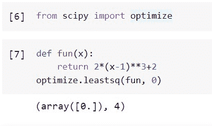
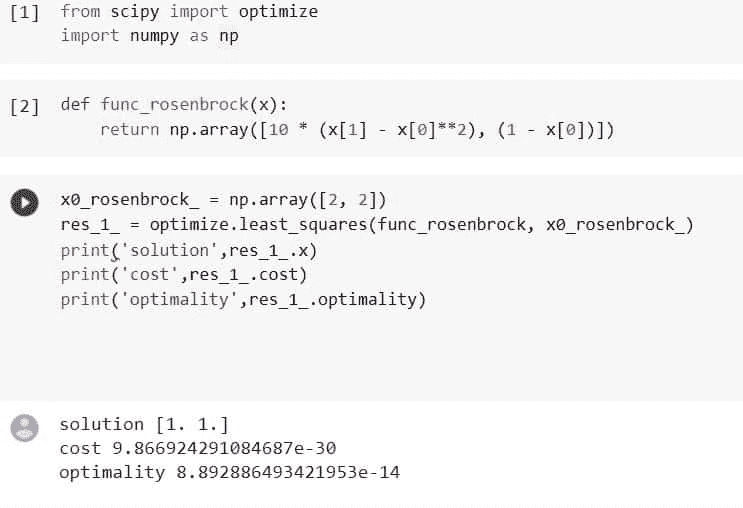

# Python Scipy Leastsq

> 原文：<https://pythonguides.com/python-scipy-leastsq/>

[](https://sharepointsky.teachable.com/p/python-and-machine-learning-training-course)

这个 [Python Scipy 教程](https://pythonguides.com/what-is-scipy-in-python/)解释了关于“ `Python Scipy Leastsq` ”的一切。通过以下主题，我们将了解如何使用 Python Scipy 的 leastsq 方法，并找到给定方程的最小平方。

*   什么是最小二乘？
*   如何用最小二乘法求方程的最小二乘
*   Python Scipy Leastsq 与最小二乘法

目录

[](#)

*   [什么是最小二乘？](#What_is_Least_Square "What is Least Square?")
*   [Python Scipy Leastsq](#Python_Scipy_Leastsq "Python Scipy Leastsq")
*   [Python Scipy Least sq Vs . Least _ squares](#Python_Scipy_Leastsq_Vs_Least_squares "Python Scipy Leastsq Vs Least_squares")

## 什么是最小二乘？

最小二乘法是一种数学回归分析，用于确定一组数据的最佳拟合线，以图形方式表示样本点之间的关系。

每个数据点描述了一个已知自变量和一个未知因变量之间的相关性。

最小二乘法是一种统计技术，用于通过最小化数据点相对于绘制曲线的总偏移或残差来确定哪一组数据点最符合一组数据点。

为了预测因变量的行为，执行最小二乘回归。在所研究的数据点中，最佳拟合线的位置通常用最小二乘法来解释。

一个想要评估一个组织的股票收益和该股票所属指数的收益之间的相关性的分析师可以使用最小二乘法作为例子。在这种情况下，分析师试图确定股票回报是否受到指数回报的影响。

阅读 [Python Scipy 特殊模块示例](https://pythonguides.com/python-scipy-special/)

## Python Scipy Leastsq

Python Scipy 在模块`*`scipy.optimize`*`中有一个方法`*`leastsq()`*`，可以减少一组等式的平方和。

下面给出了语法。

```py
scipy.optimize.leastsq(func, x0, args=(), Dfun=None, full_output=0, col_deriv=0, ftol=1.49012e-08, xtol=1.49012e-08, gtol=0.0, maxfev=0, epsfcn=None, factor=100, diag=None)
```

其中参数为:

*   **func(callable):** 应该接受最少一个输入，最大长度为 N 个向量，返回 M 个浮点数。它不能返回 NaNs，否则拟合将不起作用。m 必须超过 N 或者等于 N。
*   **x0(ndarray):** 最小化的初始估计。
*   **args(tuple):** 该元组包含 func 接收的任何额外参数。
*   **Dfun(callable):** 用于计算具有跨行导数的函数的雅可比矩阵的公式或技术。如果没有，将估计雅可比矩阵。
*   **full_output(boolean):** 非零则返回所有可选输出。
*   **col_deriv(boolean):** 对于计算各列导数的雅可比函数，值必须非零。
*   **ftol(float):** 平方和应该会有一些相对不准确。
*   **xtol(float):** 近似解应该会有一定的相对误差。
*   **gtol(float):** 函数向量和雅可比列应该是正交的。
*   **maxfev(int):** 可以对函数进行的最多调用。默认的 maxfev 是 200(N+1)，除非给定了 Dfun，在这种情况下是 100(N+1)，其中 N 是 x0 中的项数。
*   **epsfcn(float):** 用于为前向差分雅可比近似选择适当步长的因子(对于 Dfun=None)。通常，sqrt(epsfcn)*x 表示实际步长。如果 epsfcn 小于机器精度，则假定相对误差在机器精度的数量级。
*   **factor(float):** 控制第一步界限的变量(factor * || diag * x||)。应隔开(0.1，100)。
*   **diag(squence):** 变量的比例因子是 N 个正数。

方法`*`leastsq()`*`返回`*`solution`*`、`*`cov_x`*`和`*`info_dict`*`。

让我们以下面的步骤为例:

使用下面的 python 代码导入所需的库或方法。

```py
from scipy import optimize
```

使用下面的代码创建一个函数并最小化它。

```py
def fun(x):
    return 2*(x-1)**3+2
optimize.leastsq(fun, 0)
```



Python Scipy Leastsq

这就是如何使用 Python Scipy 的方法`*`leastsq()`*`减少一组方程的平方和。

## Python Scipy Least sq Vs . Least _ squares

方法`*`leastsq()`*`最小化我们在上述小节中学习的一组方程的平方和，而`*`least_squares()`*`利用变量的边界来解决非线性最小二乘问题。所以在这一节，我们将只了解一下`*`least_squares()`*`。

下面给出了语法。

```py
scipy.optimize.least_squares(fun, x0, xtol=1e-08, gtol=1e-08, x_scale=1.0, jac='2-point', bounds=(- inf, inf), method='trf', ftol=1e-08, loss='linear', f_scale=1.0, diff_step=None, tr_solver=None, tr_options={}, jac_sparsity=None, max_nfev=None, verbose=0, args=(), kwargs={})
```

其中参数为:

*   **fun(可调用):** Fun(x，*args，**kwargs)是计算残差向量的函数；最小化是针对第一个参数进行的。这个函数接收一个 ndarray，以形状(n)作为它的参数 x(从不为标量，即使 n=1)。它必须分配并返回一个标量或形状为(m)的一维数组。如果自变量 x 是复数或者函数 fun 产生复数残差，则它必须包装在具有实数参数的实函数中。
*   **x0:** 自变量的首过估计。当一个值是浮点数时，它被作为一个只有一个元素的一维数组来处理。
*   **jac(2 点，3 点，‘cs’):**一个 m 乘 n 的矩阵，元素 I j)是 f[i]对 x[j]的偏导数，用于计算雅可比矩阵。关键字决定了有限差分估计方法。尽管“三点”技术比“两点”技术更精确，但它需要两倍的过程(默认)。虽然它可能是最精确的，但策略“cs”只有在 fun 正确处理复杂输入时才有效，并且可以通过分析扩展到复平面。方法“lm”总是使用“两点”方案如果是可调用的，它将作为 jac(x，*args，**kwargs)使用，并应作为`*`scipy.sparse.linalg.LinearOperator`*`、稀疏矩阵(建议使用 csr 矩阵)或类似数组的值(至少应用 NP . 2d)返回雅可比矩阵的准确值。
*   **bounds(数组数据二元组):**对自变量的下限值和上限值的限制。默认情况下，没有限制。每个数组的大小必须与 x0 相同，否则它必须是一个标量，在这种情况下，每个变量的界限将是相同的。在 np.inf 命令中使用适当的符号来禁用所有或选定变量的界限。
*   **方法:**一种最小化的算法，如`lm`、`dogbox`、`trf`。
*   **ftol(None，float):** 对可能导致终止的成本函数变化的容差。标准是 1e-8。当 dF ftol * F 并且在前一阶段中在局部二次模型和真实模型之间有足够的一致性时，优化过程终止。如果“方法”和“无”都不是“lm”，则由这种情况导致的终止被阻止。如果“方法”的值为“lm”，则该公差需要大于机器ε
*   **xtol(None，float):** 独立变量发生变化并导致终止的公差。1e-8 是默认值。根据不同的技术，精确的状态可能是。
*   **gtol(None，float):** 根据梯度平均值的终止公差。1e-8 是默认值。所采用的程序决定了精确的条件。
*   **x_scale(array_data，jac):** 每个变量的特征尺度。当 x 标度被设定时，该问题等价地被重新表述为 xs = x / x 标度。另一种观点认为 x scale[j]与沿着第 j 维的信任区域的大小成比例。通过设置 x 标度，使得沿标度变量的任何步长对成本函数具有相似的影响，可以获得改进的收敛。如果选择“jac ”,则使用雅可比矩阵中列的逆范数来迭代更新比例。
*   **loss(string，callable):** 损失函数确定。
*   **f_scale(float):** 内层和外层残差之间的软余量值，默认为 1.0。损失函数评估如下`rho_(f**2) = C**2 * rho(f**2 / C**2)`，其中`C`为 *f_scale* ，`rho`由*损失*参数决定。该参数对`loss='linear'`没有影响，但对于其他*损耗*值来说，至关重要。
*   **max_nfev(int):** 停止前可以执行的函数求值次数。如果没有(默认值)，将自动选择该值。
*   **diff_step(number 或 array_data):** 确定雅可比有限差分近似的相对步长。x * diff 步长用于计算实际步长。如果没有选择(默认)，对于所选的有限差分法，机器的通常“最佳”功率ε被假定为 diff_step。
*   **tr _ solver():**‘TRF’和‘dogbox’技术专门应用这种方法来解决信赖域子问题。
*   **tr_options(dict):** 将关键字选择传递给信任区域的求解器。当 tr 解算器='exact '时，tr 选项被忽略。scipy.sparse.linalg.lsmr 的选项位于 tr_solver='lsmr '中。method='trf '也支持“正则化”选项(bool，default 为 True)，它向正规方程添加了正则化项，以在雅可比矩阵秩不足的情况下改善收敛性。
*   **jac_sparsity(array_data，sparse matrix):** 指定有限差分估计的雅可比矩阵的稀疏结构；它必须具有以下形状:(m，n)。如果提供稀疏结构，并且雅可比矩阵每行只有几个非零分量，则计算速度会大大加快。零条目表示雅可比矩阵的对应元素也是零。强制使用“lsmr”信任区域求解器(如果存在)。当指定 None(默认值)时，将应用密集差异。对“lm”方法没有影响。
*   **verbose(0，1，2):** 算法详细级别:0(默认)，静默操作在步骤一中显示终止报告。2:显示迭代进度(“lm”方法不支持这一点)。
*   **args，kwargs(dict，tuple):** Fun 和 Jac 收到附加参数。两者最初都是空的。Fun(x，*args，**kwargs)是 jac 和 x 的调用签名。

方法``least_squares()``返回定义了以下字段的``result``，优化结果:

*   **x(ndarray，shape(n，)):**找到解。
*   **成本(float):** 求解时的成本函数值。
*   **fun(ndarray，shape(m，):**解向量处的残差。
*   **jac(稀疏矩阵，ndarray):** 在 J^T J 使用高斯-牛顿法逼近成本函数的海森的解中修改雅可比矩阵。该类型与算法使用的类型相匹配。
*   **grad(ndarray，shape(，m):** 代价函数在解处的梯度。
*   **最优性(float):** 一阶最优性的度量。在无约束问题中，梯度总是一致范数。它是在有限问题的迭代过程中与 gtol 进行比较的量。
*   **active_mask(ndarray of int，shape(n，)):**每个元素表示对应的约束是否生效(即变量是否在边界)。0:没有约束生效。1:下限有效。1:活动上限。假设“trf”方法生成一系列严格可行的迭代，并且在容差水平内决定活动掩码，那么它可能是相当任意的。
*   **nfev(int):** 已完成的函数求值次数。与“lm”方法不同,“trf”和“dogbox”方法不计算数值雅可比近似的函数调用。
*   **njev(int):** 已完成的雅可比求值次数。如果“lm”方法采用数值雅可比近似，则设置为无。
*   **状态(int):** 停止算法的原因。
*   **消息(字符串):**终止原因的书面说明。
*   **success(boolean):** 如果状态> 0 表示收敛要求之一已经满足，则为真。

让我们以下面的步骤为例:

使用下面的 python 代码导入所需的方法或库。

```py
from scipy import optimize
import numpy as np
```

创建一个函数 Rosebrock 和一个数据数组，并使用下面的代码将这两个东西传递给方法`*`least_squares()`*`。

```py
def func_rosenbrock(x):
    return np.array([10 * (x[1] - x[0]**2), (1 - x[0])])

x0_rosenbrock_ = np.array([2, 2])
res_1_ = optimize.least_squares(func_rosenbrock, x0_rosenbrock_)
print('solution',res_1_.x)
print('cost',res_1_.cost)
print('optimality',res_1_.optimality) 
```



Python Scipy Leastsq Vs Least_squares

从上面的输出，我们可以得出 Leastsq 与 Python Scipy 中的 Least_squares 方法有什么不同。

我们已经学习了如何找到给定方程的最小二乘，以及 leastsq 与最小二乘方法的不同之处。

*   什么是最小二乘？
*   如何用最小二乘法求方程的最小二乘
*   Python Scipy Leastsq 与最小二乘法

您可能会喜欢以下 Python Scipy 教程:

*   [Python Scipy 矩阵](https://pythonguides.com/python-scipy-matrix/)
*   [Scipy Linalg](https://pythonguides.com/scipy-linalg/)
*   [Python Scipy Odeint](https://pythonguides.com/python-scipy-odeint/)
*   [Scipy 正态分布](https://pythonguides.com/scipy-normal-distribution/)
*   [Scipy 状态的口袋](https://pythonguides.com/scipy-stats-zscore/)
*   [Scipy Ndimage Rotate](https://pythonguides.com/scipy-ndimage-rotate/)

[Saurabh](https://pythonguides.com/author/saurabh/)

我叫 Kumar Saurabh，是一名 Python 开发人员，在 TSInfo Technologies 工作。此外，像 Python 编程，SciPy，机器学习，人工智能等技术的专业知识。是我喜欢做的事情。