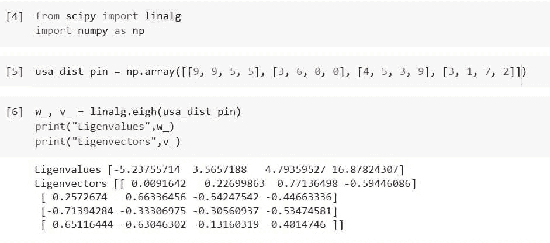
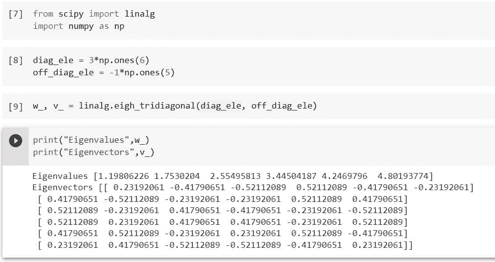
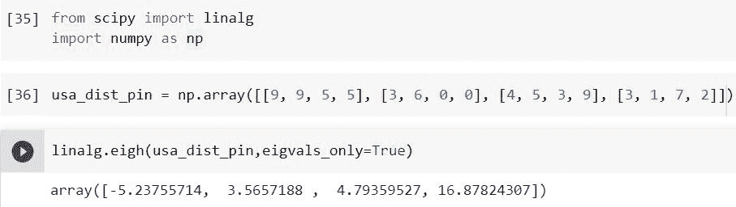
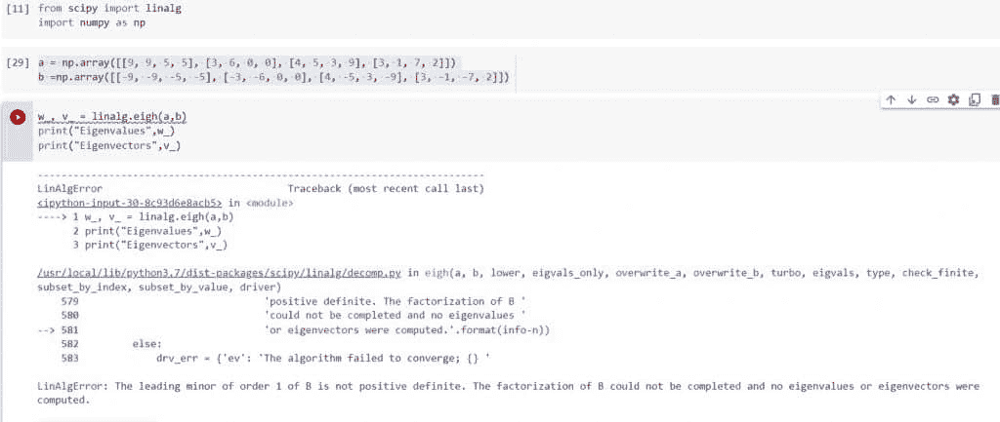

# Python Scipy Linalg Eigh

> 原文：<https://pythonguides.com/python-scipy-linalg-eigh/>

[](https://sharepointsky.teachable.com/p/python-and-machine-learning-training-course)

在本 [Python Scipy 教程](https://pythonguides.com/what-is-scipy-in-python/)中，我们将学习“`Python Scipy linang Eigh`”，它用于计算埃尔米特矩阵或实对称矩阵的特征值或特征向量。

*   Python Scipy Linalg Eigh
*   Python Scipy Linalg 八边形三对角线
*   仅 Python Scipy Linalg Eigh Egvals
*   Python Scipy Linalg Eigh Return

目录

[](#)

*   [Python Scipy Linalg Eigh](#Python_Scipy_Linalg_Eigh "Python Scipy Linalg Eigh")
*   [Python Scipy Linalg Eigh Tridiagonal](#Python_Scipy_Linalg_Eigh_Tridiagonal "Python Scipy Linalg Eigh Tridiagonal")
*   [Python Scipy Linalg Eigh Eigh Only](#Python_Scipy_Linalg_Eigh_Eigvals_Only "Python Scipy Linalg Eigh Eigvals Only")
*   [Python Scipy Linalg Eigh Return](#Python_Scipy_Linalg_Eigh_Return "Python Scipy Linalg Eigh Return")

## Python Scipy Linalg Eigh

Python Scipy 的方法`*`eigh()`*`存在于复埃尔米特矩阵或实对称矩阵的模块`*`scipy.linalg`*`中，用于解决常规或广义特征值问题。

下面给出了语法。

```py
scipy.linalg.eigh(a, b=None, lower=True, eigvals_only=False, overwrite_a=False, overwrite_b=False, type=1, check_finite=True, subset_by_index=None, subset_by_value=None, driver=None)
```

其中参数为:

*   **a(array_data):** 将计算一个复厄米矩阵或实对称矩阵的特征值和特征向量。
*   **b(array_data):** 实对称复埃尔米特正矩阵。如果缺少单位矩阵，则认为是单位矩阵。
*   **lower(boolean):** 如果相关数组数据是从 a 和 b(如果适用)的下三角形或上三角形中提取的。
*   **eigvals_only(boolean):** 如果只计算特征值而不计算特征向量(默认两者都计算)。
*   **overwrite_a(boolean):** 是否替换 a 中的数据
*   **overwrite_b(布尔):**是否替换 b 中的数据。
*   **subset _ by _ index(iterable):**所需特征值的起始和结束索引由这个二元可迭代定义(如果提供一个的话)(升序和 0 索引)。[1，4]用于仅返回第二到第五个最小的特征值。最大的三个由[n-3，n-1]返回。专用于“evr”、“evx”和“gvx”驱动程序。通过使用 int，条目被立即转换成整数()。
*   **subse _ by _ value(iterable):**这个二元 iterable，如果给定，指定半开区间(a，b)，在这个区间内，如果有的话，只返回这些值之间的特征值。专用于“evr”、“evx”和“gvx”驱动程序。对于不受约束的端点，使用 np.inf。
*   **驱动程序(字符串):**指定要使用的适当的 LAPACK 驱动程序。对于普通问题，您可以从“ev”、“evd”、“evr”或“evx”中选择，而对于一般问题(其中 b 不是无)，您可以从“gv”、“gvd”或“gvx”中选择。。“evr”是常见问题的默认值。“gvd”用于一般问题的整个集合，而“gvx”用于子集要求的情况。
*   **check_finite(boolean):** 如果需要验证输入矩阵只包含有限个数字。禁用可能会提高性能，但如果输入包含无限或 nan，可能会导致问题(崩溃、非终止)。
*   **type(int):** 该参数为概括问题的 w 和 v 标识需要解决的具体种类的问题。

方法`*`eigh()`*`返回 ndarray 类型的两个值***`w`(N(1 = N = M)个选定特征值中的每一个都重复一定次数)*** 和 ***`v`(如果 eigvals_only 为 False)。***

让我们按照以下步骤计算复厄米矩阵或实对称矩阵的特征值或特征向量:

使用下面的 python 代码导入所需的方法或库。

```py
from scipy import linalg
import numpy as np
```

创建一个矩阵，因此我们在这里将美国地区的第一个四位 pin 码作为矩阵的数据值，例如美国地区的 pin 码`Aleutian East = 99553`、`Autauga = 36003`、`Clinton = 45390`和`Brooks = 31720`。

```py
usa_dist_pin = np.array([[9, 9, 5, 5], [3, 6, 0, 0], [4, 5, 3, 9], [3, 1, 7, 2]])
```

现在将上面的矩阵传递给方法`*`eigh()`*`,使用下面的代码计算特征值和特征向量。

```py
w_, v_ = linalg.eigh(usa_dist_pin)
print("Eigenvalues",w_)
print("Eigenvectors",v_)
```



Python Scipy Linalg Eigh

根据上面的输出，这就是如何使用 Python Scipy 的方法`*`eigh()`*`计算特征值和特征向量。

阅读 [Python Scipy 距离矩阵](https://pythonguides.com/scipy-distance-matrix/)

## Python Scipy Linalg Eigh Tridiagonal

模块`*`scipy.linalg`*`中 Python Scipy 的方法`*`eigh_tridiagonal()`*`用于实对称三对角矩阵，求特征值。

下面给出了语法。

```py
scipy.linalg.eigh_tridiagonal(d, e, select='a', select_range=None, check_finite=True, tol=0.0, lapack_driver='auto')
```

其中参数为:

*   **d(ndarray):** 数组的对角元素。
*   **e(ndarray):** 数组的非对角元素。
*   **select_range(min，max):** 选择一个特征值范围。
*   **select(v，I，a):** 需要计算哪些特征值，`a`计算所有特征值，`i`计算 min < = i < = max 指标的特征值，`v`计算[(min，max]范围内的特征值。
*   **check_finite(boolean):** 是否确定输入矩阵只有有限个数字。禁用可能会提高性能，但如果输入包含无限或 nan，可能会导致问题(崩溃、非终止)。
*   **tol(float):** 每个特征值必须满足的最严格的公差(仅在“stebz”是 lapack 驱动程序时使用)。如果一个特征值(或簇)落在这个范围内，就说它已经收敛。如果= 0。(默认值)，使用值 eps*|a|,其中|a|是矩阵 a 的 1 范数，eps 是机器精度。
*   **lapack_driver(string):** 要使用 lapack 函数，请从“auto”、“stemr”、“stebz”、“sterf”或“stev”中选择当 select='a '时，它将使用' stemr '；如果选择='stebz '，它将使用' auto '(默认)。第二个 LAPACK 调用(到？STEIN)来获得匹配的特征向量。只有当 eigvals only=True 并且 select='a '时，才能使用关键字“sterf”。只有当 select='a '时，才可以使用' stev '。

方法`eigh_tridiagonal()`返回`w`(特征值按照它们的重数以递增的顺序重复)和`v`(列 v[:，i]包含对应于特征值 w[i]的归一化特征向量)。

让我们以下面的步骤为例:

使用下面的 python 代码导入所需的方法或库。

```py
from scipy import linalg
import numpy as np
```

使用下面的代码创建一个数组的对角线和非对角线元素。

```py
diag_ele = 3*np.ones(6)
off_diag_ele = -1*np.ones(5)
```

使用下面的代码将上述数组传递给方法`*`eigh_tridiagonal()`*`。

```py
w_, v_ = linalg.eigh_tridiagonal(diag_ele, off_diag_ele)
print("Eigenvalues",w_)
print("Eigenvectors",v_)
```



Python Scipy Linalg Eigh Tridiagonal

从输出中，我们可以看到这就是如何使用 Python Scipy 的方法`*`eigh_tridiagonal()`*`来寻找实对称三对角矩阵的特征值。

阅读 [Python Scipy 置信区间](https://pythonguides.com/scipy-confidence-interval/)

## Python Scipy Linalg Eigh Eigh Only

参数`*`eigvals_only`*`被 Python Scipy 的方法`*`eigh()`*`接受来计算特征值，如果这个参数被设置为`*`True`*`。

让我们举一个同样的例子，我们在上面的小节中使用了"***【Python Scipy Linalg Eigh "***。

使用下面的 python 代码导入所需的方法或库。

```py
from scipy import linalg
import numpy as np
```

创建一个矩阵，因此我们在这里将美国地区的第一个四位 pin 码作为矩阵的数据值，例如美国地区的 pin 码`Aleutian East = 99553`、`Autauga = 36003`、`Clinton = 45390`和`Brooks = 31720`。

```py
usa_dist_pin = np.array([[9, 9, 5, 5], [3, 6, 0, 0], [4, 5, 3, 9], [3, 1, 7, 2]])
```

现在将上面的矩阵传递给参数 ***`eigvals_only`*** 等于`True`的方法`*`eigh()`*`，仅使用下面的代码计算特征值。

```py
linalg.eigh(usa_dist_pin,eigvals_only=True)
```



Python Scipy Linalg Eigh Eigvals Only

从输出中，我们可以使用 Python Scipy 的参数`*`eigvals_only`*`等于`*`True`*`的方法`*`eigh()`*`看到矩阵`*`usa_dist_pin`*`的本征值

阅读 [Python Scipy 指数](https://pythonguides.com/python-scipy-exponential/)

## Python Scipy Linalg Eigh Return

我们在上面小节中学习的 Python Scipy 的方法`eigh()`返回 3 个值 a***`w`(N(1 = N = M)个选择的特征值中的每一个都重复一定次数)*** ， ***`v`(如果 eigvals_only 为 False)类型 ndarray*** 并引发一个错误 ***`LinAlgError`(如果在特征值的计算过程中发生错误，b 矩阵不一定为正或者两者都为正。请记住，如果输入矩阵不是对称的或厄米的，即使没有错误通知，也会产生不正确的结果*** 。

这里我们将看到错误部分，因为我们已经在上面的``*Python Scipy Linalg Eigh*``小节中 `*`already`*`了解了`*`w`*`和`*`v`*`的值。

使用下面的 python 代码导入所需的方法或库。

```py
from scipy import linalg
import numpy as np
```

使用下面的代码创建一个矩阵 a 和 b。

```py
a = np.array([[9, 9, 5, 5], [3, 6, 0, 0], [4, 5, 3, 9], [3, 1, 7, 2]])
b =np.array([[-9, -9, -5, -5], [-3, -6, 0, 0], [4, -5, 3, -9], [3, -1, -7, 2]])
```

使用下面的代码将上述两个矩阵传递给方法`eigh()`。

```py
w_, v_ = linalg.eigh(a,b)
print("Eigenvalues",w_)
print("Eigenvectors",v_)
```



Python Scipy Linalg Eigh Return

输出显示错误`*`LinAlgError`*`，表示矩阵`b`不是正矩阵。

所以在本教程中，我们学习了如何使用 Python Scipy 的 eigh()计算特征值或特征向量。还可以通过以下主题了解此方法返回的错误。

*   Python Scipy Linalg Eigh
*   Python Scipy Linalg 八边形三对角线
*   仅 Python Scipy Linalg Eigh Egvals
*   Python Scipy Linalg Eigh Return

您可能会喜欢以下 Python Scipy 教程:

*   [Python Scipy 卡方检验](https://pythonguides.com/python-scipy-chi-square-test/)
*   [Scipy 找 P](https://pythonguides.com/scipy-find-peaks/)[e](https://pythonguides.com/scipy-find-peaks/)[AK](https://pythonguides.com/scipy-find-peaks/)
*   [python scipy fccluster](https://pythonguides.com/python-scipy-fcluster/)的开发
*   [Python Scipy Linalg Eig](https://pythonguides.com/python-scipy-linalg-eig/)
*   [Python Scipy FFT](https://pythonguides.com/python-scipy-fft/)
*   [Python Scipy 特殊模块示例](https://pythonguides.com/python-scipy-special/)
*   [Python Scipy 矩阵](https://pythonguides.com/python-scipy-matrix/)

[Bijay Kumar](https://pythonguides.com/author/fewlines4biju/)

Python 是美国最流行的语言之一。我从事 Python 工作已经有很长时间了，我在与 Tkinter、Pandas、NumPy、Turtle、Django、Matplotlib、Tensorflow、Scipy、Scikit-Learn 等各种库合作方面拥有专业知识。我有与美国、加拿大、英国、澳大利亚、新西兰等国家的各种客户合作的经验。查看我的个人资料。

[enjoysharepoint.com/](https://enjoysharepoint.com/)[](https://www.facebook.com/fewlines4biju "Facebook")[](https://www.linkedin.com/in/fewlines4biju/ "Linkedin")[](https://twitter.com/fewlines4biju "Twitter")