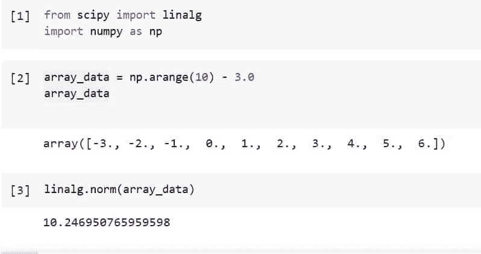
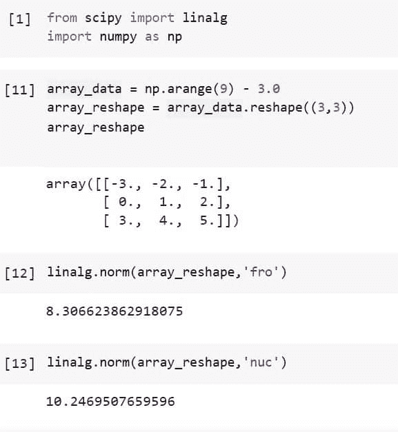
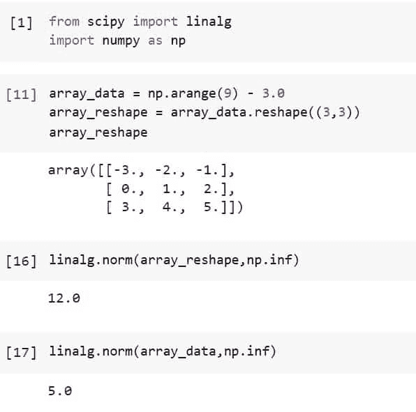
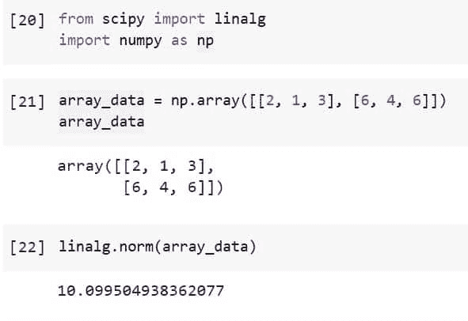
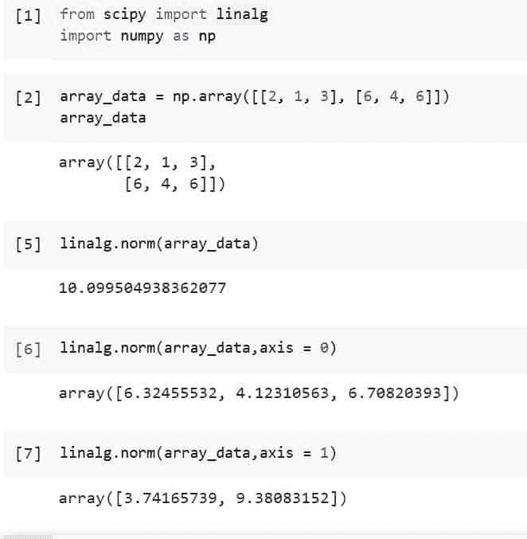
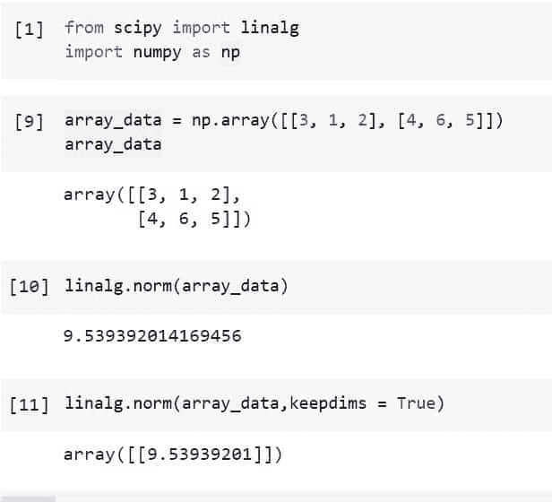

# Python Scipy Linalg Norm

> 原文：<https://pythonguides.com/python-scipy-linalg-norm/>

[](https://sharepointsky.teachable.com/p/python-and-machine-learning-training-course)

在本 [Python Scipy 教程](https://pythonguides.com/what-is-scipy-in-python/)中，我们将学习“ `Python Scipy Linalg` ”，通过涵盖以下主题来计算具有不同阶数和数组轴的一维和二维数组的范数向量。

*   Python Scipy Linalg Norm
*   如何利用参数顺序求范数向量
*   Python Scipy 线性范数无穷大
*   如何求二维数组的范数
*   如何求指定轴上数组的范数
*   Python Scipy Linalg Norm Keepdims

目录

[](#)

*   [Python Scipy Linalg Norm](#Python_Scipy_Linalg_Norm "Python Scipy Linalg Norm")
*   [Python Scipy Linalg 规范顺序](#Python_Scipy_Linalg_Norm_Order "Python Scipy Linalg Norm Order")
*   [Python Scipy Linalg 范数无穷大](#Python_Scipy_Linalg_Norm_Infinity "Python Scipy Linalg Norm Infinity")
*   [Python Scipy Linalg 范数 2d 数组](#Python_Scipy_Linalg_Norm_2d_array "Python Scipy Linalg Norm 2d array")
*   [Python Scipy linangl 规范轴](#Python_Scipy_Linagl_Norm_Axis "Python Scipy Linagl Norm Axis")
*   [Python Scipy Linalg Norm Keepdims](#Python_Scipy_Linalg_Norm_Keepdims "Python Scipy Linalg Norm Keepdims")

## Python Scipy Linalg Norm

Python Scipy 的模块`*`scipy.linalg`*`中用于向量或矩阵范数的方法`*`norm()`*`。ord 参数的值决定了该函数可以返回八个可能的矩阵范数或无限个向量范数中的哪一个。对于秩不是 1 或 2 的张量，只支持 ord = None。

下面给出了语法。

```py
scipy.linalg.norm(a, ord=None, axis=None, keepdims=False, check_finite=True)
```

其中参数为:

*   **a(array_data):** 输入矩阵，如果轴是 None，a 必须是 1 维或 2 维，除非 ord 也是 None。如果 axis 和 ord 都是 None，将返回拉威尔的 2 范数。
*   **ord(-inf，inf，int，nuc，froc):** 范数的通常顺序。inf 代表 NumPy 中的 inf 对象。
*   **axis(int):** Axis 指定 an 的轴，如果它是一个整数，将沿着该轴计算向量范数。2-元组指示保存 2-D 矩阵的轴，并且如果轴是这样的 2-元组，则确定这些矩阵的矩阵范数。如果轴为 None，则返回向量范数(当 an 为 1 维时)或矩阵范数(当 an 为 2 维时)。
*   **keepdims(boolean):** 如果设置为 True，则被赋范的轴作为尺寸为 1 的尺寸保留在结果中。通过这种选择，与初始 a 相比，结果将被正确广播。
*   **check_finite(boolean):** 是否确定输入矩阵只有有限个数字。禁用可能会提高性能，但如果输入包含无限或 nan，可能会导致问题(崩溃、非终止)。

方法``norm()``返回 **`n`(矩阵或向量的范数)**。

让我们以下面的步骤为例:

使用下面的 python 代码导入所需的库或方法。

```py
from scipy import linalg
import numpy as np
```

使用下面的代码生成一个数据数组，以升序表示美国最冷的城市，如***`Firebanks``Grand Forks``Williston``Fargo``Duluth``Aberdeen``St.Cloud``Bismarck``Marquette`***和`*`Huron`*`。

```py
array_data = np.arange(10) - 3.0
array_data 
```

使用下面的代码计算上述数据的范数。

```py
linalg.norm(array_data)
```



Python Scipy Linalg Norm

这就是如何使用 Python Scipy 的方法`*`norm()`*`计算数组的范数。

阅读 [Python Scipy 正常测试](https://pythonguides.com/python-scipy-normal-test/)

## Python Scipy Linalg 规范顺序

Python Scipy 的方法`*`norm()`*`接受一个参数`*`ord`*`，该参数用于范数向量的阶数。参数`*`ord`*`接受下表所示的值。

| Ord | 向量范数 | 矩阵的范数 |
| 向后 | – | 弗罗贝纽斯范数 |
| nuc | – | 核规范 |
| 没有人 | 2-范数 | 弗罗贝纽斯范数 |
| -inf | 最小(绝对值(a)) | min(sum(abs(a)，axis=1)) |
| 中程核力量 | 最大值(绝对值(a)) | max(sum(abs(a)，axis=1)) |
| Zero | sum(a！= 0) | – |
| -1 | 如下 | min(sum(abs(a)，axis=0)) |
| one | 如下 | max(sum(abs(a)，axis=0)) |
| -2 | 如下 | 最小奇异值 |
| Two | 如下 | 2-范数(最大 sing。值) |

Ord

让我们以下面的步骤为例:

使用下面的 python 代码导入所需的库或方法。

```py
from scipy import linalg
import numpy as np
```

使用下面的代码生成一个数据数组，并将其整形为维数(3，3)。

```py
array_data = np.arange(9) - 3.0
array_reshape = array_data.reshape((3,3))
array_reshape 
```

使用下面的代码，用等于 fro 的阶数计算上述数据的范数。

```py
linalg.norm(array_reshape,'fro')
```

使用下面的代码再次计算阶数等于 nuc 的范数。

```py
linalg.norm(array_reshape,'nuc')
```



Python Scipy Linalg Norm Order

这就是如何使用 Python Scipy 的方法`*`norm()`*`的参数`ord`计算范数。

Read [Python Scipy Mann Whitneyu](https://pythonguides.com/python-scipy-mann-whitneyu/)

## Python Scipy Linalg 范数无穷大

参数`ord`也接受像`*`inf`*`、``*-inf*``这样的值来定义范数的阶，我们已经在上面的“Python Scipy Linalg 范数阶”小节中学习过。这里我们只举例，看看如果把阶值改成无穷大，范数值是怎么变化的。

使用下面的 python 代码导入所需的库或方法。

```py
from scipy import linalg
import numpy as np
```

使用下面的代码创建一个数据数组，并将其整形为维数(3，3)。

```py
array_data = np.arange(9) - 3.0
array_reshape = array_data.reshape((3,3))
array_reshape 
```

使用下面的代码，用等于 inf 的 ord 求上述数据的范数。

```py
linalg.norm(array_reshape,np.inf)
```

使用下面的代码再次计算阶数等于 inf 的一维数组的范数。

```py
linalg.norm(array_data,np.inf)
```



Python Scipy Linalg Norm Infinity

这就是如何使用带有参数`*`ord`*`的方法`*`norm()`*`计算阶数等于无穷大的范数。

阅读 [Python Scipy Stats 泊松](https://pythonguides.com/python-scipy-stats-poisson/)

## Python Scipy Linalg 范数 2d 数组

我们已经计算了一维数组的范数，并且还将数组整形为不同的维度来计算范数，因此在这里我们将看到如何通过以下步骤来计算二维数组的范数:

使用下面的 python 代码导入所需的库或方法。

```py
from scipy import linalg
import numpy as np
```

使用下面的代码创建一个 2d 数据数组。

```py
array_data = np.array([[2, 1, 3], [6, 4, 6]])
array_data
```

使用下面的代码计算上面创建的 2d 数据的范数。

```py
linalg.norm(array_data)
```



Python Scipy Linalg Norm 2d array

这就是如何使用 Python Scipy 的方法`*`norm()`*`计算 2d 数据的范数。

阅读 [Python Scipy Stats Skew](https://pythonguides.com/python-scipy-stats-skew/)

## Python Scipy linangl 规范轴

Python Scipy 方法`*`norm()`*`有一个参数`axis`用来计算给定数组的指定轴上的向量范数。

如果轴是一个整数，它指定将沿其计算向量范数的轴。2-tuple 表示保存 2-D 矩阵的轴，当这发生时，计算这些矩阵的矩阵范数。当坐标轴为 None 时，将返回向量范数(对于一维数模)或矩阵范数(对于二维数模)。

让我们举一个例子，按照以下步骤计算沿阵列轴的向量范数:

使用下面的 python 代码导入所需的库或方法。

```py
from scipy import linalg
import numpy as np
```

使用下面的代码创建一个 2d 数据数组。

```py
array_data = np.array([[2, 1, 3], [6, 4, 6]])
array_data
```

首先，使用下面的代码，在不指定轴或缺省轴的情况下，找到上面创建的 2d 数据的范数。

```py
linalg.norm(array_data)
```

使用下面的代码，沿着轴找到等于零的范数。

```py
linalg.norm(array_data,axis = 0)
```

使用下面的代码，再次沿着轴找到等于 1 的范数。

```py
linalg.norm(array_data,axis = 1)
```



Python Scipy Linagl Norm Axis

这就是如何使用 Python Scipy 的方法`*`norm()`*`的参数`axis`找到沿着给定数组的特定轴的范数向量。

阅读 [Python Scipy Kdtree](https://pythonguides.com/python-scipy-kdtree/)

## Python Scipy Linalg Norm Keepdims

Python Scipy 方法`*`norm()`*`接受一个参数`*`keepdims`*`,如果该参数设置为 True，则赋范轴作为尺寸为 1 的尺寸保留在结果中。当使用此选项与原始 a 进行比较时，结果将被正确传达。

让我们举一个例子，通过下面的步骤来看看保持参数`*`keepdims`*`等于 true 的效果:

使用下面的 python 代码导入所需的库或方法。

```py
from scipy import linalg
import numpy as np
```

使用下面的代码创建一个 2d 数据数组。

```py
array_data = np.array([[3, 1, 2], [4, 6, 5]])
array_data
```

首先，在没有指定`keepdims`参数的情况下，或者在使用下面代码的`keepdims`参数的默认值的情况下，找到上面创建的 2d 数据的范数。

```py
linalg.norm(array_data)
```

现在使用下面的代码将`keepdims`的值改为 True。

```py
linalg.norm(array_data,keepdims = True)
```



Python Scipy Linalg Norm Keepdims

这就是如何在 Python Scipy 的方法`*`norm()`*`中使用参数`*`keepdims`*`的方法。

我们已经学习了如何使用参数 ord、axis 和 keepdims 来查找给定数组的范数向量，还学习了如何使用以下主题来查找 2d 数组的范数。

*   Python Scipy Linalg Norm
*   如何利用参数顺序求范数向量
*   Python Scipy 线性范数无穷大
*   如何求二维数组的范数
*   如何求指定轴上数组的范数
*   Python Scipy Linalg Norm Keepdims

您可能会喜欢以下 Python Scipy 教程:

*   [Python Scipy 特征值](https://pythonguides.com/python-scipy-eigenvalues/)
*   [Python Scipy Stats 峰度](https://pythonguides.com/python-scipy-stats-kurtosis/)
*   [Python Scipy 统计模式](https://pythonguides.com/python-scipy-stats-mode/)
*   [Python Scipy Stats multivarial _ Normal](https://pythonguides.com/python-scipy-stats-multivariate_normal/)
*   [Python Scipy Freqz](https://pythonguides.com/python-scipy-freqz/)

[Saurabh](https://pythonguides.com/author/saurabh/)

我叫 Kumar Saurabh，是一名 Python 开发人员，在 TSInfo Technologies 工作。此外，像 Python 编程，SciPy，机器学习，人工智能等技术的专业知识。是我喜欢做的事情。