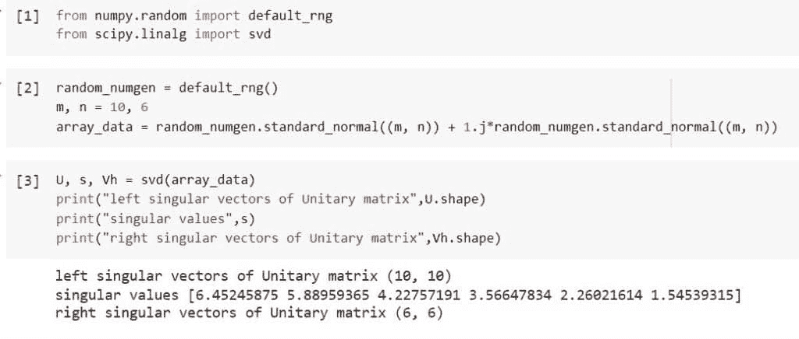
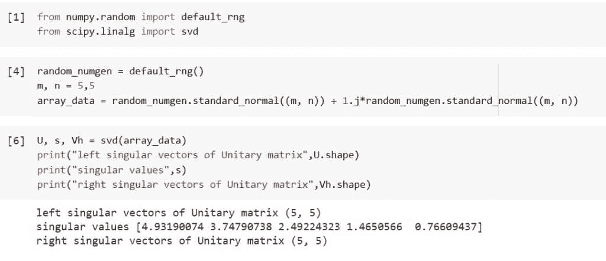
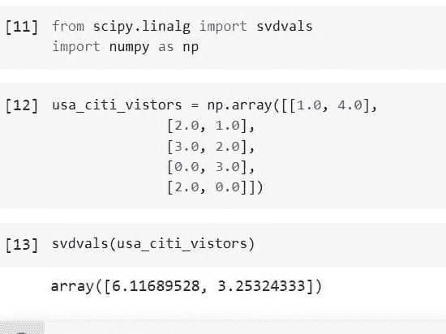
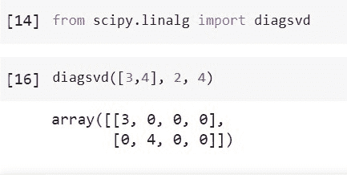
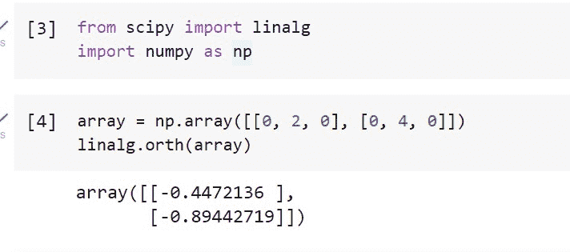
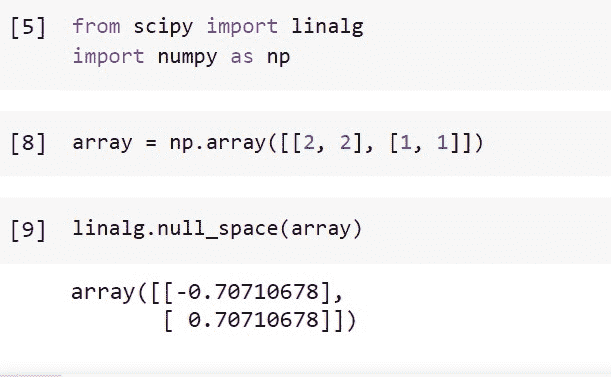

# 使用 Python Scipy Linalg Svd

> 原文：<https://pythonguides.com/python-scipy-linalg-svd/>

[](https://sharepointsky.teachable.com/p/python-and-machine-learning-training-course)

我们将学习“`*Python Scipy Linalg Svd*`”计算数据的奇异值分解以及如何实现。此外，我们将讨论以下主题。

*   什么是 SVD？
*   如何使用 Svd()方法计算奇异值分解
*   Svd()方法返回的值是什么
*   如何求矩阵奇异值
*   如何使用 Diagsvd()创建 SVD sigma 矩阵
*   Python Scipy Linalg Orth
*   Python Scipy Linalg Svd Null_space

目录

[](#)

*   [什么是奇异值分解？](#What_is_SVD "What is SVD?")
*   [Python Scipy Linalg Svd](#Python_Scipy_Linalg_Svd "Python Scipy Linalg Svd")
*   [Python Scipy Linalg Svd 返回](#Python_Scipy_Linalg_Svd_Return "Python Scipy Linalg Svd Return")
*   [Python Scipy Linalg Svd 的虚数](#Python_Scipy_Linalg_Svd_Vals "Python Scipy Linalg Svd Vals")
*   [Python Scipy Linalg Diagsvd](#Python_Scipy_Linalg_Diagsvd "Python Scipy Linalg Diagsvd")
*   [Python Scipy Linalg Orth](#Python_Scipy_Linalg_Orth "Python Scipy Linalg Orth")
*   [Python Scipy Linalg Svd Null_space](#Python_Scipy_Linalg_Svd_Null_space "Python Scipy Linalg Svd Null_space")

## 什么是奇异值分解？

线性代数中的一个关键思想是奇异值分解。奇异值分解(SVD)需要几个相关概念的知识，包括矩阵、矩阵类型、矩阵变换等。，才能被理解。学习矩阵的奇异值分解变得越来越困难，因为这个概念与其他线性代数概念有联系。

在分解过程中，矩阵的唯一值分解为三个独立的矩阵。因此，A = UDV ^T 可用于根据矩阵 A 分解成三个矩阵的乘积来定义矩阵 A 的奇异值分解。

在这种情况下，矩阵 D 是对角的，具有实正项，列 U 和 V 是正交的。在本教程中，我们将学习使用 Python Scipy 的方法计算 SVD。

阅读: [Python Scipy Ndimage Imread 教程](https://pythonguides.com/python-scipy-ndimage-imread/)

## Python Scipy Linalg Svd

Python Scipy 在模块`*`scipy.linalg`*`中有一个方法`*`svd()`*`用于奇异值分解。矩阵 a 被分解成两个酉矩阵 U 和 Vh，以及奇异值(实数，非负)的一维数组 S，使得 a == U @ S @ Vh，其中 S 是具有主对角线 S 的适当形状的零矩阵

下面给出了语法。

```py
scipy.linalg.svd(a, overwrite_a=False, check_finite=True, full_matrices=True, compute_uv=True, lapack_driver='gesdd')
```

其中参数为:

*   **a(array_data，M，N):** 我们要分解的矩阵。
*   **full _ matrix(boolean):**U 和 Vh 如果为真(默认)(N，N)则为(M，M)形。如果为 True，则形式为(M，K)和(K，N)，K 等于最小值(M，N)。
*   **comput_uv():** 是否计算 U 和 Vh 以及 s，默认值为 True。
*   **overwrite_a(boolean):** 是否覆盖*a*；可能会提高性能。默认值为 False。
*   **check_finite(boolean):** 是否确定输入矩阵只有有限个数字。禁用可能会提高性能，但如果输入包含无限或 nan，可能会导致问题(崩溃、非终止)。
*   **lapack_driver:** 是使用通用矩形方法(' gesvd ')计算 SVD，哪个更有效，还是使用分治策略(' gesdd ')。MATLAB 和 Octave 使用“gesvd”技术。“gesdd”是默认值。

方法`*`svd()`*`返回 ndarray 类型的 ***`U`(酉矩阵的左奇异向量)*** ， ***`s`(奇异值)*** 和 ***`vh`(酉矩阵的右奇异向量)*** 。

让我们以下面的步骤为例:

使用下面的 python 代码导入所需的库或方法。

```py
from numpy.random import default_rng
from scipy.linalg import svd
```

使用下面的代码通过 default_rng 随机数生成器生成一个数据数组。

```py
random_numgen = default_rng()
m, n = 10, 6
array_data = random_numgen.standard_normal((m, n)) + 1.j*random_numgen.standard_normal((m, n))
```

使用下面的代码对上述数据使用方法`*`svd()`*`。

```py
U, s, Vh = svd(array_data)
print("left singular vectors of Unitary matrix",U.shape)
print("singular values",s)
print("right singular vectors of Unitary matrix",Vh.shape)
```



Python Scipy Linalg Svd

这就是如何使用 Python Scipy 的方法`*`svd()`*`计算数组的奇异值分解。

阅读:[如何使用 Python Scipy 差分进化](https://pythonguides.com/scipy-differential-evolution/)

## Python Scipy Linalg Svd 返回

Python Scipy 的方法`*`svd()`*`返回三个值 **`U`(左奇异向量的列酉矩阵。基于形状为(M，M)或(M，K))的全矩阵**、**、`s`(奇异值按形式(K，)的逆时间顺序排列，其中 K = min (M，N))** 、**、`Vh`(具有右奇异向量行的酉矩阵)。基于全矩阵，形状为(N，N)或(K，N))** 。

而且，这种方法会产生错误: **`LinAlgError`** (如果 SVD 计算未能收敛)。我们已经通过方法`*`svd()`*`了解了上面返回的值。但在这里，我们也将按照以下步骤举一个例子:

使用下面的 python 代码导入所需的库或方法。

```py
from numpy.random import default_rng
from scipy.linalg import svd
```

使用下面的代码通过 default_rng 随机数生成器生成一个数据数组。

```py
random_numgen = default_rng()
m, n = 5,5
array_data = random_numgen.standard_normal((m, n)) + 1.j*random_numgen.standard_normal((m, n))
```

使用下面的代码对上面创建的数组数据应用方法`*`svd()`*`。

```py
U, s, Vh = svd(array_data)
print("left singular vectors of Unitary matrix",U.shape)
print("singular values",s)
print("right singular vectors of Unitary matrix",Vh.shape)
```



Python Scipy Linalg Svd Return

上面的输出显示了 Python Scipy 的方法`*`svd()`*`返回的值。

阅读:[使用 Python Lil_Matrix Scipy](https://pythonguides.com/python-lil_matrix-scipy/)

## Python Scipy Linalg Svd 的虚数

Python Scipy 在模块`*`scipy.linalg`*`中包含一个方法`*`svdvals()`*`，用于计算矩阵的奇异值。

下面给出了语法。

```py
scipy.linalg.svdvals(a, overwrite_a=False, check_finite=True)
```

其中参数为:

*   **a(array_data，M，N):** 我们要分解的矩阵。
*   **overwrite_a(boolean):** 是否覆盖*a*；可能会提高性能。默认值为 False。
*   **check_finite(boolean):** 是否确定输入矩阵只有有限个数字。禁用可能会提高性能，但如果输入包含无限或 nan，可能会导致问题(崩溃、非终止)。

该方法返回 ndarray (min(M，M)) 类型的***】T0(从最低到最高排序的奇异值)。***

让我们以下面的步骤为例:

使用下面的 python 代码导入所需的库或方法。

```py
from scipy.linalg import svdvals
import numpy as np
```

创建一个数组，表示网站“Pythonguides.com”上来自美国城市的访问者的百分比，如来自`New York = 1%`、`Los Angeles = 4%`、`Chicago = 2%`等。

```py
usa_citi_vistors = np.array([[1.0, 4.0],
              [2.0, 1.0],
              [3.0, 2.0],
              [0.0, 3.0],
              [2.0, 0.0]])
```

现在使用下面的代码找出上面创建的数组或矩阵的奇异值。

```py
svdvals(usa_citi_vistors)
```



Python Scipy Linalg Svd Vals

这就是如何使用 Python Scipy 的方法`*`svdvals()`*`计算矩阵的奇异值。

阅读: [Python Scipy 稀疏 Csr_matrix](https://pythonguides.com/python-scipy-sparse-csr_matrix/)

## Python Scipy Linalg Diagsvd

Python Scipy 的方法`*`diagsvd()`*`存在于模块`*`scipy.linalg`*`中，该模块使用奇异值和大小 M，n 创建 SVD sigma 矩阵。

下面给出了语法。

```py
scipy.linalg.diagsvd(s, M, N)
```

其中参数为:

*   **s(array_data，M，N):** 它是一个奇异值。
*   **M(int):** 以 s 为奇异值的矩阵的大小。
*   **N(int):**s 值奇异矩阵的大小。

方法返回 ***`s`(奇异值分解的 S-矩阵)*** 。

让我们以下面的步骤为例:

```py
from scipy.linalg import diagsvd 
```

使用下面的代码为 M = 2 和 N= 4 的计算 svd 传递数组`***[3,4]***`。

```py
from scipy.linalg import diagsvd 
```



Python Scipy Linalg Diagsvd

这就是如何使用 Python Scipy 的方法`*`diagsvd()`*`使用奇异值创建 SVD sigma 矩阵。

阅读: [Python Scipy Lognormal](https://pythonguides.com/python-scipy-lognormal/)

## Python Scipy Linalg Orth

Python Scipy 中模块`*`scipy.linalg`*`的方法`*`orth()`*`,该方法应用 SVD 来为 a 的范围建立标准正交基。

下面给出了语法。

```py
scipy.linalg.orth(A, rcond=None)
```

其中参数为:

*   **A(input_array):** 是输入数组。
*   **recond(float):** 条件数相对。如果奇异值 s 小于 rcond * max(s ),则视为零。浮点 eps * max 为默认值(M，N)。

方法`*`orth()`*`返回***`Q`(K = A 的有效秩，由 rcond 定义。*A)**的一个正交基。

让我们以下面的步骤为例:

使用下面的 python 代码导入所需的方法或库。

```py
from scipy import linalg
import numpy as np
```

创建秩 2 矩阵，并使用下面的代码将矩阵传递给方法`*`orth()`*`。

```py
array = np.array([[0, 2, 0], [0, 4, 0]])  
linalg.orth(array)
```



Python Scipy Linalg Orth

这就是如何使用 Python Scipy 的方法`*`orth()`*`为 A 的值域建立正交基。

阅读: [Python Scipy Butterworth 滤镜](https://pythonguides.com/python-scipy-butterworth-filter/)

## Python Scipy Linalg Svd Null_space

模块`*`scipy.linalg`*`中 Python Scipy 的方法`*`null_space()`*`使用 SVD 为 a 的零空间创建一个标准正交基。

下面给出了语法。

```py
scipy.linalg.null_space(A, rcond=None)
```

其中参数为:

*   **A(input_array):** 是一个输入数组。
*   **recond(float):** 条件数相对。如果奇异值 s 小于 recond * max(s ),则视为零。浮点 eps * max 为默认值(M，N)。

方法`*`null_space()`*`返回***z(K = A 的有效秩，由 rcond 定义。*** 范围的标准正交基。

让我们以下面的步骤为例:

使用下面的 python 代码导入所需的方法或库。

```py
from scipy import linalg
import numpy as np
```

使用下面的代码创建一个数组。

```py
array = np.array([[2, 2], [1, 1]])
```

现在使用下面的代码将上面的数组传递给方法`*`null_space()`*`。

```py
linalg.null_space(array)
```



Python Scipy Linalg Svd Null_space

这就是如何使用 Python Scipy 的方法`*`null_space()`*`使用 SVD 为 A 的零空间创建正交基。

另外，看看更多的 Python SciPy 教程。

*   [Python Scipy 衍生的数组](https://pythonguides.com/python-scipy-derivative-of-array/)
*   [Python Scipy Linalg Eig](https://pythonguides.com/python-scipy-linalg-eig/)
*   [python scipy fccluster](https://pythonguides.com/python-scipy-fcluster/)的开发
*   [Python Scipy 空间距离 Cdist](https://pythonguides.com/python-scipy-spatial-distance-cdist/)
*   [Python Scipy Mann Whitneyu](https://pythonguides.com/python-scipy-mann-whitneyu/)
*   [Python Scipy 特征值](https://pythonguides.com/python-scipy-eigenvalues/)

我们已经介绍了如何使用 Python Scipy 的方法`*`svd()`*`找到奇异值分解，还学习了如何通过应用不同的方法(如 diagsvd()、orth())来创建正交基。并涵盖了以下主题。

*   什么是 SVD？
*   如何使用 Svd()方法计算奇异值分解
*   Svd()方法返回的值是什么
*   如何求矩阵奇异值
*   如何使用 Diagsvd()创建 SVD sigma 矩阵
*   Python Scipy Linalg Orth
*   Python Scipy Linalg Svd Null_space

[Saurabh](https://pythonguides.com/author/saurabh/)

我叫 Kumar Saurabh，是一名 Python 开发人员，在 TSInfo Technologies 工作。此外，像 Python 编程，SciPy，机器学习，人工智能等技术的专业知识。是我喜欢做的事情。