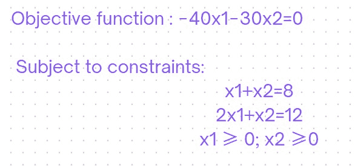
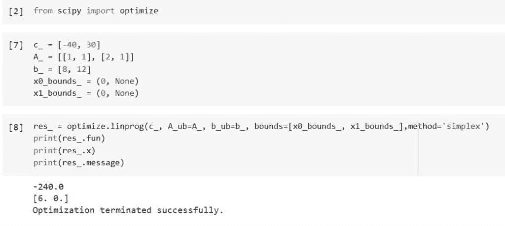

# 如何使用 Python Scipy Linprog

> 原文：<https://pythonguides.com/python-scipy-linprog/>

[](https://sharepointsky.teachable.com/p/python-and-machine-learning-training-course)

通过本教程，我们将了解“`*Python Scipy Linprog*`”以及如何将一个数值最大化或最小化作为目标，以及如何利用单纯形等各种技术。，以确定最佳值。我们还将讨论以下主题。

*   什么是线性规划？
*   如何使用 Scipy Linprog 计算不等式或等式的最优值？
*   如何将 Scipy Linprog 与 highs 方法一起使用？
*   如何借助 Linporg 方法中的 bounds 参数指定不等式或等式的界限
*   如何在单纯形法中使用 Scipy Linprog
*   我们能用 Linprog 方法使用稀疏矩阵吗？
*   Scipy Linprog 如何处理不可行解？

目录

[](#)

*   [什么是线性规划？](#What_is_Linear_Programming "What is Linear Programming?")
*   [蟒蛇 scipy linlanguage](#Python_Scipy_Linprog "Python Scipy Linprog")
*   [python scipy linlanguage 的简单性](#Python_Scipy_Linprog_Simplex "Python Scipy Linprog Simplex")
*   [python scipy linlanguage 高等版](#Python_Scipy_Linprog_Highs "Python Scipy Linprog Highs")
*   [Python Scipy Linprog 界限](#Python_Scipy_Linprog_Bounds "Python Scipy Linprog Bounds")
*   [Python Scipy Linprog 稀疏矩阵](#Python_Scipy_Linprog_Sparse_Matrix "Python Scipy Linprog Sparse Matrix")
*   [Python Scipy Linprog 不可行](#Python_Scipy_Linprog_Infeasible "Python Scipy Linprog Infeasible")

## 什么是线性规划？

线性规划是数学中用于在特定约束条件下优化操作的一种技术。在线性规划中，主要目标是最大化或最小化数值。它由线性函数组成，这些函数必须遵守不等式或线性方程形式的约束。

为了确定最佳的资源利用，线性规划被认为是一种关键技术。两个术语，线性和编程，组成了短语“ ***线性编程*** ”几个一次变量之间的联系用“线性”这个词来定义。从一系列选择中选择最佳解决方案的行为被称为“编程”

换句话说，线性规划被视为在满足由线性关系表示的一组条件的同时最大化或缩减给定数学模型的目标函数的方法。线性规划问题的主要目标是找出最佳答案。

在本教程中，我们将利用模块`***[scipy.optimize](https://pythonguides.com/scipy-optimize/)***`的 Python Scipy 方法`*`linprog`*`来解决线性编程问题。

阅读: [Python Scipy 曲线拟合](https://pythonguides.com/python-scipy-curve-fit/)

## 蟒蛇 scipy linlanguage

Python Scipy 在模块`*`scipy.optimize`*`中有一个方法`*`linprog()`*`使用线性目标函数最小化，同时观察等式和不等式约束。

下面给出了语法。

```py
scipy.optimize.linprog(c, b_eq=None, bounds=None, A_ub=None, method='highs',  A_eq=None, b_ub=None, callback=None, options=None, x0=None, integrality=None)
```

其中参数为:

*   **c(1d_array):** 线性目标函数的系数必须最小化。
*   **A_ub(2d_array):** 不等式约束的矩阵。ub 的每一行包含基于线性不等式的 x 上的约束的系数。
*   **b_ub(1d_array):** 不等式的约束向量。每个元素对应的 A_ub @ x 值的上限由该元素表示。
*   **A_eq(2d_array):** 等式约束的矩阵。eq 的每一行包含基于线性等式的 x 上的约束的系数。
*   **b_eq(1d_array):** 等式约束的向量。方程@ x 的每一个元素都必须与方程 b 的一个元素重合。
*   **bounds(sequence):**x 的决策变量的每个分量的下限值和上限值由一系列(min，max)对表示。使用“无”来说明没有边界。默认情况下，边界设置为 0 和 0。如果只给出一个元组(min，max ),所有选择变量的边界将被设置为较低和较高的值。
*   **方法(字符串):**用于以标准形式解决问题的算法。支持以下内容:“highs”(默认)、“highs-ds”、“highs-ipm”、“内点”、“更新的单纯形”和“单纯形”
*   **callback(callable):** 如果指定了回调函数，算法每次迭代至少调用一次。回调函数只能接受一个参数。
*   **options(dict):** 一个可能的求解器的字典。
*   **x0(1d_array):** 将通过优化技术改进的决策变量猜测。该选项目前仅由“修正单纯形”方法使用，并且仅当 x0 代表一个直截了当、似是而非的答案时才能使用。
*   **完整性(1d_array):** 指定每个决策变量受到的完整性限制的类型。

1.  0:连续变量；对完整性没有要求。
2.  1:必须在一定范围内的整数变量是决策变量。
3.  2:决策变量必须在其范围内，或者值为 0。半连续变量
4.  3:半整数变量；结果变量必须取值为 0，或者在限定范围内为整数。
5.  默认情况下，所有变量都是连续的。目前只有“highs”方法将这一论点考虑在内。

***“scipy . optimize . optimize result”***由下面的字段组成，由方法``linprog()``返回。请注意，字段的返回类型可能会根据优化是否成功而改变，因此建议在依赖其他字段之前验证“OptimizeResult.status”。

*   ***x:(1d_array):*** 满足要求同时最小化目标函数的决策变量的值。
*   ***fun(float):*** 目标函数的最优值，c @ x
*   ***slack(1d _ array):***slack 变量(名义上为正)的值，“b ub–A ub @ x。”
*   ***con(1d_array):*** 等式约束(名义上为零)残差，“b eq–A eq @ x。”
*   ***成功(布尔):*** 如果算法找到了最优解，那么语句为真。
*   ***状态(int):*** 表示算法退出状态的整数。 **0:** 优化成功完成。 **1:** 达到迭代上限。这个问题似乎无法解决。这个问题似乎没有边界。 **4:** 数字有问题。
*   ***nit(int):*** 跨所有阶段进行的总重复次数。

让我们采用一个目标函数，通过以下步骤找到它的最佳值:

使用下面的代码导入所需的方法库。

```py
from scipy import optimize
```

使用下面的代码定义不等式及其界限。

```py
c_ = [-1, 3]
A_ = [[-2, 1], [1, 3]]
b_ = [5, 3]
x0_bounds_ = (None, None)
x1_bounds_ = (-2, None)
```

现在使用下面的代码将上面的定义不等式传递给方法`*`linprog()`*`来求解。

```py
res_ = optimize.linprog(c_, A_ub=A_, b_ub=b_, bounds=[x0_bounds_, x1_bounds_])
print(res_.fun)
print(res_.x)
print(res_.message)
```


Python Scipy Linprog

这就是如何使用 Python Scipy 的`*`linprog()`*`方法。

阅读: [Python Scipy Stats Norm](https://pythonguides.com/python-scipy-stats-norm/)

## python scipy linlanguage 的简单性

解决线性规划问题有一个`*`simplex`*`方法，一般来说，不等式是一个有许多约束的函数。多边形是不等式，顶点是不等式的解。

单纯形法是一种将顶点作为潜在解决方案进行评估的系统化过程。通过在图上勾勒出约束，一些简单的优化问题可以得到解决。然而，只有两个变量的不等式系统可以用这种方法解决。在现实世界中，问题经常涉及数百个方程和数千个变量，这可能导致天文数字的极值点。

Python Scipy 方法`*`linprog()`*`接受一个参数`*`method`*`来指定使用哪种方法来解决线性问题。所以这里我们将使用`*`simplex`*`方法来求解 LP。

下面给出了语法。

```py
scipy.optimize.linprog(c, A_ub=None, b_ub=None, A_eq=None, b_eq=None, bounds=None, method='simplex', callback=None, options={'maxiter': 5000, 'disp': False, 'presolve': True, 'tol': 1e-12, 'autoscale': False, 'rr': True, 'bland': False}, x0=None)
```

让我们举一个例子，通过以下步骤使用单纯形法找到目标函数的最优值:

使用下面的 python 代码导入所需的库或方法。

```py
from scipy import optimize
```

定义下面显示的不等式或等式问题。



Python Scipy Linprog Simplex Example

```py
c_ = [-40, 30]
A_ = [[1, 1], [2, 1]]
b_ = [8, 12]
x0_bounds_ = (0, None)
x1_bounds_ = (0, None)
```

现在使用`*`linprog()`*`中的方法`*`simplex`*`找到解决方案。

```py
res_ = optimize.linprog(c_, A_ub=A_, b_ub=b_, bounds=[x0_bounds_, x1_bounds_],method='simplex')
print(res_.fun)
print(res_.x)
print(res_.message)
```



Python Scipy Linprog Simplex

这就是如何使用方法`*`simplex`*`计算目标函数的最优值。

阅读: [Python Scipy Stats 泊松](https://pythonguides.com/python-scipy-stats-poisson/)

## python scipy linlanguage 高等版

Method='simplex '从 1.9.0 版起已被弃用，并将在 SciPy 1.11.0 中被删除。Method='highs '被用来代替它，因为它更快更可靠。

让我们以在上述小节中使用的相同示例为例，通过以下步骤找到目标函数的最优解:

使用下面的 python 代码导入所需的库或方法。

```py
from scipy import optimize
```

定义下面显示的不等式或等式问题。

```py
c_ = [-40, 30]
A_ = [[1, 1], [2, 1]]
b_ = [8, 12]
x0_bounds_ = (0, None)
x1_bounds_ = (0, None)
```

现在使用`*`linprog()`*`中的方法`*`simplex`*`找到解决方案。

```py
res_ = optimize.linprog(c_, A_ub=A_, b_ub=b_, bounds=[x0_bounds_, x1_bounds_],method='highs')
print(res_.fun)
print(res_.x)
```


Python Scipy Linprog Highs

这就是如何使用方法`*`highs`*`计算目标函数的最优值。

Read: [Python Scipy Freqz](https://pythonguides.com/python-scipy-freqz/)

## Python Scipy Linprog 界限

方法`*`linprog()`*`接受一个参数`*`bounds`*`，该参数是 x 中每个元素的最小值和最大值，由一系列(min，max)对指定。如果没有界限，使用 None 来表示。界限通常设置为(0，None)(所有决策变量都是非负的)。

所有决策变量的界限将由提供的单个元组(min，max)设置。

让我们以一个目标函数为例，通过以下步骤调整该函数的边界，以查看该函数的最佳值:

一家美国公司生产了两种不同的电视，一种是彩色的，另一种是黑白的。该公司每周只能生产不超过 150 台。卢比构建黑白集需要 2500，而 Rs。建造一个彩色布景需要 3000 英镑。公司每周生产电视机的成本不应超过 64 万卢比。

如果要制作 Rs，需要生产多少台黑白和彩色电视机。每套 500 卢比。每套颜色 600 元，赚最多的钱？利用 LPP 创造这个。

```py
from scipy.optimize import linprog
```

使用下面的代码定义问题。

*   受限制:
*   x，y ≥ 0(非负约束)
*   x + y ≤ 150(数量限制)
*   2500x+3000y ≤ 640000(成本限制)
*   目标函数:Z = 500x + 600y

```py
c_ = [500, 600]
A_ = [[1, 1], [2500, 3000]]
b_ = [150, 640000]
x0_bounds_ = (0, None)
x1_bounds_ = (0, None)
```

现在使用下面的代码为上面定义的目标函数找到最佳值。

```py
res_ = optimize.linprog(c_, A_ub=A_, b_ub=b_, bounds=[x0_bounds_, x1_bounds_])
print(res_.x)
print(res_.slack)
print(res_.fun)
print(res_.message)
```


Python Scipy Linprog Bounds

再次将 x0_bounds_ = (0，无)和 x1_bounds_ = (0，无)更改为 x0_bounds_ = (3，无)，x1_bounds_ = (3，无)。

```py
c_ = [500, 600]
A_ = [[1, 1], [2500, 3000]]
b_ = [150, 640000]
x0_bounds_ = (3, None)
x1_bounds_ = (3, None)
```


Python Scipy Linprog Bounds-Example

这就是如何使用 Python Scipy 的方法`*`linprog()`*`的参数`bounds`来指定目标函数的期望边界。

阅读: [Python Scipy 最小化](https://pythonguides.com/python-scipy-minimize/)

## Python Scipy Linprog 稀疏矩阵

我们认为创建一个(或两个)密集矩阵来求解一个重要的稀疏线性规划可能不是一个好主意。在求解大型稀疏线性规划时，采用配备有处理大型稀疏线性规划的求解器是至关重要的，同时在不故意创建任何零元素的情况下生成模型也是至关重要的。

在 Python 中创建一个健壮、快速、稀疏的单纯形 LP 解算器来取代 SciPy dense 解算器并不是一件容易的事情。此外，一个纯粹的基于 Python 的求解器可能无法正常工作。虽然不是非常非常大(可能是大的，中等大小的模型是合理的描述)，但是我们希望采用的模型的大小可能保证使用商业解算器，如 Cplex、Gurobi 或 Mosek。

这些问题解决者工作迅速且始终如一(他们解决你抛给他们的任何 LP 问题)。它们都有 Python APIs。学术解决方案是免费的或者相当便宜。

所以最后我们想说稀疏矩阵与 linprog 是不相容的。

阅读: [Python Scipy 指数](https://pythonguides.com/python-scipy-exponential/)

## Python Scipy Linprog 不可行

如果没有可能的解决方案满足所有的限制，或者如果没有可行的解决方案可以创建，那么线性规划是不可行的。不可行性通常表示某种错误，因为无论我们正在建模的实际操作是什么，都必须遵守现实的限制。

这可能是由于不正确的数据值或某些约束规范中的错误造成的。

如果任何标准形式的线性规划都没有最优解，那么这个问题要么是无解的，要么是无界的。如果可行的解决方案存在，简单可行的解决方案也存在。当存在最优解时，存在基本上可行的解也是最优解。

让我们以我们在“Python Scipy Linprog Highs”小节中使用的相同示例为例，按照以下步骤更改绑定值:

使用下面的 python 代码导入所需的库或方法。

```py
from scipy import optimize
```

定义不等式或等式问题，其错误界限如下所示。

```py
c_ = [-40, 30]
A_ = [[1, 1], [2, 1]]
b_ = [8, 12]
x0_bounds_ = (0, -1)
x1_bounds_ = (0, None)
```

现在使用`*`linprog()`*`中的方法`*`simplex`*`找到解决方案。

```py
res_ = optimize.linprog(c_, A_ub=A_, b_ub=b_, bounds=[x0_bounds_, x1_bounds_],method='highs')
print(res_.fun)
print(res_.x)
```


Python Scipy Linprog Infeasible

上述解决方案的状态为 2，表示该问题似乎不可行。

您可能也喜欢阅读下面的 Python Scipy 教程。

*   [Python Scipy 矩阵](https://pythonguides.com/python-scipy-matrix/)
*   [Python Scipy 卷积 2d](https://pythonguides.com/python-scipy-convolve-2d/)
*   [Python Scipy 插值](https://pythonguides.com/python-scipy-interpolate/)
*   [Scipy Ndimage Imread](https://pythonguides.com/python-scipy-ndimage-imread/)
*   [Python Scipy Softmax](https://pythonguides.com/python-scipy-softmax/)
*   [Scipy 正态分布](https://pythonguides.com/scipy-normal-distribution/)
*   [Scipy Ndimage Rotate](https://pythonguides.com/scipy-ndimage-rotate/)
*   [Scipy Misc +示例](https://pythonguides.com/scipy-misc/)

我们在以下主题中介绍了如何计算目标函数的最优值，以及 linprog 如何处理目标函数中的错误或无效值。

*   什么是线性规划？
*   如何使用 Scipy Linprog 计算不等式或等式的最优值
*   如何将 Scipy Linprog 与 highs 方法一起使用？
*   如何借助 Linporg 方法中的 bounds 参数指定不等式或等式的界限
*   如何在单纯形法中使用 Scipy Linprog
*   我们能用 Linprog 方法使用稀疏矩阵吗？
*   Scipy Linprog 如何处理不可行解？

[Bijay Kumar](https://pythonguides.com/author/fewlines4biju/)

Python 是美国最流行的语言之一。我从事 Python 工作已经有很长时间了，我在与 Tkinter、Pandas、NumPy、Turtle、Django、Matplotlib、Tensorflow、Scipy、Scikit-Learn 等各种库合作方面拥有专业知识。我有与美国、加拿大、英国、澳大利亚、新西兰等国家的各种客户合作的经验。查看我的个人资料。

[enjoysharepoint.com/](https://enjoysharepoint.com/)[](https://www.facebook.com/fewlines4biju "Facebook")[](https://www.linkedin.com/in/fewlines4biju/ "Linkedin")[](https://twitter.com/fewlines4biju "Twitter")