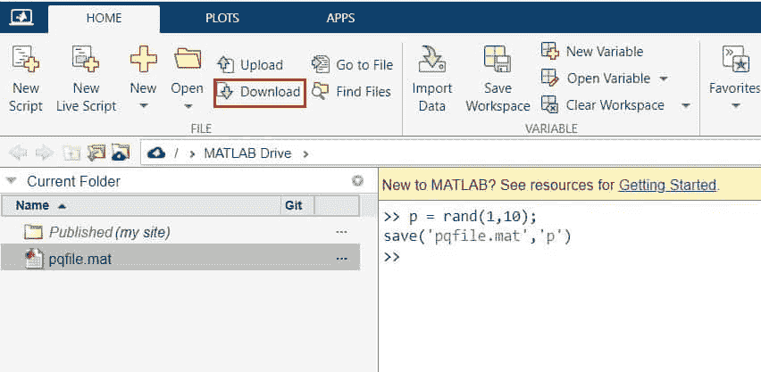
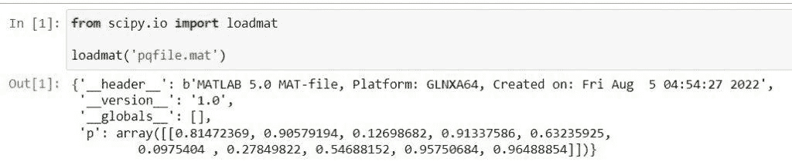
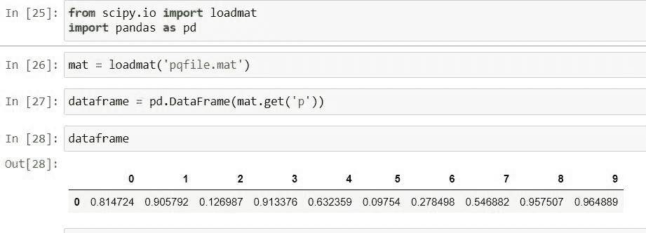
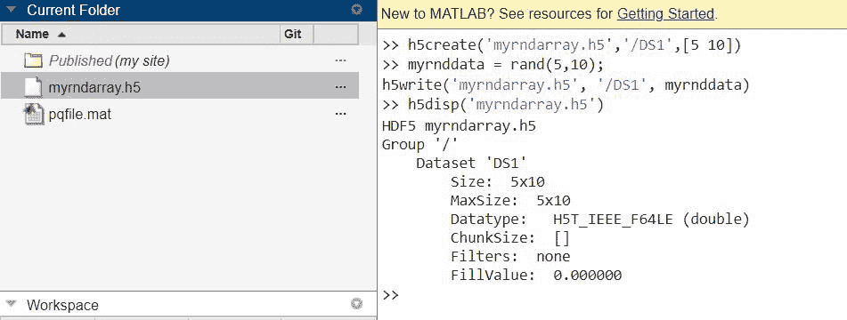
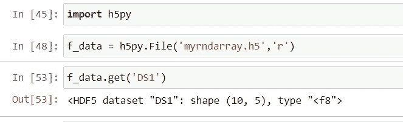
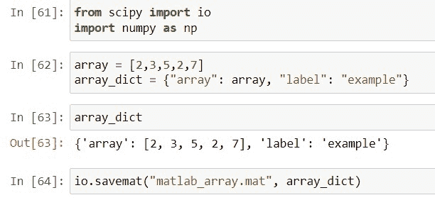
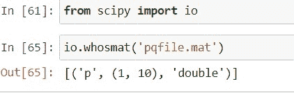

# Python Scipy Load Mat File

> 原文：<https://pythonguides.com/python-scipy-load-mat-file/>

[](https://sharepointsky.teachable.com/p/python-and-machine-learning-training-course)

在本 [Python 教程](https://pythonguides.com/learn-python/)中，我们将学习“ ***Python Scipy 加载 mat 文件*** ”，我们将使用 Python Scipy 的方法加载或读取 Mat 文件，此外还包括以下主题。

*   Python Scipy Load Mat File
*   Python Scipy 加载 Mat 结构
*   Python Scipy 将 Mat 文件加载到数据帧
*   Python Scipy 加载 Mat 文件 Hdf5
*   Python Scipy 保存并加载 Mat 文件
*   Python Scipy Whosmat 文件

还有，查一下相关的 Scipy 教程: [Python Scipy 差分进化](https://pythonguides.com/scipy-differential-evolution/)

目录

[](#)

*   [Python Scipy Load Mat File](#Python_Scipy_Load_Mat_File "Python Scipy Load Mat File")
*   [Python Scipy 加载 Mat 结构](#Python_Scipy_Load_Mat_Struct "Python Scipy Load Mat Struct")
*   [Python Scipy 加载 Mat 文件到数据帧](#Python_Scipy_Load_Mat_File_To_Dataframe "Python Scipy Load Mat File To Dataframe")
*   [Python Scipy 加载 Mat 文件 Hdf5](#Python_Scipy_Load_Mat_File_Hdf5 "Python Scipy Load Mat File Hdf5")
*   [Python Scipy 保存并加载 Mat 文件](#Python_Scipy_Save_And_Load_Mat_File "Python Scipy Save And Load Mat File")
*   [Python Scipy Whosmat 文件](#Python_Scipy_Whosmat_File "Python Scipy Whosmat File")

## Python Scipy Load Mat File

在我们开始之前， ***什么是 mat 文件？*** “，MATLAB 应用程序所使用的二进制数据容器格式由带有“.”的文件表示。mat”分机。该扩展由 Mathworks 创建，MAT 文件被归类为数据文件，因为它们包含变量、数组、函数和其他类型的信息。

Python Scipy 在模块`*`scipy.io`*`中包含了一个方法 ***`loadmat()`*** 来加载 Matlab 文件。

下面给出了语法。

```py
scipy.io.loadmat(file_name, mdict=None, appendmat=True)
```

其中参数为:

*   **文件名(str):** 文件名(如果 appendmat==True，则不带. mat 扩展名)。也可以传递类似打开文件的对象。
*   **mdict(dict):** 输入 matfile 变量的字典。
*   **appendmat(boolean):**If the’。' mat extension '不存在，请将其添加到指定文件名的末尾。默认情况下为 True。

方法`*`loadmat()`*`返回`*`m_dict`*`,它是包含作为值的加载矩阵和作为键的变量名的字典。

让我们按照以下步骤来看一个例子:

去网站`***https://matlab.mathworks.com/***`写下面的代码，将变量`p`的值保存到 Matlab 工作区的文件`pqfile.mat`中。

```py
p = rand(1,10);
save('pqfile.mat','p')
```

运行上述代码后，它生成一个包含变量`p`的文件名`*`pqfile.mat`*`。然后点击下载按钮，将文件下载到您的计算机上。



Python Scipy Load Mat File Example

现在，我们将使用下面的代码通过方法`loadmat()`加载文件。

```py
from scipy.io import loadmat

loadmat('pqfile.mat')
```



Python Scipy Load Mat File

看上面的输出，加载文件`pqfile.mat`后，显示了`header`、`version`、`globals`等信息以及变量`p`的值。

这就是如何使用 Python Scipy 的方法`*`loadmat()`*`加载 mat 文件。

raed:[Python Scipy Stats Norm](https://pythonguides.com/python-scipy-stats-norm/)

## Python Scipy 加载 Mat 结构

我们知道如何使用 Python Scipy 的方法`loadmat()`来加载 mat 文件，现在我们将了解方法`*`loadmat()`*`接受的参数`*`struct_as_record`*`。

***struct _ as _ record(bool):***用 dtype=object 确定是将 MATLAB 结构加载为 NumPy 记录数组还是传统的 NumPy 数组将此值设置为 False 复制了 scipy 0.7 . x 版的行为(返回 NumPy 对象数组)(返回 NumPy 对象数组)。因为它使 MATLAB 文件的往返加载和保存更容易，所以 True 是默认设置。

## Python Scipy 加载 Mat 文件到数据帧

在本节中，我们将加载 mat 文件，并使用 Pandas 的方法`*`Dataframe()`*`将其转换为数据帧。例如，我们将使用我们在上面的***“Python Scipy Load mat File”***小节中创建的同一个 Mat 文件`pqfile.mat`。

让我们使用下面的 python 代码导入所需的库或方法。

```py
from scipy.io import loadmat
import pandas as pd
```

现在使用如下所示的方法`loadmat()`加载文件。

```py
mat = loadmat('pqfile.mat')
```

该方法返回包含信息的字典，该信息以键值对的形式包含变量的名称和它们的值。

访问字典中的变量值。这里我们将使用字典的方法`*`get()`*`,它接受一个键，这个键是一个变量名，返回与给定键相关的值，假设这个键存在于字典中。

并将返回值传递给 Pandas 的方法`*`Dataframe()`*`以将值转换为 dataframe，如下所示。

```py
dataframe = pd.DataFrame(mat.get('p'))
```

使用以下代码查看转换为数据框的 mat 文件。

```py
dataframe
```



Python Scipy Load Mat File To Dataframe

这就是如何在 Python SciPy 中将 mat 文件加载到 dataframe 中。

Read: [Python Scipy Mann Whitneyu](https://pythonguides.com/python-scipy-mann-whitneyu/)

## Python Scipy 加载 Mat 文件 Hdf5

在本节中，我们将使用包 h5py 来加载 mat 文件，因为方法`*`loadmat()`*`不能加载`*`h5`*`类型文件的`*`HDF5`*`。HDF5 二进制数据格式有一个 Pythonic 接口，称为 h5py 包。

它使您能够使用 NumPy 快速简单地处理大量数字数据。例如，保存在磁盘上的多 TB 数据集可以像实际的 NumPy 数组一样进行划分。一个文件可以容纳数千个数据集，每个数据集都根据需要进行分类和标记。

因此，这里我们将加载我们在 Matlab 中使用下面的代码创建的文件`myrndarray.h5`。

```py
>> h5create('myrndarray.h5','/DS1',[5 10])
>> myrnddata = rand(5,10);
h5write('myrndarray.h5', '/DS1', myrnddata)
>> h5disp('myrndarray.h5')
```

现在选择文件并将其下载到您的计算机上。

打开 Jupyter Notebook，使用下面的 python 代码安装软件包`*`h5py`*`。

```py
pip install h5py
```



Python Scipy Load Mat File Hdf5 Example

使用下面的代码导入模块`h5py`。

```py
import h5py
```

读取 Matlab 使用模块`h5py`的方法`*`File()`*`创建的文件`*`myrndarray.h5`*`。

```py
f_data = h5py.File('myrndarray.h5','r')
```

现在使用字典的方法`*`get()`*`通过下面的代码了解文件信息。

```py
f_data.get('DS1')
```



Python Scipy Load Mat File Hdf5

输出显示文件格式 HDF5，键等于 DS1，形状等于`***(10,5)***`。这就是如何读取格式为`*`hdf5`*`或`*`h5`*`的文件。

阅读: [Python Scipy 特征值](https://pythonguides.com/python-scipy-eigenvalues/)

## Python Scipy 保存并加载 Mat 文件

到目前为止，我们已经学习了如何加载 mat 文件，现在在本节中，我们将知道如何保存和加载 mat 文件。为了保存扩展名为`*`.mat`*`的文件，我们将使用模块`*`scipy.io`*`的方法`*`savemat()`*`。

下面给出了语法。

```py
scipy.io.savemat(file_name, mdict, appendmat=True, format='5', long_field_names=False, do_compression=False, oned_as='row')
```

其中参数为:

*   **文件名(str):** 文件名(如果 appendmat==True，则不带. mat 扩展名)。也可以传递类似打开文件的对象。
*   **mdict(dict):** 输入 matfile 变量的字典。
*   **appendmat(boolean):**If the’。' mat extension '不存在，请将其添加到指定文件名的末尾。默认情况下为 True。
*   **format { 4:5 }:**“5”(默认值)用于 MATLAB 版本 5 及更高版本(最高 7.2)，而“4”用于 MATLAB 版本 4.mat 文件。
*   **long _ field _ names(boolean):**False(缺省值)–一个结构的最大字段名长度是 31 个字符，这是已记录的最大长度。诚然，一个结构的最大字段名长度是 63 个字符，这与 MATLAB 7.6+兼容。
*   **do_compression(boolean):** 矩阵压缩应启用或禁用；默认值为 False。
*   **oned_as(row，column):** 如果值为“column”，则将一维 NumPy 数组作为列向量写入如果是“row”，从一维 NumPy 数组创建行向量。

让我们以下面的步骤为例:

使用下面的 python 代码导入所需的库或方法。

```py
from scipy import io
import numpy as np
```

创建一个数组并将该数组传递给一个字典，使用下面的代码创建一个字典。

```py
array = [2,3,5,2,7]
array_dict = {"array": array, "label": "example"}
array_dict
```

现在使用文件名为`matlab_array.mat`的方法`io.savemat()`以 Matlab 风格保存文件。

```py
io.savemat("matlab_array.mat", array_dict)
```

从上面的代码中，我们使用`*`savemat()`*`方法成功地将 mat 文件保存在 Jupyter 笔记本的当前目录中



Python Scipy Save And Load Mat File

要加载保存的 mat 文件`*`matlab_array.mat`*`，请参考“Python Scipy 加载 Mat 文件”小节。

阅读: [Python Scipy 统计峰度](https://pythonguides.com/python-scipy-stats-kurtosis/)

## Python Scipy Whosmat 文件

要查看 mat 文件中的变量，使用模块`*`scipy.io`*`的方法`*`whosmat()`*`。

下面给出了语法。

```py
scipy.io.whosmat(file_name, appendmat=True)
```

其中参数为:

**文件名(str):** 文件名(如果 appendmat==True，则不带. mat 扩展名)。也可以传递类似打开文件的对象。
**appendmat(布尔):**If the’。' mat extension '不存在，请将其添加到指定文件名的末尾。默认情况下为 True。

让我们举一个例子，使用下面的 python 代码导入所需的模块。

```py
from scipy import io
```

现在使用方法`*`whosmat()`*`来检查 mat 文件`*`pqfile.mat`*`中的变量，我们已经在本教程的上述小节**“Python Scipy Load Mat File”**中创建了这个 Mat 文件。

```py
io.whosmat('pqfile.mat')
```



Python Scipy Whosmat File

从输出中，我们可以看到文件`*`pqfile.mat`*`包含一个`*`double`*`类型的变量`*`p`*`。

另外，看看更多的 Python SciPy 教程。

*   [Python Scipy 统计模式](https://pythonguides.com/python-scipy-stats-mode/)
*   [Scipy Butterworth 滤波器](https://pythonguides.com/python-scipy-butterworth-filter/)
*   [Python Scipy Stats Fit](https://pythonguides.com/python-scipy-stats-fit/)
*   [Python Scipy 最小化](https://pythonguides.com/python-scipy-minimize/)
*   [Python Scipy 指数](https://pythonguides.com/python-scipy-exponential/)
*   [Scipy 正态分布](https://pythonguides.com/scipy-normal-distribution/)
*   [Python Scipy 曲线拟合](https://pythonguides.com/python-scipy-curve-fit/)

因此，在本教程中，我们已经了解了“`*Python Scipy Load Mat File*`”并涵盖了以下主题。

*   Python Scipy Load Mat File
*   Python Scipy 加载 Mat 结构
*   Python Scipy 将 Mat 文件加载到数据帧
*   Python Scipy 加载 Mat 文件 Hdf5
*   Python Scipy 保存并加载 Mat 文件
*   Python Scipy Whosmat 文件

[Bijay Kumar](https://pythonguides.com/author/fewlines4biju/)

Python 是美国最流行的语言之一。我从事 Python 工作已经有很长时间了，我在与 Tkinter、Pandas、NumPy、Turtle、Django、Matplotlib、Tensorflow、Scipy、Scikit-Learn 等各种库合作方面拥有专业知识。我有与美国、加拿大、英国、澳大利亚、新西兰等国家的各种客户合作的经验。查看我的个人资料。

[enjoysharepoint.com/](https://enjoysharepoint.com/)[](https://www.facebook.com/fewlines4biju "Facebook")[](https://www.linkedin.com/in/fewlines4biju/ "Linkedin")[](https://twitter.com/fewlines4biju "Twitter")