# Python Scipy Lognormal + 10 个示例

> 原文：<https://pythonguides.com/python-scipy-lognormal/>

[](https://sharepointsky.teachable.com/p/python-and-machine-learning-training-course)

本 [Python 教程](https://pythonguides.com/learn-python/)将教我们如何使用`*Python Scipy log normal*`生成对数正态分布，以及如何使用参数均值和标准差定制分布。并浏览以下主题。

*   什么是对数正态分布？
*   Python Scipy Lognormal
*   Python Scipy 对数正态平均值
*   Python Scipy 对数正态随机
*   Python Scipy 对数正态样本
*   Python Scipy 对数正态形状
*   Python Scipy 对数正态标准差
*   Python Scipy Lognormal Cdf
*   Python Scipy Lognormal Fit
*   Python Scipy Lognormal Pdf
*   Python Scipy Lognormal Log Pdf

目录

[](#)

*   什么是对数正态分布？
*   [Python Scipy Lognormal](#Python_Scipy_Lognormal "Python Scipy Lognormal")
*   [Python Scipy 对数正态平均值](#Python_Scipy_Lognormal_Mean "Python Scipy Lognormal Mean")
*   [Python Scipy 对数正态随机](#Python_Scipy_Lognormal_Random "Python Scipy Lognormal Random")
*   [Python Scipy 对数正态样本](#Python_Scipy_Lognormal_Sample "Python Scipy Lognormal Sample")
*   [Python Scipy 对数正态形状](#Python_Scipy_Lognormal_Shape "Python Scipy Lognormal Shape")
*   [Python Scipy 对数正态标准差](#Python_Scipy_Lognormal_Standard_Deviation "Python Scipy Lognormal Standard Deviation")
*   [Python Scipy Lognormal Cdf](#Python_Scipy_Lognormal_Cdf "Python Scipy Lognormal Cdf")
*   [Python Scipy 对数正态拟合](#Python_Scipy_Lognormal_Fit "Python Scipy Lognormal Fit")
*   [Python Scipy Lognormal Pdf](#Python_Scipy_Lognormal_Pdf "Python Scipy Lognormal Pdf")
*   [Python Scipy log normal log pdf](#Python_Scipy_Lognormal_log_pdf "Python Scipy Lognormal log pdf")
*   [Python Scipy Log normal Log Cdf](#Python_Scipy_Lognormal_Log_Cdf "Python Scipy Lognormal Log Cdf")

## 什么是对数正态分布？

相关正态分布的对数值以对数正态分布的形式进行统计分布。通过使用相关的对数计算，对数正态分布可以转换成正态分布，反之亦然。

结果的对称或钟形概率分布被称为正态分布。在正态分布中，95%的数据在两个标准偏差内，68%的结果在一个标准偏差内。

*   大多数人都熟悉正态分布，但对数正态分布可能不熟悉。对数数学可用于将正态分布转换为对数正态分布。这是主要的基础，因为对数正态分布只能由一组正态分布的随机变量产生。
*   一般来说，正态分布曲线用于绘制使用对数正态分布的随机变量的对数。对数通常被认为是指数，它必须从一个基数开始计算，以获得沿正态分布曲线观察到的随机变量(x)。
*   对数正态分布可以解决正态分布的一些问题。一般来说，虽然对数正态分布只包含正变量，但正态分布也可以包含负随机变量。

对股票价格的研究是对数正态分布最流行的金融应用之一。

正态分布可以用来描绘股票的预期收益。但是对数正态分布可以用来描绘股票的价格变动。

因此，可以利用对数正态分布曲线来更好地确定股票在一段时间内可能经历的复合回报。

在本教程中，我们将使用 Python Scipy 的 lognormal 方法来探索 lognormal 的工作原理并实现它。

阅读: [PyTorch Conv1d](https://pythonguides.com/pytorch-conv1d/)

## Python Scipy Lognormal

Python Scipy 在模块`*`scipy.stats`*`中有一个方法`*`lognorm()`*`，它是一个对数正态的连续随机变量。

下面给出了语法。

```py
scipy.stats.lognorm.method_name(data,loc,size,moments,scale)
```

其中参数为:

*   **数据:**是将均匀采样的数据反映为数值数组的数值或点的集合。
*   **loc:** 用于提供平均值，默认值为 0。
*   **矩:**它用于计算平均值、峰度和标准差等统计数据。
*   **刻度:**用于表示标准差，默认设置为 1。

上面列出的参数作为`*`scipy.stats.lognorm()`*`对象中所有方法的公共参数。下面列出了这些方法。

*   **scipy . stats . log norm . CDF():**用于累计分布函数。
*   **scipy . stats . log norm . pdf():**用于概率密度函数。
*   **scipy . stats . log norm . RVs():**获取随机变量。
*   **scipy . stats . log norm . stats():**用于获取标准差、均值、峰度和偏斜度。
*   **scipy . stats . log norm . log pdf():**用于获取概率密度函数相关的对数。
*   **scipy . stats . log norm . log CDF():**用于查找与累积分布函数相关的日志。
*   **scipy . stats . log norm . SF():**用于获取生存函数值。
*   **scipy . stats . log norm . ISF():**用于获取逆生存函数值。
*   **scipy . stats . log norm . logsf():**用于查找生存函数相关的日志。
*   **scipy . stats . log norm . mean():**用于求分布的平均值。
*   **scipy . stats . log norm . median():**用于求分布的中位数。
*   **scipy . stats . log norm . var():**用于求分布相关的方差。
*   **scipy . stats . log norm . STD():**用于查找与分布相关的标准差

让我们通过下面的步骤来了解一个示例:

使用下面的 python 代码导入所需的库。

```py
from scipy import stats
import matplotlib.pyplot as plt
import numpy as np
%matplotlib inline
```

使用以下代码创建对数正态分布的形状参数。

```py
s_parameter = 0.999
```

使用下面的代码创建一个数据数组。

```py
fig, ax = plt.subplots(1, 1)
array_data = np.linspace(stats.lognorm.ppf(0.02,s_parameter),
                stats.lognorm.ppf(0.98,s_parameter), 99)
```

通过使用下面的代码将带有形状参数的数据数组传递给方法`*`lognorm()`*`来生成对数正态分布

```py
ax.plot(array_data, stats.lognorm.pdf(array_data,s_parameter),
       'r-', lw=5, alpha=0.6, label='truncnorm pdf')
```

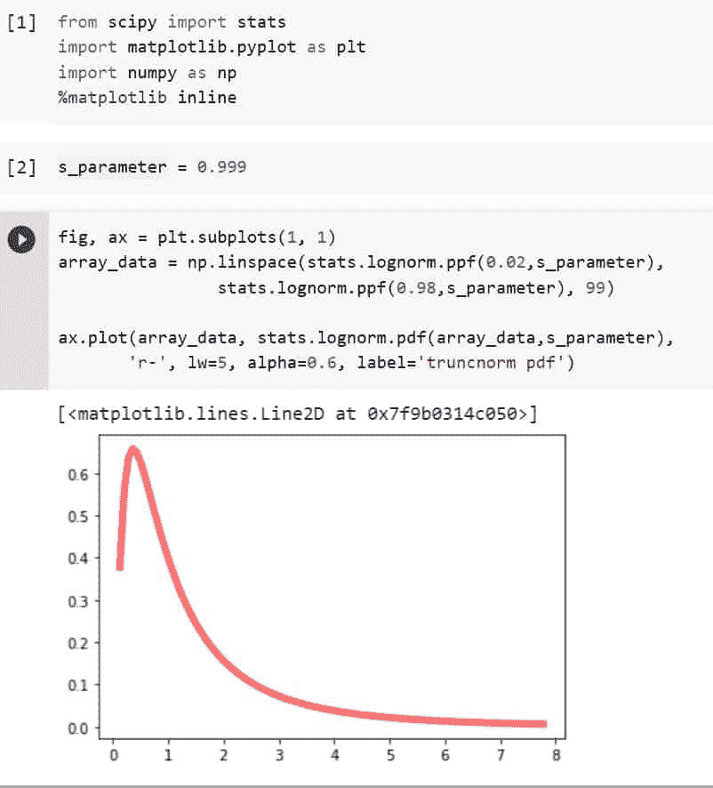

Python Scipy Lognormal

这就是如何使用 Python Scipy 的方法`lognorm()`创建对数正态分布。

阅读: [PyTorch 整形张量](https://pythonguides.com/pytorch-reshape-tensor/)

## Python Scipy 对数正态平均值

Python Scipy 方法`*`lognormal()`*`接受一个参数`*`loc`*`，它是对数正态分布的平均值。使用该参数，我们可以将分布移动到不同的位置。

让我们举个例子，把对数正态分布移到不同的位置。

使用下面的 python 代码导入所需的库或方法。

```py
import numpy as np
from scipy.stats import lognorm
import matplotlib.pyplot as plt
%matplotlib inline
```

使用下面的代码创建一个数据数组。

```py
x_array = np.arange(-5, 5, 0.3)
x_array
```

现在使用下面的代码计算对数正态分布。

```py
y_pdf = lognorm.pdf(x_array,0.1,1)
plt.plot(x_array, y_pdf) 
plt.show() 
```

在上面的代码中，我们提供了一个等于 1 的`loc`值。下面是上面代码的输出，注意分布的位置。

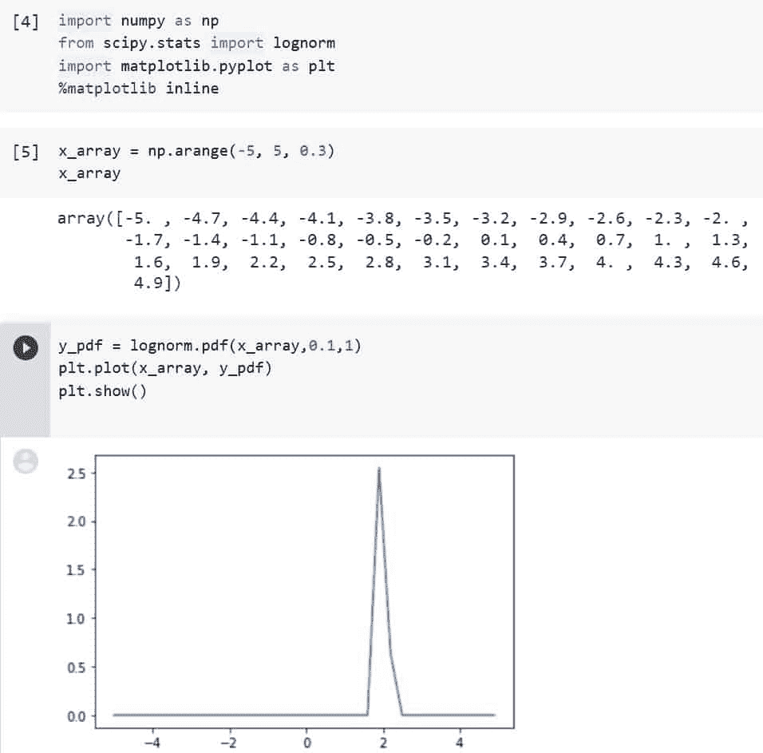

Python Scipy Lognormal Mean Example

现在再次使用相同的代码`loc`等于 0.9，使用下面的代码。

```py
y_pdf = lognorm.pdf(x_array,0.1,0.9)
plt.plot(x_array, y_pdf) 
plt.show()
```

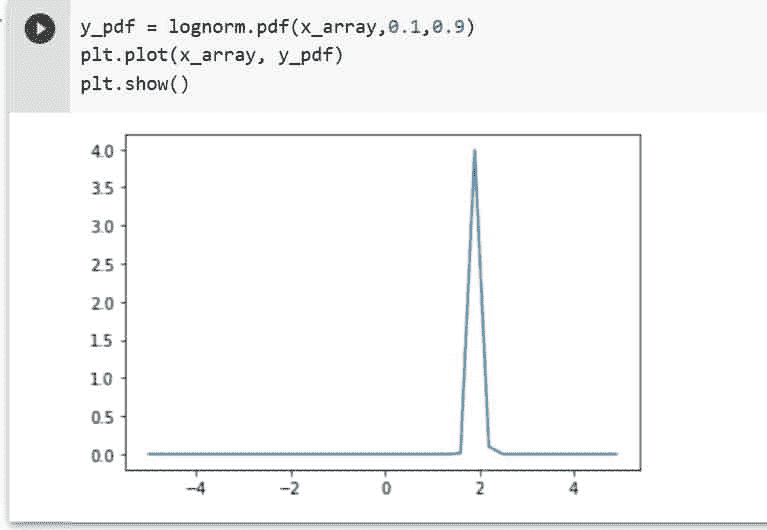

Python Scipy Lognormal Mean

输出显示了分布的不同位置，因此使用参数``loc``或``mean``我们可以控制对数正态分布的位置。

阅读: [PyTorch 线性回归](https://pythonguides.com/pytorch-linear-regression/)

## Python Scipy 对数正态随机

Python 中的 SciPy 库的`*`lognorm()`*`函数可以用来创建一个具有对数正态分布的随机变量。

要创建均值= 1 且标准差= 1 的随机变量对数正态分布，请使用以下 python 代码:

使用下面的代码导入所需的库或方法

```py
import numpy as np
from math import exp
from scipy.stats import lognorm
```

制作一个 2000 值的对数正态分布随机变量。

```py
np.random.seed(1)
lognorm_val = lognorm.rvs(s=1.0, scale=exp(1), size=2000)
```

使用下面的代码检查前十个值。

```py
lognorm_val[:10]
```

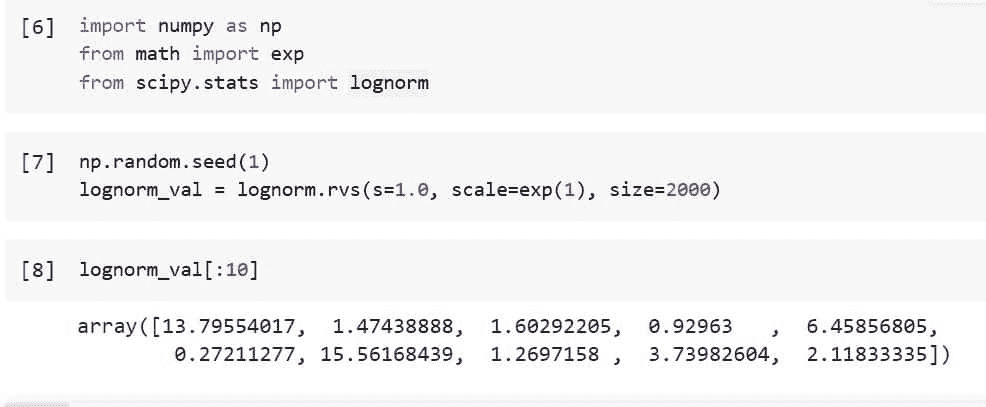

Python Scipy Lognormal Random

这就是如何使用 Python Scipy 的方法`*`lognorm.rvs()`*`生成具有对数正态分布的随机变量值。

阅读: [PyTorch Numpy to Tensor](https://pythonguides.com/pytorch-numpy-to-tensor/)

## Python Scipy 对数正态样本

为了生成随机数作为对数正态分布的样本，在本节中，我们将使用模块`*`scipy.stats`*`中的 Python Scipy 的方法`lognormal.rvs()`。

下面给出了语法。

```py
lognorm.rvs(s, loc=0, scale=1, size=1)
```

其中参数为:

*   **s:** 这是对数正态分布的形状参数。
*   **loc:** 用于提供平均值，默认值为 0。
*   **刻度:**用来表示标准差。
*   **大小:**是样本的大小。

让我们通过下面的步骤，在示例的帮助下生成一个示例:

使用下面的 python 代码导入必要的库或方法。

```py
from scipy.stats import lognorm
```

现在使用下面的代码生成样本数据。

```py
s=0.5
lognorm.rvs(s,size=2000)
```

在上面的代码中，`s`是样本数据的形状参数，等于 0.5，其中`size`是样本大小。

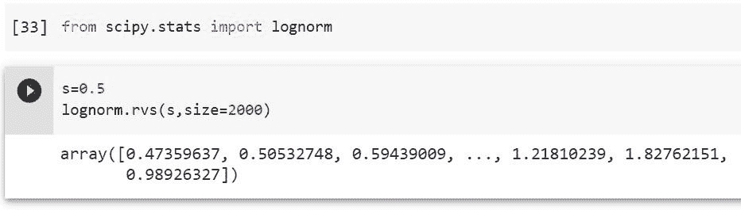

Python Scipy Lognormal Sample

输出显示了包含对数正态分布样本数据的数组，这就是如何使用 Python Scipy 的方法`*`lognorm.rvs()`*`为样本数据生成随机数。

阅读: [PyTorch 激活功能](https://pythonguides.com/pytorch-activation-function/)

## Python Scipy 对数正态形状

对数呈正态分布的概率分布称为对数正态(Galton 或对数正态)分布。如果随机变量的对数呈正态分布，则该变量具有对数正态分布。

具有全正值、低平均值和高变化的偏斜分布通常适合这种分布。值必须是正数，因为 log(x)只能存在于正的 x 值。

形状参数(σ):分布的基本形式也受到对数正态分布的标准差的影响。通常，历史数据用于确定这些因素。

有时，我们也许能够使用最新的数据来预测它。图形的位置或高度不受形状参数的影响；只是改变了整体形状。

在本教程的上述小节中，我们已经了解了如何调整该参数以获得所需的对数正态分布。

## Python Scipy 对数正态标准差

Python Scipy 方法`*`lognormal()`*`接受参数`*`scale`*`，该参数是对数正态分布的标准偏差。使用这个参数，我们可以改变分布的形状。

让我们举个例子，改变对数正态分布的形状。

使用下面的 python 代码导入所需的库或方法。

```py
import numpy as np
from scipy.stats import lognorm
import matplotlib.pyplot as plt
%matplotlib inline
```

使用下面的代码创建一个数据数组。

```py
x_array = np.arange(-5, 5, 0.3)
x_array
```

现在使用下面的代码计算对数正态分布。

```py
y_pdf = lognorm.pdf(x_array,0.5,1)
plt.plot(x_array, y_pdf) 
plt.show() 
```

在上面的代码中，我们提供了一个等于 0.5 的`scale`值。下面是上面代码的输出，注意分布的形状。

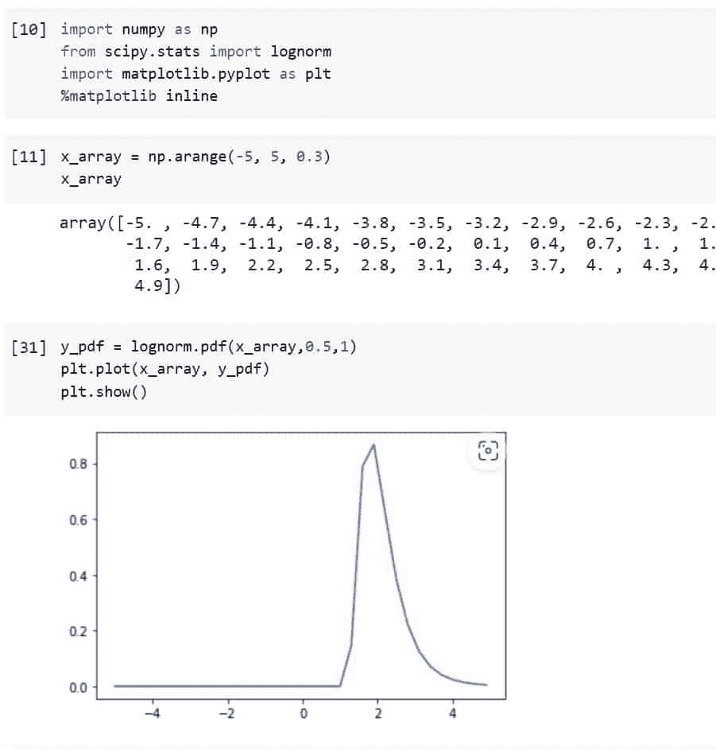

Python Scipy Lognormal Standard Deviation Example

现在使用下面的代码再次使用等于 1 的相同代码`scale`。

```py
y_pdf = lognorm.pdf(x_array,1,1)
plt.plot(x_array, y_pdf) 
plt.show()
```

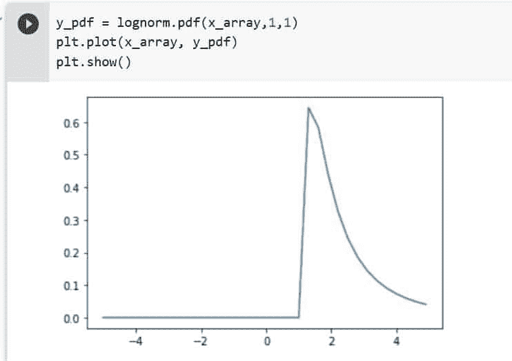

Python Scipy Lognormal Standard Deviation

输出显示了分布的不同形状，因此使用参数`*`scale`*`或``*standard deviation*``我们可以控制对数正态分布的形状。

阅读: [PyTorch MNIST 教程](https://pythonguides.com/pytorch-mnist/)

## Python Scipy Lognormal Cdf

Python Scipy 有一个计算对数正态分布的方法`lognorm.cdf()`。

让我们通过下面的步骤来了解一个示例:

使用下面的 python 代码导入所需的库。

```py
from scipy import stats
import matplotlib.pyplot as plt
import numpy as np
%matplotlib inline
```

使用下面的代码创建一个数据数组。

```py
x_array = np.arange(-10, 10, 0.3)
x_array
```

通过使用下面的代码将数据数组传递给方法`*`lognorm()`*`来生成对数正态累积分布

```py
y_pdf = lognorm.cdf(x_array,1,1)
plt.plot(x_array, y_pdf) 
plt.show()
```

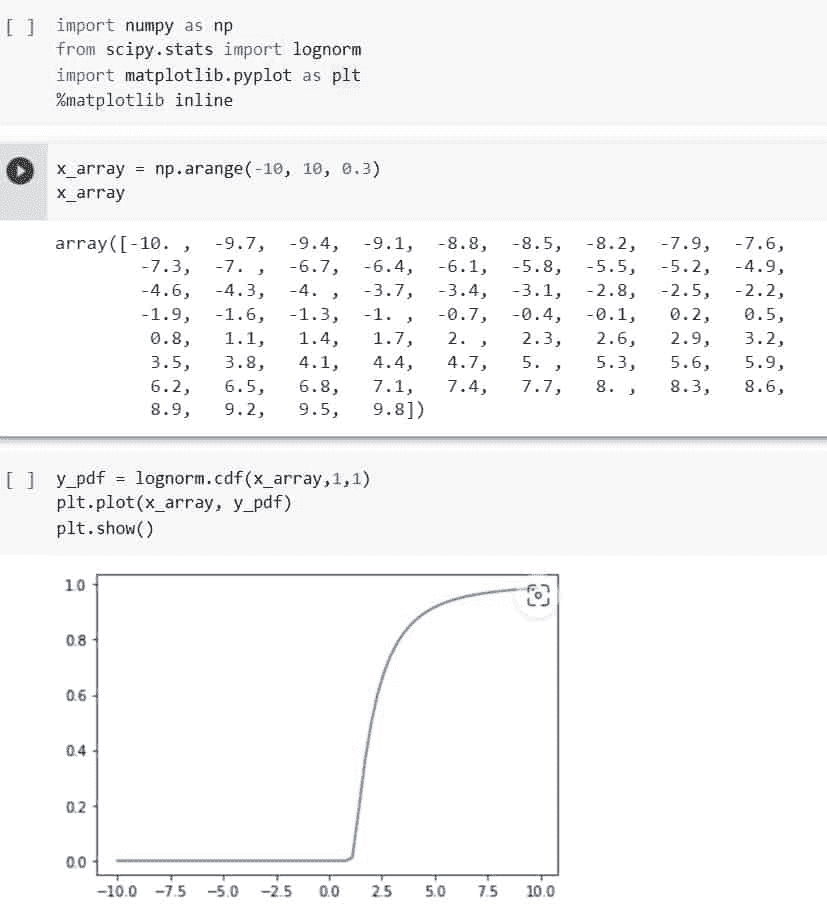

Python Scipy Lognormal Cdf

这就是如何使用 Python Scipy 的方法`*`lognorm.cdf()`*`计算 lognormal 的 CDF。

Raed: [PyTorch 二元交叉熵](https://pythonguides.com/pytorch-binary-cross-entropy/)

## Python Scipy 对数正态拟合

Python Scipy 包含一个方法`*`lognormal.fit()`*`来使数据符合对数正态分布。

在本节中，我们将按照以下步骤使数据符合对数正态分布:

使用下面的 python 代码导入所需的库或方法。

```py
from scipy import stats
```

使用对数正态分布生成一些数据，并创建随机变量。

```py
s=0.5
x_data = stats.lognorm.rvs(s size=700, random_state=120)
```

现在使用下面的代码来拟合这三个参数。

```py
shape_loc, loc_param, scale_param = stats.lognorm.fit(x_data)
print(shape_loc)
print(loc_param)
print(scale_param)
```

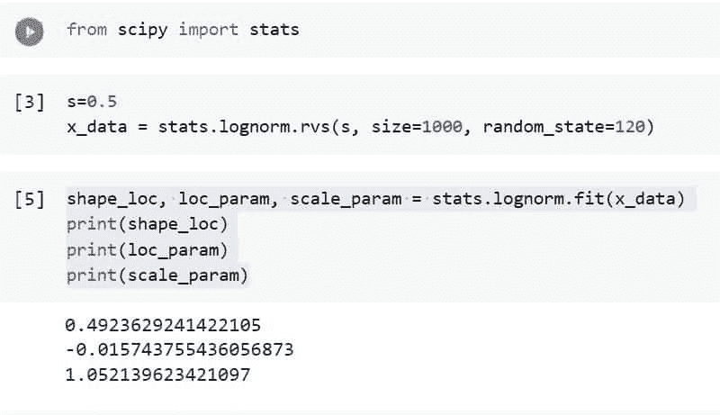

Python Scipy Lognormal Fit

这就是如何使用 Python Scipy 的方法`*`lognorm.fit()`*`使数据符合对数正态分布。

阅读: [PyTorch 数据加载器+示例](https://pythonguides.com/pytorch-dataloader/)

## Python Scipy Lognormal Pdf

Python Scipy 有一个方法 ***`lognorm.pdf()`*** 来计算对数正态的概率分布。

让我们通过下面的步骤来了解一个示例:

使用下面的 python 代码导入所需的库。

```py
from scipy import stats
import matplotlib.pyplot as plt
import numpy as np
%matplotlib inline
```

使用下面的代码创建一个数据数组。

```py
x_array = np.arange(-5, 5, 0.5)
x_array
```

通过使用下面的代码将数据数组传递给方法`*`lognorm.pdf()`*`来生成对数正态 pdf。

```py
y_pdf = stats.lognorm.pdf(x_array,0.8,0.8)
plt.plot(x_array, y_pdf) 
plt.show()
```

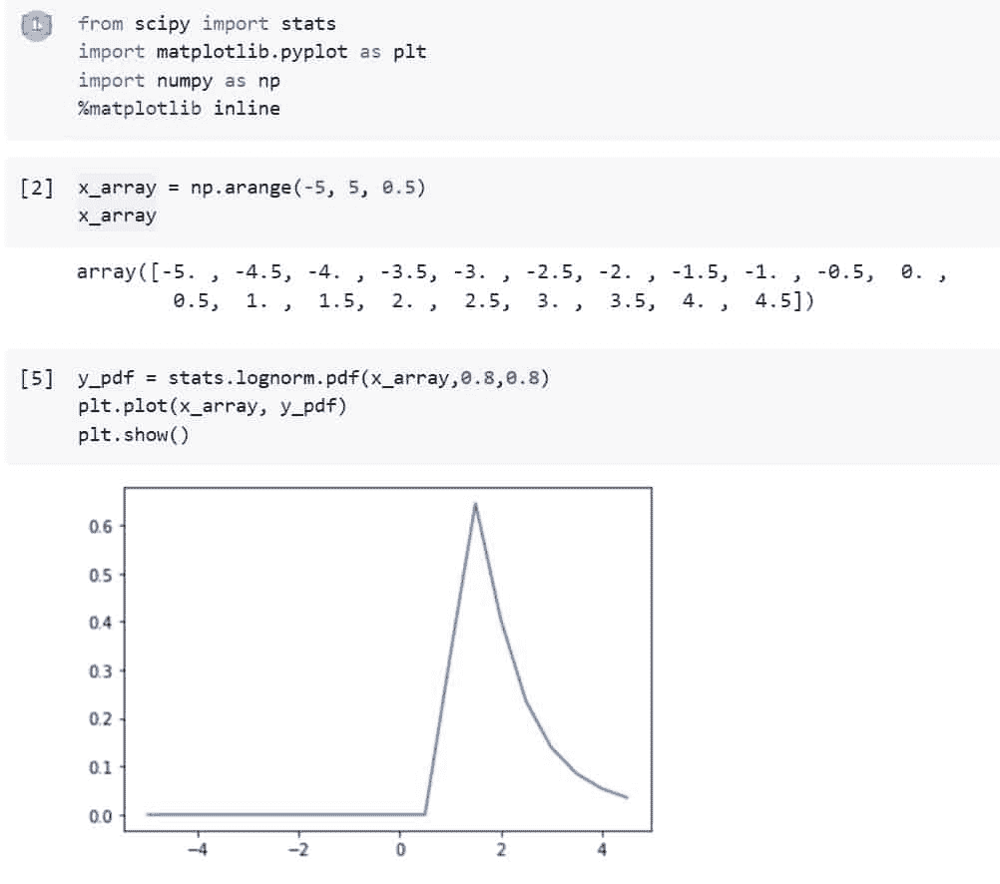

Python Scipy Lognormal Pdf

这就是如何使用 Python Scipy 的方法`*`lognorm.pdf()`*`计算 lognormal 的 PDF。

阅读: [PyTorch 提前停止+示例](https://pythonguides.com/pytorch-early-stopping/)

## Python Scipy log normal log pdf

Python Scipy 有一个方法 ***`lognorm.logpdf()`*** 计算对数正态的对数概率分布。

让我们通过下面的步骤来了解一个示例:

使用下面的 python 代码导入所需的库。

```py
from scipy import stats
import matplotlib.pyplot as plt
import numpy as np
%matplotlib inline
```

使用下面的代码创建一个数据数组。

```py
x_array = np.arange(-2, 2, 0.2)
x_array
```

通过使用下面的代码将数据数组传递给方法`*`lognorm.logpdf()`*`来生成 lognormal log pdf

```py
y_pdf = stats.lognorm.logpdf(x_array,0.8,0.8)
plt.plot(x_array, y_pdf) 
plt.show()
```

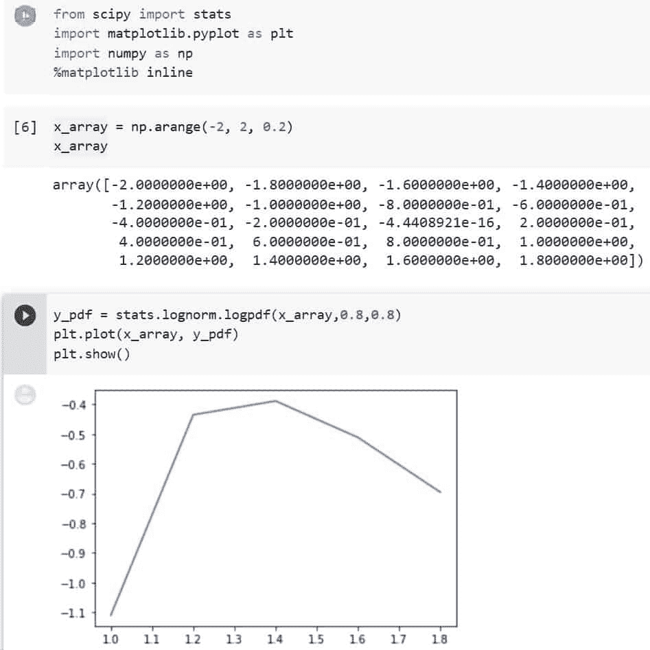

Python Scipy Lognormal log pdf

这就是如何使用 Python Scipy 的方法`*`lognorm.logpdf()`*`计算 lognormal 的 log PDF。

阅读: [PyTorch 预训练模型](https://pythonguides.com/pytorch-pretrained-model/)

## Python Scipy Log normal Log Cdf

Python Scipy 有一个方法 ***`lognorm.logcdf()`*** 计算对数正态的对数累积分布。

让我们通过下面的步骤来了解一个示例:

使用下面的 python 代码导入所需的库。

```py
from scipy import stats
import matplotlib.pyplot as plt
import numpy as np
%matplotlib inline
```

使用下面的代码创建一个数据数组。

```py
x_array = np.arange(-3, 3, 0.2)
```

通过使用下面的代码将数据数组传递给方法`*`lognorm.logcdf()`*`来生成 lognormal log cdf

```py
s=1.5
y_pdf = stats.lognorm.logcdf(s,x_array,0.8,0.8)
plt.plot(x_array, y_pdf) 
plt.show()
```

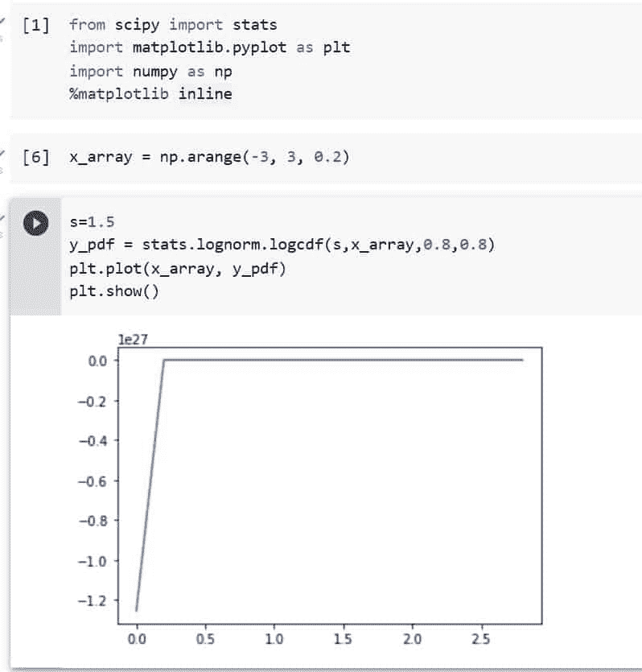

Python Scipy Lognormal Log Cdf

这就是如何使用 Python Scipy 的方法`*`lognorm.logcdf()`*`计算 lognormal 的 log CDF。

您可能也喜欢阅读下面的 Python Scipy 教程。

*   [PyTorch 负载模型+示例](https://pythonguides.com/pytorch-load-model/)
*   [使用 Python Scipy Linalg Svd](https://pythonguides.com/python-scipy-linalg-svd/)
*   [Python Scipy 稀疏 Csr_matrix](https://pythonguides.com/python-scipy-sparse-csr_matrix/)
*   [PyTorch nn 线性+示例](https://pythonguides.com/pytorch-nn-linear/)
*   [交叉熵损失 PyTorch](https://pythonguides.com/cross-entropy-loss-pytorch/)

因此，在本教程中，我们已经生成了对数正态分布，还使用参数形状和位置(标准差和平均值)控制了分布，并涵盖了以下主题。

*   什么是对数正态分布？
*   Python Scipy Lognormal
*   Python Scipy 对数正态平均值
*   Python Scipy 对数正态随机
*   Python Scipy 对数正态样本
*   Python Scipy 对数正态形状
*   Python Scipy 对数正态标准差
*   Python Scipy Lognormal Cdf
*   Python Scipy Lognormal Fit
*   Python Scipy Lognormal Pdf
*   Python Scipy Lognormal Log Pdf

[Bijay Kumar](https://pythonguides.com/author/fewlines4biju/)

Python 是美国最流行的语言之一。我从事 Python 工作已经有很长时间了，我在与 Tkinter、Pandas、NumPy、Turtle、Django、Matplotlib、Tensorflow、Scipy、Scikit-Learn 等各种库合作方面拥有专业知识。我有与美国、加拿大、英国、澳大利亚、新西兰等国家的各种客户合作的经验。查看我的个人资料。

[enjoysharepoint.com/](https://enjoysharepoint.com/)[](https://www.facebook.com/fewlines4biju "Facebook")[](https://www.linkedin.com/in/fewlines4biju/ "Linkedin")[](https://twitter.com/fewlines4biju "Twitter")