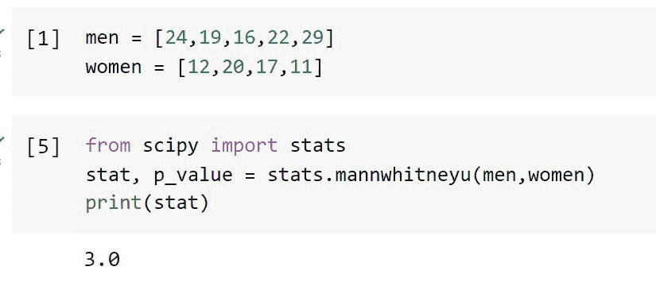
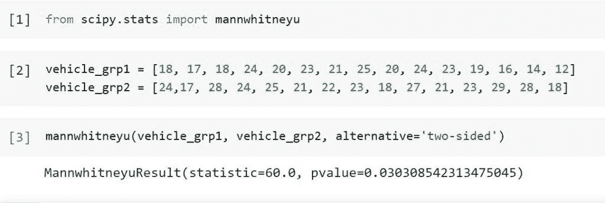
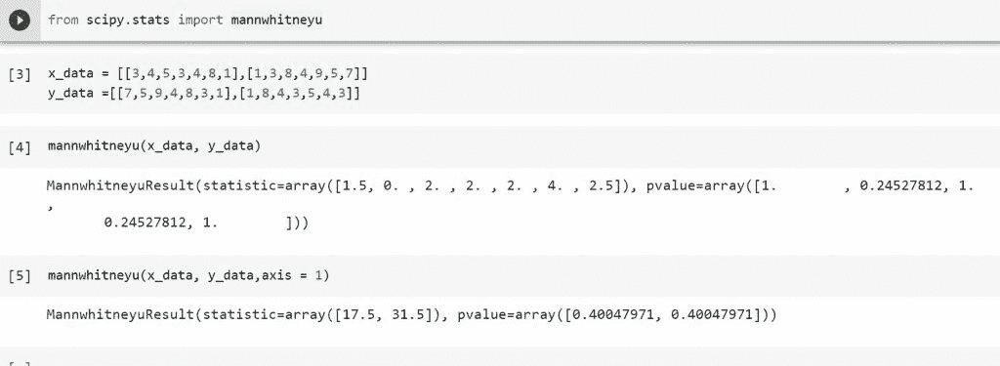

# python scipy Mann Whitney u–有用的教程

> 原文：<https://pythonguides.com/python-scipy-mann-whitneyu/>

[](https://sharepointsky.teachable.com/p/python-and-machine-learning-training-course)

在本 [Python 教程](https://pythonguides.com/learn-python/)中，我们将学习“`*Python Scipy Mann Whitneyu*`”，其中我们将比较样本总体的独立样本，并涵盖以下主题。

*   什么是曼·惠特尼
*   Python Scipy Mann Whitneyu
*   Python Scipy Mann Whitneyu Nan Policy
*   python scipy mann whitney u 示例
*   Python Scipy Mann Whitneyu Axis

另外，查看最新相关教程: [Python Scipy Stats Norm](https://pythonguides.com/python-scipy-stats-norm/)

目录

[](#)

*   [什么是曼·惠特尼](#What_is_Mann_Whitney "What is Mann Whitney")
*   [Scipy Mann Whitneyu](#Scipy_Mann_Whitneyu "Scipy Mann Whitneyu")
*   [Python Scipy Mann Whitneyu Nan Policy](#Python_Scipy_Mann_Whitneyu_Nan_Policy "Python Scipy Mann Whitneyu Nan Policy")
*   [Python Scipy Mann Whitneyu 示例](#Python_Scipy_Mann_Whitneyu_Example "Python Scipy Mann Whitneyu Example")
*   [Python Scipy Mann Whitneyu Axis](#Python_Scipy_Mann_Whitneyu_Axis "Python Scipy Mann Whitneyu Axis")

## 什么是曼·惠特尼

`Mann-Whitney` U 检验，也称为 Wilcoxon 秩和检验，是一种非参数统计假设检验，用于比较有序数据的两个独立样本。该测试随机选取两个样本，用于确定它们是否来自同一人群。

Mann-Whitney U 检验是一种非参数检验，因此它不假设分数将如何分布。但是有一些假设。

1.  人口样本是随机选择的。
2.  相互独立和样本内的独立都是假设。因此，一个特定的观察属于一个组或另一个组(它不能同时属于两个组)。
3.  据信，测量是使用顺序规模。

阅读: [Python Scipy 统计偏差](https://pythonguides.com/python-scipy-stats-skew/)

## Scipy Mann Whitneyu

Python Scipy 在模块`*`scipy.stats`*`中包含一个用于这种测试的方法`*`mannwhitneyu()`*`。

下面给出了语法。

```py
scipy.stats.mannwhitneyu(x, y, alternative='two-sided', use_continuity=False, axis=0, nan_policy='propagate', method='auto')
```

其中参数为:

*   **x，y(array_data):** N-d 样本数组。除了沿轴指定的维度，数组必须是可广播的。
*   **另类:**解释另类假设。“双面”是默认设置。设 F(u)和 G(u)分别代表 x 和 y 的基本分布的累积分布函数。因此，下面的替代假设是可能的`greater`、`two-sided`和`less`。
*   **use_continuity(boolean):** 是否应用连续性校正(1/2)。如果过程是“渐进的”，则缺省值为真；否则，没有影响。
*   **axis(int):** 要计算统计值的输入轴，如果是 int。输出的等效元素将包含输入的每个轴切片(例如，行)的统计数据。如果没有，在计算统计数据之前，输入将被分解。
*   **nan_policy:** 指定如何处理输入中的 nan。

1.  propagate:如果 NaN 出现在沿其计算统计数据的轴切片(例如，行)中，则输出中对应的元素将是 NaN。
2.  NaN 值将不包括在计算中。
    如果沿其计算统计数据的轴切片仍然没有足够的数据，输出中的相关条目将是 NaN。
3.  raise:如果存在 NaN，将引发 ValueError。

*   **方法:**决定如何计算 p 值。“自动”是默认设置。有以下几种选择。

1.  “渐近”:将标准化测试统计值与正态分布进行比较，校正关联性。
2.  ' exact ':通过将观察到的统计量 u 与零假设下 u 统计量的精确分布进行比较，计算精确的 p 值。不对平局进行修正。
3.  ' auto ':当其中一个样本的大小小于 8 并且没有平局时，选择' exact '；否则选择“渐进”。

方法`*`mannwhitneyu()`*`返回 float 类型的 ***`res`(包含统计和 p 值)*** 。

让我们以下面的步骤为例:

假设在 9 名随机选择的年轻人中发现了 II 型糖尿病，他们的年龄如下所示。

```py
men = [24,19,16,22,29]
women = [12,20,17,11]
```

为了确定男性和女性的诊断年龄之间是否存在统计学上的显著差异，我们采用了 Mann-Whitney U 检验。男性诊断年龄的分布必须与女性诊断年龄的分布相匹配，以使零假设成立。

为了拒绝零假设，支持替代方案，即分布是不同的，我们确定 95%的置信水平是必要的。我们可以将观察到的检验统计量与零假设下检验统计量的精确分布进行比较，因为样本很少，数据中也没有联系。

使用下面的 python 代码导入所需的库或方法。

```py
from scipy import stats
stat, p_value = stats.mannwhitneyu(men,women)
print(stat)
```



Scipy Mann Whitney

Mann-Whitney 报告了与第一个样本(在本例中为男性样本)相关的统计数据。这与 U [m] = 3 报道的一致。

阅读: [Python Scipy 统计模式](https://pythonguides.com/python-scipy-stats-mode/)

## Python Scipy Mann Whitneyu Nan Policy

Python Scipy 的方法`*`mannwhitneyu()`*`接受参数`*`nan_policy`*`来处理样本或数据数组中存在的 nan 值。`nan_policy`有三种处理 nan 值的选择或方法，如下所示。

*   省略:NaN 值将不包括在计算中。如果用来计算统计数据的轴切片仍然没有足够的数据，输出中的相关条目将是 NaN。
*   raise:如果存在 NaN，将生成 ValueError。
*   propagate:如果在计算统计数据的轴切片(例如，行)中有 NaN，则输出的对应元素将是 NaN。

让我们通过一个示例来了解在执行 Mann Whitneyu 测试时如何通过以下步骤处理 nan 值:

这里我们将使用我们在上面的“Python Scipy Mann Whitneyu”小节中使用的同一个例子。

使用下面的 python 代码导入所需的库。

```py
from scipy import stats
import numpy as np
```

假设在 9 名随机选择的年轻人中发现了 II 型糖尿病，他们的年龄如下所示。

```py
men = [24,19,np.nan,22,29]
women = [12,20,np.nan,11]
```

看看上面两个包含 nan 值的数组。

现在使用下面的代码在方法`mannwhitneyu`中使用值等于`*`omit`*`的参数`*`nan_policy`*`。

```py
stat, p_value = stats.mannwhitneyu(men,women,)
print(stat)
```

在上面的代码中，value `*`omit`* ignores`是样本或数组中的 nan 值。

Read: [Python Scipy Freqz](https://pythonguides.com/python-scipy-freqz/)

## Python Scipy Mann Whitneyu 示例

我们已经知道，曼-惠特尼检验用于样本数少于 30 且样本分布为非正态的情况，U 检验用于比较两个样本之间的差异。

双样本 t 检验被认为是一种非参数检验。

让我们举一个例子，研究人员想要发现汽油处理是否会影响车辆的平均 mpg。作为测试，测量了 15 辆经过燃料处理的车辆和 12 辆没有经过燃料处理的车辆的 mpg。

为了找出两组之间 mpg 是否有统计学上的显著差异，研究人员决定进行 Mann-Whitney U 检验，因为样本量很小，他们认为样本分布不是正态分布的。

使用下面的 python 代码导入所需的库。

```py
from scipy.stats import mannwhitneyu
```

首先，我们将使用下面的代码创建两个数组来存储每类车辆的 mpg 值。

```py
vehicle_grp1 = [18, 17, 18, 24, 20, 23, 21, 25, 20, 24, 23, 19, 16, 14, 12]
vehicle_grp2 = [24,17, 28, 24, 25, 21, 22, 23, 18, 27, 21, 23, 29, 28, 18]
```

使用以下代码进行曼-惠特尼 U 检验。

```py
mannwhitneyu(vehicle_grp1, vehicle_grp2, alternative='two-sided') 
```



Python Scipy Mann Whitneyu Example

曼-惠特尼 U 检验中使用的无效假设和替代假设如下:

*   H0:这两个组的平均每分钟得分相等。
*   哈:两组的 mpg 不等值。

我们无法接受零假设，因为 p 值(0.2114)远小于 0.05。

这表明没有足够的数据来得出两组之间真正的平均 mpg 不同的结论。

阅读: [Python Scipy 最小化](https://pythonguides.com/python-scipy-minimize/)

## Python Scipy Mann Whitneyu Axis

Python Scipy 的方法`*`mannwhitneyu()`*`有一个参数`*`axis`*`,如果输入是一个整数，它将沿着轴计算统计数据。

让我们以下面的步骤为例:

使用下面的 python 代码导入所需的库。

```py
from scipy.stats import mannwhitneyu
```

使用下面的代码创建一个二维数据 x 和 y。

```py
x_data = [[3,4,5,3,4,8,1],[1,3,8,4,9,5,7]]
y_data =[[7,5,9,4,8,3,1],[1,8,4,3,5,4,3]]
```

使用以下代码对上述数据进行 Mann Whitneyu 测试，轴=0(默认值)。

```py
mannwhitneyu(x_data, y_data)
```

现在，再次使用下面的代码在 axis = 1 的情况下执行测试。

```py
mannwhitneyu(x_data, y_data,axis = 1)
```



Python Scipy Mann Whitneyu Axis

在上面的代码中，我们注意到 axis = 0 和 axis =1 的两个代码的输出有不同的结果。

这就是如何在 Python Scipy 中基于 axis 对给定数据执行 Mann Whiteneyu 测试。

另外，看看更多的 Python SciPy 教程。

*   [Python Scipy 距离矩阵](https://pythonguides.com/scipy-distance-matrix/)
*   [Python Scipy Load Mat File](https://pythonguides.com/python-scipy-load-mat-file/)
*   [Python Scipy 正常测试](https://pythonguides.com/python-scipy-normal-test/)
*   [Python Scipy 指数](https://pythonguides.com/python-scipy-exponential/)
*   [Python Scipy 卡方检验](https://pythonguides.com/python-scipy-chi-square-test/)
*   [Python Scipy 特殊模块](https://pythonguides.com/python-scipy-special/)

因此，在本教程中，我们已经了解了"`*Python Scipy Mann Whitneyu*`"并涵盖了以下主题。

*   什么是曼·惠特尼
*   Python Scipy Mann Whitneyu
*   Python Scipy Mann Whitneyu Nan Policy
*   python scipy mann whitney u 示例
*   Python Scipy Mann Whitneyu Axis

[Bijay Kumar](https://pythonguides.com/author/fewlines4biju/)

Python 是美国最流行的语言之一。我从事 Python 工作已经有很长时间了，我在与 Tkinter、Pandas、NumPy、Turtle、Django、Matplotlib、Tensorflow、Scipy、Scikit-Learn 等各种库合作方面拥有专业知识。我有与美国、加拿大、英国、澳大利亚、新西兰等国家的各种客户合作的经验。查看我的个人资料。

[enjoysharepoint.com/](https://enjoysharepoint.com/)[](https://www.facebook.com/fewlines4biju "Facebook")[](https://www.linkedin.com/in/fewlines4biju/ "Linkedin")[](https://twitter.com/fewlines4biju "Twitter")