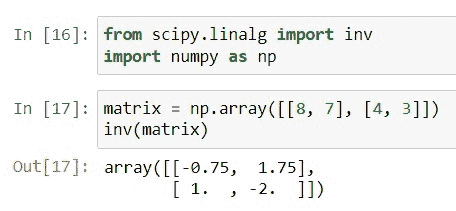
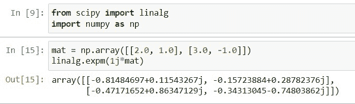
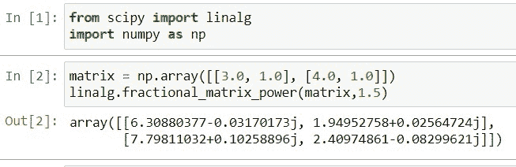
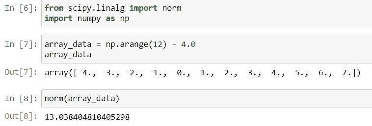
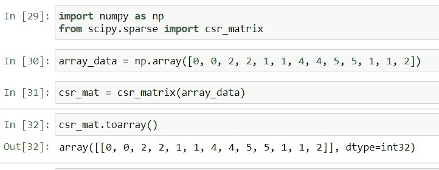
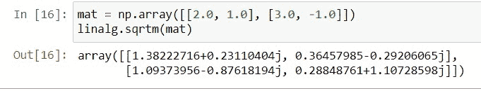

# Python Scipy 矩阵+示例

> 原文：<https://pythonguides.com/python-scipy-matrix/>

[](https://sharepointsky.teachable.com/p/python-and-machine-learning-training-course)

在这个 [Python 教程](https://pythonguides.com/learn-python/)中，我们将学习“ `Scipy Matri` x ”,在这里我们将讨论如何使用 Scipy 对矩阵执行各种不同的操作。我们还将讨论以下主题。

*   Python Scipy 矩阵
*   Python Scipy 矩阵求逆
*   指数矩阵
*   Python Scipy Matrix Power
*   科学矩阵转置
*   Python Scipy 矩阵范数
*   Python Scipy 矩阵到数组
*   科学矩阵平方根

目录

[](#)

*   [Python Scipy 矩阵](#Python_Scipy_Matrix "Python Scipy Matrix")
*   [Python Scipy 矩阵求逆](#Python_Scipy_Matrix_Inverse "Python Scipy Matrix Inverse")
*   [Scipy 矩阵指数](#Scipy_Matrix_Exponential "Scipy Matrix Exponential")
*   [Python Scipy Matrix Power](#Python_Scipy_Matrix_Power "Python Scipy Matrix Power")
*   [Python Scipy 矩阵转置](#Python_Scipy_Matrix_Transpose "Python Scipy Matrix Transpose")
*   [Python Scipy 矩阵范数](#Python_Scipy_Matrix_Norm "Python Scipy Matrix Norm")
*   [Python Scipy Matrix To Array](#Python_Scipy_Matrix_To_Array "Python Scipy Matrix To Array")
*   [Scipy 矩阵平方根](#Scipy_Matrix_Square_Root "Scipy Matrix Square Root")

## Python Scipy 矩阵

[Python Scipy](https://pythonguides.com/what-is-scipy-in-python/) 有两个模块`*`scipy.linalg`*`和`*`scipy.sparse`*`来对矩阵执行不同类型的操作。但首先，我们需要了解“矩阵是什么？”如果你不知道。矩阵是一个二维数组，其中每个数据成员都具有相同的大小。

对于许多数学和科学任务，矩阵是必不可少的数据结构。这里我们将使用 Python 生成一个矩阵，然后对其执行操作。

Python 矩阵是一个二维矩形数组，其中包含记录在自定义二维矩形数组的行和列中的数据。数字、字符串、等式、符号和其他类型的数据都可以在矩阵中找到。

阅读: [Scipy 寻找峰值–有用教程](https://pythonguides.com/scipy-find-peaks/)

## Python Scipy 矩阵求逆

Python SciPy 模块`*`scipy.linalg`*`包含一个计算矩阵逆矩阵的方法`*`inv()`*` 。

下面给出了语法。

```py
scipy.linalg.inv(a, check_finite=False, overwrite_a=True,)
```

其中参数为:

*   ***a(array_data):*** 输入我们要求逆的矩阵。
*   ***覆盖 _a(布尔):*** 覆盖`a`。
*   ***check _ finite(boolean):***检查提供的作为输入的矩阵是否有有限个数字。

方法`*`inv()`*`返回 ndarray 类型的 ***`ainv`(矩阵的逆矩阵)*** 。

让我们以下面的步骤为例:

使用下面的代码导入所需的库。

```py
from scipy.linalg import inv
import numpy as np
```

创建一个矩阵，并用下面的代码求逆。

```py
matrix = np.array([[8, 7], [4, 3]])
inv(matrix)
```



Scipy Matrix Inverse

这就是如何使用 Python Scipy 的方法`*`scipy.linalg.inv()`*`对给定矩阵求逆。

阅读: [Scipy 正态分布](https://pythonguides.com/scipy-normal-distribution/)

## Scipy 矩阵指数

Python SciPy 模块`*`scipy.linalg`*`包含一个方法`*`expm()`*` ，该方法使用 Pade 近似来计算矩阵指数。

下面给出了语法。

```py
scipy.linalg.expm(A)
```

其中参数 *`A`* 接受数组类型的矩阵。

方法`*`expm()`*`返回 ndarray 类型的矩阵 A 的指数。

让我们以下面的步骤为例:

使用下面的 python 代码导入所需的库。

```py
from scipy import linalg
import numpy as np
```

创建一个矩阵，并使用下面的代码计算该矩阵的指数。

```py
mat = np.array([[2.0, 1.0], [3.0, -1.0]])
linalg.expm(1j*mat)
```



Scipy Matrix Exponential

这就是如何使用 Python SciPy 的方法`*`expm()`*`计算给定矩阵的指数。

阅读: [Scipy Ndimage Rotate](https://pythonguides.com/scipy-ndimage-rotate/)

## Python Scipy Matrix Power

Python SciPy 在模块`*`scipy.linalg`*`中有一个方法`*`fractional_matrix_power()`*`来计算矩阵的分数幂。

下面给出了语法。

```py
scipy.linalg.fractional_matrix_power(A, t)
```

其中参数为:

*   ***A(array_data like N，N):*** 输入矩阵求分数幂。
*   ***t(浮点):*** 指定矩阵的分数幂。

方法`*`fractional_matrix_power()`*`返回 ndarray 类型的 ***`x`(矩阵的分数幂)*** 。

让我们举个例子，按照以下步骤计算矩阵的分数幂:

使用下面的代码导入所需的库。

```py
from scipy import linalg
import numpy as np
```

创建一个矩阵，并使用下面的代码计算该矩阵的分数幂。

```py
matrix = np.array([[3.0, 1.0], [4.0, 1.0]])
linalg.fractional_matrix_power(matrix,1.5)
```



Scipy Matrix Power

这就是如何使用 Python SciPy 的方法`*`fractional_matrix_power()`*`计算矩阵的分数幂。

阅读: [Scipy 信号-有用教程](https://pythonguides.com/scipy-signal/)

## Python Scipy 矩阵转置

可以使用 Python SciPy 的模块`*`scipy.sparse.csr_matrix`*`中的方法`transpose()`对矩阵进行转置或反转。

下面给出了语法，

```py
csr_matrix.transpose(axes=None, copy=True)
```

其中参数为:

*   ***轴(可选，无):*** 该参数仅包含在签名中，用于 NumPy 兼容性。应该只传入默认值。
*   ***复制(布尔):*** 可能的话，是否要复制自我方面。取决于所采用的稀疏矩阵的类型，特征被传递的程度是不同的。

方法`*`transpose()`*`返回`p`(转置矩阵)。

阅读: [Scipy 卷积器](https://pythonguides.com/scipy-convolve/)

## Python Scipy 矩阵范数

Python SciPy 模块``scipy.linalg``包含一个返回矩阵范数的方法``norm()``。

下面给出了语法。

```py
scipy.linalg.norm(a, axis=None, ord=None, check_finite=True,  keepdims=True)
```

其中参数为:

*   ***a(array_data):*** 输入数组如果 ord 不为 None，则轴必须为 None，a 必须为一维或二维，如果轴和 ord 都为 None，则返回 a.ravel 2-norm。
*   ***轴(2 元组的 int，int):*** 如果轴是整数，则表示向量范数应该沿其计算的轴。如果轴是二元组，则二维矩阵保存在指定的轴上，并计算这些矩阵的矩阵范数。
*   ***ord(int，inf):*** 用于提供定额订单。
*   ***check _ finite(boolean):***检查提供的作为输入的矩阵是否有有限个数字。
*   ***keep dims(boolean):***如果设置为真，则被赋范的轴作为尺寸为 1 的尺寸留在结果中。

方法`*`norm()`*`返回给定矩阵的范数。

让我们以下面的步骤为例:

使用下面的 python 代码导入所需的库。

```py
from scipy.linalg import norm
import numpy as np
```

创建一个矩阵形式的数据数组，将使用下面的代码计算其范数。

```py
array_data = np.arange(12) - 4.0
array_data
```

使用下面的代码计算上面创建的矩阵或数据数组的范数。

```py
norm(array_data)
```



Scipy Matrix Norm

这就是如何使用 Python SciPy 的方法`*`norm()`*`计算给定矩阵的归一化。

阅读: [Scipy Misc + Examples](https://pythonguides.com/scipy-misc/)

## Python Scipy Matrix To Array

Python Scipy 模块`*`scipy.sparse.csr_matrix`*`包含一个将给定矩阵转换成数组的方法`*`toarray()`*`。

下面给出了语法。

```py
csr_matrix.toarray(order=None, out=None)
```

其中参数为:

*   ***order:*** 用于指定使用哪些 order，如 row-major(C)和 column-major(F)来存储多维数据。默认情况下，它被指定为`None`表示无订单。
*   ***out:*** 用于指定如何像输出缓冲区一样以数组(NumPy.matrix)的形式返回结果，而不是在返回结果的同时创建一个新的数组。

让我们以下面的步骤为例:

使用下面的代码导入必要的库。

```py
import numpy as np
from scipy.sparse import csr_matrix
```

使用下面的代码创建数组。

```py
array_data = np.array([0, 0, 2, 2, 1, 1, 4, 4, 5, 5, 1, 1, 2]) 
```

使用下面的代码创建`csr matrix`。

```py
csr_mat = csr_matrix(array_data)
```

通过使用下面的代码对矩阵`csr_mat`应用方法`toarray()`将`csr matrix`转换为 NumPy 数组矩阵。

```py
csr_mat.toarray()
```



Scipy Matrix To Array

这是如何使用 Python SciPy 的方法`*`toarray()`*`转换给定的矩阵。

阅读: [Scipy Integrate +示例](https://pythonguides.com/scipy-integrate/)

## Scipy 矩阵平方根

Python SciPy 模块`*`scipy.linalg`*`包含一个计算给定矩阵平方根的方法`*`sqrtm()`*`。

下面给出了语法。

```py
scipy.linalg.sqrtm(A, disp=False, blocksize=64)
```

其中参数为:

*   ***A(array_data):*** 输入矩阵求平方根。
*   ***dist(boolean):*** 如果预测结果中的误差很大，则打印警告，而不是返回估计误差。
*   ***bolcksize(整数):*** 如果块大小相对于输入数组大小没有退化，则使用分块算法。

方法`sqrtm`返回 ndarray 类型的 ***`sqrtm`(矩阵的平方根)*** 。

让我们通过下面的步骤来了解一个示例:

使用下面的 python 代码导入所需的库。

```py
from scipy import linalg
import numpy as np
```

创建一个矩阵，用下面的代码计算这个矩阵的平方根。

```py
mat = np.array([[2.0, 1.0], [3.0, -1.0]])
linalg.sqrtm(mat)
```



Scipy Matrix Square root

这是如何使用 Python SciPy 的方法`*`sqrtm()`*`计算给定矩阵的平方根。

另外，看看更多的 Scipy 教程。

*   [Python Scipy 特辑](https://pythonguides.com/python-scipy-special/)
*   [Python Scipy FFT](https://pythonguides.com/python-scipy-fft/)
*   [Scipy Stats–完整指南](https://pythonguides.com/scipy-stats/)
*   [Scipy Sparse–有用的教程](https://pythonguides.com/scipy-sparse/)
*   [Scipy 优化–实用指南](https://pythonguides.com/scipy-optimize/)
*   [Scipy Linalg–实用指南](https://pythonguides.com/scipy-linalg/)

因此，在本教程中，我们借助各种示例学习了“ `Scipy Matrix` ”。此外，我们还讨论了以下主题。

*   Python Scipy Matrix
*   Python Scipy 矩阵求逆
*   指数矩阵
*   Python Scipy Matrix Power
*   科学矩阵转置
*   Python Scipy 矩阵范数
*   Python Scipy 矩阵到数组
*   科学矩阵平方根

[Bijay Kumar](https://pythonguides.com/author/fewlines4biju/)

Python 是美国最流行的语言之一。我从事 Python 工作已经有很长时间了，我在与 Tkinter、Pandas、NumPy、Turtle、Django、Matplotlib、Tensorflow、Scipy、Scikit-Learn 等各种库合作方面拥有专业知识。我有与美国、加拿大、英国、澳大利亚、新西兰等国家的各种客户合作的经验。查看我的个人资料。

[enjoysharepoint.com/](https://enjoysharepoint.com/)[](https://www.facebook.com/fewlines4biju "Facebook")[](https://www.linkedin.com/in/fewlines4biju/ "Linkedin")[](https://twitter.com/fewlines4biju "Twitter")