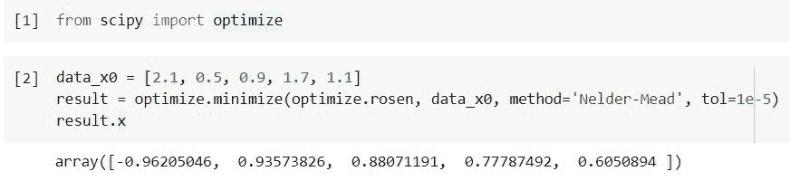
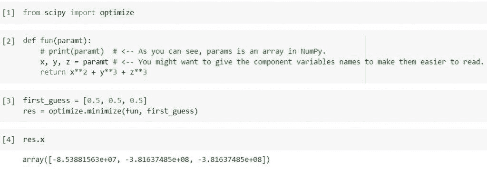
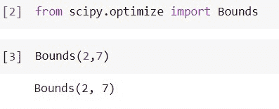
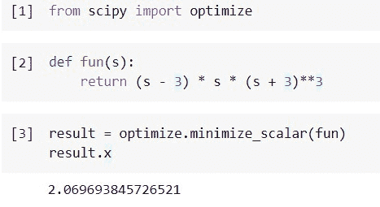

# Python Scipy 最小化[有 8 个例子]

> 原文：<https://pythonguides.com/python-scipy-minimize/>

[](https://sharepointsky.teachable.com/p/python-and-machine-learning-training-course)

在本 [Python 教程](https://pythonguides.com/learn-python/)中，我们将学习“ `Python Scipy Minimize` ”，在这里我们将知道如何找到给定函数的最小值，并涵盖以下主题。

*   Python Scipy 最小化
*   Python Scipy 最小化多个变量
*   Python Scipy 最小化边界
*   Python Scipy 最小化约束
*   Python Scipy 最小化标量
*   Python Scipy 最小化 Powell
*   Python Scipy 最小化不起作用
*   Python Scipy 最小化信任-构造

目录

[](#)

*   [Python Scipy 最小化](#Python_Scipy_Minimize "Python Scipy Minimize")
*   [Python Scipy 最小化多个变量](#Python_Scipy_Minimize_Multiple_Variables "Python Scipy Minimize Multiple Variables")
*   [Python Scipy 最小化界限](#Python_Scipy_Minimize_Bounds "Python Scipy Minimize Bounds")
*   [Python Scipy 最小化约束](#Python_Scipy_Minimize_Constraints "Python Scipy Minimize Constraints")
*   [Python Scipy 最小化标量](#Python_Scipy_Minimize_Scalar "Python Scipy Minimize Scalar")
*   [Python Scipy 最小化鲍威尔](#Python_Scipy_Minimize_Powell "Python Scipy Minimize Powell")
*   [Python Scipy 最小化不起作用](#Python_Scipy_Minimize_Not_Working "Python Scipy Minimize Not Working")
*   [Python Scipy 最小化信任约束](#Python_Scipy_Minimize_Trust-Constr "Python Scipy Minimize Trust-Constr")

## Python Scipy 最小化

[Python Scipy](https://pythonguides.com/what-is-scipy-in-python/) 模块`*`scipy.optimize`*`有一个方法`*`minimize()`*`，它采用一个或多个被最小化的变量的标量函数。

下面给出了语法。

```py
scipy.optimize.minimize(fun, x0, method=None, args=(),  jac=None, hessp=None, hess=None, constraints=(), tol=None, bounds=None, callback=None, options=None)
```

其中参数为:

*   **fun(可调用):**最小化是目标函数。
*   **x0(shape(n)，ndarray):** 第一直觉。真实对象的数组，其中 n 是独立变量的总数，数组的大小是(n，)。
*   **方法(str 或 callable):** 求解器类型应该是 trust-Krylov、Nelder-Mead、CG、Powell、BFGS、L-BFGS-B、TNC、COBYLA、trust-exact、Newton-CG、SLSQP、dogleg、trust-ncg、trust-const。
*   **args(tuple):** 提供给目标函数的导数的附加参数。
*   **jac(bool，cs，2 或 3 point):** 一种计算梯度向量的方法。只针对 BFGS，CG，L-BFGS-B，牛顿-CG，TNC，dogleg，SLSQP，trust-ncg，trust-exact，trust-krylov，trust-constr 如果是可调用的，应该是一个返回梯度向量的函数:“jac(x，*args) - > array_like，shape (n)，”。其中 x 是形状为(n)的数组，args 是固定参数的元组。如果 jac 是布尔值并且为真，则目标函数和梯度被认为是由 fun 返回的。
*   hessp(可调用):目标函数的 Hessian 乘以随机向量 p。具体为牛顿-CG，信任-ncg，信任-克雷洛夫，信任-constr。hessp 或 Hess 只能给一次。如果提供 hess，hesp 将被忽略。Hessian 必须乘以任何使用 hessp 的向量:“hessp(x，p，* args)-> n array shape(n，)”。其中 args 是包含固定参数的元组，p 是维数为(n)的任意向量，x 是(n，)n 数组。
*   赫斯:赫斯矩阵计算方法。仅适用于折线算法、牛顿-CG 算法、信任-NCG 算法、信任-精确算法、信任-克雷洛夫算法和信任-构造算法。如果 Hessian 矩阵是可调用的，它应该会输出这个矩阵:“ess(x，*args) -> {LinearOperator，spmatrix，array}，(n，n)”。其中 args 是固定参数的元组，x 是大小为(n，n)的数组。要为 hessian 的数值估计选择有限差分方案，也可以使用关键字“2 点”、“3 点”和“cs”。
*   constraints(dict，constraint):限制定义。仅与 SLSQP、COBYLA 和 trust-constr 相关。为优化问题指定约束的单个对象或一组对象被称为“信任-约束”约束。可用的约束有:非线性或线性约束。
*   **tol(float):** 结束的容差。提供 tol 时，所选的最小化算法将所有相关的求解器特定容差与 tol 相等。使用特定于规划求解的设置进行精细控制。
*   **界限(界限或序列):**对于 L-BFGS-B、内尔德-米德、TNC、鲍威尔、SLSQP 和 trust-const 技术，变量的界限。边界可以用两种方法之一来指定:类边界的实例，对于 x 中的每个元素，给出一个(min，max)对列表。要指定无边界，请使用单词 none。
*   **callback():** 每次迭代后，调用。它可以用“信任构造”的签名来调用。
*   **选项(dict):** 可能的解算器列表。

方法`*`minimize()`*`返回***`res`(optimizer result 对象用于表示优化结果。解数组 x，success，一个指示优化器是否成功终止的布尔指示，以及解释终止原因的消息，都是*** 的重要特性。

让我们以下面的步骤为例:

让我们考虑一下 Rosenbrock 函数最小化问题。Rosen 使用这个函数及其相应的导数。

使用下面的 python 代码导入所需的方法或库。

```py
from scipy import optimize
```

使用 Nelder-Mead 方法的一个简单方法是使用下面的代码。

```py
data_x0 = [2.1, 0.5, 0.9, 1.7, 1.1]
result = optimize.minimize(optimize.rosen, data_x0, method='Nelder-Mead', tol=1e-5)
result.x
```



Python Scipy Minimize

这就是如何使用方法`*`minimize()`*` Python Scipy 用不同的方法最小化函数。

阅读: [Python Scipy 卡方测试](https://pythonguides.com/python-scipy-chi-square-test/)

## Python Scipy 最小化多个变量

在本节中，我们将手动创建一个方法，该方法将接受几个参数或变量，使用模块`*`scipy.optimize`*`的方法`*`minimize()`*`来查找函数的最小值。按照以下步骤创建方法。

使用下面的 python 代码导入所需的库。

```py
from scipy import optimize
```

使用下面的代码定义方法。

```py
def fun(paramt):
    # print(paramt)  # <-- As you can see, params is an array in NumPy.
    x, y, z = paramt # <-- You might want to give the component variables names to make them easier to read.
    return x`2 + y**3 + z`3
```

定义初始猜测，并使用下面的代码将猜测或函数传递给方法`*`minimize()`*`。

```py
first_guess = [0.5, 0.5, 0.5]
res = optimize.minimize(fun, first_guess)
```

使用下面的代码检查我们在函数中定义的几个变量的结果或值。

```py
res.x
```



Python Scipy Minimize Multiple Variables

这就是如何通过在 Python Scipy 中创建一个方法来找到多个变量的最小值。

阅读: [Python Scipy Matrix +示例](https://pythonguides.com/python-scipy-matrix/)

## Python Scipy 最小化界限

Python Scipy 模块`*`scipy.optimize`*`包含一个方法 Bounds()，它定义了变量的边界约束。

约束采用一般不等式的形式:lb <= x <= ub

下面给出了语法。

```py
scipy.optimize.Bounds(lb, ub, keep_feasible=False)
```

其中参数为:

*   **ub，lb(array_data):** 自变量上下界。每个数组的大小必须与 x 相同，否则它必须是一个标量，在这种情况下，一个界限将平等地应用于所有变量。要修正一个变量，就要使 lb 和 ub 的部分相等。要删除所有或某些变量的边界，请使用 np.inf 和适当的符号。请记住，通过根据需要调整各种 lb 和 ub 组件，可以混合不同类型的约束，如区间、单侧或相等。
*   **keep _ available(boolean):**迭代后是否继续使约束元素可用。该属性是为所有具有单一值的组件设置的。默认值为 False。对平等限制没有影响。

让我们以下面的步骤为例:

导入所需的方法，并使用下面的 python 代码定义界限。

```py
from scipy.optimize import Bounds
```

使用下面的代码定义边界。

```py
Bounds(2,7)
```



Python Scipy Minimize Bounds

这就是如何使用 Python Scipy 的方法`*`Bounds()`*`定义边界。

阅读:[Scipy Linalg–实用指南](https://pythonguides.com/scipy-linalg/)

## Python Scipy 最小化约束

在本节中，我们将创建约束并将约束传递给 Python Scipy 的方法`*`scipy.optimize.minimize()`*`。

使用下面的 python 代码定义约束。

```py
s[0] + s[1] = 1
```

使用下面的代码创建一个必须等于零的函数将是一个等式(type='eq ')约束。

```py
def cont(s):
    return s[0] + s[1] - 1
```

然后，我们使用下面的代码创建一个约束的字典(或者，如果有多个字典，创建一个字典列表)。

```py
constarnt = {'type':'eq', 'fun': cont}
const_real(t):
    return np.sum(np.iscomplex(s))
```

并且确保使用下面的代码提到这两个约束。

```py
constarnt = [{'type':'eq', 'fun': const},
        {'type':'eq', 'fun': const_real}]
```

接下来，我们将约束输入到最小化方法中，如下面的代码所示。

```py
scipy.optimize.minimize(function, data_x0, constraints=constarnt)
```

这就是如何将约束输入到方法`*`minimize()`*`中。

阅读:[Scipy Stats Zscore+Examples](https://pythonguides.com/scipy-stats-zscore/)

## Python Scipy 最小化标量

Python Scipy 模块`*`scipy.optimize.minimize`*`包含一个方法`*`minimize_scalar()`*`，该方法采用一个需要最小化的变量的标量函数。如果您的函数是一个单变量标量函数，您可以使用 minimize_scalar()函数来获取函数的最小值和使其最小的值。

下面给出了语法。

```py
scipy.optimize.minimize_scalar(fun, bounds=None, args=(), bracket=None, method='brent', options=None, tol=None)
```

其中参数为:

*   **fun(可调用):**目标函数。标量必须由标量函数返回。
*   **bounds(sequence):** Bounds 是方法“bounded”的必需参数，必须包含构成优化边界的两项。
*   **args(tuple):** 给予目标函数的附加输入。
*   **括号(序列):**对于方法“golden”和“brent”，括号区间由括号定义，括号可具有三个项目(a、b 和 c)，使得 a b c，和 fun(b) fun(a)，fun(c)，或两个项目(a 和 c)，它们被视为下坡括号搜索的开始区间。并不总是假定解会满足条件 a == x = c。
*   **方法:**求解器类型。应该是金色的，有界的，和布伦特。
*   **选项(dict):** 可能的解算器列表。
*   **tol(float):** 终止的容差。使用特定于规划求解的设置进行精细控制。

方法`*`minimize()`*`返回 ***`res`(一个 OptimizeResult 对象用于表示优化结果)*** 。

让我们通过下面的步骤来了解一个示例:

使用下面的 python 代码导入所需的方法或库。

```py
from scipy import optimize
```

使用下面的代码创建一个我们要最小化的函数。

```py
def fun(s):
    return (s - 3) * s * (s + 3)**3
```

将上面的函数传递给方法`*`minimize_scalar()`*`，使用下面的代码找到最小值。

```py
result = optimize.minimize_scalar(fun)
result.x
```



Python Scipy Minimize Scalar

这就是如何在函数上应用方法`*`minimize_scalar()`*`来寻找最小值。

阅读: [Scipy 信号-有用教程](https://pythonguides.com/scipy-signal/)

## Python Scipy 最小化鲍威尔

我们在上一小节中学习的 Python Scipy 方法`*`minimize()`*`接受了方法`*`Powell`*`，该方法使用 Powell 技术的修改版本来最小化一个或多个变量的标量函数。

下面给出了语法。

```py
scipy.optimize.minimize(fun, x0,method='Powell', bounds=None, 'xtol': 0.0002, 'ftol': 0.0002, 'maxiter': None, 'maxfev': None, 'disp': False, 'direc': None, 'return_all': False})
```

其中参数为:

*   **disp(boolean):** 打印汇聚信息，设置为 True。
*   **xtol(float):** 收敛的 xopt 解中可接受的相对误差。
*   **ftol(浮点):**相对误差为`fun(xopt)`收敛可接受。
*   **maxiter，maxfev(int):** 允许的函数求值和迭代的最大次数。如果既不设置 maxiter 也不设置 maxfev，则默认值为 N*1000，其中 N 是变量的数量。如果 maxiter 和 maxfev 都被设置，当达到第一个值时，最小化过程将结束。
*   **direc(ndarray):** 鲍威尔技术方向向量的初始集合。
*   **return_all(boolean):** 如果选择 True，将列表返回每次迭代的最佳解。

对于其余的参数，请访问本教程的第一部分。

阅读: [Scipy 旋转图像+示例](https://pythonguides.com/scipy-rotate-image/)

## Python Scipy 最小化不起作用

如果我们发现方法`*`minimize()`*`不起作用，这意味着任何提供的输入或参数等都没有以它们应该的方式提供。有时我们提供向量来代替方法的标量，或者无效的参数和函数。

这种错误会产生一个错误或告诉最小化不起作用。为了避免错误，请遵循关于方法`*`minimize()`*`的正确文档，如何使用该方法，以及它接受哪种有效值或参数。出于演示目的，在 [StackOverflow](https://stackoverflow.com/questions/37446666/scipy-minimize-not-working) 上有一个错误。

## Python Scipy 最小化信任约束

trust-exact 方法与 Python Scipy 函数 `*minimize ()*` 兼容，我们在上一节中已经了解过。使用具有几乎精确的函数`*`minimize()`*`的精确信任方法来最小化一个或多个变量的标量函数。

下面给出了语法。

```py
scipy.optimize.minimize(fun, x0, args=(), method='trust-exact', jac=None, hess=None, tol=None, callback=None, options={})
```

其中参数为:

*   **intial_tr_radius(float):** 信赖域的初始半径。
*   **max_tr_radius(float):** 最大值时信赖域的半径。超过该值，将不会建议额外的步骤。
*   **eta(float):** 依赖于信任区域的建议步骤的接受标准。
*   **gtol(float):** 在终止成功之前，梯度范数必须低于 gtol。

关于其他参数，请参考本教程的第一部分。

你可能也喜欢阅读下面的 Python SciPy 教程。

*   [Scipy 优化–实用指南](https://pythonguides.com/scipy-optimize/)
*   [Python Scipy 统计数据偏差](https://pythonguides.com/python-scipy-stats-skew/)
*   [Python Scipy 统计模式示例](https://pythonguides.com/python-scipy-stats-mode/)
*   [Python Scipy Stats multivarial _ Normal](https://pythonguides.com/python-scipy-stats-multivariate_normal/)
*   [Scipy 常量–多个示例](https://pythonguides.com/scipy-constants/)
*   [Scipy Sparse–有用的教程](https://pythonguides.com/scipy-sparse/)
*   [Scipy 旋转图像+示例](https://pythonguides.com/scipy-rotate-image/)

因此，在本教程中，我们学习了“ **Python Scipy 最小化**”并涵盖了以下主题。

*   Python Scipy 最小化
*   Python Scipy 最小化多个变量
*   Python Scipy 最小化边界
*   Python Scipy 最小化约束
*   Python Scipy 最小化标量
*   Python Scipy 最小化 Powell
*   Python Scipy 最小化不起作用
*   Python Scipy 最小化信任-构造

[Bijay Kumar](https://pythonguides.com/author/fewlines4biju/)

Python 是美国最流行的语言之一。我从事 Python 工作已经有很长时间了，我在与 Tkinter、Pandas、NumPy、Turtle、Django、Matplotlib、Tensorflow、Scipy、Scikit-Learn 等各种库合作方面拥有专业知识。我有与美国、加拿大、英国、澳大利亚、新西兰等国家的各种客户合作的经验。查看我的个人资料。

[enjoysharepoint.com/](https://enjoysharepoint.com/)[](https://www.facebook.com/fewlines4biju "Facebook")[](https://www.linkedin.com/in/fewlines4biju/ "Linkedin")[](https://twitter.com/fewlines4biju "Twitter")