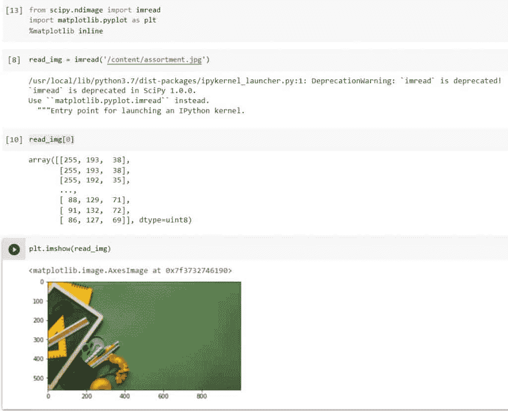
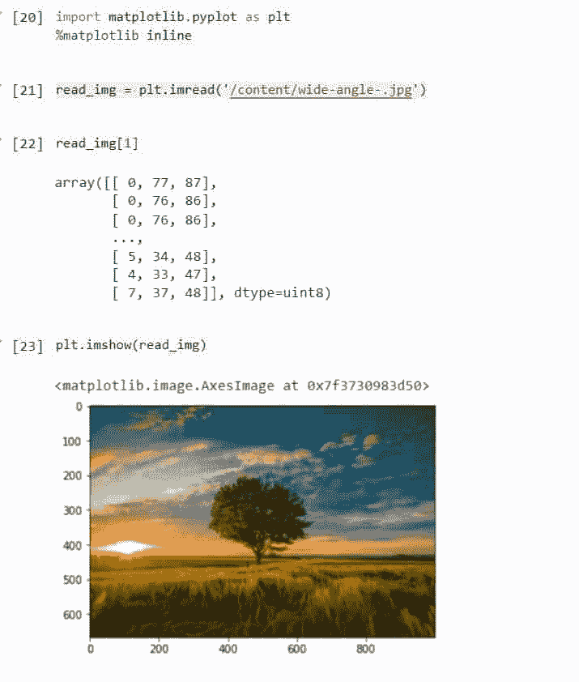
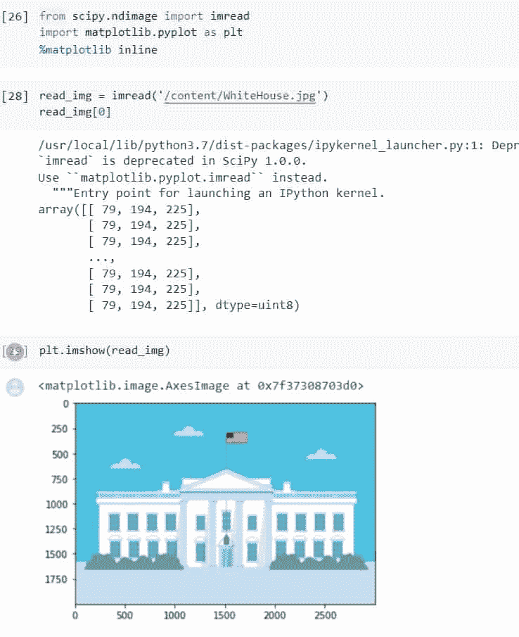
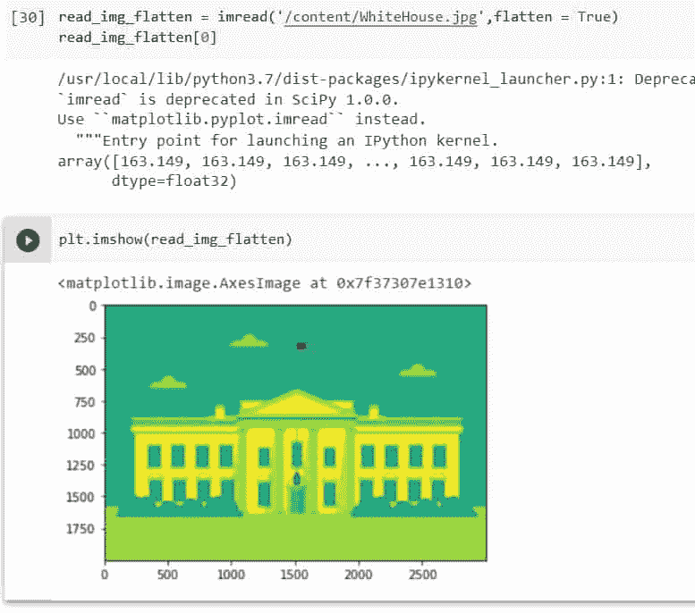
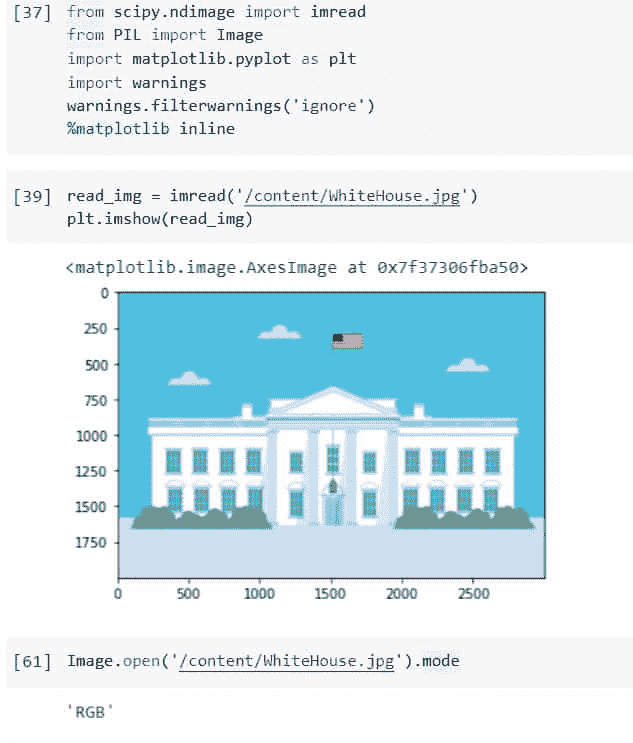
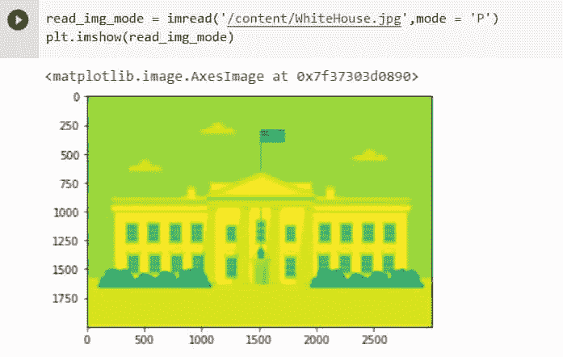

# Python Scipy Ndimage Imread 教程

> 原文：<https://pythonguides.com/python-scipy-ndimage-imread/>

[](https://sharepointsky.teachable.com/p/python-and-machine-learning-training-course)

我们将通过以下主题了解“***”Python Scipy Ndimage Imread***”以数组形式读取图像并展平和更改图像的模式。

*   Python Scipy Ndimage Imread
*   Python Scipy Ndimage Imread 已弃用
*   如何使用 Scipy Ndimage Imread 来展平图像
*   如何更改图像的模式

目录

[](#)

*   [Python Scipy Ndimage Imread](#Python_Scipy_Ndimage_Imread "Python Scipy Ndimage Imread")
*   [Python Scipy Ndimage Imread 已弃用](#Python_Scipy_Ndimage_Imread_Deprecated "Python Scipy Ndimage Imread Deprecated")
*   [python scipy ndimage imread flatten](#Python_Scipy_Ndimage_Imread_Flatten "Python Scipy Ndimage Imread Flatten")
*   [Python Scipy Ndimage Imread 模式](#Python_Scipy_Ndimage_Imread_Mode "Python Scipy Ndimage Imread Mode")

## Python Scipy Ndimage Imread

为了读取图像，Python Scipy 在模块`*`scipy.ndimage`*`中有一个方法`*`imread()`*`。换句话说，Python Scipy 的方法`*`imread()`*`将图像作为数组从文件中读取。

下面给出了语法。

```py
scipy.ndimage.imread(fname, flatten=False, mode=None)
```

其中参数为:

*   **fname(string，file object):** 要读取的文件名或文件对象。
*   **flatten(boolean):** 如果为 True，则将颜色层展平为单一灰度层。
*   **模式(字符串):**图像转换模式，如“RGB”

该方法返回 ndarray 类型的 **`imread`(从图像读取中检索的数组)**。

我们将拍摄一张图像，并按照以下步骤使用方法`*`imread()`*`进行读取:

使用 python 代码导入所需的库或方法。

```py
from scipy.ndimage import imread
import matplotlib.pyplot as plt
%matplotlib inline
```

使用下面的代码以数组形式读取图像。

```py
read_img = imread('https://i0.wp.com/pythonguides.com/content/assortment.jpg')
```

使用下面的代码检查方法`*`imread()`*`的返回值。

```py
read_img[0]
```

现在使用下面的代码，使用方法`*`imshow()`*` matplotlib 将读取的图像作为数组查看。

```py
plt.imshow(read_img)
```



Python Scipy Ndimage Imread

这就是如何使用 Python Scipy 的方法`imread()`读取数组形式的图像。

Read: [Python Scipy Softmax](https://pythonguides.com/python-scipy-softmax/)

## Python Scipy Ndimage Imread 已弃用

方法`*`imread()`*`在 Scipy version = 1.0.0 中被弃用，或者在 Scipy == 1.9.0 的最新稳定版本中不存在。Scipy 社区建议使用`*`matplotlib.pyplot.imread`*`而不是`*`scipy.ndimage.imread`*`。出于演示目的，在上述小节中使用了 Scipy = 1.2.0 的旧版本。

在本节中，我们将使用模块`*`matplotlib.pyplot`*`中的方法`*`imread()`*`来读取图像。

使用 python 代码导入所需的库或方法。

```py
import matplotlib.pyplot as plt
%matplotlib inline
```

使用下面的代码以数组形式读取图像。

```py
read_img = plt.imread('https://i0.wp.com/pythonguides.com/content/wide-angle-.jpg')
```

使用下面的代码检查从方法`*`plt.imread()`*`返回的数组值。

```py
read_img[1]
```

现在使用下面的代码，使用方法`*`imshow()`*` matplotlib 将读取的图像作为数组查看。

```py
plt.imshow(read_img)
```



Python Scipy Ndimage Imread Deprecated

这是如何使用 Python Matplotlib 的方法`*`imread()`*`将图像作为数组读取的。

阅读:[使用 Python Lil_Matrix Scipy](https://pythonguides.com/python-lil_matrix-scipy/)

## python scipy ndimage imread flatten

Python Scipy 的方法`*`imread()`*`接受一个参数`*`flatten`*`，如果为 True，该参数将颜色层展平为一个单一的灰度层。为了将一维数组中的信息输入到分类模型中，使用了一种称为展平的技术来将多维数组转换为一维数组。

在向我们的模型提供数据之前展平图像数组的主要原因是因为多维数组使用更多的内存，而一维数组使用更少的内存。

让我们以下面的步骤为例:

使用 python 代码导入所需的库或方法。

```py
import matplotlib.pyplot as plt
%matplotlib inline
```

以数组形式读取美国白宫的图像，并使用下面的代码检查返回的数组值。

```py
read_img = imread('https://i0.wp.com/pythonguides.com/content/WhiteHouse.jpg')
read_img[0]
```

使用下面的代码，使用方法`*`imshow()`*` matplotlib 将读取的图像作为数组查看。

```py
plt.imshow(read_img)
```



Python Scipy Ndimage Imread Flatten Example

使用下面的代码拼合美国白宫的图像。

```py
read_img_flatten = imread('https://i0.wp.com/pythonguides.com/content/WhiteHouse.jpg',flatten = True)
read_img_flatten[0]
```

现在使用下面的代码查看展平的图像。

```py
plt.imshow(read_img_flatten)
```



Python Scipy Ndimage Imread Flatten

这就是如何通过 Python Scipy 的方法`*`imread()`*`使用参数`*`flatten`*`展平图像。

阅读:[如何使用 Python Scipy Gaussian_Kde](https://pythonguides.com/python-scipy-gaussian_kde/)

## Python Scipy Ndimage Imread 模式

Python Scipy 的方法`*`imread()`*`接受一个参数`*`mode`*`，该参数将图像转换成不同的模式，如`*`RGB`*`。图像的模式是指定每个像素的类型和深度的字符串。每个像素都利用了整个位深度。因此，1 位像素的范围是 0–1，8 位像素的范围是 0–255，依此类推。

imread 使用 Python 图像库(PIL)来读取图像。模式可以是下列字符串之一:

*   **‘L’**(8 位像素，黑白)
*   **【P】**(8 位像素，使用调色板映射到任何其他模式)
*   **【RGB】**(3×8 位像素，真彩色)
*   **【RGBA】**(4×8 位像素，带透明遮罩的真彩色)
*   **【CMYK】**(4×8 位像素，分色)
*   **【YCbCr】**(3×8 位像素，彩色视频格式)
*   **‘I’**(32 位有符号整数像素)
*   **‘F’**(32 位浮点像素)

让我们以下面的步骤为例:

使用 python 代码导入所需的库或方法。

```py
from scipy.ndimage import imread
from PIL import Image
import matplotlib.pyplot as plt
import warnings
warnings.filterwarnings('ignore')
%matplotlib inline
```

使用下面的代码，使用方法`*`imshow()`*` matplotlib 以数组形式读取美国白宫的图像，并以数组形式查看读取的图像。

```py
read_img = imread('https://i0.wp.com/pythonguides.com/content/WhiteHouse.jpg')
plt.imshow(read_img
```

现在使用下面的代码，使用 PIL 库的方法`***Image.open('path_of_image').mode***`检查图像的模式。

```py
Image.open('https://i0.wp.com/pythonguides.com/content/WhiteHouse.jpg').mode
```

上面的代码显示了`*`RGB`*`的图像模式。



Python Scipy Ndimage Imread Mode Example

使用下面的代码将图像模式更改为`*`P`*`。

```py
read_img_mode = imread('https://i0.wp.com/pythonguides.com/content/WhiteHouse.jpg',mode = 'P')
plt.imshow(read_img_mode)
```

上面的代码根据模式`*`P`*`改变图像的颜色。



Python Scipy Ndimage Imread Mode

这就是如何使用 Python Scipy 的方法`*`imread()`*`的参数`*`mode`*`来改变图像的模式。

另外，看看更多的 Python Scipy 教程。

*   [Python Scipy 平滑](https://pythonguides.com/python-scipy-smoothing/)
*   [Python Scipy Linalg Svd](https://pythonguides.com/python-scipy-linalg-svd/)
*   [Python Scipy IIR 滤波器+示例](https://pythonguides.com/python-scipy-iir-filter/)
*   [Python Scipy Butterworth 滤镜](https://pythonguides.com/python-scipy-butterworth-filter/)
*   [Python Scipy 衍生的数组](https://pythonguides.com/python-scipy-derivative-of-array/)
*   [Python Scipy Mann Whitneyu](https://pythonguides.com/python-scipy-mann-whitneyu/)

我们已经讲述了如何读取图像，还学习了如何使用 Python Scipy 方法改变模式或展平图像，主题如下。

*   Python Scipy Ndimage Imread
*   Python Scipy Ndimage Imread 已弃用
*   如何使用 Scipy Ndimage Imread 来展平图像
*   如何更改图像的模式

[Saurabh](https://pythonguides.com/author/saurabh/)

我叫 Kumar Saurabh，是一名 Python 开发人员，在 TSInfo Technologies 工作。此外，像 Python 编程，SciPy，机器学习，人工智能等技术的专业知识。是我喜欢做的事情。