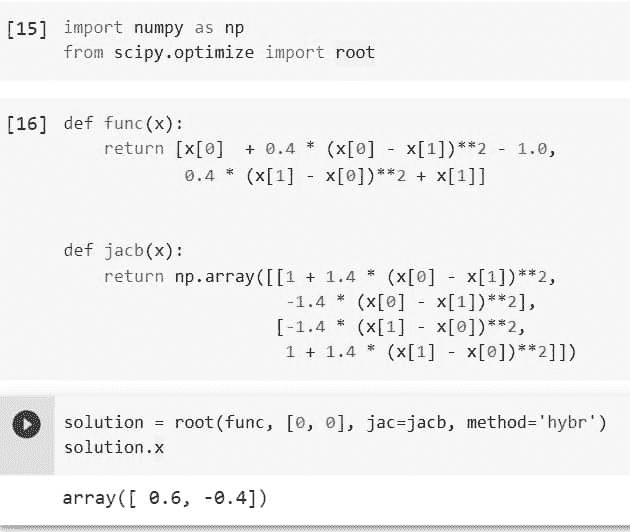
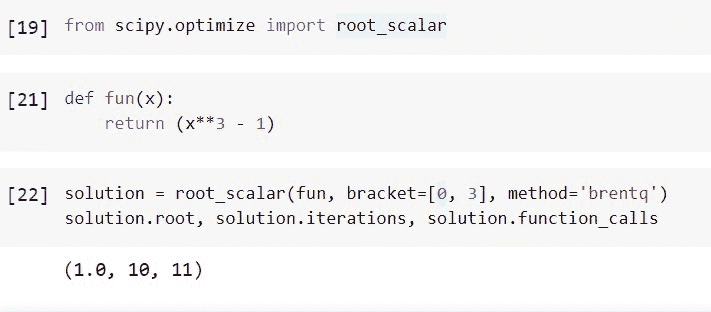
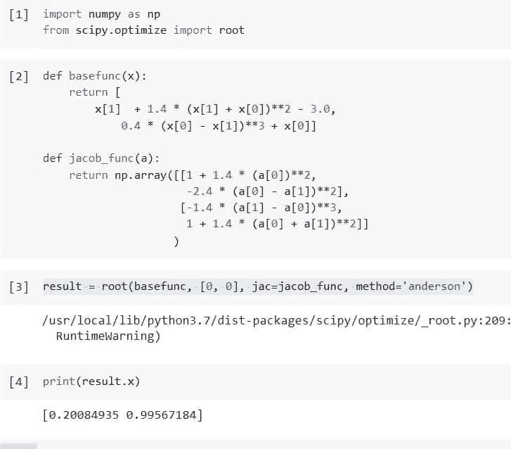
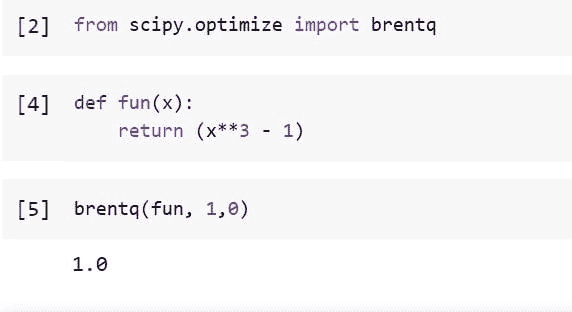
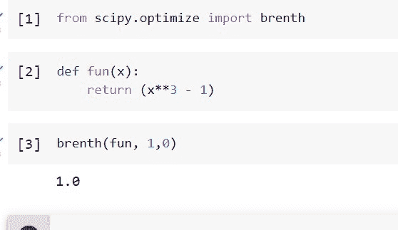
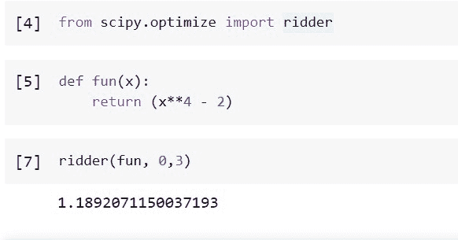

# Python Scipy 优化根

> 原文：<https://pythonguides.com/python-scipy-optimize-root/>

[](https://sharepointsky.teachable.com/p/python-and-machine-learning-training-course)

我们将学习“ `Python Scipy Optimize Root` ”来使用 Brenth、Ridder 等不同方法查找给定函数的根，还将涵盖以下主题。

*   Python Scipy 优化根
*   如何求标量函数的根
*   如何用 Lm 方法求函数的根
*   Python Scipy 优化根 Jacobian
*   如何用 Brentq 方法求根
*   如何用布伦斯方法求根
*   Python Scipy 优化根 Ridder

目录

[](#)

*   [Python Scipy 优化根](#Python_Scipy_Optimize_Root "Python Scipy Optimize Root")
*   [Python Scipy 优化根标量](#Python_Scipy_Optimize_Root_Scalar "Python Scipy Optimize Root Scalar")
*   [Python Scipy 优化根 Lm](#Python_Scipy_Optimize_Root_Lm "Python Scipy Optimize Root Lm")
*   [Python Scipy 优化根雅可比矩阵](#Python_Scipy_Optimize_Root_Jacobian "Python Scipy Optimize Root Jacobian")
*   [Python Scipy 优化根 Brentq](#Python_Scipy_Optimize_Root_Brentq "Python Scipy Optimize Root Brentq")
*   [Python Scipy 优化根 Brenth](#Python_Scipy_Optimize_Root_Brenth "Python Scipy Optimize Root Brenth")
*   [Python Scipy 优化根 rider](#Python_Scipy_Optimize_Root_Ridder "Python Scipy Optimize Root Ridder")

## Python Scipy 优化根

SciPy 优化包提供了最小化(或最大化)目标函数的例程，有时会受到限制。约束和非线性最小二乘法，线性规划，非线性最小二乘法，曲线拟合，求根是一些非线性问题的解决方案包括在内。

在本节中，我们将使用 Python Scipy 的方法`*`root()`*`,该方法存在于模块`scipy.optimize`中，用于查找矢量函数的根。

下面给出了语法。

```py
scipy.optimize.root(fun, x0, args=(), method='hybr', jac=None, tol=None, callback=None, options=None)
```

其中参数为:

*   **fun:** 一个求根的向量函数。
*   **x0:** (ndarray):初步猜测。
*   **args(tuple):** 将附加输入传递给目标函数的雅可比。
*   **方法(str):** 求解器类型，应该是 lm、hybr、broyden1、broyden2 等中的一个。
*   **jac(boolean):** 如果 jac 是 boolean 且为真，Fun 应该返回 Jacobian 的值以及目标函数。如果为假，将对雅可比矩阵进行数值估计。Jac 也可以在被调用时返回有趣的雅可比。在这种情况下，它必须接受同样的理由作为乐趣。
*   **tol(folat):** 对停止的耐受性。使用特定于规划求解的设置进行精细控制。
*   **回调:**可选的回调函数。Callback(x，f)，其中 x 是当前解，f 是相关的残差，在每次迭代中进行。除了“hybr”和“lm”之外的所有技术
*   **选项(字典):**可能的求解器列表。比如 xtol 或者 maxiter。

这个函数返回的`*`OptimizeResult`*`对象表示解决方案。有三个主要组件作为对象的一部分返回:

让我们以下面的步骤为例:

使用下面的 python 代码导入所需的库或方法。

```py
import numpy as np
from scipy.optimize import root
```

非线性方程组及其雅可比矩阵由下列函数定义。

```py
def func(x):
    return [x[0]  + 0.4 * (x[0] - x[1])**2 - 1.0,
            0.4 * (x[1] - x[0])**2 + x[1]]

def jacb(x):
    return np.array([[1 + 1.4 * (x[0] - x[1])**2,
                      -1.4 * (x[0] - x[1])**2],
                     [-1.4 * (x[1] - x[0])**2,
                      1 + 1.4 * (x[1] - x[0])**2]])
```

使用下面的代码找到解决方案。

```py
solution = root(func, [0, 0], jac=jacb, method='hybr')
solution.x
```



Python Scipy Optimize Root

这是如何使用 Python Scipy 的方法`*`root()`*`和方法`*`hybr`*`找到函数的根。

阅读 [Python Scipy 两两距离](https://pythonguides.com/python-scipy-pairwise-distance/)

## Python Scipy 优化根标量

Python Scipy 在模块`*`scipy.optimize`*`中包含了一个方法`*`root_scalar()`*`,用于识别标量函数的根。

下面给出了语法。

```py
scipy.optimize.root_scalar(f, args=(), method=None, bracket=None, fprime=None, fprime2=None, x0=None, x1=None, xtol=None, rtol=None, maxiter=None, options=None)
```

其中参数为:

*   **fun:** 一个求根的向量函数。
*   **x0:** (ndarray):初步猜测。
*   **x1(浮点):**第二种猜测。
*   **args(tuple):** 将附加输入传递给目标函数的雅可比。
*   **method(str):** 求解器类型，应该是等分、牛顿、rider 等中的一个。
*   **backet(2 个浮点数的序列):**f(x，*args)两端的符号必须不同，以便区间有根。
*   **fprime(boolean，callable):** 目标函数和导数值被认为是 f 返回的，如果 fprime 是 boolean 且为真。可调用的 fprime 也可以返回 f 的导数。在这种情况下，它必须接受与 f 相同的理由。
*   **fprime2(boolean，callable):** 如果 fprime2 是 boolean 且为 True，则认为 f 返回目标函数值，以及一阶和二阶导数。可调用的 fprime2 也可以返回 f 的二阶导数。在这种情况下，它必须接受与 f 相同的理由。
*   **xtol(float):** 终止的绝对公差。
*   **rtol(浮点):**对终止的相对容差。
*   **maxiter:** 最大迭代次数。
*   **选项(字典):**可能的求解器列表。

让我们以下面的步骤为例:

使用下面的 python 代码导入所需的库或方法。

```py
from scipy.optimize import root_scalar
```

使用下面的代码定义三次函数。

```py
def fun(x):
    return (x**3 - 1)
```

使用下面的代码找到立方的根。

```py
solution = root_scalar(fun, bracket=[0, 3], method='brentq')
solution.root, solution.iterations, solution.function_calls
```



Python Scipy Optimize Root Scalar

这就是如何使用 Python Scipy 的方法`*`root_scalar()`*`找到标量函数的根。

Read [Python Scipy Linalg Svd](https://pythonguides.com/python-scipy-linalg-svd/)

## Python Scipy 优化根 Lm

方法`*`scipy.optimize.root()`*`接受一个参数`method`，该参数可以采用不同的方法来寻找根。这个参数有一个值`*`lm`*`，它使用 Levenberg-Marquardt 来寻找最小二乘解。

下面给出了语法。

```py
scipy.optimize.root(fun, tol=None, callback=None, options={'col_deriv': 0,, x0, args=(), method='lm', jac=None, 'xtol': 1.49012e-08, 'ftol': 1.49012e-08, 'gtol': 0.0, 'maxiter': 0, 'eps': 0.0, 'factor': 100, 'diag': None})
```

其中参数为:

col_deriv(boolean):雅可比函数要计算各列的导数，其值必须非零。

*   **ftol(浮点):**平方和的期望相对误差。
*   **xtol(float):** 近似解的期望相对误差。
*   **gtol(floa):** 雅可比列和函数向量之间的期望正交性。
*   **maxiter(int):** 可以对函数进行的最多调用。如果该值为零，则最大值为 100*(N+1)，其中 N 是 x0 中的分量数。
*   **epsfcn(float):** 前向差分雅可比近似的良好步长(对于 Dfun=None)。据信，如果 epsfcn 小于机器精度，则函数中的相对误差在机器精度的数量级。
*   **factor(float):** 控制第一步界限的变量(factor * || diag * x||)。应隔开(0.1，100)。
*   **diag(sequence):** 变量的比例因子是 N 个正数。

其余参数请参考第一小节“Python Scipy 优化根”。

阅读 [Python Scipy 平滑](https://pythonguides.com/python-scipy-smoothing/)

## Python Scipy 优化根雅可比矩阵

我们已经从本教程的上述小节中了解了方法``root()``的工作原理，现在我们将创建一个函数来计算雅可比矩阵。

让我们以下面的步骤为例:

```py
import numpy as np
from scipy.optimize import root
```

使用下面的代码建立一个向量和雅可比函数。

```py
def basefunc(x):
    return [
        x[1]  + 1.4 * (x[1] + x[0])**2 - 3.0,
            0.4 * (x[0] - x[1])**3 + x[0]]

def jacob_func(a):
    return np.array([[1 + 1.4 * (a[0])**2,
                      -2.4 * (a[0] - a[1])**2],
                     [-1.4 * (a[1] - a[0])**3,
                      1 + 1.4 * (a[0] + a[1])**2]]
                    )
```

要使用 Anderson 辅助技术来确定向量函数的根，请使用`*`optimize.root`*`函数。

```py
result = root(basefunc, [0, 0], jac=jacob_func, method='anderson')
```

使用下面的代码检查结果。

```py
print(result.x)
```



Python Scipy Optimize Root Jacobian

这是如何用 Python Scipy 的方法`root()`用雅可比函数求函数的根。

阅读 [Python Scipy Ndimage Imread 教程](https://pythonguides.com/python-scipy-ndimage-imread/)

## Python Scipy 优化根 Brentq

Python Scipy 在模块`*`scipy.optimize`*`中有一个方法`*`brentq()`*`,它使用 Brent 的方法在括号区间中定位函数的根。

使用传统的布伦特方法来确定函数 f 在变号区间[a，b]上的零点。这里使用的求根程序一般被认为是最好的。利用逆二次外推是割线方法的一种安全变体。

在 Brent 的方法中，结合了逆二次插值、区间二等分和根括号。van Wijngaarden-Dekker-Brent 方法是它的另一个名称。根据 Brent (1973)，对于可以在[a，b]内计算的函数，收敛是有保证的。

下面给出了语法。

```py
scipy.optimize.brentq(f, a, b, maxiter=100,  args=(), xtol=2e-12, rtol=8.881784197001252e-16, full_output=False, disp=True)
```

其中参数为:

*   **f():** 返回一个数字是 Python 函数。要求 f(a)和 f(b)符号相反，且 f 是连续函数。
*   **a(标量):**一端括号范围[a，b]。
*   **b(标量):**另一端括号范围[a，b]。
*   **xtol(number):**NP . all close(x，x0，atol=xtol，rtol=rtol)，其中 x 表示精确根，将由计算的根 x0 来满足。变量不能为负。对于 xtol/2 和 rtol/2，Brent 的技术经常满足前面提到的令人愉快的函数的标准。
*   **rtol(number):**NP . all close(x，x0，atol=xtol，rtol=rtol)，其中 x 表示精确根，将由计算的根 x0 来满足。参数默认值 4*np.finfo 不能更小(float)。eps。对于 xtol/2 和 rtol/2，Brent 的技术经常满足前面提到的令人愉快的函数的标准。
*   **maxiter(int):** 如果在最大重复次数内无法达到收敛，则会出现错误。必须大于或等于 0。
*   **args(tuple):** 应用(f，(x)+args)调用带有附加参数的函数 f。
*   **full_output(boolean):** 如果 full_output 为 False，则返回根。如果 Full-output 为 True，则 full-output 返回值(x，r)，其中 x 是根，r 是 RootResults 对象。
*   **disp(boolean):** 如果为真，如果算法没有收敛，则报告 RuntimeError。否则，任何 RootResults 返回对象都包含收敛状态的记录。

方法`*`brentq()`*`返回`*`x0`*`(a 和 b 之间，f 为零)。

让我们举一个例子，按照以下步骤使用方法`*`brenqt()`*`找到函数的根:

使用下面的 python 代码导入所需的库或方法。

```py
from scipy.optimize import brentq
```

使用下面的代码定义我们想要找到其根的函数。

```py
def fun(x):
    return (x**3 - 1)
```

现在用下面的代码找到这个函数的根。

```py
brentq(fun, 1,0)
```



Python Scipy Optimize Root Brentq

这是如何使用 Python Scipy 的方法`*`brentq()`*`在括号区间内找到函数的根。

Read [Python Scipy Softmax](https://pythonguides.com/python-scipy-softmax/)

## Python Scipy 优化根 Brenth

Python Scipy 模块`*`scipy.optimize`*`的方法`*`brenth()`*`使用 Brent 的方法和双曲线外推法，可以在括号区间内找到函数的根。

传统 Brent 方法的一种替代方法，使用反二次外推而不是双曲线外推来定位参数 a 和 b 之间的函数 f 的零点

根据 Bus & Dekker (1975)，使用这种方法的函数求值的上界比二分法低 4 或 5 倍，保证了这种方法的收敛性。

f(a)和 f(b)的符号不能相同。一般与布伦特原油相当，但测试不严格。这种基于双曲线外推法的割线方法是原始方法的一种安全变体。

下面给出了语法。

```py
scipy.optimize.brenth(f, a, b, args=(), xtol=2e-12, rtol=8.881784197001252e-16, maxiter=100, full_output=False, disp=True)
```

其中参数为:

*   **f():** 返回一个数字是 Python 函数。要求 f(a)和 f(b)符号相反，且 f 是连续函数。
*   **a(标量):**一端括号范围[a，b]。
*   **b(标量):**另一端括号范围[a，b]。
*   **xtol(number):**NP . all close(x，x0，atol=xtol，rtol=rtol)，其中 x 表示精确根，将由计算的根 x0 来满足。变量不能为负。对于 xtol/2 和 rtol/2，Brent 的技术经常满足前面提到的令人愉快的函数的标准。
*   **rtol(number):**NP . all close(x，x0，atol=xtol，rtol=rtol)，其中 x 表示精确根，将由计算的根 x0 来满足。参数默认值 4*np.finfo 不能更小(float)。eps。对于 xtol/2 和 rtol/2，Brent 的技术经常满足前面提到的令人愉快的函数的标准。
*   **maxiter(int):** 如果在最大重复次数内无法达到收敛，则会出现错误。必须大于或等于 0。
*   **args(tuple):** 应用(f，(x)+args)调用带有附加参数的函数 f。
*   **full_output(boolean):** 如果 full_output 为 False，则返回根。如果 Full-output 为 True，则 full-output 返回值(x，r)，其中 x 是根，r 是 RootResults 对象。
*   **disp(boolean):** 如果为真，如果算法没有收敛，则报告 RuntimeError。否则，任何 RootResults 返回对象都包含收敛状态的记录。

方法`*`brenth()`*`返回`*`x0`*`(a 和 b 之间，f 为零)。

让我们举一个例子，按照以下步骤使用方法`*`brenth()`*`找到函数的根:

使用下面的 python 代码导入所需的库或方法。

```py
from scipy.optimize import brenth
```

使用下面的代码定义我们想要找到其根的函数。

```py
def fun(x):
    return (x**3 - 1)
```

现在用下面的代码找到这个函数的根。

```py
brentq(fun, 1,0)
```



Python Scipy Optimize Root Brenth

这就是如何利用 Python Scipy 的方法`*`brentq()`*`用双曲线外推法求括号区间内函数的根。

阅读[如何使用 Python Scipy 差分进化](https://pythonguides.com/scipy-differential-evolution/)

## Python Scipy 优化根 rider

Python Scipy 模块 scipy.optimize 的方法`*`ridder()`*`使用 Ridder 的方法并定位函数的区间根。

下面给出了语法。

```py
scipy.optimize.ridder(f, a, b, args=(), xtol=2e-12, rtol=8.881784197001252e-16, maxiter=100, full_output=False, disp=True)
```

*   **f():** 返回一个数字是 Python 函数。要求 f(a)和 f(b)符号相反，且 f 是连续函数。
*   **a(标量):**一端括号范围[a，b]。
*   **b(标量):**另一端括号范围[a，b]。
*   **xtol(number):**NP . all close(x，x0，atol=xtol，rtol=rtol)，其中 x 表示精确根，将由计算的根 x0 来满足。变量不能为负。对于 xtol/2 和 rtol/2，Brent 的技术经常满足前面提到的令人愉快的函数的标准。
*   **rtol(number):**NP . all close(x，x0，atol=xtol，rtol=rtol)，其中 x 表示精确根，将由计算的根 x0 来满足。参数默认值 4*np.finfo 不能更小(float)。eps。对于 xtol/2 和 rtol/2，Brent 的技术经常满足前面提到的令人愉快的函数的标准。
*   **maxiter(int):** 如果在最大重复次数内无法达到收敛，则会出现错误。必须大于或等于 0。
*   **args(tuple):** 应用(f，(x)+args)调用带有附加参数的函数 f。
*   **full_output(boolean):** 如果 full_output 为 False，则返回根。如果 Full-output 为 True，则 full-output 返回值(x，r)，其中 x 是根，r 是 RootResults 对象。
*   **disp(boolean):** 如果为真，如果算法没有收敛，则报告 RuntimeError。否则，任何 RootResults 返回对象都包含收敛状态的记录。

方法`*`ridder()`*`返回`*`x0`*`(a 和 b 之间，f 为零)。

让我们举一个例子，按照以下步骤使用方法`*`brenth()`*`找到函数的根:

使用下面的 python 代码导入所需的库或方法。

```py
from scipy.optimize import ridder
```

使用下面的代码定义我们想要找到其根的函数。

```py
def fun(x):
    return (x**4 - 2)
```

现在用下面的代码找到这个函数的根。

```py
ridder(fun, 0,3)
```



Python Scipy Optimize Root Ridder

我们已经学习了如何使用 Ridder、Brentq、Brenth 和 ect 等方法计算给定函数或标量函数的根，主题如下。

*   Python Scipy 优化根
*   如何求标量函数的根
*   如何用 Lm 方法求函数的根
*   Python Scipy 优化根 Jacobian
*   如何用 Brentq 方法求根
*   如何用布伦斯方法求根
*   Python Scipy 优化根 Ridder

您可能会喜欢以下 Python Scipy 教程:

*   [如何使用 Python Scipy Linprog](https://pythonguides.com/python-scipy-linprog/)
*   [Python Lil_Matrix Scipy](https://pythonguides.com/python-lil_matrix-scipy/)
*   [Python Scipy 集群 Vq](https://pythonguides.com/python-scipy-cluster-vq/)
*   [如何使用 Python Scipy Gaussian_Kde](https://pythonguides.com/python-scipy-gaussian_kde/)
*   [Python Scipy 稀疏 Csr_matrix](https://pythonguides.com/python-scipy-sparse-csr_matrix/)
*   [Python Scipy Lognormal](https://pythonguides.com/python-scipy-lognormal/)

[Bijay Kumar](https://pythonguides.com/author/fewlines4biju/)

Python 是美国最流行的语言之一。我从事 Python 工作已经有很长时间了，我在与 Tkinter、Pandas、NumPy、Turtle、Django、Matplotlib、Tensorflow、Scipy、Scikit-Learn 等各种库合作方面拥有专业知识。我有与美国、加拿大、英国、澳大利亚、新西兰等国家的各种客户合作的经验。查看我的个人资料。

[enjoysharepoint.com/](https://enjoysharepoint.com/)[](https://www.facebook.com/fewlines4biju "Facebook")[](https://www.linkedin.com/in/fewlines4biju/ "Linkedin")[](https://twitter.com/fewlines4biju "Twitter")