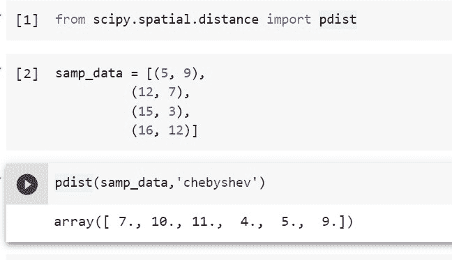

# Python Scipy 两两距离[有 9 个例子]

> 原文：<https://pythonguides.com/python-scipy-pairwise-distance/>

[](https://sharepointsky.teachable.com/p/python-and-machine-learning-training-course)

在本 [Python Scipy 教程](https://pythonguides.com/what-is-scipy-in-python/)中，我们将学习“ **Python Scipy 两两距离**”。使用各种距离矩阵，如堪培拉、雅克卡、欧几里德等，我们将计算点或阵列之间的成对距离。

*   什么是成对距离？
*   Python Scipy 成对距离矩阵
*   Python Scipy 成对距离 Jaccard
*   Python Scipy 成对距离欧几里得
*   Python Scipy 成对距离 Hamming
*   Python Scipy 两两距离曼哈顿
*   Python Scipy 成对距离 Minkowski
*   Python Scipy 成对距离堪培拉
*   Python Scipy 成对距离切比雪夫
*   Python Scipy 成对距离 Jensenshannon

目录

[](#)

*   什么是成对距离？
*   [Python Scipy 成对距离矩阵](#Python_Scipy_Pairwise_Distance_Matrix "Python Scipy Pairwise Distance Matrix")
*   [Python Scipy 两两距离 Jaccard](#Python_Scipy_Pairwise_Distance_Jaccard "Python Scipy Pairwise Distance Jaccard")
*   [Python Scipy 成对距离欧几里德](#Python_Scipy_Pairwise_Distance_Euclidean "Python Scipy Pairwise Distance Euclidean")
*   [Python Scipy 两两距离曼哈顿](#Python_Scipy_Pairwise_Distance_Manhattan "Python Scipy Pairwise Distance Manhattan")
*   [Python Scipy 两两距离闵可夫斯基](#Python_Scipy_Pairwise_Distance_Minkowski "Python Scipy Pairwise Distance Minkowski")
*   [Python Scipy 两两距离海明](#Python_Scipy_Pairwise_Distance_Hamming "Python Scipy Pairwise Distance Hamming")
*   [Python Scipy 两两距离堪培拉](#Python_Scipy_Pairwise_Distance_Canberra "Python Scipy Pairwise Distance Canberra")
*   [Python Scipy 两两距离切比雪夫](#Python_Scipy_Pairwise_Distance_Chebyshev "Python Scipy Pairwise Distance Chebyshev")
*   [Python Scipy 成对距离 Jensenshannon](#Python_Scipy_Pairwise_Distance_Jensenshannon "Python Scipy Pairwise Distance Jensenshannon")
*   [结论](#Conclusion "Conclusion")

## 什么是成对距离？

给定每对物种之间的距离度量，找到一棵能最好地预测观察到的距离集合的树，将是解决系统发育问题的一个直接的方法。

通过省略一些数据，这将数据矩阵 M 简化为成对距离的简单表格。然而，似乎许多进化信息经常通过这些距离传递。

在本教程中，我们将学习如何在 Python Scipy 方法的帮助下计算成对距离。

Read [Python Scipy Linalg Svd](https://pythonguides.com/python-scipy-linalg-svd/)

## Python Scipy 成对距离矩阵

Python 库 Scipy 的模块`*`scipy.spatial.distance`*` 提供了一个名为`*`pdist()`*`的函数，用于计算 n 维空间中观测值之间的成对距离。

下面给出了语法。

```py
scipy.spatial.distance.pdist(X, metric='minkowski')
```

其中参数为:

*   **X(array _ data):**m 个不同观测值的集合，每个观测值在 n 维中，按 m 乘 n 排序。
*   **metric(callabel，str):** 要应用的距离单位。距离函数可以是"堪培拉"、"布雷柯蒂斯"、"切比雪夫"、"相关"、"城市街区"、"余弦"、"欧几里得"、"骰子"、"汉明"、"库尔辛斯基"、"简森山农"、"库尔辛斯基"、"匹配"、"马哈拉诺比斯"、"明科夫斯基"、"罗素劳"、"罗格斯坦本"、"修克列迪安"。

方法`*`pdist()`*`返回`*`Y`*`压缩距离矩阵。

让我们通过下面的步骤来了解一个示例:

使用下面的 python 代码导入所需的库。

```py
from scipy.spatial.distance import pdist
```

使用下面的代码创建数据。

```py
data = [(25.056, -75.7226),
          (25.7411, -79.1197),
          (25.2897, -79.2294),
          (25.6716, -79.3378)]
```

使用相关性作为点之间的距离度量来计算 m 和点之间的距离。

```py
pdist(data,'correlation')
```


Python Scipy Pairwise Distance Matrix

这就是如何使用 Python Scipy 的方法`*`pdist()`*`计算成对距离矩阵。

阅读 [Python Scipy 平滑](https://pythonguides.com/python-scipy-smoothing/)

## Python Scipy 两两距离 Jaccard

对于 n 个样本集的聚类和多维标度，Jaccard 距离经常用于计算 n*n 矩阵。这个距离是所有有限集集合的度量。

因此，在本节中，我们将使用度量标准`*`jaccard`*`来计算距离。让我们按照下面的步骤来看一个例子:

使用下面的 python 代码导入所需的库。

```py
from scipy.spatial.distance import pdist
```

使用下面的代码创建数据。

```py
samp_data = [(27.056, -65.3226),
          (27.6411, -65.2197),
          (27.6897, -65.6294),
          (27.5716, -65.1378)]
```

使用 Jaccard 作为点之间的距离度量来计算 m 和点之间的距离。

```py
pdist(samp_data,'jaccard')
```


Python Scipy Pairwise Distance Jaccard

这就是如何使用 Python Scipy 的方法`*`pdist()`*`和度量`*`jaccard`*`计算成对 Jaccard 距离矩阵。

## Python Scipy 成对距离欧几里德

两点之间的最短距离被称为“欧几里德距离”大多数机器学习算法，如 K-Means，都使用这种距离度量来衡量两个观察值的相似程度。

Python Scipy 方法`*`pdist()`*`接受度量`*`euclidean`*`来计算这种距离。因此，在这里，我们将按照以下步骤使用欧几里德度量来计算成对距离:

使用下面的 python 代码导入所需的库。

```py
from scipy.spatial.distance import pdist
```

使用下面的代码创建示例数据。

```py
samp_data = [(5, 8),
          (10, 12),
          (11, 15),
          (19, 16)]
```

使用欧几里得作为点之间的距离度量来计算 m 和 n 点之间的距离。

```py
pdist(samp_data,'euclidean')
```


Python Scipy Pairwise Distance Euclidean

这就是如何使用 Python Scipy 的方法`*`pdist()`*`和度量`*`euclidean`*`计算成对欧几里德距离矩阵。

阅读 [Python Scipy Ndimage Imread 教程](https://pythonguides.com/python-scipy-ndimage-imread/)

## Python Scipy 两两距离曼哈顿

所有维度上两点之间的总绝对差构成了曼哈顿距离。Python Scipy 方法`*`pdist()`*`接受度量`*`cityblock`*`来计算这种距离。

让我们按照以下步骤，使用曼哈顿(在 Python Scipy 中也称为城市街区)度量来计算成对距离:

使用下面的 python 代码导入所需的库。

```py
from scipy.spatial.distance import pdist
```

使用下面的代码创建示例数据。

```py
samp_data = [(5, 8),
          (10, 12),
          (11, 15),
          (19, 16)]
```

使用城市街区作为点之间的距离度量来计算 m 点和 n 点之间的距离。

```py
pdist(samp_data,'cityblock')
```


Python Scipy Pairwise Distance Manhattan

这就是如何使用 Python Scipy 的方法`*`pdist()`*`和度量`*`cityblock`*`计算成对曼哈顿距离矩阵。

## Python Scipy 两两距离闵可夫斯基

N 维空间中称为闵可夫斯基距离的距离是两点之间的距离。本质上，它是曼哈顿距离和欧几里德距离的推广。

它经常在机器学习中使用，特别是在确定数据的最佳相关性或分类的想法中。

Python Scipy 方法`*`pdist()`*`接受度量`*`minkowski`*`来计算这种距离。让我们按照以下步骤使用闵可夫斯基度量来计算成对距离:

使用下面的 python 代码导入所需的库。

```py
from scipy.spatial.distance import pdist
```

使用下面的代码创建示例数据。

```py
samp_data = [(10, 8),
          (10, 12),
          (10, 15),
          (19, 16)]
```

要确定点 m 和 n 之间的距离，请使用闵可夫斯基距离作为距离度量。

```py
pdist(samp_data,'minkowski')
```


Python Scipy Pairwise Distance Minkowski

这就是如何使用 Python Scipy 的方法`*`pdist()`*`和度量`*`minkowski`*`计算成对 Minkowski 距离矩阵。

Read [Python Scipy Softmax](https://pythonguides.com/python-scipy-softmax/)

## Python Scipy 两两距离海明

在同一点上两个数不同的位数称为两个整数之间的汉明距离。Python Scipy 方法`*`pdist()`*`接受度量`*`hamming`*`来计算这种距离。

让我们举一个例子，按照以下步骤使用汉明度量计算成对距离:

使用下面的 python 代码导入所需的库。

```py
from scipy.spatial.distance import pdist
```

使用下面的代码创建示例数据。

```py
samp_data = [(10, 8),
          (10, 12),
          (10, 15),
          (19, 16)]
```

要确定点 m 和 n 之间的距离，请使用汉明作为距离度量。

```py
pdist(samp_data,'hamming')
```


Python Scipy Pairwise Distance Hamming

这就是如何使用 Python Scipy 的方法`*`pdist()`*`和度量`*`hamming`*`计算成对汉明距离矩阵。

## Python Scipy 两两距离堪培拉

戈弗雷·兰斯和威廉·t·威廉姆斯在 1966 年首次提出了堪培拉距离，后来又进行了改进。堪培拉距离是向量空间中两点之间差异的数字表示。这是加上重量后的 L1(曼哈顿)距离。

让我们举一个例子，按照以下步骤使用堪培拉度量计算成对距离:

使用下面的 python 代码导入所需的库。

```py
from scipy.spatial.distance import pdist
```

使用下面的代码创建示例数据。

```py
samp_data = [(9, 8),
          (7, 12),
          (3, 15),
          (12, 16)]
```

要确定向量空间中两点之间差异的数值表示，请使用堪培拉作为距离度量。

```py
pdist(samp_data,'canberra')
```


Python Scipy Pairwise Distance Canberra

这就是如何使用 Python Scipy 的方法`*`pdist()`*`和度量`*`canberra`*`计算成对堪培拉距离矩阵。

阅读[如何使用 Python Scipy 差分进化](https://pythonguides.com/scipy-differential-evolution/)

## Python Scipy 两两距离切比雪夫

切比雪夫距离公式在数学中也称为“最大度量”，它将两点之间的距离计算为所有轴值的最大差值。

Python Scipy 方法`*`pdist()`*`接受度量`*`chebyshev`*`来计算这种成对距离。

让我们举一个例子，按照以下步骤使用切比雪夫度量计算成对距离:

使用下面的 python 代码导入所需的库。

```py
from scipy.spatial.distance import pdist
```

使用下面的代码创建示例数据。

```py
samp_data = [(5, 9),
          (12, 7),
          (15, 3),
          (16, 12)]
```

要确定两点之间的最大差异，请使用切比雪夫作为距离度量。

```py
pdist(samp_data,'chebyshev')
```



Python Scipy Pairwise Distance Chebyshev

这就是如何使用 Python Scipy 的方法`*`pdist()`*`和度量`*`chebyshev`*`计算成对切比雪夫距离矩阵。

阅读: [Python Scipy 空间距离 Cdist](https://pythonguides.com/python-scipy-spatial-distance-cdist/)

## Python Scipy 成对距离 Jensenshannon

两个概率之间的差异由詹森-香农距离来衡量。Python Scipy 方法`*`pdist()`*`接受度量`*`jensenshannon`*`来计算这种成对距离。

让我们举一个例子，按照以下步骤使用 Jensenshannon 度量计算成对距离:

使用下面的 python 代码导入所需的库。

```py
from scipy.spatial.distance import pdist
```

使用下面的代码创建示例数据。

```py
samp_data = [(5, 9),
          (12, 7),
          (15, 3),
          (16, 12)]
```

要确定两个概率之间的差异，请使用 Jensenshannon 作为距离度量。

```py
pdist(samp_data,'jensenshannon')
```


Python Scipy Pairwise Distance Jensenshannon

这就是如何使用 Python Scipy 的方法`*`pdist()`*`和度量`*`jensenshannon`*`计算成对 Jensenshannon 距离矩阵。

## 结论

因此，我们在本教程中学习了如何在 Scipy 中使用几种距离度量来构建成对距离矩阵，包括 Hamming、Euclidean、Jensen Shannon 等。包括以下主题。

*   什么是成对距离？
*   Python Scipy 成对距离矩阵
*   Python Scipy 成对距离 Jaccard
*   Python Scipy 成对距离欧几里得
*   Python Scipy 成对距离 Hamming
*   Python Scipy 两两距离曼哈顿
*   Python Scipy 成对距离 Minkowski
*   Python Scipy 成对距离堪培拉
*   Python Scipy 成对距离切比雪夫
*   Python Scipy 成对距离 Jensenshannon

您可能还会喜欢以下 Python Scipy 教程:

*   [如何使用 Python Scipy Linprog](https://pythonguides.com/python-scipy-linprog/)
*   [Python Lil _ Matrix](https://pythonguides.com/python-lil_matrix-scipy/)[S](https://pythonguides.com/python-lil_matrix-scipy/)cipy
*   [如何使用 Python Scipy Gaussian_Kde](https://pythonguides.com/python-scipy-gaussian_kde/)
*   [Python Scipy 稀疏 Csr_matrix](https://pythonguides.com/python-scipy-sparse-csr_matrix/)
*   [Python Scipy Lognormal](https://pythonguides.com/python-scipy-lognormal/)

[Bijay Kumar](https://pythonguides.com/author/fewlines4biju/)

Python 是美国最流行的语言之一。我从事 Python 工作已经有很长时间了，我在与 Tkinter、Pandas、NumPy、Turtle、Django、Matplotlib、Tensorflow、Scipy、Scikit-Learn 等各种库合作方面拥有专业知识。我有与美国、加拿大、英国、澳大利亚、新西兰等国家的各种客户合作的经验。查看我的个人资料。

[enjoysharepoint.com/](https://enjoysharepoint.com/)[](https://www.facebook.com/fewlines4biju "Facebook")[](https://www.linkedin.com/in/fewlines4biju/ "Linkedin")[](https://twitter.com/fewlines4biju "Twitter")