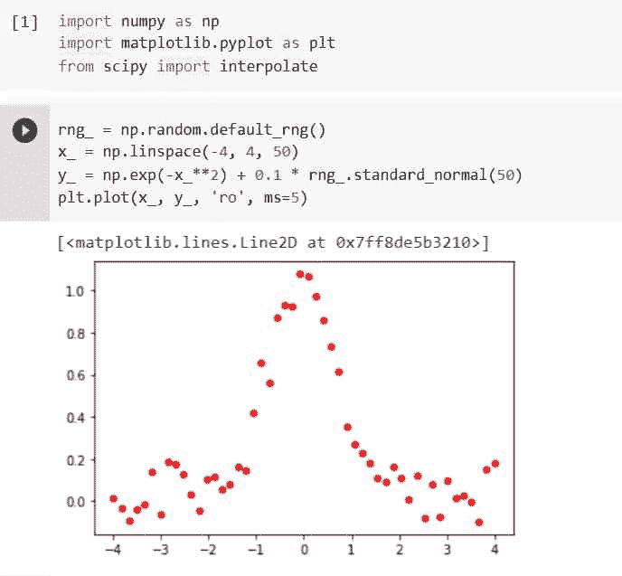
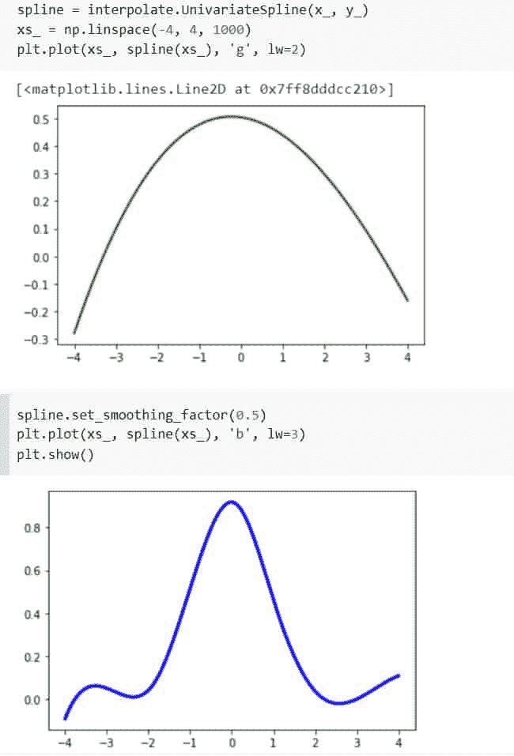
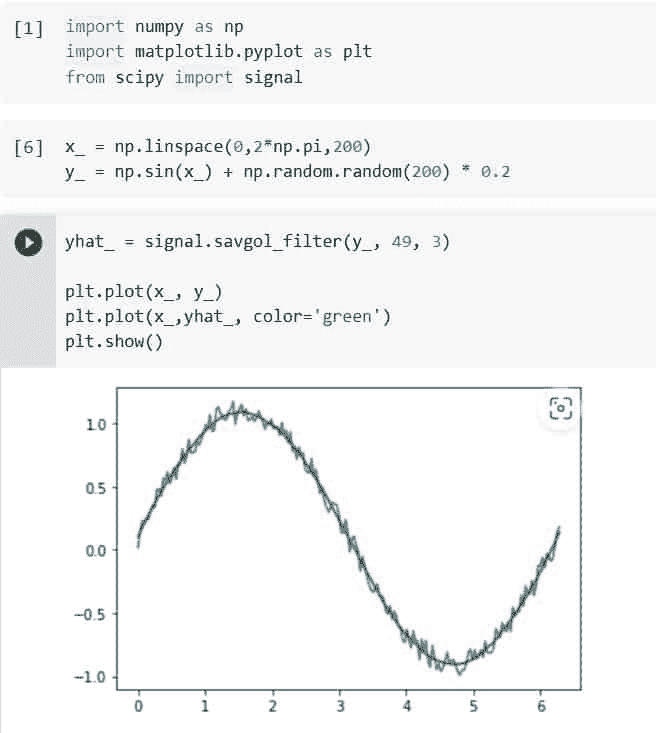
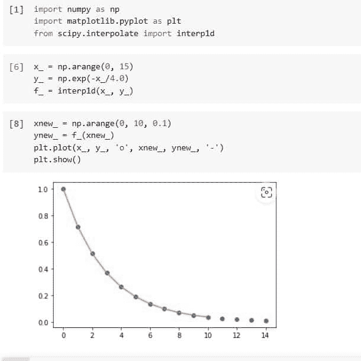
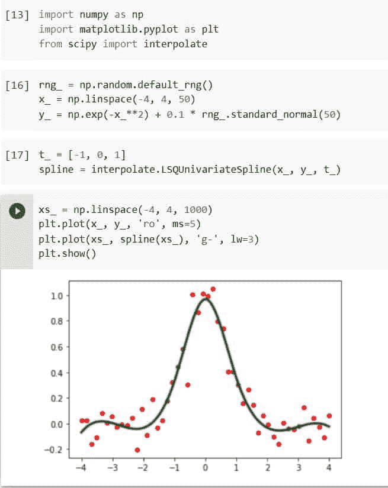
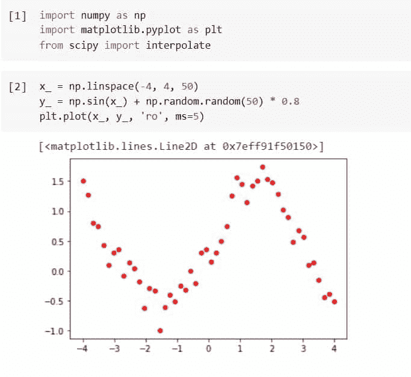
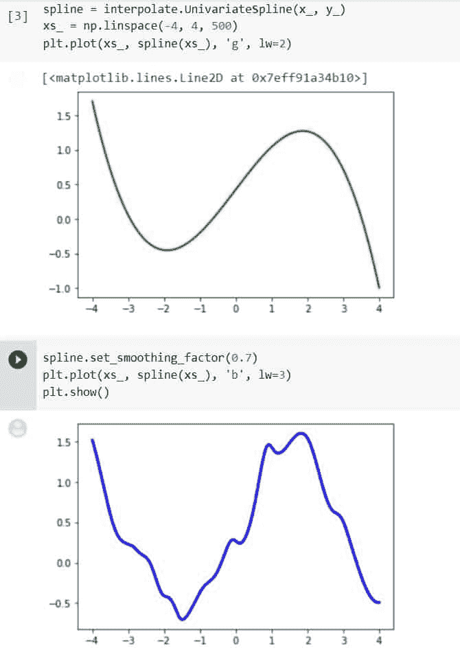
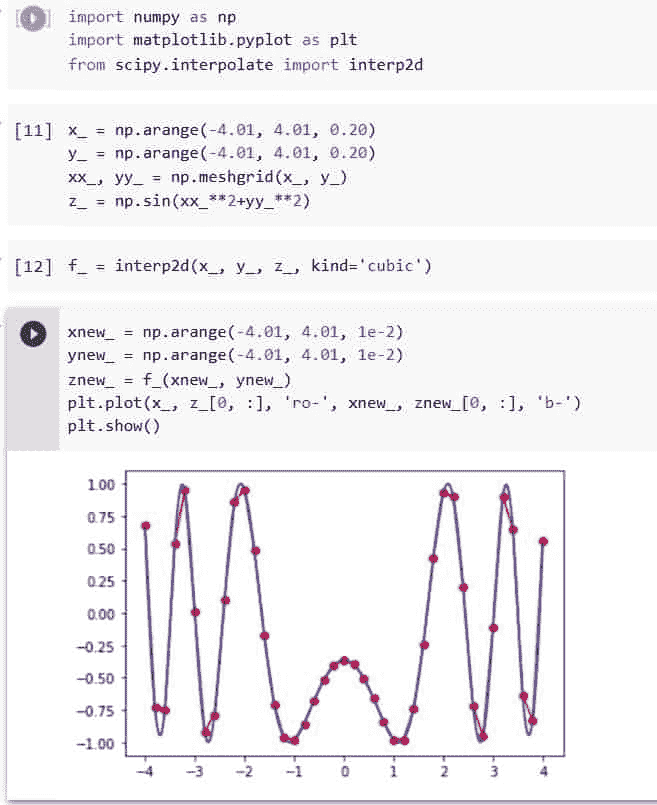

# Python 科学平滑

> 原文：<https://pythonguides.com/python-scipy-smoothing/>

[](https://sharepointsky.teachable.com/p/python-and-machine-learning-training-course)

你有没有想过什么是`*Python Scipy smooth*`？在这里，我们将学习“`*Python Scipy Smoothing*`”使用不同的过滤器或方法平滑曲线，我们还将通过以下主题从噪声数据中去除噪声。

*   什么是数据平滑？
*   Python Scipy 平滑样条
*   如何使用过滤器进行平滑
*   如何平滑一维数据
*   如何去除数据中的噪声并使其平滑
*   如何用平滑因子法控制平滑度
*   Python Scipy 平滑 2d 数据

目录

[](#)

*   [什么是数据平滑？](#What_is_Data_Smoothing "What is Data Smoothing?")
*   [Python Scipy 平滑样条](#Python_Scipy_Smoothing_Spline "Python Scipy Smoothing Spline")
*   [Python Scipy 平滑滤镜](#Python_Scipy_Smoothing_Filter "Python Scipy Smoothing Filter")
*   [Python Scipy 平滑 1d](#Python_Scipy_Smoothing_1d "Python Scipy Smoothing 1d")
*   [Python Scipy 平滑噪声数据](#Python_Scipy_Smoothing_Noisy_Data "Python Scipy Smoothing Noisy Data")
*   [Python Scipy 平滑因子](#Python_Scipy_Smoothing_Factor "Python Scipy Smoothing Factor")
*   [Python Scipy 平滑 2d 数据](#Python_Scipy_Smoothing_2d_Data "Python Scipy Smoothing 2d Data")

## 什么是数据平滑？

数据平滑是使用算法从数据集中去除噪声的过程。因此，重要的模式可以更容易地区分。数据平滑可用于经济分析以及帮助预测趋势，如在证券价格中看到的趋势。数据平滑的目的是消除异常值并考虑季节性。

在汇编数据的过程中，可以消除或减少任何波动或其他类型的噪声。数据平滑就是这个术语。

数据平滑基于这样一个概念，即它可以识别更简单的变化，以帮助预测各种趋势和模式。它有助于必须检查大量数据的统计学家和交易员——这些数据通常很难理解，以发现他们否则可能不会注意到的趋势。

数据平滑的过程可以以多种方式进行。一些选项是随机化方法、进行指数平滑过程、计算移动平均值或采用随机行走。

另外，检查: [Python Scipy Butterworth 过滤器](https://pythonguides.com/python-scipy-butterworth-filter/)

## Python Scipy 平滑样条

样条是描述在特定位置连接的多项式集合的数学函数，这些位置称为样条纽结。

这也表明样条将产生平滑函数，避免斜率的突然变化。它们用于插值一组数据点，插值函数在调查范围内表现出连续性。

Python Scipy 有一个类`*`scipy.interpolate.UnivariateSpline()`*`,它将一维平滑样条拟合到一组现有的数据点。

下面给出了语法。

```py
class scipy.interpolate.UnivariateSpline(x, y, w=None, bbox=[None, None], k=3, s=None, ext=0, check_finite=False)
```

其中参数为:

*   **x(array_data，N):** 输入数据分开的一维数组。必须是上升的；如果 s 是 0，它一定是严格递增的。
*   **y(array_data，N):** 一维数组中的相关输入数据，该数组的确切长度为 x。
*   **w(N，array_data):** 拟合样条的权重。它必须是积极的。如果 w 不为 0，则所有重量都相等。不使用默认值。
*   **bbox(array_data，2):**2-定义近似区间周长的序列。如果 Bbox 为 None，则 bbox 等于[x[0]，x[-1]]。不使用默认值。
*   **k(int):** 平滑样条的次数。K = 3 是三次样条，因此它必须是 1 = k = 5。有一个 3。
*   **s(float):** 结的数量由正平滑因子决定。在满足平滑条件之前，结的数量将会增加。
*   **ext(string，int):** 确定如何对结序列指定范围之外的元素进行外推。
    *   如果 ext=0 或“extrapolate ”,则返回外推值。
    *   如果 ext=1 或“零”，则返回 0
    *   如果 ext=2 或' raise ',则抛出一个值 Error
    *   如果 ext=3 of 'const ',则返回边界值。
*   **check_finite(boolean):** 如果需要验证输入数组只包含有限个数字。禁用可能会提高性能，但如果输入包含无限或 nan，可能会导致问题(崩溃、非终止或不合逻辑的结果)。默认值为 False。

让我们举一个例子，按照以下步骤平滑噪声数据:

使用下面的 python 代码导入所需的库或方法。

```py
import numpy as np
import matplotlib.pyplot as plt
from scipy import interpolate
```

生成 x 和 y，并使用下面的代码绘制它们。

```py
rng_ = np.random.default_rng()
x_ = np.linspace(-4, 4, 50)
y_ = np.exp(-x_**2) + 0.1 * rng_.standard_normal(50)
plt.plot(x_, y_, 'ro', ms=5)
```



Python Scipy Smoothing Spline Example

使用下面的代码，使用方法`*`UnivariateSpline()`*`和默认参数值平滑数据。

```py
spline = interpolate.UnivariateSpline(x_, y_)
xs_ = np.linspace(-4, 4, 1000)
plt.plot(xs_, spline(xs_), 'g', lw=2)
```

现在再次使用下面的代码手动调整平滑的程度。

```py
spline.set_smoothing_factor(0.5)
plt.plot(xs_, spline(xs_), 'b', lw=3)
plt.show()
```

方法`*`set_smoothing_factor()`*`使用指定的平滑因子`*`s`*`和之前调用中发现的节点继续计算样条。



Python Scipy Smoothing Spline

这就是如何使用 Python Scipy 的方法`*`UnivariateSpline()`*`平滑数据。

阅读: [Python Scipy Stats Fit +示例](https://pythonguides.com/python-scipy-stats-fit/)

## Python Scipy 平滑滤镜

一种称为 Savitzky-Golay 滤波器的数字滤波器使用数据点来平滑图形。使用最小二乘法时，会创建一个小窗口，该窗口中的数据将接受多项式处理，然后该多项式用于确定窗口的中心点。

一旦所有的邻居已经彼此粗略地调整，该窗口然后再一次移动一个数据点。

Python Scipy 在模块`*`scipy.signal`*`中有一个方法`*`savgol_filter()`*`，它在数组上使用 Savitzky-Golay 过滤器。

下面给出了语法。

```py
scipy.signal.savgol_filter(x, window_length, polyorder, deriv=0, delta=1.0, axis=- 1, mode='interp', cval=0.0)
```

其中参数为:

*   ***x(array_data):*** 将要过滤的数据。在过滤之前，如果 x 不是单精度或双精度浮点数组，它将被转换为类型 *`numpy.float64`* 。
*   ***【window _ length(int):***过滤窗口的大小。如果模式是“interp”，窗口长度必须小于或等于 x 的大小
*   ***poly order(int):***多项式的阶，用于拟合数据。窗口长度必须小于 polyorder。
*   ***deriv(int):*** 导数的计算顺序。它必须是一个非负的整数。当默认值为 0 时，数据被过滤但不区分。
*   ***【delta】(float):***将受到过滤的样本间距。仅在 deriv > 0 时使用。默认值为 1.0。
*   ***axis(int):*** 沿数组的 x 轴应用滤镜的方向。默认值为-1。
*   ***模式(字符串):*** 必须是“interp”、“wrap”、“nearest”、“constant”或“mirror”基于此，决定在应用滤波器之前应用于填充信号的扩展类型。当模式设定为“常量”时，cval 提供填充值。有关“镜像”、“常数”、“换行”和“最近”的更多信息，请参考注释。当选择默认的“interp”模式时，不使用扩展。取而代之的是，将一个多阶多项式拟合到边的最后一个窗口长度值，然后使用该多项式计算最后一个窗口长度/ 2 的输出值。
*   ***【cval】(标量):*** 如果模式为"常量"，则值填充输入边缘以外的部分。默认值为 0。

方法`*`savgol_filter()`*`返回过滤后的数据。

让我们以下面的步骤为例:

使用下面的 python 代码导入所需的库或方法。

```py
import numpy as np
import matplotlib.pyplot as plt
from scipy import signal
```

生成噪声数据，并使用以下代码绘制数据。

```py
x_ = np.linspace(0,2*np.pi,200)
y_ = np.sin(x_) + np.random.random(200) * 0.2
plt.plot(x_, y_)
```

现在将 Savitzky-Golay 滤波器应用于噪声数据以使其平滑。

```py
yhat_ = signal.savgol_filter(y_, 49, 3)

plt.plot(x_, y_)
plt.plot(x_,yhat_, color='green')
plt.show()
```



Python Scipy Smoothing Filter

这就是如何使用 Python Scipy 的方法`*`savgol_filter()`*`将 Savitzky-Golay 滤波器应用于噪声数据以平滑数据。

阅读: [Python Scipy Stats Norm](https://pythonguides.com/python-scipy-stats-norm/)

## Python Scipy 平滑 1d

用于一维函数插值的模块`*`scipy.interpolate`*`中 Python Scipy 的方法`*`interp1d()`*`。称为 x 和 y 的值数组用于逼近一个称为 f 的函数:y = f。

此类返回的函数在其调用方法中使用插值来确定新点的值。

下面给出了语法。

```py
class scipy.interpolate.interp1d(x, y, bounds_error=None,kind='linear', axis=- 1, copy=True)
```

其中参数为:

*   **x(array_data):** 一个实值一维数组。
*   **y(array_data):** 一个实值 N-D 数组。在插值轴中，y 的长度必须与 x 的长度相匹配。
*   **kind(str):** 指定字符串或整数形式的插值类型，以及要使用的样条插值器的顺序。字符串必须属于以下类别之一:线性、最近、最近向上、零、线性、二次、三次、上一个或下一个。术语“零”、“线性”、“二次”和“三次”表示零阶、一阶、二阶或三阶的样条插值；“前一个”、“下一个”和“最近的”只是返回该点的前一个或下一个值；插值半整数(如 0.5，1.5)时使用“最接近上”和“最接近下”，前者向上舍入，后者向下舍入。默认为线性。
*   **axis(int):** 指定将用于插值的 y 轴。y 的最终轴是插值的默认值。
*   **copy(boolean):** 如果为 True，则 x 和 y 由类内部复制。如果为 False，则使用 x 和 y 参考。复制是默认操作。
*   **bounds_error(boolean):** 如果为 True，任何试图在 x 范围之外插值的操作都会导致 ValueError(需要外插的地方)。如果为 False，填充值将分配给越界值。除非指定了 fill value="extrapolate ",否则默认情况下会引发错误。

让我们以下面的步骤为例:

使用下面的 python 代码导入所需的库或方法。

```py
import numpy as np
import matplotlib.pyplot as plt
from scipy import interpolate
```

使用下面的代码创建 x 和 y 数据并进行插值。

```py
x_ = np.arange(0, 15)
y_ = np.exp(-x_/4.0)
f_ = interp1d(x_, y_)
```

使用以下代码绘制计算值。

```py
xnew_ = np.arange(0, 10, 0.1)
ynew_ = f_(xnew_) 
plt.plot(x_, y_, 'o', xnew_, ynew_, '-')
plt.show()
```



Python Scipy Smoothing 1d

这就是如何使用 Python Scipy 的方法`*`interp1d()`*`来计算 1d 函数的平滑值。

阅读: [Python Scipy 统计偏差](https://pythonguides.com/python-scipy-stats-skew/)

## Python Scipy 平滑噪声数据

在 Python Scipy 中，`*`LSQUnivariateSpline()`*`是一个额外的样条创建函数。正如我们将看到的，它实际上以类似于`*`UnivariateSpline()`*`的方式工作。

该功能与前一个功能的主要区别在于，在的帮助下，可以在创建样条曲线时直接调节结的数量和位置。

下面给出了语法。

```py
class scipy.interpolate.LSQUnivariateSpline(x, y, t, w=None, bbox=[None, None], k=3, ext=0, check_finite=False)
```

其中参数为:

*   **x(array_data):** 数据点的输入维数必须增加。
*   **y(array_data):** 输入数据点的维度。
*   **t(array_data):** 样条内节点，顺序必须是升序。
*   **w(array_data):** 拟合样条的权重。它一定是令人振奋的。如果没有，则所有权重相等(默认)。
*   **bbox(array _ data):**2-定义近似区间周长的序列。如果没有，bbox 等于[x[0]，x[-1]]。
*   **k(int):** 平滑样条的次数。肯定是 1 k 5。默认情况下，K = 3 是三次样条曲线。
*   **ext(string，int):** 确定如何对结序列指定范围之外的元素进行外推。
    *   如果 ext=0 或“extrapolate ”,则返回外推值。
    *   如果 ext=1 或“零”，则返回 0
    *   如果 ext=2 或' raise ',则抛出一个值 Error
    *   如果 ext=3 of 'const ',则返回边界值。
*   **check_finite(boolean):** 如果需要验证输入数组只包含有限个数字。禁用可能会提高性能，但如果输入包含无限或 nan，可能会导致问题(崩溃、非终止或不合逻辑的结果)。默认值为 False。

让我们以下面的步骤为例:

使用下面的 python 代码导入所需的库或方法。

```py
import numpy as np
import matplotlib.pyplot as plt
from scipy import interpolate
```

创建 x 和 y，然后使用下面的代码绘制它们。

```py
rng_ = np.random.default_rng()
x_ = np.linspace(-4, 4, 50)
y_ = np.exp(-x_**2) + 0.1 * rng_.standard_normal(50)
plt.plot(x_, y_, 'ro', ms=5)
```

使用下面的代码，用预先确定的内部节点拟合平滑样条。

```py
t_ = [-1, 0, 1]
spline = interpolate.LSQUnivariateSpline(x_, y_, t_)
xs_ = np.linspace(-4, 4, 1000)
plt.plot(x_, y_, 'ro', ms=5)
plt.plot(xs_, spline(xs_), 'g-', lw=3)
plt.show()
```



Python Scipy Smoothing Noisy Data

这就是如何通过使用 Python Scipy 的方法`*`LSQUnivariateSpline()`*`从噪声数据中去除噪声来创建平滑曲线。

阅读: [Python Scipy 统计峰度](https://pythonguides.com/python-scipy-stats-kurtosis/)

## Python Scipy 平滑因子

类`*`scipy.interpolate.UnivariateSpline()`*`有一个方法`*`set_smoothing_factor(s)`*`,该方法使用之前调用中发现的节点和提供的平滑因子``s``不断计算样条。

让我们举个例子，按照以下步骤使用方法`*`set_smoothing_factor()`*`:

使用下面的 python 代码导入所需的库或方法。

```py
import numpy as np
import matplotlib.pyplot as plt
from scipy import interpolate
```

生成 x 和 y，并使用下面的代码绘制它们。

```py
x_ = np.linspace(-4, 4, 50)
y_ = np.sin(x_) + np.random.random(50) * 0.8
plt.plot(x_, y_, 'ro', ms=5)
```



Python Scipy Smoothing Factor Example

使用下面的代码，通过使用默认参数值的`*`UnivariateSpline()`*`函数平滑数据。

```py
spline = interpolate.UnivariateSpline(x_, y_)
xs_ = np.linspace(-4, 4, 500)
plt.plot(xs_, spline(xs_), 'g', lw=2)
```

现在使用下面的代码，使用方法`set_smoothing_factor(0.7)`调整数据的平滑度。

```py
spline.set_smoothing_factor(0.7)
plt.plot(xs_, spline(xs_), 'b', lw=3)
plt.show()
```



Python Scipy Smoothing Factor

这就是如何使用 Python Scipy 的方法`*`set_smoothing_factor`*`调整数据的平滑度。

阅读:[Python Scipy Stats multivarial _ Normal](https://pythonguides.com/python-scipy-stats-multivariate_normal/)

## Python Scipy 平滑 2d 数据

Python Scipy 在模块`scipy.interpolate`中有一个方法`*`interp2d()`*`，该方法使用二维网格进行插值。值 x，y 和 z 的数组用于逼近函数 f: z = f(x，y)产生标量值 z。

这个类给出了一个函数，该函数在其调用方法中使用样条插值来确定新创建的点的值。

沿着插值轴所需的最少数据点是(k+1)**2，其中 k 对于线性插值等于 1，对于三次插值等于 3，对于五次插值等于 5。

Bisplrep 用于构建插值器，平滑因子为 0。如果需要额外的平滑控制，建议直接使用 bisplrep。

下面给出了语法。

```py
class scipy.interpolate.interp2d(x, y,  bounds_error=False,z, kind='linear', copy=True, fill_value=None)
```

其中参数为:

*   **xy(array_data):** 使用数组定义数据点的坐标。如果点在规则的网格上，x 和 y 可以分别用于定义列和行坐标。
*   **z(array_data):** 函数在数据点的插值。假设 Fortran 排序(order='F ')，如果 z 是多维数组，则在使用前将其展平。如果 x 和 y 给出列和行坐标，则展平的 z 数组的长度为 len(x)*len(y)，或 len(z) == len(x) == len(y)。
*   **种类(五次、三次、线性):**样条插值的适当种类。默认为“线性”
*   **copy(boolean):** 如果为 True，x，y，z 由类内部复制。如果为假，则允许引用。默认为复制。
*   **bounds _ error(boolean):**如果该值为 True，则每当内插值预计位于输入数据的(x，y)域之外时，将引发 ValueError。如果为 False，则使用填充值。
*   **fill_value(number):** 用于插值域之外的点的值，如果给定。如果缺失(无)，则使用最近邻外推法对域外的值进行外推法。

让我们以下面的步骤为例:

使用下面的 python 代码导入所需的库或方法。

```py
import numpy as np
import matplotlib.pyplot as plt
from scipy import interpolate
```

使用下面的代码创建一个二维网格。

```py
x_ = np.arange(-4.01, 4.01, 0.20)
y_ = np.arange(-4.01, 4.01, 0.20)
xx_, yy_ = np.meshgrid(x_, y_)
z_ = np.sin(xx_`2+yy_`2)
```

使用下面的代码插入上面创建的数据。

```py
f_ = interp2d(x_, y_, z_, kind='cubic')
```

使用我们刚刚使用以下代码获得的插值函数绘制结果:

```py
xnew_ = np.arange(-4.01, 4.01, 1e-2)
ynew_ = np.arange(-4.01, 4.01, 1e-2)
znew_ = f_(xnew_, ynew_)
plt.plot(x_, z_[0, :], 'ro-', xnew_, znew_[0, :], 'b-')
plt.show()
```



Python Scipy Smoothing 2d Data

这就是如何使用 Python Scipy 的方法`*`interp2d()`*`在 2d 数据中创建平滑度。

另外，看看更多的 Python SciPy 教程。

*   [Python Scipy Freqz ](https://pythonguides.com/python-scipy-freqz/)
*   [Python Scipy 距离矩阵](https://pythonguides.com/scipy-distance-matrix/)
*   [Python Scipy 指数](https://pythonguides.com/python-scipy-exponential/)
*   [Python Scipy 空间距离 Cdist](https://pythonguides.com/python-scipy-spatial-distance-cdist/)
*   [Python Scipy Matrix +示例](https://pythonguides.com/python-scipy-matrix/)
*   [python scipy fccluster](https://pythonguides.com/python-scipy-fcluster/)的开发
*   [Python Scipy 优化根](https://pythonguides.com/python-scipy-optimize-root/)

在本 python 教程中，我们学习了如何使用不同的过滤器和方法制作平滑曲线，以及如何通过以下主题去除数据中的噪声。

*   什么是数据平滑？
*   Python Scipy 平滑样条
*   如何使用过滤器进行平滑
*   如何平滑一维数据
*   如何去除数据中的噪声并使其平滑
*   如何用平滑因子法控制平滑度
*   Python Scipy 平滑 2d 数据

[Bijay Kumar](https://pythonguides.com/author/fewlines4biju/)

Python 是美国最流行的语言之一。我从事 Python 工作已经有很长时间了，我在与 Tkinter、Pandas、NumPy、Turtle、Django、Matplotlib、Tensorflow、Scipy、Scikit-Learn 等各种库合作方面拥有专业知识。我有与美国、加拿大、英国、澳大利亚、新西兰等国家的各种客户合作的经验。查看我的个人资料。

[enjoysharepoint.com/](https://enjoysharepoint.com/)[](https://www.facebook.com/fewlines4biju "Facebook")[](https://www.linkedin.com/in/fewlines4biju/ "Linkedin")[](https://twitter.com/fewlines4biju "Twitter")