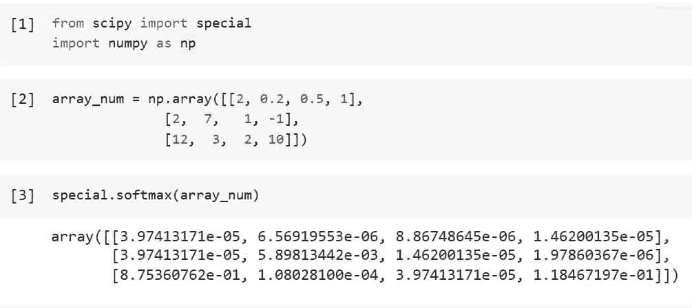
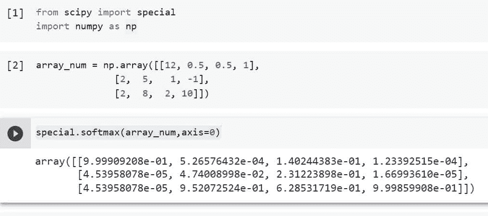
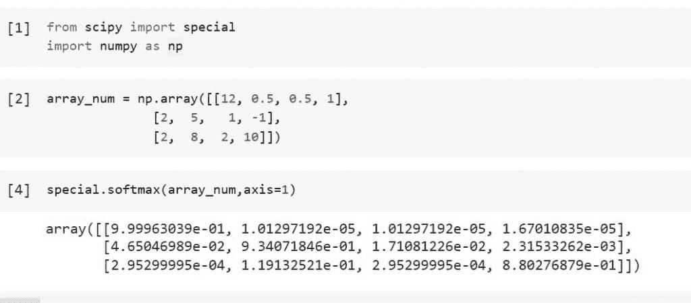
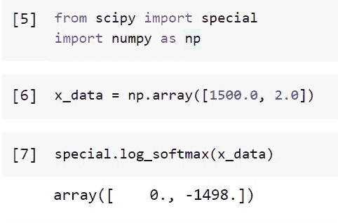
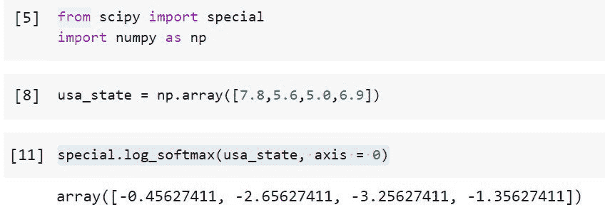

# python Scipy soft max—[详细指南]

> 原文：<https://pythonguides.com/python-scipy-softmax/>

[](https://sharepointsky.teachable.com/p/python-and-machine-learning-training-course)

我们将学习“***”Python Scipy Softmax***，其中我们将在给定数组或数组的特定轴上使用 soft max 函数，还将涉及以下主题。

*   什么是 softmax 函数？
*   Python Scipy Softmax
*   如何沿列应用 Scipy softmax 函数
*   如何沿行使用 Scipy softmax 函数
*   如何计算数据或数组的 log softmax
*   如何在阵列轴上执行 log softmax

目录

[](#)

*   [什么是 softmax 功能？](#What_is_the_softmax_function "What is the softmax function?")
*   [Python Scipy Softmax](#Python_Scipy_Softmax "Python Scipy Softmax")
*   [Python Scipy Softmax Axis Columns](#Python_Scipy_Softmax_Axis_Columns "Python Scipy Softmax Axis Columns")
*   [Python Scipy Softmax Axis Rows](#Python_Scipy_Softmax_Axis_Rows "Python Scipy Softmax Axis Rows")
*   [Python Scipy Log Softmax](#Python_Scipy_Log_Softmax "Python Scipy Log Softmax")
*   [Python Scipy Log Softmax Axis](#Python_Scipy_Log_Softmax_Axis "Python Scipy Log Softmax Axis")

## 什么是 softmax 功能？

使用 softmax 函数(也称为 softargmax 或归一化指数函数)将 K 个实数的向量转换为 K 个可能结果的概率分布。

多项式逻辑回归将它作为逻辑函数向几个维度的扩展。为了基于 Luce 的选择公理将神经网络的输出标准化为投影输出类上的概率分布，softmax 函数经常被用作最终激活函数。

softmax 函数提供 K 个实数的向量 z 作为输入，将其归一化为 K 个概率的概率分布，K 个概率与输入值的指数成比例。

换句话说，在应用 softmax 之前，一些向量分量可能是负的或大于 1，并且它们的总和可能不等于 1。但是，在应用 softmax 之后，每个分量都将在范围{(0，1)(0，1)}内，并且这些分量加起来将为 1，因此它们可以被解释为概率。此外，更高的概率将来自更大的输入组件。

在下一小节中，我们将学习如何使用 Python Scipy 方法来使用 softmax 函数。

阅读:[如何使用 Python Scipy Linprog](https://pythonguides.com/python-scipy-linprog/)

## Python Scipy Softmax

Python Scipy 模块`*`scipy.special`*`中名为`*`softmax()`*`的方法通过将每个元素的指数除以所有元素的指数之和来修改数组中的每个元素。

下面给出了语法。

```py
scipy.special.softmax(x, axis=0)
```

其中参数为:

*   **x(array_data):** 是作为输入的数据的数组。
*   **轴(None，int):** 沿指定轴计算值。

`*`softmax()`*` 方法的结果是`*`s`*`，它是一个与 x 大小相同的数组。结果将等于沿所选轴的 ndarray 类型的数组。

使用下面列出的 Python 代码，导入必要的库。

```py
from scipy import special
import numpy as np
```

使用下一节中的代码创建一个数字数组。

```py
array_num = np.array([[2, 0.2, 0.5, 1],
              [2,  7,   1, -1],
              [12,  3,  2, 10]])
```

使用下面的代码，对整个数组应用 softmax 函数来改变每个值。

```py
special.softmax(array_num)
```



Python Scipy Softmax

这就是如何使用 Python Scipy 的方法`*`softmax()`*`对给定的数据数组应用 softmax。

阅读:[如何使用 Python Scipy Gaussian_Kde](https://pythonguides.com/python-scipy-gaussian_kde/)

## Python Scipy Softmax Axis Columns

Python Scipy 方法`*`softmax()`*`接受一个参数给`axis`来修改数组中的每个元素，方法是沿着特定的轴(如行和列)将每个元素的指数除以所有元素的指数之和。

在本节中，我们将沿着表示列的轴=0 应用 softmax。

使用下面列出的 Python 代码，导入必要的库。

```py
from scipy import special
import numpy as np
```

使用下一节中的代码创建一个数字数组。

```py
array_num = np.array([[12, 0.5, 0.5, 1],
              [2,  5,   1, -1],
              [2,  8,  2, 10]])
```

使用下面的代码，对列(轴=0)应用 softmax 函数来改变每个值。

```py
special.softmax(array_num,axis=0)
```



Python Scipy Softmax Axis Columns

这就是如何使用 Python Scipy 的方法`*`softmax()`*`的参数`*`axis`*`沿着列或轴= 0 计算 softmax 变换。

阅读: [Python Scipy 稀疏 Csr_matrix](https://pythonguides.com/python-scipy-sparse-csr_matrix/)

## Python Scipy Softmax Axis Rows

我们已经学习了如何使用方法`*`sofmax()`*`的参数`*`axis`*`沿着列应用 softmax 变换。

在本节中，我们将沿着代表行的轴=1 应用 softmax。

使用下面列出的 Python 代码，导入必要的库。

```py
from scipy import special
import numpy as np
```

使用下一节中的代码创建一个数字数组。

```py
array_num = np.array([[12, 0.5, 0.5, 1],
              [2,  5,   1, -1],
              [2,  8,  2, 10]])
```

使用下面的代码，对行(轴=1)应用 softmax 函数来改变每个值。

```py
special.softmax(array_num,axis=1)
```



Python Scipy Softmax Axis Rows

这就是如何使用 Python Scipy 的方法`*`softmax()`*`的参数`*`axis`*`沿着行或轴= 1 计算 softmax 变换。

阅读: [Python Scipy Butterworth 滤镜](https://pythonguides.com/python-scipy-butterworth-filter/)

## Python Scipy Log Softmax

在数学中，log softmax 是 softmax 函数的对数。对数概率对概率的使用——对数概率就是概率的对数——是使用 log-softmax 对 softmax 的核心。

使用 log softmax 代替 softmax 有许多好处，例如增强梯度优化和数值性能。Python Scipy 在模块`*`scipy.special`*`中有一个方法`*`log_softmax()`*`,用于计算 softmax 函数的对数。

下面给出了语法。

```py
scipy.special.log_softmax(x, axis=None)
```

其中参数为:

*   **x(array_data):** 是输入数组。
*   **轴(int，整数元组):**值-沿轴计算。默认情况下，将跨整个数组 x 计算 Softmax，即无。

方法`*`log_softmax()`*`返回 ***`s`(一个具有 x 的形状的数组。沿着指定的轴，结果的指数将加起来为 1。如果 x 是标量，则返回一个标量)*scalar 或 ndrray 类型的 T5。**

举个例子，按照以下步骤计算阵列的 log softmax:

使用下面列出的 Python 代码，导入必要的库。

```py
from scipy import special
import numpy as np
```

使用下一节中的代码创建一个数字数组。

```py
x_data = np.array([1500.0, 2.0])
```

使用下面的代码，应用 log softmax 函数。

```py
log_softmax(x_data)
```



Python Scipy Log Softmax

这就是如何使用 Python Scipy 的方法`*`log_softmax()`*`计算给定数组的 log softmax。

阅读: [Python Scipy Stats Fit +示例](https://pythonguides.com/python-scipy-stats-fit/)

## Python Scipy Log Softmax Axis

我们将使用 Python Scipy 的方法`*`log_softmax()`*`的参数`*`axis`*`沿着特定的轴(如行和列)应用 log softmax。

让我们以下面的步骤为例:

使用下面的 python 代码导入所需的库或方法。

```py
from scipy import special
import numpy as np
```

使用下面的代码创建一个数组，该数组是美国各州`California = 7.8`、`Texas = 5.6`、`New York = 5.0`和`Florida = 6.9`的实际 GDP 增长率。

```py
usa_state = np.array([7.8,5.6,5.0,6.9])
```

现在使用下面的代码将 log softmax 函数沿着轴= 0 应用到创建的数组。

```py
special.log_softmax(usa_state, axis = 0)
```



Python Scipy Log Softmax Axis

这就是如何使用 Python Scipy 的方法`*`log_softmax()`*`将 log softmax 函数应用于数据。

*   [Python Scipy Load Mat File](https://pythonguides.com/python-scipy-load-mat-file/)
*   [Python Scipy Gamma](https://pythonguides.com/python-scipy-gamma/)
*   [Python Scipy Linalg Eig](https://pythonguides.com/python-scipy-linalg-eig/)
*   [Python Scipy Linalg Svd](https://pythonguides.com/python-scipy-linalg-svd/)
*   [Python Scipy Stats Norm](https://pythonguides.com/python-scipy-stats-norm/)
*   [Scipy Ndimage Imread](https://pythonguides.com/python-scipy-ndimage-imread/)
*   [Python Scipy 正常测试](https://pythonguides.com/python-scipy-normal-test/)

我们讲述了如何对给定的数组或数据执行 softmax 和 log softmax，还通过以下主题学习或应用了数组或数据的特定轴上的这些函数。

*   什么是 softmax 函数？
*   Python Scipy Softmax
*   如何沿列应用 Scipy softmax 函数
*   如何沿行使用 Scipy softmax 函数
*   如何计算数据或数组的 log softmax
*   如何在阵列轴上执行 log softmax

[Bijay Kumar](https://pythonguides.com/author/fewlines4biju/)

Python 是美国最流行的语言之一。我从事 Python 工作已经有很长时间了，我在与 Tkinter、Pandas、NumPy、Turtle、Django、Matplotlib、Tensorflow、Scipy、Scikit-Learn 等各种库合作方面拥有专业知识。我有与美国、加拿大、英国、澳大利亚、新西兰等国家的各种客户合作的经验。查看我的个人资料。

[enjoysharepoint.com/](https://enjoysharepoint.com/)[](https://www.facebook.com/fewlines4biju "Facebook")[](https://www.linkedin.com/in/fewlines4biju/ "Linkedin")[](https://twitter.com/fewlines4biju "Twitter")