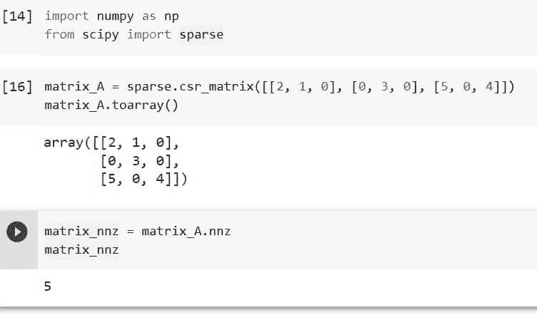

# Python Scipy 稀疏 Csr_matrix

> 原文：<https://pythonguides.com/python-scipy-sparse-csr_matrix/>

[](https://sharepointsky.teachable.com/p/python-and-machine-learning-training-course)

我们将在本教程中学习“***”Python Scipy 稀疏 Csr_matrix*** ”，以便我们可以生成 Csr 矩阵并使用各种技术，包括乘法、点和转置。

将涵盖以下概念，以及定位 CSR 矩阵中最大和最小项目的索引。

*   什么是科学稀疏 Csr_matrix
*   Python Scipy 稀疏 Csr_matrix
*   Python Scipy 稀疏 Csr_matrix 乘法
*   Python Scipy 稀疏 Csr_matrix Indptr
*   Python Scipy 稀疏 Csr_matrix 点
*   Python Scipy 稀疏 Csr_matrix 形状
*   Python Scipy 稀疏 Csr_matrix 排序索引
*   Python Scipy 稀疏 Csr_matrix Nnz
*   Python Scipy 稀疏 Csr_matrix 转置
*   Python Scipy 稀疏 Csr_matrix Argmax
*   Python Scipy 稀疏 Csr_matrix Argmin

目录

[](#)

*   [什么是 Scipy 稀疏 Csr_matrix？](#What_is_Scipy_Sparse_Csr_matrix "What is Scipy Sparse Csr_matrix?")
*   [Python Scipy 稀疏 Csr_matrix](#Python_Scipy_Sparse_Csr_matrix "Python Scipy Sparse Csr_matrix")
*   [Python Scipy 稀疏 Csr_matrix 乘法](#Python_Scipy_Sparse_Csr_matrix_Multiply "Python Scipy Sparse Csr_matrix Multiply")
*   [Python Scipy 稀疏 Csr_matrix Indptr](#Python_Scipy_Sparse_Csr_matrix_Indptr "Python Scipy Sparse Csr_matrix Indptr")
*   [Python Scipy 稀疏 Csr_matrix Dot](#Python_Scipy_Sparse_Csr_matrix_Dot "Python Scipy Sparse Csr_matrix Dot")
*   [Python Scipy 稀疏 Csr_matrix 形状](#Python_Scipy_Sparse_Csr_matrix_Shape "Python Scipy Sparse Csr_matrix Shape")
*   [Python Scipy 稀疏 Csr_matrix 排序索引](#Python_Scipy_Sparse_Csr_matrix_Sort_indices "Python Scipy Sparse Csr_matrix Sort indices")
*   [Python Scipy 稀疏 Csr_matrix Nnz](#Python_Scipy_Sparse_Csr_matrix_Nnz "Python Scipy Sparse Csr_matrix Nnz")
*   [Python Scipy 稀疏 Csr_matrix 转置](#Python_Scipy_Sparse_Csr_matrix_Transpose "Python Scipy Sparse Csr_matrix Transpose")
*   [Python Scipy 稀疏 Csr_matrix Argmax](#Python_Scipy_Sparse_Csr_matrix_Argmax "Python Scipy Sparse Csr_matrix Argmax")
*   [Python Scipy 稀疏 Csr_matrix Argmin](#Python_Scipy_Sparse_Csr_matrix_Argmin "Python Scipy Sparse Csr_matrix Argmin")

## 什么是 Scipy 稀疏 Csr_matrix？

有两种常见的矩阵类型:稀疏矩阵和稠密矩阵。与具有大多数非零元素的密集矩阵相比，稀疏矩阵具有大多数零。

当一个大矩阵可用时，大多数元素通常为零。因此，只使用非零数字进行运算是合理的，因为零乘以任何数的结果总是零。

*   Scipy 中的众多稀疏矩阵函数只保存非零元素。通过这样做，可以减少数据存储所需的内存量。机器学习过程需要频繁地将数据帧存储在内存中。
*   数据帧被分割，以便它能适合 RAM。通过压缩，数据可以很容易地存储在 RAM 中。通过对稀疏矩阵的唯一非零值执行操作，可以显著提高算法的执行性能。

Scipy 提供的算法之一叫做压缩稀疏行(CSR)。下面是它的工作原理。

假设一个文本文档包含如下所示的单词或文本。

> 这是一瓶清酒
> 
> 不是清华大学。这是清华技术，是吗？

第一步是索引:给单词编号。如果单词重复，分配相同的数字。从这一步我们可以确定文档中的总字数。

```py
This is a Tsinfo
 0   1  2   3
This is not Tsinfo. It is Tsinfotechnologies, Is it?
 0   1  4    3     5   1       6              1  5 
```

索引从零开始。第一个单词是“This”，其索引为“0”。每隔一个不同的单词也将有一个索引。因为单词“This”在文档中出现了两次，所以每次它都接收相同的索引值“0”。

第二步是文档向量表示:文档中的每一行都有一个向量表示。

有多少不同的指数？由于在这种情况下有 7 个索引，范围从 0 到 6，每个文档(或行)由 7 个值表示，其中每个值指示与每个索引相关联的特定术语出现的频率。

```py
(word-index): (This-0), (is-1), (a-2), (Tsinfo-3), (not-4), (It-5), (Tsinfotechnologies-6)
```

```py
[1111000],[1111000],[2210000]
```

第三步是为每个文档创建一个稀疏向量:每个文档的稀疏矩阵表示如下所示。它消除所有为 0 的值，只存储非零值。

```py
Doc<01,11>
Doc<01,11,21,31>
```

阅读: [Python Scipy 统计符合](https://pythonguides.com/python-scipy-stats-fit/)

## Python Scipy 稀疏 Csr_matrix

Scipy 子包`*`scipy.sparse`*`中的函数允许我们生成 CSR 矩阵，它代表压缩稀疏行矩阵。

如果我们需要的是一个可以执行加法、乘法、减法、矩阵幂和除法的矩阵，那么 CSR 矩阵是合适的。

如下所示，生成 CSR 矩阵有多种方法，但这里我们将使用其中一种方法来创建矩阵。要了解更多信息，请访问 Python Scipy 的官方文档。

我们将使用方法 `csr_matrix(D)` 或也称为 rank _ 2n array 或密集矩阵。

使用下面的代码导入必要的库。

```py
import numpy as np
from scipy.sparse import csr_matrix
```

使用下面的代码创建一个秩为 2 的矩阵。

```py
D = np.array([[1, 0, 1, 0, 0, 0], [2, 0, 2, 0, 0, 1],\
 [0, 0, 0, 2, 0, 1]])
```

使用以下代码检查装箱的矩阵。

```py
print(D)
```

将创建的矩阵传递给函数 **`csr_matrix()`** ，使用下面的代码创建``*csr matrix*``并查看。

```py
# Creating csr matrix
csr_m = csr_matrix(D)
csr_m.toarray()
```


Python Scipy Sparse Csr_matrix

这就是如何使用 Python Scipy 的方法`*`csr_matrix()`*`创建 CSR 矩阵。

阅读: [Python Scipy 加载 Mat 文件](https://pythonguides.com/python-scipy-load-mat-file/)

## Python Scipy 稀疏 Csr_matrix 乘法

稀疏矩阵是指其大部分元素为零的矩阵。SciPy 用于数值数据的二维稀疏矩阵包称为**“SciPy . sparse”**。它提供给我们，各种各样的类，各种各样的类来构建稀疏矩阵。这两个类分别是 `csc_matrix` 和 `csr_matrix` 。

与用于构建压缩稀疏行矩阵的 `csr_matrix()` 不同， `csc_matrix()` 创建压缩稀疏列矩阵。

为了将两个稀疏矩阵相乘，我们使用 CSR 矩阵类提供的`*`multiply()`*`方法。让我们以下面的代码为例进行演示。

使用下面的 python 代码导入所需的库。

```py
from scipy import sparse
import numpy as np
```

使用以下代码创建第一个 CSR 矩阵。

```py
row_1 = np.array([0, 1, 2, 0 ])
col_1 = np.array([0, 3, 0, 1])
data_1 = np.array([3, 4, 9, 8])

csr_matrix_A = sparse.csr_matrix((data_1, 
                          (row_1, col_1)),
                        shape = (3, 4))
print("first CSR matrix: \n", 
      csr_matrix_A.toarray())
```

使用以下代码创建第二个 CSR 矩阵。

```py
row_2 = np.array([1, 2, 0, 0 ])
col_2 = np.array([3, 0, 0, 1])
data_2 = np.array([8, 3, 4, 9])

csr_matrix_B = sparse.csr_matrix((data_2, 
                          (row_2, col_2)),
                        shape = (3, 4))
print("Second CSR matrix: \n", 
      csr_matrix_B.toarray())
```


Python Scipy Sparse Csr_matrix Multiply Example

使用方法`*`mulitply()`*`将两个矩阵相乘。

```py
sparse_matrix_AB = csr_matrix_A.multiply(csr_matrix_B)
print("Multiplication of Sparse Matrix:\n",
      sparse_matrix_AB.toarray())
```


Python Scipy Sparse Csr_matrix Multiply

输出矩阵包含`*`csr_matrix_A`*`和`*`csr_matrix_B`*`的乘积。

这就是如何将方法`*`multiply()`*`应用于 CSR 矩阵以获得两个 CSR 矩阵的乘积。

阅读 [Python Scipy ttest_ind](https://pythonguides.com/python-scipy-ttest_ind/)

## Python Scipy 稀疏 Csr_matrix Indptr

方法`*`csr_matrix()`*`的属性`*`Indptr`*`是 CSR 格式的矩阵的索引指针数组。

下面给出了语法。

```py
csr_matrix((data, indices, indptr), [shape=(M, N)])
```

其中参数为:

*   **数据:**矩阵的 CSR 格式数据数组
*   **索引:**CSR 格式的矩阵的索引数组
*   矩阵的 CSR 格式索引指针数组
*   **形状:**用于指定矩阵的形状。

让我们按照以下步骤使用 Indptr 创建一个 CSR 矩阵:

使用下面的 python 代码导入所需的库或方法。

```py
import numpy as np
from scipy import sparse
```

使用**指标**、**指标**和**数据**值创建一个稀疏的 CSR 矩阵。

```py
indptr_ = np.array([0, 6, 2, 3])
indices_ = np.array([0, 5, 4, 0, 4, 2])
data_ = np.array([1, 2, 3, 4, 5, 6])
matrix_csr = sparse.csr_matrix((data_, indices_, indptr_), shape=(3, 3))
matrix_csr.toarray()
```


Python Scipy Sparse Csr_matrix Indptr

要检查索引指针，在上面创建的矩阵上使用属性`indptr`。

```py
matrix_csr.indptr
```


Python Scipy Sparse Csr_matrix Indptr Example

这就是如何使用 CSR 矩阵上的属性`*`indptr`*`获得 CSR 格式的矩阵索引指针数组。

阅读: [Python Scipy Stats Norm](https://pythonguides.com/python-scipy-stats-norm/)

## Python Scipy 稀疏 Csr_matrix Dot

Python Scipy sparse 有一个方法 `dot()` 来寻找 CSR 矩阵的普通点积。

让我们以下面的步骤为例:

使用下面的 python 代码导入所需的库或方法。

```py
import numpy as np
from scipy import sparse
```

使用下面的代码为点积创建一个数组。

```py
array_v = np.array([-1, 0, 1])
```

使用下面的代码创建一个 CSR 矩阵。

```py
matrix_A = sparse.csr_matrix([[2, 1, 0], [0, 3, 0], [5, 0, 4]])
```

使用下面的代码，通过在矩阵上应用`dot()`方法，计算上面创建的矩阵的点。

```py
matrix_A.dot(array_v)
```


Python Scipy Sparse Csr_matrix Dot

这就是如何使用 Python Scipy 的方法`*`dot()`*`找到任何 CSR 矩阵的点积。

阅读: [Python Scipy 正常测试](https://pythonguides.com/python-scipy-normal-test/)

## Python Scipy 稀疏 Csr_matrix 形状

方法`*`get_shape()`*`可应用于 CSR 矩阵以获得形状。下面给出了语法。

```py
csr_matrix.get_shape()
```

让我们以下面的步骤为例:

使用下面的 python 代码导入所需的库或方法。

```py
import numpy as np
from scipy import sparse
```

使用下面的代码创建一个稀疏的 CSR 矩阵。

```py
matrx = sparse.csr_matrix((4, 4), dtype=np.int8)
```

现在对上面创建的 CSR 矩阵使用函数`get_shape()`。

```py
matrx.get_shape()
```


Python Scipy Sparse Csr_matrix Shape

这就是如何使用 get_shape()方法获得任何 CSR 矩阵的形状，该方法返回元组中的结果。

阅读: [Python Scipy Stats 泊松](https://pythonguides.com/python-scipy-stats-poisson/)

## Python Scipy 稀疏 Csr_matrix 排序索引

Python Scipy 的方法`sort_indices()`应用于 CSR 矩阵，对矩阵的索引进行排序。

使用下面的 python 代码导入所需的库或方法。

```py
import numpy as np
from scipy import sparse
```

使用 indptr、索引和数据值创建一个稀疏的 CSR 矩阵。

```py
indptr_ = np.array([0, 3, 2, 6])
indices_ = np.array([0, 3, 2, 0, 2, 1])
data_ = np.array([1, 2, 3, 4, 5, 6])
matrix_csr = sparse.csr_matrix((data_, indices_, indptr_), shape=(3, 3))
matrix_csr.toarray()
```

现在使用下面的代码将方法`*`sort_indices()`*`应用于上面的矩阵。

```py
matrix_csr.sort_indices
```


Python Scipy Sparse Csr_matrix Sort indices

这就是如何在 CSR 矩阵上应用属性`*`sort_indices`*`来对矩阵的索引进行排序。

阅读: [Python Scipy 特征值](https://pythonguides.com/python-scipy-eigenvalues/)

## Python Scipy 稀疏 Csr_matrix Nnz

“非零”元素通过稀疏矩阵保存在几个数组中。基本上，nnz 报告这些数组的大小。

让我们通过一个例子来理解，并通过以下步骤找到 CSR 矩阵中非零元素的大小:

使用下面的 python 代码导入所需的库或方法。

```py
import numpy as np
from scipy import sparse
```

使用下面的代码创建一个稀疏的 CSR 矩阵。

```py
matrix_A = sparse.csr_matrix([[2, 1, 0], [0, 3, 0], [5, 0, 4]])
matrix_A.toarray()
```

现在使用下面的代码在矩阵上应用方法`nnz`。

```py
matrix_nnz = matrix_A.nnz
matrix_nnz
```



Python Scipy Sparse Csr_matrix Nnz

这就是如何使用 Python Scipy 的属性`*`nnz`*`知道 CSR 矩阵中非零元素的大小或数量。

阅读: [Python Scipy 统计模式](https://pythonguides.com/python-scipy-stats-mode/)

## Python Scipy 稀疏 Csr_matrix 转置

通过将行翻转为列或将列翻转为行，可以找到矩阵的转置。Python Scipy 有一个 transpose()方法，可以应用于 CSR 矩阵来反转稀疏矩阵的维数。

下面给出了语法。

```py
csr_matrix.transpose(axes=None, copy=False)
```

其中参数为:

*   **axes:** 这个参数出现在签名中的唯一原因是为了确保 NumPy 兼容性。除默认值外，不应输入任何其他内容。
*   **copy(boolean):** 是否应该尽可能地模仿自我属性。根据所使用的稀疏矩阵的种类，不同的属性被复制到不同的程度。

让我们通过一个示例来理解，并按照以下步骤计算 CSR 矩阵的转置:

使用下面的 python 代码导入所需的库或方法。

```py
import numpy as np
from scipy import sparse
```

使用下面的代码创建一个稀疏的 CSR 矩阵。

```py
matrix_A = sparse.csr_matrix([[2, 1, 0], [0, 3, 0], [5, 0, 4]])
matrix_A.toarray()
```

现在使用下面的代码将方法`transpose()`应用到矩阵`matrix_A`上。

```py
matrix_trans = matrix_A.transpose()
matrix_trans.toarray()
```


Python Scipy Sparse Csr_matrix Transpose

这就是如何在 CSR 矩阵上使用 Python Scipy 的方法`*`transpose()`*` 将行翻转为列或者将列翻转为行。

Read: [Python Scipy Freqz](https://pythonguides.com/python-scipy-freqz/)

## Python Scipy 稀疏 Csr_matrix Argmax

`*`csr_matrix`*`的方法`*`argmax()`*` Python Scipy 是作为索引返回的沿轴的最大元素。

下面给出了语法。

```py
csr_matrix.argmax(axis=None)
```

其中参数为:

**轴(0，1，-1，-2):** 沿此轴计算 argmax。如果没有(默认值)，则返回展平数据的最大元素的索引。

使用下面的 python 代码导入所需的库或方法。

```py
import numpy as np
from scipy import sparse
```

使用 indptr、索引和数据值创建一个稀疏的 CSR 矩阵。

```py
indptr_ = np.array([0, 3, 2, 6])
indices_ = np.array([0, 2, 1, 0, 1, 1])
data_ = np.array([1, 2, 3, 4, 5, 6])
matrix_csr = sparse.csr_matrix((data_, indices_, indptr_), shape=(3, 3))
print(matrix_csr.toarray()) 
```

现在使用下面的代码将 CSR 矩阵传递给方法`argmax()`。

```py
print("Index of the maximum (14) element is :",sparse.csr_matrix.argmax(matrix_csr))
```


Python Scipy Sparse Csr_matrix Argmax

这就是如何使用 Python Scipy 的方法`argman()`找到 CSR 矩阵中最大元素的索引。

阅读: [Python Scipy 距离矩阵](https://pythonguides.com/scipy-distance-matrix/)

## Python Scipy 稀疏 Csr_matrix Argmin

`*`csr_matrix`*`的方法`*`argmin()`*` Python Scipy 是沿轴的最小元素，作为索引返回。

下面给出了语法。

```py
csr_matrix.argmin(axis=None)
```

其中参数为:

**轴(0，1，-1，-2):** 沿此轴计算 argmin。如果没有(默认值)，则返回展平数据的最大元素的索引。

使用下面的 python 代码导入所需的库或方法。

```py
import numpy as np
from scipy import sparse
```

使用 indptr、索引和数据值创建一个稀疏的 CSR 矩阵。

```py
indptr_ = np.array([0, 3, 2, 6])
indices_ = np.array([0, 2, 1, 0, 1, 1])
data_ = np.array([11, 21, 6, 8, 15, 16])
matrix_csr = sparse.csr_matrix((data_, indices_, indptr_), shape=(3, 3))
print(matrix_csr.toarray())
print("Index of the minimum element is :",sparse.csr_matrix.argmin(matrix_csr))
```

现在使用下面的代码将 CSR 矩阵传递给方法`argmin()`。

```py
print("Index of the minimum element is :",sparse.csr_matrix.argmin(matrix_csr))
```


Python Scipy Sparse Csr_matrix Argmin

这就是如何使用 Python Scipy 的方法`*`argmin()`*`找到 CSR 矩阵中元素最小值的索引。

您可能也喜欢阅读下面的 Python SciPy 教程。

*   [Python Scipy 置信区间](https://pythonguides.com/scipy-confidence-interval/)
*   [Python Scipy Lognormal ](https://pythonguides.com/python-scipy-lognormal/)
*   [Python Scipy 平滑](https://pythonguides.com/python-scipy-smoothing/)
*   [Python Scipy 卡方检验](https://pythonguides.com/python-scipy-chi-square-test/)
*   [Python Scipy 特殊模块](https://pythonguides.com/python-scipy-special/)
*   [Python Scipy Matrix +示例](https://pythonguides.com/python-scipy-matrix/)

在本教程中，我们已经学习了如何创建一个 CSR 矩阵，并探讨了排序，寻找矩阵形状的最大和最小元素的索引等。此外，还介绍了以下主题。

*   什么是科学稀疏 Csr_matrix
*   Python Scipy 稀疏 Csr_matrix
*   Python Scipy 稀疏 Csr_matrix 乘法
*   Python Scipy 稀疏 Csr_matrix Indptr
*   Python Scipy 稀疏 Csr_matrix 点
*   Python Scipy 稀疏 Csr_matrix 形状
*   Python Scipy 稀疏 Csr_matrix 排序索引
*   Python Scipy 稀疏 Csr_matrix Nnz
*   Python Scipy 稀疏 Csr_matrix 转置
*   Python Scipy 稀疏 Csr_matrix Argmax
*   Python Scipy 稀疏 Csr_matrix Argmin

[Bijay Kumar](https://pythonguides.com/author/fewlines4biju/)

Python 是美国最流行的语言之一。我从事 Python 工作已经有很长时间了，我在与 Tkinter、Pandas、NumPy、Turtle、Django、Matplotlib、Tensorflow、Scipy、Scikit-Learn 等各种库合作方面拥有专业知识。我有与美国、加拿大、英国、澳大利亚、新西兰等国家的各种客户合作的经验。查看我的个人资料。

[enjoysharepoint.com/](https://enjoysharepoint.com/)[](https://www.facebook.com/fewlines4biju "Facebook")[](https://www.linkedin.com/in/fewlines4biju/ "Linkedin")[](https://twitter.com/fewlines4biju "Twitter")