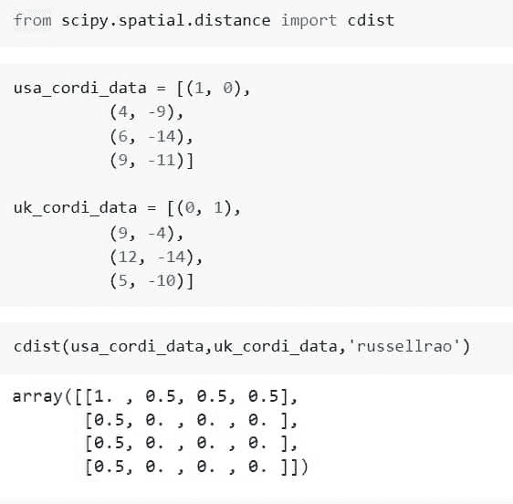

# Python Scipy 空间距离 Cdist[有 8 个例子]

> 原文：<https://pythonguides.com/python-scipy-spatial-distance-cdist/>

[](https://sharepointsky.teachable.com/p/python-and-machine-learning-training-course)

在本 Python Scipy 教程中，我们将通过以下主题了解如何使用“ **Python Scipy 空间距离 Cdist** ”来计算两个输入集合之间的空间距离，其中使用了多种度量，如 Cityblock、Jaccard 等。

*   Python Scipy 空间距离 Cdist
*   Python Scipy 空间距离 Cdist 度量
*   Python Scipy 空间距离 Cdist 输出
*   Python Scipy 空间距离 Cdist 欧几里得
*   Python Scipy 空间距离 cdist russellrao
*   Python Scipy 空间距离 Cdist Chebyshev
*   Python Scipy 空间距离 Cdist 城市街区
*   Python Scipy 空间距离 Cdist Jaccard

目录

[](#)

*   [Python Scipy 空间距离 Cdist](#Python_Scipy_Spatial_Distance_Cdist "Python Scipy Spatial Distance Cdist")
*   [Python Scipy 空间距离 Cdist 度量](#Python_Scipy_Spatial_Distance_Cdist_Metric "Python Scipy Spatial Distance Cdist Metric")
*   [Python Scipy 空间距离 Cdist 输出](#Python_Scipy_Spatial_Distance_Cdist_Output "Python Scipy Spatial Distance Cdist Output")
*   [Python Scipy 空间距离 Cdist 欧几里德](#Python_Scipy_Spatial_Distance_Cdist_Euclidean "Python Scipy Spatial Distance Cdist Euclidean")
*   [Python Scipy 空间距离 Cdist Russellrao](#Python_Scipy_Spatial_Distance_Cdist_Russellrao "Python Scipy Spatial Distance Cdist Russellrao")
*   [Python Scipy 空间距离 Cdist 切比雪夫](#Python_Scipy_Spatial_Distance_Cdist_Chebyshev "Python Scipy Spatial Distance Cdist Chebyshev")
*   [Python Scipy 空间距离 Cdist Cityblock](#Python_Scipy_Spatial_Distance_Cdist_Cityblock "Python Scipy Spatial Distance Cdist Cityblock")
*   [Python Scipy 空间距离 Cdist Jaccard](#Python_Scipy_Spatial_Distance_Cdist_Jaccard "Python Scipy Spatial Distance Cdist Jaccard")

## Python Scipy 空间距离 Cdist

Python Scipy 的模块`*`scipy.spatial.distance`*`包含一个名为`*`cdist()`*`的方法，用于确定两个输入集合之间的距离。

下面给出了语法。

```py
scipy.spatial.distance.cdist(XA, XB, metric='correlation')
```

其中参数为:

*   **XA(array _ data):**n 维原始 mB 观测值的数组，每个测量 mB 乘 n。
*   **XB(array _ data):**n 维原始 mB 观测值的数组，每个测量 mB 乘 n
*   **metric(callabel，str):** 要应用的距离单位。距离函数可以是"堪培拉"、"布雷柯蒂斯"、"切比雪夫"、"相关"、"城市街区"、"余弦"、"欧几里得"、"骰子"、"汉明"、"库尔辛斯基"、"简森山农"、"库尔辛斯基"、"匹配"、"马哈拉诺比斯"、"明科夫斯基"、"罗素劳"、"罗格斯坦本"、"修克列迪安"。

方法`cdist()`的结果是尺寸为 mA 乘 mB 的距离矩阵。

让我们用 4 个美国城市的二维坐标，按照以下步骤找出它们的余弦距离:

使用下面的 python 代码导入所需的库或方法。

```py
from scipy.spatial.distance import cdist
```

使用下面的代码定义美国任意四个城市的坐标。

```py
coord_data = [5, -10),
          (4, -9),
          (6, -14),
          (9, -11]
```

现在使用下面的代码将上面的坐标传递给度量等于`*`cosine`*`的方法`*`cdist()`*`。

```py
cdist(coord_data,coord_data,'cosine')
```


Python Scipy Spatial Distance Cdist

这就是如何使用 Python Scipy 的方法`*`cdist()`*`计算坐标之间的距离。

读取[科学常数](https://pythonguides.com/scipy-constants/)

## Python Scipy 空间距离 Cdist 度量

我们有足够的关于 Python Scipy 的方法`*`cdist()`*`的信息来计算两个输入值集合之间的距离。让我们了解一下用于指定我们想要使用的距离度量类型的参数`*`metric`*`。

参数`metric`接受类似于 `***“canberra,” “braycurtis,” “chebyshev,” “correlation,” “cityblock,” “cosine,” “euclidean,” “dice,” “hamming,” “kulsinski,” “jensenshannon,” “kulczynski1,” “matching,” “mahalanobis,” “minkowski,” “russellrao,” “rogerstanimoto,” “seuclidean”***`的一系列距离度量。

解释每个距离度量不是本教程的一部分，但可以在互联网上搜索。

根据我们想要计算的距离类型，每种度量以不同的方式计算距离。我们将在本教程的小节中了解一些指标。

阅读: [Python Scipy Linalg Eigh](https://pythonguides.com/python-scipy-linalg-eigh/)

## Python Scipy 空间距离 Cdist 输出

Python Scipy 的方法`cdist()`返回两个值 ***`y`(其响应是 mA 乘 mB 距离矩阵。度量 dist(u=XA[i]，v=XB[j])是为每个 I 和 j 计算的，并保存在 ijth 元素中)*** 和 ***`ValueError`(也就是说，如果 XA 和 XB 没有相同的列长度，则会引发异常)*** 。

让我们来看一个例子，这里我们将看到关于第二个值`*`ValueError`*`。我们可以在本教程的小节中检查第一个值`*`y`*`。

使用下面的 python 代码导入所需的库或方法。

```py
from scipy.spatial.distance import cdist
```

使用下面的代码定义美国和英国任意四个城市的坐标。

```py
usa_cordi_data = [5,6]

uk_cordi_data = [(6, -8),
          (9, -4),
          (12, -14),
          (5, -10)]
```

从上面的代码中，我们可以看到第一个数组`*`usa_cordi_data`*`是一维类型的，第二个数组`*`uk_cordi_data`*`是二维类型的。

现在使用下面的代码将上面的坐标传递给度量等于`*`euclidean`*`的方法`*`cdist()`*`。

```py
cdist(usa_cordi_data,uk_cordi_data,'euclidean')
```


Python Scipy Spatial Distance Cdist Output

从输出来看，上面的代码显示了由于两个数组之间的维度不匹配而导致的错误`*`ValueError`*`。

阅读[科学统计 Zscore](https://pythonguides.com/scipy-stats-zscore/)

## Python Scipy 空间距离 Cdist 欧几里德

两点之间的距离在数学上称为欧几里德距离。换句话说，两点之间线段的长度就是定义欧几里德空间中两个位置之间的欧几里德距离的含义。

它有时被称为毕达哥拉斯距离，因为欧几里得距离可以使用坐标点和毕达哥拉斯定理来计算。

正如我们在上述小节中讨论的度量，这里我们将使用欧几里得度量来计算美国城市坐标之间的距离。

使用下面的 python 代码导入所需的库或方法。

```py
from scipy.spatial.distance import cdist
```

使用下面的代码定义美国和英国任意四个城市的坐标。

```py
usa_cordi_data = [(5, -10),
          (4, -9),
          (6, -14),
          (9, -11)]

uk_cordi_data = [(6, -8),
          (9, -4),
          (12, -14),
          (5, -10)]
```

现在使用下面的代码将上面的坐标传递给度量等于`*`euclidean`*`的方法`*`cdist()`*`。

```py
cdist(usa_cordi_data,uk_cordi_data,'euclidean')
```


Python Scipy Spatial Distance Cdist Euclidean

这就是如何使用度量等于`*`euclidean`*`的方法`*`cdist()`*`计算空间距离。

读取[图像旋转](https://pythonguides.com/scipy-ndimage-rotate/)

## Python Scipy 空间距离 Cdist Russellrao

Python Scipy 方法`*`cdist()`*`接受一个度量`*`russellrao`*`来计算两个输入集合之间的 Russell-Rao 差异。

让我们以下面的步骤为例:

使用下面的 python 代码导入所需的库或方法。

```py
from scipy.spatial.distance import cdist
```

使用下面的代码创建坐标点。

```py
usa_cordi_data = [(1, 0),
          (4, -9),
          (6, -14),
          (9, -11)]

uk_cordi_data = [(0, 1),
          (9, -4),
          (12, -14),
          (5, -10)]
```

现在使用下面的代码将上面的坐标传递给度量等于`*`russellrao`*`的方法`*`cdist()`*`。

```py
cdist(usa_cordi_data,uk_cordi_data,'russellrao')
```



Python Scipy Spatial Distance Cdist Russellrao

这就是如何使用度量等于`*`russellrao`*`的方法`*`cdist()`*`计算空间距离。

## Python Scipy 空间距离 Cdist 切比雪夫

数学中的“最大度量”，通常称为切比雪夫距离公式，将两点之间的距离确定为它们沿所有轴的最大差异之和。

Python Scipy 方法`*`cdist()`*`接受一个度量`*`chebyshev`*`来计算每对两个输入集合之间的切比雪夫距离。

让我们以下面的步骤为例:

使用下面的 python 代码导入所需的库或方法。

```py
from scipy.spatial.distance import cdist
```

使用下面的代码创建两个坐标点。

```py
cordi_data_1 = [(1, 0),
          (4, -9),
          (6, -14),
          (9, -11)]

cordi_data_2 = [(0, 1),
          (9, -4),
          (12, -14),
          (5, -10)]
```

使用下面的代码将上述坐标传递给度量等于`*`chebyshev`*`的方法`*`cdist()`*`。

```py
cdist(cordi_data_1,cordi_data_2,'Chebyshev')
```


Python Scipy Spatial Distance Cdist Chebyshev

这就是如何使用度量等于`*`chebyshev`*`的方法`*`cdist()`*`计算空间距离。

阅读[科学卷积](https://pythonguides.com/scipy-convolve/)

## Python Scipy 空间距离 Cdist Cityblock

曼哈顿(城市街区)距离是所有维度上两点之间所有绝对距离的总和。Python Scipy 方法`*`cdist()`*`接受一个度量`*`cityblock`*`来计算每两个输入集合之间的曼哈顿距离。

让我们以下面的步骤为例:

使用下面的 python 代码导入所需的库或方法。

```py
from scipy.spatial.distance import cdist
```

使用下面的代码创建两个坐标点。

```py
cordi_data_1 = [(5, 0),
          (3, -7),
          (2, -9),
          (10, -11)]

cordi_data_2 = [(3, 1),
          (7, -4),
          (7, -14),
          (9, -10)]
```

使用下面的代码将上述坐标传递给度量等于`*`cityblock`*`的方法`*`cdist()`*`。

```py
cdist(cordi_data_1,cordi_data_2,'cityblock')
```


Python Scipy Spatial Distance Cdist Cityblock

这就是如何在 Python Scipy 中使用度量等于`*`cityblock`*`的方法`*`cdist()`*`计算空间距离。

读取[信号](https://pythonguides.com/scipy-signal/)

## Python Scipy 空间距离 Cdist Jaccard

通常的做法是使用 Jaccard 距离来计算 n*n 矩阵，以便对 n 个样本集进行聚类和多维缩放。所有有限集的集合都用这个距离来度量。

Python Scipy 方法`*`cdist()`*`接受一个度量`*`jaccard`*`来计算每对两个输入集合之间的 Jaccard 距离。

让我们以下面的步骤为例:

使用下面的 python 代码导入所需的库或方法。

```py
from scipy.spatial.distance import cdist
```

使用下面的代码创建两个坐标点。

```py
cordi_data_1 = [(5, 0),
          (3, -7),
          (2, -9),
          (10, -11)]

cordi_data_2 = [(3, 1),
          (7, -4),
          (7, -14),
          (9, -10)]
```

使用下面的代码将上述坐标传递给度量等于`*`jaccard`*`的方法`*`cdist()`*`。

```py
cdist(cordi_data_1,cordi_data_2,'jaccard')
```


Python Scipy Spatial Distance Cdist Jaccard

这就是如何使用度量等于`*`jaccard`*`的方法`*`cdist()`*`计算空间距离。

本教程教我们如何在 Scipy 中使用欧几里得、Jaccard、Cityblock、Chebyshev 等指标计算每对两个输入集合之间的空间距离，主题如下。

*   Python Scipy 空间距离 Cdist
*   Python Scipy 空间距离 Cdist 度量
*   Python Scipy 空间距离 Cdist 输出
*   Python Scipy 空间距离 Cdist 欧几里得
*   Python Scipy 空间距离 cdist russellrao
*   Python Scipy 空间距离 Cdist Chebyshev
*   Python Scipy 空间距离 Cdist 城市街区
*   Python Scipy 空间距离 Cdist Jaccard

您可能会喜欢以下 Python Scipy 教程:

*   [科学整合](https://pythonguides.com/scipy-integrate/)
*   [Scipy Misc](https://pythonguides.com/scipy-misc/)
*   [Scipy Stats](https://pythonguides.com/scipy-stats/) 的缩写形式
*   [Scipy Rotate Image](https://pythonguides.com/scipy-rotate-image/)
*   [Scipy Sparse](https://pythonguides.com/scipy-sparse/)

[Saurabh](https://pythonguides.com/author/saurabh/)

我叫 Kumar Saurabh，是一名 Python 开发人员，在 TSInfo Technologies 工作。此外，像 Python 编程，SciPy，机器学习，人工智能等技术的专业知识。是我喜欢做的事情。