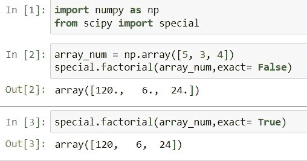
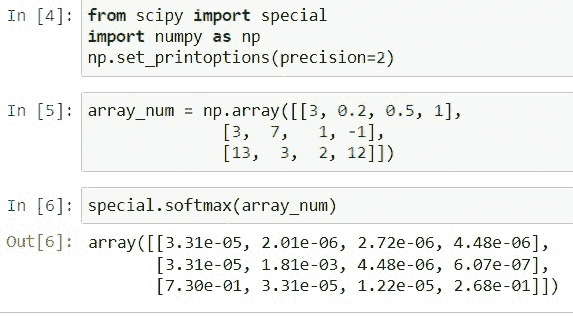
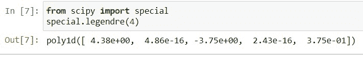
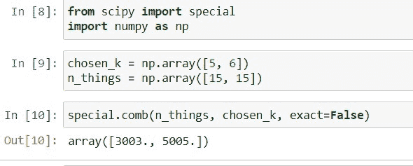
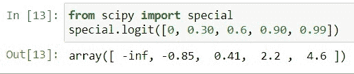
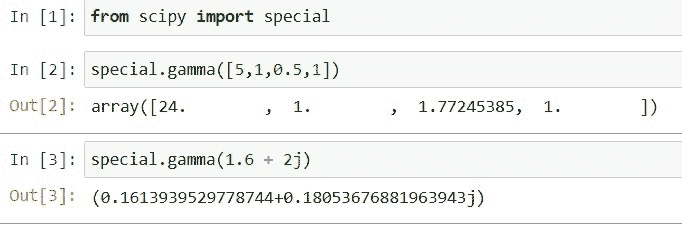
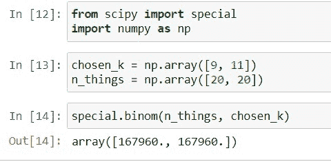
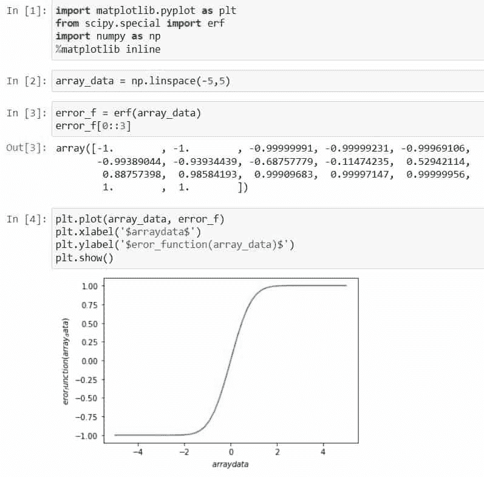
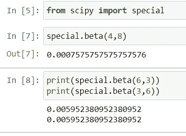

# Python Scipy 特殊模块及示例

> 原文：<https://pythonguides.com/python-scipy-special/>

[](https://sharepointsky.teachable.com/p/python-and-machine-learning-training-course)

这个 [Python 教程](https://pythonguides.com/learn-python/)将学习“ `Python Scipy Special` ”，在这里我们将计算给定数字或整数数组的阶乘、组合和 softmax。此外，涵盖以下主题:

*   Python Scipy 特殊版
*   Python Scipy 特殊阶乘
*   Python Scipy 特殊 Softmax
*   Python Scipy 特殊传说
*   蟒蛇皮特殊梳子
*   Python Scipy 特殊逻辑
*   Python Scipy 特殊伽玛
*   Python Scipy 特殊绑定
*   Python Scipy 特殊 Erf
*   Python Scipy 特别测试版

目录

[](#)

*   [Python Scipy 特辑](#Python_Scipy_Special "Python Scipy Special")
*   [Python Scipy 特殊阶乘](#Python_Scipy_Special_Factorial "Python Scipy Special Factorial")
*   [Python Scipy Special soft max](#Python_Scipy_Special_Softmax "Python Scipy Special Softmax")
*   [Python Scipy 特殊传说](#Python_Scipy_Special_Legendre "Python Scipy Special Legendre")
*   [Python Scipy 专用梳子](#Python_Scipy_Special_Comb "Python Scipy Special Comb")
*   [Python Scipy 特殊逻辑](#Python_Scipy_Special_Logit "Python Scipy Special Logit")
*   [Python Scipy 特殊伽玛](#Python_Scipy_Special_Gamma "Python Scipy Special Gamma")
*   [Python Scipy 特殊绑定](#Python_Scipy_Special_Binom "Python Scipy Special Binom")
*   [Python Scipy 特殊 Erf](#Python_Scipy_Special_Erf "Python Scipy Special Erf")
*   [Python Scipy 特别测试版](#Python_Scipy_Special_Beta "Python Scipy Special Beta")

## Python Scipy 特辑

[Python Scipy](https://pythonguides.com/what-is-scipy-in-python/) 模块`*`scipy.special`*`定义了几个独特的数学物理函数，是``*scipy.special module*``的主要部分。椭圆波、艾里波、船波、贝塔波、超几何波、马蒂厄波、抛物柱面波、开尔文波、斯特鲁维波、伽马波和椭球波是一些可用的函数。

还有一些特定的低级 stats 函数不打算供公共使用，因为 stats 模块为这些函数提供了一个更加用户友好的界面。

这些函数中的大多数可以接受数组参数，并使用与其他数值 Python 数学函数相同的传播原则返回数组结果。

阅读:[Scipy Linalg–实用指南](https://pythonguides.com/scipy-linalg/)

## Python Scipy 特殊阶乘

Python SciPy 在模块`*`scipy.special`*`中有一个方法`*`factorial`*`,用于获取一个数字或一组数字的阶乘。

下面给出了语法。

```py
scipy.special.factorial(n, exact=True)
```

其中参数为:

*   ***n(array_data，integer):*** 为输入值，如果 n 小于 0，结果为 0。
*   ***exact(布尔):*** 如果为真，用长整数算术计算答案。如果为 False，则使用 gamma 函数以浮点形式快速逼近结果。

方法`*factorial*`返回 ty pe int、array 或 float 的 ***`nf`(数字数组的整数的阶乘)。***

让我们通过下面的步骤来了解一个示例:

使用下面的 python 代码导入所需的库。

```py
import numpy as np
from scipy import special
```

创建一个包含数字的数组，并将该数组传递给方法`*`factorial()`*`,使用下面的代码计算该数组中所有数字的阶乘。

```py
array_num = np.array([5, 3, 4])
special.factorial(array_num,exact= False)
```

使用下面的代码再次计算参数`*`exact`*`等于`*`True`*`的同一个数组的阶乘。

```py
special.factorial(array_num,exact= True)
```



Python Scipy Special Factorial

看看输出，当我们将参数`*`exact`*`的值`*`False`*`(对于 false，它以浮点形式显示结果)更改为`*`True`*`(对于 true，结果仅以整数形式显示)时，阶乘是如何不同的。

这是如何使用 Python Scipy 的方法`*`factorial()`*`计算给定数字或一组数字的阶乘。

阅读:[Scipy Stats Zscore+Examples](https://pythonguides.com/scipy-stats-zscore/)

## Python Scipy Special soft max

Python Scipy 模块`*`scipy.special`*`包含一个方法`*`softmax()`*`，它通过计算每一项的指数除以所有项的指数总和来改变数组中的每一项。

下面给出了语法。

```py
scipy.special.softmax(x, axis=0)
```

其中参数为:

*   x(array_data):它是作为输入的数据的数组。
*   axis(None，int):计算沿指定轴的值。

方法`*`softmax()`*`返回 ndarray 类型的 ***`s`(一个与 x 维数相同的数组，沿所选轴，结果等于 1)***。

让我们通过下面的步骤来了解一个示例:

使用下面的 python 代码导入所需的库。

```py
from scipy import special
import numpy as np
```

使用下面的代码创建一个数字数组。

```py
array_num = np.array([[3, 0.2, 0.5, 1],
              [3,  7,   1, -1],
              [13,  3,  2, 12]])
```

对整个数组应用 softmax 函数，使用下面的代码转换数组的每个值。

```py
special.softmax(array_num)
```



Python Scipy Special Softmax

查看返回的输出，其中包含由方法`*`softmax()`*`转换的值。

这就是如何计算给定数组的 softmax。

阅读: [Scipy 卷积-完整指南](https://pythonguides.com/scipy-convolve/)

## Python Scipy 特殊传说

Python SciPy 的模块`*`scipy.special`*`包含一个计算勒让德多项式的方法`*`legendre()`*`。

下面给出了语法。

```py
scipy.special.legendre(n, monic=True
```

其中参数为:

*   ***n(int):*** 指定多项式的次数。
*   ***monic(boolean):*** 如果是这种情况，那么前导系数应该缩放为 1。

方法`legendre()`返回的`*`P`*`是 orthoploy1d。

让我们以下面的步骤为例:

导入所需的库，并使用下面的代码创建 4 阶勒让德多项式。

```py
from scipy import special
special.legendre(4)
```



Python Scipy Special Legendre

这就是如何使用 Python SciPy 的方法`*`legendre()`*`生成勒让德多项式。

阅读: [Scipy Integrate +示例](https://pythonguides.com/scipy-integrate/)

## Python Scipy 专用梳子

方法`*`comb()`*`用于计算组合，即一次可以做 *`k`* 件不同事情的 *`N`* 种不同组合的数量。这个方法存在于 Python SciPy 的模块`*`scipy.special`*`中。

下面给出了语法。

```py
scipy.special.comb(N, k, repetition=True, exact=True)
```

其中参数为:

*   ***N(ndarray，int):*** 用来定义事物的数量。
*   ***k(ndarray，int):*** 取的元素个数。
*   ***重复(布尔):*** 如果值 repetition 为真，则计算有重复的组合数。
*   ***exact(布尔):*** 如果 exact 为 false，则采用浮点精度；否则，以精确的精度计算大整数。

该方法返回 ndarray、int 和 float 类型的 ***`val`(这是可能的组合总数)*** 。

让我们以下面的步骤为例:

使用下面的 python 代码导入所需的库。

```py
from scipy import special
import numpy as np
```

使用下面的代码定义 N 个事物和元素。

```py
chosen_k = np.array([5, 6])
n_things = np.array([15, 15])
```

使用下面的代码计算组合。

```py
special.comb(n_things, chosen_k, exact=False)
```



Python Scipy Special Comb

这是如何使用 Python SciPy 的方法`*`comb()`*`计算组合的。

阅读:[科学统计-完整指南](https://pythonguides.com/scipy-stats/)

## Python Scipy 特殊逻辑

logit 函数是标准逻辑分布的分位数函数。Python Scipy 模块`*`scipy.special`*`包含一个方法`*`logit()`*`来计算给定 n 数组的 logit。Logit 是通用函数。

下面给出了语法。

```py
scipy.special.logit(x)
```

其中参数`*`x`*`是 logit 应该被逐个元素应用的 n 阵列。

方法`*`logit()`*`返回 ndarray 类型的 ***`out`(与 x 形状相似的 ndarray，其元素是相关 x 条目的 logit 版本)*** 。

让我们使用下面的代码来计算 ndarray 的 logit。

```py
from scipy import special
special.logit([0, 0.30, 0.6, 0.90, 0.99])
```

在上面的代码中，我们已经创建了包含浮点值的数组，并将其传递给方法`*`logit()`*`,以查找数组中值的 logit。



Python Scipy Special Logit

这就是如何使用 Python SciPy 的方法`logit()`计算给定 ndarray 的 logit。

阅读:[Scipy Sparse–有用的教程](https://pythonguides.com/scipy-sparse/)

## Python Scipy 特殊伽玛

Python Scipy 在模块`*`scipy.special`*`中有一个方法`*`gamma()`*`，用于计算给定数组的伽玛。广义阶乘函数就是伽马函数。

下面给出了语法。

```py
scipy.special.gamma(z)
```

其中参数`*`z`*`是数组类型的实值或复值参数。

方法`*`gamma()`*`返回 ndarray 或 scalar 类型的伽马函数的值。

让我们以下面的步骤为例:

使用下面的 python 代码导入库。

```py
from scipy import special
```

创建一个数据数组，并将该数组传递给一个方法`*`gamma()`*`，如代码下面所示。

```py
special.gamma([5,1,0.5,1])
```

定义一个复数，并使用下面的代码计算该数的伽玛。

```py
special.gamma(1.6 + 2j)
```



Python Scipy Special Gamma

正如我们在上面的输出中看到的，我们已经计算了数组和复数的 gamma 值。

这就是如何使用 Python SciPy 的方法`*`gamma()`*`计算给定数组或复数的 gamma 值。

阅读: [Scipy 常量–多个示例](https://pythonguides.com/scipy-constants/)

## Python Scipy 特殊绑定

Binom 代表``*Binomial Coefficient*``，Python SciPy 有一个存在于模块`*`scipy.special`*`中的方法`*`binom()`*`。该方法执行与我们在上面小节中学习的方法`*`comb()`*`相同的操作。要了解更多，请参考上一节***【Python Scipy 梳子】*** 。

下面给出了语法。

```py
scipy.special.binom(n, k)
```

其中参数为:

***N(ndarray，int):*** 用来定义事物的数量。
***k(ndarray，int):*** 所取元素的个数。

让我们以下面的步骤为例:

使用下面的 python 代码导入所需的库。

```py
from scipy import special
import numpy as np
```

使用下面的代码定义 N 个事物和元素。

```py
chosen_k = np.array([9, 11])
n_things = np.array([20, 20])
```

使用下面的代码计算组合。

```py
special.binom(n_things, chosen_k)
```



Python Scipy Special Binom

这是如何使用 Python SciPy 的方法`*`binom()`*`计算组合的。

阅读: [Scipy 旋转图像+示例](https://pythonguides.com/scipy-rotate-image/)

## Python Scipy 特殊 Erf

Erf 代表``*error function*``，它是模块`*`scipy.special`*`中的方法`*`erf()`*`，返回复杂参数的误差函数。

下面给出了语法。

```py
scipy.special.erf(z)
```

其中参数`*`z`*`作为输入的数组数据。

方法`*`erf()`*`返回 ndarray 类型的 ***`res`(指定 x 位置的误差函数值)*** 。

让我们以下面的步骤为例:

使用下面的 python 代码导入必要的库。

```py
import matplotlib.pyplot as plt
from scipy.special import erf
import numpy as np
%matplotlib inline
```

使用下面的代码生成一个数据数组。

```py
array_data = np.linspace(-5,5)
```

使用下面的代码计算数组的误差函数。

```py
error_f = erf(array_data)
error_f[0::3]
```

使用下面的代码绘制误差函数的图形。

```py
plt.plot(array_data, error_f)
plt.xlabel('$arraydata$')
plt.ylabel('$eror_function(array_data)$')
plt.show()
```



Python Scipy Special Erf

这就是如何使用 Python SciPy 的方法`*`erf()`*`计算给定数据的误差函数。

阅读: [Scipy Misc + Examples](https://pythonguides.com/scipy-misc/)

## Python Scipy 特别测试版

贝塔函数，通常被称为第一类欧拉积分，是一种特殊的函数。Python SciPy 在模块`*`scipy.special`*`中有一个方法`*`beta()`*`,该方法被应用到一个包含实数值的数组来获取值。贝塔函数遵循对称模式。

下面给出了语法。

```py
scipy.special.beta(a, b, out=None)
```

其中参数为:

*   ***a，b(array_data):*** 是以实值作为输入的自变量。
*   ***out(ndarray):*** 函数结果可以有一个可选的输出数组。

方法`*`beta()`*`返回 ndarray 类型的 beta 函数的值。

让我们以下面的步骤为例:

使用下面的 python 代码导入必要的库。

```py
from scipy import special
```

使用下面的代码将 beta 函数应用于这些值。

```py
special.bet(4,8)
```

现在执行下面的步骤来看看贝塔函数的对称模式。

```py
print(special.beta(6,3))
print(special.beta(3,6))
```



Python Scipy Special Beta

在第 8 行，我们通过交换函数中值的位置将两个值传递给了方法`*`beta()`*`。结果与上面的输出相同。这就是函数`*`beta()`*`的对称性质。

这就是 Python SciPy 的函数`*`beta()`*`的使用方法。

另外，看看更多的 Python Scipy 教程。

*   [敏感信号——有用教程](https://pythonguides.com/scipy-signal/)
*   [Python Scipy FFT【11 个例子】](https://pythonguides.com/python-scipy-fft/)
*   [Scipy 正态分布](https://pythonguides.com/scipy-normal-distribution/)
*   [Python Scipy Matrix +示例](https://pythonguides.com/python-scipy-matrix/)

因此，在本教程中，我们学习了“`*Python Scipy Special*`”并涵盖了以下主题。

*   Python Scipy 特殊版
*   Python Scipy 特殊阶乘
*   Python Scipy 特殊 Softmax
*   Python Scipy 特殊传说
*   蟒蛇皮特殊梳子
*   Python Scipy 特殊逻辑
*   Python Scipy 特殊伽玛
*   Python Scipy 特殊绑定
*   Python Scipy 特殊 Erf
*   Python Scipy 特别测试版

[Bijay Kumar](https://pythonguides.com/author/fewlines4biju/)

Python 是美国最流行的语言之一。我从事 Python 工作已经有很长时间了，我在与 Tkinter、Pandas、NumPy、Turtle、Django、Matplotlib、Tensorflow、Scipy、Scikit-Learn 等各种库合作方面拥有专业知识。我有与美国、加拿大、英国、澳大利亚、新西兰等国家的各种客户合作的经验。查看我的个人资料。

[enjoysharepoint.com/](https://enjoysharepoint.com/)[](https://www.facebook.com/fewlines4biju "Facebook")[](https://www.linkedin.com/in/fewlines4biju/ "Linkedin")[](https://twitter.com/fewlines4biju "Twitter")