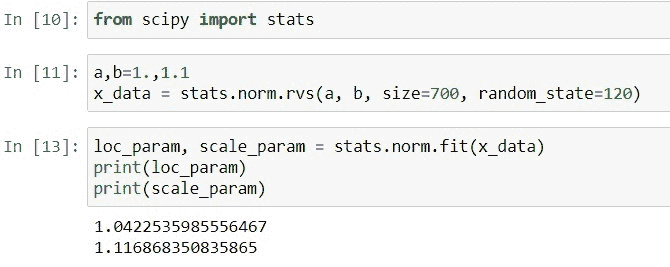
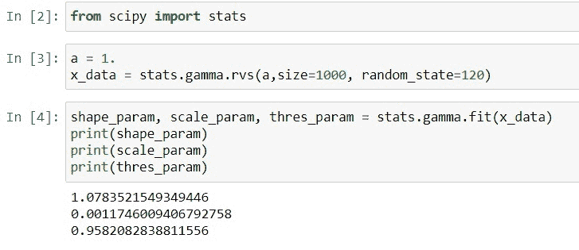
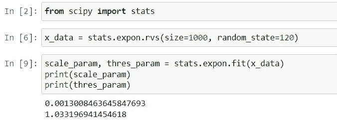
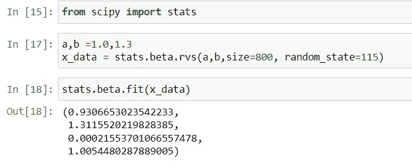
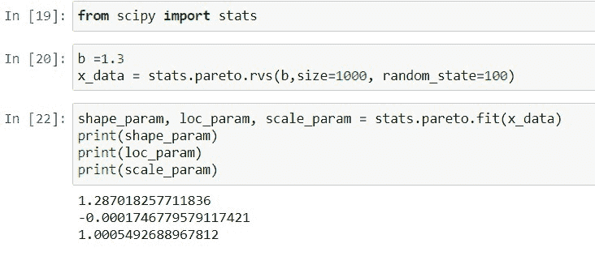
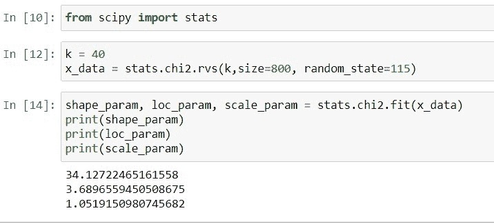

# Python Scipy Stats Fit +示例

> 原文：<https://pythonguides.com/python-scipy-stats-fit/>

[](https://sharepointsky.teachable.com/p/python-and-machine-learning-training-course)

“`*Python Scipy Stats Fit*`”是本 [Python 教程](https://pythonguides.com/learn-python/)将涉及的概念。它告诉我们如何将给定或生成的数据拟合到各种分布中，包括伽玛分布、正态分布和其他分布。包括后续主题。

*   Python Scipy 统计拟合分布
*   Python Scipy 统计符合正态分布
*   Python Scipy 统计符合伽玛分布
*   Python Scipy 统计数据符合指数分布
*   Python Scipy Stats Fit Beta
*   Python Scipy 统计适合帕累托
*   Python Scipy 统计适合 Chi2

目录

[](#)

*   [Python Scipy 统计拟合分布](#Python_Scipy_Stats_Fit_Distribution "Python Scipy Stats Fit Distribution")
*   [Python Scipy 统计符合正态分布](#Python_Scipy_Stats_Fit_Normal_Distribution "Python Scipy Stats Fit Normal Distribution")
*   [Python Scipy 统计符合伽玛分布](#Python_Scipy_Stats_Fit_Gamma_Distribution "Python Scipy Stats Fit Gamma Distribution")
*   [Python Scipy Stats 符合指数分布](#Python_Scipy_Stats_Fit_Exponential_Distribution "Python Scipy Stats Fit Exponential Distribution")
*   [Python Scipy Stats Fit Beta](#Python_Scipy_Stats_Fit_Beta "Python Scipy Stats Fit Beta")
*   [Python Scipy Stats 符合 Pareto](#Python_Scipy_Stats_Fit_Pareto "Python Scipy Stats Fit Pareto")
*   [Python Scipy Stats Fit Chi2](#Python_Scipy_Stats_Fit_Chi2 "Python Scipy Stats Fit Chi2")

## Python Scipy 统计拟合分布

选择最适合数据集合的统计分布的方法称为分布拟合。正态分布、威布尔分布、伽玛分布和最小极值分布是统计分布的几个例子。

公平代表我们数据的分布是至关重要的。如果我们使用不正确的分布，与需求相比，我们的计算结果将不会是过程产生的真实反映。

为了找到与数据最匹配的分布，通常会根据数据评估几种分布。我们不能简单地看一下分布的形状就断定它很适合我们的数据。

我们如何决定哪种发行版是最好的？使用统计方法估计各种分布的参数。这些因素决定了分布。位置、比例、形状和阈值是分布拟合中使用的四个参数。对于每个分布，并不是所有的参数都存在。估计决定各种分布的参数是拟合分布的过程。

分布的位置参数指示它在 x 轴(水平轴)上的位置。分布中的分散程度由比例参数决定。根据形状参数，分布可以采用各种形状。沿 x 轴分布的最小值由阈值参数确定。

在本教程中，我们将使用 Python Scipy 方法来估计分布的参数。

阅读: [Python Scipy 加载 Mat 文件](https://pythonguides.com/python-scipy-load-mat-file/)

## Python Scipy 统计符合正态分布

对于独立的随机变量，正态分布，有时也称为高斯分布，是统计学中最重要的概率分布。大多数人从统计报告中知道它著名的钟形曲线。

大多数观察值都集中在正态分布的中间峰值周围，这是一种围绕其平均值对称的连续概率分布。远离平均值的值的概率在两个方向上逐渐变小。分布的两个尾部的极值也同样罕见。

正如我们讨论的分布的四个参数，形状参数的估计并不总是由分布返回。例如，正态分布只提供位置和规模估计。

在本节中，我们将按照以下步骤使数据符合正态分布:

使用下面的 python 代码导入所需的库或方法。

```py
from scipy import stats
```

使用正态分布生成一些数据，并创建随机变量。

```py
a,b=1.,1.1
x_data = stats.norm.rvs(a, b, size=700, random_state=120)
```

现在使用下面的代码来拟合这两个参数。

```py
loc_param, scale_param = stats.norm.fit(x_data)
print(loc_param)
print(scale_param)
```



Python Scipy Stats Fit Normal Distribution

从输出来看，正态分布的最佳参数值是 1.04(位置)和 1.11(比例)。这就是如何使数据符合正态分布。

阅读: [Python Scipy 统计峰度](https://pythonguides.com/python-scipy-stats-kurtosis/)

## Python Scipy 统计符合伽玛分布

被称为伽马分布的连续概率分布经常被用于许多科学学科中，以建模具有总是为正的偏斜分布的连续变量。它在事件间隔很长的过程中自发地发生。

这种分布有两种不同的形式。形状、比例和阈值是构成三参数伽马分布的三个参数。当阈值参数值设置为 0 时，这是一个双参数伽马分布。

让我们按照以下步骤将数据拟合到伽马分布:

使用下面的 python 代码导入所需的库或方法。

```py
from scipy import stats
```

使用伽玛分布生成一些符合的数据，并创建随机变量。

```py
a = 1.
x_data = stats.gamma.rvs(a,size=1000, random_state=120)
```

现在使用下面的代码来拟合这三个参数。

```py
shape_param, scale_param, thres_param = stats.gamma.fit(x_data)
print(shape_param)
print(scale_param)
print(thres_param)
```



Python Scipy Stats Fit Gamma Distribution

根据输出，伽玛分布的最佳参数值为 1.07(形状)、0.001(比例)和 0.95(阈值)。这就是如何使数据符合伽玛分布。

阅读:[Python Scipy Stats multivarial _ Normal](https://pythonguides.com/python-scipy-stats-multivariate_normal/)

## Python Scipy Stats 符合指数分布

向右倾斜的连续概率分布称为指数分布，表示小值比大值出现得更频繁的变量。随着数据值的增加，概率不断降低，小值具有相对较高的概率。

指数分布有两种不同的形式。自然，双参数变量有两个参数:规模和阈值。当阈值参数设置为零时，分布变为单参数指数分布。在本节中，我们将使数据符合指数分布。

使用下面的 python 代码导入所需的库或方法。

```py
from scipy import stats
```

使用指数分布生成一些数据，并创建随机变量。

```py
x_data = stats.expon.rvs(size=1000, random_state=120)
```

现在使用下面的代码来拟合这两个参数。

```py
scale_param, thres_param = stats.expon.fit(x_data)
print(scale_param)
print(thres_param)
```



Python Scipy Stats Fit Exponential Distribution

从输出来看，指数分布的最佳参数值是 0.0013(标度)和 1.033(阈值)。这就是如何使数据符合指数分布。

Read: [Python Scipy Freqz ](https://pythonguides.com/python-scipy-freqz/)

## Python Scipy Stats Fit Beta

称为贝塔分布的连续概率分布用于模拟其值落在给定范围内的随机变量。使用它来模拟具有一系列可能值的主题区域，包括上限和下限。

beta 分布有两个形状参数，与其他具有形状和比例参数的分布不同。这两个参数都需要正值。在本节中，我们将使数据符合 Beta 分布。

使用下面的 python 代码导入所需的库或方法。

```py
from scipy import stats
```

使用 beta 分布生成一些符合的数据，并创建随机变量。

```py
a,b =1.0,1.3
x_data = stats.beta.rvs(a,b,size=800, random_state=115)
```

现在使用下面的代码来拟合参数。

```py
stats.beta.fit(x_data)
```



Python Scipy Stats Fit Beta

从输出中，我们可以看到贝塔分布的最佳参数。

阅读: [Python Scipy 置信区间](https://pythonguides.com/scipy-confidence-interval/)

## Python Scipy Stats 符合 Pareto

帕累托分布是偏斜的，有“慢慢消失”的长尾。形状参数(也称为斜率参数或帕累托指数)和位置参数一起构成帕累托分布，该分布是由意大利经济学家维尔弗雷多·帕累托在 19 世纪提出的。

在本节中，我们将通过以下步骤使数据符合帕累托分布:

使用下面的 python 代码导入所需的库或方法。

```py
from scipy import stats
```

使用帕累托分布生成一些数据，并创建随机变量。

```py
b =1.3
x_data = stats.pareto.rvs(b,size=1000, random_state=100)
```

现在使用下面的代码来拟合这三个参数。

```py
shape_param, loc_param, scale_param = stats.pareto.fit(x_data)
print(shape_param)
print(loc_param)
print(scale_param)
```



Python Scipy Stats Fit Pareto

根据输出，我们得出结论，pareto 分布的最佳参数值是 1.28(形状)、-0.0(位置)和 1.005(比例)。这就是如何使数据符合帕累托分布。

阅读: [Python Scipy 卡方测试](https://pythonguides.com/python-scipy-chi-square-test/)

## Python Scipy Stats Fit Chi2

一族连续的概率分布被称为卡方(X2)分布。它们经常用于假设检验，如独立性的卡方检验和拟合优度检验。

代表自由度的参数 k 决定了卡方分布的形状。

使用下面的 python 代码导入所需的库或方法。

```py
from scipy import stats
```

使用 chi2 分布生成一些数据，并创建随机变量。

```py
k = 40
x_data = stats.chi2.rvs(k,size=800, random_state=115)
```

现在使用下面的代码来拟合这三个参数。

```py
shape_param, loc_param, scale_param = stats.chi2.fit(x_data)
print(shape_param)
print(loc_param)
print(scale_param)
```



Python Scipy Stats Fit Chi2

根据输出，chi2 分布的最佳参数值为 34.12(形状)、3.68(位置)和 1.05(比例)。这就是如何使数据符合 chi2 分布的方法。

另外，看看更多的 Python SciPy 教程。

*   [Python Scipy Stats Poisson](https://pythonguides.com/python-scipy-stats-poisson/)
*   [Python Scipy Gaussian_Kde](https://pythonguides.com/python-scipy-gaussian_kde/)
*   [Python Scipy 统计数据偏差](https://pythonguides.com/python-scipy-stats-skew/)
*   [Python Scipy Butterworth 滤镜](https://pythonguides.com/python-scipy-butterworth-filter/)
*   [Python Scipy 特殊模块](https://pythonguides.com/python-scipy-special/)
*   [Scipy 正态分布](https://pythonguides.com/scipy-normal-distribution/)

因此，在本教程中，我们已经了解了"`*Python Scipy Stats Fit*`"并涵盖了以下主题。

*   Python Scipy 统计拟合分布
*   Python Scipy 统计符合正态分布
*   Python Scipy 统计符合伽玛分布
*   Python Scipy 统计数据符合指数分布
*   Python Scipy Stats Fit Beta
*   Python Scipy 统计适合帕累托
*   Python Scipy 统计适合 Chi2

[Bijay Kumar](https://pythonguides.com/author/fewlines4biju/)

Python 是美国最流行的语言之一。我从事 Python 工作已经有很长时间了，我在与 Tkinter、Pandas、NumPy、Turtle、Django、Matplotlib、Tensorflow、Scipy、Scikit-Learn 等各种库合作方面拥有专业知识。我有与美国、加拿大、英国、澳大利亚、新西兰等国家的各种客户合作的经验。查看我的个人资料。

[enjoysharepoint.com/](https://enjoysharepoint.com/)[](https://www.facebook.com/fewlines4biju "Facebook")[](https://www.linkedin.com/in/fewlines4biju/ "Linkedin")[](https://twitter.com/fewlines4biju "Twitter")