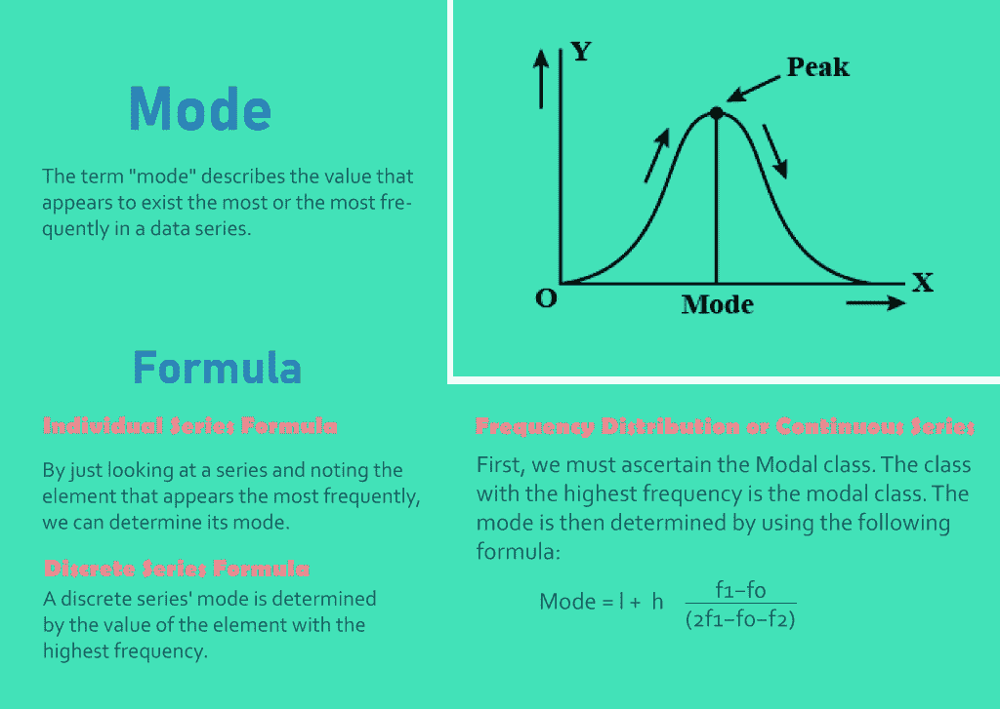
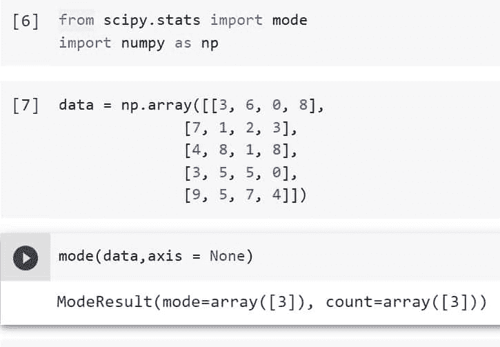
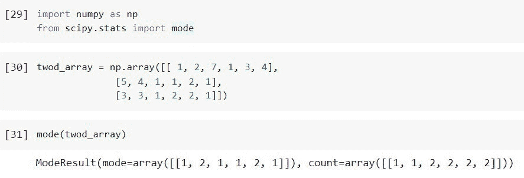
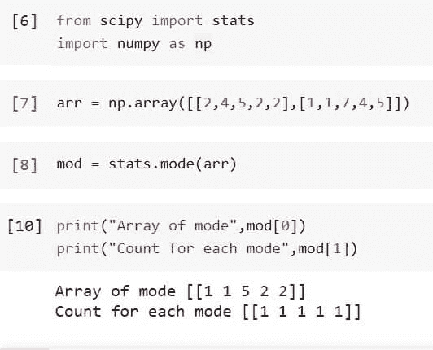
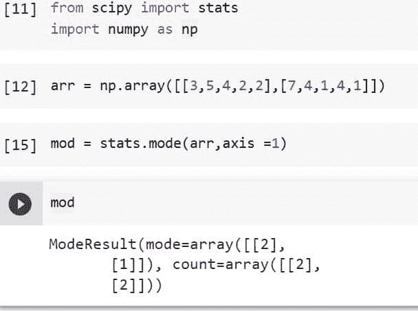
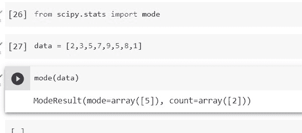

# Python Scipy 统计模式及示例

> 原文：<https://pythonguides.com/python-scipy-stats-mode/>

[](https://sharepointsky.teachable.com/p/python-and-machine-learning-training-course)

在本 [Python 教程](https://pythonguides.com/learn-python/)中，我们将学习“`*Python Scipy Stats Mode*`”其中我们将了解模式的概念，这是统计学中的一个基本概念，有助于确定最频繁出现的值。并涵盖以下主题。

*   Python Scipy 状态模式
*   Python Scipy 统计模式 2d
*   Python Scipy 统计模式示例
*   Python Scipy 统计模式返回
*   Python Scipy 统计模式轴

目录

[](#)

*   [统计学中的众数是什么？](#What_is_the_mode_in_Statistics "What is the mode in Statistics?")
*   [Scipy 状态模式](#Scipy_Stats_Mode "Scipy Stats Mode")
*   [Python Scipy 统计模式 2d](#Python_Scipy_Stats_Mode_2d "Python Scipy Stats Mode 2d")
*   [Python Scipy 统计模式返回](#Python_Scipy_Stats_Mode_Return "Python Scipy Stats Mode Return")
*   [Python Scipy 统计模式轴](#Python_Scipy_Stats_Mode_Axis "Python Scipy Stats Mode Axis")
*   [Python Scipy 统计模式示例](#Python_Scipy_Stats_Mode_Example "Python Scipy Stats Mode Example")

## 统计学中的众数是什么？

在统计学中，持续出现在特定集合中的值称为众数。众数或众数值是数据集中出现频率最高的数字，具有很高的频率。这是衡量集中趋势的三个标准之一，另外两个是平均值和中间值。

例如，集合***“4，2，6，6，8”***具有作为其模式的 *`6`* 。因此，在给定有限数量的观测值的情况下，我们可以快速确定模式。对于给定的值集合，可能有一种模式、几种模式，或者根本没有模式。



Scipy Stats Mode

*   如果一个数据集中有两种模式，则称之为双峰。
*   如果有三种模式，则数据集被称为三模式。
*   如果一个数据集有四种或更多的模式，则称之为多模式。

在本教程中，我们将使用 Python Scipy 的方法计算给定数组的模式。

另外，检查: [Python Scipy Freqz](https://pythonguides.com/python-scipy-freqz/)

## Scipy 状态模式

Python Scipy 在模块`*`scipy.stats`*`中包含一个方法`*`mode()`*`,提供的数组应该作为包含模态值的数组返回。

下面给出了语法。

```py
scipy.stats.mode(a, nan_policy='propagate', axis=0,)
```

其中参数为:

*   **a(array_data):** n 维数组，从中确定模式。
*   **nan_plociy():** 指定在输入包含 nan 的情况下该做什么。(“Propagate”是默认值)以下选项可用:

1.  传播:返回 nan
2.  抛出一个错误
3.  省略:忽略 nan 值。

*   **轴(int):** 轴的方向。默认值为 0。如果没有，将整个数组视为。

方法`*`mode()`*`返回两个值`*`mode`*`和`*`count`*`。

让我们以下面的步骤为例:

使用下面的 python 代码导入必要的库。

```py
from scipy.stats import mode
import numpy as np
```

使用下面的代码创建一个数据数组。

```py
data = np.array([[3, 6, 0, 8],
              [7, 1, 2, 3],
              [4, 8, 1, 8],
              [3, 5, 5, 0],
              [9, 5, 7, 4]])
```

使用下面的代码将上面创建的数据提供给方法`*`mode()`*`。

```py
mode(data,axis = None)
```



Scipy Stats Mode

看看上面的代码输出，方法返回的模式等于 3，计数等于 3。

阅读: [Python Scipy 距离矩阵](https://pythonguides.com/scipy-distance-matrix/)

## Python Scipy 统计模式 2d

从上一小节我们已经知道如何使用方法`*`mode()`*`，这里我们将找到二维数组内的模式。

让我们通过下面的步骤来了解一个示例:

使用下面的 python 代码导入所需的库。

```py
import numpy as np
from scipy.stats import mode
```

使用下面的代码创建一个包含一些元素的二维数组。

```py
twod_array = np.array([[ 1, 2, 7, 1, 3, 4],
              [5, 4, 1, 1, 2, 1],
              [3, 3, 1, 2, 2, 1]])
```

现在使用下面的代码计算上面创建的二维数组的模式。

```py
mode(twod_array)
```



Python Scipy Stats Mode 2d

阅读: [Python Scipy 统计峰度](https://pythonguides.com/python-scipy-stats-kurtosis/)

## Python Scipy 统计模式返回

Python Scipy stats 的方法`*`mode()`*`返回两个 ndarray 类型的值`*`mode`*`和`*`count`*`。

*   **模态:**采集模态值。
*   **计数:**对于每种模式，计数的数组。

让我们按照以下步骤，使用一个示例来探索模式和计数:

使用下面的 python 代码导入所需的库。

```py
from scipy import stats
import numpy as np
```

使用下面的代码创建一个包含值的数组。

```py
arr = np.array([[2,4,5,2,2],[1,1,7,4,5]])
```

将上面创建的数组传递给方法`*`mode()`*`,使用下面的代码计算数组的模态。

```py
mod = stats.mode(arr)
```

现在使用下面的代码检查数组的返回模式和计数。

```py
print("Array of mode",mod[0])
print("Count for each mode",mod[1])
```



Python Scipy Stats Mode Return

这就是如何检查 Python Scipy 的方法`*`mode()`*`的返回值。

阅读: [Python Scipy 置信区间](https://pythonguides.com/scipy-confidence-interval/)

## Python Scipy 统计模式轴

方法`*`mode()`*`接受一个参数`*`axis`*`来计算模式，换句话说，通过指定`*`axis`*`值，可以在数组的不同轴上计算模式。二维数组有两个对应的轴，一个水平穿过列(轴 1)，另一个垂直穿过行(轴 0)。

让我们举一个例子，按照以下步骤计算基于轴的阵列模式:

使用下面的 python 代码导入所需的库。

```py
from scipy import stats
import numpy as np
```

使用下面的代码创建一个包含值的数组。

```py
arr = np.array([[3,5,4,2,2],[7,4,1,4,1]])
```

将上面创建的数组传递给带有``*axis=1*``的方法`*`mode()`*`,以使用下面的代码计算水平跨越列的数组的模式。

```py
mod = stats.mode(arr,axis =1)
```

使用下面的代码检查结果。

```py
mod
```



Python Scipy Stats Mode Axis

这就是如何使用 Python Scipy 的参数`*`axis`*`和方法`*`mode()`*`计算沿着指定轴的数组的模式。

阅读: [Scipy 寻找峰值–有用教程](https://pythonguides.com/scipy-find-peaks/)

## Python Scipy 统计模式示例

我们已经了解了 mode 以及如何使用 Python Scipy 的方法`*`mode()`*`来计算它。在这一节中，我们将再做一个一维数组的例子。

让我们使用下面的 python 代码导入所需的库。

```py
from scipy.stats import kurtosis
```

使用下面的代码生成一个数组，其中包含一些我们想要计算其模式的值。

```py
data = [2,3,5,7,9,5,8,1]
```

使用下面的代码计算上面创建的数据的模式。

```py
mode(data)
```



Python Scipy Stats Mode Example

上述代码的输出返回两个结果，即等于 5 的模式值和等于 2 的计数值。这意味着整个数据或数组的众数是 5，并且数字 5 在整个数组中出现了两次。

另外，看看更多的 Python SciPy 教程。

*   [Python Scipy Kdtree](https://pythonguides.com/python-scipy-kdtree/)
*   [Scipy 稀疏 Csr_matrix](https://pythonguides.com/python-scipy-sparse-csr_matrix/)
*   [Python Scipy Load Mat File](https://pythonguides.com/python-scipy-load-mat-file/)
*   [Python Scipy 特殊模块](https://pythonguides.com/python-scipy-special/)
*   [Scipy Linalg–实用指南](https://pythonguides.com/scipy-linalg/)
*   [Scipy Stats Zscore +示例](https://pythonguides.com/scipy-stats-zscore/)
*   [Scipy Convolve–完整指南](https://pythonguides.com/scipy-convolve/)
*   [Scipy Integrate +示例](https://pythonguides.com/scipy-integrate/)

因此，在本教程中，我们已经了解了“`*Python Scipy Stats Mode*`”并涵盖了以下主题。

*   Python Scipy 状态模式
*   Python Scipy 统计模式 2d
*   Python Scipy 统计模式示例
*   Python Scipy 统计模式返回
*   Python Scipy 统计模式轴

[Bijay Kumar](https://pythonguides.com/author/fewlines4biju/)

Python 是美国最流行的语言之一。我从事 Python 工作已经有很长时间了，我在与 Tkinter、Pandas、NumPy、Turtle、Django、Matplotlib、Tensorflow、Scipy、Scikit-Learn 等各种库合作方面拥有专业知识。我有与美国、加拿大、英国、澳大利亚、新西兰等国家的各种客户合作的经验。查看我的个人资料。

[enjoysharepoint.com/](https://enjoysharepoint.com/)[](https://www.facebook.com/fewlines4biju "Facebook")[](https://www.linkedin.com/in/fewlines4biju/ "Linkedin")[](https://twitter.com/fewlines4biju "Twitter")