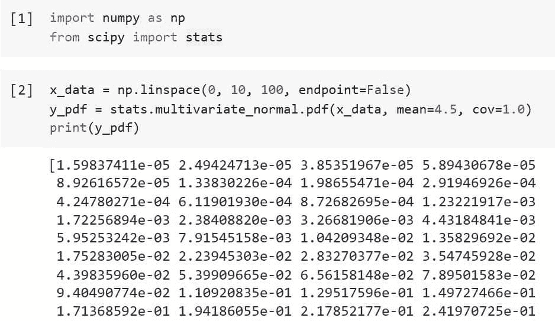
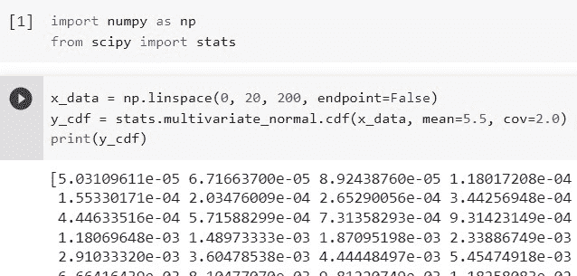
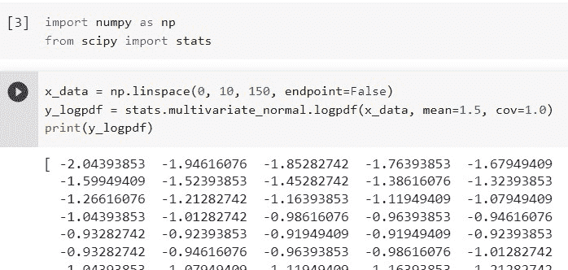
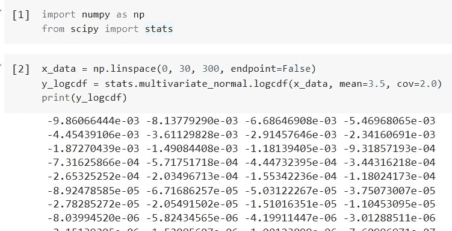
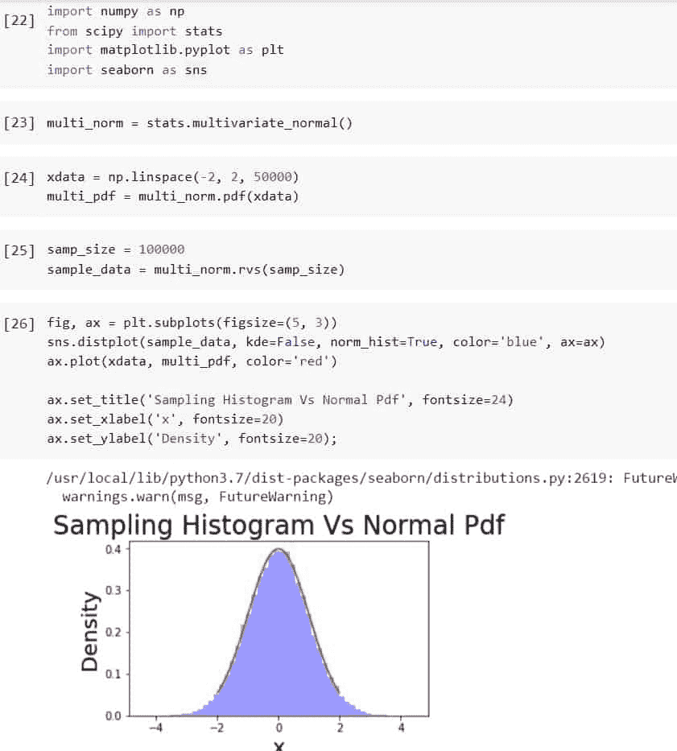

# Python Scipy Stats 多变量 _ 正常

> 原文：<https://pythonguides.com/python-scipy-stats-multivariate_normal/>

[](https://sharepointsky.teachable.com/p/python-and-machine-learning-training-course)

在这个 [Python 教程](https://pythonguides.com/learn-python/)中，我们将学习“`*Scipy Stats multivarial _ Normal*`”，在这里我们将创建一个多元正态分布或从中抽取一个随机样本。我们现在将通过几个例子来探讨以下主题，以帮助您学习如何使用"`*" Python Scipy multivarial _ Normal*`。"

*   Python Scipy Stats 多变量 _ 正常
*   Python Scipy Stats 多变量 _ 正常 Cdf
*   Python Scipy Stats 多变量 _ 正态对数 pdf
*   Python Scipy Stats 多变量 _ 正态 Logcdf
*   Python Scipy Stats 多变量 _ 正态 Rvs

另外，查看相关教程: [Python Scipy Stats Poisson](https://pythonguides.com/python-scipy-stats-poisson/)

目录

[](#)

*   [Python Scipy Stats multivarial _ Normal](#Python_Scipy_Stats_Multivariate_Normal "Python Scipy Stats Multivariate_Normal")
*   [Python Scipy Stats multivarial _ Normal Cdf](#Python_Scipy_Stats_Multivariate_Normal_Cdf "Python Scipy Stats Multivariate_Normal Cdf")
*   [Python Scipy Stats Multivariate _ Normal log pdf](#Python_Scipy_Stats_Multivariate_Normal_Logpdf "Python Scipy Stats Multivariate_Normal Logpdf")
*   [Python Scipy Stats Multivariate _ Normal log CDF](#Python_Scipy_Stats_Multivariate_Normal_Logcdf "Python Scipy Stats Multivariate_Normal Logcdf")
*   [Python Scipy Stats Multivariate _ Normal Rvs](#Python_Scipy_Stats_Multivariate_Normal_Rvs "Python Scipy Stats Multivariate_Normal Rvs")

## Python Scipy Stats multivarial _ Normal

多元分布显示两个或多个变量之间的比较以及它们之间的联系。任何包含单个随机变量的单变量分布都存在更广泛的多变量分布。

Python Scipy 在模块`*`scipy.stats`*`中有一个对象`*`multivariate_normal()`*`，它是一个正态多元随机变量，用于创建多元正态分布

关键字“ ***的意思是*** 描述的是这个意思。协方差矩阵通过关键字 *`cov`* 指定。

下面给出了语法。

```py
scipy.stats.multivariate_normal.method_name(x,mean,cov,allow_singular, random_state)
```

其中参数为:

*   **x(array_data):** 分位数，分量用 x 的最后一个轴表示。
*   **平均值(array_data):** 分布的平均值。
*   **cov(array_data):** 协方差的分布矩阵。
*   **allow_singular(boolean):** 是否允许单一协方差矩阵。
*   **random_state(int):** 如果 seed 为 None(或 np.random)，则使用 numpy.random 函数。随机状态的单例被雇用。如果种子是整数，则种子用于创建新的 RandomState 实例。如果种子已经有一个生成器或 RandomState 实例，则使用该实例。

让我们以下面的步骤为例:

使用下面的 python 代码导入所需的库。

```py
import numpy as np
from scipy import stats
```

使用下面的代码创建 x 数据，我们想要找到它的 pdf。

```py
x_data = np.linspace(0, 10, 100, endpoint=False)
y_pdf = stats.multivariate_normal.pdf(x_data, mean=4.5, cov=1.0)
print(y_pdf)
```



Scipy Stats Multivariate_Normal

这就是如何使用 Python Scipy 的方法``multivariate_normal.pdf()``计算多元正态分布的 pdf。

另外，请阅读: [Python Scipy Freqz](https://pythonguides.com/python-scipy-freqz/)

## Python Scipy Stats multivarial _ Normal Cdf

当描述随机变量的概率分布时，利用累积分布函数。离散、连续或混合变量的概率可以用它来描述。为了得到随机变量的累积概率，将概率密度函数相加。

对象``multivariate_normal``有一个方法``cdf``来计算多元正态分布的累积分布。

下面给出了语法。

```py
scipy.stats.multivariate_normal.cdf(x,mean,cov,allow_singular, random_state)
```

参数已经在上面的小节中定义了。

让我们以下面的步骤为例:

使用下面的 python 代码导入所需的库。

```py
import numpy as np
from scipy import stats
```

创建 x 数据，我们将使用下面的代码计算它的 cdf。

```py
x_data = np.linspace(0, 20, 200, endpoint=False)
y_cdf = stats.multivariate_normal.cdf(x_data, mean=5.5, cov=2.0)
print(y_cdf)
```



Scipy Stats Multivariate_Normal Cdf

这就是如何使用 Python Scipy 的方法``multivariate_normal.cdf()``计算多元正态分布的 cdf。

阅读: [Python Scipy 置信区间](https://pythonguides.com/scipy-confidence-interval/)

## Python Scipy Stats Multivariate _ Normal log pdf

在给定向量 x 处评估的多元正态密度函数由其自然对数表示，这是该向量的对数似然性。对数密度函数也称为对数概率密度函数(PDF)，是概率密度函数的标准缩写。

下面给出了该方法的语法。

```py
scipy.stats.multivariate_normal.logpdf(x,mean,cov,allow_singular, random_state)
```

让我们以下面的步骤为例:

使用下面的 python 代码导入所需的库。

```py
import numpy as np
from scipy import stats
```

创建 x 数据，使用下面的代码计算其日志 pdf。

```py
x_data = np.linspace(0, 10, 150, endpoint=False)
y_logpdf = stats.multivariate_normal.logpdf(x_data, mean=1.5, cov=1.0)
print(y_logpdf)
```



Scipy Stats Multivariate_Normal Logpdf

这就是如何使用 Python Scipy 的方法``multivariate_normal.logpdf()``计算多元正态分布的 logpdf。

阅读: [Python Scipy 指数](https://pythonguides.com/python-scipy-exponential/)

## Python Scipy Stats Multivariate _ Normal log CDF

对数正态分布的 CDF 函数给出了对数正态分布的观测值(具有对数标度参数和形状参数)小于或等于 x 的可能性。同样的概念也适用于多元正态分布。

下面给出了该方法的语法。

```py
scipy.stats.multivariate_normal.logcdf(x,mean,cov,allow_singular, random_state)
```

让我们以下面的步骤为例:

使用下面的 python 代码导入所需的库。

```py
import numpy as np
from scipy import stats
```

创建 x 数据，使用下面的代码计算其对数 cdf。

```py
x_data = np.linspace(0, 30, 300, endpoint=False)
y_logcdf = stats.multivariate_normal.logcdf(x_data, mean=3.5, cov=2.0)
print(y_logcdf)
```



Scipy Stats Multivariate_Normal Logcdf

这就是如何使用 Python Scipy 的方法``multivariate_normal.logcdf()``计算多元正态分布的 logcdf。

阅读: [Python Scipy FFT](https://pythonguides.com/python-scipy-fft/)

## Python Scipy Stats Multivariate _ Normal Rvs

模块`*`scipy.stats`*`中对象`*`multivariate_normal`*`的方法`*`rvs()`*`创建一个多元正态分布，并从中随机抽取样本。

下面给出了语法。

```py
scipy.stats.multivariate_normal.rvs(mean,cov,size, random_state)
```

其中参数为:

*   **平均值(array_data):** 分布的平均值。
    **cov(array_data):** 协方差的分布矩阵。
*   **size(int):** 是样本大小。
*   **random_state(int):** 如果种子为 None，则使用 numpy.random 方法(或 np.random)。它使用 RandomState 的单个实例。如果种子是整数，则使用该种子创建一个新的 RandomState 对象。如果种子已经有一个生成器或 RandomState 实例，则使用该实例。

让我们按照以下步骤从多元正态分布中抽取一个随机样本:

使用下面的 python 代码导入所需的库。

```py
import numpy as np
from scipy import stats
import matplotlib.pyplot as plt
import seaborn as sns
```

使用下面的代码创建一个多元正态分布。

```py
multi_norm = stats.multivariate_normal()
```

使用下面的代码创建多元正态分布的 x 数据和 pdf。

```py
xdata = np.linspace(-2, 2, 50000)
multi_pdf = multi_norm.pdf(xdata)
```

使用下面的代码从多元正态分布中抽取一个随机样本。

```py
samp_size = 100000
sample_data = multi_norm.rvs(samp_size)
```

使用下面的代码绘制上面绘制的样本。

```py
fig, ax = plt.subplots(figsize=(12, 5))
sns.distplot(sample_data, kde=False, norm_hist=True, color='blue', ax=ax)
ax.plot(xdata, multi_pdf, color='red')

ax.set_title('Sampling Histogram Vs Normal Pdf', fontsize=24)
ax.set_xlabel('x', fontsize=20)
ax.set_ylabel('Density', fontsize=20);
```



Scipy Stats Multivariate_Normal Rvs

这就是如何使用 Python Scipy 中对象`*`multivariate_normal`*`的方法`*`rvs()`*`从多元正态分布中抽取随机样本。

另外，看看更多的 Python SciPy 教程。

*   [Python Scipy Matrix +示例](https://pythonguides.com/python-scipy-matrix/)
*   [Python Scipy 正常测试](https://pythonguides.com/python-scipy-normal-test/)
*   [Python Scipy Gamma](https://pythonguides.com/python-scipy-gamma/)
*   [Python Scipy 差分进化](https://pythonguides.com/scipy-differential-evolution/)
*   [Python Scipy Mann Whitneyu](https://pythonguides.com/python-scipy-mann-whitneyu/)
*   [Python Scipy Stats Fit](https://pythonguides.com/python-scipy-stats-fit/)
*   [Scipy Linalg–实用指南](https://pythonguides.com/scipy-linalg/)
*   [Scipy Stats Zscore +示例](https://pythonguides.com/scipy-stats-zscore/)
*   [敏感信号——有用教程](https://pythonguides.com/scipy-signal/)

因此，在本教程中，我们已经了解了" ***Python Scipy Stats 多元正态分布*** "并涵盖了以下主题。

*   Python Scipy Stats 多变量 _ 正常
*   Python Scipy Stats 多变量 _ 正常 Cdf
*   Python Scipy Stats 多变量 _ 正态对数 pdf
*   Python Scipy Stats 多变量 _ 正态 Logcdf
*   Python Scipy Stats 多变量 _ 正态 Rvs

[Bijay Kumar](https://pythonguides.com/author/fewlines4biju/)

Python 是美国最流行的语言之一。我从事 Python 工作已经有很长时间了，我在与 Tkinter、Pandas、NumPy、Turtle、Django、Matplotlib、Tensorflow、Scipy、Scikit-Learn 等各种库合作方面拥有专业知识。我有与美国、加拿大、英国、澳大利亚、新西兰等国家的各种客户合作的经验。查看我的个人资料。

[enjoysharepoint.com/](https://enjoysharepoint.com/)[](https://www.facebook.com/fewlines4biju "Facebook")[](https://www.linkedin.com/in/fewlines4biju/ "Linkedin")[](https://twitter.com/fewlines4biju "Twitter")