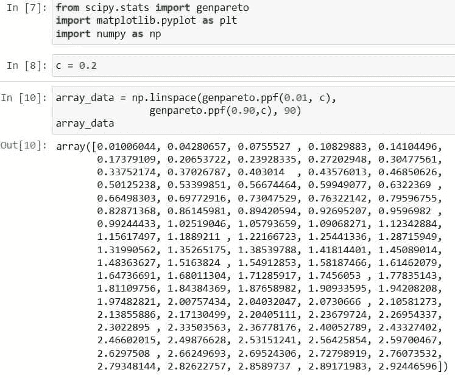
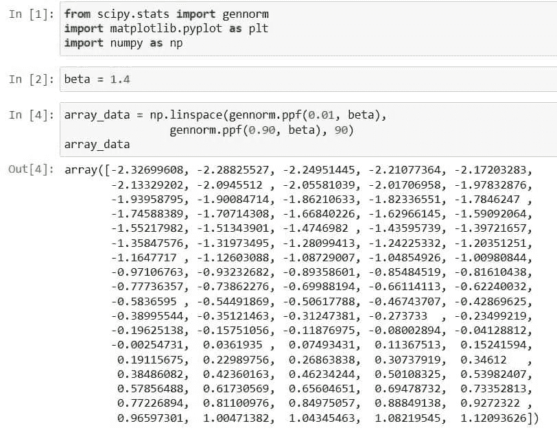

# Python Scipy Stats Norm [14 个惊人的例子]

> 原文：<https://pythonguides.com/python-scipy-stats-norm/>

[](https://sharepointsky.teachable.com/p/python-and-machine-learning-training-course)

在本 [Python 教程](https://pythonguides.com/learn-python/)中，我们将学习“`*Python Scipy Stats Norm*`”来计算不同类型的正态分布以及如何绘制它，并涵盖以下主题。

*   什么是统计学中的规范
*   Python Scipy 状态 Pdf 规范
*   Python Scipy Stats Norm Expect
*   Python Scipy Stats Norm Plot
*   Python Scipy Stats Norm 参数
*   Python Scipy 状态标准 Cdf
*   Python Scipy 统计范数区间
*   Python Scipy 状态规范 Ppf
*   Python Scipy 统计标准生成
*   Python Scipy 状态规范日志 pdf
*   Python Scipy Stats Norm Logcdf
*   Python Scipy 状态规范的基因规范
*   Python Scipy 状态规范 Rvs
*   Python Scipy 统计标准拟合

目录

[](#)

*   什么是统计学中的范数？
*   [Python Scipy 统计标准 Pdf](#Python_Scipy_Stats_Norm_Pdf "Python Scipy Stats Norm Pdf")
*   [Python Scipy Stats Norm Expect](#Python_Scipy_Stats_Norm_Expect "Python Scipy Stats Norm Expect")
*   [Python Scipy Stats Norm Plot](#Python_Scipy_Stats_Norm_Plot "Python Scipy Stats Norm Plot")
*   [Python Scipy Stats 规范参数](#Python_Scipy_Stats_Norm_Parameters "Python Scipy Stats Norm Parameters")
*   [Python Scipy 统计标准 Cdf](#Python_Scipy_Stats_Norm_Cdf "Python Scipy Stats Norm Cdf")
*   [Python Scipy Stats 范数区间](#Python_Scipy_Stats_Norm_Interval "Python Scipy Stats Norm Interval")
*   [Python Scipy 状态规范 PPF】t1](#Python_Scipy_Stats_Norm_Ppf "Python Scipy Stats Norm Ppf")
*   [Python Scipy 状态日志 pdf 规范](#Python_Scipy_Stats_Norm_Logpdf "Python Scipy Stats Norm Logpdf")
*   [Python Scipy 状态规范日志 cdf](#Python_Scipy_Stats_Norm_Logcdf "Python Scipy Stats Norm Logcdf")
*   [Python Scipy Stats 规范 Gen](#Python_Scipy_Stats_Norm_Gen "Python Scipy Stats Norm Gen")
*   [Python Scipy 状态标准基因规范](#Python_Scipy_Stats_Norm_Gennorm "Python Scipy Stats Norm Gennorm")
*   [Python Scipy 状态规范 Rvs](#Python_Scipy_Stats_Norm_Rvs "Python Scipy Stats Norm Rvs")
*   [Python Scipy Stats Norm Fit](#Python_Scipy_Stats_Norm_Fit "Python Scipy Stats Norm Fit")

## 什么是统计学中的范数？

标准是对总体的统计描述，比如六年级男生的 CBSE 数学成绩或者九年级女生艾玛的雅思阅读成绩。

将个体的检测结果与人群的统计表现进行比较，并采用参照常模的评分解释。在现实生活中，测试的是具有代表性的样本或组，而不是整个人群。这就为这个群体或一套规范提供了一个规范。标准描述了某个群体应该能够做什么，而规范则指出了这个群体能够做什么。

另外，请查看: [Python Scipy Mann Whitneyu](https://pythonguides.com/python-scipy-mann-whitneyu/)

## Python Scipy 统计标准 Pdf

`*`scipy.stats.norm`*`表示通常连续的随机变量。它有不同种类的正态分布函数，如 CDF，PDF，中位数等。

它有两个重要的参数`loc`用于表示平均值和`scale`用于表示标准差，因为我们知道我们使用这些参数来控制分布的形状和位置。

下面给出了语法。

```py
scipy.stats.norm.method_name(data,loc,size,moments,scale)
```

其中参数为:

*   ***数据:*** 以数组数据的形式表示均匀采样数据的一组点或值。
*   ***loc:*** 用于指定平均值，默认为 0。
*   ***矩:*** 用于计算标准差、峰度、均值等统计量。
*   ***刻度:*** 用于指定标准差，默认为 1。

以上参数是对象`*`scipy.stats.norm()`*`中所有方法的公共参数。下面给出了方法。

*   ***scipy . stats . norm . CDF():***它用于累计分布函数。
*   ***scipy . stats . norm . pdf():***它用于概率密度函数。
*   ***scipy . stats . norm . RVs():***获取随机变量。
*   ***scipy . stats . norm . stats():***用于得到标准差、均值、峰度、偏斜度。
*   ***scipy . stats . norm . log pdf():***用于获取概率密度函数相关的对数。
*   ***scipy . stats . norm . log CDF():***用于查找与累积分布函数相关的日志。
*   ***scipy . stats . norm . SF():***它用于获取生存函数的值。
*   ***scipy . stats . norm . ISF():***它用来得到逆生存函数的值。
*   ***scipy . stats . norm . logsf():***用于查找与生存函数相关的日志。
*   ***scipy . stats . norm . mean():***用于求正态分布相关的均值。
*   ***scipy . stats . norm . medain():***用于求正态分布相关的中位数。
*   ***scipy . stats . norm . var():***用于求与分布相关的方差。
*   ***scipy . stats . norm . STD():***它用于求与分布相关的标准差

让我们通过使用上面提到的方法之一来举一个例子，以了解如何使用带参数的方法。

使用下面的代码导入所需的库。

```py
import numpy as np
import matplotlib.pyplot as plt
from scipy import stats
```

创建观察数据值，并用``*mean = 0*``和``*standard deviation = 1*``从这些数据值中计算出``*probability density function*``。

```py
observatin_x = np.linspace(-4,4,200)
pdf_norm = stats.norm.pdf(observatin_x,loc=0,scale=1)
```

使用下面的代码绘制创建的分布图。

```py
plt.plot(observatin_x,pdf_norm)
plt.xlabel('x-values')
plt.ylabel('PDF_norm_values')
plt.title("Probability density funciton of normal distribution")
plt.show()
```


Scipy Stats Norm

这就是如何使用 python Scipy 的方法`*`norm()`*` 来计算范数的不同分布。

阅读: [Python Scipy 特征值](https://pythonguides.com/python-scipy-eigenvalues/)

## Python Scipy Stats Norm Expect

存在于模块`*`scipy.stats.rv_continous`*`中的 Python Scioy 的方法`*`expect()`*`使用数值积分来确定关于分布的函数的期望值。根据分布 dist，函数的期望值 f(x)定义如下:

在这一区。我们将确定一个函数关于范数分布的期望值。

下面给出了语法。

```py
rv_continuous.expect(func=None, args=(), loc=0, scale=1, lb=None, ub=None, conditional=True)
```

其中参数为:

*   **func(可调用):**计算函数的积分。只接受一个参数。缺省值是身份映射 f(x) = x。
*   **args(tuple):** 分布的形状参数。
*   **loc(float):** 位置参数，默认为 0。
*   **scale(float):** 为比例参数，默认为 1。
*   **lb，ub(标量):**积分的上下界。
*   **conditional(boolean):** 如果为真，则使用积分区间的条件概率修正积分。根据提供的间隔，函数的预期值是返回值。默认情况下为 False。

方法`*`expect()`*`返回 float 类型的`*`expect`*`，这是计算出的预期值。

让我们通过下面的步骤来了解一个示例:

使用下面的 python 代码导入所需的库或方法。

```py
from scipy.stats import norm
norm(1).expect(lambda a: 1, lb=0.0, ub=1.0)
```

上面的代码接近下面的代码。

```py
norm(1).cdf(1.0) - norm(1).cdf(0.0)
```

如果我们指定条件等于`True`，

```py
norm(1).expect(lambda a: 1, lb=0.0, ub=1.0, conditional = True)
```

因为数值积分，与 1 有微小的偏离。


Python Scipy Stats Norm Expect

这就是如何确定一个函数关于范数分布的期望值。

阅读: [Python Scipy 统计模式](https://pythonguides.com/python-scipy-stats-mode/)

## Python Scipy Stats Norm Plot

方法`*`norm()`*`有两个参数`*`loc`*`和`*`scale`*`，我们可以使用 matplotlib 库来绘制分布图。这些参数在上面的***【Python Scipy Stats Norm】***小节中定义。

因此，按照以下步骤绘制分布图:

使用下面的 python 代码导入所需的库或方法。

```py
import matplotlib.pyplot as plt
import numpy as np
from scipy.stats import norm
```

使用以下代码生成数据并定义 loc 和 scale 参数。

```py
x_data = np.linspace(0, 30, 200)

loc_pr = 12
scale_pr = 1.5
```

使用下面的代码计算标准的 pdf 并绘制分布图。

```py
plt.plot(x_data, norm.pdf(x_data, loc=loc_pr, scale=scale_pr))
plt.show()
```


Python Scipy Stats Norm Plot

这就是如何使用 [matplotlib](https://pythonguides.com/what-is-matplotlib/) 库绘制正态分布图。

阅读: [Python Scipy 最小化](https://pythonguides.com/python-scipy-minimize/)

## Python Scipy Stats 规范参数

Python Scipy 方法`*`norm()`*`有四个主要参数`*`data`*`、`*`loc`*`、`*`moments`*`和`*`scale`*`，可以用来控制分布。

让我们通过下面的步骤来了解一个示例:

使用下面的 python 代码导入所需的库或方法。

```py
import matplotlib.pyplot as plt
import numpy as np
from scipy.stats import norm
```

使用以下代码生成数据并定义 loc 和 scale 参数。

```py
x_data = np.linspace(0, 20, 200)

loc_pr = 10
scale_pr = 1
plt.plot(x_data, norm.pdf(x_data, loc=loc_pr, scale=scale_pr))
plt.show()
```

使用下面的代码将 loc 参数更改为某个值，并保持 scale 参数的值不变。

```py
 loc_pr = 5
scale_pr = 1
plt.plot(x_data, norm.pdf(x_data, loc=loc_pr, scale=scale_pr))
plt.show()
```


Python Scipy Stats Norm Parameters

当我们将 log_pr 更改为 5 时，正如我们在输出中看到的那样，分布向左侧移动。


Python Scipy Stats Norm Parameters Example

同样，使用下面的代码将 scale_pr 更改为某个值，并保持 loc_pr 的值不变。

```py
loc_pr = 5
scale_pr = 3
plt.plot(x_data, norm.pdf(x_data, loc=loc_pr, scale=scale_pr))
plt.show()
```

当我们将 scale_pr 更改为 3 时，它会改变分布形状，正如我们在输出中看到的那样。


Python Scipy Stats Norm Parameters tutorial

我们有方法`*`norm()`*`的其他参数，可以用来对分布进行更多的控制。

这就是如何使用 Python Scipy 的方法`*`norm()`*`的参数。

阅读: [Python Scipy 正常测试](https://pythonguides.com/python-scipy-normal-test/)

## Python Scipy 统计标准 Cdf

对象 ***`norm()`*** 有一个方法`*`cdf()`*`计算范数的累积分布。

下面给出了语法。

```py
scipy.stats.norm.cdf(x,loc,size,scale)
```

其中参数为:

*   **x:** 它是以数组数据的形式表示均匀采样数据的一组点或值。
*   **loc:** 用于指定平均值，默认为 0。
*   **刻度:**用于确定标准差，默认为 1。

以上参数是对象`*`scipy.stats.norm()`*`中所有方法的标准参数。下面给出了方法。

让我们通过使用上面提到的方法之一来举一个例子，以了解如何使用带参数的方法。

使用下面的代码导入所需的库。

```py
import numpy as np
import matplotlib.pyplot as plt
from scipy import stats
```

创建观察数据值，并用``*mean = 0*``和``*standard deviation = 1*``从这些数据值中计算出``*cumulative distribution*``。

```py
observatin_x = np.linspace(-2,2,200)
cdf_norm = stats.norm.cdf(observatin_x,loc=0,scale=1)
```

使用下面的代码绘制创建的分布图。

```py
plt.plot(observatin_x,cdf_norm)
plt.xlabel('x-values')
plt.ylabel('cdf_norm_values')
plt.title("Probability density funciton of normal distribution")
plt.show()
```


Python Scipy Stats Norm Cdf

这就是如何使用 Python Scipy 的方法`*`norm.cdf()`*`计算 norm 的累积分布。

阅读: [Python Scipy 置信区间](https://pythonguides.com/scipy-confidence-interval/)

## Python Scipy Stats 范数区间

Python Scipy 的方法`*`norm.interval()`*`计算分布的分数 alpha 范围的端点，在 0 和 1 之间。

下面给出了语法。

```py
scipy.stats.interval(alpha, loc=0, scale=1)
```

其中参数为:

*   **alpha(float):** 是 alpha 值。
*   **loc:** 用于指定平均值，默认为 0。
*   **刻度:**用于确定标准差，默认为 1。

让我们以下面的步骤为例:

使用 python 代码导入所需的库或方法。

```py
from scipy.stats import norm
```

使用下面的代码定义 alpha 值并计算分布的端点。

```py
alpha = 0.1
norm.interval(alpha)
```


Python Scipy Stats Norm Interval

这就是如何使用 Python Scipy 的方法`*`nomr.interval()`*`计算分布的分数 alpha 范围的端点，在 0 和 1 之间，

## Python Scipy 状态规范 PPF】t1

对象 ***`norm()`*** 有一个方法`*`ppf()`*`用于计算定额的百分点函数。换句话说，方法``*norm. ppf()*``接受一个百分比，并返回该百分比所在值的标准差乘数。

下面给出了语法。

```py
scipy.stats.norm.ppf(q,loc,size,scale)
```

其中参数为:

*   ***问:*** 它是一个百分比。
*   loc:用于指定平均值，默认为 0。
*   标度:用于确定标准偏差，默认为 1。

让我们通过下面的代码来理解一个例子。

```py
from scipy.stats import norm
norm.ppf(0.99, loc=0, scale=1)
```

上面的代码给出了正态分布的 99%置信区间的单尾测试结果。


Python Scipy Stats Norm Ppf

阅读:[科学发现高峰](https://pythonguides.com/scipy-find-peaks/)

这就是如何使用 Python Scipy 的方法`*`norm.ppf()`*`计算值的标准差乘数。

## Python Scipy 状态日志 pdf 规范

对象 ***`norm()`*** 有一个方法`*`logpdf()`*`计算范数的对数概率。

下面给出了语法。

```py
scipy.stats.norm.logpdf(x,loc,size,scale)
```

其中参数为:

*   ***x:*** 它是以数组数据的形式表示均匀采样数据的一组点或值。
*   ***loc:*** 用于指定平均值，默认为 0。
*   ***标度:*** 用于确定标准差，默认为 1。

以上参数是对象`*`scipy.stats.norm()`*`中所有方法的标准参数。下面给出了方法。

让我们通过使用上面提到的方法之一来举一个例子，以了解如何使用带参数的方法。

使用下面的代码导入所需的库。

```py
import numpy as np
import matplotlib.pyplot as plt
from scipy import stats
```

创建观察数据值，并用``*mean = 0*``和``*standard deviation = 1*``从这些数据值计算对数概率。

```py
observatin_x = np.linspace(-2,2,200)
logpdf_norm = stats.norm.logpdf(observatin_x,loc=0,scale=1)
```

使用下面的代码绘制创建的分布图。

```py
plt.plot(observatin_x,logpdf_norm)
plt.xlabel('x-values')
plt.ylabel('logpdf_norm_values')
plt.title("Log probability of normal distribution")
plt.show()
```


Python Scipy Stats Norm Logpdf

这就是如何使用 Python Scipy 的方法`*`norm.logpdf()`*`计算 norm 的 log pdf。

阅读: [Python Scipy 特殊模块](https://pythonguides.com/python-scipy-special/)

## Python Scipy 状态规范日志 cdf

对象 ***`norm()`*** 有一个方法`*`logcdf()`*`计算范数的对数累积分布。

下面给出了语法。

```py
scipy.stats.norm.logcdf(x,loc,size,scale)
```

其中参数为:

*   ***x:*** 它是以数组数据的形式表示均匀采样数据的一组点或值。
*   ***loc:*** 用于指定平均值，默认为 0。
*   ***标度:*** 用于确定标准差，默认为 1。

以上参数是对象`*`scipy.stats.norm()`*`中所有方法的标准参数。下面给出了方法。

使用下面的代码导入所需的库。

```py
import numpy as np
import matplotlib.pyplot as plt
from scipy import stats
```

用``*mean = 0*``和``*standard deviation = 1*``创建观察数据值，并根据这些数据值计算累计对数。

```py
observatin_x = np.linspace(-5,5,200)
logcdf_norm = stats.norm.logcdf(observatin_x,loc=0,scale=1)
```

使用下面的代码绘制创建的分布图。

```py
plt.plot(observatin_x,logcdf_norm)
plt.xlabel('x-values')
plt.ylabel('logcdf_norm_values')
plt.title("Log cumulative distribution of normal distribution")
plt.show()
```


Python Scipy Stats Norm Logcdf

这就是如何使用 Python Scipy 的方法`*`norm.logcdf()`*`计算范数的对数 cdf。

阅读:[Scipy Linalg–实用指南](https://pythonguides.com/scipy-linalg/)

## Python Scipy Stats 规范 Gen

`*`scipy.stats.genpareto`*`表示连续的广义帕累托随机变量。它有不同种类的正态分布函数，如 CDF，PDF，中位数等。

广义帕累托分布是统计学中使用的一类连续概率分布。它经常被用来模拟另一个分布的尾部。

它有两个重要的参数`loc`用于表示平均值和`scale`用于表示标准差，因为我们知道我们使用这些参数来控制分布的形状和位置。

下面给出了语法。

```py
scipy.stats.genpareto.method_name(x,c,loc,size,moments,scale)
```

其中参数为:

*   ***x:*** 它是以数组数据的形式表示均匀采样数据的一组点或值。
*   ***c:*** 它用来指定形状。
*   ***loc:*** 用于指定平均值，默认为 0。
*   ***矩:*** 用于计算标准差、峰度、均值等统计量。
*   ***刻度:*** 用于指定标准差，默认为 1。

以上参数是对象`*`scipy.stats.genpareto()`*`中所有方法的公共参数。下面给出了方法。

*   ***scipy . stats . gen Pareto . CDF():***用于累计分布函数。
*   ****。pdf():**** *用于概率密度函数。*
*   `*`。rvs():**** *获取随机变量。**
*   `**`。stats():**** *用于获取标准差、均值、峰度、偏斜度。***
*   `**`。logpdf():**** *用于获取与概率密度函数相关的对数。***
*   `**`。logcdf():**** *用于查找与累积分布函数相关的日志。***
*   `**`。sf():**** *用来获取生存函数的值。***
*   `**`。isf():**** *它用于获取逆生存函数的值。***
*   `**`。logsf():**** *用于查找生存函数相关的日志。***
*   `**`。mean():**** *用于求正态分布相关的均值。***
*   `**`。medain():**** *用于求正态分布相关的中位数。***
*   `**`。var():**** *用于求分布相关的方差。***
*   `**`。std():**** *用于求与分布相关的标准差***

 **让我们通过使用上面提到的方法之一来举一个例子，以了解如何使用带参数的方法。

使用下面的代码导入所需的库。

```py
from scipy.stats import genpareto
import matplotlib.pyplot as plt
import numpy as np
```

代码为形状参数创建一个变量，并分配一些值。

```py
c = 0.2
```

使用下面的代码，使用对象`*`genpareto`*`的方法`*`ppf()`*`创建一个数据数组。

```py
array_data = np.linspace(genpareto.ppf(0.01, c),
                genpareto.ppf(0.90, c), 90)
array_data
```



Python Scipy Stats Norm Genpareto Example

现在使用下面的代码通过访问模块`*`scipy.stats`*`的对象`*`genpareto`*`的方法`*`pdf()`*`来绘制概率密度函数。

```py
fig, ax = plt.subplots(1, 1)
ax.plot(array_data, genpareto.pdf(array_data, c),
       'r-', lw=4, alpha=0.5, label='genpareto PDF')
```


Scipy Stats Genpareto

这就是如何使用 Python Scipy 的`*`genpareto()`*`来建模分布尾部。

阅读: [Scipy 正态分布](https://pythonguides.com/scipy-normal-distribution/)

## Python Scipy 状态标准基因规范

`*`scipy.stats.gennorm`*`表示广义正态连续的随机变量。它有不同种类的正态分布函数，如 CDF，PDF，中位数等。

它有两个重要的参数`loc`用于表示平均值和`scale`用于表示标准差，因为我们知道我们使用这些参数来控制分布的形状和位置。

下面给出了语法。

```py
scipy.stats.gennorm.method_name(x,beta,loc,size,moments,scale)
```

其中参数为:

*   ***x:*** 它是以数组数据的形式表示均匀采样数据的一组点或值。
*   ***beta:*** 它用来指定形状。
*   ***loc:*** 用于指定平均值，默认为 0。
*   ***矩:*** 用于计算标准差、峰度、均值等统计量。
*   ***刻度:*** 用于指定标准差，默认为 1。

以上参数是对象`*`scipy.stats.gennorm()`*`中所有方法的公共参数。下面给出了方法。

*   ***scipy . stats . gen norm . CDF():***用于累计分布函数。
*   `**`艮*** 常态。PDF():*** 用于概率密度函数。
*   ****`gen`*norm . RVs():***得到随机变量。
*   ***scipy . stats .*`gen`*norm . stats():***它用于获取标准差、均值、峰度和偏斜度。
*   ***scipy . stats .*`gen`*norm . log pdf():***它用于获取与概率密度函数相关的对数。
*   ***scipy . stats .*`gen`*norm . log CDF():***用于查找与累积分布函数相关的日志。
*   ***scipy . stats .*`gen`*norm . SF():***它用来获取生存函数的值。
*   ***scipy . stats .*`gen`*norm . ISF():***它用来获取逆生存函数的值。
*   ***scipy . stats .*`gen`*norm . logsf():***用于查找与生存函数相关的日志。
*   ***scipy . stats .*`gen`*norm . mean():***用于求与正态分布相关的均值。
*   ***scipy . stats .*`gen`*norm . medain():***用于求正态分布相关的中位数。
*   ***scipy . stats .*`gen`*norm . var():***它用于求与分布有关的方差。
*   ***scipy . stats .*`gen`*norm . STD():***它用于查找与分布相关的标准差

让我们通过使用上面提到的方法之一来举一个例子，以了解如何使用带参数的方法。

使用下面的代码导入所需的库。

```py
from scipy.stats import gennorm
import matplotlib.pyplot as plt
import numpy as np
```

代码为形状参数创建一个变量，并分配一些值。

```py
beta = 1.4
```

使用下面的代码，使用对象`*`gennorm`*`的方法`*`ppf()`*`创建一个数据数组。

```py
array_data = np.linspace(gennorm.ppf(0.01, a),
                gennorm.ppf(0.90, a,b), 90)
array_data
```



Python Scipy Stats Norm Gennorm

现在使用下面的代码通过访问模块`*`scipy.stats`*`的对象`*`gennorm`*`的方法`*`PDF()`*`来绘制概率密度函数。

```py
fig, ax = plt.subplots(1, 1)
ax.plot(array_data, gennorm.pdf(array_data, beta),
       'r-', lw=4, alpha=0.5, label='gennorm PDF')
```


Python Scipy Stats Norm Gennorm Example

这就是如何使用 Python Scipy 的方法`norm.gennorm()`。

阅读: [Scipy 卷积-完整指南](https://pythonguides.com/scipy-convolve/)

## Python Scipy 状态规范 Rvs

对象`*`norm`*`的 Python Scipy 的方法 ***`rvs()`*** 是产生随机数的随机变量。

语法如下所示

```py
scipy.stats.norm.rvs(loc=0, scale=1, size=1, random_state=None)
```

其中参数为:

*   **loc:** 是个意思。
*   **标度:**协方差的分布矩阵。
*   **size(int):** 是样本大小。
*   **random_state(int):** 如果种子为 None，则使用 NumPy.random 方法(或 np.random)。它使用 RandomState 的单个实例。如果种子是整数，则使用该种子创建一个新的 RandomState 对象。如果种子已经有一个生成器或 RandomState 实例，则使用该实例。

让我们按照以下步骤从多元正态分布中抽取一个随机样本:

使用下面的 python 代码导入所需的库。

```py
from scipy import stats
```

使用下面的代码创建一个多元正态分布。

```py
norm_dist = stats.norm()
```

使用下面的代码生成正态分布的随机数。

```py
samp_size = 100000
norm_dist.rvs(samp_size)
```


Python Scipy Stats Norm Rvs

这就是如何使用 python Scipy 的方法`*`norm.rvs()`*`生成随机数。

阅读: [Scipy Integrate +示例](https://pythonguides.com/scipy-integrate/)

## Python Scipy Stats Norm Fit

对象`norm`的 Python Scipy 的方法`*`fit()`*`,提供近似的比例和位置。

下面给出了语法。

```py
scipy.stats.norm.fit(data)
```

其中参数**数据**是我们需要位置和比例的数据。

让我们通过以下步骤来了解一个示例:

使用下面的代码导入所需的库或方法。

```py
from scipy.stats import norm
```

使用`norm.rvs()`方法生成随机数。

```py
x_data = norm.rvs(1., 2., size=500, random_state=123)
```

现在用下面的代码拟合上面的数据。

```py
loc_, scale_ = norm.fit(x_data)
```

使用以下代码检查估计的参数值。

```py
print("loc is ",loc_)
print("Scale is ",scale_)
```


Python Scipy Stats Norm Fit

另外，看看更多的 Python SciPy 教程。

*   [Scipy Sparse–有用的教程](https://pythonguides.com/scipy-sparse/)
*   [Scipy 优化–实用指南](https://pythonguides.com/scipy-optimize/)
*   [Scipy Ndimage Rotate](https://pythonguides.com/scipy-ndimage-rotate/)
*   [Scipy Misc +示例](https://pythonguides.com/scipy-misc/)

因此，在本教程中，我们已经了解了“`*Python Scipy Stats Norm*`”并涵盖了以下主题。

*   什么是统计学中的规范
*   Python Scipy 状态 Pdf 规范
*   Python Scipy Stats Norm Expect
*   Python Scipy Stats Norm Plot
*   Python Scipy Stats Norm 参数
*   Python Scipy 状态标准 Cdf
*   Python Scipy 统计范数区间
*   Python Scipy 状态规范 Ppf
*   Python Scipy 统计标准生成
*   Python Scipy 状态规范日志 pdf
*   Python Scipy Stats Norm Logcdf
*   Python Scipy 状态规范的基因规范
*   Python Scipy 状态规范 Rvs
*   Python Scipy 统计标准拟合

[Bijay Kumar](https://pythonguides.com/author/fewlines4biju/)

Python 是美国最流行的语言之一。我从事 Python 工作已经有很长时间了，我在与 Tkinter、Pandas、NumPy、Turtle、Django、Matplotlib、Tensorflow、Scipy、Scikit-Learn 等各种库合作方面拥有专业知识。我有与美国、加拿大、英国、澳大利亚、新西兰等国家的各种客户合作的经验。查看我的个人资料。

[enjoysharepoint.com/](https://enjoysharepoint.com/)[](https://www.facebook.com/fewlines4biju "Facebook")[](https://www.linkedin.com/in/fewlines4biju/ "Linkedin")[](https://twitter.com/fewlines4biju "Twitter")**