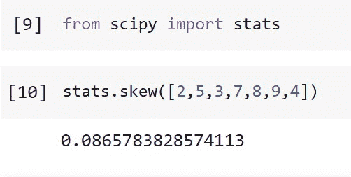
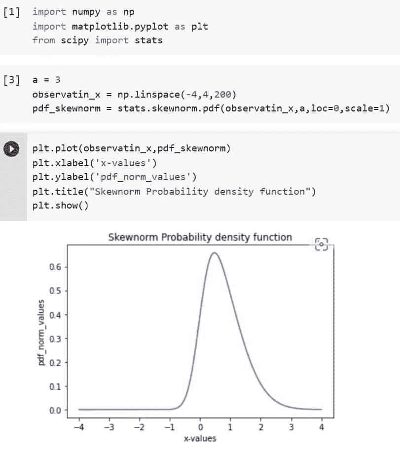
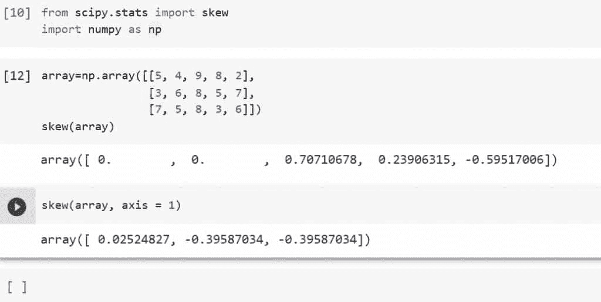
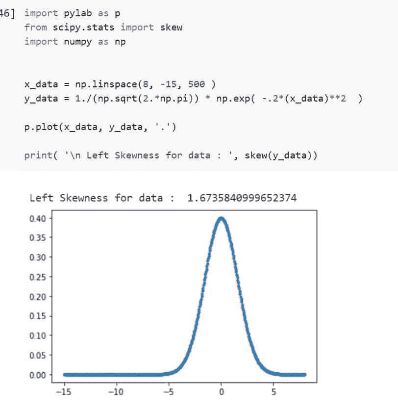
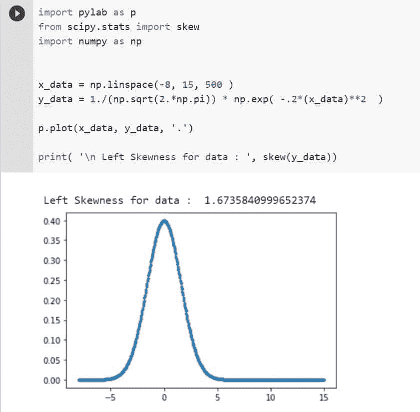
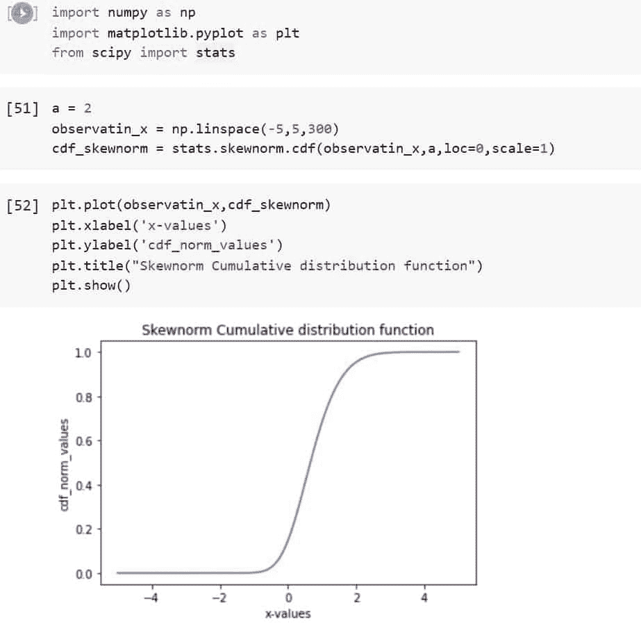
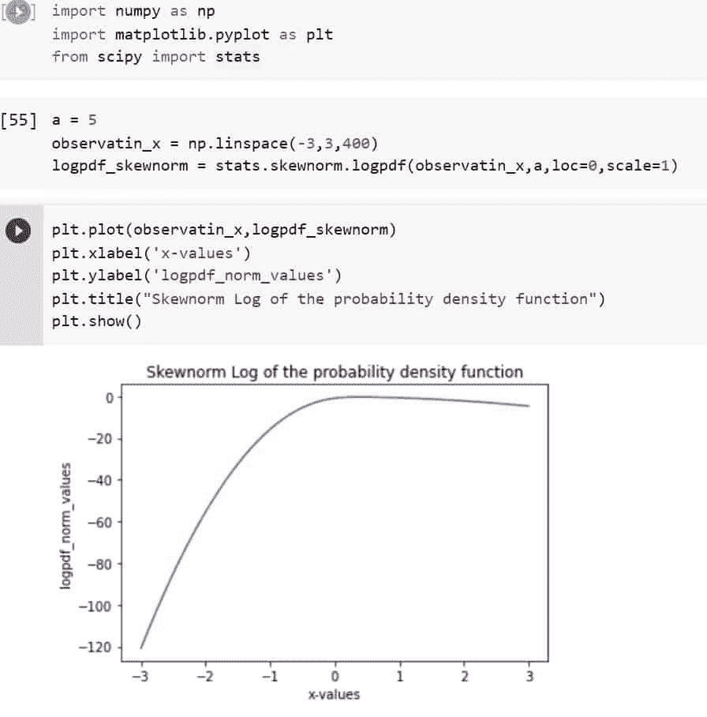
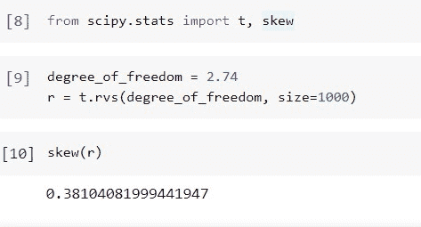

# python Scipy Stats Skew[有 8 个例子]

> 原文：<https://pythonguides.com/python-scipy-stats-skew/>

[](https://sharepointsky.teachable.com/p/python-and-machine-learning-training-course)

在这个 [Python 教程](https://pythonguides.com/learn-python/)中，我们将学习“ `*Python Scipy Skew*` ”，在这里我们将学习 *`skewness`* 这是一个关于使用 [Python Scipy](https://pythonguides.com/what-is-scipy-in-python/) 的平均值的实值随机变量的概率分布的不对称性的度量。此外，我们还将讨论以下主题。

*   Python Scipy 统计数据不对称
*   Python Scipy 状态脚本
*   Python Scipy 统计偏斜 t
*   Python Scipy 统计数据不对称分布
*   Python Scipy Stats Skew Logcdf
*   Python Scipy 统计斜轴
*   Python Scipy Stats 偏斜 CDF
*   Python Scipy Stats Skew Logpdf

另外，查看最新的 Python SciPy 教程: [Python Scipy 曲线拟合](https://pythonguides.com/python-scipy-curve-fit/)

目录

[](#)

*   [什么是歪斜？](#What_is_skew "What is skew?")
*   [科学统计偏差](#Scipy_Stats_Skew "Scipy Stats Skew")
*   [Python Scipy 状态倾斜仪](#Python_Scipy_Stats_Skewnorm "Python Scipy Stats Skewnorm")
*   [Python Scipy 统计斜轴](#Python_Scipy_Stats_Skew_axis "Python Scipy Stats Skew axis")
*   [Python Scipy 统计数据不对称分布](#Python_Scipy_Stats_Skew_distribution "Python Scipy Stats Skew distribution")
*   [Python Scipy Stats Skew log CDF](#Python_Scipy_Stats_Skew_Logcdf "Python Scipy Stats Skew Logcdf")
*   [Python Scipy 统计偏斜范数 CDF](#Python_Scipy_Stats_Skew_Norm_CDF "Python Scipy Stats Skew Norm CDF")
*   [Python Scipy Stats Skew log pdf](#Python_Scipy_Stats_Skew_Logpdf "Python Scipy Stats Skew Logpdf")
*   [Python Scipy 统计偏斜 t](#Python_Scipy_Stats_Skew_t "Python Scipy Stats Skew t")

## 什么是歪斜？

偏离一组数据的正态分布或对称钟形曲线被称为偏斜度。术语**“歪斜”**指的是向左或向右移动的曲线。特定分布偏离正态分布的程度可以定量地表示为偏度。

在分布中可以看到不同程度的右偏(正)或左偏(负)。零偏斜通过正态分布(钟形曲线)显示。

对于正偏斜和负偏斜，远离中值的“尾部”或数据点集合都会受到影响。正偏斜表示分布右侧的尾部更长或更粗，而负偏斜表示分布左侧的尾部更长或更粗。这两个偏斜描述了分布的权重或方向。

正偏态数据的平均值将高于中值。负偏态数据的平均值将小于中值，这与正偏态分布的情况正好相反。不管尾部有多长或多厚，如果数据是对称绘制的，分布呈现零偏斜。

阅读: [Python Scipy 特征值](https://pythonguides.com/python-scipy-eigenvalues/)

## 科学统计偏差

Python Scipy 模块`*`scipy.stats`*`有一个计算数据集样本偏斜度的方法`*`skew()`*`。

有规律分布的数据的偏斜度应该接近于零。如果连续单峰分布的偏斜值大于零，则分布的右尾将被赋予更大的权重。要检查偏斜度值在统计上是否足够接近零，请使用 skewtest 函数。

下面给出了语法。

```py
scipy.stats.skew(a, axis=1, bias=False, nan_policy='throw')
```

其中参数为:

*   **a(array_data):** n 维数组，从中确定模式。
*   **偏差(布尔):**如果这是不真实的，则从计算中移除统计偏差。
*   **nan_plociy():** 指定在输入包含 nan 的情况下该做什么。(“Propagate”是默认值)以下选项可用:

1.  传播:返回 nan
2.  抛出一个错误
3.  省略:忽略 nan 值。

*   **轴(int):** 轴的方向。默认值为 0。如果没有，将整个数组视为。

方法`*`skew()`*`返回 ndarray 类型的 ***`skewness`(当所有值相等时，数据沿轴的偏斜度返回 0)*** 。

让我们举个例子，使用下面的 python 代码将数组传递给方法`*`skew()`*`。

```py
from scipy import stats
stats.skew([2,5,3,7,8,9,4])
```



Scipy Stats Skew

这就是如何使用 Python Scipy 的方法`*`skew()`*`计算给定数据数组的偏斜度。

Read: [Python Scipy Freqz](https://pythonguides.com/python-scipy-freqz/)

## Python Scipy 状态倾斜仪

Python Scipy 在模块`*`scipy.stats`*`中有一个非正态连续随机变量或对象`*`skewnorm()`*`。由此，skewnorm 对象继承了一组通用方法，并用该分布特有的信息完成了这些方法。

skewnorm 接受实数作为偏斜度参数。当 a = 0 时，分布类似于正态分布。loc 和 scale 参数可用于缩放或移动分布。

下面给出了语法。

```py
scipy.stats.skewnorm.method_name(x,q,loc,scale,size,moments)
```

其中参数为:

*   **x:** 较高和较低的尾部概率。
*   **问:**用于选择分位数。
*   **loc:** 用于指定平均值，默认为 0。
*   **矩:**用于计算标准差、峰度、均值等统计量。
*   **刻度:**用于指定标准差，默认为 1。

让我们以下面的步骤为例:

使用下面的代码导入所需的库。

```py
import numpy as np
import matplotlib.pyplot as plt
from scipy import stats
```

创建观察数据值，并用``*mean = 0*``和``*standard deviation = 1*``从这些数据值中计算出``*probability density function*``。

```py
a = 3
observatin_x = np.linspace(-4,4,200)
pdf_skewnorm = stats.skewnorm.pdf(observatin_x,a,loc=0,scale=1)
```

使用下面的代码绘制创建的分布图。

```py
plt.plot(observatin_x,pdf_skewnorm)
plt.xlabel('x-values')
plt.ylabel('pdf_norm_values')
plt.title("Skewnorm Probability density function")
plt.show()
```



Python Scipy Stats Skewnorm

阅读: [Python Scipy 最小化](https://pythonguides.com/python-scipy-minimize/)

## Python Scipy 统计斜轴

Python Scipy `*`skew()`*`接受参数`*`axis`*`来计算沿特定轴的偏斜，我们在上面的“Python Scipy Stats Skew”小节中已经了解了这一点。

二维数组有两个对应的轴，一个水平穿过列(轴 1)，另一个垂直穿过行(轴 0)。

让我们举一个例子，按照以下步骤计算基于轴的阵列倾斜:

使用下面的 python 代码导入所需的库。

```py
from scipy.stats import skew
import numpy as np
```

创建一个二维数组，并使用下面的代码计算倾斜。

```py
array=np.array([[5, 4, 9, 8, 2],
                [3, 6, 8, 5, 7],
                [7, 5, 8, 3, 6]])
skew(array)
```

在上面的代码中，偏斜是在整个数组上计算的，现在使用下面的代码指定 axis = 1。

```py
skew(array, axis = 1)
```



Python Scipy Stats Skew axis

看看上面的输出，我们已经计算了整个阵列或沿水平轴的偏斜。

阅读: [Python Scipy 指数–有用教程](https://pythonguides.com/python-scipy-exponential/)

## Python Scipy 统计数据不对称分布

有两种类型的分布，左偏和右偏。

*   左偏的分布有很长的左尾。负偏态分布也称为左偏态分布。这是因为数字线有明显的负尾部。此外，峰值位于平均值的左侧。
*   在右偏分布中有一个长的右尾。正偏分布，或右偏分布，是它们的另一个名称。这是因为数字线在正方向上有一个长尾巴。此外，平均值位于峰值的右侧。

因此，在本节中，我们将构建我们在上面学到的两种偏斜分布。

使用下面的 python 代码导入所需的库。

```py
import pylab as p
from scipy.stats import skew
import numpy as np 
```

使用下面的代码生成 x 和 y 数据。

```py
x_data = np.linspace(8, -15, 500 )
y_data = 1./(np.sqrt(2.*np.pi)) * np.exp( -.2*(x1)**2  )
```

使用以下代码计算并绘制左偏斜。

```py
p.plot(x_data, y_data, '.')

print( '\n Left Skewness for data : ', skew(y_data))
```



Python Scipy Stats Skew distribution example

使用下面的代码再次计算并绘制右偏斜。

```py
x_data = np.linspace(-8, 15, 500 )
y_data = 1./(np.sqrt(2.*np.pi)) * np.exp( -.2*(x_data)**2  )

p.plot(x_data, y_data, '.')

print( '\n Left Skewness for data : ', skew(y_data))
```



Python Scipy Stats Skew distribution

这就是如何使用 Python Scipy 的方法`*`skew()`*`计算左右歪斜。

阅读: [Python Scipy 卡方测试](https://pythonguides.com/python-scipy-chi-square-test/)

## Python Scipy Stats Skew log CDF

对象`*`skewnorm()`*`有方法`*`logcdf()`*`,该方法计算偏斜范数的累积分布的对数。

代码下面给出了语法。

```py
scipy.stats.skewnorm.logcdf(x,a,loc,scale)
```

其中参数为:

**x:** 较高和较低的尾部概率。
**答:**它是一个偏度参数。
**loc:** 用于指定平均值，默认为 0。
**小数位数:**用于指定标准差，默认为 1。

让我们按照下面的步骤来做一个例子:

使用下面的代码导入所需的库。

```py
import numpy as np
import matplotlib.pyplot as plt
from scipy import stats
```

创建观察数据值，并用``*mean = 0*``和``*standard deviation = 1*``从这些数据值中计算出``*log of cumulative distribution*``。

```py
a = 1
observatin_x = np.linspace(-5,5,300)
logcdf_skewnorm = stats.skewnorm.logcdf(observatin_x,a,loc=0,scale=1)
```

使用下面的代码绘制创建的分布图。

```py
plt.plot(observatin_x,logcdf_skewnorm)
plt.xlabel('x-values')
plt.ylabel('logcdf_norm_values')
plt.title("Skewnorm log of Cumulative distribution function")
plt.show()
```

## Python Scipy 统计偏斜范数 CDF

我们已经在上面的“Python Scipy Stats Skewnorm”小节中介绍了`*`skewnorm()`*` Python Scipy，对象 Skewnorm()具有计算 skewnorm 累积分布的方法 CDF()。

代码下面给出了语法。

```py
scipy.stats.skewnorm.cdf(x,a,loc,scale)
```

其中参数为:

**x:** 较高和较低的尾部概率。
**答:**它是一个偏度参数。
**loc:** 用于指定平均值，默认为 0。
**小数位数:**用于指定标准差，默认为 1。

让我们按照下面的步骤来做一个例子:

使用下面的代码导入所需的库。

```py
import numpy as np
import matplotlib.pyplot as plt
from scipy import stats
```

创建观察数据值，并用``*mean = 0*``和``*standard deviation = 1*``从这些数据值中计算出``*cumulative distribution*``。

```py
a = 2
observatin_x = np.linspace(-5,5,300)
cdf_skewnorm = stats.skewnorm.cdf(observatin_x,a,loc=0,scale=1)
```

使用下面的代码绘制创建的分布图。

```py
plt.plot(observatin_x,cdf_skewnorm)
plt.xlabel('x-values')
plt.ylabel('cdf_norm_values')
plt.title("Skewnorm Cumulative distribution function")
plt.show()
```



Python Scipy Stats Skew Norm CDF

这就是如何使用 Python Scipy 的方法`*`skewnorm.cdf()`*`计算偏斜的 CDF。

阅读: [Python Scipy 特殊模块](https://pythonguides.com/python-scipy-special/)

## Python Scipy Stats Skew log pdf

Python Scipy 的对象`*`skewnorm()`*`有一个方法 logpdf()，它计算偏斜范数的概率密度的对数。

代码下面给出了语法。

```py
scipy.stats.skewnorm.logpdf(x,a,loc,scale)
```

其中参数为:

**x:** 较高和较低的尾部概率。
**答:**它是一个偏度参数。
**loc:** 用于指定平均值，默认为 0。
**小数位数:**用于指定标准差，默认为 1。

让我们按照下面的步骤来做一个例子:

使用下面的代码导入所需的库。

```py
import numpy as np
import matplotlib.pyplot as plt
from scipy import stats
```

创建观察数据值，并用``*mean = 0*``和``*standard deviation = 1*``从这些数据值中计算出``*log of probability density*``。

```py
a = 5
observatin_x = np.linspace(-3,3,400)
logpdf_skewnorm = stats.skewnorm.logpdf(observatin_x,a,loc=0,scale=1)
```

使用下面的代码绘制创建的分布图。

```py
plt.plot(observatin_x,logpdf_skewnorm)
plt.xlabel('x-values')
plt.ylabel('logpdf_norm_values')
plt.title("Skewnorm Log of the probability density function")
plt.show()
```



Python Scipy Stats Skew Logpdf

阅读:[Scipy Linalg–实用指南](https://pythonguides.com/scipy-linalg/)

## Python Scipy 统计偏斜 t

在本节中，我们将使用 Python Scipy Stats 的方法`*`t.rvs()`*`生成 student t 样本，然后将该数据传递给 Python Scipy 的方法`*`skew()`*`来计算该数据的偏差。

让我们通过下面的步骤来了解一个示例:

使用下面的 python 代码导入所需的库。

```py
from scipy.stats import t, skew
```

使用下面的代码从 student t 分布中生成随机数或样本。

```py
degree_of_freedom = 2.74
r = t.rvs(degree_of_freedom, size=1000)
```

现在使用下面的代码计算上面生成的样本的偏差。

```py
skew(r)
```



Python Scipy Stats Skew t

正如我们在上面的输出中所看到的，student t 样本的偏差是 0.381。

这就是如何使用 Python Scipy 的方法`*`skew()`*`计算 student t 样本的偏斜。

另外，看看更多的 Python SciPy 教程。

*   [Scipy Stats Zscore +示例](https://pythonguides.com/scipy-stats-zscore/)
*   [Python Scipy Stats Poisson](https://pythonguides.com/python-scipy-stats-poisson/)
*   [敏感信号——有用教程](https://pythonguides.com/scipy-signal/)
*   [Scipy Stats–完整指南](https://pythonguides.com/scipy-stats/)
*   [Scipy Sparse–有用的教程](https://pythonguides.com/scipy-sparse/)

因此，在这个 Python 教程中，我们通过多个例子理解了`*Python Scipy Stats Skew*`的使用。我们还在本教程中讨论了以下主题。

*   Python Scipy 统计数据不对称
*   Python Scipy 状态脚本
*   Python Scipy 统计偏斜 t
*   Python Scipy 统计数据不对称分布
*   Python Scipy Stats Skew Logcdf
*   Python Scipy 统计斜轴
*   Python Scipy Stats 偏斜 CDF
*   Python Scipy Stats Skew Logpdf

[Bijay Kumar](https://pythonguides.com/author/fewlines4biju/)

Python 是美国最流行的语言之一。我从事 Python 工作已经有很长时间了，我在与 Tkinter、Pandas、NumPy、Turtle、Django、Matplotlib、Tensorflow、Scipy、Scikit-Learn 等各种库合作方面拥有专业知识。我有与美国、加拿大、英国、澳大利亚、新西兰等国家的各种客户合作的经验。查看我的个人资料。

[enjoysharepoint.com/](https://enjoysharepoint.com/)[](https://www.facebook.com/fewlines4biju "Facebook")[](https://www.linkedin.com/in/fewlines4biju/ "Linkedin")[](https://twitter.com/fewlines4biju "Twitter")