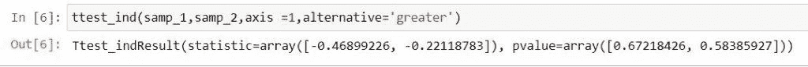

# python Scipy ttest _ ind–完整指南

> 原文：<https://pythonguides.com/python-scipy-ttest_ind/>

[](https://sharepointsky.teachable.com/p/python-and-machine-learning-training-course)

在本 [Python 教程](https://pythonguides.com/learn-python/)中，我们将学习“`*Python Scipy Ttest _ ind*`”通过假设检验评估一个或多个群体的均值，以及如何使用 Python Scipy 实现。此外，涵盖以下主题。

*   什么是统计学中的 T 检验
*   python scipy ttest _ ind
*   Python Scipy ttest_ind 替代
*   Python 直译器
*   python scipy ttest _ ind 输出
*   Python Scipy ttest_ind equal_var
*   python scipy ttest _ ind 轴
*   Python Scipy ttest_ind 统计数据
*   Python Scipy ttest_ind 自由度

目录

[](#)

*   [什么是统计学中的 T 检验](#What_is_a_T-test_in_the_Statistic "What is a T-test in the Statistic")
*   [python scipy tttest _ in】的缩写](#Python_Scipy_ttest_ind "Python Scipy ttest_ind")
*   [Python Scipy ttest_ind 替代方案](#Python_Scipy_ttest_ind_alternative "Python Scipy ttest_ind alternative")
*   [python scipy tttest _ inn 南](#Python_Scipy_ttest_ind_nan "Python Scipy ttest_ind nan")
*   [Python Scipy 测试 _ ind 的输出](#Python_Scipy_ttest_ind_output "Python Scipy ttest_ind output")
*   [python scipy _ test _ in axis](#Python_Scipy_ttest_ind_axis "Python Scipy ttest_ind axis")的缩写形式
*   [Python Scipy ttest _ ind equal _ var](#Python_Scipy_ttest_ind_equal_var "Python Scipy ttest_ind equal_var")
*   [Python Scipy ttest_ind 统计数据](#Python_Scipy_ttest_ind_statistic "Python Scipy ttest_ind statistic")
*   [Python Scipy ttest_ind 自由度](#Python_Scipy_ttest_ind_degrees_of_freedom "Python Scipy ttest_ind degrees of freedom")

## 什么是统计学中的 T 检验

在比较两组的平均值及其关系时，t 检验是一种推断统计，用于评估是否存在显著差异。当数据集具有正态分布和未知方差时，使用 t 检验。

评估假设时，t 检验使用 t 统计量、t 分布的值和自由度来评估统计显著性。t 检验通过从两组样本中各取一个样本，以数学方式建立问题陈述。两个平均值相等被视为零假设。

计算 t 检验需要三个基本数据值。它们由平均差异、每组的标准偏差、每组的数据值总数以及每个数据集的平均值之间的差异组成。

这种差异对机会的影响以及它是否在机会范围之外都是由这种比较决定的。t 检验调查两组之间的差异是研究中真正的差异还是仅仅是偶然的差异。

在本教程中，我们将使用 Python Scipy 的方法计算独立样本的 T 检验。

另外，检查: [Python Scipy Stats Norm](https://pythonguides.com/python-scipy-stats-norm/)

## python scipy tttest _ in】的缩写

使用两个独立评分样本的平均值计算 T 检验。Python Scipy 在模块`*`scipy.stats`*`中有一个方法`*`ttest_ind()`*`。这是对两个独立样本的平均值相同的零假设的检验。这种检验理所当然地认为总体的方差是相同的。

下面给出了语法。

```py
scipy.stats.ttest_ind(a, b, axis=0, nan_policy='propagate', equal_var=False,  permutations=None, random_state=None, trim=0, alternative='two-sided')
```

其中参数为:

*   **a，b(array_data):** 除了轴对应的维度，数组的形状必须相同。
*   **轴(int):** 一个轴，沿着这个轴计算测试。如果没有，使用整个数组 a 和 b 进行计算。
*   **nan_policy:** 解释当输入包含 nan 时该做什么。以下选项可用(“传播”是默认选项):

1.  ' propagate ':返回 nan。
2.  “加注”:投错
3.  '省略':通过忽略 nan 值来完成计算。

*   **equal_var(boolean):** 如果为真(默认)，则使用相同的总体方差执行典型的独立双样本检验。如果为假，进行韦尔奇的 t 检验，它不要求在整个人口中的方差相等。
*   **排列:**如果选择 0 或无(默认)，使用 t 分布计算 p 值。如果不是，将用于计算置换测试的 p 值的随机置换的数量称为置换。如果排列的数量等于或超过汇集数据的不同分区的数量，则进行精确测试。
*   **random_state(int，numpy generator):** 如果 seed 为 None(或 np.random)，则使用 numpy.random。它使用 RandomState 的单例。如果种子是整数，则创建 RandomState 的一个新实例，并用该种子作为种子。如果种子已经有一个生成器或 RandomState 实例，则使用它。用于产生排列的伪随机数发生器的状态。
*   **trim(float):** 如果结果不为零，则执行 trim(袁氏)t 测试。指定应从输入样本的任意一端移除多少个元素。如果为 0(默认值)，则不会对任何一侧的任何组件进行修剪。修剪的底数乘以项目数就是每个尾部的修剪元素数。允许的范围是[0，5]。
*   **备选:**描述备选假设。以下选项可用(默认为“双面”):

1.  **“双边”**表示从中抽取样本的分布均值不相等。
2.  第一个样本的基础分布均值低于第二个样本的基础分布均值，表示为**“减去”**。
3.  **“更大”**表示第一个样本的分布均值高于第二个样本的分布均值。

方法`*`ttest_ind()`*`返回类型为浮点数组的`*`statistic`*`和`*`pvalue`*`。

让我们举一个例子，按照以下步骤计算独立样本的 T 检验:

使用下面的 python 代码导入所需的库。

```py
import numpy as np
from scipy.stats import norm, ttest_ind
```

使用`*`np.random.default_rng()`*`定义随机数发生器，并使用`*`norm.rvs()`*`方法以相同的方式从范数分布中产生两个样本。

```py
rnd_num_gen = np.random.default_rng()
samp1 = norm.rvs(loc=3, scale=7, size=250, random_state=rnd_num_gen)
samp2 = norm.rvs(loc=3, scale=7, size=250, random_state=rnd_num_gen) 
```

现在使用下面的代码，用同样的方法对样本进行 T 检验。

```py
ttest_ind(samp1,samp2)
```


Python Scipy ttest_ind

这里 ttest_ind 返回两个值，statistic = 0.295，pvalue = 0.76。

Read: [Python Scipy Mann Whitneyu](https://pythonguides.com/python-scipy-mann-whitneyu/)

## Python Scipy ttest_ind 替代方案

方法`*`ttest_ind()`*`的参数`*`alternative`*`用于描述替代假设。

替代参数接受以下选项。

1.  **【双边】**:表示从中抽取样本的分布均值不相等。
2.  **“小于”:**第一个样本的基础分布均值低于第二个样本的基础分布均值，表示为“小于”。
3.  **【更大】**:表示第一个样本的分布均值高于第二个样本的分布均值。

让我们通过一个例子来理解如何按照下面的步骤用另一个假设进行 T 检验:

使用下面的 python 代码导入所需的库或方法。

```py
from scipy.stats import ttest_ind
```

使用下面的代码创建一个示例。

```py
samp_1 = [[1.2,2.1,5.6,1.3],[3.4,2.1,1.6,4.8]]
samp_2 = [[2.4,1.1,3.6,5.8],[0.2,4.1,2.6,6.3]]
```

用等于``*two-sided*``的替代假设进行 T 检验。

```py
ttest_ind(samp_1,samp_2,axis =1,alternative='two-sided')
```


Python Scipy ttest_ind alternative two sided

再次用等于`*`less`*`的替代假设进行 T 检验。


Python Scipy ttest_ind alternative less

现在，再次使用等于`*`greater`*`的替代假设进行 T 检验。



Python Scipy ttest_ind alternative greater

这就是如何在 Python SciPy ttest_ind 的帮助下使用替代假设。

阅读: [Python Scipy 特征值](https://pythonguides.com/python-scipy-eigenvalues/)

## python scipy tttest _ inn 南

方法`*`ttest_ind()`*`接受参数`*`nan_policy`*`来处理数组或样本中的 nan 值，我们已经在上面的小节中学习过了。

*   **nan_policy:** 解释当输入包含 nan 时该做什么。以下选项可用(“传播”是默认选项):

1.  ' propagate ':返回 nan。
2.  “加注”:投错
3.  '省略':通过忽略 nan 值来完成计算。

让我们通过例子来看看如何在执行 T-test 时处理数组或样本中的 nan 值。

使用下面的 python 代码导入所需的方法或库。

```py
from scipy.stats import ttest_ind
import numpy as np
```

使用下面的代码生成带有 nan 值的数据。

```py
data1 = np.random.randn(30)
data2 = np.random.randn(30)
mask_nan = np.random.choice([1, 0], data1.shape, p=[.1, .9]).astype(bool)
data1[mask_nan] = np.nan
data2[mask_nan] = np.nan
```

使用以下代码对 nan_policy 等于`raise`的数据执行 T-test。

```py
ttest_ind(data1,data2, nan_policy='raise')
```


Python Scipy ttest_ind nan raise

使用下面的代码，在 nan_policy 等于`*`omit`*`的情况下再次执行 T-test。

```py
ttest_ind(data1,data2, nan_policy='omit')
```


Python Scipy ttest_ind nan omit

最后，使用下面的代码在 nan_policy 等于`propagate`的情况下执行 T-test。

```py
ttest_ind(data1,data2, nan_policy='propagate')
```


Python Scipy ttest_ind nan

这就是在使用 Python Scipy 的方法`*`ttest_ind()`*`和参数`*`nan_policy`*`计算 T-test 时如何处理样本中的 nan 值。

阅读: [Python Scipy 统计模式](https://pythonguides.com/python-scipy-stats-mode/)

## Python Scipy 测试 _ ind 的输出

Python Scipy 的方法`*`ttest_ind()`*`在对样本执行 T-test 后返回或输出这两个值。第一个值是`*`statistic`*`，第二个值是`*`pvalue`*`。

使用这两个值，我们确定两个样本平均值的显著性。要了解方法`ttest_ind()`请参考本教程的上述小节***【Python Scipy ttest _ ind】***

让我们看一个例子，并按照以下步骤计算 T 检验:

使用下面的 python 代码导入所需的库或方法。

```py
from scipy.stats import ttest_ind
```

使用下面的代码生成两个样本数据。

```py
sample_1 = [2.4,5.1,2.6,1.8]
sample_2 = [1.4,2.1,5.6,3.8]
```

执行 T 检验以获得我们上面讨论的两个值。

```py
ttest_ind(sample_1,sample_2)
```


Python Scipy ttest_ind output

这就是如何对样本执行 T 检验并获得输出来确定样本的显著性。

阅读: [Python Scipy 最小化](https://pythonguides.com/python-scipy-minimize/)

## python scipy _ test _ in axis的缩写形式

Python Scipy 的方法`*`ttest_ind()`*`的`*`axis`*`参数允许我们沿着给定数组或样本的指定轴计算 T-test。

所提供的二维数组有两个轴，一个垂直行的是轴 1，另一个水平列的是轴 0。

在这里，我们将看到一个示例，说明如何按照以下步骤沿着指定的数据轴计算 T 检验:

使用下面的 python 代码导入所需的库或方法。

```py
from scipy.stats import ttest_ind
```

使用下面的代码生成样本数据。

```py
samp_1 = [[1.2,2.1,5.6,1.3],[2.4,1.1,3.6,5.8]]
samp_2 = [[2.4,1.1,3.6,5.8],[1.2,2.1,5.6,1.3]]
```

默认情况下，对整个数组执行 T-test。

```py
ttest_ind(samp_1,samp_2)
```

现在，使用下面的代码在数据的指定轴上计算 T-test。

```py
ttest_ind(samp_1,samp_2,axis =1)
```


Python Scipy ttest_ind axis

这就是如何使用带有参数`*`axis`*`的方法`*`ttest_ind()`*`沿着给定数组或样本的指定轴计算 T-test。

阅读: [Python Scipy 指数](https://pythonguides.com/python-scipy-exponential/)

## Python Scipy ttest _ ind equal _ var

如果我们有方差相等的数据样本，那么在这种情况下我们会怎么做？，我们将使用 Python Scipy 的 boolean 类型的方法`*`ttest_ind()`*`的参数`*`equal_var`*`。

当每组中有相同数量的样本时，或者当两个数据集的方差可比较时，使用相同方差 t 检验，即独立 t 检验。

参数接受两个值`*`True`*`或`*`False`*`。让我们按照以下步骤来看一个例子:

使用下面的代码导入所需的库或方法。

```py
import numpy as np
from scipy.stats import norm, ttest_ind
```

使用下面的代码生成具有相等方差的数据。

```py
rnd_num_gen = np.random.default_rng()
samp1 = norm.rvs(loc=4, scale=5, size=100, random_state=rnd_num_gen)
samp2 = norm.rvs(loc=4, scale=5, size=200, random_state=rnd_num_gen)
```

使用下面的代码计算上述样本的 T 检验，方差相等。

```py
ttest_ind(samp1,samp2)
```


Python Scipy ttest_ind equal_var

这就是如何使用带参数`*`equal_var`*`的方法`*`ttest_ind()`*`计算样本的 T 检验。

阅读:[科学发现高峰](https://pythonguides.com/scipy-find-peaks/)

## Python Scipy ttest_ind 统计数据

Python Scipy 的方法`*`ttest_ind()`*`返回值 t-statistic，我们已经在 Python Scipy ttest_ind 输出小节中学习过了。t 统计测量参数的估计值偏离其标准误差的假设值的程度。

让我们按照下面的步骤来做一个例子:

使用下面的 python 代码导入所需的库或方法。

```py
from scipy.stats import ttest_ind
```

使用下面的代码生成样本数据。

```py
samp_data1 = [[0.2,5.1,1.6,1.3],[2.4,1.1,3.6,5.8]]
samp_data2 = [[1.4,2.1,5.6,3.8],[2.2,5.1,1.6,5.3]]
```

使用下面的代码计算 T-test 并获得`t-statistic`值。

```py
ttest_ind(samp_data1,samp_data2)
```


Python Scipy ttest_ind statistic

在上面的输出中，`***statistic=array([-0.42717883, -0.2,....)]***`是 t 统计值。

阅读: [Python Scipy 特殊模块](https://pythonguides.com/python-scipy-special/)

## Python Scipy ttest_ind 自由度

首先，我们要了解一下 ***什么是自由度？*** “用来计算一个估计值的独立数据点的数量被称为这个估计值的自由度。

和样本的样本量不一样。我们必须从项目总数中减去 1 来获得估计的自由度。

想象一下，我们正在寻找节食减肥的平均体重。一种选择是利用 df = 49 的 50 个人，或 9 个自由度(10–1 = 9)的 10 个人。

数据集合中可以自由更改的值的数量是考虑自由度的另一种方式。“自由改变”——这是什么意思？以下示例中使用了平均值:

选择一组平均值为 10 的数字，就像我们可以从以下几组数字中选择一样:7、9、11、2、10、9 或 4、8、12。

一旦我们选择了前两个数字，第三个数字就固定了。换句话说，我们无法从该组中选择第三块。只有前两个数字可以改变。我们可以选择 7 + 9 或 2 + 10，但一旦我们做出选择，我们必须选择一个特定的数字，将产生预期的平均值。因此，一组三个数有两个自由度。

另外，看看更多的 Python SciPy 教程。

*   [Python Scipy Matrix +示例](https://pythonguides.com/python-scipy-matrix/)
*   [Python Scipy 衍生的数组](https://pythonguides.com/python-scipy-derivative-of-array/)
*   [Scipy Linalg–实用指南](https://pythonguides.com/scipy-linalg/)
*   [Scipy Stats Zscore +示例](https://pythonguides.com/scipy-stats-zscore/)
*   [敏感信号——有用教程](https://pythonguides.com/scipy-signal/)

因此，在本教程中，我们已经了解了“`*Python Scipy ttest _ ind*`”并涵盖了以下主题。

*   什么是统计学中的 T 检验
*   python scipy ttest _ ind
*   Python Scipy ttest_ind 替代
*   Python 直译器
*   python scipy ttest _ ind 输出
*   Python Scipy ttest_ind equal_var
*   python scipy ttest _ ind 轴
*   Python Scipy ttest_ind 统计数据
*   Python Scipy ttest_ind 自由度

[Bijay Kumar](https://pythonguides.com/author/fewlines4biju/)

Python 是美国最流行的语言之一。我从事 Python 工作已经有很长时间了，我在与 Tkinter、Pandas、NumPy、Turtle、Django、Matplotlib、Tensorflow、Scipy、Scikit-Learn 等各种库合作方面拥有专业知识。我有与美国、加拿大、英国、澳大利亚、新西兰等国家的各种客户合作的经验。查看我的个人资料。

[enjoysharepoint.com/](https://enjoysharepoint.com/)[](https://www.facebook.com/fewlines4biju "Facebook")[](https://www.linkedin.com/in/fewlines4biju/ "Linkedin")[](https://twitter.com/fewlines4biju "Twitter")